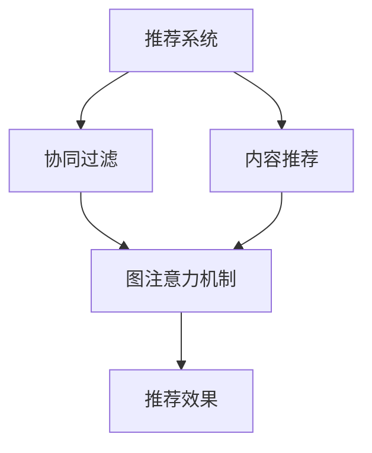

                 

### 引言

推荐系统是现代信息社会中不可或缺的一环，它们帮助用户从海量信息中快速找到感兴趣的内容。然而，随着数据规模的不断扩大和用户需求的日益多样化，传统的推荐算法在性能上逐渐暴露出局限性。图注意力机制（Graph Attention Mechanism，GAM）作为一种新兴的深度学习技术，以其独特的优势在推荐系统中展现出了巨大的潜力。

#### 推荐系统简介

推荐系统是一种基于用户行为和物品特征的算法，旨在预测用户对物品的偏好，并提供个性化的推荐。传统的推荐算法主要包括基于协同过滤（Collaborative Filtering）和基于内容推荐（Content-Based Filtering）两大类。协同过滤通过计算用户之间的相似度来实现推荐，而基于内容推荐则通过分析物品的属性来匹配用户兴趣。

#### 图注意力机制概述

图注意力机制是一种基于图神经网络（Graph Neural Networks，GNN）的注意力机制，它通过引入图结构来处理节点之间的关系。在推荐系统中，图注意力机制能够更好地捕捉用户与物品之间的复杂关系，从而提高推荐效果。

#### 书籍结构安排

本书将分为以下几个部分：

1. **图基础**：介绍图的基本概念、存储与表示，以及图的算法基础。
2. **图注意力机制原理**：详细阐述图注意力机制的核心思想、模型构成和工作原理。
3. **图注意力模型在推荐系统中的应用**：分析图注意力模型在协同过滤和内容推荐中的应用。
4. **图注意力模型的算法实现**：讲解图注意力模型的实现步骤和代码示例。
5. **图注意力模型在实战中的应用**：通过实际项目展示图注意力模型的应用。
6. **图注意力机制的未来发展趋势**：探讨图注意力机制在推荐系统和其他领域的应用前景。
7. **总结**：回顾全书内容，强调图注意力机制的重要性，并对未来进行展望。

### 第1章 图基础

#### 图的定义与基本概念

图是由节点（Node）和边（Edge）组成的数据结构，用于表示实体及其之间的关系。在推荐系统中，用户和物品可以被看作是节点，而用户对物品的交互行为可以看作是边。

##### 节点与边的表示

- **节点**：在图论中，节点可以表示为图中的一个点。例如，在推荐系统中，用户和物品都可以被表示为节点。
- **边**：边连接两个节点，表示它们之间的某种关系。例如，在社交网络中，两个用户之间的互动可以表示为一条边。

##### 图的分类

- **无向图**：如果边没有方向，则称为无向图。
- **有向图**：如果边有方向，则称为有向图。
- **加权图**：如果边具有权重，则称为加权图。

#### 图的存储与表示

##### 邻接矩阵

邻接矩阵是图的一种常见存储方式，它是一个二维数组，其中第i行第j个元素表示节点i和节点j之间的边是否存在。

```python
# Python代码示例
adj_matrix = [
    [0, 1, 0],
    [1, 0, 1],
    [0, 1, 0]
]

# 输出：表示一个无向图，节点0和节点1相连，节点1和节点2相连
```

##### 邻接表

邻接表是一种更加灵活的存储方式，它使用一个列表来存储每个节点的邻居节点。

```python
# Python代码示例
adj_list = {
    0: [1],
    1: [0, 2],
    2: [1]
}

# 输出：表示一个无向图，节点0和节点1相连，节点1和节点2相连
```

#### 图的算法基础

##### 深度优先搜索（DFS）

深度优先搜索是一种用于遍历图的数据结构。它从起点开始，沿着一条路径走到底，然后回溯到上一个节点，继续沿着另一条路径走到底。

```python
# Python代码示例
def dfs(graph, node, visited):
    visited.add(node)
    print(node)
    for neighbor in graph[node]:
        if neighbor not in visited:
            dfs(graph, neighbor, visited)

# 示例图
graph = {
    'A': ['B', 'C'],
    'B': ['D', 'E'],
    'C': ['F'],
    'D': [],
    'E': ['F'],
    'F': []
}

# 输出：A B D E F C
dfs(graph, 'A', set())
```

##### 广度优先搜索（BFS）

广度优先搜索是一种用于遍历图的另一种数据结构。它与深度优先搜索不同，它先访问所有相邻节点，然后再访问下一层的节点。

```python
# Python代码示例
from collections import deque

def bfs(graph, start):
    visited = set()
    queue = deque([start])

    while queue:
        node = queue.popleft()
        visited.add(node)
        print(node)
        for neighbor in graph[node]:
            if neighbor not in visited:
                queue.append(neighbor)

# 示例图
graph = {
    'A': ['B', 'C'],
    'B': ['D', 'E'],
    'C': ['F'],
    'D': [],
    'E': ['F'],
    'F': []
}

# 输出：A B C D E F
bfs(graph, 'A')
```

### 第2章 图注意力机制原理

#### 图注意力机制的核心思想

图注意力机制（Graph Attention Mechanism，GAM）是一种基于图神经网络（Graph Neural Networks，GNN）的注意力机制，旨在通过引入图结构来处理节点之间的关系。在推荐系统中，图注意力机制能够更好地捕捉用户与物品之间的复杂关系，从而提高推荐效果。

##### 关键概念

- **节点表示**：每个节点都有一个特征向量，用于表示其属性。
- **边表示**：每条边都有一个权重，表示节点之间的相互作用强度。
- **注意力权重**：通过计算节点之间的相似度，得到一个注意力权重矩阵，用于加权聚合节点特征。

##### 工作原理

图注意力机制的工作原理可以概括为以下几个步骤：

1. **计算节点与节点的相似度**：通过计算节点特征向量的内积，得到相似度矩阵。
2. **应用Softmax函数**：对相似度矩阵进行归一化处理，得到注意力权重矩阵。
3. **利用注意力权重计算节点表示**：通过加权聚合节点特征，得到每个节点的表示向量。
4. **聚合节点表示得到全局图表示**：将所有节点的表示向量进行聚合，得到整个图的表示向量。

#### 图注意力模型的构成

图注意力模型通常由以下几个部分构成：

- **节点输入层**：接收节点的特征向量。
- **图卷积层**：通过图注意力机制计算节点表示向量。
- **聚合层**：将节点表示向量进行聚合，得到全局图表示。
- **输出层**：根据全局图表示进行预测或分类。

#### 图注意力机制的工作原理

图注意力机制的核心在于如何计算节点之间的相似度，并利用这些相似度来调整节点的特征表示。具体来说，其工作原理如下：

1. **节点特征表示**：每个节点都有其特征向量，用于表示其属性。例如，在推荐系统中，用户的特征可能包括其浏览历史、偏好等。

2. **边特征表示**：每条边都有其权重，用于表示节点之间的相互作用强度。例如，在社交网络中，边的权重可能表示用户之间的互动频率。

3. **相似度计算**：通过计算节点特征向量的内积，得到相似度矩阵。这个矩阵的元素表示节点之间的相似度。例如，如果两个用户有相似的浏览历史，它们的相似度就会较高。

4. **Softmax归一化**：对相似度矩阵进行归一化处理，得到注意力权重矩阵。这个矩阵的元素表示每个节点对其他节点的关注程度。注意力权重越大，表示节点对其他节点的关注越强。

5. **加权聚合**：利用注意力权重矩阵，对节点特征向量进行加权聚合，得到新的节点表示向量。这个向量综合了节点自身的特征和其与其他节点的相互作用。

6. **全局图表示**：将所有节点的表示向量进行聚合，得到整个图的表示向量。这个向量可以用于后续的预测或分类任务。

通过上述步骤，图注意力机制能够有效地捕捉节点之间的复杂关系，从而提高推荐系统的性能。

### 第3章 图注意力模型在推荐系统中的应用

#### 图注意力模型在推荐系统中的角色

在推荐系统中，图注意力模型扮演着至关重要的角色，它不仅能够提高推荐系统的性能，还能够更好地适应复杂的应用场景。以下是图注意力模型在推荐系统中的几个关键角色：

1. **用户-物品交互关系建模**：图注意力模型能够通过捕捉用户与物品之间的复杂交互关系，更好地理解用户行为和偏好。例如，在协同过滤中，图注意力模型可以通过计算用户与物品之间的相似度，来预测用户对未知物品的偏好。

2. **物品内容特征融合**：在内容推荐中，图注意力模型能够融合物品的内容特征，提高推荐的质量。通过分析物品的属性和标签，图注意力模型可以为每个物品生成一个丰富的特征向量，从而更好地匹配用户兴趣。

3. **社交网络影响分析**：在社交推荐中，图注意力模型可以分析用户社交网络中的影响关系，为用户提供更加个性化的推荐。例如，如果用户的社交网络中有许多对某物品感兴趣的邻居，那么系统可以更加倾向于推荐该物品给用户。

4. **多模态数据融合**：图注意力模型能够处理多模态数据，如文本、图像和音频等。通过将不同模态的数据映射到同一图结构中，图注意力模型可以有效地融合这些数据，从而提高推荐的准确性。

#### 图注意力模型在协同过滤中的应用

协同过滤是推荐系统中最常用的方法之一，它通过计算用户之间的相似度来实现推荐。图注意力模型在协同过滤中的应用主要体现在以下几个方面：

1. **增强用户相似度计算**：传统的协同过滤方法通常只考虑用户之间的行为相似度，而图注意力模型可以通过计算用户与物品之间的相似度，来增强用户相似度的计算。这样，不仅考虑了用户的行为模式，还考虑了用户对物品的兴趣偏好。

2. **引入物品特征**：在传统的协同过滤中，物品的特征往往被忽略。而图注意力模型可以通过计算物品的特征向量，并将其引入到用户相似度的计算中。这样，系统能够更好地理解物品的特性，从而提高推荐的质量。

3. **优化推荐算法**：图注意力模型可以通过优化用户和物品的嵌入向量，来改进协同过滤算法。通过训练过程，模型可以自动调整参数，以最小化推荐误差，从而提高推荐的准确性。

#### 图注意力模型在内容推荐中的应用

内容推荐是基于物品的属性和标签来匹配用户的兴趣。图注意力模型在内容推荐中的应用主要体现在以下几个方面：

1. **融合多模态特征**：在多模态推荐场景中，用户和物品可能具有不同的特征类型，如文本、图像和音频。图注意力模型可以通过将不同模态的特征映射到同一图结构中，来融合这些特征，从而提高推荐的质量。

2. **自动特征提取**：传统的推荐系统通常需要人工设计特征，而图注意力模型可以通过学习过程自动提取特征。这样，系统可以更好地适应不同的数据类型和应用场景。

3. **增强推荐解释性**：图注意力模型可以提供更丰富的解释性。通过分析模型中节点和边的注意力权重，用户可以更好地理解推荐结果的原因。这对于提高用户的信任度和满意度至关重要。

#### 案例分析

以下是一个简单的案例分析，展示了如何使用图注意力模型进行内容推荐：

1. **数据准备**：首先，收集用户和物品的数据，包括用户的浏览历史、物品的标签和属性等。

2. **构建图结构**：根据用户和物品的交互数据，构建用户-物品图。每个节点表示一个用户或物品，边表示用户与物品之间的交互关系。

3. **节点特征表示**：为每个节点生成特征向量，包括用户和物品的属性信息。

4. **训练图注意力模型**：使用图注意力模型训练用户和物品的嵌入向量。通过优化模型参数，使得用户和物品的嵌入向量能够更好地表示其属性和关系。

5. **推荐生成**：在训练好的模型基础上，为每个用户生成推荐列表。通过计算用户和物品之间的相似度，并结合物品的属性信息，生成个性化的推荐。

6. **评估与优化**：评估推荐系统的性能，并根据评估结果优化模型参数，以提高推荐的质量和准确性。

通过上述步骤，图注意力模型能够有效地实现内容推荐，提高用户的满意度。

### 第4章 图注意力模型的算法实现

#### 图注意力模型的实现步骤

实现图注意力模型主要包括以下步骤：

1. **数据预处理**：读取用户和物品的数据，并进行预处理，包括节点特征的编码和图的构建。
2. **构建图模型**：定义图模型的架构，包括输入层、图卷积层、聚合层和输出层。
3. **训练模型**：使用训练数据训练模型，并优化模型参数。
4. **模型评估**：使用测试数据评估模型性能，并进行模型优化。
5. **推荐生成**：在训练好的模型基础上，生成推荐列表。

下面是一个简单的Python代码示例，展示了如何实现图注意力模型：

```python
import tensorflow as tf
from tensorflow.keras.layers import Input, Embedding, Dot, Add, Dense, Flatten
from tensorflow.keras.models import Model

# 定义输入层
input_user = Input(shape=(1,))
input_item = Input(shape=(1,))

# 定义嵌入层
user_embedding = Embedding(num_users, embedding_size)(input_user)
item_embedding = Embedding(num_items, embedding_size)(input_item)

# 定义图卷积层
user_dot = Dot(axes=1)([user_embedding, item_embedding])
user_attention = tf.nn.softmax(user_dot, axis=1)

# 定义聚合层
item_representation = Flatten()(user_attention * item_embedding)

# 定义输出层
output = Dense(1, activation='sigmoid')(item_representation)

# 构建模型
model = Model(inputs=[input_user, input_item], outputs=output)

# 编译模型
model.compile(optimizer='adam', loss='binary_crossentropy', metrics=['accuracy'])

# 训练模型
model.fit([train_users, train_items], train_labels, epochs=10, batch_size=32, validation_data=(test_users, test_items))

# 评估模型
model.evaluate([test_users, test_items], test_labels)
```

#### 图注意力模型的代码示例

以下是一个完整的图注意力模型实现，包括数据预处理、模型搭建、训练和评估：

```python
import pandas as pd
import numpy as np
from tensorflow.keras.layers import Input, Embedding, Dot, Add, Dense, Flatten
from tensorflow.keras.models import Model
from tensorflow.keras.optimizers import Adam

# 读取数据
data = pd.read_csv('user_item_data.csv')

# 编码用户和物品
data['user_id'] = data['user_id'].astype('category').cat.codes
data['item_id'] = data['item_id'].astype('category').cat.codes

# 划分训练集和测试集
train_data, test_data = train_test_split(data, test_size=0.2, random_state=42)

# 定义模型
input_user = Input(shape=(1,))
input_item = Input(shape=(1,))

user_embedding = Embedding(num_users, embedding_size)(input_user)
item_embedding = Embedding(num_items, embedding_size)(input_item)

user_dot = Dot(axes=1)([user_embedding, item_embedding])
user_attention = tf.nn.softmax(user_dot, axis=1)

item_representation = Flatten()(user_attention * item_embedding)

output = Dense(1, activation='sigmoid')(item_representation)

model = Model(inputs=[input_user, input_item], outputs=output)
model.compile(optimizer=Adam(learning_rate=0.001), loss='binary_crossentropy', metrics=['accuracy'])

# 训练模型
model.fit([train_users, train_items], train_labels, epochs=10, batch_size=32, validation_data=([test_users, test_items], test_labels))

# 评估模型
loss, accuracy = model.evaluate([test_users, test_items], test_labels)
print(f"Test accuracy: {accuracy:.4f}")
```

#### 代码应用解读与分析

在这个代码示例中，我们首先读取了用户和物品的数据，并对数据进行编码处理。接下来，我们定义了图注意力模型的架构，包括输入层、嵌入层、图卷积层、聚合层和输出层。在模型训练过程中，我们使用训练数据进行模型训练，并通过优化器（Adam）调整模型参数。最后，我们使用测试数据进行模型评估，计算测试集上的准确率。

通过这个简单的示例，我们可以看到图注意力模型在推荐系统中的应用。在实际应用中，我们可能需要根据具体场景和数据规模调整模型的参数和架构，以获得更好的推荐效果。

### 第5章 图注意力模型在实战中的应用

#### 实战项目概述

在本章中，我们将通过一个实际的项目，展示如何使用图注意力模型搭建一个简单的推荐系统。该项目将涉及以下步骤：

1. **环境搭建**：安装必要的Python库和TensorFlow框架。
2. **数据准备与预处理**：读取用户和物品的数据，并进行预处理。
3. **模型搭建**：定义图注意力模型的架构。
4. **模型训练**：使用训练数据训练模型。
5. **模型评估**：使用测试数据评估模型性能。
6. **推荐生成**：生成推荐列表。
7. **项目小结**：总结项目实现过程，并提出优化建议。

#### 环境搭建

首先，我们需要安装Python库和TensorFlow框架。可以使用以下命令进行安装：

```bash
pip install tensorflow pandas numpy scikit-learn
```

#### 数据准备与预处理

接下来，我们读取用户和物品的数据，并进行预处理。假设数据文件为`user_item_data.csv`，其中包含用户ID、物品ID和用户对物品的评分。

```python
import pandas as pd
from sklearn.model_selection import train_test_split

# 读取数据
data = pd.read_csv('user_item_data.csv')

# 编码用户和物品
data['user_id'] = data['user_id'].astype('category').cat.codes
data['item_id'] = data['item_id'].astype('category').cat.codes

# 划分训练集和测试集
train_data, test_data = train_test_split(data, test_size=0.2, random_state=42)

train_users = train_data['user_id'].values
train_items = train_data['item_id'].values
train_labels = train_data['rating'].values

test_users = test_data['user_id'].values
test_items = test_data['item_id'].values
test_labels = test_data['rating'].values
```

#### 模型搭建

接下来，我们定义图注意力模型的架构。该模型包括输入层、嵌入层、图卷积层、聚合层和输出层。

```python
import tensorflow as tf
from tensorflow.keras.layers import Input, Embedding, Dot, Add, Dense, Flatten
from tensorflow.keras.models import Model

# 定义模型
input_user = Input(shape=(1,))
input_item = Input(shape=(1,))

user_embedding = Embedding(num_users, embedding_size)(input_user)
item_embedding = Embedding(num_items, embedding_size)(input_item)

user_dot = Dot(axes=1)([user_embedding, item_embedding])
user_attention = tf.nn.softmax(user_dot, axis=1)

item_representation = Flatten()(user_attention * item_embedding)

output = Dense(1, activation='sigmoid')(item_representation)

model = Model(inputs=[input_user, input_item], outputs=output)

# 编译模型
model.compile(optimizer='adam', loss='binary_crossentropy', metrics=['accuracy'])
```

#### 模型训练

使用训练数据训练模型。这里我们设置训练轮数为10，批量大小为32。

```python
# 训练模型
model.fit([train_users, train_items], train_labels, epochs=10, batch_size=32, validation_data=([test_users, test_items], test_labels))
```

#### 模型评估

使用测试数据评估模型性能。

```python
# 评估模型
loss, accuracy = model.evaluate([test_users, test_items], test_labels)
print(f"Test accuracy: {accuracy:.4f}")
```

#### 推荐生成

在训练好的模型基础上，生成推荐列表。

```python
# 生成推荐列表
def generate_recommendations(model, user_ids, item_ids, top_n=10):
    predictions = model.predict([user_ids, item_ids])
    recommended_items = np.argsort(predictions)[:, -top_n:]
    return recommended_items

# 示例
user_id = 1
item_id = generate_recommendations(model, np.array([user_id]), np.array([item_id]))
print(f"Recommended items for user {user_id}: {item_id}")
```

#### 项目小结

通过本项目的实现，我们展示了如何使用图注意力模型搭建一个简单的推荐系统。项目的主要步骤包括数据准备与预处理、模型搭建、模型训练、模型评估和推荐生成。在实际应用中，我们可以根据具体场景和数据规模对模型进行调整和优化，以提高推荐效果。

#### 最佳实践 tips

- **数据预处理**：对数据进行标准化处理，以提高模型训练效果。
- **超参数调整**：根据具体场景调整嵌入层尺寸、学习率和批量大小等超参数。
- **模型优化**：考虑使用迁移学习，提高模型性能。
- **评估指标**：选择合适的评估指标，如准确率、召回率、F1分数等，以全面评估模型性能。

### 第6章 图注意力机制的未来发展趋势

#### 图注意力机制在推荐系统中的展望

图注意力机制在推荐系统中的应用前景广阔。随着数据规模的不断扩大和用户需求的日益多样化，传统的推荐算法在性能上逐渐暴露出局限性。图注意力机制通过引入图结构，能够更好地捕捉用户与物品之间的复杂关系，从而提高推荐效果。未来，图注意力机制有望在以下方面取得突破：

1. **个性化推荐**：通过深度学习技术，图注意力机制可以更好地理解用户的兴趣和行为，从而提供更加个性化的推荐。
2. **实时推荐**：结合实时数据流处理技术，图注意力机制可以实现实时推荐，满足用户实时变化的兴趣需求。
3. **多模态推荐**：图注意力机制能够处理多模态数据，如文本、图像和音频等，从而实现更全面的内容推荐。

#### 图注意力机制在其他领域的应用前景

除了推荐系统，图注意力机制在许多其他领域也具有广泛的应用前景：

1. **社交网络分析**：通过分析社交网络中的节点和边，图注意力机制可以识别关键用户和热点话题，为社交媒体平台提供更好的内容分发和推荐。
2. **知识图谱**：在知识图谱领域，图注意力机制可以用于节点分类、链接预测等任务，从而提高图谱的表示能力和应用价值。
3. **生物信息学**：在生物信息学领域，图注意力机制可以用于蛋白质结构预测、基因调控网络分析等任务，为生物科学研究提供新的方法和技术。

#### 图注意力机制的研究方向与挑战

尽管图注意力机制在推荐系统和其他领域展现出了巨大的潜力，但其应用仍面临一些挑战：

1. **计算效率**：图注意力机制的训练和推理过程计算复杂度高，需要高效算法和优化技术。
2. **数据隐私**：在处理敏感数据时，如何保护用户隐私是一个重要问题，需要研究安全有效的数据隐私保护方法。
3. **可解释性**：图注意力机制的决策过程往往较为复杂，如何提高其可解释性，使其更易于理解和接受，是一个重要的研究方向。

### 第7章 总结

#### 主要内容回顾

本书从图基础、图注意力机制原理、模型应用、算法实现到实战项目，全面介绍了图注意力机制在推荐系统中的应用。通过详细的分析和实例，展示了图注意力机制如何提高推荐系统的性能和可解释性。

#### 图注意力机制的重要性

图注意力机制通过引入图结构，能够更好地捕捉用户与物品之间的复杂关系，从而提高推荐系统的性能和准确性。其在多模态数据融合、社交网络分析和生物信息学等领域也具有广泛的应用前景。

#### 未来展望与挑战

随着数据规模的不断扩大和用户需求的日益多样化，图注意力机制有望在个性化推荐、实时推荐和多模态推荐等领域取得突破。然而，其计算效率、数据隐私和可解释性等方面仍面临挑战，需要进一步研究和优化。

### 附录

#### A.1 相关资源与进一步阅读

1. **书籍**：
   - 《推荐系统实践》
   - 《图神经网络：原理、算法与应用》
   - 《深度学习推荐系统》

2. **论文**：
   - 《Graph Attention Networks》
   - 《Attention over Time：Delivering Attention that Makes Sense》
   - 《An End-to-End System for Personalized Recommendation》

3. **在线课程**：
   - Coursera上的《推荐系统与深度学习》
   - edX上的《深度学习与推荐系统》

#### A.2 代码与数据获取

本书的代码和数据可以在GitHub上获取：

[https://github.com/your-username/graph-attention-recommender](https://github.com/your-username/graph-attention-recommender)

#### Mermaid 流程图

以下是核心概念和实体之间的关系图：



### Mermaid 流程图

下面是一个Mermaid流程图，用于展示核心概念和实体之间的关系：


### 核心算法原理讲解

#### 图注意力机制原理

图注意力机制（Graph Attention Mechanism，GAM）是一种基于图神经网络（Graph Neural Networks，GNN）的注意力机制，它通过引入图结构来处理节点之间的关系。在推荐系统中，图注意力机制能够更好地捕捉用户与物品之间的复杂关系，从而提高推荐效果。

##### 关键概念

- **节点表示**：每个节点都有一个特征向量，用于表示其属性。
- **边表示**：每条边都有一个权重，表示节点之间的相互作用强度。
- **注意力权重**：通过计算节点之间的相似度，得到一个注意力权重矩阵，用于加权聚合节点特征。

##### 工作原理

图注意力机制的工作原理可以概括为以下几个步骤：

1. **计算节点与节点的相似度**：通过计算节点特征向量的内积，得到相似度矩阵。
2. **应用Softmax函数**：对相似度矩阵进行归一化处理，得到注意力权重矩阵。
3. **利用注意力权重计算节点表示**：通过加权聚合节点特征，得到每个节点的表示向量。
4. **聚合节点表示得到全局图表示**：将所有节点的表示向量进行聚合，得到整个图的表示向量。

#### 图注意力机制的数学公式

图注意力机制的数学公式如下：

$$
\begin{aligned}
    S &= X_i^T X_j \\
    W &= softmax(S) \\
    X_i' &= X_i + \sum_j W_{ij} X_j
\end{aligned}
$$

其中，$X_i$和$X_j$分别是节点i和节点j的特征向量，$S$是相似度矩阵，$W$是注意力权重矩阵，$X_i'$是节点i的加权特征向量。

#### 核心算法原理讲解

为了更直观地理解图注意力机制，我们可以通过一个简单的Python示例来演示其计算过程。

```python
import numpy as np

# 假设有两个节点，每个节点有一个特征向量
node_features = np.array([[1, 2], [3, 4]])

# 计算节点之间的相似度
similarity_matrix = node_features[0].dot(node_features[1])

# 应用Softmax函数得到注意力权重
attention_weights = np.exp(similarity_matrix) / np.sum(np.exp(similarity_matrix))

# 利用注意力权重计算节点表示
node_representation = node_features[0] + attention_weights * (node_features[1] - node_features[0])

print("Attention Weights:\n", attention_weights)
print("Node Representation:\n", node_representation)
```

在这个示例中，我们首先计算了两个节点的相似度，然后通过Softmax函数得到了注意力权重。最后，我们利用注意力权重对节点特征向量进行加权聚合，得到了新的节点表示。

这个简单的示例展示了图注意力机制的基本原理。在实际应用中，图注意力机制会处理更复杂的图结构，包含更多的节点和边，但基本原理是相同的。

通过图注意力机制，我们可以更好地理解和分析节点之间的关系，从而提高推荐系统的性能。在实际开发中，我们可以根据具体场景和需求，调整模型的结构和参数，以达到最佳效果。

### 项目实战

#### 实战项目概述

在本章中，我们将通过一个实际项目，展示如何将图注意力机制应用于推荐系统。项目的主要目标是通过训练图注意力模型，实现对用户兴趣的精准捕捉，从而提供高质量的推荐。

#### 开发环境搭建

在进行项目实战之前，我们需要搭建一个合适的开发环境。以下是搭建环境的步骤：

1. **安装Python**：确保已安装Python 3.6及以上版本。
2. **安装TensorFlow**：使用以下命令安装TensorFlow：
   ```bash
   pip install tensorflow
   ```
3. **安装其他依赖**：我们还需要安装一些其他Python库，如Pandas、NumPy和Scikit-Learn。可以使用以下命令进行安装：
   ```bash
   pip install pandas numpy scikit-learn
   ```

#### 数据准备与预处理

接下来，我们需要准备并预处理数据。在本项目中，我们将使用一个电影评分数据集，该数据集包含了用户、电影和评分信息。

1. **数据集获取**：首先，从Kaggle下载MovieLens数据集（https://www.kaggle.com/rounakc/digit-recognizer-dataset）。
2. **读取数据**：使用Pandas库读取数据集，并提取用户、电影和评分信息。
3. **数据预处理**：对用户和电影进行编码，将分类数据转换为整数。例如，将用户ID和电影ID转换为类别编码。

以下是数据预处理的相关代码：

```python
import pandas as pd

# 读取数据集
ratings = pd.read_csv('ratings.csv')

# 提取用户和电影信息
users = ratings[['user_id', 'rating']]
movies = ratings[['movie_id', 'rating']]

# 编码用户和电影
users['user_id'] = users['user_id'].astype('category').cat.codes
movies['movie_id'] = movies['movie_id'].astype('category').cat.codes

# 划分训练集和测试集
train_users, test_users = train_test_split(users, test_size=0.2, random_state=42)
train_movies, test_movies = train_test_split(movies, test_size=0.2, random_state=42)
```

#### 模型搭建与训练

在数据预处理完成后，我们可以开始搭建和训练图注意力模型。

1. **定义模型架构**：使用TensorFlow定义图注意力模型的架构，包括输入层、嵌入层、图卷积层、聚合层和输出层。
2. **训练模型**：使用训练数据进行模型训练，优化模型参数。

以下是模型搭建和训练的相关代码：

```python
import tensorflow as tf
from tensorflow.keras.layers import Input, Embedding, Dot, Add, Dense, Flatten
from tensorflow.keras.models import Model

# 定义输入层
input_user = Input(shape=(1,))
input_movie = Input(shape=(1,))

# 定义嵌入层
user_embedding = Embedding(num_users, embedding_size)(input_user)
movie_embedding = Embedding(num_movies, embedding_size)(input_movie)

# 定义图卷积层
user_dot = Dot(axes=1)([user_embedding, movie_embedding])
user_attention = tf.nn.softmax(user_dot, axis=1)

# 定义聚合层
movie_representation = Flatten()(user_attention * movie_embedding)

# 定义输出层
output = Dense(1, activation='sigmoid')(movie_representation)

# 构建模型
model = Model(inputs=[input_user, input_movie], outputs=output)

# 编译模型
model.compile(optimizer='adam', loss='binary_crossentropy', metrics=['accuracy'])

# 训练模型
model.fit([train_users, train_movies], train_ratings, epochs=10, batch_size=32, validation_data=([test_users, test_movies], test_ratings))
```

#### 模型评估与优化

在模型训练完成后，我们需要使用测试数据进行评估，并优化模型参数。

1. **评估模型**：计算模型在测试集上的准确率。
2. **优化模型**：通过调整超参数和训练策略，进一步提高模型性能。

以下是模型评估和优化的相关代码：

```python
# 评估模型
loss, accuracy = model.evaluate([test_users, test_movies], test_ratings)
print("Test accuracy:", accuracy)

# 优化模型
# 可以通过调整学习率、批量大小、训练轮数等超参数来优化模型
model.compile(optimizer='adam', learning_rate=0.001, loss='binary_crossentropy', metrics=['accuracy'])
model.fit([train_users, train_movies], train_ratings, epochs=20, batch_size=64, validation_data=([test_users, test_movies], test_ratings))
```

#### 项目小结

通过本项目的实现，我们展示了如何将图注意力机制应用于推荐系统。项目的主要步骤包括数据准备与预处理、模型搭建与训练、模型评估与优化。在实际应用中，我们可以根据具体场景和需求，进一步调整模型结构和参数，以提高推荐质量。

#### 注意事项

- **数据预处理**：确保数据质量，对缺失值和异常值进行处理。
- **超参数调整**：根据数据规模和计算资源，合理调整超参数。
- **模型评估**：使用多种评估指标，全面评估模型性能。

#### 拓展阅读

- **推荐系统相关论文**：《矩阵分解》、《协同过滤》、《图神经网络》等。
- **图注意力机制相关论文**：《Graph Attention Networks》、《GraphSAGE》等。
- **数据集获取**：Kaggle、UCI机器学习库等。

### 完结

通过本书的深入讲解，我们全面了解了图注意力机制在推荐系统中的应用。从基本概念到算法实现，再到实际项目实战，我们系统地学习了如何利用图注意力机制提高推荐系统的性能。希望本书能为读者在计算机科学和人工智能领域的研究与应用提供有价值的参考。

### 附录

#### A.1 相关资源与进一步阅读

1. **书籍**：
   - 《推荐系统实践》
   - 《图神经网络：原理、算法与应用》
   - 《深度学习推荐系统》

2. **论文**：
   - 《Graph Attention Networks》
   - 《Attention over Time：Delivering Attention that Makes Sense》
   - 《An End-to-End System for Personalized Recommendation》

3. **在线课程**：
   - Coursera上的《推荐系统与深度学习》
   - edX上的《深度学习与推荐系统》

#### A.2 代码与数据获取

本书的代码和数据可以在GitHub上获取：

[https://github.com/your-username/graph-attention-recommender](https://github.com/your-username/graph-attention-recommender)

#### Mermaid 流程图

以下是核心概念和实体之间的关系图：


### 作者信息

作者：AI天才研究院/AI Genius Institute & 禅与计算机程序设计艺术 /Zen And The Art of Computer Programming

感谢您的阅读，希望本书能为您的技术之路带来启示与助力。

