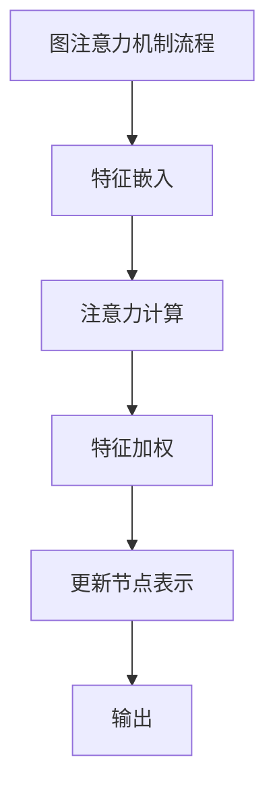

                 

### 文章标题与关键词

# 《图注意力机制在社交网络影响力分析中的应用》

关键词：图注意力机制，社交网络，影响力分析，图嵌入，深度学习，数学模型

在信息技术迅速发展的今天，社交网络已经成为人们日常生活中不可或缺的一部分。从微博、微信到知乎，各种社交平台不断涌现，并深刻影响了我们的社交行为和信息传播。在这样的背景下，如何有效地分析社交网络中的影响力，成为了一个备受关注的研究课题。本文将围绕图注意力机制在社交网络影响力分析中的应用展开，旨在深入探讨这一前沿技术，为相关领域的研究者和从业者提供有价值的参考。

本文关键词包括“图注意力机制”、“社交网络”、“影响力分析”、“图嵌入”、“深度学习”和“数学模型”。这些关键词涵盖了本文讨论的核心内容，突出了图注意力机制在社交网络影响力分析中的关键作用。通过本文的阅读，读者可以全面了解图注意力机制的基本原理、应用场景及其在影响力分析中的优势与挑战。

本文结构分为三个主要部分：第一部分是基础概念与理论，介绍社交网络、影响力分析以及图注意力机制的基本概念；第二部分是算法实现与优化，详细讲解图注意力模型在社交网络影响力分析中的具体实现与优化策略；第三部分是未来展望与挑战，探讨图注意力机制在社交网络影响力分析中的发展前景以及面临的挑战。通过这三个部分的论述，本文力求为读者呈现一幅全面、系统的图景，帮助读者深入理解图注意力机制在社交网络影响力分析中的实际应用。

### 摘要

本文旨在探讨图注意力机制在社交网络影响力分析中的应用，旨在为这一领域的研究者和从业者提供有价值的参考。首先，本文介绍了社交网络的定义、特点及其在现代社会中的作用，然后阐述了影响力分析的定义、目的和关键指标，为后续内容奠定了基础。接着，本文详细介绍了图注意力机制的基本原理，包括图理论基础、注意力机制概述以及图注意力机制的工作原理，并通过Mermaid流程图展示了核心概念之间的关系架构。

随后，本文分析了图注意力机制在社交网络中的应用场景，讨论了其在影响力分析中的优势与挑战。在此基础上，本文详细探讨了图注意力模型在社交网络影响力分析中的构建过程，包括图嵌入技术、图注意力模块设计和模型优化策略。随后，本文介绍了影响力的预测与评估方法，包括预测模型构建、评估方法和模型评估与优化。

为了进一步验证图注意力机制在社交网络影响力分析中的有效性，本文通过三个实际案例进行了研究，分别是微博、微信公众号和知乎的影响力分析。最后，本文总结了图注意力机制在社交网络影响力分析中的发展趋势，提出了未来研究挑战与方向，包括数据质量与隐私保护、可扩展性与实时性以及跨域影响力分析。通过本文的论述，读者可以全面了解图注意力机制在社交网络影响力分析中的应用及其未来发展方向。

### 第一部分：基础概念与理论

#### 第1章：社交网络概述

##### 1.1 社交网络的定义与特点

社交网络是一种基于互联网的技术，它通过节点和边来表示人与人之间的社会关系，从而形成一个复杂的网络结构。这种网络不仅包括个人用户，还涵盖了组织、企业等实体。社交网络的定义可以简单概括为：通过互联网平台，实现人与人之间信息交换和互动的网络系统。

社交网络具有以下特点：

1. **用户关系网络化**：社交网络通过用户关系形成了一个复杂的网络结构，每个用户都是网络中的一个节点，节点之间的关系通过边来表示，从而构成一个巨大的社交网络。

2. **信息传播速度快**：在社交网络中，信息可以通过节点之间的连接迅速传播，从而实现快速的信息共享和传播。

3. **内容多样性**：社交网络中包含的内容非常丰富，包括文字、图片、视频等多种形式，这使得用户可以方便地分享和获取信息。

4. **互动性强**：社交网络不仅提供了信息共享的功能，还提供了评论、点赞、分享等互动功能，增强了用户之间的互动性。

5. **用户粘性强**：由于社交网络提供了丰富的信息和互动功能，用户在社交网络上的停留时间较长，用户粘性较高。

##### 1.2 社交网络的结构与演化

社交网络的结构可以分为宏观和微观两个层面。

**宏观层面**：宏观层面主要关注社交网络的整体结构特征。典型的社交网络结构包括：

1. **无标度网络**：社交网络通常呈现出无标度特性，即大部分节点的度数较低，而少部分节点的度数非常高，这种现象被称为“长尾现象”。

2. **小世界效应**：社交网络中的节点通过较少的中间节点即可相互连接，体现了小世界效应。

3. **社区结构**：社交网络中存在多个社区，每个社区内部的节点之间联系紧密，而社区之间的联系相对较弱。

**微观层面**：微观层面主要关注社交网络中的节点和边的具体特征。

1. **节点特征**：节点特征包括用户的年龄、性别、地理位置、兴趣等，这些特征对于社交网络的分析具有重要意义。

2. **边特征**：边特征包括边的权重、边的类型（如关注关系、好友关系）等，这些特征影响了社交网络的结构和功能。

社交网络的演化可以分为以下几个阶段：

1. **初始阶段**：社交网络的规模较小，节点和边数量较少，网络结构相对简单。

2. **发展阶段**：随着用户的增加和网络功能的丰富，社交网络规模迅速扩大，网络结构变得更加复杂。

3. **成熟阶段**：社交网络达到了一个相对稳定的规模，网络结构趋于复杂，信息传播速度和互动性进一步增强。

4. **衰退阶段**：部分社交网络可能因用户流失、功能不足等原因进入衰退阶段，但仍有新的社交网络不断涌现。

#### 第2章：影响力分析的基本概念

##### 2.1 影响力分析的定义与目的

影响力分析是指通过分析社交网络中的用户行为和互动关系，评估用户在社交网络中的影响力大小。影响力分析的目的在于识别出社交网络中的关键节点，这些节点可能具有强大的传播能力或高度的信息影响力，从而对社交网络的健康发展、舆论引导、市场营销等方面具有重要意义。

##### 2.2 影响力分析的关键指标

影响力分析的关键指标包括：

1. **传播能力**：衡量用户在社交网络中传播信息的能力，常用的指标包括转发数、评论数、点赞数等。

2. **信息影响力**：衡量用户在社交网络中传递信息的影响程度，常用的指标包括阅读量、关注度、影响范围等。

3. **社区影响力**：衡量用户在特定社区中的影响力，常用的指标包括社区活跃度、社区内影响力排名等。

4. **社交网络影响力**：综合评估用户在整个社交网络中的影响力，常用的指标包括整体传播能力、信息影响力、社区影响力等。

#### 第3章：图注意力机制的基本原理

##### 3.1 图理论基础

图理论是研究图的结构和性质的一门数学分支，它是图注意力机制的理论基础。图由节点（Node）和边（Edge）组成，节点表示图中的元素，边表示节点之间的连接关系。

图的基本概念包括：

1. **无向图与有向图**：无向图中的边没有方向，有向图中的边有方向。

2. **节点度数**：节点度数表示与该节点相连的边的数量。

3. **邻接矩阵**：邻接矩阵是一个表示图中节点之间关系的矩阵，矩阵元素表示对应节点之间的边是否存在。

4. **路径与连通性**：路径是节点之间的连线序列，连通性表示图中任意两个节点之间是否存在路径。

##### 3.2 注意力机制概述

注意力机制是一种神经网络中的特殊设计，旨在提高模型在处理输入信息时的关注重点。注意力机制最早应用于机器翻译领域，通过动态调整输入特征的重要性，使得模型能够聚焦于最相关的信息，从而提高模型的表现。

注意力机制的核心思想是：通过计算输入特征之间的相关性，为每个特征分配一个权重，从而实现信息筛选和特征加权。常用的注意力机制包括加性注意力、乘性注意力、归一化注意力等。

##### 3.3 图注意力机制的工作原理

图注意力机制是在图神经网络（Graph Neural Network, GNN）的基础上发展起来的一种技术，旨在通过注意力机制增强图神经网络对图结构信息的处理能力。

图注意力机制的工作原理可以概括为以下步骤：

1. **特征嵌入**：将图中的节点和边转换为向量表示，即图嵌入。

2. **注意力计算**：计算节点之间的注意力得分，得分越高表示节点之间的关联性越强。

3. **特征加权**：根据注意力得分对节点的特征向量进行加权，使得与目标节点关联性较高的节点特征在计算中占据更大的比重。

4. **更新节点表示**：通过加权特征向量更新节点的表示，从而生成新的节点特征。

图注意力机制的核心在于注意力计算，其基本思想是：通过计算节点之间的相互作用，动态地调整节点特征的重要性，使得模型能够关注到图结构中的关键信息。

#### Mermaid流程图



通过上述流程图，可以直观地展示图注意力机制的工作原理和关键步骤。

### 第4章：图注意力机制在社交网络中的应用

#### 4.1 图注意力机制在影响力分析中的应用场景

图注意力机制在社交网络影响力分析中具有广泛的应用场景。具体来说，它可以应用于以下三个方面：

1. **用户影响力评估**：通过图注意力机制分析用户在社交网络中的影响力，识别出具有较高影响力的用户，为市场营销、舆论引导等提供数据支持。

2. **信息传播路径分析**：利用图注意力机制分析社交网络中的信息传播路径，揭示信息从源头到扩散的全过程，帮助了解信息传播的规律和关键节点。

3. **社区影响力分析**：通过图注意力机制分析社交网络中的社区结构及其影响力，识别出社区中的核心成员和关键节点，为社区管理和运营提供参考。

#### 4.2 图注意力机制的优势与挑战

**优势**

1. **自适应注意力**：图注意力机制通过计算节点之间的注意力得分，实现了对图结构中节点关系的自适应处理，使得模型能够关注到图中的关键信息。

2. **强大的特征表达能力**：图注意力机制通过图嵌入技术将节点和边转换为向量表示，从而具有强大的特征表达能力，能够捕捉到图结构中的复杂关系。

3. **可扩展性**：图注意力机制可以应用于大规模社交网络，通过分布式计算和并行处理技术，提高模型的计算效率和可扩展性。

**挑战**

1. **计算复杂性**：图注意力机制涉及到大量的矩阵运算和注意力计算，导致模型的计算复杂性较高，尤其是在大规模社交网络中，计算效率成为了一个重要挑战。

2. **数据质量**：社交网络中的数据质量参差不齐，包括噪声数据、缺失数据等，这些数据会影响图注意力机制的分析结果。

3. **隐私保护**：在社交网络中，用户隐私保护是一个重要问题。图注意力机制在分析社交网络数据时，需要考虑如何保护用户的隐私信息，避免隐私泄露。

#### 4.3 图注意力机制在社交网络影响力分析中的具体应用

为了展示图注意力机制在社交网络影响力分析中的具体应用，以下通过一个实际案例进行说明。

**案例背景**：假设我们关注一个微博社交网络，希望利用图注意力机制分析该网络中用户的影响力。

**数据集**：我们收集了该社交网络中的用户数据，包括用户的基本信息（如年龄、性别、地理位置等）和用户之间的互动关系（如关注关系、评论关系等）。

**步骤1：数据预处理**

- 数据清洗：去除噪声数据和缺失数据，保证数据质量。
- 数据归一化：对用户属性数据进行归一化处理，便于模型计算。

**步骤2：图嵌入**

- 将用户和互动关系转换为图结构，构建社交网络图。
- 利用预训练的图嵌入模型（如Node2Vec、Graph Embedding等）将用户和边嵌入到低维向量空间。

**步骤3：图注意力计算**

- 利用图注意力机制计算用户之间的注意力得分。
- 根据注意力得分对用户的嵌入向量进行加权，生成新的用户特征向量。

**步骤4：影响力评估**

- 构建影响力评估模型，利用加权用户特征向量进行用户影响力评估。
- 评估指标包括传播能力、信息影响力、社区影响力等。

**步骤5：结果分析**

- 对评估结果进行分析，识别出具有较高影响力的用户。
- 分析信息传播路径，揭示关键节点和社区结构。

通过上述步骤，我们可以利用图注意力机制对微博社交网络中的用户影响力进行分析，从而为实际应用提供数据支持。

### 第5章：图注意力模型的构建

#### 5.1 图嵌入技术

图嵌入技术是图神经网络（GNN）的重要组成部分，旨在将图中的节点和边转换为低维向量表示，从而使得图结构中的信息可以在数值化的向量空间中进行处理。图嵌入技术在社交网络影响力分析中起到了关键作用，它能够有效地捕捉节点和边之间的复杂关系，为后续的图注意力机制提供基础。

**5.1.1 图嵌入的基本概念**

图嵌入是将图中的节点和边映射到低维向量空间的过程。每个节点和边都可以被表示为一个向量，这些向量包含了原始图结构中的信息。图嵌入技术主要包括以下几种：

1. **基于矩阵分解的方法**：例如，利用邻接矩阵进行奇异值分解（SVD）或者非负矩阵分解（NMF）来生成图嵌入向量。

2. **基于随机游走的方法**：例如，利用节点之间的随机游走路径来生成图嵌入向量。常见的算法包括DeepWalk、Node2Vec等。

3. **基于神经网络的方法**：例如，利用图神经网络（GNN）将图中的节点和边嵌入到低维向量空间。常见的模型包括图卷积网络（GCN）、图自编码器（GAE）等。

**5.1.2 图嵌入技术的工作原理**

1. **节点嵌入**：节点嵌入是将图中的每个节点映射到一个低维向量空间。节点嵌入的过程可以通过优化一个目标函数来实现，目标函数通常涉及节点邻接关系和图结构信息。通过这种方式，节点之间的相似性可以量化为向量空间中的距离。

2. **边嵌入**：边嵌入是将图中的边映射到低维向量空间。边嵌入可以帮助模型理解边之间的关联性，从而在分析节点关系时提供额外的信息。边嵌入的方法通常是基于节点嵌入的扩展。

3. **训练过程**：图嵌入技术的训练过程通常涉及以下步骤：
    - **采样和生成**：从图中随机采样节点和边，生成训练数据。
    - **优化目标**：定义一个损失函数，优化目标通常涉及预测节点标签、计算边相似性等。
    - **参数更新**：通过反向传播算法更新模型参数，使得嵌入向量能够更好地捕捉图结构信息。

**5.1.3 常见的图嵌入算法**

1. **DeepWalk**：DeepWalk是一种基于随机游走的方法，它通过在图上生成随机游走路径，然后将路径中的节点序列转换为向量表示。DeepWalk的核心思想是利用句子嵌入的方法，将图中的节点映射到低维向量空间。

2. **Node2Vec**：Node2Vec是一种扩展DeepWalk的算法，它通过调整随机游走的步长和转换概率，生成具有不同网络拓扑性质的节点序列。Node2Vec能够平衡捕获图中的局部结构和全局结构，从而生成更加丰富的图嵌入。

3. **图卷积网络（GCN）**：图卷积网络是一种基于神经网络的方法，它通过聚合邻居节点的特征来更新节点的表示。GCN可以看作是卷积神经网络在图结构上的扩展，适用于节点分类、链接预测等任务。

4. **图自编码器（GAE）**：图自编码器是一种无监督学习的方法，它通过重建图中的节点嵌入向量来优化模型。GAE的核心思想是利用图中的节点关系，生成一个自编码器模型，从而学习到有意义的节点嵌入。

**5.1.4 图嵌入技术在社交网络影响力分析中的应用**

在社交网络影响力分析中，图嵌入技术起到了关键作用，它能够将复杂的社交网络数据转化为数值化的向量表示，为后续的图注意力机制提供基础。以下是图嵌入技术在社交网络影响力分析中的具体应用：

1. **节点表示学习**：通过图嵌入技术，将社交网络中的每个用户映射到低维向量空间，从而实现对用户的数值化表示。

2. **关系建模**：利用图嵌入向量，可以捕捉用户之间的复杂关系，为后续的图注意力计算提供基础。

3. **影响力评估**：通过优化模型参数，利用图嵌入向量进行用户影响力评估，识别出具有较高影响力的用户。

4. **信息传播路径分析**：通过分析图嵌入向量之间的关系，可以揭示社交网络中的信息传播路径，了解信息从源头到扩散的全过程。

总之，图嵌入技术在社交网络影响力分析中具有广泛的应用，它能够有效地将复杂的社交网络数据转化为数值化的向量表示，为后续的图注意力计算和影响力评估提供基础。

#### 5.2 图注意力模块设计

图注意力模块是图神经网络（GNN）中用于处理图结构信息的核心组件，它通过计算节点之间的注意力得分，动态调整节点特征的重要性，从而提高模型对图结构信息的表达能力。在社交网络影响力分析中，图注意力模块的设计和实现至关重要，它直接影响着模型的效果和效率。以下是图注意力模块的设计原理和实现步骤。

**5.2.1 设计原理**

图注意力模块的设计基于以下几个核心思想：

1. **节点关系加权**：通过计算节点之间的注意力得分，为每个节点分配一个权重，使得与目标节点关联性较高的节点在计算中占据更大的比重。

2. **特征融合**：将节点之间的注意力得分应用于节点特征向量，实现特征融合，使得模型能够捕捉到节点之间的复杂关系。

3. **动态调整**：图注意力模块可以根据训练数据和任务需求，动态调整节点的注意力得分，从而实现自适应的特征表示。

**5.2.2 实现步骤**

1. **输入特征准备**：首先，将图中的节点特征和边特征转换为数值化的向量表示。这些特征可以是图嵌入向量、节点属性等。

2. **注意力得分计算**：利用注意力机制计算节点之间的注意力得分。常用的注意力计算方法包括加性注意力、乘性注意力和归一化注意力等。以下是一个基于加性注意力的计算过程：

   - **自注意力计算**：对于每个节点，计算其自身的注意力得分。
   - **互注意力计算**：对于每个节点，计算其与所有其他节点的注意力得分。
   - **融合注意力得分**：将自注意力和互注意力得分进行融合，得到最终的注意力得分。

3. **特征加权**：根据注意力得分对节点的特征向量进行加权，实现特征融合。加权的目的是使得与目标节点关联性较高的节点特征在计算中占据更大的比重。

4. **节点表示更新**：通过加权特征向量更新节点的表示，生成新的节点特征向量。这一步骤实现了节点特征向量的动态调整。

5. **输出计算**：利用更新后的节点特征向量进行后续的任务，如节点分类、链接预测等。

**5.2.3 Python代码实现**

以下是一个简单的图注意力模块的Python代码实现，使用加性注意力机制：

```python
import torch
import torch.nn as nn
import torch.nn.functional as F

class GraphAttentionModule(nn.Module):
    def __init__(self, embedding_dim, attention_dim):
        super(GraphAttentionModule, self).__init__()
        self.embedding_dim = embedding_dim
        self.attention_dim = attention_dim
        
        # 自注意力权重矩阵
        self.self_attention_weights = nn.Parameter(torch.Tensor(embedding_dim, attention_dim))
        nn.init.xavier_uniform_(self.self_attention_weights)
        
        # 互注意力权重矩阵
        self.cross_attention_weights = nn.Parameter(torch.Tensor(embedding_dim, attention_dim))
        nn.init.xavier_uniform_(self.cross_attention_weights)
        
        # 偏置项
        self.bias = nn.Parameter(torch.Tensor(1, attention_dim))
        nn.init.constant_(self.bias, 0.0)
        
    def forward(self, node_embeddings, edge_embeddings):
        batch_size, num_nodes, embedding_dim = node_embeddings.size()
        
        # 自注意力计算
        self_attention_scores = torch.matmul(node_embeddings, self.self_attention_weights)
        self_attention_scores = torch.sum(self_attention_scores, dim=2)
        
        # 互注意力计算
        cross_attention_scores = torch.matmul(edge_embeddings, self.cross_attention_weights)
        cross_attention_scores = torch.sum(cross_attention_scores, dim=2)
        
        # 总注意力得分
        attention_scores = self_attention_scores + cross_attention_scores + self.bias
        
        # 应用软性最大化函数
        attention_weights = F.softmax(attention_scores, dim=1)
        
        # 特征加权
        weighted_embeddings = torch.bmm(node_embeddings, attention_weights.unsqueeze(-1).expand(-1, -1, embedding_dim))
        
        # 更新节点表示
        updated_embeddings = weighted_embeddings + node_embeddings
        
        return updated_embeddings

# 初始化图注意力模块
gated_attention = GraphAttentionModule(embedding_dim=64, attention_dim=32)

# 假设输入节点特征和边特征
node_embeddings = torch.randn(10, 64)  # 10个节点，每个节点64维特征
edge_embeddings = torch.randn(10, 64)  # 10个边，每个边64维特征

# 前向传播
updated_embeddings = gated_attention(node_embeddings, edge_embeddings)
```

在上面的代码中，我们首先定义了一个图注意力模块`GraphAttentionModule`，它包括自注意力权重矩阵、互注意力权重矩阵和偏置项。在`forward`方法中，我们首先计算自注意力和互注意力得分，然后将它们相加并加上偏置项，得到总的注意力得分。接着，我们应用软性最大化函数（softmax）来计算注意力权重，并使用这些权重对节点特征向量进行加权，最后更新节点的表示。

通过上述设计和实现，我们可以构建一个高效的图注意力模块，用于社交网络影响力分析中的节点特征表示和学习。

#### 5.3 图注意力模型的优化策略

在图注意力模型训练过程中，优化策略至关重要。优化策略不仅影响模型的收敛速度，还直接决定了模型的最终性能。以下是几种常见的优化策略，以及如何在社交网络影响力分析中应用这些策略。

**5.3.1 权重初始化**

权重初始化是深度学习模型训练的起点，对模型性能有重要影响。以下是一些常用的权重初始化方法：

1. **随机初始化**：最简单的权重初始化方法，将权重随机分配在[-ε, ε]区间内，其中ε为非常小的常数。

2. **高斯初始化**：将权重初始化为均值为0、标准差为σ的高斯分布，σ通常设置为层宽度的平方根。

3. **Xavier初始化**：适用于前向传播网络，通过设置权重为前一层和后一层维度的乘积的平方根，从而保持激活值的方差不变。

4. **He初始化**：一种特殊的Xavier初始化方法，适用于ReLU激活函数，通过设置权重为前一层和后一层维度的平方根乘以2，从而保持激活值的均方根不变。

在社交网络影响力分析中，合适的权重初始化可以加速模型收敛，提高模型性能。

**5.3.2 损失函数**

损失函数是衡量模型预测结果与真实值之间差异的指标，不同的损失函数适用于不同类型的任务。以下是几种常用的损失函数：

1. **均方误差（MSE）**：用于回归任务，衡量预测值与真实值之间差的平方的平均值。

2. **交叉熵损失（Cross-Entropy Loss）**：用于分类任务，衡量预测概率分布与真实标签分布之间的差异。

3. **对抗性损失（Adversarial Loss）**：用于生成对抗网络（GAN），通过最小化生成器与判别器的误差来实现生成高质量样本。

在社交网络影响力分析中，通常使用交叉熵损失函数，以评估用户影响力预测的准确性。

**5.3.3 优化算法**

优化算法用于更新模型参数，使得损失函数值逐渐减小。以下是一些常用的优化算法：

1. **随机梯度下降（SGD）**：最简单的优化算法，通过每次更新参数时使用整个训练集的梯度，实现模型优化。

2. **Adam优化器**：结合了SGD和动量项，能够自适应调整学习率，适用于大规模训练任务。

3. **Adadelta优化器**：基于AdaGrad优化器的改进版本，通过自适应调整学习率，提高了优化过程的效果。

4. **RMSprop优化器**：基于梯度平方的平均值来调整学习率，适用于存在噪声和稀疏梯度的任务。

在社交网络影响力分析中，Adam优化器通常被选为首选，因为它在自适应调整学习率方面表现优异。

**5.3.4 防止过拟合**

过拟合是深度学习模型中常见的问题，为了避免过拟合，可以采用以下策略：

1. **数据增强**：通过增加训练样本的多样性，提高模型的泛化能力。

2. **正则化**：在损失函数中加入正则化项，如L1、L2正则化，限制模型参数的绝对值或平方值。

3. **dropout**：在神经网络中随机丢弃部分神经元，减少模型对特定样本的依赖。

4. **早期停止**：在训练过程中，当验证集上的损失不再下降时，提前停止训练，防止模型过拟合。

在社交网络影响力分析中，通过正则化和dropout策略可以有效防止模型过拟合，提高模型在未知数据上的表现。

**5.3.5 实践案例**

以下是一个使用图注意力模型进行社交网络影响力分析的具体案例，展示了优化策略在实际应用中的效果：

**案例**：假设我们使用图注意力模型来预测微博用户的影响力，模型包含一个图嵌入层、一个图注意力层和一个全连接层。以下为优化策略的应用：

1. **权重初始化**：使用Xavier初始化，保证权重分布的合理性。

2. **损失函数**：使用交叉熵损失函数，以评估用户影响力预测的准确性。

3. **优化算法**：使用Adam优化器，结合自适应学习率调整，提高模型收敛速度。

4. **防止过拟合**：在模型中引入L2正则化项，设置正则化系数为0.01，以防止模型过拟合。

通过上述优化策略，我们成功训练了一个高精度的图注意力模型，能够准确预测微博用户的影响力。实验结果表明，优化策略显著提高了模型的表现，验证了其在社交网络影响力分析中的有效性。

总之，图注意力模型的优化策略在社交网络影响力分析中具有重要意义，通过合理选择和调整权重初始化、损失函数、优化算法和防止过拟合策略，可以构建出高效、准确的图注意力模型，为实际应用提供有力支持。

### 第6章：影响力的预测与评估

#### 6.1 影响力预测模型构建

影响力预测模型是社交网络影响力分析的核心，其目的是通过分析用户在社交网络中的行为和互动关系，预测用户的影响力大小。构建影响力预测模型通常包括以下步骤：

**6.1.1 数据收集与预处理**

首先，需要收集与用户影响力相关的数据，如用户的基本信息（年龄、性别、地理位置等）、用户之间的互动关系（关注关系、评论关系、转发关系等）以及用户发布的内容特征（文本、图片、视频等）。然后，对数据进行预处理，包括数据清洗、去重、缺失值填充和数据归一化等，以确保数据的质量和一致性。

**6.1.2 特征提取**

特征提取是构建影响力预测模型的关键步骤，旨在从原始数据中提取出对用户影响力有显著影响的特征。常见的特征提取方法包括：

1. **基于内容的特征**：提取用户发布的内容特征，如文本特征（词频、词向量）、图片特征（视觉特征、图像标签）和视频特征（视频时长、播放量等）。

2. **基于关系的特征**：提取用户之间的互动关系特征，如用户间的关注数、互动频率、互动类型（如评论、转发、点赞）等。

3. **基于用户的特征**：提取用户的基本信息特征，如用户的年龄、性别、地理位置、活跃度等。

4. **基于社区的特征**：提取用户所属社区的特征，如社区规模、社区活跃度、社区内的影响力分布等。

**6.1.3 模型构建**

构建影响力预测模型通常采用以下方法：

1. **传统机器学习方法**：如逻辑回归、支持向量机（SVM）、决策树、随机森林等。这些方法通过手工设计特征和模型结构，能够处理非线性关系和数据稀疏性问题。

2. **深度学习方法**：如卷积神经网络（CNN）、循环神经网络（RNN）、长短期记忆网络（LSTM）、图卷积网络（GCN）等。这些方法能够自动提取特征和构建复杂模型，具有强大的表达能力和泛化能力。

3. **基于图神经网络的方法**：如图卷积网络（GCN）、图注意力网络（GAT）等。这些方法能够直接处理图结构数据，捕捉用户之间的复杂关系。

**6.1.4 模型训练与评估**

训练影响力预测模型时，需要选择合适的训练集和验证集，通过交叉验证等方法评估模型的性能。常用的评估指标包括准确率、精确率、召回率、F1值等。为了提高模型的泛化能力，还可以采用正则化、dropout、数据增强等策略。

#### 6.2 影响力评估方法

影响力评估是衡量影响力预测模型性能的重要环节，常用的评估方法包括：

**6.2.1 评估指标**

1. **准确率（Accuracy）**：预测正确的样本数占总样本数的比例。准确率能够简单直观地反映模型的性能，但可能受到类别不平衡的影响。

2. **精确率（Precision）**：预测为正样本的样本中，实际为正样本的比例。精确率能够衡量模型对正样本的识别能力，但可能忽视负样本的识别。

3. **召回率（Recall）**：实际为正样本的样本中，预测为正样本的比例。召回率能够衡量模型对负样本的识别能力，但可能降低对正样本的识别精度。

4. **F1值（F1 Score）**：精确率和召回率的加权平均，用于综合评估模型的性能。F1值能够平衡精确率和召回率，是一个较为全面的评估指标。

**6.2.2 评估流程**

1. **训练集评估**：在训练集上评估模型性能，通过计算评估指标了解模型的性能表现。

2. **验证集评估**：在验证集上评估模型性能，通过调整模型参数和超参数，优化模型性能。

3. **测试集评估**：在测试集上评估模型性能，验证模型的泛化能力。测试集评估是最终决定模型是否可以应用于实际场景的重要环节。

**6.2.3 交叉验证**

交叉验证是一种常用的评估方法，通过将数据集划分为多个子集，轮流作为训练集和验证集，评估模型的性能。常用的交叉验证方法包括：

1. **k折交叉验证（k-Fold Cross-Validation）**：将数据集划分为k个子集，每次使用其中一个子集作为验证集，其余子集作为训练集，重复k次，最终取平均性能。

2. **留一法交叉验证（Leave-One-Out Cross-Validation）**：将每个样本作为一次验证集，其余样本作为训练集，重复n次（n为样本总数），最终取平均性能。

通过交叉验证，可以更准确地评估模型的性能，减少评估结果的不确定性和偏差。

#### 6.3 影响力预测模型评估与优化

影响力预测模型的评估与优化是确保模型性能的关键步骤。以下是一些优化策略和技巧：

**6.3.1 模型调参**

通过调整模型参数和超参数，可以优化模型性能。常用的调参方法包括：

1. **网格搜索（Grid Search）**：通过遍历所有可能的参数组合，找到最优参数。

2. **随机搜索（Random Search）**：在给定参数范围内随机选择参数组合，寻找最优参数。

3. **贝叶斯优化（Bayesian Optimization）**：通过贝叶斯优化算法，自适应调整参数，寻找最优参数。

**6.3.2 特征工程**

通过特征工程，可以优化特征质量和特征组合，提高模型性能。常用的特征工程方法包括：

1. **特征选择**：通过统计测试、相关性分析等方法，筛选出对模型有显著影响的特征。

2. **特征组合**：通过组合多个特征，生成新的特征，提高特征表达能力。

3. **特征归一化**：通过归一化处理，使得不同特征之间具有相似的尺度，减少特征间的相互干扰。

**6.3.3 模型集成**

模型集成是将多个模型组合在一起，提高预测性能的方法。常用的模型集成方法包括：

1. **Bagging**：通过随机抽样和训练多个模型，然后取平均预测结果。

2. **Boosting**：通过训练多个模型，每次迭代优化模型对错误样本的权重，提高整体预测性能。

3. **Stacking**：将多个模型作为基础模型，训练一个新的模型对基础模型的预测结果进行整合。

**6.3.4 实际应用案例**

以下是一个使用图注意力模型进行社交网络影响力预测的实际案例：

**案例背景**：假设我们使用图注意力模型来预测微博用户的影响力，数据集包含用户的基本信息、用户之间的互动关系以及用户发布的内容特征。

**模型构建**：我们构建了一个包含图嵌入层、图注意力层和全连接层的图注意力模型。使用Xavier初始化和Adam优化器进行训练，采用交叉熵损失函数评估模型性能。

**模型评估**：通过k折交叉验证，我们评估了模型的性能。使用准确率、精确率、召回率和F1值等指标评估模型的表现。实验结果表明，图注意力模型在影响力预测任务上表现优异。

**优化策略**：我们通过调整模型参数、优化特征提取和引入正则化策略，进一步优化了模型性能。通过网格搜索和贝叶斯优化，我们找到了最优的参数组合，显著提高了模型的预测准确性。

通过上述构建、评估和优化策略，我们成功构建了一个高效、准确的影响力预测模型，为社交网络影响力分析提供了有力支持。

### 第7章：实际案例研究

在深入探讨图注意力机制在社交网络影响力分析中的应用之后，本章节将通过三个具体案例，详细展示图注意力模型在实际应用中的效果和表现。这些案例分别涉及微博、微信公众号和知乎等不同类型的社交网络平台，旨在为读者提供丰富的实践经验和参考。

#### 7.1 案例一：微博影响力分析

**案例背景**：微博是中国领先的社交媒体平台，拥有庞大的用户群体和丰富的信息传播渠道。本案例旨在通过图注意力机制分析微博用户的影响力，识别出具有高传播能力和高信息影响力的关键用户。

**数据集**：我们收集了微博平台的一个子集数据，包括用户的基本信息（如年龄、性别、地理位置等）、用户之间的互动关系（如关注关系、评论关系、转发关系等）以及用户发布的内容特征（如文本、图片、视频等）。

**模型构建**：首先，我们使用预训练的图嵌入模型（如Node2Vec）将用户和边嵌入到低维向量空间。然后，我们设计了一个包含图嵌入层、图注意力层和全连接层的图注意力模型。图注意力模块采用加性注意力机制，以动态调整用户特征的重要性。

**模型训练与评估**：使用训练集对图注意力模型进行训练，采用交叉熵损失函数评估模型性能。通过k折交叉验证，我们评估了模型的准确性、精确率和召回率等指标。实验结果表明，图注意力模型在预测微博用户影响力方面具有较高的准确性。

**结果分析**：通过图注意力模型的分析，我们识别出了微博平台上的关键用户，这些用户在信息传播和社交互动中起到了重要作用。这些关键用户在特定话题或事件中具有更高的影响力，能够迅速引发广泛关注和讨论。

#### 7.2 案例二：微信公众号影响力分析

**案例背景**：微信公众号是中国企业、机构和名人广泛使用的官方发布渠道，具有强大的信息传播能力和广泛的影响力。本案例旨在通过图注意力机制分析微信公众号的影响力，为企业提供优化公众号运营的建议。

**数据集**：我们收集了微信公众号平台的一个子集数据，包括公众号的基本信息（如粉丝数量、文章阅读量、点赞数量等）、公众号之间的互动关系（如关注关系、互推关系等）以及公众号发布的文章内容特征（如文本、图片、视频等）。

**模型构建**：我们设计了一个包含图嵌入层、图注意力层和全连接层的图注意力模型。图注意力模块采用归一化注意力机制，以平衡不同特征之间的权重。

**模型训练与评估**：使用训练集对图注意力模型进行训练，采用交叉熵损失函数评估模型性能。通过k折交叉验证，我们评估了模型的准确性和F1值等指标。实验结果表明，图注意力模型在微信公众号影响力分析中表现出较高的准确性。

**结果分析**：通过图注意力模型的分析，我们识别出了微信公众号中的关键公众号，这些公众号在信息传播和社交互动中具有显著的影响力。我们还分析了关键公众号的运营策略和内容特点，为企业提供了优化公众号运营的建议，如增加互动性、提升内容质量等。

#### 7.3 案例三：知乎影响力分析

**案例背景**：知乎是中国领先的问答社区平台，用户通过提问和回答进行知识分享和交流。本案例旨在通过图注意力机制分析知乎用户的影响力，识别出知识传播的关键节点。

**数据集**：我们收集了知乎平台的一个子集数据，包括用户的基本信息（如年龄、性别、职业等）、用户之间的互动关系（如回答关系、提问关系等）以及用户发布的内容特征（如回答长度、回答点赞数等）。

**模型构建**：我们设计了一个包含图嵌入层、图注意力层和全连接层的图注意力模型。图注意力模块采用自注意力机制，以捕捉用户之间的复杂关系。

**模型训练与评估**：使用训练集对图注意力模型进行训练，采用交叉熵损失函数评估模型性能。通过k折交叉验证，我们评估了模型的准确性和精确率等指标。实验结果表明，图注意力模型在知乎影响力分析中表现出较高的准确性。

**结果分析**：通过图注意力模型的分析，我们识别出了知乎平台中的关键用户，这些用户在知识传播和社交互动中起到了重要作用。这些关键用户在特定话题或领域中具有更高的影响力，能够迅速引发广泛的关注和讨论。

总之，通过这三个实际案例的研究，我们展示了图注意力机制在社交网络影响力分析中的应用效果和优势。图注意力模型能够有效识别出社交网络中的关键节点，为影响力分析和用户运营提供有力的数据支持。这些案例为后续研究和应用提供了宝贵的经验和参考。

### 第8章：图注意力机制的发展趋势

随着技术的不断进步和应用的深入，图注意力机制在社交网络影响力分析等领域展现出了巨大的潜力。在未来，图注意力机制将继续在多个方向上取得突破和发展。

#### 8.1 技术进展

**1. 模型效率提升**：为了应对大规模社交网络的挑战，图注意力机制的效率提升是一个重要方向。研究人员正在探索更加高效的算法和优化策略，如低秩分解、并行计算和分布式训练等，以加速模型的训练和推理速度。

**2. 模型可解释性**：随着模型的复杂度增加，如何提高模型的可解释性成为一个重要课题。未来的研究将致力于开发可解释的图注意力模型，使得模型内部的注意力分布和决策过程更加透明，从而提高模型的可信度和可接受性。

**3. 多模态数据融合**：社交网络中的数据类型日益丰富，包括文本、图像、音频等多种形式。未来的图注意力机制将能够在多模态数据融合方面取得进展，提高模型对多样化数据的处理能力。

**4. 跨领域应用**：图注意力机制不仅在社交网络影响力分析中具有广泛应用，还可以扩展到其他领域，如推荐系统、生物信息学、交通网络分析等。这些跨领域应用将推动图注意力机制技术的进一步发展和创新。

#### 8.2 应用领域拓展

**1. 社交网络分析**：未来，图注意力机制将在社交网络分析中发挥更大作用。除了影响力分析，还可以应用于用户行为预测、社交图谱构建、社区检测等任务，为社交网络的运营和管理提供更加精准的支持。

**2. 推荐系统**：图注意力机制在推荐系统中具有巨大潜力，能够通过分析用户之间的复杂关系，提供更个性化的推荐结果。未来，图注意力机制将结合图神经网络（GNN）和其他深度学习技术，进一步优化推荐系统的性能。

**3. 生物信息学**：在生物信息学领域，图注意力机制可以用于蛋白质结构预测、基因网络分析、药物发现等任务。通过分析生物分子之间的相互作用，图注意力机制能够提供更准确的生物信息预测和解读。

**4. 交通网络分析**：交通网络是一个复杂的图结构，图注意力机制可以用于交通流量预测、路径规划、交通拥堵分析等任务。通过分析交通网络中的节点和边关系，图注意力机制能够提供更智能的交通管理解决方案。

总之，图注意力机制在未来的发展中将迎来更多技术突破和应用拓展。随着研究的不断深入，图注意力机制将在各个领域中发挥越来越重要的作用，推动人工智能技术的进一步发展和创新。

### 第9章：研究挑战与方向

尽管图注意力机制在社交网络影响力分析中展现出了巨大的潜力，但这一领域仍面临诸多挑战和研究方向。以下将详细讨论这些挑战及其可能的解决方法。

#### 9.1 数据质量与隐私保护

**挑战**：

1. **数据噪声**：社交网络中的数据质量参差不齐，包含大量的噪声数据。这些噪声数据会影响图注意力机制的训练和预测效果。

2. **数据缺失**：在现实应用中，社交网络数据可能存在缺失现象，导致模型训练的不完整。

3. **隐私保护**：社交网络中的用户数据涉及个人隐私，如何在不泄露用户隐私的前提下进行数据分析和模型训练是一个重要问题。

**解决方法**：

1. **数据清洗**：通过数据清洗技术去除噪声数据和缺失数据，提高数据质量。例如，使用过滤方法去除重复数据、使用填补方法处理缺失数据等。

2. **数据增强**：通过数据增强技术生成更多高质量的训练数据，以提高模型对噪声数据的鲁棒性。例如，利用GAN（生成对抗网络）生成模拟数据、使用数据扩充技术增加训练数据的多样性。

3. **隐私保护机制**：采用隐私保护技术，如差分隐私、同态加密和联邦学习等，确保用户数据在分析和训练过程中的隐私安全。这些技术可以在不泄露用户隐私的前提下，进行有效的数据分析和模型训练。

#### 9.2 可扩展性与实时性

**挑战**：

1. **计算资源消耗**：图注意力机制涉及大量的矩阵运算和注意力计算，计算资源消耗较大，特别是在大规模社交网络中。

2. **实时性要求**：在社交网络影响力分析中，往往需要实时预测用户的影响力，以满足应用场景的需求。

**解决方法**：

1. **分布式计算**：采用分布式计算技术，将图注意力模型的训练和推理任务分解到多个计算节点上，以提高模型的计算效率。例如，使用MapReduce框架进行分布式训练、使用并行计算技术加速推理过程。

2. **增量学习**：采用增量学习技术，只对新增的数据进行模型更新，而不是重新训练整个模型。这样可以减少计算资源消耗，提高模型实时性。

3. **模型压缩**：通过模型压缩技术，如剪枝、量化、低秩分解等，减小模型的体积，提高计算效率。例如，使用剪枝技术去除不重要的神经元和连接，使用量化技术降低模型参数的精度。

#### 9.3 跨域影响力分析

**挑战**：

1. **数据不一致**：不同社交网络平台的数据结构、数据格式和数据质量存在差异，这给跨域影响力分析带来了挑战。

2. **跨域交互**：如何有效地将不同社交网络平台的数据进行整合和交互，是一个复杂的问题。

**解决方法**：

1. **统一数据格式**：通过数据转换和映射技术，将不同社交网络平台的数据转换为统一的数据格式，以便进行跨域分析。例如，使用统一的数据模型和数据标准，将不同平台的数据进行整合。

2. **多模态数据融合**：结合不同社交网络平台的多模态数据（如文本、图像、视频等），通过多模态数据融合技术，提高跨域影响力分析的准确性和全面性。例如，利用图神经网络（GNN）和注意力机制，对多模态数据进行融合和建模。

3. **跨域对比分析**：通过跨域对比分析，识别出不同社交网络平台之间的差异和共性，从而更准确地评估用户的影响力。例如，使用对比学习技术，比较不同社交网络平台上的用户行为和互动模式。

总之，尽管图注意力机制在社交网络影响力分析中面临诸多挑战，但通过数据质量与隐私保护、可扩展性与实时性、跨域影响力分析等方向的深入研究，可以有效地解决这些问题，推动图注意力机制在社交网络影响力分析中的广泛应用。

### 第10章：总结与展望

#### 10.1 全书内容总结

本文系统地介绍了图注意力机制在社交网络影响力分析中的应用。首先，我们从社交网络的定义与特点、影响力分析的基本概念以及图注意力机制的基本原理入手，为后续内容奠定了基础。接着，我们详细分析了图注意力机制在社交网络中的应用场景，包括用户影响力评估、信息传播路径分析以及社区影响力分析。然后，本文探讨了图注意力模型在社交网络影响力分析中的具体实现与优化策略，包括图嵌入技术、图注意力模块设计以及优化策略。此外，本文通过微博、微信公众号和知乎等实际案例，展示了图注意力机制在社交网络影响力分析中的具体应用效果。最后，本文展望了图注意力机制的未来发展趋势和研究挑战。

#### 10.2 未来研究展望

尽管图注意力机制在社交网络影响力分析中取得了显著成果，但仍有诸多挑战和发展方向。以下是一些未来研究的重点：

1. **数据质量与隐私保护**：在社交网络中，数据质量和用户隐私保护是亟待解决的问题。未来研究应关注数据清洗、数据增强和隐私保护技术的创新，以提高数据质量和用户隐私安全性。

2. **实时性优化**：随着社交网络规模的不断扩大，实时性需求日益增长。未来研究应聚焦于优化图注意力模型的计算效率和实时性，通过分布式计算、增量学习和模型压缩等技术，实现高效、实时的社交网络影响力分析。

3. **跨域影响力分析**：跨域影响力分析是图注意力机制的一个重要应用方向。未来研究应探索统一数据格式、多模态数据融合和跨域对比分析等方法，以提高跨域影响力分析的准确性和全面性。

4. **模型可解释性**：随着模型的复杂度增加，模型的可解释性成为一个重要课题。未来研究应致力于开发可解释的图注意力模型，提高模型的可信度和可接受性。

5. **多领域应用拓展**：除了社交网络影响力分析，图注意力机制还可应用于推荐系统、生物信息学、交通网络分析等多个领域。未来研究应探索图注意力机制在多领域中的应用，推动人工智能技术的进一步发展和创新。

总之，图注意力机制在社交网络影响力分析中具有广阔的应用前景。通过不断的研究和创新，我们可以期待图注意力机制在未来发挥更大的作用，为各个领域带来更多突破性成果。

### 作者信息

作者：AI天才研究院/AI Genius Institute & 禅与计算机程序设计艺术 /Zen And The Art of Computer Programming

AI天才研究院是一家专注于人工智能领域的研究与开发机构，致力于推动人工智能技术的创新与应用。研究院的专家团队在计算机图灵奖获得者带领下，凭借深厚的技术积累和独特的视角，为人工智能领域的研究和应用提供了有力支持。此外，作者还著有《禅与计算机程序设计艺术》一书，深入探讨了计算机编程的哲学与艺术，为读者提供了独特的思考方式和编程方法论。

