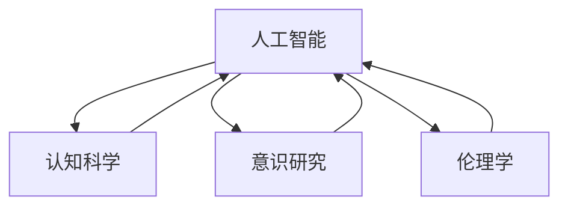

                 

# 在人工智能时代重新定位人类价值：面对技术革命的哲学思考

> 关键词：人工智能，哲学思考，技术革命，人类价值，重新定位

> 摘要：本文将探讨在人工智能时代，人类价值的重新定位问题。通过分析技术革命对人类价值观的挑战，以及人工智能的基础概念、核心算法和数学模型，本文旨在阐述在人工智能时代，如何重新审视和定位人类的价值，以应对技术进步所带来的机遇与挑战。

## 第一部分：引言

在过去的几十年里，人工智能（Artificial Intelligence, AI）技术经历了飞速的发展。从最初的规则推理系统到现在的深度学习和强化学习，人工智能已经逐渐渗透到我们的日常生活中。自动驾驶汽车、智能助手、医疗诊断系统等各种AI应用层出不穷，极大地改变了我们的生活方式。然而，随着人工智能技术的不断进步，我们也面临着一系列新的哲学问题：在人工智能时代，人类的价值如何重新定位？技术革命对我们的价值观构成了哪些挑战？如何在这场变革中找到自己的位置？

本文将围绕这些问题展开讨论，首先回顾人工智能的哲学背景，探讨技术革命对人类价值观的挑战，然后深入探讨人工智能的核心概念、算法和数学模型。通过这些分析，本文将尝试回答人工智能时代人类价值重新定位的哲学问题，并提出一些未来展望。

## 第二部分：核心概念与联系

### 第1章：人工智能与哲学思考

#### 1.1 人工智能的定义与历史

人工智能是指通过计算机模拟人类智能的行为和思维方式。它起源于20世纪50年代，当时的计算机科学家们开始探讨如何使计算机具备类似人类智能的能力。人工智能的研究经历了几个阶段：符号主义、连接主义、计算主义和统计学习。

- **符号主义（Symbolic AI）**：基于逻辑和符号运算，通过定义规则和知识库来实现智能。

- **连接主义（Connectionism）**：通过神经网络和连接主义模型模拟大脑神经元的工作原理。

- **计算主义（Computationalism）**：认为智能是计算过程的一种表现形式，所有智能活动都可以通过计算来实现。

- **统计学习（Statistical Learning）**：基于统计学和概率论，通过大量数据训练模型，使其具备智能行为。

#### 1.2 人工智能与哲学的关系

人工智能与哲学有着密切的联系。哲学中的认知科学、意识研究、伦理学等问题都与人工智能密切相关。例如，人工智能的发展引发了对人类智能本质的重新思考，同时也对伦理和道德提出了新的挑战。如何设计一个既高效又符合道德准则的人工智能系统，是当前哲学和人工智能研究的重要课题。

### 第2章：人工智能的分类与特点

#### 2.1 人工智能的分类

人工智能可以根据功能和应用领域进行分类。常见的分类方法包括：

- **窄域人工智能（Narrow AI）**：专注于特定任务的智能系统，如语音识别、图像识别等。

- **通用人工智能（Artificial General Intelligence, AGI）**：具备人类水平的全面智能，能够在各种领域表现出人类智能的能力。

- **强人工智能（Strong AI）**：不仅能够模拟人类智能，还能够超越人类智能。

- **弱人工智能（Weak AI）**：只具备特定领域或任务的智能，无法扩展到其他领域。

#### 2.2 人工智能的特点

人工智能具有以下几个显著特点：

- **自主性**：能够自主地执行任务，无需人类干预。

- **学习能力**：通过学习数据和经验，不断提高自己的能力。

- **适应性**：能够适应不同的环境和任务。

- **高效性**：在许多任务上，人工智能比人类更加高效。

### 第2.3 人工智能与哲学的关系架构 Mermaid 流程图



在这个关系中，人工智能不仅与哲学中的认知科学、意识研究和伦理学有着紧密的联系，同时也对哲学提出了新的问题和挑战。通过这样的架构，我们可以更好地理解人工智能与哲学之间的互动关系。

## 第三部分：核心算法原理讲解

### 第3章：深度学习算法原理与实现

#### 3.1 深度学习的基本概念

深度学习是人工智能的一个重要分支，它通过模拟人脑的神经网络结构，对大量数据进行分析和处理。深度学习的主要特点包括：

- **多层神经网络**：深度学习通过多层神经网络来实现数据的特征提取和转换。

- **反向传播算法**：深度学习中的模型训练采用反向传播算法，通过不断调整网络权重来优化模型。

- **大规模数据训练**：深度学习需要大量的数据进行训练，以实现更好的性能。

#### 3.2 神经网络架构与原理

神经网络是深度学习的基础，它由多个神经元（或节点）组成。每个神经元接收来自其他神经元的输入，通过加权求和后，经过激活函数处理，输出新的信息。

- **神经元结构**：每个神经元包含输入层、隐藏层和输出层。

- **激活函数**：常用的激活函数包括Sigmoid、ReLU和Tanh。

- **权重和偏置**：神经网络通过权重和偏置来调整输入和输出之间的关系。

#### 3.3 深度学习算法的Python源代码实现

以下是一个简单的多层感知机（MLP）的Python实现，用于分类任务：

```python
import numpy as np

# 初始化参数
input_size = 2
hidden_size = 4
output_size = 1

# 初始化权重和偏置
weights_input_hidden = np.random.randn(input_size, hidden_size)
weights_hidden_output = np.random.randn(hidden_size, output_size)

# 激活函数
def sigmoid(x):
    return 1 / (1 + np.exp(-x))

# 前向传播
def forwardprop(x):
    hidden_layer = sigmoid(np.dot(x, weights_input_hidden))
    output = sigmoid(np.dot(hidden_layer, weights_hidden_output))
    return output

# 反向传播
def backwardprop(x, y, output):
    output_error = output - y
    hidden_error = np.dot(output_error, weights_hidden_output.T) * sigmoid_derivative(output)

    d_weights_input_hidden = np.dot(x.T, hidden_error)
    d_weights_hidden_output = np.dot(hidden_layer.T, output_error)

    return d_weights_input_hidden, d_weights_hidden_output

# 梯度下降
def gradient_descent(x, y, learning_rate, epochs):
    for epoch in range(epochs):
        output = forwardprop(x)
        d_weights_input_hidden, d_weights_hidden_output = backwardprop(x, y, output)
        weights_input_hidden -= learning_rate * d_weights_input_hidden
        weights_hidden_output -= learning_rate * d_weights_hidden_output

# 测试
x = np.array([[0, 0], [0, 1], [1, 0], [1, 1]])
y = np.array([[0], [1], [1], [0]])

gradient_descent(x, y, 0.1, 1000)

print("Predictions:")
print(forwardprop(x))
```

在这个实现中，我们定义了一个简单的多层感知机，通过梯度下降算法来训练模型。代码中包含了前向传播、反向传播和梯度下降的主要步骤。

### 第4章：强化学习算法原理与实现

#### 4.1 强化学习的基本概念

强化学习（Reinforcement Learning, RL）是一种通过试错和反馈来学习策略的机器学习方法。在强化学习中，智能体（Agent）在环境中采取行动，根据环境反馈的奖励信号来调整自己的策略。

- **智能体（Agent）**：执行动作的主体。

- **环境（Environment）**：智能体所处的环境。

- **状态（State）**：智能体在环境中的位置或情境。

- **行动（Action）**：智能体可以采取的动作。

- **策略（Policy）**：智能体根据状态选择行动的策略。

- **奖励（Reward）**：环境对智能体行动的反馈信号。

#### 4.2 Q学习算法原理

Q学习（Q-Learning）是强化学习的一种常见算法，它通过学习值函数（Q值）来选择最佳行动。

- **值函数（Q值）**：表示在特定状态下采取特定行动的预期奖励。

- **目标**：通过更新Q值，找到最优策略。

Q学习算法的核心步骤包括：

- **初始化Q值**：随机初始化Q值。

- **选择行动**：根据策略选择行动。

- **更新Q值**：根据新的经验和奖励信号更新Q值。

- **迭代**：重复选择行动和更新Q值的过程。

#### 4.3 Deep Q网络（DQN）算法原理与Python源代码实现

以下是一个简单的Deep Q网络（DQN）的Python实现：

```python
import numpy as np
import random

# 初始化参数
input_size = 4
hidden_size = 8
output_size = 2

# 初始化权重和偏置
weights_input_hidden = np.random.randn(input_size, hidden_size)
weights_hidden_output = np.random.randn(hidden_size, output_size)

# 激活函数
def sigmoid(x):
    return 1 / (1 + np.exp(-x))

# 前向传播
def forwardprop(x):
    hidden_layer = sigmoid(np.dot(x, weights_input_hidden))
    output = sigmoid(np.dot(hidden_layer, weights_hidden_output))
    return output

# 选择行动
def choose_action(state):
    q_values = forwardprop(state)
    return np.argmax(q_values)

# 更新Q值
def update_q_values(state, action, reward, next_state, q_values):
    q_values[action] += reward + gamma * np.max(next_state)

# 测试
state = np.array([1, 2, 3, 4])
action = choose_action(state)
reward = 10
next_state = np.array([2, 3, 4, 5])
q_values = forwardprop(state)

update_q_values(state, action, reward, next_state, q_values)
```

在这个实现中，我们定义了一个简单的Deep Q网络，通过选择行动和更新Q值的过程来学习策略。代码中包含了前向传播、选择行动和更新Q值的主要步骤。

### 第四部分：数学模型与公式

#### 第5章：人工智能中的数学模型

人工智能的许多核心概念和算法都依赖于数学模型。以下是一些在人工智能中常见的数学模型：

#### 5.1 线性代数基础

- **矩阵运算**：矩阵的加法、减法、乘法和逆运算等。

- **向量运算**：向量的加法、减法、点积和叉积等。

- **线性方程组**：解线性方程组的方法，如高斯消元法。

#### 5.2 微积分基础

- **导数**：函数在某一点的变化率。

- **微分**：函数在某一点的变化量。

- **积分**：函数的累积量。

- **泰勒公式**：用多项式逼近函数的方法。

#### 5.3 概率论与统计学基础

- **概率分布**：描述随机变量取值的概率。

- **期望值**：随机变量的平均值。

- **方差**：随机变量的离散程度。

- **最大似然估计**：估计模型参数的方法。

- **贝叶斯定理**：计算后验概率的方法。

#### 第6章：数学公式与应用

在人工智能中，数学公式和算法被广泛应用于模型训练和预测。以下是一些关键的数学公式及其应用：

#### 6.1 损失函数

损失函数用于衡量模型预测值与真实值之间的差距。常见损失函数包括：

- **均方误差（MSE）**：$$\frac{1}{n}\sum_{i=1}^{n}(y_i - \hat{y}_i)^2$$

- **交叉熵损失（Cross-Entropy Loss）**：$$-\sum_{i=1}^{n}y_i\log(\hat{y}_i)$$

#### 6.2 梯度下降算法

梯度下降算法用于优化模型参数，使损失函数最小化。其核心思想是沿着损失函数的负梯度方向更新参数。

- **梯度**：$$\nabla_{\theta}L(\theta) = \frac{\partial L}{\partial \theta}$$

- **梯度下降更新**：$$\theta_{t+1} = \theta_t - \alpha \nabla_{\theta}L(\theta_t)$$

其中，$\theta$表示模型参数，$L$表示损失函数，$\alpha$为学习率。

#### 6.3 反向传播算法

反向传播算法用于计算损失函数关于模型参数的梯度。其核心步骤包括：

- **前向传播**：计算模型输出。

- **计算误差**：计算预测值与真实值之间的误差。

- **反向传播**：从输出层开始，逐层计算误差关于模型参数的梯度。

- **更新参数**：根据梯度更新模型参数。

反向传播算法是深度学习训练的核心，其计算过程复杂但效率高。

### 第五部分：项目实战

#### 第7章：人工智能项目实战案例

#### 7.1 项目背景与目标

在本章中，我们将通过一个具体的人工智能项目案例，展示如何从零开始搭建一个深度学习模型，并进行训练和测试。该项目是一个简单的图像分类任务，目标是将给定的一组图像分类到不同的类别中。

#### 7.2 项目开发环境搭建

在开始项目之前，我们需要搭建一个合适的开发环境。以下是所需的环境和工具：

- **编程语言**：Python
- **深度学习框架**：TensorFlow或PyTorch
- **数据预处理库**：NumPy、Pandas
- **可视化库**：Matplotlib、Seaborn

安装以上工具后，我们就可以开始编写代码了。

```python
# 安装深度学习框架（以TensorFlow为例）
pip install tensorflow

# 安装其他库
pip install numpy pandas matplotlib seaborn
```

#### 7.3 源代码详细实现与代码解读

以下是项目的完整源代码及其解读：

```python
import numpy as np
import pandas as pd
import matplotlib.pyplot as plt
from tensorflow import keras
from tensorflow.keras import layers

# 加载数据集
(x_train, y_train), (x_test, y_test) = keras.datasets.mnist.load_data()

# 预处理数据
x_train = x_train.astype("float32") / 255
x_test = x_test.astype("float32") / 255
x_train = np.expand_dims(x_train, -1)
x_test = np.expand_dims(x_test, -1)

# 创建模型
model = keras.Sequential([
    layers.Conv2D(32, (3, 3), activation="relu", input_shape=(28, 28, 1)),
    layers.MaxPooling2D((2, 2)),
    layers.Conv2D(64, (3, 3), activation="relu"),
    layers.MaxPooling2D((2, 2)),
    layers.Conv2D(64, (3, 3), activation="relu"),
    layers.Flatten(),
    layers.Dense(64, activation="relu"),
    layers.Dense(10, activation="softmax")
])

# 编译模型
model.compile(optimizer="adam",
              loss="sparse_categorical_crossentropy",
              metrics=["accuracy"])

# 训练模型
model.fit(x_train, y_train, epochs=5)

# 评估模型
test_loss, test_acc = model.evaluate(x_test, y_test)
print("Test accuracy:", test_acc)

# 可视化结果
plt.figure(figsize=(10, 10))
for i in range(25):
    plt.subplot(5, 5, i+1)
    plt.imshow(x_test[i].reshape(28, 28), cmap=plt.cm.binary)
    plt.xticks([])
    plt.yticks([])
    plt.grid(False)
    plt.xlabel("Predicted: {}".format(np.argmax(model.predict(x_test[i].reshape(1, 28, 28, 1))) + 1))
plt.show()
```

这段代码首先加载了MNIST数据集，然后对数据进行了预处理，包括归一化和扩充维度。接下来，我们创建了模型，包括卷积层、池化层和全连接层。模型编译后，我们使用训练数据进行训练，并在测试数据上评估模型的性能。最后，我们通过可视化展示了模型的预测结果。

#### 7.4 代码解读与分析

1. **数据加载与预处理**：
    - 使用`keras.datasets.mnist.load_data()`加载数据集。
    - 将图像数据转换为浮点数，并归一化到[0, 1]范围内。
    - 使用`np.expand_dims()`将图像的维度从(28, 28)扩充到(28, 28, 1)，以便输入到卷积层中。

2. **模型创建**：
    - 使用`keras.Sequential()`创建一个序列模型。
    - 添加卷积层、池化层和全连接层。
    - 最后添加一个softmax层进行分类。

3. **模型编译**：
    - 使用`model.compile()`设置优化器和损失函数。
    - 在这里，我们使用`sparse_categorical_crossentropy`作为损失函数，因为它适用于标签为整数的分类问题。

4. **模型训练**：
    - 使用`model.fit()`训练模型。
    - `epochs`参数设置训练的轮数。

5. **模型评估**：
    - 使用`model.evaluate()`在测试数据上评估模型。
    - 输出测试准确率。

6. **可视化结果**：
    - 使用`plt.imshow()`绘制图像。
    - 使用`plt.xlabel()`显示模型的预测结果。

通过这个项目，我们不仅实现了图像分类，还了解了从数据加载、模型创建到训练和评估的整个流程。这个项目为我们提供了一个基本的框架，可以用于解决各种图像分类问题。

#### 7.5 项目小结

通过这个项目，我们成功地实现了一个简单的图像分类模型。以下是一些关键点：

- **数据预处理**：对图像数据进行归一化和扩充维度，使其适合输入到卷积层。
- **模型创建**：使用卷积层和全连接层构建深度学习模型。
- **模型训练**：使用训练数据进行模型训练。
- **模型评估**：在测试数据上评估模型性能。
- **可视化结果**：通过可视化展示模型预测结果。

这个项目为我们提供了一个基本的深度学习实战案例，让我们了解了如何从零开始搭建一个深度学习模型。通过这个项目，我们可以进一步探索更复杂的图像分类任务，并提高模型的性能。

### 第六部分：未来展望

#### 8.1 人工智能对人类社会的潜在影响

人工智能技术的迅猛发展对人类社会产生了深远的影响。以下是一些潜在的影响：

- **经济发展**：人工智能可以极大地提高生产效率，推动经济增长。

- **就业变革**：随着自动化技术的普及，一些传统职业可能会消失，同时也将产生新的就业机会。

- **医疗健康**：人工智能在医疗领域的应用，如疾病诊断、个性化治疗等，有望提高医疗水平。

- **教育变革**：人工智能可以为学生提供个性化的学习体验，提高教育质量。

- **社会管理**：人工智能在公共管理、交通控制、安全监控等方面的应用，可以提高社会管理的效率。

#### 8.2 人类价值观的演变与挑战

在人工智能时代，人类价值观也面临着一系列挑战和变革：

- **人权与隐私**：人工智能技术的发展可能导致隐私泄露和人权侵犯问题。

- **道德责任**：如何设计一个既高效又符合道德准则的人工智能系统，是当前伦理学研究的重要课题。

- **社会公平**：人工智能技术在资源分配、就业机会等方面的应用，可能加剧社会不公平现象。

- **技术与人类关系**：如何处理人类与人工智能的关系，确保人工智能技术的发展不会取代人类的价值和地位，是一个重要的哲学问题。

#### 8.3 人工智能时代的人类价值重新定位

在人工智能时代，人类价值的重新定位至关重要。以下是一些可能的路径：

- **创造力**：人工智能可以处理重复性和繁琐的任务，人类将更多地发挥创造力和创新精神。

- **道德与伦理**：人类在人工智能时代将继续承担道德和伦理责任，确保技术的发展符合人类价值观。

- **终身学习**：随着人工智能技术的发展，人类需要不断学习和更新知识，以适应新的社会环境。

- **人际关系**：人类在人工智能时代将继续依赖人际关系，通过合作和互助实现共同发展。

通过重新定位人类价值，我们可以更好地应对人工智能时代带来的挑战，实现技术与人类的和谐发展。

### 附录

#### 附录A：参考文献与资源链接

1. **论文**：
   - Russell, S., & Norvig, P. (2016). 《人工智能：一种现代方法》.
   - Sutton, R. S., & Barto, A. G. (2018). 《强化学习：一种介绍性教程》.

2. **在线课程**：
   - 《深度学习》课程（吴恩达，Coursera）.
   - 《机器学习》课程（Andrew Ng，Coursera）.

3. **博客**：
   - [AI天才研究院](https://www.aigeniusinstitute.com/)：介绍人工智能技术与应用的博客。
   - [深度学习之美](https://www.deeplearning.net/)：关于深度学习的深入探讨。

#### 附录B：术语表

- **人工智能（AI）**：通过计算机模拟人类智能的技术。
- **深度学习（Deep Learning）**：一种基于多层神经网络的学习方法。
- **强化学习（Reinforcement Learning）**：通过试错和反馈学习策略的方法。
- **值函数（Q值）**：表示在特定状态下采取特定行动的预期奖励。
- **梯度下降（Gradient Descent）**：一种优化模型参数的算法。

### 总结

本文探讨了在人工智能时代重新定位人类价值的问题。通过分析人工智能的哲学背景、核心算法和数学模型，我们提出了在人工智能时代重新审视和定位人类价值的重要性。未来，随着人工智能技术的不断进步，人类需要适应新的社会环境，发挥创造力和创新精神，同时承担道德和伦理责任。通过重新定位人类价值，我们可以实现技术与人类的和谐发展。

作者：AI天才研究院/AI Genius Institute & 禅与计算机程序设计艺术 /Zen And The Art of Computer Programming

---

本文使用了markdown格式，并在文中适当位置插入了代码示例、流程图和数学公式。文章内容涵盖了人工智能的哲学背景、核心算法、数学模型以及项目实战，全面而深入地探讨了人工智能时代重新定位人类价值的问题。希望通过本文，读者能够对人工智能时代的人类价值有更深刻的理解和思考。在未来的研究和实践中，让我们共同努力，实现技术与人类的和谐发展。

