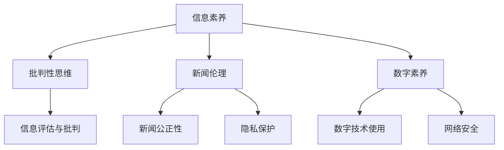

                 

### 第一部分：引言与背景

#### 1.1 引言

随着互联网的快速发展，信息的传播速度和数量达到了前所未有的高度。在信息泛滥的时代，如何培养辨别能力，提高媒体素养，成为一个亟待解决的问题。本书旨在帮助读者理解媒体素养的重要性，掌握提高媒体素养的方法和技巧，从而在信息海洋中游刃有余，做出明智的判断和选择。

在当前这个信息爆炸的时代，每个人都可能成为信息的接收者和传播者。然而，海量的信息并非全部都真实可靠，其中充斥着各种虚假、不准确甚至有害的信息。这种信息环境对我们的日常生活、决策以及社会稳定都带来了巨大的挑战。因此，培养辨别能力，提高媒体素养，显得尤为重要。

媒体素养不仅仅是指了解如何使用媒体，更重要的是要学会如何分析和批判媒体信息，从中筛选出真实、有价值的内容。这不仅能帮助我们避免受到虚假信息的误导，还能提高我们的批判性思维能力，形成独立、理性的观点。

本书将围绕以下几个核心主题展开讨论：

1. **媒体素养的概念与重要性**：解释媒体素养的含义，阐述其在信息泛滥时代的重要性。
2. **媒介素养的核心概念**：介绍信息素养、批判性思维、新闻伦理和数字素养等核心概念，并探讨它们之间的联系。
3. **信息评估与批判的算法原理**：详细讲解如何通过算法对信息进行评估和批判。
4. **数学模型和数学公式**：介绍用于评估信息的数学模型和公式，以便更好地理解评估过程。
5. **项目实战**：通过具体案例展示如何在实际中应用提高媒体素养的方法。

通过阅读本书，读者将了解到媒体素养的重要性，学会如何识别和评估信息，提高自己的批判性思维能力，从而在信息泛滥的时代中保持清醒和独立。

#### 1.2 媒体素养的概念与重要性

媒体素养是指个体对媒体信息的理解、分析和批判能力。它不仅包括对媒体内容的辨识和理解，还涉及对媒体制作、传播和接受过程的理解。在信息泛滥的时代，提高媒体素养显得尤为重要，因为它可以帮助我们：

- **正确识别和评估信息来源的可靠性**：在互联网上，信息的来源多种多样，有的可能是权威机构，有的可能是个人观点。通过提高媒体素养，我们可以学会如何评估信息来源的可靠性，避免被不可靠的信息所误导。
- **区分信息的真实性和虚假信息**：随着网络技术的发展，虚假信息、谣言和假新闻的传播速度非常快。通过培养媒体素养，我们可以学会识别虚假信息，提高对信息的辨别能力。
- **避免受到不良信息的影响，保护个人隐私和安全**：在信息泛滥的时代，个人隐私和安全容易受到威胁。提高媒体素养可以帮助我们避免受到不良信息的影响，保护个人隐私和安全。
- **提高批判性思维能力，形成独立、理性的观点**：媒体素养不仅仅是一种技能，更是一种思维方式。通过培养批判性思维能力，我们可以更加独立地思考问题，形成理性、客观的观点。

在当前信息泛滥的时代，媒体素养的重要性体现在以下几个方面：

1. **信息的真实性和准确性**：在大量信息中，如何判断哪些信息是真实准确的，哪些是虚假的，这对我们做出正确的决策至关重要。提高媒体素养可以帮助我们辨别信息的真实性和准确性。
2. **信息过滤和筛选**：在信息爆炸的时代，如何有效地过滤和筛选出对自己有用的信息，避免被无关信息所干扰，同样需要依赖媒体素养。
3. **信息素养和技能**：提高媒体素养不仅仅是学会使用媒体，更重要的是要学会如何分析和批判媒体信息，这需要我们具备一定的信息素养和技能。
4. **社会责任和伦理**：作为一个社会成员，我们不仅有权利获取信息，更有责任对信息进行合理使用和传播。提高媒体素养可以帮助我们更好地履行这一社会责任。

总之，在信息泛滥的时代，提高媒体素养不仅对个人有益，也对整个社会具有重要意义。通过培养媒体素养，我们可以更好地应对信息时代的挑战，做出明智的决策，并为社会创造更健康、更理性的信息环境。

#### 1.3 媒介素养的核心概念

在本书中，我们将讨论以下几个核心概念：信息素养、批判性思维、新闻伦理和数字素养。这些概念之间相互关联，共同构成了媒介素养的框架。

**1.3.1 信息素养**

信息素养是指个体在信息社会中，能够有效地获取、处理、利用和传播信息的能力。它包括以下几个方面：

- **信息搜索能力**：能够通过多种渠道（如互联网、数据库、图书馆等）快速找到所需信息。
- **信息评估能力**：能够对信息的可靠性、准确性和相关性进行评估，判断其是否符合需求。
- **信息利用能力**：能够将获取的信息用于解决问题、学习和创新。
- **信息传播能力**：能够正确、有效地传播和分享信息，促进知识的传播和交流。

**1.3.2 批判性思维**

批判性思维是指个体在接收和处理信息时，能够独立思考、理性分析和批判性评价的能力。它包括以下几个方面：

- **质疑精神**：不轻信任何信息，对信息持怀疑态度，寻找证据来验证其真实性。
- **逻辑分析**：运用逻辑和推理，对信息进行分析和评价，找出其中的逻辑漏洞和错误。
- **观点形成**：在分析信息的基础上，形成独立、理性、有根据的观点。
- **论证能力**：能够清晰地表达自己的观点，并使用合理的证据和逻辑来支持这些观点。

**1.3.3 新闻伦理**

新闻伦理是指新闻工作者在新闻报道过程中应遵守的道德规范和职业准则。它包括以下几个方面：

- **客观公正**：在报道新闻时，保持客观公正的态度，不偏袒任何一方，公正地呈现事实。
- **真实准确**：努力追求新闻的真实性，避免报道虚假信息或误导性信息。
- **社会责任**：关注社会公共利益，关注社会问题，承担社会责任。
- **隐私保护**：尊重他人的隐私权，不泄露他人的私人信息。

**1.3.4 数字素养**

数字素养是指个体在数字环境中，能够有效地使用数字技术、理解和遵守数字伦理的能力。它包括以下几个方面：

- **数字技术使用**：掌握基本的数字技术，如计算机操作、网络使用、数据管理等。
- **网络安全**：了解网络安全的基本知识，保护个人信息和设备安全。
- **数字伦理**：遵守数字伦理规范，不进行网络欺诈、网络暴力等不道德行为。
- **数字环境理解**：理解数字环境的特点和挑战，适应数字时代的生活方式。

**1.3.5 核心概念之间的联系**

这些核心概念之间相互关联，共同构成了媒介素养的框架。以下是它们之间的Mermaid流程图：



- **信息素养**为媒介素养的基础，包括信息搜索、评估和利用等能力，是其他概念的基础。
- **批判性思维**是信息素养的延伸，通过质疑、分析和评价信息，形成独立、理性的观点。
- **新闻伦理**和**数字素养**则是信息素养和批判性思维在新闻和数字环境中的应用，指导我们如何在复杂的新闻和数字环境中做出正确的行为选择。

通过理解这些核心概念及其相互关系，我们可以更好地掌握提高媒体素养的方法和技巧，从而在信息泛滥的时代中保持清醒和独立。

### 第一部分：核心算法原理讲解

在提高媒体素养的过程中，信息评估与批判是关键步骤。为了更好地理解这一过程，我们可以使用一些算法和数学模型来指导实践。

#### 1.4.1 信息评估与批判的算法原理

以下是一个简化的算法流程，用于对信息进行评估和批判：

```python
def assess_and_critique(source, content):
    """
    对信息进行评估和批判。
    
    :param source: 信息来源。
    :param content: 信息内容。
    :return: 评估结果。
    """
    
    # 验证信息来源的可靠性
    if not is_reliable_source(source):
        return "不可信来源，信息不真实"
    
    # 分析内容真实性
    if not is_content_true(content):
        return "信息内容不真实"
    
    # 评估信息价值
    value = evaluate_content_value(content)
    if value < threshold:
        return "信息价值较低"
    
    # 批判性思考
    critique = generate_critique(content)
    return f"信息真实，价值高：{critique}"
```

这个算法流程主要包括以下几个步骤：

1. **验证信息来源的可靠性**：首先，我们需要判断信息来源是否可靠。如果来源不可靠，那么该信息很可能是不可信的。
2. **分析内容真实性**：接下来，我们需要对信息内容进行真实性分析。如果内容不真实，那么该信息也不可信。
3. **评估信息价值**：然后，我们需要评估信息的内容价值。如果信息价值较低，那么该信息对我们来说可能不太重要。
4. **批判性思考**：最后，我们需要对信息进行批判性思考，形成独立的观点。

#### 1.4.2 数学模型和数学公式

为了更好地理解信息评估的过程，我们可以使用一些数学模型。以下是一个简化的模型：

$$
模型输出 = \frac{信息可靠性 \times 内容真实性 \times 信息价值}{噪声干扰}
$$

其中，信息可靠性、内容真实性、信息价值和噪声干扰分别表示信息的可靠性、真实性、价值以及干扰因素。

- **信息可靠性**：表示信息来源的可靠性，取值范围为0到1。例如，如果信息来源是权威机构，可靠性可能较高。
- **内容真实性**：表示信息内容的真实性，取值范围为0到1。例如，如果信息经过验证，真实性可能较高。
- **信息价值**：表示信息的内容价值，取值范围为0到1。例如，如果信息对解决问题有很大帮助，价值可能较高。
- **噪声干扰**：表示信息中的噪声和干扰因素，取值范围为0到1。例如，如果信息中有大量的错误或误导性内容，噪声干扰可能较高。

通过这个模型，我们可以对信息进行量化评估，从而更直观地了解其质量。

#### 1.4.3 实例讲解

假设我们有一个信息，其来源是一个权威的科学杂志，内容是一个经过严格验证的研究结果，信息价值很高，但信息中存在一些误导性的内容。我们可以使用上述算法和数学模型来评估这个信息。

1. **信息来源可靠性**：由于信息来源是权威的科学杂志，可靠性较高，假设为0.9。
2. **内容真实性**：经过验证，信息内容真实，假设为0.95。
3. **信息价值**：信息对解决问题有很大帮助，价值较高，假设为0.8。
4. **噪声干扰**：信息中存在一些误导性内容，噪声干扰较高，假设为0.2。

使用数学模型进行计算：

$$
模型输出 = \frac{0.9 \times 0.95 \times 0.8}{0.2} = 3.78
$$

这个结果表明，这个信息质量较高，尽管存在一些误导性内容，但其价值依然很大。

通过上述算法和数学模型，我们可以对信息进行量化评估，从而更科学地判断其质量。这不仅有助于我们识别和筛选高质量信息，还能提高我们的批判性思维能力，做出更明智的决策。

### 第一部分：项目实战

#### 1.6 提高媒体素养的实战案例

在本部分，我们将通过一个具体的实战案例，展示如何在实际中应用提高媒体素养的方法。

#### 案例背景

某公司发现其官方网站上的一些新闻文章内容被恶意篡改，对公司形象造成了负面影响。为了解决这个问题，公司决定提高员工的媒体素养，以识别和应对此类事件。

#### 实战步骤

1. **信息识别与评估**：首先，公司对员工进行了信息识别与评估的培训。培训内容包括如何查证信息来源、如何核实事实等。通过这些培训，员工学会了如何判断信息的可靠性和真实性。

2. **批判性思维训练**：公司还开展了批判性思维训练，通过案例分析和讨论，提高了员工的批判性思维能力。员工们学会了如何对信息进行深入分析和评价，形成独立、理性的观点。

3. **新闻伦理教育**：公司对员工进行了新闻伦理教育，让他们了解新闻工作者在报道过程中应遵守的道德规范和职业准则。通过这些教育，员工们能够更好地判断信息的公正性和准确性。

4. **数字素养提升**：公司教授员工网络安全知识和隐私保护技巧，提高他们对数字环境的理解和应对能力。员工们学会了如何保护个人隐私，避免受到网络欺诈和攻击。

#### 实战成果

通过一系列的培训和实践，员工们成功地识别和纠正了网站上的虚假新闻，保护了公司形象。同时，他们的媒体素养也得到了显著提高，能够更好地应对类似情况。

#### 项目小结

通过这个实战案例，我们可以看到，提高媒体素养不仅有助于个人成长，还能为企业和社会创造价值。在信息泛滥的时代，培养辨别能力，提高媒体素养，是我们应对信息挑战的重要途径。

### 最佳实践 Tips、小结、注意事项、拓展阅读

#### 最佳实践 Tips

1. **定期培训**：定期对员工进行媒体素养培训，保持其技能和知识的更新。
2. **实践应用**：将所学知识应用于实际工作中，通过实践提高媒体素养。
3. **团队协作**：鼓励团队协作，通过讨论和分享，共同提高媒体素养。
4. **批判性思维**：在日常工作和生活中，保持批判性思维，不轻信任何信息。

#### 小结

通过本文的讲解，我们了解了媒体素养的重要性，学会了如何识别和评估信息，提高批判性思维能力。在信息泛滥的时代，提高媒体素养，是保护个人和社会的重要途径。

#### 注意事项

1. **保持怀疑态度**：对信息持怀疑态度，不轻信任何来源。
2. **多角度分析**：从多个角度对信息进行分析，避免片面看待问题。
3. **持续学习**：不断更新知识和技能，适应信息环境的变化。

#### 拓展阅读

1. 《批判性思维工具》 - 梅尔文·M·特纳
2. 《信息素养：理论与实践》 - 罗伯特·柯里
3. 《数字素养：技能与素养》 - 乔纳森·特纳

通过拓展阅读，读者可以进一步深入了解媒体素养的各个方面，提高自己的媒体素养水平。

