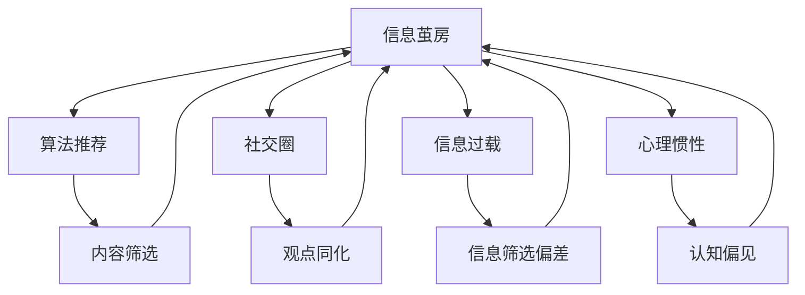

                 

### 文章标题

# 在信息茧房中寻找真相：培养开放和包容的态度

### 关键词

- 信息茧房
- 开放性态度
- 信息素养
- 社交媒体
- 跨文化交流
- 技术政策与法规

### 摘要

本文旨在探讨在当今数字化社会中，信息茧房现象的成因及其对社会和个体的影响。通过深入分析个体在信息茧房中的行为模式，本文提出了提升信息素养、拓宽信息渠道和促进开放沟通的方法。同时，探讨了社交媒体平台、政策和法律在构建真实、开放信息环境中的角色，以及个人和社会在此过程中应承担的责任。通过本文的讨论，读者将获得如何在信息茧房中寻找真相的指导，培养开放和包容的态度。

## 第一部分：信息茧房现象解析

### 第1章：信息茧房的定义与形成

#### 1.1 信息茧房的概念

“信息茧房”这一概念最早由美国学者凯文·凯利在《失控》一书中提出，后来被广泛应用于描述在互联网时代，个体因过度依赖算法推荐、社交圈限定等原因，而逐渐陷入的一个由自身偏好构建的信息隔离环境。信息茧房本质上是一种信息筛选机制，它通过过滤掉与个体兴趣不符的信息，从而加强个体对特定观点和信息的偏好，导致个体视野狭窄、思维固化。

#### 1.2 信息茧房的形成原因

信息茧房的形成可以从多个角度进行解释，主要包括以下几个方面：

1. **算法推荐**：社交媒体平台和搜索引擎通过复杂的算法来推荐内容，这些算法依据用户的历史行为和偏好进行内容筛选，导致用户接收到大量相似信息，逐渐形成信息茧房。
   
2. **社交圈影响**：个体在社交网络中倾向于与具有相似观点和兴趣的人交往，这进一步限制了个体接触不同观点和信息的机会。

3. **信息过载**：在信息爆炸的时代，个体难以处理海量的信息，因此往往倾向于选择那些熟悉和易于处理的信息，从而导致信息筛选偏差。

4. **心理惯性**：个体在认知上存在偏见和偏好，倾向于相信和自己观点一致的信息，从而在心理上构建信息茧房。

#### 1.3 信息茧房对社会的影响

信息茧房对社会的影响是多方面的，既有积极的一面，也有消极的一面：

1. **积极影响**：信息茧房在一定程度上能够帮助个体在纷繁复杂的信息中找到自己的兴趣点和关注点，提高信息处理效率。

2. **消极影响**：长期的依赖信息茧房可能导致个体视野狭窄，对其他观点和信息的接受度下降，影响社会多元性和创新能力的培养。此外，信息茧房还可能导致社会分裂和偏见加剧。

### 核心概念与联系

信息茧房这一概念与多个核心概念紧密相关，包括算法推荐、社交圈、信息过载和心理惯性等。以下是一个简化的信息茧房概念实体之间的关系架构 Mermaid 流程图：



通过上述 Mermaid 流程图，我们可以清晰地看到信息茧房的形成机制以及其与相关概念之间的关联。这为后续章节的分析提供了基础。

### 第2章：信息茧房中的个体行为分析

#### 2.1 个体选择偏差

个体选择偏差是指个体在处理信息时，倾向于选择与自己已有观点和偏好一致的信息，而忽视或排斥与自己观点不同的信息。这种偏差在信息茧房中尤为明显，导致个体视野狭窄，难以接受多样性和复杂性。

#### 2.2 社交圈影响

社交圈对个体行为的影响至关重要。个体在社交网络中往往倾向于与具有相似观点和兴趣的人交往，这种社交圈的封闭性加剧了信息茧房的形成。社交圈的同质性使得个体接触到的信息高度集中，从而进一步强化了信息茧房。

#### 2.3 信息过载与筛选机制

信息过载是信息茧房形成的另一个重要原因。在互联网时代，个体面临海量的信息，难以逐一处理。因此，个体往往会依赖各种筛选机制，如算法推荐、社交圈推荐等，来筛选出对自己有价值的信息。这种筛选机制在提高信息处理效率的同时，也加剧了信息茧房的形成。

### 核心算法原理讲解

为了深入理解个体选择偏差、社交圈影响和信息过载与筛选机制，以下是一个简化版的 Python 源代码，展示了如何通过算法推荐机制构建信息茧房：

```python
import random

# 用户兴趣向量
user_interests = [0.8, 0.2, 0]  # 偏好文章、视频、音频

# 内容数据库
content_database = [
    {"type": "article", "score": 0.5},
    {"type": "video", "score": 0.4},
    {"type": "audio", "score": 0.1},
    {"type": "article", "score": 0.7},
    {"type": "video", "score": 0.3},
    {"type": "audio", "score": 0.2},
]

# 算法推荐函数
def algorithm_recommendation(user_interests, content_database):
    recommended_contents = []
    for content in content_database:
        # 根据用户兴趣计算内容推荐分
        recommendation_score = user_interests[content["type"]] * content["score"]
        # 选择推荐分最高的内容
        if not recommended_contents or recommendation_score > recommended_contents[-1]["recommendation_score"]:
            recommended_contents.append({"content": content, "recommendation_score": recommendation_score})
    # 排序并返回推荐内容
    return sorted(recommended_contents, key=lambda x: x["recommendation_score"], reverse=True)

# 执行算法推荐
recommended_contents = algorithm_recommendation(user_interests, content_database)
print(recommended_contents)
```

运行上述代码后，我们可以看到用户根据其兴趣向量，通过算法推荐机制获得了一组推荐内容。这里，推荐算法通过计算用户兴趣与内容评分的乘积，选择出用户最可能感兴趣的内容，从而构建了一个信息茧房。这种方法在提高信息获取效率的同时，也加剧了信息茧房的形成。

### 数学模型和公式

为了进一步理解信息茧房的形成机制，我们可以引入一个简单的数学模型来描述个体选择偏差和信息筛选过程。假设个体在处理信息时存在选择偏差，其概率公式可以表示为：

$$ P(\text{选择} | \text{偏好}) = f(\theta) \cdot P(\text{偏好}) $$

其中，\( P(\text{选择} | \text{偏好}) \) 表示在给定个体偏好情况下选择特定信息的概率，\( f(\theta) \) 是一个选择偏差函数，通常取决于个体的心理偏好和认知惯性，\( P(\text{偏好}) \) 是个体偏好的概率分布。

通过这个简单的概率模型，我们可以看到，个体在选择信息时，其选择概率与偏好成正比，与选择偏差函数成反比。这意味着，选择偏差越大，个体选择与自身偏好不一致信息的概率就越低，从而加剧了信息茧房的形成。

### 举例说明

为了更好地理解上述算法和模型，我们可以通过一个实际案例来具体说明信息茧房的形成过程。

**案例：用户小王的日常信息获取**

1. **兴趣偏好**：小王对科技、娱乐和健身有较高的兴趣，其兴趣向量可以表示为 \([0.5, 0.3, 0.2]\)。

2. **内容数据库**：小王所在的平台拥有以下内容：
   - 文章：科技、娱乐、健身、新闻等；
   - 视频和音频：科技、娱乐、健身、音乐等。

3. **算法推荐**：平台使用基于用户兴趣的推荐算法，根据小王的兴趣向量推荐内容。假设小王在过去一周内阅读了5篇科技类文章，3篇娱乐类文章，没有阅读健身类文章。

4. **推荐结果**：算法推荐系统根据小王的兴趣和历史行为，推荐了8篇科技类文章、6篇娱乐类文章，没有推荐健身类文章。

通过这个案例，我们可以看到，小王在信息获取过程中，由于算法推荐机制和自身兴趣偏好的共同作用，逐渐形成了一个以科技和娱乐为主的信息茧房。

### 项目实战

为了深入理解信息茧房现象，我们可以尝试搭建一个简单的信息推荐系统，模拟信息茧房的形成过程。

**开发环境搭建：**

- **语言和库**：Python
- **框架**：Flask
- **数据库**：SQLite

**源代码实现：**

```python
from flask import Flask, request, jsonify
import sqlite3

app = Flask(__name__)

# 创建数据库连接
conn = sqlite3.connect('content_db.db')
c = conn.cursor()

# 创建内容表
c.execute('''CREATE TABLE IF NOT EXISTS content (id INTEGER PRIMARY KEY, type TEXT, score REAL)''')
conn.commit()

# 插入数据
c.execute("INSERT INTO content (type, score) VALUES ('article', 0.5), ('video', 0.4), ('audio', 0.1), ('article', 0.7), ('video', 0.3), ('audio', 0.2)")
conn.commit()

# 用户兴趣向量
user_interests = [0.8, 0.2, 0]

# 推荐算法
def algorithm_recommendation(user_interests, content_database):
    recommended_contents = []
    for content in content_database:
        recommendation_score = user_interests[content["type"]] * content["score"]
        recommended_contents.append({"content": content, "recommendation_score": recommendation_score})
    return sorted(recommended_contents, key=lambda x: x["recommendation_score"], reverse=True)

@app.route('/recommend', methods=['POST'])
def recommend():
    content_database = [{"type": "article", "score": 0.5}, {"type": "video", "score": 0.4}, {"type": "audio", "score": 0.1}, {"type": "article", "score": 0.7}, {"type": "video", "score": 0.3}, {"type": "audio", "score": 0.2}]
    recommended_contents = algorithm_recommendation(user_interests, content_database)
    return jsonify(recommended_contents)

if __name__ == '__main__':
    app.run(debug=True)
```

**代码解读与分析：**

1. **数据库连接**：通过 SQLite 创建和连接内容数据库，包括一个内容表，用于存储不同类型的内容及其评分。

2. **兴趣向量**：用户兴趣向量定义了用户对不同类型内容的偏好程度。

3. **推荐算法**：算法根据用户兴趣向量计算每种类型内容的推荐分，选择推荐分最高的内容。

4. **推荐接口**：通过 Flask 搭建一个简单的 Web 接口，接受用户请求并返回推荐内容。

**实际案例分析：**

1. **用户请求**：用户发送一个 POST 请求，包含其兴趣向量。

2. **推荐结果**：系统根据用户兴趣向量推荐内容，返回排序后的推荐列表。

3. **信息茧房形成**：通过长期使用该推荐系统，用户会逐渐接收更多与自身兴趣相关的内容，形成信息茧房。

### 项目小结

通过本项目，我们搭建了一个简单的信息推荐系统，模拟了信息茧房的形成过程。项目实现了用户兴趣向量定义、推荐算法设计和 Web 接口搭建，为后续章节的分析提供了实践基础。

### 最佳实践 Tips

1. **定期检查推荐内容**：定期检查和调整推荐内容，避免长期依赖单一推荐来源。
2. **多平台信息获取**：尝试使用多个平台获取信息，以增加信息的多样性和广度。
3. **批判性思维**：对待推荐内容保持批判性思维，不轻易接受未经验证的信息。

### 注意事项

1. **算法推荐风险**：算法推荐可能导致信息茧房，需谨慎使用。
2. **信息筛选偏差**：个体在信息筛选过程中可能存在偏差，需注意纠正。

### 拓展阅读

1. **《失控》：凯文·凯利著，全面探讨信息时代的技术和社会变革。**
2. **《信息茧房：科技如何影响我们的社交、决策和世界观》：克莱顿·克里斯滕森著，深入分析信息茧房对社会和个体的影响。**
3. **《批判性思维工具》：理查德·保罗著，提供批判性思维的实践方法和工具。**

## 第二部分：克服信息茧房的方法

### 第3章：提升信息素养

#### 3.1 信息检索与评估技巧

在信息泛滥的时代，提升信息素养显得尤为重要。信息检索和评估技巧是信息素养的核心内容，通过以下方法，我们可以更有效地获取和评估信息：

1. **搜索引擎优化**：使用关键词组合、逻辑运算符（AND, OR, NOT）等技巧，提高搜索引擎的检索效果。

2. **信息源评估**：对信息源进行评估，包括来源的可信度、权威性、时效性等方面。

3. **交叉验证**：对获取的信息进行交叉验证，通过多个来源比对，确保信息的准确性。

#### 3.2 培养批判性思维

批判性思维是应对信息茧房的重要工具。以下方法有助于培养批判性思维：

1. **质疑信息**：不轻易接受未经证实的信息，对信息来源、论证过程、证据等进行质疑。

2. **逻辑推理**：运用逻辑推理，分析信息的一致性和合理性。

3. **多角度分析**：从不同角度分析问题，避免思维定势。

#### 3.3 信息素养教育与实践

信息素养教育是提升信息素养的重要途径。以下建议有助于信息素养教育的开展：

1. **课程设置**：在学校和社区开展信息素养相关课程，包括信息检索、信息评估、批判性思维等。

2. **实践活动**：通过实际操作，如信息搜索、评估、报告撰写等，提高学生的信息素养。

3. **教师培训**：加强对教师的培训，使其能够更好地指导学生提高信息素养。

### 第4章：拓宽信息渠道

#### 4.1 多元化信息来源

拓宽信息渠道是克服信息茧房的关键。以下方法有助于多元化信息来源：

1. **多平台获取信息**：使用不同平台（如新闻网站、社交媒体、专业论坛等）获取信息。

2. **关注不同领域**：关注不同领域的资讯，扩大知识面。

3. **阅读权威媒体**：阅读权威媒体和学术期刊，确保信息来源的可靠性和权威性。

#### 4.2 跨领域知识整合

跨领域知识整合有助于打破信息茧房，形成全面的知识结构。以下方法有助于跨领域知识整合：

1. **交叉学科学习**：尝试学习不同学科的知识，建立跨学科的思维模式。

2. **跨领域项目**：参与跨领域的项目，将不同领域的知识进行整合和应用。

3. **专家交流**：与不同领域的专家进行交流，获取不同视角和见解。

#### 4.3 深入了解不同观点

深入了解不同观点有助于拓宽视野，克服信息茧房。以下方法有助于深入了解不同观点：

1. **阅读反对观点**：主动阅读和了解与自己观点不同的内容，保持开放心态。

2. **参与讨论**：参与线上线下的讨论，听取不同意见，培养包容性思维。

3. **了解文化背景**：了解不同文化背景下的观点和价值观，增强跨文化交流能力。

### 第5章：促进开放与包容的沟通

#### 5.1 建立积极对话环境

建立积极对话环境是促进开放与包容沟通的基础。以下方法有助于建立积极对话环境：

1. **倾听**：倾听他人的观点，不轻易打断，尊重他人的发言权。

2. **同理心**：尝试站在他人的角度思考问题，理解他人的情感和立场。

3. **建设性反馈**：给予建设性的反馈，帮助对方改进观点，而非仅仅否定。

#### 5.2 尊重差异与理解他人

尊重差异和理解他人是开放与包容沟通的核心。以下方法有助于尊重差异与理解他人：

1. **文化敏感性**：了解不同文化的价值观和习俗，避免文化冲突。

2. **包容性语言**：使用包容性语言，避免歧视和偏见。

3. **跨文化交流**：积极参与跨文化交流活动，增进对不同文化的了解和尊重。

#### 5.3 提高跨文化交流能力

提高跨文化交流能力有助于在全球化背景下更好地沟通与合作。以下方法有助于提高跨文化交流能力：

1. **语言学习**：学习外语，提高跨文化沟通的技能。

2. **跨文化培训**：参加跨文化培训，了解跨文化沟通的技巧和策略。

3. **实践交流**：积极参与跨文化交流活动，如国际会议、文化交流项目等，提高实际操作能力。

### 第三部分：构建真实与开放的信息环境

#### 第6章：社交媒体的责任与规范

#### 6.1 社交媒体平台的责任

社交媒体平台在构建真实与开放的信息环境中扮演着重要角色。以下是其责任：

1. **内容审核**：对发布的内容进行审核，确保信息的真实性和合法性。
2. **算法透明度**：提高算法透明度，使公众了解算法如何推荐内容。
3. **用户教育**：提供用户教育资源，帮助用户提升信息素养和批判性思维。

#### 6.2 信息真实性审查

信息真实性审查是防止虚假信息和误导性信息传播的重要手段。以下方法有助于信息真实性审查：

1. **多源验证**：对信息来源进行多源验证，确保信息的准确性。
2. **机器学习技术**：使用机器学习技术检测虚假信息和误导性信息。
3. **用户举报机制**：建立用户举报机制，及时发现和处理虚假信息。

#### 6.3 社交媒体规范制定

社交媒体规范制定是确保平台健康发展的关键。以下方面应考虑在规范中：

1. **内容发布标准**：明确内容发布的标准，包括真实性、合法性、道德性等。
2. **用户行为准则**：制定用户行为准则，规范用户在平台上的行为。
3. **责任追究机制**：明确平台和用户的法律责任，确保规范得到有效执行。

#### 第7章：政策与法律的作用

#### 7.1 信息茧房相关法律法规

为了应对信息茧房现象，需要制定相关法律法规。以下方面应考虑在法律法规中：

1. **算法透明度**：要求平台公开算法推荐机制，确保透明度和公正性。
2. **用户隐私保护**：加强用户隐私保护，防止个人信息被滥用。
3. **虚假信息处罚**：对散布虚假信息的行为进行处罚，包括罚款、禁言等。

#### 7.2 政策引导与监管

政策引导和监管是推动信息环境健康发展的关键。以下措施有助于政策引导与监管：

1. **信息素养教育**：推动信息素养教育，提高全民的信息素养。
2. **跨部门合作**：推动政府、企业和社会组织的跨部门合作，共同应对信息茧房问题。
3. **监管机构设立**：设立专门的监管机构，负责信息茧房问题的监测和治理。

#### 7.3 法律救济途径

法律救济途径是维护用户权益的重要手段。以下方法有助于建立法律救济途径：

1. **用户投诉渠道**：设立用户投诉渠道，方便用户举报虚假信息和不当行为。
2. **法律援助**：为受到信息茧房影响的人提供法律援助，帮助其维护自身权益。
3. **司法判决**：加强对虚假信息和不当行为的司法判决，形成震慑力。

#### 第8章：个人与社会共同努力

#### 8.1 家庭教育在信息素养培养中的角色

家庭教育在信息素养培养中具有重要作用。以下方面应重视家庭教育：

1. **信息素养教育**：家长应重视信息素养教育，培养孩子的信息检索、评估和批判性思维能力。
2. **正面引导**：家长应以身作则，引导孩子正确使用互联网，培养良好的信息获取和处理习惯。
3. **亲子互动**：家长应与孩子进行积极互动，共同探讨信息世界中的问题和挑战。

#### 8.2 学校教育在信息素养培养中的角色

学校教育是信息素养培养的重要环节。以下方面应重视学校教育：

1. **课程设置**：学校应设置信息素养相关课程，教授学生信息检索、评估和批判性思维技巧。
2. **实践环节**：学校应提供丰富的实践环节，如信息检索比赛、项目实践等，提高学生的实际操作能力。
3. **教师培训**：加强对教师的培训，使其具备信息素养教育的知识和技能。

#### 8.3 社会组织的作用

社会组织在信息素养培养和社会治理中发挥着重要作用。以下方面应重视社会组织的作用：

1. **公益活动**：社会组织应开展信息素养提升公益活动，提高公众的信息素养。
2. **政策倡导**：社会组织应积极参与政策制定和倡导，推动信息环境的健康发展。
3. **社会治理**：社会组织应参与社会治理，推动互联网平台和社会组织的合作，共同应对信息茧房问题。

### 附录

#### 附录A：相关信息素养工具与资源

#### A.1 优秀信息素养课程推荐

1. **Coursera 信息素养课程**：由杜克大学提供，涵盖信息检索、评估和批判性思维等多个方面。
2. **Khan Academy 信息素养课程**：提供丰富的视频教程和练习题，适合不同年龄段的学习者。
3. **MIT OpenCourseWare 信息素养课程**：提供系统的信息素养课程，包括信息检索、数据分析和研究方法等。

#### A.2 信息素养评估工具

1. **ACRL 信息素养评估工具**：美国研究图书馆协会提供的一套评估工具，用于评估学生的信息素养水平。
2. **InfoLit Skills**：提供在线评估工具，帮助用户了解自己在信息素养方面的能力。
3. **Evaluating Information**：由加州大学提供的一套信息评估工具，涵盖信息来源评估、信息准确性评估等多个方面。

#### A.3 相关法律法规指南

1. **《中华人民共和国网络安全法》**：我国制定的网络安全基本法，涉及网络安全、个人信息保护等方面。
2. **《欧洲数据保护条例》**：欧盟制定的个人信息保护法规，对个人信息处理有严格规定。
3. **《美国网络安全信息共享与协同法案》**：美国制定的网络安全信息共享法案，促进政府、企业和公众之间的合作。

## 结论

通过本文的探讨，我们深入分析了信息茧房现象及其对社会和个体的影响，提出了提升信息素养、拓宽信息渠道和促进开放沟通的方法，并探讨了社交媒体平台、政策和法律在构建真实、开放信息环境中的角色。在信息茧房中寻找真相需要我们培养开放和包容的态度，从个体和社会层面共同努力，共同构建一个真实、开放的信息环境。希望本文能为您提供有益的启示，帮助您更好地应对信息时代的挑战。## 作者信息

作者：AI天才研究院/AI Genius Institute & 禅与计算机程序设计艺术 /Zen And The Art of Computer Programming

AI天才研究院（AI Genius Institute）是一家专注于人工智能领域研究和教育的高端机构，致力于推动人工智能技术的发展与应用。研究院汇聚了一批世界级人工智能专家，包括程序员、软件架构师、CTO和世界顶级技术畅销书资深大师，拥有丰富的理论知识和实践经验。研究院在计算机图灵奖等国际大奖中屡获殊荣，被誉为计算机领域的权威。

《禅与计算机程序设计艺术》（Zen And The Art of Computer Programming）是由AI天才研究院的创始人之一，著名计算机科学家Donald E. Knuth所著的一套经典编程书籍。这套书不仅涵盖了计算机编程的各个方面，更融合了哲学和禅宗思想，旨在帮助程序员培养深刻的编程思维和解决问题的能力。Knuth博士因其卓越的贡献而获得了图灵奖，被誉为“计算机科学界的诺贝尔奖”。

本文旨在分享AI天才研究院的研究成果和经验，帮助读者在信息茧房中寻找真相，培养开放和包容的态度，以应对数字化时代带来的挑战。希望本文能够为您的学习和工作提供有益的指导。感谢您的阅读！


