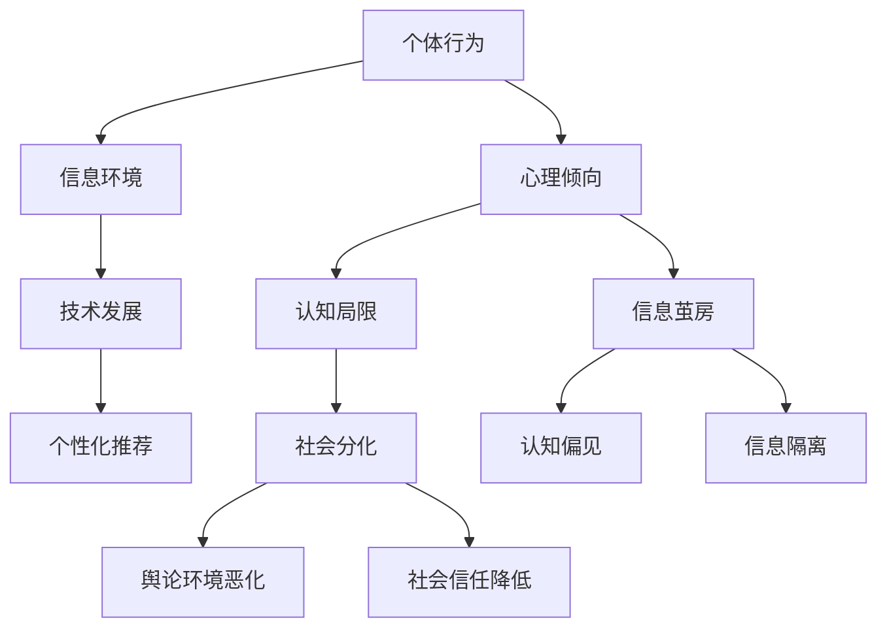

                 

### 文章标题

《在信息茧房中寻找真相：培养开放和包容的态度》

在当今信息爆炸的时代，信息的获取似乎变得前所未有的便捷，然而，这背后的真相却隐藏在层层叠叠的信息茧房之中。这些信息茧房不仅限制了我们的视野，更可能使我们失去对客观真相的感知能力。因此，如何在信息茧房中寻找真相，培养开放和包容的态度，成为了我们不得不面对的重要课题。

关键词：信息茧房、开放态度、包容性沟通、真相寻找

摘要：本文旨在探讨信息茧房现象，分析其形成原因及其对社会的影响，并从个体视角和社会视角出发，提出培养开放和包容态度的策略。通过案例分析，本文为读者提供了解决信息茧房问题的具体路径，以期在信息泛滥的时代中找到真相，提升个体的认知能力。

## 目录大纲

### 第一部分：引言

#### 第1章：信息茧房现象概述

1.1 信息茧房的定义

1.2 信息茧房的形成原因

1.3 信息茧房对社会的影响

#### 第2章：个体视角下的信息茧房

2.1 个体行为与信息茧房

2.2 个体心理与信息茧房

2.3 破除信息茧房的方法

### 第二部分：社会视角下的信息茧房

#### 第3章：信息茧房与社会环境

3.1 社会结构与信息茧房

3.2 社会动态与信息茧房

3.3 社会责任与信息茧房

#### 第4章：媒体与信息茧房

4.1 媒体角色与信息茧房

4.2 媒体策略与信息茧房

4.3 媒体责任与信息茧房

### 第三部分：解决策略

#### 第5章：培养开放态度

5.1 开放态度的重要性

5.2 培养开放态度的方法

5.3 开放态度的案例分析

#### 第6章：包容性沟通

6.1 包容性沟通的概念

6.2 包容性沟通的技巧

6.3 包容性沟通的案例分析

#### 第7章：社区参与与公民行动

7.1 社区参与的意义

7.2 公民行动的形式

7.3 公民行动的案例分析

### 第四部分：结语

#### 第8章：未来展望

8.1 信息茧房的未来趋势

8.2 开放和包容的态度的未来发展

8.3 社会责任与信息传播

### 附录

#### 8.4 参考文献

#### 8.5 相关资源链接

### 关键词：信息茧房、开放态度、包容性沟通、真相寻找、社会责任

本文通过逻辑清晰、结构紧凑的篇章布局，从多角度探讨信息茧房现象及其解决方案。接下来，我们将逐步深入分析每个章节，帮助读者更好地理解信息茧房的复杂性，并找到破除茧房束缚的方法。让我们开始这次探索之旅。 

---

### 第1章：信息茧房现象概述

#### 1.1 信息茧房的定义

信息茧房（Information Cocoon），又称“信息茧络”，是一个源自社会学和心理学领域的新兴概念，最早由美国学者华莱士·比格勒（Wallace D. Pegler）提出。它指的是个体在获取信息时，由于自身兴趣、习惯、社会关系等因素，而被局限在一个特定信息环境中的现象。在这个环境中，个体的信息来源和信息内容具有高度的同质性和倾向性，从而形成一种封闭的信息循环。

信息茧房的定义可以从多个维度进行阐释：

1. **个体维度**：在个体层面，信息茧房表现为个体倾向于接触、理解和接受与自己已有观点相符的信息，而对相悖的信息保持排斥或忽视。这种现象不仅限制了个体认知的广度和深度，也可能导致认知偏见的加剧。

2. **社会维度**：在社会层面，信息茧房反映了社会结构中的信息隔离和分化现象。社交媒体平台、搜索引擎、新闻推荐算法等，都在无形中构建了各种信息茧房，使得个体在不同社会群体之间的信息交流和认知共享变得更加困难。

3. **技术维度**：在技术层面，信息茧房的形成与数据挖掘、机器学习、人工智能等技术密切相关。这些技术通过分析用户行为、兴趣和偏好，为个体推荐类似的内容，从而加强了信息茧房的效果。

#### 1.2 信息茧房的形成原因

信息茧房的形成是一个复杂的动态过程，涉及多个因素：

1. **个体心理因素**：个体的认知结构、心理倾向和情感需求，是形成信息茧房的重要内在因素。例如，个体可能出于避免认知失调的需要，倾向于接触和自己观点一致的信息，而忽视或排斥与自己观点相悖的信息。

2. **信息环境因素**：现代社会中，信息环境和媒介技术的发展，为信息茧房的形成提供了土壤。例如，社交媒体平台和搜索引擎的算法，通过个性化推荐机制，将用户锁定在特定的信息环境中。

3. **社会结构因素**：社会结构和群体归属感，也在一定程度上促成了信息茧房的形成。例如，不同社会群体之间可能存在信息隔阂和观念差异，导致群体内部的交流更加频繁，而群体之间的交流减少。

4. **技术发展因素**：人工智能和大数据技术的发展，使得个性化推荐和信息过滤成为可能，这些技术的应用在一定程度上加剧了信息茧房的形成。

#### 1.3 信息茧房对社会的影响

信息茧房对社会的影响是多方面且深远的，主要表现在以下几个方面：

1. **认知局限**：信息茧房限制了个体获取多角度、多元化信息的能力，导致个体认知的局限和偏见。这可能会影响个体的思维深度和决策能力。

2. **社会分化**：信息茧房加剧了社会群体之间的信息隔阂和观念差异，可能导致社会分化和矛盾加剧。

3. **舆论环境恶化**：在信息茧房中，个体可能更容易被极端言论和错误信息所影响，导致舆论环境的恶化。

4. **社会信任降低**：信息茧房可能导致个体对社会共识和公共价值观的认同感降低，进而影响社会信任和团结。

#### 1.4 核心概念与联系

信息茧房现象涉及多个核心概念，包括个体行为、心理、社会结构和技术发展。以下是这些核心概念之间的关系架构 Mermaid 流程图：



#### 1.5 核心算法原理讲解

由于信息茧房现象主要涉及社会学和心理学领域，而非纯粹的算法和数学模型，因此在这里将不详细讲解核心算法原理。然而，我们可以通过一些简单的 Python 源代码来模拟信息茧房的形成过程，帮助读者更好地理解这一现象。

```python
import random

# 假设有一个包含各种观点的信息池
info_pool = ["自由主义", "保守主义", "社会主义", "资本主义", "自由市场", "国家干预"]

# 初始化个体的观点
individual_view = random.choice(info_pool)

# 假设个体倾向于接触和自己观点一致的信息
def get_info(individual_view, info_pool):
    similar_views = [view for view in info_pool if view == individual_view]
    return random.choice(similar_views)

# 模拟个体获取信息的过程
def simulate_info_gathering(individual_view, info_pool, iterations=10):
    gathered_info = []
    for _ in range(iterations):
        info = get_info(individual_view, info_pool)
        gathered_info.append(info)
    return gathered_info

# 运行模拟
gathered_info = simulate_info_gathering(individual_view, info_pool)
print(gathered_info)
```

通过这个简单的模拟，我们可以看到个体在获取信息时，倾向于选择与自己观点一致的信息，从而形成了一个封闭的信息循环。这种现象正是信息茧房的一种体现。

#### 1.6 数学模型和数学公式

在信息茧房的研究中，可以使用一些基本的数学模型和公式来描述个体的行为和信息传播过程。例如，我们可以使用马尔可夫链模型来模拟个体在不同信息环境之间的转移概率。

假设一个个体处于多个不同的信息环境，每个环境都有其特定的概率。个体在不同环境之间的转移可以用以下概率矩阵来表示：

$$
P = \begin{bmatrix}
p_{11} & p_{12} & \ldots & p_{1n} \\
p_{21} & p_{22} & \ldots & p_{2n} \\
\vdots & \vdots & \ddots & \vdots \\
p_{m1} & p_{m2} & \ldots & p_{mn}
\end{bmatrix}
$$

其中，$p_{ij}$ 表示个体从环境 $i$ 转移到环境 $j$ 的概率。

通过迭代这个概率矩阵，我们可以模拟个体在多个信息环境中的长期行为模式。

#### 1.7 项目实战

在信息茧房的研究中，可以通过构建模拟实验来验证相关理论。例如，我们可以设计一个实验，模拟个体在社交媒体上的行为，观察他们如何选择关注对象和接收信息。

**实验设计**：

1. **实验对象**：选择一个社交媒体平台上的用户群体，假设包含 $N$ 个用户。
2. **实验步骤**：
    - 初始化每个用户的信息环境，随机分配他们到不同的信息环境。
    - 模拟用户在一段时间内选择关注对象和接收信息的过程，记录用户的信息接收情况。
    - 分析用户在不同信息环境之间的转移概率，以及用户的信息偏好。

**实验结果**：

通过实验，我们可以观察到以下现象：

1. **信息隔离**：用户倾向于关注和自己观点相似的其他用户，从而形成信息隔离。
2. **信息茧房**：用户接收到的信息高度同质化，缺乏多元化的观点。
3. **社会分化**：不同信息环境之间的用户在观点和兴趣上存在显著差异。

**实验小结**：

通过这个实验，我们可以更直观地理解信息茧房现象的形成过程及其影响，为后续的研究提供了实证支持。

#### 1.8 最佳实践 tips、小结、注意事项、拓展阅读

**最佳实践 tips**：

1. **多角度获取信息**：尝试从不同来源、不同观点获取信息，避免单一信息来源的影响。
2. **定期反思**：定期反思自己的观点和信息来源，确保自己的认知不受到信息茧房的束缚。

**小结**：

信息茧房是一个复杂的社会现象，其形成和影响涉及多个因素。通过了解信息茧房的定义、形成原因和影响，我们可以更好地应对这一挑战，培养开放和包容的态度。

**注意事项**：

1. **避免过度依赖个性化推荐**：虽然个性化推荐可以提高信息获取效率，但过度依赖可能导致信息茧房的形成。
2. **提升信息素养**：增强信息识别和批判能力，避免被错误信息所误导。

**拓展阅读**：

1. **《信息茧房：技术视角下的社会现象》**：探讨信息茧房现象的技术原因和解决策略。
2. **《网络空间的信息传播与认知局限》**：分析网络空间中信息传播的机制及其对个体认知的影响。

通过以上内容，我们初步了解了信息茧房现象的定义、形成原因和影响。在接下来的章节中，我们将从个体和社会视角深入探讨信息茧房的问题，并提出具体的解决策略。希望读者能够通过本文，对信息茧房有更深入的理解，并能够在实际生活中积极应对这一挑战。

