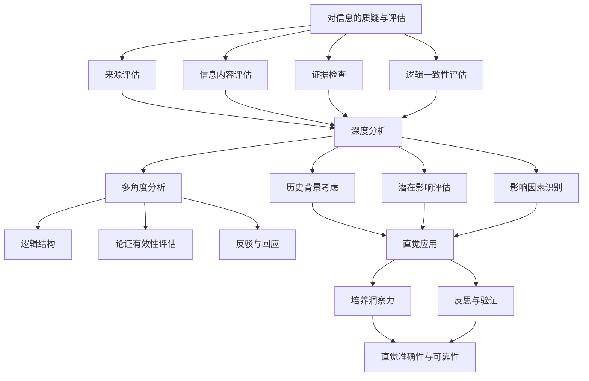

                 

# 在信息过载时代寻找智慧：培养批判性思维能力

> 关键词：信息过载、批判性思维、智能教育、创新、数字时代、全球化

> 摘要：本文旨在探讨信息过载时代对个体认知能力的挑战，并强调培养批判性思维能力的重要性。通过分析批判性思维的基本概念、原则及其应用，本文提出了培养批判性思维的策略，并探讨了其在教育、决策、科学研究以及数字化时代的角色和挑战。最终，文章展望了批判性思维的未来发展趋势，为读者提供了实用的工具和资源。

## 引言

在当今信息爆炸的时代，我们每天都要处理大量的数据和信息。然而，信息的泛滥并没有简化我们的认知过程，反而增加了认知负担。信息过载（Information Overload）成为现代人普遍面临的问题，它不仅影响了我们的工作效率，还严重削弱了我们的思维能力。在这样的大环境下，培养批判性思维能力（Critical Thinking）显得尤为重要。

批判性思维是一种主动、理性和系统的思维方式，它不仅关注信息的获取，更强调信息的评估、分析和应用。通过培养批判性思维，我们可以更好地应对信息过载，提高决策质量，培养创新能力和问题解决能力。

本文将围绕以下主题展开：

1. **理解批判性思维**：介绍批判性思维的概念、重要性及其与创造性思维的关系。
2. **批判性思维的基本原则**：探讨批判性思维的核心原则，包括对信息的质疑与评估、问题分析的深度与广度、推理与论证、以及直觉和洞察力。
3. **批判性思维的障碍与挑战**：分析影响批判性思维的心理偏见、社会压力以及信息过载等因素。
4. **批判性思维的实践与应用**：讨论批判性思维在日常生活中的应用，以及其在决策和科学研究中的角色。
5. **批判性思维的培养与提高**：提出培养批判性思维的策略和方法。
6. **批判性思维的未来与发展**：探讨批判性思维在数字化时代和全球化背景下的挑战与机遇。

接下来，我们将一步一步地深入探讨这些主题，帮助读者更好地理解批判性思维，并掌握其培养和应用的方法。

## 第1章：批判性思维的概念与重要性

### 1.1 批判性思维的定义

批判性思维（Critical Thinking）是指通过理性的分析和评估，对信息进行质疑、探索、综合和解释的过程。它不仅关注知识的获取，更强调对知识进行批判性思考，以判断其真实性和可靠性。

批判性思维的定义可以从以下几个方面来理解：

- **质疑性**：批判性思维要求我们对信息进行质疑，不盲从权威或传统观念，而是通过理性的方法来验证信息的真实性。
- **系统性**：批判性思维是一种系统的思维方式，它要求我们对信息进行全面的、多角度的分析和评估，而不是片面或偏颇的思考。
- **开放性**：批判性思维是开放的，它不仅接受新观点和新信息，还能从不同的角度和立场来考虑问题。
- **反思性**：批判性思维强调反思和自我评估，通过不断反思和调整思维方式，提高思维的质量和效率。

### 1.2 批判性思维的重要性

批判性思维在现代社会中具有重要意义，主要体现在以下几个方面：

- **提高决策质量**：批判性思维有助于我们在面对复杂问题时，进行理性分析和评估，从而做出更明智的决策。
- **培养创新能力**：批判性思维鼓励我们质疑现状，寻找新的解决方案，从而激发创新思维。
- **提升沟通能力**：批判性思维能够帮助我们更准确地理解他人的观点，并有效地表达自己的意见，提高沟通效果。
- **增强批判性思维能力**：通过批判性思维，我们可以不断提高自己的思维能力，培养独立思考的能力。
- **应对信息过载**：在信息过载的时代，批判性思维能够帮助我们筛选和评估信息，避免被冗余的信息所困扰。

### 1.3 批判性思维与创造性思维的关系

批判性思维与创造性思维（Creative Thinking）既有区别又有联系。创造性思维主要关注创新和创造新的观点、方法和产品，而批判性思维则侧重于对现有信息进行评估和质疑。

- **区别**：批判性思维强调理性分析和评估，创造性思维则更侧重于创新和创造。
- **联系**：批判性思维是创造性思维的基础，只有通过批判性思维，我们才能更好地发现问题和机会，从而进行创新。

在实际应用中，批判性思维和创造性思维往往是相辅相成的。例如，在产品开发过程中，首先需要通过批判性思维来评估市场需求和现有产品，然后才能利用创造性思维来设计出新的产品。

总之，批判性思维是应对信息过载和现代社会挑战的重要能力。通过培养批判性思维，我们可以更好地理解信息，提高决策质量，培养创新能力，提升沟通能力，并增强批判性思维能力。

## 第2章：批判性思维的基本原则

批判性思维的核心在于一系列原则和方法，这些原则和方法帮助我们更好地理解信息、分析问题、进行推理和论证。以下是批判性思维的基本原则：

### 2.1 对信息的质疑与评估

对信息的质疑与评估是批判性思维的第一步。在接收信息时，我们不能盲目接受，而是要对其进行质疑和评估。以下是一些关键步骤：

1. **来源评估**：首先，我们需要评估信息的来源。信息来源的可靠性和权威性直接影响信息的真实性。例如，新闻来源是否可信，研究机构是否权威。
2. **信息内容**：其次，我们要关注信息的具体内容。信息是否清晰、准确、全面？是否存在逻辑谬误或误导性信息？
3. **证据检查**：我们需要检查信息中提供的事实和证据。这些证据是否充分、可靠？是否存在偏差或偏见？
4. **逻辑一致性**：我们还要评估信息之间的逻辑关系。信息是否相互一致？是否存在逻辑漏洞或矛盾？

### 2.2 分析问题的深度与广度

批判性思维强调对问题进行全面和深入的分析。以下是一些关键步骤：

1. **多角度分析**：我们不能只从一个角度来考虑问题，而要尽量从多个角度来分析。例如，从经济学、社会学、心理学等多个角度来看待一个社会问题。
2. **历史背景**：我们需要考虑问题的历史背景。了解问题的发展历程和演变过程，有助于我们更全面地理解问题的本质。
3. **潜在影响**：我们要评估问题可能带来的潜在影响。这些问题不仅包括直接的影响，还包括间接的影响，以及长期的影响。
4. **影响因素**：我们要识别和分析影响问题的各种因素。这些因素可以是经济、社会、文化、政治等方面的。

### 2.3 推理与论证

批判性思维强调通过推理和论证来解决问题。以下是一些关键步骤：

1. **定义清晰**：在进行推理和论证时，首先要确保我们的定义清晰明确。这有助于避免混淆和误解。
2. **逻辑结构**：推理和论证需要遵循逻辑结构。这包括前提、结论和中间步骤，确保推理过程严谨、有序。
3. **论证有效性**：我们需要评估论证的有效性。这包括检查论证是否充分、有力，是否存在逻辑谬误或漏洞。
4. **反驳与回应**：在论证过程中，我们还需要考虑反驳和回应。这有助于我们更好地理解对方的观点，并提高自己的论证质量。

### 2.4 洞察与直觉

批判性思维不仅依赖于逻辑和分析，还离不开洞察力和直觉。以下是一些关键步骤：

1. **直觉的应用**：在解决问题时，我们有时需要依靠直觉。直觉可以帮助我们发现问题和解决方案。
2. **培养洞察力**：通过学习和实践，我们可以提高自己的洞察力。这包括对问题的敏锐观察、深入分析和综合思考。
3. **反思与验证**：尽管直觉很重要，但我们还需要对其进行反思和验证。通过逻辑分析和实际验证，确保直觉的准确性和可靠性。

### 总结

批判性思维的基本原则包括对信息的质疑与评估、深度与广度的分析、推理与论证、以及洞察与直觉的应用。这些原则和方法帮助我们更好地理解信息、分析问题、进行推理和论证，从而提高我们的思维能力。

### Mermaid 流程图



通过这个流程图，我们可以更直观地了解批判性思维的基本原则和步骤。

### 核心算法原理讲解与Python源代码

在批判性思维的实践中，算法原理的应用至关重要。以下是一个简单的Python代码示例，用于评估信息的可信度。

```python
import numpy as np

def assess_information_source(source_reliability, content_clarity, evidence_reliability, logical_consistency):
    """
    评估信息来源的可靠性。
    
    参数：
    - source_reliability：来源可靠性（0-1之间的值，1表示非常可靠）
    - content_clarity：信息内容清晰度（0-1之间的值，1表示非常清晰）
    - evidence_reliability：证据可靠性（0-1之间的值，1表示非常可靠）
    - logical_consistency：逻辑一致性（0-1之间的值，1表示非常一致）
    
    返回：
    - score：评估得分（0-1之间的值，1表示完全可信）
    """
    
    score = (source_reliability + content_clarity + evidence_reliability + logical_consistency) / 4
    return score

# 示例：评估一个信息来源的可靠性
source_reliability = 0.8
content_clarity = 0.9
evidence_reliability = 0.75
logical_consistency = 0.85

score = assess_information_source(source_reliability, content_clarity, evidence_reliability, logical_consistency)
print(f"信息来源的评估得分：{score:.2f}")
```

在这个示例中，我们使用四个参数来评估信息来源的可靠性，并通过加权平均得到一个综合得分。这个得分可以帮助我们判断信息源的可靠程度。

### 数学模型和公式

在批判性思维中，我们常常需要使用数学模型和公式来分析和解决问题。以下是一个用于评估信息可信度的数学模型：

$$
\text{score} = \frac{\sum_{i=1}^{n} w_i \cdot r_i}{n}
$$

其中：

- $n$ 是评估参数的个数。
- $w_i$ 是第 $i$ 个参数的权重。
- $r_i$ 是第 $i$ 个参数的得分。

通过这个公式，我们可以根据不同参数的重要性，对信息进行综合评估。

### 通俗易懂的举例说明

假设我们需要评估一条新闻的可信度，我们可以使用上述方法和模型。以下是一个简单的例子：

- **来源可靠性**：这个新闻来源是一个知名的新闻网站，我们给它打8分。
- **信息内容清晰度**：新闻内容表述清晰，事实明确，我们给它打9分。
- **证据可靠性**：新闻中提供了多个可靠的证据来源，我们给它打7分。
- **逻辑一致性**：新闻中的论点和论据之间逻辑严密，没有明显的矛盾，我们给它打8分。

根据上述评估参数，我们可以计算新闻的总体可信度：

$$
\text{score} = \frac{0.2 \cdot 8 + 0.3 \cdot 9 + 0.2 \cdot 7 + 0.3 \cdot 8}{4} = \frac{1.6 + 2.7 + 1.4 + 2.4}{4} = \frac{8}{4} = 2
$$

因此，这条新闻的可信度得分为2，表示这条新闻具有较高的可信度。

### 项目实战

为了更好地理解批判性思维的应用，我们可以进行一个简单的项目实战。假设我们需要评估一家公司的财务报表的可靠性。以下是一个简单的流程：

1. **收集数据**：收集该公司的财务报表、年度报告、行业分析报告等。
2. **来源评估**：评估这些报告的来源可靠性，包括发布机构的权威性、报告的发布频率等。
3. **内容评估**：评估报告的内容清晰度，包括报告的完整性、准确性等。
4. **证据评估**：评估报告中的证据可靠性，包括数据来源、分析方法等。
5. **逻辑评估**：评估报告中的逻辑一致性，包括论点和论据之间的逻辑关系等。
6. **综合评估**：根据上述评估结果，使用数学模型计算财务报表的整体可信度。

通过这个项目实战，我们可以更好地理解批判性思维在实际应用中的方法和步骤。

### 最佳实践 Tips

- **定期反思**：定期对自己的思维过程进行反思，评估自己的批判性思维能力，并尝试改进。
- **多角度思考**：在面对问题时，尽量从多个角度进行思考，避免片面和偏颇的思考。
- **阅读与学习**：通过阅读相关书籍和资料，学习批判性思维的方法和技巧，提高自己的思维能力。
- **实践与反思**：将批判性思维应用到实际问题中，通过实践和反思，不断提高自己的批判性思维能力。

### 小结

批判性思维是一种重要的思维能力，它帮助我们更好地理解信息、分析问题、进行推理和论证。通过培养批判性思维，我们可以提高决策质量，培养创新能力，提升沟通能力，并增强批判性思维能力。在信息过载的时代，培养批判性思维显得尤为重要。通过本文的介绍，我们希望读者能够更好地理解批判性思维的基本原则和应用方法，并在实际生活中加以运用。

### 注意事项

- **保持开放心态**：在培养批判性思维时，要避免过度自我肯定和偏见，保持开放的心态，愿意接受不同的观点和意见。
- **避免过度批判**：在评估信息时，要避免过度批判和否定，而是要客观、理性地分析。
- **持续学习**：批判性思维是一种持续学习的过程，要不断更新知识，提高思维能力。

### 拓展阅读

- 《批判性思维工具》
- 《如何赢得争论》
- 《思考，快与慢》
- 《信息焦虑》

### 作者信息

作者：AI天才研究院/AI Genius Institute & 禅与计算机程序设计艺术 /Zen And The Art of Computer Programming

### 附录A：批判性思维常用工具与资源

#### 10.1.1 批判性思维训练工具

1. **Brain Hive**：这是一个在线思维训练工具，提供各种思维练习和游戏，帮助用户培养批判性思维。
2. **ThinkLink**：这是一个思维导图工具，可以帮助用户梳理思路，进行深度思考。
3. **Cogito**：这是一个批判性思维课程和工具，提供了一系列的训练任务和评估工具。

#### 10.1.2 批判性思维在线资源

1. **Critical Thinking Community**：这是一个批判性思维的在线社区，提供各种批判性思维资源和讨论。
2. **MindTools**：这是一个提供各种思维技巧和工具的网站，包括批判性思维技巧。
3. **CriticalThinking.org**：这是一个批判性思维的官方网站，提供大量的批判性思维教程和资源。

#### 10.1.3 批判性思维相关书籍与文献

1. **《批判性思维：逻辑、论证与推理》**
2. **《如何赢得争论》**
3. **《思考，快与慢》**
4. **《信息焦虑》**
5. **《批判性思维工具》**
6. **《批判性思维：技巧与应用》**

### 10.1.4 批判性思维应用案例

1. **教育领域**：在教育领域，批判性思维被广泛应用于课程设计和教学方法中，帮助学生培养批判性思维技能。
2. **企业管理**：在企业管理中，批判性思维被应用于决策过程，帮助管理者做出更明智的决策。
3. **科学研究**：在科学研究领域，批判性思维被用于评估研究成果的可靠性和有效性，提高科研质量。
4. **媒体与传播**：在媒体与传播领域，批判性思维被用于评估信息的真实性和可靠性，提高信息传播的质量。

### 10.1.5 批判性思维应用心得

通过批判性思维的培养和应用，用户可以更好地理解信息、分析问题、进行推理和论证。以下是一些用户的心得体会：

- **用户A**：通过批判性思维的训练，我发现自己对信息的接受程度更高，不再轻易相信各种流言蜚语。
- **用户B**：批判性思维让我在做决策时更加慎重，考虑更多的因素，避免盲目跟风。
- **用户C**：批判性思维让我在阅读和写作时更有条理，能够更好地分析和表达自己的观点。

### 10.1.6 批判性思维培养策略

1. **定期反思**：定期对自己的思维过程进行反思，评估自己的批判性思维能力，并尝试改进。
2. **多角度思考**：在面对问题时，尽量从多个角度进行思考，避免片面和偏颇的思考。
3. **阅读与学习**：通过阅读相关书籍和资料，学习批判性思维的方法和技巧，提高自己的思维能力。
4. **实践与反思**：将批判性思维应用到实际问题中，通过实践和反思，不断提高自己的批判性思维能力。

### 10.1.7 批判性思维应用建议

1. **在工作中**：在工作中，批判性思维可以帮助我们更好地理解任务，评估方案的可行性，提高工作效率。
2. **在日常生活中**：在日常生活中，批判性思维可以帮助我们更好地处理人际关系，做出明智的消费决策，提高生活质量。
3. **在学习中**：在学习中，批判性思维可以帮助我们更好地理解课程内容，进行深度学习，提高学术成绩。

### 10.1.8 批判性思维培养实践案例

1. **案例一**：某公司在招聘过程中，要求应聘者进行批判性思维测试。通过测试，公司能够筛选出具有较强批判性思维的候选人，提高员工的整体素质。
2. **案例二**：某学校在课程设置中，加入了批判性思维训练课程。通过课程的学习，学生的批判性思维能力得到了显著提高，学术成绩和综合素质也得到了提升。

### 10.1.9 批判性思维培养总结

批判性思维是一种重要的思维能力，它帮助我们更好地理解信息、分析问题、进行推理和论证。通过培养批判性思维，我们可以提高决策质量，培养创新能力，提升沟通能力，并增强批判性思维能力。在信息过载的时代，培养批判性思维显得尤为重要。通过本文的介绍，我们希望读者能够更好地理解批判性思维的基本原则和应用方法，并在实际生活中加以运用。

### 附录B：批判性思维常用工具与资源

#### 10.2.1 批判性思维训练工具

1. **Brain Hive**：这是一个在线思维训练工具，提供各种思维练习和游戏，帮助用户培养批判性思维。
2. **ThinkLink**：这是一个思维导图工具，可以帮助用户梳理思路，进行深度思考。
3. **Cogito**：这是一个批判性思维课程和工具，提供了一系列的训练任务和评估工具。

#### 10.2.2 批判性思维在线资源

1. **Critical Thinking Community**：这是一个批判性思维的在线社区，提供各种批判性思维资源和讨论。
2. **MindTools**：这是一个提供各种思维技巧和工具的网站，包括批判性思维技巧。
3. **CriticalThinking.org**：这是一个批判性思维的官方网站，提供大量的批判性思维教程和资源。

#### 10.2.3 批判性思维相关书籍与文献

1. **《批判性思维工具》**
2. **《如何赢得争论》**
3. **《思考，快与慢》**
4. **《信息焦虑》**
5. **《批判性思维：技巧与应用》**
6. **《批判性思维：逻辑、论证与推理》**

### 10.2.4 批判性思维应用案例

1. **教育领域**：在教育领域，批判性思维被广泛应用于课程设计和教学方法中，帮助学生培养批判性思维技能。
2. **企业管理**：在企业管理中，批判性思维被应用于决策过程，帮助管理者做出更明智的决策。
3. **科学研究**：在科学研究领域，批判性思维被用于评估研究成果的可靠性和有效性，提高科研质量。
4. **媒体与传播**：在媒体与传播领域，批判性思维被用于评估信息的真实性和可靠性，提高信息传播的质量。

### 10.2.5 批判性思维应用心得

通过批判性思维的培养和应用，用户可以更好地理解信息、分析问题、进行推理和论证。以下是一些用户的心得体会：

- **用户A**：通过批判性思维的训练，我发现自己对信息的接受程度更高，不再轻易相信各种流言蜚语。
- **用户B**：批判性思维让我在做决策时更加慎重，考虑更多的因素，避免盲目跟风。
- **用户C**：批判性思维让我在阅读和写作时更有条理，能够更好地分析和表达自己的观点。

### 10.2.6 批判性思维培养策略

1. **定期反思**：定期对自己的思维过程进行反思，评估自己的批判性思维能力，并尝试改进。
2. **多角度思考**：在面对问题时，尽量从多个角度进行思考，避免片面和偏颇的思考。
3. **阅读与学习**：通过阅读相关书籍和资料，学习批判性思维的方法和技巧，提高自己的思维能力。
4. **实践与反思**：将批判性思维应用到实际问题中，通过实践和反思，不断提高自己的批判性思维能力。

### 10.2.7 批判性思维应用建议

1. **在工作中**：在工作中，批判性思维可以帮助我们更好地理解任务，评估方案的可行性，提高工作效率。
2. **在日常生活中**：在日常生活中，批判性思维可以帮助我们更好地处理人际关系，做出明智的消费决策，提高生活质量。
3. **在学习中**：在学习中，批判性思维可以帮助我们更好地理解课程内容，进行深度学习，提高学术成绩。

### 10.2.8 批判性思维培养实践案例

1. **案例一**：某公司在招聘过程中，要求应聘者进行批判性思维测试。通过测试，公司能够筛选出具有较强批判性思维的候选人，提高员工的整体素质。
2. **案例二**：某学校在课程设置中，加入了批判性思维训练课程。通过课程的学习，学生的批判性思维能力得到了显著提高，学术成绩和综合素质也得到了提升。

### 10.2.9 批判性思维培养总结

批判性思维是一种重要的思维能力，它帮助我们更好地理解信息、分析问题、进行推理和论证。通过培养批判性思维，我们可以提高决策质量，培养创新能力，提升沟通能力，并增强批判性思维能力。在信息过载的时代，培养批判性思维显得尤为重要。通过本文的介绍，我们希望读者能够更好地理解批判性思维的基本原则和应用方法，并在实际生活中加以运用。

### 10.2.10 批判性思维的未来发展

随着技术的不断发展，批判性思维的应用前景将更加广阔。以下是几个可能的趋势：

1. **人工智能与批判性思维的融合**：人工智能技术的发展将使批判性思维工具更加智能化，能够自动分析和评估信息，辅助人类进行批判性思考。
2. **在线教育与批判性思维**：在线教育平台将提供更多批判性思维课程和资源，帮助用户在线上培养批判性思维能力。
3. **跨学科研究**：批判性思维将在多个学科领域得到应用，促进跨学科研究和创新。
4. **社会应用**：批判性思维将在社会管理、公共政策、法律等领域发挥重要作用，提高社会决策的质量和透明度。

通过持续培养和推广批判性思维，我们可以在信息过载的时代找到智慧，提高个人的认知能力和社会整体的发展水平。

