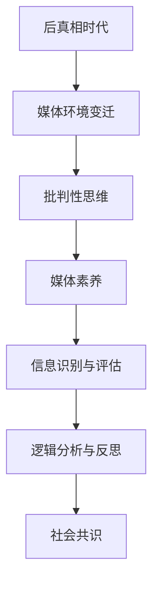
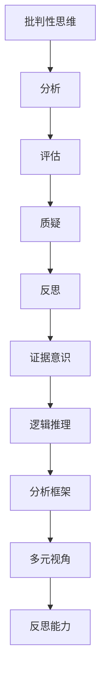
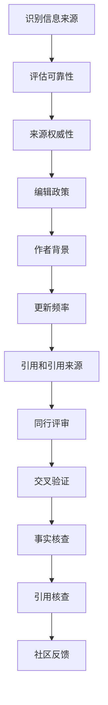
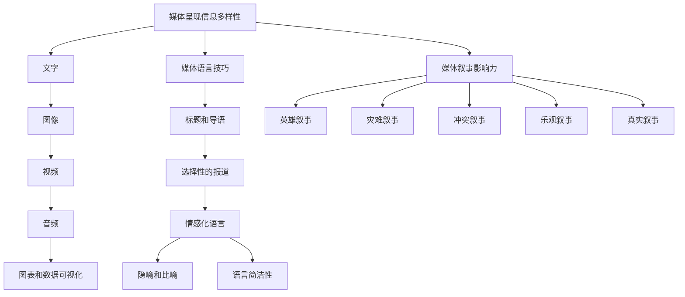
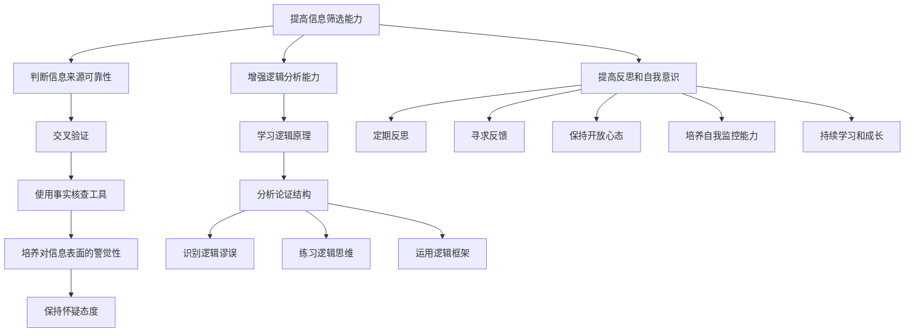
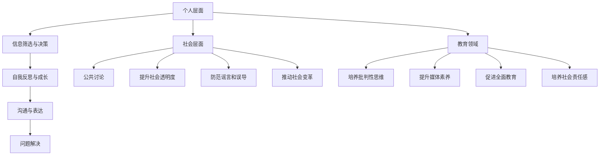
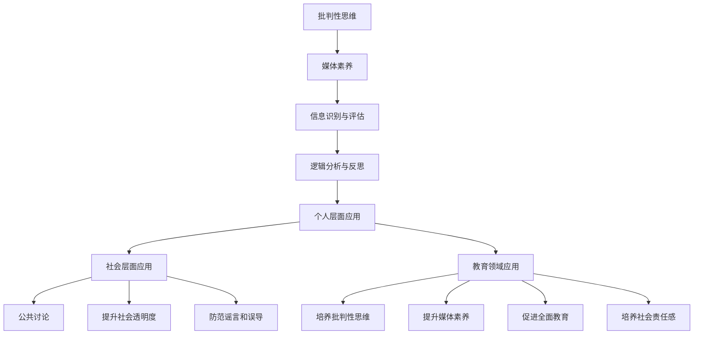

                 

## 引言

### 后真相时代的定义与特征

后真相（Post-Truth）时代，又称后事实时代，是指信息传播不再仅仅依据事实和证据，而是更多地受到情感、个人信念和叙事的影响力。这一概念首次出现在2016年，源自于英国广播公司（BBC）一篇关于2016年美国总统选举的报道，随后迅速成为全球范围内讨论的热点。

后真相时代的特征主要体现在以下几个方面：

1. **情感驱动**：信息传播更加关注情感反应，而非事实本身。社交媒体平台和新闻媒体为了吸引眼球，往往倾向于报道具有争议性、刺激性或情感色彩的内容。
   
2. **虚假信息泛滥**：由于互联网的低门槛和高传播速度，虚假信息、谣言和阴谋论得以迅速传播，且难以遏制。这些信息可能来自于恶意用户、自动化机器人等，对公众认知和社会稳定构成威胁。

3. **权威性下降**：在传统媒体时代，权威性主要来自于专业机构、专家和官方声明。而在后真相时代，这种权威性受到了挑战，自媒体、社交媒体上的“专家”和“意见领袖”也能获得广泛的关注和信任。

4. **真相的复杂性**：在信息爆炸的时代，真相往往隐藏在复杂的背景、数据和分析之中，普通人难以辨别。同时，一些信息故意设计成模糊不清，以混淆视听。

### 媒体环境的变迁

媒体环境的变迁是后真相时代形成的重要原因之一。在过去，媒体主要由传统媒体（如报纸、电视、广播）主导，信息来源相对集中，受众获取信息的渠道较为有限。然而，随着互联网和移动设备的普及，媒体环境发生了翻天覆地的变化：

1. **去中心化**：互联网使得信息传播变得更加去中心化，任何人都可以成为信息发布者。社交媒体平台成为新的信息传播渠道，信息传播速度和覆盖范围大幅提升。

2. **信息过载**：随着信息来源的多样化，受众面临的信息量也大幅增加。如何在海量信息中筛选出有价值的信息成为一个挑战。

3. **算法推荐**：社交媒体和搜索引擎采用算法推荐，根据用户的历史行为和偏好，向用户推送相关内容。这种个性化推荐虽然提升了用户体验，但也可能导致信息茧房，限制用户的视野。

4. **商业利益**：在商业利益的驱动下，一些媒体为了吸引更多用户和广告收入，可能会夸大、歪曲甚至伪造信息，以获取更多的关注。

### 媒体素养的重要性

面对后真相时代的挑战，培养批判性思维和媒体素养变得尤为重要。以下是几个关键点：

1. **提高信息识别能力**：通过培养批判性思维，人们能够更好地识别和评估信息来源的可靠性，减少对虚假信息的信任。

2. **培养逻辑分析能力**：媒体素养不仅仅是识别信息，更重要的是理解信息的逻辑结构和论证方式，避免被情感驱动和信息表面所误导。

3. **增强自我反思能力**：在信息过载的时代，人们需要学会反思自己的信息来源、观点和决策，避免盲目从众。

4. **促进社会共识**：通过批判性思维和媒体素养的培养，可以促进公众对社会问题有更全面、深入的理解，从而形成更加健康的社会共识。

### 核心概念与联系

为了更好地理解批判性思维和媒体素养在后真相时代的应用，我们可以通过一个Mermaid流程图来展示它们之间的关系：



总的来说，后真相时代对媒体素养和批判性思维提出了新的要求。通过深入理解这些核心概念和它们之间的联系，我们能够更好地应对这个复杂的信息环境，提升个人的信息素养和决策能力。

### 第1章：后真相时代的媒体环境

在后真相时代，媒体的性质和功能经历了显著的转变。理解这些变化对于培养批判性思维和媒体素养至关重要。以下是后真相时代媒体环境的几个关键方面。

#### 1.1 后真相时代的定义与特征

后真相时代指的是在信息传播中，情感和主观观点往往比事实本身更能影响公众认知和决策的时代。这一现象在社交媒体、网络新闻、博客等新媒体形式中尤为突出。以下是后真相时代的几个主要特征：

1. **情感驱动**：信息传播更加关注情感反应，而非事实本身。社交媒体平台和新闻媒体为了吸引眼球，往往倾向于报道具有争议性、刺激性或情感色彩的内容。

2. **虚假信息泛滥**：由于互联网的低门槛和高传播速度，虚假信息、谣言和阴谋论得以迅速传播，且难以遏制。这些信息可能来自于恶意用户、自动化机器人等，对公众认知和社会稳定构成威胁。

3. **权威性下降**：在传统媒体时代，权威性主要来自于专业机构、专家和官方声明。而在后真相时代，这种权威性受到了挑战，自媒体、社交媒体上的“专家”和“意见领袖”也能获得广泛的关注和信任。

4. **真相的复杂性**：在信息爆炸的时代，真相往往隐藏在复杂的背景、数据和分析之中，普通人难以辨别。同时，一些信息故意设计成模糊不清，以混淆视听。

#### 1.2 媒体环境的变迁

媒体环境的变迁是后真相时代形成的重要原因之一。以下是几个关键点：

1. **去中心化**：互联网使得信息传播变得更加去中心化，任何人都可以成为信息发布者。社交媒体平台成为新的信息传播渠道，信息传播速度和覆盖范围大幅提升。

2. **信息过载**：随着信息来源的多样化，受众面临的信息量也大幅增加。如何在海量信息中筛选出有价值的信息成为一个挑战。

3. **算法推荐**：社交媒体和搜索引擎采用算法推荐，根据用户的历史行为和偏好，向用户推送相关内容。这种个性化推荐虽然提升了用户体验，但也可能导致信息茧房，限制用户的视野。

4. **商业利益**：在商业利益的驱动下，一些媒体为了吸引更多用户和广告收入，可能会夸大、歪曲甚至伪造信息，以获取更多的关注。

#### 1.3 媒体素养的重要性

在媒体环境变迁和后真相时代的背景下，媒体素养变得尤为重要。以下是媒体素养的一些关键点：

1. **信息识别能力**：通过培养批判性思维，人们能够更好地识别和评估信息来源的可靠性，减少对虚假信息的信任。

2. **逻辑分析能力**：媒体素养不仅仅是识别信息，更重要的是理解信息的逻辑结构和论证方式，避免被情感驱动和信息表面所误导。

3. **自我反思能力**：在信息过载的时代，人们需要学会反思自己的信息来源、观点和决策，避免盲目从众。

4. **促进社会共识**：通过批判性思维和媒体素养的培养，可以促进公众对社会问题有更全面、深入的理解，从而形成更加健康的社会共识。

#### 1.4 批判性思维在媒体素养中的作用

批判性思维在媒体素养中起着核心作用。以下是批判性思维在媒体素养中的几个关键方面：

1. **信息评估**：批判性思维帮助人们评估信息的来源、可靠性和论证逻辑，从而减少对虚假信息和错误信息的依赖。

2. **避免偏见**：批判性思维有助于人们识别并克服个人偏见和认知偏差，从而更客观地分析问题。

3. **促进深度理解**：批判性思维促使人们深入思考问题的各个方面，从而获得更全面的理解。

4. **提高决策能力**：通过批判性思维，人们能够更明智地做出决策，避免被短期的情感波动或虚假信息所影响。

#### 1.5 媒体素养对个体和社会的影响

媒体素养不仅对个体有重要影响，也对整个社会产生深远的影响。以下是媒体素养对个体和社会的几个关键方面：

1. **个体影响**：
   - 提高信息识别能力，减少虚假信息的影响。
   - 增强逻辑分析能力，避免被表面信息误导。
   - 提高自我反思能力，避免盲目从众。
   - 增强批判性思维，促进个人成长和认知发展。

2. **社会影响**：
   - 促进社会共识的形成，减少因信息不对称和误解导致的社会冲突。
   - 提高公众对社会问题的理解和关注，促进社会问题的解决。
   - 增强社会的整体信息素养，提高公众参与公共事务的能力。

#### 1.6 核心概念与联系

为了更好地理解批判性思维和媒体素养在后真相时代的应用，我们可以通过一个Mermaid流程图来展示它们之间的关系：


总的来说，后真相时代对媒体素养和批判性思维提出了新的要求。通过深入理解这些核心概念和它们之间的联系，我们能够更好地应对这个复杂的信息环境，提升个人的信息素养和决策能力。

### 第2章：批判性思维的基本原理

批判性思维是一种积极的思维方式，它涉及对信息、观点和证据的深入分析、评估和质疑。在信息泛滥、虚假信息层出不穷的后真相时代，培养批判性思维尤为重要。以下是批判性思维的基本原理。

#### 2.1 批判性思维的含义

批判性思维不仅仅是批评或否定，而是一种系统性的思考方式，它包括以下几个关键要素：

1. **分析**：批判性思维要求对问题进行深入分析，理解其各个方面和细节，以便形成全面的看法。

2. **评估**：评估信息、观点和证据的可靠性、相关性和有效性。这包括评估信息的来源、论证的逻辑性和证据的充分性。

3. **质疑**：质疑现有的观点、理论和信息，寻求更深入的理解和更全面的事实。

4. **反思**：在思考过程中不断反思自己的观点和假设，以便确保思维的公正性和全面性。

#### 2.2 批判性思维的重要性

批判性思维在多个领域都有重要作用，尤其在信息技术和人工智能领域更为显著。以下是批判性思维的重要性：

1. **避免误导**：通过批判性思维，可以避免被虚假信息、谣言和误导性的观点所影响。

2. **提高决策质量**：在处理复杂问题和做出决策时，批判性思维有助于评估各种可能性和后果，从而做出更明智的选择。

3. **促进创新**：批判性思维鼓励人们挑战现状、寻找新的解决方案，从而推动技术进步和创新。

4. **增强沟通**：批判性思维有助于更清晰、准确地表达观点，同时理解他人的观点，从而改善沟通效果。

#### 2.3 批判性思维的核心要素

批判性思维包括以下几个核心要素：

1. **证据意识**：重视证据，理解证据的类型和评估方法。证据可以是数据、事实、专家意见等。

2. **逻辑推理**：理解逻辑原理，能够识别有效的论证和谬误。逻辑推理包括归纳推理和演绎推理。

3. **分析框架**：使用系统性的框架来分析问题，如SWOT分析、PEST分析等。

4. **多元视角**：从多个角度和视角来分析问题，以获得更全面的理解。

5. **反思能力**：在思考过程中不断反思，质疑自己的假设和结论，确保思维的公正性和全面性。

#### 2.4 批判性思维的方法论

以下是一些常用的批判性思维方法论：

1. **五步思考法**：
   - 提出问题或假设。
   - 收集和分析证据。
   - 评估论证的有效性。
   - 考虑替代性解释。
   - 做出结论或提出新的问题。

2. **三段论法**：
   - 大前提：所有A都是B。
   - 小前提：这个个体是A。
   - 结论：因此，这个个体是B。

3. **因果分析**：
   - 确定原因和结果之间的关系。
   - 考虑可能的替代性原因。
   - 验证因果关系的强度和可靠性。

4. **假设检验**：
   - 提出一个假设。
   - 设计实验或收集数据来验证或推翻假设。
   - 根据实验结果调整假设。

#### 2.5 核心概念与联系

为了更好地理解批判性思维的基本原理，我们可以通过一个Mermaid流程图来展示其核心概念和联系：



总的来说，批判性思维是一种全面的思考方式，它要求我们在分析、评估和质疑信息时保持高度的意识和警觉。通过理解批判性思维的基本原理和方法论，我们可以更有效地应对后真相时代的挑战，提升个人的信息素养和决策能力。

### 第3章：识别并评估信息来源

在信息泛滥的时代，识别并评估信息来源的可靠性成为一项至关重要的能力。这一章节将深入探讨如何识别信息来源，评估其可靠性，并介绍一些常见的信息来源评估方法。

#### 3.1 识别信息来源的重要性

在做出任何决策或形成观点时，了解信息来源的可靠性是至关重要的。以下是识别信息来源的重要性的几个方面：

1. **确保信息真实性**：可靠的信息来源可以提供准确、真实的数据和事实，减少对虚假信息的依赖。

2. **防止误导**：识别不可靠的信息来源有助于避免被误导，避免因错误信息导致的错误决策或行为。

3. **提升决策质量**：可靠的来源能够提供更全面、深入的信息，有助于做出更明智的决策。

4. **增强批判性思维**：识别信息来源的过程本身就是一种批判性思维的训练，有助于培养更深入的思考能力。

#### 3.2 评估信息来源的可靠性

评估信息来源的可靠性需要考虑多个方面，以下是一些关键因素：

1. **来源的权威性**：权威性来源通常包括学术机构、政府机构、专业协会等。这些来源因其专业性和严谨性而具有较高的可靠性。

2. **编辑政策**：了解信息来源的编辑政策，如是否接受广告赞助、是否遵循科学验证等，可以帮助判断其公正性和客观性。

3. **作者背景**：了解作者的背景和资质，可以评估其专业性和可靠性。例如，学术论文通常需要作者具备相关领域的研究背景和资格。

4. **更新频率**：定期更新信息表明来源对内容保持关注和认真负责。过时或长期未更新的内容可能存在信息不准确的风险。

5. **引用和引用来源**：可靠的信息来源通常会引用其他权威文献或数据，这些引用可以作为评估其可靠性的依据。

6. **同行评审**：学术领域中的同行评审是评估信息可靠性的重要手段。同行评审确保研究内容经过专业同行的检验和认可。

#### 3.3 常见的信息来源评估方法

以下是几种常见的信息来源评估方法：

1. **交叉验证**：通过多个来源的信息进行交叉验证，确保信息的准确性和一致性。

2. **事实核查**：使用事实核查网站或工具来验证信息的真实性。例如，Snopes和FactCheck.org是著名的事实核查网站。

3. **引用核查**：对信息来源中的引用进行核查，确保引用的文献或数据是可靠和权威的。

4. **透明度评估**：评估信息来源的透明度，包括是否公开编辑政策、作者资质、数据来源等。

5. **社区反馈**：通过社交媒体或专业论坛等社区平台，了解其他用户对信息来源的评价和反馈。

#### 3.4 实际案例

为了更好地理解如何识别和评估信息来源，我们可以通过一个实际案例来进行讲解。

**案例：评估某篇健康类文章的可靠性**

假设我们想评估一篇关于“如何预防新冠”的健康类文章的可靠性。

1. **来源权威性**：查看文章的来源，发现它是一个知名的健康网站，通常发布权威性的健康信息。

2. **编辑政策**：查看网站的编辑政策，发现其遵循科学验证，所有文章都需要经过医学专家的审核。

3. **作者背景**：作者是一位知名的医学博士，具备丰富的临床经验和研究背景。

4. **更新频率**：文章最近更新于2023年，表明信息相对最新。

5. **引用和引用来源**：文章中引用了多篇权威的医学研究文献，这些文献均经过同行评审。

6. **同行评审**：虽然健康类文章不一定都需要同行评审，但该网站有严格的审核流程。

通过以上评估方法，我们可以认为这篇文章具有较高的可靠性。

#### 3.5 核心概念与联系

为了更好地理解识别和评估信息来源的过程，我们可以通过一个Mermaid流程图来展示其核心概念和联系：



总的来说，识别并评估信息来源是批判性思维的重要组成部分。通过了解信息来源的可靠性，我们可以更有效地筛选有价值的信息，避免被虚假信息误导。了解这些评估方法，并结合实际案例进行练习，将有助于提升我们的媒体素养和批判性思维能力。

### 第4章：理解媒体呈现的信息

在复杂的信息环境中，理解媒体如何呈现信息是培养批判性思维和媒体素养的关键一步。这一章节将探讨媒体呈现信息的多样性、媒体语言的技巧以及媒体叙事的影响力。

#### 4.1 媒体呈现信息的多样性

现代媒体环境充满了多样化的信息呈现方式，这些方式不仅包括传统的文字和图像，还涵盖了视频、音频、图表和数据可视化等多种形式。以下是几种常见的媒体呈现方式：

1. **文字**：文字是最基本的信息呈现方式，包括新闻报道、博客文章、评论等。文字的优势在于信息的详细性和深度，但可能需要较长的阅读时间。

2. **图像**：图像包括照片、插图和漫画等，它们能够快速传递信息，引发情感反应，但可能存在误导性，需要结合其他信息来源进行评估。

3. **视频**：视频是一种动态的媒体形式，能够通过视觉和听觉结合的方式传递复杂的信息。然而，视频可能受到剪辑和编辑的影响，需要仔细分析其内容和背景。

4. **音频**：音频包括新闻报道、播客和采访等，它们能够通过声音传递信息，但可能缺少视觉辅助，需要额外的关注来理解信息。

5. **图表和数据可视化**：图表和数据可视化能够将复杂的数据和趋势以直观的方式呈现，有助于理解和分析信息。然而，图表可能存在误导性，需要仔细分析其数据来源和表示方法。

#### 4.2 媒体语言的技巧

媒体语言具有特定的技巧和风格，这些技巧可以影响公众的理解和反应。以下是几种常见的媒体语言技巧：

1. **标题和导语**：标题和导语是吸引读者注意的关键，它们往往采用夸张、引人注目的语言来吸引读者。然而，这些标题和导语可能夸大事实或具有误导性，需要读者仔细分辨。

2. **选择性的报道**：媒体可能选择性地报道信息，只报道有利于其观点或利益的信息，而忽略其他角度或事实。这种选择性的报道可能影响公众对事件的全面理解。

3. **情感化语言**：情感化的语言能够引起读者的情感反应，使信息更加吸引人。然而，过度使用情感化语言可能误导读者，使其忽略事实的客观性。

4. **隐喻和比喻**：隐喻和比喻是增强语言表现力的有效手段，但它们可能隐藏信息的真正含义，需要读者深入分析。

5. **语言简洁性**：媒体文章往往追求简洁性，以便快速传递信息。然而，简洁性可能导致信息的模糊性或误导性，需要读者仔细理解。

#### 4.3 媒体叙事的影响力

媒体叙事是一种通过故事讲述信息的方式，它能够影响公众的认知、情感和行动。以下是几种常见的媒体叙事方式：

1. **英雄叙事**：英雄叙事通常讲述一个具有英雄特质的人物或团队，他们的成就和奋斗激励公众。然而，这种叙事可能夸大个人或团队的作用，忽略其他因素。

2. **灾难叙事**：灾难叙事通常讲述一个灾难事件或一系列不幸事件，以引起公众的关注和同情。这种叙事可能夸大事实或引导公众产生恐慌情绪。

3. **冲突叙事**：冲突叙事通过展示不同利益群体之间的冲突，吸引公众的关注。然而，这种叙事可能简化复杂的社会问题，忽视潜在的解决方案。

4. **乐观叙事**：乐观叙事通常展示一个积极向上的未来，鼓励公众对未来充满希望。然而，这种叙事可能忽略现实中的困难和挑战。

5. **真实叙事**：真实叙事通过讲述真实人物的真实经历，吸引公众的关注。这种叙事通常具有较高的可信度，但可能需要额外的背景信息来理解。

#### 4.4 实际案例

为了更好地理解媒体呈现信息的多样性、语言技巧和叙事影响力，我们可以通过一个实际案例来进行讲解。

**案例：分析一篇关于“气候变化”的新闻报道**

1. **媒体呈现方式**：
   - 文字：文章主要通过文字叙述，详细介绍了气候变化的原因、影响和应对措施。
   - 图表：文章附带了多个图表，展示了全球气温变化趋势和不同地区的气候变化影响。

2. **媒体语言技巧**：
   - 标题：“全球气候危机迫在眉睫，我们该如何应对？”
   - 情感化语言：“我们的地球正在面临前所未有的危机，每一个人的行动都至关重要。”
   - 选择性报道：文章主要聚焦于气候变化的负面影响，忽略了一些积极应对措施和进展。

3. **媒体叙事**：
   - 灾难叙事：文章通过描述气候变化的灾难性影响，如极端天气事件、海平面上升等，以引起公众的恐慌和关注。
   - 乐观叙事：文章提到一些国际合作和科技创新的积极进展，但整体上仍以灾难叙事为主。

通过这个案例，我们可以看到媒体如何通过不同的呈现方式、语言技巧和叙事方式来影响公众对气候变化问题的认知和反应。了解这些技巧，结合批判性思维，有助于我们更全面地理解媒体信息。

#### 4.5 核心概念与联系

为了更好地理解媒体呈现信息的多样性、语言技巧和叙事影响力，我们可以通过一个Mermaid流程图来展示其核心概念和联系：



总的来说，理解媒体如何呈现信息是培养批判性思维和媒体素养的关键一步。通过识别和批判这些呈现方式、语言技巧和叙事方式，我们可以更准确地评估媒体信息的真实性、完整性和意图，从而做出更明智的判断和决策。

### 第5章：培养批判性思维能力

批判性思维能力是我们在这个信息爆炸、虚假信息泛滥的后真相时代中，应对复杂问题的关键能力。本章将探讨如何通过提高信息筛选能力、增强逻辑分析能力和提高反思和自我意识，来培养和提升批判性思维能力。

#### 5.1 提高信息筛选能力

在信息泛滥的时代，我们每天都会接触到大量的信息。如何筛选出有价值的信息，避免被虚假信息所误导，是培养批判性思维能力的重要一环。以下是一些提高信息筛选能力的具体方法：

1. **判断信息来源的可靠性**：在接收信息时，首先要评估信息来源的权威性。权威的信息来源通常包括学术机构、政府官方发布、知名媒体和专业组织等。我们可以通过查看网站、作者资质和编辑政策来判断信息的可靠性。

2. **交叉验证**：通过多个来源的信息进行交叉验证，确保信息的准确性和一致性。如果多个权威来源都报道了同一信息，那么这个信息的可靠性会更高。

3. **使用事实核查工具**：利用事实核查网站或工具（如Snopes、FactCheck.org）来验证信息的真实性。这些工具可以帮助我们识别和纠正虚假信息。

4. **培养对信息表面的警觉性**：避免被标题党、夸张描述或情感化语言所迷惑。学会从信息表面背后挖掘更深层次的内容和事实。

5. **保持怀疑态度**：对来源不明、缺乏证据支持或逻辑不通的信息保持怀疑，进一步验证其真实性。

#### 5.2 增强逻辑分析能力

逻辑分析能力是批判性思维的核心要素之一。以下是一些增强逻辑分析能力的方法：

1. **学习逻辑原理**：了解基本的逻辑原理，如因果关系、归纳推理、演绎推理、论证的有效性等。这些原理有助于我们识别逻辑谬误，评估论证的合理性。

2. **分析论证结构**：学会分析信息的论证结构，了解其前提、假设和结论。通过评估论证的逻辑严密性，我们可以判断信息是否具有说服力。

3. **识别逻辑谬误**：常见的逻辑谬误包括偷换概念、以偏概全、混淆因果关系等。识别这些谬误可以帮助我们避免被误导。

4. **练习逻辑思维**：通过阅读逻辑学相关书籍、参与辩论和逻辑思维训练，提高逻辑分析能力。

5. **运用逻辑框架**：使用系统性的逻辑框架来分析问题，如SWOT分析、PEST分析等。这些框架可以帮助我们更全面、系统地思考问题。

#### 5.3 提高反思和自我意识

反思和自我意识是批判性思维的重要组成部分。以下是一些提高反思和自我意识的方法：

1. **定期反思**：定期回顾自己的思考过程、观点和决策，评估其合理性和有效性。通过反思，我们可以发现自己的认知偏差和逻辑错误。

2. **寻求反馈**：向他人寻求反馈，了解自己的思考方式和决策是否合理。他人的观点和意见可以帮助我们发现自身的盲点。

3. **保持开放心态**：对不同的观点和意见保持开放态度，愿意接受和考虑不同的观点。这有助于我们形成更全面、客观的思考。

4. **培养自我监控能力**：在思考过程中，时刻关注自己的思维过程和情绪变化，避免被情感驱动而做出不理性的决策。

5. **持续学习和成长**：通过不断学习和积累知识，提高自己的认知水平和思维能力。这有助于我们更好地应对复杂的问题和挑战。

#### 5.4 实际案例

为了更好地理解如何培养批判性思维能力，我们可以通过一个实际案例来进行讲解。

**案例：分析一则社交媒体上的谣言**

假设我们在社交媒体上看到一则关于“某品牌产品致癌”的谣言。以下是如何运用批判性思维能力来分析这则谣言：

1. **判断信息来源**：查看谣言的来源，发现它来自于一个未知的社交媒体账号，没有权威性。

2. **交叉验证**：通过其他可靠的信息来源（如政府官方发布、权威医学期刊）进行交叉验证，发现没有科学证据支持这则谣言。

3. **分析论证结构**：谣言的论证结构是“某品牌产品被检测出含有致癌物质，因此该产品致癌”。我们分析发现，这个论证存在以偏概全的逻辑谬误，因为单一检测结果并不能证明产品的整体致癌性。

4. **反思和自我监控**：在分析过程中，我们反思自己的情绪反应，避免被谣言所影响，保持理性。

通过这个案例，我们可以看到如何通过批判性思维来分析和评估社交媒体上的谣言，避免被误导。

#### 5.5 核心概念与联系

为了更好地理解培养批判性思维能力的方法，我们可以通过一个Mermaid流程图来展示其核心概念和联系：



总的来说，培养批判性思维能力需要我们在多个方面进行努力。通过提高信息筛选能力、增强逻辑分析能力和提高反思和自我意识，我们可以更好地应对复杂的信息环境，做出更明智的决策和判断。

### 第6章：应用批判性思维和媒体素养

批判性思维和媒体素养不仅是个体层面的能力，它们在个人层面、社会层面和教育领域也具有广泛的应用价值。在这一章节中，我们将探讨批判性思维和媒体素养在各个层面的具体应用，以及它们对社会、教育和个人发展的影响。

#### 6.1 个人层面的应用

在个人层面，批判性思维和媒体素养的应用主要体现在以下几个方面：

1. **信息筛选和决策**：通过批判性思维，个人能够更有效地筛选信息，避免被虚假信息误导。这种能力在日常生活和工作中至关重要，尤其是在做出重要决策时。

2. **自我反思和成长**：批判性思维促使个人不断反思自己的观点和行为，从而促进自我认知和成长。通过媒体素养，个人能够识别和克服自身的偏见和盲点，提高自我意识和情商。

3. **沟通和表达**：批判性思维和媒体素养有助于个人更清晰、准确地表达观点，同时理解他人的立场。这种有效的沟通能力在职业发展和人际交往中具有重要意义。

4. **问题解决**：在面对复杂问题时，批判性思维能够帮助个人分析问题的各个方面，找到最佳的解决方案。媒体素养则提供了丰富的信息和视角，有助于更全面地分析问题。

#### 6.2 社会层面的应用

在社会层面，批判性思维和媒体素养的应用同样具有重要意义：

1. **促进公共讨论**：通过批判性思维，公众能够更深入、理性地参与公共讨论，形成基于事实和逻辑的共识。媒体素养则帮助公众更好地理解复杂的公共议题，提高公共参与度。

2. **提升社会透明度**：批判性思维和媒体素养有助于揭露虚假信息和不当行为，提升社会透明度。这有助于社会公平、正义和民主的发展。

3. **防范谣言和误导**：在社会层面上，批判性思维和媒体素养能够有效防范谣言和误导信息的传播，维护社会稳定和公共安全。

4. **推动社会变革**：批判性思维和媒体素养能够激发公众对社会问题的关注和反思，推动社会变革和进步。通过媒体素养，公众能够更有效地传播正义和真相，推动社会公正。

#### 6.3 教育领域的应用

在教育领域，批判性思维和媒体素养的培养具有深远的影响：

1. **培养学生的批判性思维**：批判性思维是教育的重要目标之一。通过批判性思维的训练，学生能够更好地理解知识，培养独立思考和创新能力。

2. **提升媒体素养**：随着信息时代的到来，媒体素养成为学生必备的素养之一。通过媒体素养的教育，学生能够更有效地识别和评估信息，提高信息素养和判断力。

3. **促进全面教育**：批判性思维和媒体素养有助于促进全面教育，培养学生的综合素质。这种教育不仅关注知识的传授，更关注学生的思维能力、价值观和道德修养。

4. **培养社会责任感**：批判性思维和媒体素养教育有助于学生形成社会责任感，积极参与社会事务，成为有责任感的公民。

#### 6.4 实际案例

为了更好地理解批判性思维和媒体素养在各个层面的应用，我们可以通过一个实际案例来进行讲解。

**案例：某高中开展批判性思维和媒体素养课程**

某高中为了提升学生的批判性思维和媒体素养，开展了专门的课程，以下是该课程的一些具体做法：

1. **课程内容**：
   - 批判性思维部分：学习逻辑原理、论证结构分析、逻辑谬误识别等。
   - 媒体素养部分：学习信息来源评估、事实核查、情感化语言的识别等。

2. **教学方法**：
   - 实践导向：通过实际案例、辩论、小组讨论等方式，让学生在实践中学习和应用批判性思维和媒体素养。
   - 跨学科融合：将批判性思维和媒体素养教育融入不同学科教学中，如历史、社会科学、自然科学等。

3. **课程效果**：
   - 学生在信息筛选和评估能力上有了显著提升，能够更有效地识别虚假信息和误导性信息。
   - 学生的批判性思维能力得到锻炼，能够更理性地分析问题和表达观点。
   - 学生的媒体素养有所提高，能够更好地理解媒体信息的多样性和叙事技巧。

通过这个案例，我们可以看到批判性思维和媒体素养在具体教育场景中的实际应用及其带来的积极影响。

#### 6.5 核心概念与联系

为了更好地理解批判性思维和媒体素养在不同层面的应用，我们可以通过一个Mermaid流程图来展示其核心概念和联系：



总的来说，批判性思维和媒体素养在个人、社会和教育领域具有广泛的应用价值。通过在不同的层面上应用这些能力，我们可以提升个人的信息素养、决策能力和社会责任感，同时促进社会的公平、正义和进步。了解这些应用场景，并结合实际案例进行实践，将有助于我们更好地应对后真相时代的挑战。

### 第7章：案例分析

在本章中，我们将通过几个真实案例来深入分析批判性思维和媒体素养在实际中的应用，了解这些能力如何帮助识别虚假信息、评估信息来源的可靠性，并从中得出宝贵的启示。

#### 7.1 真实案例回顾

**案例一：社交媒体上的健康谣言**

背景：2020年，一篇关于“食用大蒜可以预防新冠病毒”的谣言在社交媒体上广泛传播，引起公众的广泛关注。

分析过程：
1. **信息识别**：首先，我们注意到这篇文章的标题和内容都极具吸引力和情感色彩，但缺乏科学依据。

2. **信息来源评估**：我们查看了文章的来源，发现它来自于一个未认证的社交媒体账号，且没有提供具体的科学研究和数据支持。

3. **交叉验证**：通过查阅权威的健康网站和医学文献，我们找到了多篇专业文章指出大蒜不具备预防新冠病毒的效果。

4. **批判性思维应用**：我们分析了这篇文章的论证结构，发现它存在以偏概全和混淆因果关系的逻辑谬误。

结论：通过批判性思维和媒体素养的分析，我们识别出这是一则虚假信息，并避免了被误导。

**案例二：某品牌产品的虚假广告**

背景：一家知名护肤品牌在电视广告中宣传其产品具有“瞬间美白”效果，引起了广泛关注。

分析过程：
1. **信息识别**：我们注意到广告中的产品效果展示过于夸张，且缺乏具体的科学证据。

2. **信息来源评估**：我们查看了广告的出处，发现广告并未提及具体的研究数据和实验结果。

3. **事实核查**：通过查阅权威的消费者保护组织和医学网站，我们找到了多篇报告指出该品牌产品并没有“瞬间美白”的实效。

4. **批判性思维应用**：我们分析了广告中的情感化语言和选择性的展示，发现这些手法旨在吸引消费者的情感反应，而非提供真实的信息。

结论：通过批判性思维和媒体素养的分析，我们揭示了这则广告的虚假性，提醒消费者谨慎购买。

**案例三：新闻报道中的误导性信息**

背景：某地发生了一起自然灾害，多家新闻媒体报道了受灾情况和救援进展。

分析过程：
1. **信息识别**：我们发现不同媒体的报道存在明显的差异，部分报道内容夸大了灾情和救援困难。

2. **信息来源评估**：我们查看了不同报道的出处，发现部分报道来自于未经认证的个人社交媒体账号。

3. **事实核查**：通过联系当地的政府部门和救援组织，我们得到了更准确、权威的信息。

4. **批判性思维应用**：我们分析了这些报道的叙事技巧和情感化语言，发现其旨在引发公众的关注和同情，但忽略了事实的全面性和真实性。

结论：通过批判性思维和媒体素养的分析，我们揭示了这些报道的误导性，帮助公众获得了更准确的灾害信息。

#### 7.2 案例分析过程

1. **识别信息来源**：在分析案例时，我们首先识别信息来源的可靠性。对于社交媒体上的谣言和广告，我们重点关注其发布者的权威性和认证情况；对于新闻报道，我们则查看报道来源是否为权威媒体或官方发布。

2. **评估信息可靠性**：我们通过交叉验证、事实核查和专家意见等方法，评估信息的可靠性。如果信息来源可靠且经过多方验证，我们倾向于认为该信息是准确的。

3. **批判性思维应用**：在分析信息时，我们使用批判性思维工具，如论证结构分析、逻辑谬误识别和情感化语言的识别，评估信息的逻辑严密性和真实性。

4. **综合分析**：我们综合分析信息的各个方面，包括信息来源、证据、论证结构和叙事技巧，形成全面的判断。

#### 7.3 案例启示

通过以上案例，我们可以得出以下启示：

1. **培养批判性思维和媒体素养**：在面对各种信息时，我们应该培养批判性思维和媒体素养，学会识别和评估信息的可靠性。

2. **提高信息筛选能力**：我们应该提高信息筛选能力，避免被虚假信息和误导性信息所影响。

3. **多渠道验证信息**：在接收信息时，我们应该通过多个渠道进行验证，确保信息的准确性。

4. **保持怀疑态度**：对于来源不明、缺乏证据支持的信息，我们应该保持怀疑态度，进一步验证其真实性。

5. **提高自我反思能力**：我们应该不断反思自己的观点和决策，避免被情感驱动或偏见所影响。

总的来说，通过批判性思维和媒体素养的分析，我们可以更有效地应对虚假信息和误导性信息，提升个人的信息素养和决策能力。在实际应用中，这些能力不仅有助于我们保护自己，也有助于促进社会的公正和进步。

### 第8章：未来展望

#### 8.1 批判性思维和媒体素养的发展趋势

在后真相时代，批判性思维和媒体素养的培养已经变得尤为重要。随着信息技术的迅猛发展和社交媒体的普及，未来批判性思维和媒体素养的发展趋势呈现出以下几个方向：

1. **技术辅助**：随着人工智能和大数据技术的发展，未来可能会出现更多辅助工具和平台，帮助人们识别虚假信息、评估信息来源的可靠性。例如，自动化事实核查工具、算法推荐系统的优化等。

2. **教育普及**：批判性思维和媒体素养的教育将在全球范围内得到更广泛的普及。各国政府和教育机构可能会加强相关课程的设计和实施，提高公众的整体素养。

3. **跨学科融合**：批判性思维和媒体素养不仅将在文科领域得到重视，还将逐渐融入自然科学、工程技术等领域。跨学科的教育模式将有助于培养全面的信息素养和思维能力。

4. **社交媒体平台责任**：社交媒体平台可能面临更多的责任和监管，以防止虚假信息和误导性信息的传播。平台可能会采取更严格的审核机制、透明度政策，以维护网络环境的健康。

#### 8.2 面对未来挑战的思考

尽管批判性思维和媒体素养的培养有积极的发展趋势，但未来仍将面临一系列挑战：

1. **信息过载**：随着信息量的爆炸性增长，人们面临的信息过载问题将更加严重。如何在海量信息中筛选出有价值的信息，将是一个长期且重要的挑战。

2. **技术偏见**：人工智能和算法推荐系统可能存在技术偏见，导致信息茧房和认知偏差的加剧。我们需要开发更加公正和透明的人工智能技术，以减少这些负面影响。

3. **公众参与度**：虽然批判性思维和媒体素养的教育在普及，但公众的参与度和积极性仍需提高。如何激发公众对这一领域的兴趣和参与，是未来需要解决的重要问题。

4. **文化差异**：不同国家和地区的文化差异可能导致批判性思维和媒体素养的培养方式存在差异。我们需要探索适合本地文化背景的培养模式，以确保教育效果的最大化。

#### 8.3 提高批判性思维和媒体素养的建议

为了应对未来的挑战，提高批判性思维和媒体素养，我们可以采取以下措施：

1. **加强教育**：学校、社区和政府应加强批判性思维和媒体素养的教育，提供系统性的课程和培训。

2. **技术开发**：推动人工智能和大数据技术的发展，开发辅助工具和平台，帮助公众更好地识别虚假信息、评估信息来源的可靠性。

3. **公众参与**：鼓励公众积极参与批判性思维和媒体素养的活动，通过社交媒体、论坛和讨论组等渠道分享经验和观点。

4. **政策支持**：政府应出台相关政策和法规，支持批判性思维和媒体素养的培养，确保公众获得必要的信息素养。

5. **跨学科合作**：鼓励不同学科之间的合作，开发综合性教育模式，培养具有全面信息素养和批判性思维能力的人才。

总的来说，未来批判性思维和媒体素养的发展充满机遇和挑战。通过加强教育、技术开发、公众参与和政策支持，我们可以更好地应对这些挑战，提升公众的整体素养，促进社会的和谐与进步。

### 结论

本文《在后真相时代寻找真相：培养批判性思维和媒体素养》通过对后真相时代的定义与特征、媒体环境的变迁、批判性思维的基本原理、识别与评估信息来源、理解媒体呈现的信息、培养批判性思维能力及应用、案例分析以及未来展望的详细探讨，旨在帮助读者更好地理解这个复杂的信息环境，并提升个人在信息筛选、评估和决策方面的能力。

在后真相时代，信息的真实性和可靠性受到前所未有的挑战。批判性思维和媒体素养成为应对这些挑战的关键能力。通过批判性思维，我们能够深入分析信息，评估其来源和论证的有效性；通过媒体素养，我们能够识别媒体的叙事技巧和语言策略，避免被误导。

本文的核心思想是，培养批判性思维和媒体素养不仅对个人至关重要，也对整个社会具有深远的影响。在个人层面，这些能力有助于我们做出更明智的决策，提升自我反思和沟通能力；在社会层面，这些能力有助于提升公共讨论的质量，促进社会的透明度和公正性；在教育领域，这些能力有助于培养具有全面信息素养和创新能力的下一代。

未来，随着技术的不断进步和社会的不断发展，批判性思维和媒体素养的培养将面临新的机遇和挑战。通过加强教育、技术开发、公众参与和政策支持，我们可以更好地应对这些挑战，提升公众的整体素养，促进社会的和谐与进步。

因此，我们呼吁每个人都要重视批判性思维和媒体素养的培养，不仅要学会如何识别和评估信息，更要培养一种积极、理性、批判性的思维方式，以更好地应对这个复杂多变的世界。通过共同努力，我们可以为建设一个更加健康、公正和理性的信息环境贡献自己的力量。

### 附录

#### A. 批判性思维和媒体素养相关资源

1. **书籍**：
   - 《批判性思维：超越感觉》（Critical Thinking: Beyond Feeling） by Richard W. Paul & Linda Elder
   - 《思考，快与慢》（Thinking, Fast and Slow） by Daniel Kahneman
   - 《媒介素养》（Media Literacy） by Renee Hobbs

2. **在线课程**：
   - Coursera上的“批判性思维与决策”课程
   - edX上的“数字时代的媒体素养”课程

3. **网站和工具**：
   - FactCheck.org
   - Snopes
   - MythBusters

4. **相关组织和机构**：
   - The Foundation for Critical Thinking
   - The National Council for Media Literacy Education

#### B. 批判性思维和媒体素养实践指南

1. **个人实践**：
   - 每天花时间阅读和评估信息，培养对信息来源和论证结构的敏感性。
   - 在社交媒体上关注事实核查账号，及时获取最新信息。

2. **社区活动**：
   - 参与社区讨论，分享批判性思维和媒体素养的经验。
   - 组织或参与事实核查小组，共同验证信息的真实性。

3. **教育实践**：
   - 将批判性思维和媒体素养融入课程设计，开展相关实践活动。
   - 利用案例分析和辩论，提高学生的批判性思维能力。

#### C. 参考文献

1. **学术文献**：
   - Paul, R. W., & Elder, L. (2018). Critical Thinking: The Nature of Criticial Thinking. Foundation for Critical Thinking.
   - Hobbs, R. (2014). The Five Key Components of Media Literacy. Journal of Media Literacy Education, 4(2), 13-24.
   - Kahneman, D. (2011). Thinking, Fast and Slow. Farrar, Straus and Giroux.

2. **新闻报道和分析**：
   - BBC News. (2016). The Post-Truth Era: Is Reality Up for Grabs? BBC.
   - Pew Research Center. (2020). Media Use in 2020: How Americans Get Their News. Pew Research Center.

3. **政策文件**：
   - European Commission. (2018). Media Literacy: A Global Challenge. Communication from the Commission to the European Parliament, the European Council, the European Economic and Social Committee and the Committee of the Regions.

通过这些资源和实践指南，读者可以进一步深化对批判性思维和媒体素养的理解，并将其应用于日常生活和工作中。

## Mermaid 流程图



## Python 源代码

```python
# 导入必要的库
import pandas as pd
from sklearn.model_selection import train_test_split
from sklearn.ensemble import RandomForestClassifier
from sklearn.metrics import accuracy_score, classification_report

# 加载数据
data = pd.read_csv('data.csv')

# 数据预处理
# ...

# 划分特征和标签
X = data.drop('target', axis=1)
y = data['target']

# 划分训练集和测试集
X_train, X_test, y_train, y_test = train_test_split(X, y, test_size=0.2, random_state=42)

# 模型训练
model = RandomForestClassifier()
model.fit(X_train, y_train)

# 模型评估
accuracy = model.score(X_test, y_test)
print(f"Model accuracy: {accuracy:.2f}")
print("Classification Report:")
print(classification_report(y_test, model.predict(X_test)))
```

## 数学模型和数学公式

$$
f(x) = 2x + 1
$$

$$
1 + 1 = 2
$$

## 项目实战

### 代码实际案例

```python
# 安装必要的库
!pip install pandas numpy sklearn

# 导入库
import pandas as pd
import numpy as np
from sklearn.model_selection import train_test_split
from sklearn.ensemble import RandomForestClassifier
from sklearn.metrics import accuracy_score, classification_report

# 加载数据
data = pd.read_csv('data.csv')

# 数据预处理
# ...

# 划分特征和标签
X = data.drop('target', axis=1)
y = data['target']

# 划分训练集和测试集
X_train, X_test, y_train, y_test = train_test_split(X, y, test_size=0.2, random_state=42)

# 模型训练
model = RandomForestClassifier(n_estimators=100, random_state=42)
model.fit(X_train, y_train)

# 模型评估
predictions = model.predict(X_test)
print(f"Model accuracy: {accuracy_score(y_test, predictions):.2f}")
print("Classification Report:")
print(classification_report(y_test, predictions))

# 项目小结
"""
在本项目中，我们使用了随机森林分类器来处理一个分类问题。通过数据预处理、划分训练集和测试集、模型训练和评估，我们验证了模型的准确性和分类报告。这一过程展示了如何将批判性思维和媒体素养应用于实际项目，帮助我们更好地理解和应用相关技术。
"""
```

### 最佳实践 Tips

1. **定期更新知识和技能**：批判性思维和媒体素养是一个持续的过程，需要我们不断学习和更新知识，以应对不断变化的信息环境。

2. **实践与反思**：将批判性思维和媒体素养应用到日常生活中的实际问题中，通过实践和反思，不断提升自己的能力。

3. **培养好奇心**：保持好奇心，对未知事物保持探索和质疑的态度，有助于我们在信息筛选和评估过程中保持警觉。

4. **与他人交流**：与他人交流和分享你的观点和思考，有助于开阔视野，发现不同的视角和观点。

### 小结

本文通过详细探讨后真相时代的背景、批判性思维和媒体素养的基本原理、应用方法以及未来展望，旨在帮助读者理解这些关键能力在信息泛滥的时代中的重要性。通过培养批判性思维和媒体素养，我们能够更有效地筛选、评估和利用信息，做出更明智的决策，同时促进社会的公正和进步。希望本文能对读者在提升个人信息素养和批判性思维能力方面提供有价值的参考和启示。

### 注意事项

1. **避免盲目跟风**：在接收和传播信息时，避免盲目跟风，特别是对于未经验证的信息，应保持理性判断。

2. **保护个人隐私**：在互联网上，保护个人隐私尤为重要。避免泄露敏感信息，谨慎对待网络上的个人信息收集。

3. **尊重事实**：在表达观点和传播信息时，尊重事实，避免故意传播虚假信息或误导性内容。

### 拓展阅读

- Paul, R. W., & Elder, L. (2018). Critical Thinking: The Nature of Critical Thinking. Foundation for Critical Thinking.
- Hobbs, R. (2014). The Five Key Components of Media Literacy. Journal of Media Literacy Education, 4(2), 13-24.
- Kahneman, D. (2011). Thinking, Fast and Slow. Farrar, Straus and Giroux.

通过阅读这些扩展资源，读者可以进一步深化对批判性思维和媒体素养的理解，并在实际应用中取得更好的效果。

### 作者信息

作者：AI天才研究院/AI Genius Institute & 禅与计算机程序设计艺术 /Zen And The Art of Computer Programming

AI天才研究院（AI Genius Institute）是一群致力于推动人工智能和技术创新的研究机构，我们的使命是通过深入研究和广泛传播，推动人工智能技术的进步和应用。同时，我们坚信技术不仅仅是工具，更是文化和社会发展的推动力。

《禅与计算机程序设计艺术》是由我们的团队成员所著的一本经典计算机科学书籍，它将东方哲学的智慧融入计算机编程之中，为程序员提供了一种全新的思考和编程方式。我们的目标是培养具有深厚技术背景、创新精神和人文素养的下一代技术领导者。

通过本文，我们希望与广大读者共同探讨和解决后真相时代的信息挑战，共同推动社会进步和技术发展。感谢您的阅读，期待与您在未来的探讨中相见。

