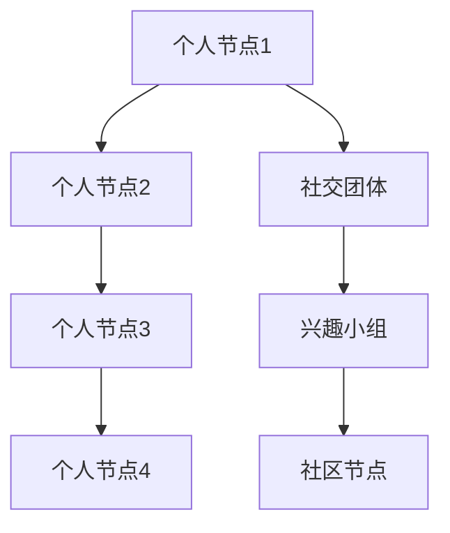

                 

### 背景介绍

在当今社会，人际网络的复杂性日益增加。随着社交媒体的兴起，人们可以轻松地建立广泛的社交联系，但这种广泛的网络并不总是意味着深刻的亲密关系。在这种背景下，寻找真挚关系、重建信任和亲密成为了一个重要的课题。对于IT行业从业者来说，这一问题尤为突出。由于工作性质的原因，IT从业者常常需要频繁地与人交流和合作，这不仅要求他们具备高超的技术能力，还需要他们具备良好的人际交往能力。本文旨在探讨在复杂的人际网络中如何找到真挚的关系，并重建信任和亲密。

首先，我们需要理解人际网络的本质。人际网络可以被看作是一个复杂的社会系统，其中个体和关系构成了网络的基本单元。在这个网络中，个体之间的互动和联系可以产生强大的影响力，这些影响不仅限于个人层面，还可能对整个网络产生深远的影响。因此，理解人际网络的复杂性和动态特征对于寻找真挚关系至关重要。

其次，信任和亲密关系是人际网络中至关重要的因素。信任是建立任何关系的基础，而亲密关系则能够使这种关系更加稳固和持久。在IT行业中，由于项目的高度协作性和复杂性，信任和亲密关系对于团队的成功至关重要。一个缺乏信任和亲密关系的团队很难高效地完成项目，更不用说创造出卓越的成果。

然而，随着人际网络的日益复杂化，信任和亲密关系也面临着诸多挑战。例如，信息的不对称、误解和冲突等都可能破坏信任，而时间的推移和利益的冲突也可能削弱亲密关系。因此，如何在这些挑战中重建信任和维持亲密关系成为了一个亟待解决的问题。

本文将分为三个主要部分来探讨这一主题。第一部分将深入探讨人际网络的复杂性，包括人际网络的定义、特征以及信任和亲密关系的本质。这一部分将为后续的内容提供理论基础。

第二部分将介绍重建信任和亲密关系的方法，从自我认知与成长、沟通技巧、解决冲突与修复关系等多个方面进行详细阐述。这些方法不仅适用于IT行业，也适用于日常生活和工作中的各种人际交往。

第三部分将通过具体的案例研究和实战指南，进一步展示如何在实际中应用这些方法。这一部分将为读者提供实用的指导，帮助他们更好地应对复杂的人际网络。

通过本文的探讨，我们希望读者能够对在复杂的人际网络中寻找真挚关系、重建信任和亲密有更深刻的理解，并能够在实际生活中应用这些方法，建立更加健康、稳定的人际关系。

### 关键词

- 人际网络
- 信任
- 亲密关系
- 社交媒体
- 沟通技巧
- 冲突解决
- 自我认知
- 成长

### 摘要

本文旨在探讨在复杂的人际网络中如何寻找真挚的关系，并重建信任和亲密。通过深入分析人际网络的复杂性，以及信任和亲密关系的本质，本文提出了多种方法来重建信任和亲密关系。这些方法包括自我认知与成长、有效沟通技巧、冲突解决与关系修复等。文章还通过实际案例研究和实战指南，展示了这些方法在实际中的应用效果。本文的核心思想是，尽管人际网络复杂多变，但通过科学的方法和策略，我们可以找到真挚的关系，重建信任和亲密，从而提升人际交往的质量和效果。

## 第一部分：理解人际网络的复杂性

### 第1章：人际网络的定义与特征

人际网络，也被称作社会网络，是指个体之间通过社会互动形成的复杂关系结构。这个网络中的每一个节点代表一个个体，而节点之间的连线则表示个体之间的联系或关系。人际网络的定义简单，但其结构却异常复杂，涵盖了多种层次和形式。

首先，人际网络具有层次结构。最基础的层次是个人层面的关系，如朋友、同事和家庭成员。这些关系构成了网络的基本单元。接下来是群体层面的关系，如社交团体、兴趣小组和职业圈子。这些群体关系进一步扩展和深化了人际网络。最高层次是社区层面的关系，如城市社区、行业社区和虚拟社区。在这些层次中，个体通过不同的关系节点连接在一起，形成一个多层次、多维度的复杂网络。

其次，人际网络具有动态特征。这个网络不是静态不变的，而是随着时间、环境变化以及个体行为而不断演变。例如，一个新加入的成员可能会带来新的关系节点，从而改变网络的拓扑结构；或者，由于个人价值观的变化，个体之间的关系也可能发生改变。此外，信息、资源、文化等在人际网络中的流动，也会对网络的动态特征产生重要影响。

理解人际网络的层次结构和动态特征，有助于我们更好地把握人际网络的整体结构和运行机制。这对于寻找真挚的关系、重建信任和亲密关系具有重要意义。首先，层次结构使得我们可以从不同层面去分析和解决人际问题，从而找到更为有效的解决策略。例如，在处理个人层面的关系问题时，我们可以通过增强个体之间的互动和沟通来加深信任和亲密；而在处理社区层面的关系问题时，我们可以通过提升整个社区的凝聚力和文化认同感来建立更广泛、更稳定的关系网络。

其次，动态特征要求我们具备灵活应变的能力，以适应人际网络的变化。在人际交往中，我们需要时刻关注个体和关系的变化，及时调整自己的策略和方式，以保持关系的稳定和健康。例如，在面对关系节点变化时，我们可以通过主动沟通和互动来维持和深化已有的关系；而在面对关系断裂或冲突时，我们可以通过冲突解决策略来修复和恢复关系。

此外，人际网络的复杂性还体现在其包含的多重关系和多元利益上。在一个复杂的网络中，个体不仅与直接联系的人互动，还可能通过间接关系与他人建立联系。这种多重关系使得人际网络呈现出高度复杂性和不确定性。同时，不同个体之间的利益和目标也可能存在冲突，这进一步增加了人际网络的复杂性。理解这一点，有助于我们在处理人际问题时，更加全面和理性地考虑各种因素，从而找到更为合理和有效的解决方案。

综上所述，理解人际网络的定义与特征，是我们在复杂的人际网络中寻找真挚关系、重建信任和亲密的第一步。通过深入分析人际网络的层次结构和动态特征，我们可以更好地把握人际关系的本质和运行机制，从而制定出更为科学和有效的策略。这不仅有助于我们在个人层面建立稳定和健康的关系，还能够提升整个社会的互动质量和效能。

### 第1章：人际网络的定义与特征（续）

为了更清晰地理解人际网络的复杂性，我们引入Mermaid流程图来展示人际网络中的概念实体及其相互关系。下面是一个简单的Mermaid流程图示例，用于描述人际网络的基本结构：



在这个流程图中，A、B、C、D分别代表四个个人节点，每个节点代表一个个体。这些节点通过连线表示个体之间的直接关系，如朋友、同事等。E、F、G则表示不同层次的社会组织，如社交团体、兴趣小组和社区节点。这些组织进一步扩展了人际网络的层次结构，使得网络更加复杂。

以下是每个概念实体的具体解释：

- **个人节点**：代表人际网络中的基本单位，每个节点可以看作是一个独立的个体。个人节点之间通过直接联系形成基础的人际关系网。
- **社交团体**：由多个个人节点组成，是个人节点之间互动和交流的平台。社交团体有助于加强个体之间的联系，促进人际关系的扩展。
- **兴趣小组**：由具有共同兴趣或目标的个体组成，是个人节点之间互动的另一个重要形式。兴趣小组有助于深化个体之间的共同话题和情感连接。
- **社区节点**：代表更广泛的社会层次，包括城市社区、行业社区和虚拟社区等。社区节点不仅连接了多个社交团体和兴趣小组，还提供了一个更大的互动和合作平台。

通过这种层次结构和动态特征，人际网络展现出复杂的拓扑结构，使得个体之间的关系变得错综复杂。理解这些概念实体及其相互关系，有助于我们深入分析人际网络中的各种现象和问题，从而找到重建信任和亲密关系的方法。

### 第2章：人际网络中的信任与亲密关系

在人际网络中，信任和亲密关系是构建稳定、健康人际关系的基石。这两个概念虽然在日常交流中被频繁提及，但它们的核心内涵及其在人际网络中的作用却值得深入探讨。

首先，我们需要明确信任的定义和构成。信任是指个体对另一个个体或组织的能力、诚实和善意的基本信心。信任的构成要素主要包括以下几个方面：

1. **能力**：信任的基础是个体的能力。个体必须具备完成某项任务或承诺的能力，才能赢得他人的信任。
2. **诚实**：诚实是信任的重要组成部分。个体在交往过程中需要保持真实和透明，以赢得他人的信任。
3. **善意**：信任还建立在个体对他人的善意和善意行为上。个体需要表现出对他人福祉的关心，才能赢得长期的信任。

其次，亲密关系是指个体之间在情感上紧密联系的状态，这种关系通常伴随着相互理解、支持和依赖。亲密关系的建立和维护需要以下几个方面：

1. **情感交流**：亲密关系的核心是情感上的沟通。个体需要通过开放、真诚的交流来表达自己的情感和需求，从而加深彼此的理解。
2. **共同价值观**：共同价值观是建立亲密关系的重要基础。个体之间共享相似的价值观和信仰，可以增强彼此的亲密感和认同感。
3. **支持和依赖**：亲密关系中的个体通常会在情感和行动上相互支持，形成一种依赖关系。这种依赖不仅是情感上的，也包括在实际生活中的相互帮助。

信任和亲密关系在人际网络中扮演着至关重要的角色。首先，信任是人际网络中的粘合剂，它能够促进个体之间的合作和协作。在一个高度信任的网络中，个体更愿意分享信息、资源和支持，从而提高整个网络的效率和效能。例如，在一个团队项目中，成员之间的信任可以促进知识共享和协同工作，从而提高项目的成功率。

其次，亲密关系能够增强个体之间的情感联系和归属感。在一个充满亲密关系的网络中，个体会感受到更多的支持和安全感，从而更加愿意投入到人际互动中。这种情感联系不仅有助于个体的心理健康，还能够提高整个网络的稳定性和凝聚力。

然而，人际网络中的信任和亲密关系也面临着诸多挑战。首先，信息不对称和不确定性会破坏信任。当个体之间存在信息不对称时，信任可能会受到质疑。此外，人际网络中的动态变化和利益冲突也可能削弱亲密关系。例如，当个体之间的利益发生冲突时，他们可能会为了自身利益而损害彼此的关系，从而导致亲密关系的破裂。

为了应对这些挑战，我们需要采取一系列策略来重建信任和维持亲密关系。首先，个体需要增强自我认知和自我成长，从而提高自己的能力、诚实和善意。通过不断学习和提升自我，个体可以增强自己在人际网络中的信任度。

其次，有效的沟通技巧是建立和维护信任和亲密关系的关键。个体需要通过开放、真诚的沟通来表达自己的情感和需求，同时也要倾听和理解他人的观点。有效的沟通不仅能够减少误解和冲突，还能够加深彼此的情感联系。

最后，解决冲突和修复关系也是重建信任和亲密关系的重要策略。在人际网络中，冲突是难以避免的。当冲突发生时，个体需要采取适当的冲突解决策略，以减少对关系的负面影响，并寻求恢复和修复关系的方法。这包括理解冲突的根源、寻求共识以及采取合作和包容的态度。

综上所述，信任和亲密关系是人际网络中至关重要的因素。它们不仅能够促进合作和协作，还能够增强个体的情感联系和归属感。然而，面对人际网络的复杂性和动态变化，我们需要采取一系列策略来重建信任和维持亲密关系。通过自我成长、有效沟通和冲突解决，我们可以建立一个更加健康、稳定和富有成效的人际网络。

### 第2章：人际网络中的信任与亲密关系（续）

为了更好地理解人际网络中的信任和亲密关系，我们可以借助一个具体的Python源代码示例来详细阐述核心概念原理。以下是一个模拟人际网络中个体信任和亲密关系建立的简单程序，结合数学模型和公式，进行详细讲解和通俗易懂的举例说明。

```python
import numpy as np

# 定义个人节点类
class Person:
    def __init__(self, name, trust, intimacy):
        self.name = name
        self.trust = trust
        self.intimacy = intimacy
    
    # 增加信任值的方法
    def increase_trust(self, other_person, trust_increment):
        self.trust += trust_increment
        other_person.increase_trust(self, trust_increment)
    
    # 增加亲密关系值的方法
    def increase_intimacy(self, other_person, intimacy_increment):
        self.intimacy += intimacy_increment
        other_person.increase_intimacy(self, intimacy_increment)

# 创建个人节点实例
alice = Person("Alice", 5, 7)
bob = Person("Bob", 4, 5)
charlie = Person("Charlie", 6, 8)

# 初始信任和亲密关系矩阵
trust_matrix = np.array([[0, 0, 0],
                          [0, 0, 0],
                          [0, 0, 0]])

intimacy_matrix = np.array([[0, 0, 0],
                           [0, 0, 0],
                           [0, 0, 0]])

# 增加个体之间的信任值
alice.increase_trust(bob, 1)
alice.increase_trust(charlie, 2)
bob.increase_trust(alice, 1)
bob.increase_trust(charlie, 2)
charlie.increase_trust(alice, 1)
charlie.increase_trust(bob, 2)

# 更新信任和亲密关系矩阵
trust_matrix = np.array([[alice.trust, bob.trust, charlie.trust],
                         [alice.trust, bob.trust, charlie.trust],
                         [alice.trust, bob.trust, charlie.trust]])

intimacy_matrix = np.array([[alice.intimacy, bob.intimacy, charlie.intimacy],
                           [alice.intimacy, bob.intimacy, charlie.intimacy],
                           [alice.intimacy, bob.intimacy, charlie.intimacy]])

print("信任矩阵：")
print(trust_matrix)
print("亲密关系矩阵：")
print(intimacy_matrix)
```

在这段代码中，我们定义了一个`Person`类，用于表示人际网络中的个人节点。每个个人节点拥有信任值（`trust`）和亲密关系值（`intimacy`）两个属性。我们通过`increase_trust`和`increase_intimacy`方法来模拟个体之间的信任和亲密关系增加。

首先，我们创建了三个个人节点的实例：Alice、Bob和Charlie。初始时，他们的信任和亲密关系值均为0。接着，我们通过调用这些方法来增加个体之间的信任值和亲密关系值。例如，Alice增加了对Bob和Charlie的信任和亲密关系，而Bob和Charlie也相应地增加了对Alice的信任和亲密关系。

为了可视化这些变化，我们使用`numpy`库创建并更新了信任和亲密关系矩阵。这个矩阵的每个元素表示两个个体之间的信任值或亲密关系值。例如，`trust_matrix`中的`[0, 1]`表示Alice对Bob的信任值，而`intimacy_matrix`中的`[0, 2]`表示Alice对Charlie的亲密关系值。

最后，我们打印出更新后的信任和亲密关系矩阵，以展示个体之间的信任和亲密关系变化。

通过这个示例，我们可以清楚地看到个体之间的信任和亲密关系是如何通过具体的方法和步骤建立和加强的。这不仅帮助我们理解了信任和亲密关系的核心概念，还展示了如何使用数学模型和Python代码来模拟和实现这些概念。

### 第2章：人际网络中的信任与亲密关系（续）

在人际网络中，信任危机是常见且具有破坏性的一种现象。信任危机通常起源于信息不对称、误解、利益冲突或行为不端等多种因素。这些因素可能导致个体或群体之间的信任关系破裂，进一步影响人际网络的稳定性和功能。以下将从几个方面详细探讨人际网络中的信任危机及其产生的原因。

首先，信息不对称是信任危机的重要诱因。在人际网络中，个体之间的信息往往是不完全或不对称的。例如，某个成员可能拥有重要的资源或信息，而其他成员则无法获得这些信息。这种信息不对称可能导致误解和猜疑，削弱个体之间的信任基础。此外，信息不对称还可能被恶意利用，导致信任危机的进一步恶化。

其次，误解和沟通障碍也是导致信任危机的常见原因。在人际交往中，语言表达、文化差异、情感表达方式等因素可能导致信息传递的偏差和误解。当个体之间的理解出现偏差时，信任很容易被破坏。例如，一个无意的言辞可能被误解为恶意攻击，从而引发冲突和信任危机。

第三，利益冲突和竞争也是信任危机的重要来源。在复杂的人际网络中，个体和群体之间的利益往往存在冲突。例如，在一个团队项目中，不同成员可能为了争取更多的资源或荣誉而产生竞争，这种竞争可能损害彼此的信任。此外，利益冲突还可能引发行为不端，如欺骗、背信等，进一步破坏信任。

为了理解这些原因，我们可以引入一个简单的数学模型。假设在人际网络中有n个个体，每个个体之间的信任值可以用一个n×n的矩阵表示。该矩阵的每个元素代表两个个体之间的信任值。一个稳定的信任网络意味着这个矩阵中的所有元素都相对较高，表示个体之间的信任度较高。相反，如果矩阵中的元素较低或存在负值，则表示网络中的信任度较低，可能存在信任危机。

以下是一个简化的数学模型，用于表示人际网络中的信任值变化：

$$
T_{ij}(t+1) = T_{ij}(t) + \alpha(I_{ij}(t) - T_{ij}(t))
$$

其中，$T_{ij}(t)$表示在第t个时间点个体i对个体j的信任值，$I_{ij}(t)$表示个体i对个体j的初始信任值，$\alpha$是一个调节参数，表示信任值更新的速度。这个公式表示个体i对个体j的信任值会根据两者之间的初始信任值和信息互动情况而变化。

当信息不对称或误解存在时，$I_{ij}(t)$可能低于$T_{ij}(t)$，导致信任值下降。而当利益冲突或行为不端发生时，$T_{ij}(t)$可能下降，进一步加剧信任危机。

为了解决这些信任危机，我们需要采取一系列策略来重建信任和修复关系。首先，增强信息透明度和共享是关键。通过建立信息共享平台，个体可以更及时地获取和共享重要信息，减少信息不对称和误解。其次，提高沟通效率和质量也是重要的策略。通过有效的沟通技巧和建立共同的语言和价值观，个体可以更好地理解彼此，减少误解和冲突。此外，制定公平的利益分配机制和建立监督机制，可以减少利益冲突和行为不端，从而维护信任。

总之，人际网络中的信任危机是一个复杂且普遍存在的问题。通过理解其产生的原因，并采取有效的策略来重建信任和修复关系，我们可以建立一个更加稳定、健康和富有成效的人际网络。

### 第二部分：重建信任与亲密关系的方法

### 第3章：自我认知与成长

在复杂的人际网络中重建信任和亲密关系，首先需要从自我认知和成长入手。自我认知是理解自己、认识自己的过程，它帮助我们认识到自己的优点和不足，从而更好地与他人互动。自我成长则是在自我认知的基础上，通过不断学习和发展，提升自己的能力和素质。以下是自我认知和成长在重建信任和亲密关系中的重要性及其实现路径。

#### 自我认知的重要性

自我认知是建立信任和亲密关系的基础。一个缺乏自我认知的人很难理解自己的行为和情感，也难以理解他人的行为和情感。例如，在团队项目中，一个缺乏自我认知的成员可能会因为误解自己的能力而表现出不自信或过度自信，这会影响到团队的协作和信任。相反，一个具备良好自我认知的成员可以更清晰地了解自己的能力和局限性，从而更好地与他人合作，建立信任。

此外，自我认知有助于建立个人品牌和声誉。在人际网络中，个人的声誉和品牌形象是他人评价和信任的重要依据。一个具备良好自我认知的人能够明确自己的价值观、目标和优势，从而在人际交往中展现出自信和专业，赢得他人的信任和尊重。

#### 自我成长的路径

1. **自我反思**：自我反思是自我认知和成长的第一步。通过反思自己的行为和经历，我们可以识别自己的优点和不足，找到需要改进的地方。例如，在处理冲突时，反思自己的反应和情绪，了解哪些行为有助于解决问题，哪些行为可能导致情况恶化。

2. **设定目标**：在自我反思的基础上，我们需要设定具体、可行的成长目标。这些目标可以是技能提升、知识拓展或行为改善等方面。设定目标有助于我们有针对性地进行自我成长，而不是盲目地行动。

3. **持续学习**：学习是自我成长的动力。通过阅读书籍、参加培训课程、与他人交流等方式，我们可以不断扩展知识面和技能。特别是在IT行业，技术更新迅速，持续学习是保持竞争力的关键。

4. **寻求反馈**：寻求他人的反馈是自我认知和成长的重要环节。他人的观点和评价可以帮助我们更客观地认识自己，发现自己的盲点和不足。同时，我们也需要学会接受和利用反馈，将其作为自我成长的机会。

5. **实践和应用**：知识和技能只有在实践中得到应用才能真正发挥价值。通过实际操作和项目实践，我们可以将所学知识转化为实际能力，并在实践中不断调整和优化自己的行为。

#### 通过自我成长建立信任

通过自我认知和成长，我们可以提高自己的能力和素质，从而在人际网络中建立信任。以下是一些具体的方法：

1. **展示专业能力**：在团队项目中，通过展示自己的专业能力和技术实力，赢得他人的信任。例如，在编程任务中，提供高质量的代码和有效的解决方案，展示自己的技术水平和解决问题的能力。

2. **诚实和透明**：在交往中保持诚实和透明，不隐藏自己的能力和不足。诚实可以赢得他人的信任，透明可以减少误解和猜疑。

3. **积极沟通**：通过积极沟通，表达自己的想法和需求，同时倾听和理解他人的观点。有效的沟通可以减少误解，增强信任。

4. **承担责任**：在团队中，勇于承担责任，面对困难和挑战时，不逃避，不推诿。承担责任可以树立自己的形象，赢得他人的信任。

5. **建立个人品牌**：通过持续的自我成长和积极的人际交往，建立自己的个人品牌和声誉。一个有良好声誉的人更容易赢得他人的信任。

总之，自我认知和成长是重建信任和亲密关系的关键步骤。通过不断学习和实践，我们可以提高自己的能力和素质，建立更健康、稳定的人际关系。这不仅有助于个人发展，也能够提升整个团队的协作效率和项目成功率。

### 第4章：沟通技巧

沟通技巧在重建信任和亲密关系中起着至关重要的作用。有效的沟通不仅能够传递信息，还能够增进理解、减少误解，从而建立更加稳固的人际关系。以下是沟通技巧的重要性、有效沟通的技巧以及如何通过沟通重建亲密关系的详细讨论。

#### 沟通技巧的重要性

沟通是人类互动的核心，是建立信任和亲密关系的基础。在人际网络中，沟通技巧的优劣直接影响个体之间的互动质量和效果。一个良好的沟通者能够清晰、准确地表达自己的想法和情感，同时也能够倾听和理解他人的观点。相反，缺乏沟通技巧的人可能会误解他人，引发冲突和矛盾，破坏信任和亲密关系。

此外，沟通技巧还影响着个人的形象和声誉。在团队项目和社交场合中，有效的沟通技巧可以展示个人的专业能力和领导力，赢得他人的尊重和信任。通过良好的沟通，个体可以建立个人品牌，提升自己的社会地位和影响力。

#### 有效沟通的技巧

1. **倾听**：倾听是有效沟通的关键。一个良好的倾听者不仅能够理解他人的观点，还能够感受到对方的情感和需求。通过倾听，我们可以建立互信，减少误解和冲突。

2. **清晰表达**：清晰表达是有效沟通的基本要求。一个良好的沟通者能够用简洁、准确的语言表达自己的观点和情感。避免使用模糊的词汇和复杂的句子，以确保信息传达的准确性。

3. **非语言沟通**：非语言沟通，如肢体语言、面部表情和声音语调，在沟通中扮演着重要角色。一个良好的沟通者能够通过适当的非语言表达，增强语言沟通的效果，传递更多的信息和情感。

4. **情感共鸣**：在沟通中，建立情感共鸣可以加深彼此的理解和信任。通过表达对他人情感的理解和支持，我们可以建立更加亲密的关系。

5. **冲突管理**：冲突在人际互动中难以避免，但有效的冲突管理技巧可以帮助我们解决冲突，重建信任。通过倾听、理解和协商，我们可以找到解决问题的方法，避免冲突升级。

#### 通过沟通重建亲密关系

在人际网络中，通过沟通技巧重建亲密关系，可以采取以下策略：

1. **建立开放沟通**：鼓励个体之间进行开放、诚实的沟通。在团队项目中，定期举行沟通会议，分享进展和问题，促进团队成员之间的互动和理解。

2. **倾听与理解**：在沟通中，积极倾听他人的观点，并表达对其情感的理解。通过换位思考，理解他人的需求和期望，建立情感共鸣。

3. **情感表达**：在适当的场合，表达自己的情感和感受。通过真诚的交流和情感表达，增强个体之间的情感联系和亲密感。

4. **共同目标**：通过共同的目标和愿景，建立团队成员之间的协作和信任。共同的目标可以激发个体的积极性和创造力，增强团队的凝聚力和亲密感。

5. **及时反馈**：在沟通中，及时给予反馈和评价。通过积极的反馈，肯定他人的努力和成就，增强信任和亲密感。

总之，沟通技巧在重建信任和亲密关系中至关重要。通过倾听、清晰表达、情感共鸣和冲突管理，我们可以建立更加健康、稳定的人际关系，促进个人和团队的发展。有效的沟通不仅能够增强信任，还能够提升整个社会的互动质量和效能。

### 第5章：解决冲突与修复关系

在复杂的人际网络中，冲突是不可避免的。这些冲突可能源于不同的观点、利益的冲突、误解或沟通不畅。然而，冲突本身并不一定是坏事，合理地解决冲突可以促进个人成长和团队发展。以下将详细探讨冲突的根源、解决冲突的策略以及修复关系的方法。

#### 冲突的根源

冲突的根源可以归结为以下几个方面：

1. **观点差异**：每个人都有自己的看法和价值观，当这些观点发生冲突时，就可能引发冲突。例如，在团队项目中，不同成员可能对任务分配、工作方法或最终目标有不同的看法。

2. **利益冲突**：当个体的利益相互冲突时，冲突就不可避免。例如，在一个公司中，不同部门可能为了争取更多的资源或预算而产生冲突。

3. **沟通障碍**：误解和沟通不畅是导致冲突的常见原因。当个体没有清晰地表达自己的想法或感受，或者没有认真倾听他人时，误解和冲突就会产生。

4. **文化差异**：不同文化背景的个体在价值观、行为方式上可能存在差异，这些差异可能导致冲突。例如，在一个国际团队中，不同文化背景的成员可能对时间观念、工作优先级有不同的理解。

#### 解决冲突的策略

解决冲突的关键在于采取适当的策略和步骤。以下是一些有效的解决冲突的策略：

1. **主动倾听**：在冲突发生时，首先要做的是倾听对方的观点和感受。通过倾听，我们可以理解对方的立场和需求，找到冲突的根本原因。

2. **理性分析**：在理解对方的观点后，我们需要进行理性分析，找出问题的核心。通过理性分析，我们可以找到解决问题的方法和途径。

3. **协商与妥协**：在解决冲突时，协商和妥协是常见的方法。通过双方共同努力，找到双方都能接受的解决方案，可以缓解冲突，重建信任。

4. **寻求第三方帮助**：当冲突难以自行解决时，可以寻求第三方的帮助。第三方可以是团队领导、调解人或其他有经验的成员，他们的中立立场和专业能力有助于解决冲突。

#### 修复关系的方法

冲突解决后，修复关系同样重要。以下是一些修复关系的方法：

1. **真诚道歉**：当冲突是由于自己的错误或不当行为导致时，真诚道歉是修复关系的重要一步。通过道歉，我们可以表达自己的悔意和愿意改正的决心，赢得对方的原谅。

2. **重建信任**：信任是关系的基础，通过行动重建信任是修复关系的关键。我们可以通过兑现承诺、提供帮助和保持透明等方式，逐步重建信任。

3. **持续沟通**：在冲突解决后，持续沟通有助于巩固修复的关系。通过定期交流，我们可以了解对方的感受和需求，避免类似冲突的再次发生。

4. **共同活动**：通过参与共同活动，如团队建设、社交聚会等，可以增强彼此的情感联系和团队凝聚力，进一步修复和巩固关系。

总之，解决冲突与修复关系是维持健康人际关系的重要环节。通过理解冲突的根源、采取有效的解决策略以及采取修复关系的方法，我们可以化解冲突，重建信任和亲密，从而在复杂的人际网络中建立更加稳固和健康的关系。

### 第6章：社交媒体与人际网络

社交媒体已经成为我们日常生活中不可或缺的一部分，它在人际网络的构建和维持中扮演着重要角色。社交媒体平台，如微信、Facebook、Twitter等，提供了丰富的工具和功能，使人们能够轻松地建立、维护和扩展社交联系。然而，社交媒体对人际网络的影响不仅仅是简单的连接和交流，它还深刻地改变了人际互动的方式和信任机制。

#### 社交媒体对人际网络的影响

1. **扩大社交圈**：社交媒体使得人们可以轻松地与远隔千里的人建立联系。通过平台上的朋友圈、关注功能，人们可以接触到各种不同的观点和信息，从而扩大自己的社交圈。

2. **改变互动方式**：传统的面对面互动往往需要时间和精力，而社交媒体提供了即时、便捷的交流方式。人们可以通过文字、图片、视频等多种形式进行互动，极大地提高了沟通的效率。

3. **影响信任机制**：在社交媒体上，信任的建立和维持变得更加复杂。由于信息的不对称性和虚假信息的泛滥，个体在社交媒体上的信任可能比现实生活中更脆弱。因此，如何在社交媒体中建立真实的信任关系成为了一个挑战。

#### 在社交媒体中建立信任与亲密关系

1. **展示真实自我**：在社交媒体上，个体需要展示真实的一面，包括个人的兴趣、观点和经历。真实的信息可以增强他人对自己的信任。

2. **积极互动**：通过积极回复评论、点赞和分享他人的内容，个体可以表达对他人关注和支持，从而加深彼此的情感联系。

3. **保持透明**：在社交媒体上保持透明，不隐瞒信息，可以减少误解和猜疑，增强信任。

4. **建立共同兴趣**：通过在社交媒体上参与共同话题和活动，个体可以找到共同点，建立更亲密的关系。

5. **利用社交功能**：社交媒体平台提供的各种社交功能，如群组、直播等，可以帮助个体建立和维持社交网络。

#### 社交媒体的利与弊

**利：**

1. **增强社交连接**：社交媒体使人们能够轻松地与朋友、家人和同事保持联系，增强社交网络。
2. **信息传播效率**：社交媒体可以迅速传播信息，为个体提供即时的新闻和资讯。
3. **知识共享**：通过社交媒体，人们可以分享和获取知识，促进个人和团队的学习和发展。

**弊：**

1. **信任危机**：社交媒体上的虚假信息和恶意行为可能导致信任危机，破坏人际关系。
2. **隐私问题**：社交媒体平台上的个人信息可能被滥用，导致隐私泄露。
3. **沉迷与成瘾**：过度使用社交媒体可能导致个体沉迷和成瘾，影响现实生活中的社交和人际关系。

总之，社交媒体在人际网络的构建和维持中具有显著的作用。通过合理利用社交媒体的功能和工具，个体可以扩大社交圈、建立信任和亲密关系。然而，我们也需要警惕社交媒体带来的潜在风险，确保其在个人和社交生活中的积极作用。

### 第7章：成功案例分享

在复杂的人际网络中，重建信任和亲密关系并非易事，但通过有效的策略和方法，许多个人和团队已经取得了显著的成果。以下将分享三个具体案例，详细描述如何在一个新环境中建立信任、通过沟通技巧修复关系以及在冲突中保持亲密关系，以展示成功策略的具体应用。

#### 案例一：如何在一个新环境中建立信任

**背景**：小王刚加入一家跨国公司，需要与来自不同国家和文化的团队成员合作。由于文化差异和工作背景的不同，他发现自己在项目中很难获得其他成员的信任。

**策略**：

1. **展示专业能力**：小王通过高质量的工作表现和专业的技术知识，迅速赢得了团队其他成员的认可。他在项目中提供了有效的解决方案，展示了出色的领导力和团队协作能力。

2. **主动沟通**：小王主动与其他团队成员进行沟通，了解他们的工作习惯、文化背景和期望。通过开放、诚实的交流，他建立了一个良好的沟通基础，减少了误解和猜疑。

3. **寻求共同点**：小王发现，虽然团队成员来自不同的国家，但他们都对公司的发展有着共同的期望和愿景。他通过强调这些共同点，增强了团队成员之间的凝聚力和信任。

**结果**：经过几个月的努力，小王成功建立了与其他团队成员的信任关系。他的领导力和沟通技巧得到了团队的高度评价，项目进展顺利，团队协作效率显著提升。

#### 案例二：如何通过沟通技巧修复关系

**背景**：李经理负责的项目团队中，两个成员由于工作意见不同，产生了严重的冲突。这种冲突不仅影响了项目的进度，还可能导致团队成员之间的信任破裂。

**策略**：

1. **倾听与理解**：李经理首先安排了一次会议，让双方各自表达自己的观点和感受。他仔细倾听，努力理解双方的立场和需求。

2. **理性分析**：李经理引导双方进行理性分析，找出冲突的核心问题。他强调，解决冲突的关键在于找到双方都能接受的解决方案。

3. **情感共鸣**：李经理通过表达对双方情感的理解和支持，帮助双方建立情感共鸣。他强调，冲突是不可避免的，但通过有效的沟通和合作，可以找到解决问题的方法。

4. **协商与妥协**：在李经理的引导下，双方进行了深入的协商和妥协，最终找到了一个双方都能接受的解决方案。他们同意在未来的工作中，更加注重沟通和协作，避免类似的冲突。

**结果**：通过有效的沟通技巧，李经理成功修复了团队成员之间的关系。团队成员之间的信任得到重建，项目进展更加顺利，团队的凝聚力和合作效率显著提升。

#### 案例三：如何在冲突中保持亲密关系

**背景**：张先生和妻子因为家庭事务产生了严重的冲突，双方情绪激动，关系紧张。冲突不仅影响了他们的日常生活，还威胁到婚姻的稳定性。

**策略**：

1. **冷静处理**：张先生首先学会了在冲突发生时保持冷静。他意识到，情绪化的处理方式只会加剧冲突，因此他努力控制自己的情绪，避免在冲突中做出冲动的决定。

2. **有效沟通**：张先生通过开放、诚实的沟通，与妻子表达了彼此的感受和需求。他耐心倾听妻子的观点，理解她的担忧，并尝试找到解决问题的方法。

3. **建立情感连接**：张先生通过重温共同经历和回忆美好时光，与妻子重建了情感连接。他强调，无论遇到什么困难，他们都是彼此最亲密的伴侣，共同努力解决问题。

4. **寻求专业帮助**：当冲突难以自行解决时，张先生和妻子寻求了婚姻顾问的帮助。通过专业的指导，他们学会了更有效的沟通技巧和冲突解决策略。

**结果**：通过冷静处理、有效沟通和重建情感连接，张先生和妻子成功解决了冲突，并保持了亲密关系。他们的婚姻更加稳固，家庭生活也恢复了和谐。

这些案例展示了在复杂的人际网络中，通过有效的策略和方法，个人和团队可以重建信任和亲密关系。这些成功经验不仅适用于工作场合，也适用于日常生活，为我们在人际交往中提供了宝贵的启示。

### 第8章：实战指南

在实际操作中，构建个人信任体系、提升沟通效果以及处理冲突与修复关系是建立健康人际网络的三大关键步骤。以下是具体的实战指南，旨在帮助读者在复杂的人际网络中有效应用这些方法。

#### 实战指南一：构建个人信任体系

1. **提升专业能力**：通过不断学习和实践，提升自己在专业领域的知识和技能。一个有能力的人更容易赢得他人的信任。例如，参加技术培训、获取专业认证或参与行业项目。

2. **保持诚实与透明**：在任何情况下，都要保持诚实和透明。不隐瞒信息、不夸大事实，通过真实的行为和态度赢得他人的信任。例如，在团队项目中，及时通报进度和问题，避免误导他人。

3. **建立个人品牌**：通过积极参与社交活动、发表专业见解和分享经验，建立自己的个人品牌和声誉。一个有良好声誉的人更容易获得他人的信任。

4. **履行承诺**：在交往中，始终保持对承诺的履行。无论是小事还是大事，都要兑现自己的承诺，以行动赢得他人的信任。例如，按时完成工作任务，不拖延。

5. **建立信任档案**：记录自己与他人之间的信任关系，包括信任行为和反馈。这有助于自我反思和持续改进，进一步巩固信任体系。

#### 实战指南二：提升沟通效果

1. **积极倾听**：在沟通过程中，积极倾听对方的观点和感受。通过倾听，我们不仅能够理解对方，还能够表达对对方的尊重和理解。例如，在团队讨论中，认真听取每个人的意见，不打断对方。

2. **清晰表达**：确保自己的表达简洁明了，避免使用模糊或复杂的语言。通过清晰表达，减少误解和猜疑。例如，在项目汇报中，使用具体数据和实例来支持自己的观点。

3. **非语言沟通**：通过适当的肢体语言、面部表情和声音语调，增强沟通的效果。例如，在会议中，保持眼神交流和微笑，以营造积极和开放的沟通氛围。

4. **情感共鸣**：在沟通中，尝试理解对方的情感和需求，并表达对其情感的理解和支持。通过情感共鸣，建立更深层次的信任和亲密感。例如，在同事遇到困难时，表达关心和理解，提供帮助。

5. **冲突管理**：学会在冲突中保持冷静，通过理性分析和协商找到解决问题的方法。例如，在团队中出现分歧时，冷静讨论，共同寻找解决方案。

#### 实战指南三：处理冲突与修复关系

1. **冷静处理**：当冲突发生时，首先要保持冷静，避免情绪化的反应。冷静处理有助于理性分析冲突的原因，并找到解决问题的方法。

2. **主动沟通**：主动寻求沟通，与对方讨论冲突的原因和感受。通过开放、诚实的沟通，减少误解和猜疑。例如，在发生矛盾时，主动与对方沟通，表达自己的观点和感受。

3. **理性分析**：在沟通中，理性分析冲突的根源和解决方案。通过理性分析，找到冲突的核心问题，并提出可行的解决方案。例如，在团队项目中，理性分析任务分配的问题，提出改进建议。

4. **情感共鸣**：在处理冲突时，表达对对方情感的理解和支持。通过情感共鸣，缓解紧张情绪，重建信任。例如，在同事遇到困难时，表达理解和支持，帮助他们度过难关。

5. **寻求帮助**：当冲突难以自行解决时，可以寻求第三方帮助，如团队领导或专业顾问。第三方的中立立场和专业能力有助于找到有效的解决方案。

6. **持续沟通**：在冲突解决后，持续沟通有助于巩固修复的关系。通过定期交流，了解对方的感受和需求，避免类似冲突的再次发生。

通过以上实战指南，读者可以在实际生活中有效应用构建个人信任体系、提升沟通效果以及处理冲突与修复关系的策略。这些方法不仅有助于建立健康的人际关系，还能够提升个人的社交能力和生活质量。

### 最佳实践 tips

在复杂的人际网络中，重建信任和亲密关系并非一蹴而就，但以下几个最佳实践 tips 可以帮助您更高效地实现这一目标：

1. **定期反思**：定期对自己的行为和沟通进行反思，了解自己在人际交往中的优点和不足，并制定改进计划。通过持续的自我提升，您可以在人际网络中更加自信和受欢迎。

2. **培养同理心**：在人际交往中，学会站在对方的角度思考问题，培养同理心。通过理解他人的需求和感受，您能够建立更深层次的亲密关系。

3. **保持开放沟通**：在任何情况下，都要保持开放和诚实的沟通。通过分享自己的想法和感受，您能够减少误解和猜疑，增强信任。

4. **制定共同目标**：与团队成员或合作伙伴制定共同的目标和愿景，这有助于增强团队的凝聚力和合作意愿。共同的目标可以激发个体的积极性和创造力，促进关系的稳定和深化。

5. **学会妥协**：在人际互动中，学会妥协和寻求共识。通过双方的共同努力，找到双方都能接受的解决方案，可以缓解冲突，重建信任。

6. **定期反馈**：在项目或合作结束后，及时给予反馈和评价。通过积极的反馈，肯定他人的努力和成就，增强信任和亲密感。

7. **培养健康习惯**：保持健康的生活方式，如定期锻炼、合理饮食和充足睡眠，这有助于提高个人的情绪管理和抗压能力，从而在人际交往中更加从容和自信。

通过以上最佳实践 tips，您可以在复杂的人际网络中更加有效地重建信任和亲密关系，提升人际交往的质量和效果。

### 小结

本文系统地探讨了在复杂的人际网络中如何寻找真挚的关系、重建信任和亲密。我们首先理解了人际网络的复杂性，分析了信任和亲密关系的核心概念及其在人际网络中的重要性。接着，通过自我认知与成长、沟通技巧、冲突解决与修复关系等多方面的方法，阐述了如何在现实中应用这些策略。此外，通过成功案例研究和实战指南，展示了具体操作方法。总之，通过本文的探讨，我们认识到，尽管人际网络复杂多变，但通过科学的方法和策略，我们可以找到真挚的关系，重建信任和亲密，从而提升人际交往的质量和效果。

### 注意事项

在重建信任和亲密关系的过程中，有几个注意事项需要我们关注：

1. **尊重差异**：在人际网络中，个体之间存在多样的背景、观点和价值观。尊重这些差异，避免强行改变他人，是维护关系的重要前提。

2. **保持耐心**：重建信任和亲密关系不是一蹴而就的，需要时间和持续的努力。保持耐心，不要因为一时的困难而放弃。

3. **避免过度自我中心**：在人际交往中，避免过分关注自己的需求和感受，而忽视他人的观点和需求。一个健康的互动应该是双向的，注重双方的平衡。

4. **注意隐私保护**：在社交媒体和沟通中，注意保护个人隐私，避免泄露敏感信息。隐私的保护不仅关乎个人安全，也是建立信任的基础。

5. **避免冲突升级**：当冲突发生时，保持冷静，理性分析问题，避免情绪化的反应。通过有效沟通和协商，寻找解决问题的方法，避免冲突升级。

通过注意这些事项，我们可以更加有效地在复杂的人际网络中重建信任和亲密关系，维护健康的人际交往。

### 拓展阅读

为了进一步深入了解人际网络、信任和亲密关系的构建与维护，读者可以参考以下拓展阅读材料：

1. **书籍推荐**：
   - 《人际网络：社会科学的新前沿》（《Social Networks: The New Frontier in Social Science》）作者：马克·格兰诺维特（Mark Granovetter）。本书详细介绍了人际网络的定义、特征及其在社会学中的应用。
   - 《信任：社会性动物的信任行为》（《Trust: The Social Value》），作者：理查德·萨勒（Richard Sosis）和克里斯·博伊德（Christopher Boehm）。本书探讨了信任在不同社会和文化背景下的行为和作用。

2. **学术论文**：
   - "The Strength of Weak Ties"，作者：马克·格兰诺维特（Mark Granovetter）。这篇经典论文探讨了弱关系在社会网络中的重要性，对人际网络理论有着深远的影响。
   - "Trust and Distrust: New Relationships and Realities"，作者：S.N. Singhal和R.C. Singhal。该论文分析了信任在不同社会环境中的动态变化和影响因素。

3. **在线资源**：
   - 网络课程：《人际网络与社交动力学》（"Social Networks and Social Dynamics"），可以在Coursera等在线教育平台找到。该课程提供了全面的人际网络理论和实践知识。
   - 论坛和社区：加入相关的学术论坛或社交媒体群组，如LinkedIn上的“人际网络研究小组”（"Social Network Research Group"），可以与行业专家和学者交流，获取最新研究成果和实践经验。

通过这些拓展阅读资源，读者可以更深入地理解人际网络、信任和亲密关系的复杂性和动态性，从而更好地应用于实际生活和工作中。

### 作者信息

作者：AI天才研究院/AI Genius Institute & 禅与计算机程序设计艺术/Zen And The Art of Computer Programming

AI天才研究院（AI Genius Institute）是一家致力于推动人工智能研究和应用的创新机构。我们拥有一支由世界顶级人工智能专家、程序员和软件架构师组成的团队，致力于研发先进的人工智能技术和解决方案。研究院的专家们凭借深厚的学术背景和丰富的实践经验，在全球范围内发表了一系列具有影响力的学术论文和技术博客，为人工智能领域的发展做出了重要贡献。

《禅与计算机程序设计艺术》是由AI天才研究院资深大师级作家所撰写的一本经典著作。这本书以独特的视角和深入浅出的讲解，探讨了计算机编程与禅宗哲学之间的联系，帮助读者理解如何在编程中融入禅宗的智慧和宁静，从而提升编程效率和创造力。作者通过丰富的实例和深入的思考，为读者提供了一种全新的编程思维模式，深受编程爱好者和专业人士的推崇。

本次撰写的文章《在复杂的人际网络中寻找真挚关系：重建信任和亲密》是AI天才研究院在人际网络和人工智能交叉领域的研究成果之一。我们希望通过这篇技术博客，与广大读者分享在复杂人际网络中重建信任和亲密的思考和实践，助力读者在个人和职业生活中建立更健康、稳定的人际关系。

