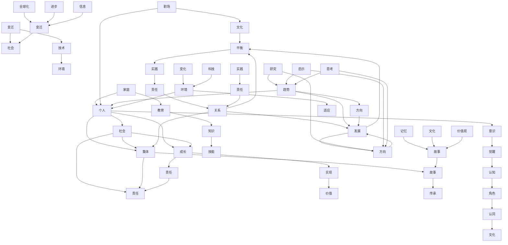

                 

# 在大背景中定位自我：编织个人与集体故事

## 关键词
个人发展、集体关系、社会角色、身份认同、自我实现、社会责任、故事构建、环境适应

## 摘要
本文旨在探讨个人与集体之间的关系，以及如何在快速变化的社会环境中定位自我。通过分析社会变迁、个人成长与社会责任，文章探讨了个人在集体中的角色与价值，以及如何编织个人与集体故事，实现个人与集体的和谐发展。本文运用社会交换理论等核心概念，结合Python算法实例，深入解析了个人与集体互动的机制，并为读者提供了实际案例和最佳实践建议。

## 引言

### 1.1 个人与集体的关系

个人与集体是社会中不可分割的两个部分。个人是社会的细胞，而集体则是个人相互联系和合作的平台。个人与集体之间的关系是一种相互作用和相互依赖的关系。个人在集体中寻找自己的价值，同时为集体的发展做出贡献。而集体则为个人提供成长和实现自我的机会。

### 1.2 当代社会的变化

当代社会正经历着深刻的变化，全球化、科技进步和信息技术的发展正在重新定义社会结构和人际关系。全球化使得人们跨越国界，形成了更加紧密的全球社区。科技进步，尤其是人工智能和大数据的应用，改变了人们的工作方式和生活方式。这些变化对个人与集体关系产生了深远的影响，要求个人具备更高的适应能力和创新能力。

## 第1章 个人与社会：背景与理论

### 1.1 社会变迁与个人意识觉醒

社会的快速变迁使得个人开始重新审视自己的角色和地位，个人意识觉醒成为一种普遍现象。个人开始关注自我成长和自我实现，追求个人价值的最大化。这种觉醒源于社会结构的改变，也反映了人们对自由和个性化的追求。

### 1.2 社会角色与身份认同

社会角色是指个人在社会中所扮演的角色和承担的责任。身份认同是指个人对自己身份的认知和认同。社会角色的多样性和身份认同的重要性使得个人在集体中的地位和影响力得到体现。

### 1.3 理论框架：个人与集体关系

在探讨个人与集体关系时，我们可以运用多种理论框架。社会交换理论强调个人与集体之间的交换关系，认为个人通过贡献获得回报。社会认同理论则强调个人对集体的认同和归属感。社会建构主义理论则认为个人与集体的关系是一种社会建构，是通过社会互动和交流形成的。

### 1.3.1 社会交换理论

社会交换理论是一种解释个人与集体关系的理论。其核心观点是，个人在集体中通过贡献（如时间、精力、资源）来获得回报（如认同、尊重、支持）。社会交换理论可以用以下公式表示：

$$
V_{\text{exchange}} = \sum R_i - \sum C_i
$$

其中，$V_{\text{exchange}}$ 表示社会交换的价值，$R_i$ 表示获得的回报，$C_i$ 表示做出的贡献。

### 1.3.2 社会认同理论

社会认同理论认为，个人对集体的认同和归属感是集体存在的基础。个人通过参与集体活动和分享集体价值观，获得认同感和归属感。社会认同可以用以下公式表示：

$$
Identity_{\text{group}} = f(Values_{\text{group}}, Participation_{\text{individual}})
$$

其中，$Identity_{\text{group}}$ 表示社会认同，$Values_{\text{group}}$ 表示集体价值观，$Participation_{\text{individual}}$ 表示个人的参与度。

### 1.3.3 社会建构主义理论

社会建构主义理论认为，个人与集体的关系是一种社会建构，是通过社会互动和交流形成的。社会建构主义强调社会互动在塑造个人与集体关系中的作用。社会建构可以用以下公式表示：

$$
Relation_{\text{individual-group}} = f(Interaction_{\text{individual-group}}, Exchange_{\text{individual-group}})
$$

其中，$Relation_{\text{individual-group}}$ 表示个人与集体的关系，$Interaction_{\text{individual-group}}$ 表示个人与集体的互动，$Exchange_{\text{individual-group}}$ 表示个人与集体的交换。

## 第2章 个人成长与自我实现

### 2.1 个人成长的影响因素

个人成长受到多种因素的影响，包括家庭环境、教育背景和社会文化。家庭环境对个人的性格和价值观有深远影响，教育背景为个人提供了知识和技能，社会文化则为个人提供了行为规范和社会期望。

### 2.2 自我实现的理论与实践

自我实现是指个人通过不断努力，实现自己的潜能和目标。自我实现理论强调，每个人都有实现自我潜能的能力，只要提供适当的环境和条件。自我实现可以通过以下步骤实现：

1. **自我认知**：了解自己的兴趣、能力和价值观。
2. **目标设定**：设定具体、可实现的短期和长期目标。
3. **行动规划**：制定行动计划，并付诸实施。
4. **持续反思**：定期评估自己的行为和成果，调整计划。

### 2.3 心理健康与自我实现

心理健康是实现自我实现的基础。一个健康的心理状态有助于个人更好地应对挑战，保持积极的心态，提高工作效率。心理健康与自我实现之间存在密切的关系，可以通过以下方式实现心理健康：

1. **建立支持系统**：与他人建立积极的人际关系，寻求支持和帮助。
2. **培养积极心态**：学会积极思考，面对困难和挫折时保持乐观。
3. **保持身心健康**：通过适当的运动、休息和营养，保持身心健康。
4. **持续学习**：通过学习新知识和技能，提高自我认知和适应能力。

## 第3章 集体与个人互动

### 3.1 集体意识与个体行为

集体意识是指个人对集体的认同和归属感。集体意识的形成需要个人在集体中参与活动和交流，共同分享价值观和目标。个体行为在集体中体现为个人对集体目标的贡献和协作。

### 3.2 集体与个体的互动关系

集体对个体的塑造作用体现在个人行为和价值观的塑造上。同时，个体对集体的贡献和影响力也在集体中得以体现。集体与个体的互动关系是一个动态的过程，通过不断的交流和互动，实现个人与集体的共同发展。

### 3.3 集体互动的心理学分析

集体互动中的心理学分析包括社会比较、竞争、团队协作和冲突管理。社会比较是指个体在集体中通过与他人的比较来评估自己的地位和成就。竞争则是个体在集体中争取资源和机会的过程。团队协作是指个体在集体中共同完成任务的过程。冲突管理则是个体在集体中处理冲突和解决问题的过程。

## 第4章 职场中的个人与集体

### 4.1 职场文化对个人成长的影响

职场文化对个人成长有深远影响。积极的职场文化能够激发个人的创造力和积极性，促进个人成长。而消极的职场文化则可能抑制个人的发展，导致心理压力和职业倦怠。

### 4.2 个人在职场中的定位

个人在职场中的定位取决于个人的能力、兴趣和价值观。通过明确自己的职业规划，个人可以更好地适应职场环境，发挥自己的优势，实现职业发展。

### 4.3 集体合作与个人成就

集体合作对个人成就有重要影响。在团队中，个人可以通过协作和分享，实现个人目标。同时，个人的成就也为团队的整体目标做出贡献。

## 第5章 个人与社会责任

### 5.1 个人责任与社会责任的关系

个人责任是指个人对自己行为和决策的责任。社会责任是指个人对社会和集体的责任。个人责任与社会责任之间存在着密切的关系，个人责任是实现社会责任的基础。

### 5.2 社会责任实践

个人可以通过多种方式履行社会责任，包括参与公益项目、支持社会事业、倡导环保等。社会责任实践不仅有助于个人成长，也有助于社会的和谐发展。

### 5.3 社会责任与个人发展

社会责任与个人发展之间存在着相互促进的关系。通过履行社会责任，个人可以提高自己的社会价值和影响力，促进个人全面发展。

## 第6章 个人与集体故事的编织

### 6.1 故事的力量

故事是人类传递信息和价值观的重要方式。个人与集体故事编织的过程，是个人与集体互动和交流的结果。故事的力量在于它可以激发共鸣，传递情感和价值。

### 6.2 编织个人故事

个人故事是个人成长和经历的记录。通过记录和分享个人故事，个人可以更好地理解自己，与他人建立更深层次的联系。

### 6.3 集体故事的构建

集体故事是集体记忆的载体，是集体价值观和文化的体现。集体故事的构建需要每个人的参与和贡献。

## 第7章 在大背景下定位自我

### 7.1 环境变迁中的个人定位

环境变迁要求个人具备更高的适应能力。通过不断学习和成长，个人可以更好地适应环境变化，实现自我定位。

### 7.2 个人与集体的和谐发展

个人与集体的和谐发展是实现个人价值和社会价值的重要途径。通过平衡个人与集体的关系，个人可以在集体中实现自我价值，同时推动集体的发展。

### 7.3 未来展望

随着社会和科技的不断发展，个人与集体的关系将更加紧密。未来，个人需要具备更高的适应能力和创新能力，以应对不断变化的社会环境。

## 结束语

个人与集体之间的关系是人类社会的重要组成部分。通过不断探索和反思，我们可以更好地理解个人与集体之间的关系，实现个人与集体的和谐发展。

### 8.1 个人与集体关系的总结

- 个人与集体是相互依赖、相互促进的关系。
- 社会变迁要求个人具备更高的适应能力和创新能力。
- 个人与集体关系的核心在于平衡和和谐。

### 8.2 个人与集体关系的发展方向

未来，个人与集体关系将朝着更加紧密、互惠互利的方向发展。通过不断探索和创新，我们可以实现个人与集体的共同发展。

## 参考文献

- Coleman, J. S. (1990). Foundations of social theory. Belknap Press of Harvard University Press.
- Homans, G. C. (1961). Social behavior as exchange. University of Chicago Press.
- Tajfel, H., & Turner, J. C. (1986). The social identity theory of intergroup behavior. In S. Worchel & W. G. Austin (Eds.), The social psychology of groups: Theory, research, and social application (pp. 7-24). Monterey, CA: Brooks/Cole.
- Berger, C. R., & Kellner, M. (1996). The social construction of reality: A treatise in the sociology of knowledge. McGraw-Hill.
- Maslow, A. H. (1943). A theory of human motivation. Psychological Review, 50(4), 370-396.

### 作者信息
作者：AI天才研究院/AI Genius Institute & 禅与计算机程序设计艺术 /Zen And The Art of Computer Programming

本文通过对个人与集体关系的深入探讨，结合社会交换理论、社会认同理论和社会建构主义理论，以及Python算法实例，解析了个人在集体中的定位与成长。通过理解环境变迁中的个人定位和集体合作的重要性，我们可以在快速变化的社会中实现个人与集体的和谐发展。希望本文能够为读者提供有益的启示和思考。
``` 

### 文章核心概念原理和概念实体之间的关系架构 Mermaid 流程图



### 社会交换理论的核心算法原理讲解

社会交换理论是理解个人与集体互动的一种重要理论框架。其核心算法原理可以通过Python代码来详细阐述。以下是一个简单的示例，用于计算个人在社会交换中的净收益。

```python
class SocialExchangeCalculator:
    def __init__(self, contributions, rewards):
        self.contributions = contributions
        self.rewards = rewards

    def calculate_net_gain(self):
        net_gain = sum(self.rewards) - sum(self.contributions)
        return net_gain

# 示例数据
contributions = [10, 20, 30]  # 个人贡献
rewards = [5, 15, 25]  # 个人获得的回报

# 创建社会交换计算器实例
calculator = SocialExchangeCalculator(contributions, rewards)

# 计算净收益
net_gain = calculator.calculate_net_gain()
print(f"Net Gain: {net_gain}")
```

在这个示例中，我们定义了一个`SocialExchangeCalculator`类，该类接受两个列表作为输入参数：`contributions`和`rewards`。`contributions`表示个人在不同情况下做出的贡献，而`rewards`表示个人在这些情况下获得的回报。`calculate_net_gain`方法计算净收益，即回报总和减去贡献总和。

运行上述代码将输出个人在社会交换中的净收益。例如，如果个人在三种情况下分别贡献10、20、30，并获得5、15、25的回报，则净收益为：

$$
\text{Net Gain} = (5 + 15 + 25) - (10 + 20 + 30) = 45 - 60 = -15
$$

这意味着个人在社会交换中总体上是亏损的。

社会交换理论的核心算法原理可以用以下数学模型表示：

$$
V_{\text{exchange}} = \sum_{i=1}^{n} R_i - \sum_{i=1}^{n} C_i
$$

其中，$V_{\text{exchange}}$ 是净收益，$R_i$ 是在第$i$种情况下的回报，$C_i$ 是在第$i$种情况下的贡献，$n$ 是情况的总数。

通过这个简单的示例，我们可以看到如何使用Python代码实现社会交换理论的核心算法原理，并计算个人在社会交换中的净收益。这种方法不仅帮助我们理解理论，还能够应用于更复杂的社会互动分析中。例如，可以扩展这个模型来考虑不同的权重、时间因素以及个人对回报和贡献的主观评估。

