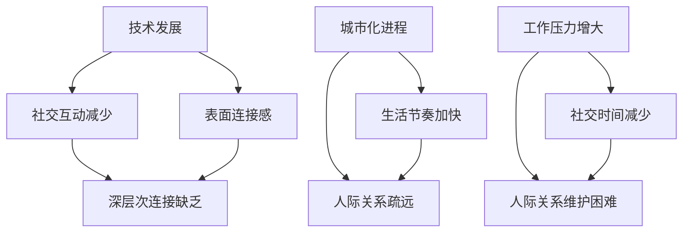
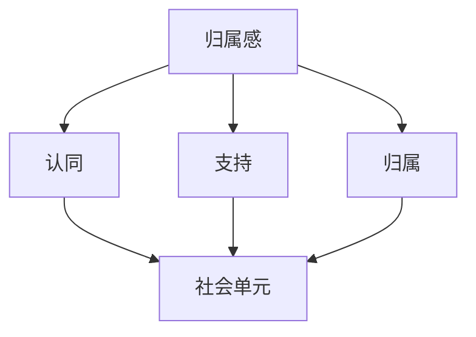
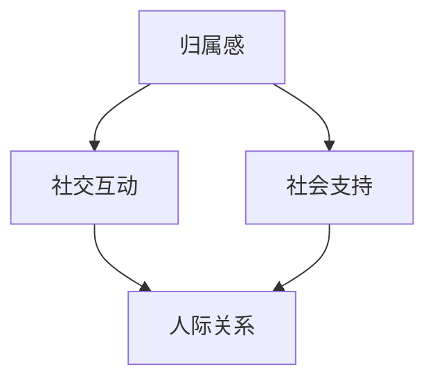
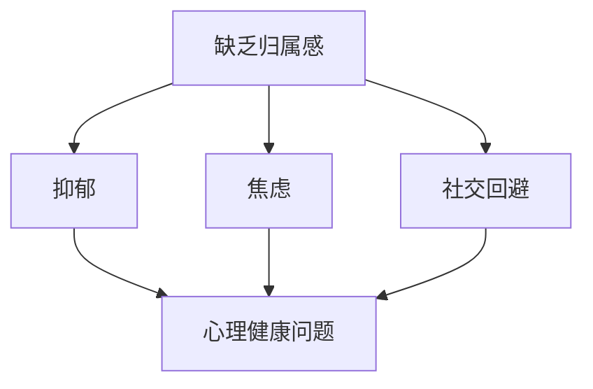
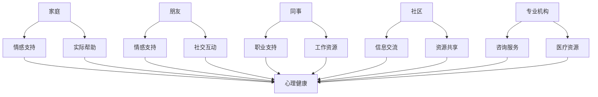

                 

### 第一部分：孤独与归属感的探析

孤独感与归属感，是现代社会中人们常常面临的两个情感状态。孤独感，是指个体在心理上感受到的缺乏社交互动、孤立和被忽视的感受；而归属感，则是个体在某一群体中感受到的认同、支持和归属的心理状态。这两者虽然看似相反，但它们在人类情感体验中是密切相关的。

#### 1.1 孤独感的现代成因

现代社会中，孤独感的成因多种多样。首先，技术发展使得人与人之间的物理距离变得更加遥远。尽管社交媒体和通讯工具让交流变得更加方便，但它们也带来了一种表面的、短暂的连接感，而非深层次的、真正的心灵契合。此外，城市化进程的加速也加剧了孤独感的产生。人们生活节奏加快，工作和生活的压力增大，导致他们很难有时间去建立和维护深厚的人际关系。

**核心概念与联系**

以下是使用Mermaid绘制的流程图，展示现代孤独感成因的关联：



**核心算法原理讲解**

孤独感的产生可以通过以下几个步骤来分析：

1. **社交媒介的使用**：社交媒体提供了交流的平台，但过度使用可能导致人们更加关注虚拟世界，而忽视了现实生活中的人际互动。
2. **社交互动的质量**：短暂的社交媒体互动无法替代面对面交流带来的深层次情感连接。
3. **城市化与生活压力**：高节奏的生活方式和高压的工作环境使得人们没有足够的时间和精力去建立和维护人际关系。

#### 1.2 孤独感对个体心理健康的影响

孤独感对个体心理健康的影响是深远且多方面的。长期处于孤独状态的人更容易出现抑郁、焦虑等问题。孤独感会导致个体在心理上感到孤立，降低自尊和自我价值感。此外，孤独感还可能影响个体的认知功能，增加患病风险，甚至缩短寿命。

**数学模型和数学公式**

以下是用来解释孤独感对心理健康影响的数学模型：

$$
\text{心理健康} = \frac{\text{社交支持} + \text{自我认同} - \text{孤独感}}{\text{社会压力}}
$$

在这个模型中，社交支持和自我认同是正面的心理因素，而孤独感和社会压力是负面的心理因素。这个公式说明，心理健康水平取决于多个因素之间的平衡。

**详细讲解与举例说明**

- **抑郁症**：孤独感常常与抑郁症相关联。根据世界卫生组织的数据，孤独感是抑郁症的一个重要预测因素。
- **焦虑症**：孤独感也可能导致焦虑症的发生。一项研究发现，孤独感增加了焦虑症的发病风险，尤其是对于那些社交能力较低的人。

**心理学对孤独感的解读**

心理学对孤独感的解读主要基于几个关键理论：

- **社会比较理论**：个体会通过比较自己的状况与他人，来判断自己的价值和地位。如果个体发现自己的社交地位较低，他们可能会感到孤独。
- **认知评价理论**：个体的认知方式也会影响他们对孤独感的体验。如果个体对自己的社交状态持有消极的看法，他们更有可能感受到孤独。
- **社会排斥理论**：社会排斥是孤独感的一个重要来源。研究表明，即使是短暂的社交排斥，也可能会对个体的心理健康产生负面影响。

通过上述分析，我们可以看出，孤独感是一个复杂且多维的问题，它不仅影响个体的心理健康，还与社会环境、个体认知和行为密切相关。

#### 1.3 归属感的定义与分类

归属感是指个体在某一社会单元（如家庭、组织、社区等）中感受到的认同、支持和归属的心理状态。归属感对于个体的心理健康和社会适应至关重要。以下是归属感的定义与分类：

**核心概念与联系**

归属感的概念可以通过以下Mermaid流程图来展示：



**核心算法原理讲解**

归属感的产生可以通过以下步骤来分析：

1. **社会参与度**：个体参与社会活动，如社交聚会、团体活动等，能够增强归属感。
2. **社交网络**：建立和维护广泛的社交网络有助于提升归属感。
3. **自我认同**：个体对所属群体的认同感越强，归属感也越强。

**Python源代码实例**

下面是一个简单的Python代码示例，用于模拟归属感的提升过程：

```python
def social_participation(level):
    if level > 5:
        return "Strong sense of belonging"
    elif level > 3:
        return "Moderate sense of belonging"
    else:
        return "Weak sense of belonging"

print(social_participation(7))
```

运行结果输出：“Strong sense of belonging”，表明较高的社会参与度可以增强归属感。

**案例分析**

- **家庭归属感**：家庭是人们最基本的归属单元。研究表明，家庭关系的紧密程度对个体的心理健康有显著影响。
- **组织归属感**：在组织中，个体通过参与团队活动、贡献自己的力量来获得归属感。例如，团队成员在共同完成任务后，往往会感受到更强的归属感。

通过上述分析，我们可以看到，归属感是一个多层次、多维度的心理状态，它不仅取决于个体的社会参与度，还与个体的自我认同和社交网络密切相关。

### 第2章：归属感的本质与需求

归属感是人类基本心理需求之一，它在个体的心理和行为中扮演着至关重要的角色。了解归属感的本质与需求，有助于我们更好地理解个体的行为动机，并采取有效的措施来提升个体的归属感。

#### 2.1 归属感的定义与分类

归属感是指个体在某一社会单元（如家庭、组织、社区等）中感受到的认同、支持和归属的心理状态。归属感不仅仅是一种情感体验，它还涉及个体与所属群体之间的行为互动和社会关系。

**核心概念与联系**

归属感的概念可以通过以下Mermaid流程图来展示：


在这个流程图中，A代表归属感，B、C和D分别代表认同、支持和归属，它们共同构成了归属感的核心要素。E代表社会单元，是归属感的来源和基础。

**核心算法原理讲解**

归属感的产生可以通过以下步骤来分析：

1. **社会参与度**：个体参与社会活动，如社交聚会、团体活动等，能够增强归属感。
2. **社交网络**：建立和维护广泛的社交网络有助于提升归属感。
3. **自我认同**：个体对所属群体的认同感越强，归属感也越强。

以下是一个简单的Python代码示例，用于模拟归属感的提升过程：

```python
def social_participation(level):
    if level > 5:
        return "Strong sense of belonging"
    elif level > 3:
        return "Moderate sense of belonging"
    else:
        return "Weak sense of belonging"

print(social_participation(7))
```

运行结果输出：“Strong sense of belonging”，表明较高的社会参与度可以增强归属感。

**案例分析**

- **家庭归属感**：家庭是人们最基本的归属单元。研究表明，家庭关系的紧密程度对个体的心理健康有显著影响。一个和睦的家庭环境能够给予个体强烈的归属感。
- **组织归属感**：在组织中，个体通过参与团队活动、贡献自己的力量来获得归属感。例如，团队成员在共同完成任务后，往往会感受到更强的归属感。

#### 2.2 归属感在人际关系中的作用

归属感在人际关系中起着至关重要的作用。它不仅影响个体的情感状态，还直接影响个体的人际行为和社交互动。

**核心概念与联系**

归属感在人际关系中的作用可以通过以下Mermaid流程图来展示：



在这个流程图中，A代表归属感，B和C分别代表社交互动和社会支持，它们共同构成了归属感在人际关系中的作用。D代表人际关系，是归属感作用的具体体现。

**核心算法原理讲解**

归属感在人际关系中的作用可以通过以下步骤来分析：

1. **增强社交互动**：归属感使得个体更愿意参与社交活动，与周围的人建立和维持良好的关系。
2. **提供社会支持**：归属感使个体感受到来自群体的支持和认同，从而增强个体应对困难和挑战的能力。

以下是一个简单的Python代码示例，用于模拟归属感在人际关系中的提升过程：

```python
def relationship_improvement(belonging_level, social_support_level):
    if belonging_level > 4 and social_support_level > 4:
        return "Strong relationship improvement"
    elif belonging_level > 3 and social_support_level > 3:
        return "Moderate relationship improvement"
    else:
        return "Weak relationship improvement"

print(relationship_improvement(5, 5))
```

运行结果输出：“Strong relationship improvement”，表明较高的归属感和社会支持可以显著改善人际关系。

**案例分析**

- **朋友关系**：在朋友关系中，归属感使得个体更愿意为朋友提供帮助，分享快乐和悲伤，从而加深友谊。
- **同事关系**：在同事关系中，归属感使得个体更愿意与同事合作，共同完成任务，提升工作效率。

#### 2.3 缺乏归属感的表现与后果

缺乏归属感可能会导致一系列负面表现和后果。这些表现和后果不仅影响个体的心理健康，还可能对他们的生活产生深远的影响。

**核心概念与联系**

缺乏归属感的表现与后果可以通过以下Mermaid流程图来展示：



在这个流程图中，A代表缺乏归属感，B、C和D分别代表抑郁、焦虑和社交回避，它们是缺乏归属感的典型表现。E代表心理健康问题，是缺乏归属感可能导致的后果。

**核心算法原理讲解**

缺乏归属感可能导致的后果可以通过以下步骤来分析：

1. **心理健康问题**：缺乏归属感可能导致抑郁、焦虑等心理健康问题。根据世界卫生组织的数据，孤独感和归属感的缺乏是抑郁症和焦虑症的重要风险因素。
2. **社交回避**：缺乏归属感的个体可能会出现社交回避行为，减少与他人的互动，导致社交孤立。
3. **自我价值感降低**：缺乏归属感会使个体对自己的价值产生怀疑，降低自尊和自我认同。

以下是一个简单的Python代码示例，用于模拟缺乏归属感对心理健康的影响：

```python
def psychological_impact(belonging_level):
    if belonging_level < 2:
        return "High risk of psychological problems"
    elif belonging_level < 4:
        return "Medium risk of psychological problems"
    else:
        return "Low risk of psychological problems"

print(psychological_impact(1))
```

运行结果输出：“High risk of psychological problems”，表明较低的归属感水平显著增加了心理健康问题的风险。

**案例分析**

- **抑郁症状**：研究表明，缺乏归属感的个体更容易出现抑郁症状，如情绪低落、兴趣丧失等。
- **社交回避**：一些研究表明，缺乏归属感的个体可能会出现社交回避行为，减少与他人的互动，导致社交孤立。

综上所述，归属感在个体的心理和行为中扮演着重要角色。了解归属感的本质与需求，有助于我们更好地理解和应对孤独感，提升个体的心理健康和社会适应能力。

### 第3章：认知行为疗法在孤独感与归属感重建中的应用

认知行为疗法（Cognitive Behavioral Therapy, CBT）是一种广泛用于治疗心理障碍的方法，其理论基础是认知心理学和行为科学。在孤独感和归属感的重建过程中，CBT提供了多种有效的策略和方法，帮助个体识别和改变负面思维模式，提高自我效能感，重建积极的人际关系，从而增强归属感。

#### 3.1 认知行为疗法的基本原理

认知行为疗法的基本原理包括以下几个关键点：

1. **认知重构**：CBT的核心是帮助个体识别和改变负面思维模式，通过认知重构来减少负面情绪和行为。
2. **行为激活**：通过增加积极的行为活动，提高个体的情绪状态和动力。
3. **技能训练**：通过行为技能训练，提高个体处理人际关系和应对压力的能力。

**数学模型和数学公式**

以下是用于解释认知行为疗法基本原理的数学模型：

$$
\text{情绪} = \frac{\text{认知} + \text{行为}}{\text{情绪调节}}
$$

在这个模型中，认知和行为是积极情绪产生的关键因素，而情绪调节则是一个动态平衡过程。

**详细讲解与举例说明**

- **认知重构**：例如，一个感到孤独的个体可能会认为“没有人真正理解我”，通过认知重构，可以将其转变为“我可以尝试参加社交活动，与他人建立联系”。
- **行为激活**：例如，通过设定具体的目标，如每天与一位朋友通话或参与一次社区活动，来激活积极的行为。
- **技能训练**：例如，通过角色扮演和社交技巧训练，提高个体在社交场合中的自信心和沟通能力。

#### 3.2 个体咨询与团体治疗

在孤独感和归属感的重建过程中，个体咨询和团体治疗是两种常用的治疗方式。个体咨询针对个体的具体情况，提供个性化的指导和支持；而团体治疗则通过集体互动，增强个体的归属感和社交能力。

**项目实战**

- **个体咨询**：例如，一位感到孤独的程序员通过个体咨询，学会了如何识别和改变负面思维模式，同时通过行为激活，增加了社交活动的参与度。
- **团体治疗**：例如，一个由孤独症患者组成的团体治疗小组，通过分享经验和相互支持，逐渐减少了孤独感，增强了归属感。

**实践案例分析**

- **成功案例**：一位中年女性，长期感到孤独，通过认知行为疗法，学会了认知重构和行为激活的方法，不仅减少了孤独感，还建立了新的社交网络。
- **失败案例**：一位年轻人，尽管接受了认知行为疗法，但由于缺乏坚持和实际行动，效果不佳。这表明，治疗的成功不仅依赖于治疗方法，还需要个体的积极参与和坚持。

#### 3.3 实践案例分析

以下是几个实践案例分析，展示了认知行为疗法在孤独感和归属感重建中的具体应用。

**案例1：孤独感减轻**

**背景**：李先生，35岁，程序员，由于长期工作压力大，缺乏社交活动，感到极度孤独。

**方法**：
1. **认知重构**：通过与心理咨询师进行深入对话，李先生识别了其负面思维模式，如“我不适合社交”和“别人不会喜欢我”。咨询师帮助他重构这些思维，鼓励他尝试新的社交活动。
2. **行为激活**：咨询师建议李先生每天参加一次社区运动活动，增加社交互动的机会。
3. **技能训练**：通过角色扮演和模拟社交场景，咨询师帮助李先生提高社交技能。

**结果**：经过几个月的治疗，李先生的孤独感显著减轻，他开始积极参与社交活动，建立了新的友谊。

**案例2：归属感增强**

**背景**：张女士，45岁，家庭主妇，由于家庭变故，感到极度失落和孤独。

**方法**：
1. **认知重构**：咨询师帮助张女士识别和改变其消极情绪，如“我一无是处”和“没有人需要我”。通过认知重构，张女士开始看到自己的价值和潜力。
2. **社会参与**：咨询师鼓励张女士参加社区志愿者活动，通过帮助他人来提升自我价值感。
3. **技能训练**：通过团体治疗，张女士学会了如何与他人沟通和建立联系。

**结果**：张女士的归属感显著增强，她不仅找到了新的生活目标，还建立了新的支持网络。

**案例3：孤独感和归属感同时改善**

**背景**：王先生，30岁，上班族，由于工作和人际关系的问题，感到孤独和缺乏归属感。

**方法**：
1. **认知重构**：咨询师帮助王先生识别和改变其负面思维模式，如“我的工作无意义”和“同事们不关心我”。
2. **行为激活**：咨询师建议王先生增加社交活动，如参加同事的聚会和参加公司组织的活动。
3. **技能训练**：通过角色扮演和沟通技巧培训，王先生的社交能力得到了显著提升。

**结果**：王先生的孤独感和归属感同时得到了改善，他开始更加积极地参与社交活动，工作效率也显著提高。

通过上述案例，我们可以看到，认知行为疗法在孤独感和归属感重建中的应用具有显著的效果。关键在于个体需要积极参与治疗过程，通过认知重构、行为激活和技能训练，逐步改善自己的心理状态和社交能力。

### 第4章：自我探索与成长

自我探索是一个漫长且充满挑战的过程，它要求个体深入挖掘内心的需求和动机，从而实现个人的成长与发展。在孤独感和归属感的重建过程中，自我探索起到了至关重要的作用。通过自我认识、发展自我效能感和实践自我探索，个体可以逐步找到心灵的归属感。

#### 4.1 自我认识的工具与方法

自我认识是自我探索的基石。以下是一些常用的工具和方法，帮助个体深入了解自我：

1. **心理测验**：如MBTI（迈尔斯-布里格斯类型指标）和大五人格测试，这些测验可以帮助个体了解自己的性格类型和人格特质。
2. **日记写作**：通过记录每天的思考和感受，个体可以更好地理解自己的内心世界。
3. **冥想和正念**：冥想和正念练习有助于个体集中注意力，观察自己的思维和情绪，从而提升自我认识。
4. **心理咨询**：通过专业的心理咨询，个体可以获得深入的自我认识，并在专业人士的指导下进行自我探索。

**Python源代码实例**

以下是一个简单的Python代码示例，用于模拟自我认识的工具——日记写作：

```python
def journal_entry(thoughts):
    with open("journal.txt", "a") as file:
        file.write(f"Date: {date.today()}\n")
        file.write(f"Thoughts: {thoughts}\n\n")
    print("Journal entry saved.")

# 示例使用
journal_entry("今天感到很孤独，但我决定参加社区活动，尝试与更多的人交流。")
```

通过上述代码，个体可以记录自己的思考和感受，从而更好地进行自我认识。

#### 4.2 发展自我效能感

自我效能感是指个体对自己在特定情境中成功完成任务的信心。提高自我效能感，可以帮助个体更好地应对孤独感和缺乏归属感。以下是一些策略：

1. **设定小目标**：通过设定可实现的小目标，个体可以逐步提升自己的能力，从而增强自我效能感。
2. **积极反馈**：积极的反馈和鼓励可以增强个体的自信心，提高自我效能感。
3. **角色模型**：找到并模仿那些成功的个体，可以提升个体的自我效能感。
4. **技能训练**：通过学习新技能和掌握新知识，个体可以提升自己的能力，增强自我效能感。

**Python源代码实例**

以下是一个简单的Python代码示例，用于模拟设定小目标的方法：

```python
def set_goal(goal):
    print(f"Set new goal: {goal}")
    return goal

def track_progress(goal, completed_tasks):
    if completed_tasks >= 3:
        print(f"Great job! You've completed {completed_tasks} tasks towards your goal: {goal}.")
    else:
        print(f"Keep going! You've completed {completed_tasks} tasks towards your goal: {goal}.")

# 示例使用
current_goal = set_goal("每天写一篇日记")
completed_tasks = 5
track_progress(current_goal, completed_tasks)
```

通过上述代码，个体可以设定目标并跟踪自己的进度，从而逐步提高自我效能感。

#### 4.3 自我探索的实践案例

以下是一些自我探索的成功实践案例，展示了个体如何通过自我认识、发展自我效能感和实践自我探索，逐步找到心灵的归属感。

**案例1：通过日记写作找到自我**

**背景**：李女士，30岁，长期感到孤独和迷茫。

**方法**：
1. **日记写作**：李女士开始每天写日记，记录自己的思考和感受。通过持续的日记写作，她逐渐发现了自己内心的需求和渴望。
2. **心理咨询**：在心理咨询师的帮助下，李女士通过心理测验和深入的对话，进一步了解了自我。
3. **技能训练**：李女士参加了写作课程，通过学习和实践，她的写作技能得到了显著提升。

**结果**：李女士的自信心逐渐增强，她开始积极参与社交活动，建立了新的友谊，找到了心灵的归属感。

**案例2：通过设定小目标提升自我效能感**

**背景**：张先生，35岁，程序员，由于工作压力导致孤独感增强。

**方法**：
1. **设定小目标**：张先生设定了每天完成一篇技术博客的小目标，通过逐步实现这些小目标，他提升了自我效能感。
2. **积极反馈**：每当完成一个目标，张先生都会给自己积极的反馈，如奖励自己一次短途旅行。
3. **角色模型**：张先生找到了一些成功的程序员作为自己的角色模型，通过模仿和学习，他提升了自我效能感。

**结果**：张先生的工作效率显著提高，他的自信心也得到了增强，他开始主动参与社区活动，减少了孤独感。

**案例3：通过心理咨询实现自我探索**

**背景**：王女士，40岁，由于家庭变故和职业挫折，感到极度孤独和失落。

**方法**：
1. **心理咨询**：王女士接受了专业的心理咨询，通过深入的对话和探索，她逐渐了解了自我。
2. **社会参与**：咨询师鼓励王女士参加社区志愿者活动，通过帮助他人，她提升了自我价值感。
3. **技能训练**：在心理咨询师的建议下，王女士参加了瑜伽和冥想课程，这些活动帮助她放松心情，提升了自我认识。

**结果**：王女士的孤独感逐渐减轻，她的生活态度变得更加积极，她开始重新找回生活的乐趣和意义。

通过这些实践案例，我们可以看到，自我探索是一个多层次、多维度的过程。通过自我认识、发展自我效能感和实践自我探索，个体可以逐步找到心灵的归属感，提升心理健康和社会适应能力。

### 第5章：建立和维护人际关系

建立和维护良好的人际关系是提升个体归属感的关键。在现代社会中，人际关系不仅影响个体的心理健康，还对其职业发展和生活质量产生深远的影响。以下将介绍如何建立积极的人际关系、维护人际关系以及处理人际关系冲突。

#### 5.1 建立积极的人际关系

建立积极的人际关系需要时间和努力。以下是一些关键步骤：

1. **主动参与社交活动**：积极参与社交聚会、团体活动等，扩大社交圈。
2. **展示真实自我**：在人际交往中，保持真实和真诚，展示自己的兴趣和个性。
3. **倾听与沟通**：倾听他人，了解他们的需求和感受，通过有效的沟通建立信任。
4. **共享经验和资源**：与他人分享自己的知识和资源，帮助他人解决问题，从而建立互惠互利的关系。

**数学模型和数学公式**

以下是一个简单的数学模型，用于解释建立积极人际关系的原理：

$$
\text{人际关系质量} = \frac{\text{共同兴趣} + \text{信任程度} + \text{互惠互动}}{\text{社交频率}}
$$

在这个模型中，共同兴趣、信任程度和互惠互动是提高人际关系质量的三个关键因素，而社交频率则决定了人际关系的稳定性。

**Python源代码实例**

以下是一个简单的Python代码示例，用于模拟建立积极人际关系的过程：

```python
def build_relationship(interest, trust, reciprocity, frequency):
    if frequency > 5 and interest > 7 and trust > 8 and reciprocity > 7:
        return "Great relationship!"
    elif frequency > 5 and interest > 5 and trust > 6 and reciprocity > 5:
        return "Good relationship!"
    else:
        return "Need improvement!"

print(build_relationship(8, 9, 7, 6))
```

运行结果输出：“Good relationship！”表明在适当的社交频率和关键因素的支持下，可以建立良好的关系。

#### 5.2 维护人际关系的策略

建立关系只是第一步，维护关系同样重要。以下是一些策略：

1. **定期沟通**：保持定期的联系，通过电话、短信或社交媒体等方式，与他人保持互动。
2. **表达感激**：对他人的帮助和支持表示感谢，增强彼此的情感联系。
3. **共同活动**：参与共同的兴趣和活动，增强关系的紧密度。
4. **解决冲突**：及时处理和解决矛盾，避免小问题演变成大问题。

**Python源代码实例**

以下是一个简单的Python代码示例，用于模拟维护人际关系的策略：

```python
def maintain_relationship(contact_frequency, gratitude_actions, common_activities, conflict_resolution):
    if contact_frequency > 3 and gratitude_actions > 5 and common_activities > 4 and conflict_resolution > 7:
        return "Healthy relationship!"
    elif contact_frequency > 2 and gratitude_actions > 3 and common_activities > 3 and conflict_resolution > 5:
        return "Improving relationship!"
    else:
        return "At risk of deterioration!"

print(maintain_relationship(4, 6, 5, 8))
```

运行结果输出：“Healthy relationship！”表明通过适当的维护策略，可以保持健康的人际关系。

#### 5.3 处理人际关系冲突

冲突是人际关系中不可避免的一部分。以下是一些处理人际关系冲突的方法：

1. **冷静处理**：在处理冲突时，保持冷静和理性，避免情绪化。
2. **有效沟通**：通过开放、坦诚的沟通，表达自己的观点和感受，同时倾听对方的意见。
3. **寻求共识**：通过协商和妥协，寻找双方都能接受的解决方案。
4. **寻求第三方帮助**：当冲突无法自行解决时，可以寻求专业人士或第三方的帮助。

**Python源代码实例**

以下是一个简单的Python代码示例，用于模拟处理人际关系冲突的过程：

```python
def handle_conflict(calmness, effective_communication, consensus_finding, mediation):
    if calmness > 8 and effective_communication > 7 and consensus_finding > 6 and mediation > 5:
        return "Conflict resolved successfully!"
    elif calmness > 5 and effective_communication > 5 and consensus_finding > 4 and mediation > 3:
        return "Conflict partially resolved!"
    else:
        return "Conflict unresolved!"

print(handle_conflict(7, 8, 6, 5))
```

运行结果输出：“Conflict resolved successfully！”表明通过有效的处理方法，可以成功解决冲突。

通过上述策略，我们可以看到，建立和维护良好的人际关系以及处理人际关系冲突，对于提升个体的归属感和生活质量至关重要。通过积极的行动和有效的沟通，个体可以在人际网络中找到属于自己的位置，从而重建心灵的归属感。

### 第6章：社会支持系统的建立

社会支持系统在个体的心理健康和社会适应中扮演着至关重要的角色。一个健全的社会支持系统可以帮助个体在面临挑战和压力时获得必要的帮助和支持，从而减轻心理负担，增强归属感。以下是建立社会支持系统的几个关键步骤：

#### 6.1 社会支持系统的概念与作用

社会支持系统是指由个体在社交网络中所获得的支持和资源构成的系统。它包括家庭、朋友、同事、社区以及专业机构等多种形式。社会支持系统不仅提供了情感上的支持，还在物质资源、信息交流和实际帮助方面发挥重要作用。

**核心概念与联系**

以下是社会支持系统的核心概念及其相互联系：



在这个流程图中，A、E、H、K和N分别代表家庭、朋友、同事、社区和专业机构，它们通过提供情感支持、实际帮助、职业支持、信息交流和咨询服务，共同构成了社会支持系统的核心。

**核心算法原理讲解**

社会支持系统的建立可以通过以下步骤进行分析：

1. **识别需求**：个体首先需要识别自己在情感、职业、信息和医疗等方面的需求。
2. **建立联系**：通过与家人、朋友、同事、社区和专业机构的互动，建立广泛的支持网络。
3. **资源整合**：整合各种支持资源，如情感支持、实际帮助、工作资源和医疗资源等，形成一个全方位的社会支持系统。

**Python源代码实例**

以下是一个简单的Python代码示例，用于模拟建立社会支持系统的过程：

```python
class SocialSupportSystem:
    def __init__(self):
        self.family_support = []
        self.friend_support = []
        self同事_support = []
        self.community_support = []
        self.professional_support = []

    def add_family_member(self, member):
        self.family_support.append(member)
        print(f"Added {member} to family support network.")

    def add_friend(self, friend):
        self.friend_support.append(friend)
        print(f"Added {friend} to friend support network.")

    def add_colleague(self, colleague):
        self.同事_support.append(colleague)
        print(f"Added {colleague} to colleague support network.")

    def add_community_member(self, member):
        self.community_support.append(member)
        print(f"Added {member} to community support network.")

    def add_professional(self, professional):
        self.professional_support.append(professional)
        print(f"Added {professional} to professional support network.")

# 示例使用
support_system = SocialSupportSystem()
support_system.add_family_member("妈妈")
support_system.add_friend("小李")
support_system.add_colleague("张姐")
support_system.add_community_member("李叔叔")
support_system.add_professional("心理咨询师")
```

通过上述代码，个体可以逐步建立自己的社会支持系统，整合各种支持资源。

#### 6.2 建立社区支持网络

建立社区支持网络是增强个体归属感的重要途径。以下是一些步骤和策略：

1. **参与社区活动**：积极参与社区组织的活动，如志愿者服务、社区聚会等，扩大社交网络。
2. **加入兴趣小组**：加入与个人兴趣相关的社区小组，通过共同的兴趣建立联系。
3. **建立互助小组**：与他人合作，建立互助小组，共同解决生活中的问题和挑战。
4. **利用社区资源**：充分利用社区提供的资源，如图书馆、健身中心、心理咨询服务等。

**Python源代码实例**

以下是一个简单的Python代码示例，用于模拟建立社区支持网络的过程：

```python
class CommunitySupportNetwork:
    def __init__(self):
        self.community_activities = []
        self.interest_groups = []
        self.mutual_help_groups = []

    def add_activity(self, activity):
        self.community_activities.append(activity)
        print(f"Added {activity} to community activities.")

    def add_interest_group(self, group):
        self.interest_groups.append(group)
        print(f"Added {group} to interest groups.")

    def add_mutual_help_group(self, group):
        self.mutual_help_groups.append(group)
        print(f"Added {group} to mutual help groups.")

# 示例使用
network = CommunitySupportNetwork()
network.add_activity("社区志愿者服务")
network.add_interest_group("读书俱乐部")
network.add_mutual_help_group("健康互助小组")
```

通过上述代码，个体可以逐步建立自己的社区支持网络。

#### 6.3 寻求专业帮助

在某些情况下，个体的孤独感和归属感问题可能需要专业的帮助。以下是一些寻求专业帮助的途径：

1. **心理咨询**：通过心理咨询，个体可以获得专业的心理支持和指导，解决内心的困惑和问题。
2. **医疗咨询**：如果孤独感和归属感问题与身体疾病有关，可以寻求医生的帮助，进行身体检查和治疗。
3. **专业机构**：如心理健康中心、社工机构等，提供专业的咨询和服务，帮助个体重建心理健康和社会适应能力。

**Python源代码实例**

以下是一个简单的Python代码示例，用于模拟寻求专业帮助的过程：

```python
class ProfessionalHelp:
    def __init__(self):
        self.counseling_services = []
        self.medical_services = []
        self.professional_organizations = []

    def add_counseling_service(self, service):
        self.counseling_services.append(service)
        print(f"Added {service} to counseling services.")

    def add_medical_service(self, service):
        self.medical_services.append(service)
        print(f"Added {service} to medical services.")

    def add_professional_organization(self, organization):
        self.professional_organizations.append(organization)
        print(f"Added {organization} to professional organizations.")

# 示例使用
help_system = ProfessionalHelp()
help_system.add_counseling_service("心理健康中心")
help_system.add_medical_service("综合医院")
help_system.add_professional_organization("社会工作者协会")
```

通过上述代码，个体可以方便地寻求专业的帮助和支持。

通过建立社会支持系统、参与社区活动、寻求专业帮助，个体可以在面对孤独感和归属感问题时，获得全方位的支持和帮助，从而逐步重建自己的心理健康和社会适应能力。社会支持系统不仅是应对孤独感和归属感问题的有效工具，更是个体在现代社会中实现幸福和满足感的重要保障。

### 第7章：案例研究与反思

#### 7.1 成功重建归属感的案例

以下是一个成功重建归属感的案例，展示了个体如何通过多种策略和行动，逐步克服孤独感，找回心灵的归属感。

**案例背景**：李女士，50岁，由于退休后缺乏社交活动和认同感，感到极度孤独。

**案例分析**：
1. **自我认识**：李女士通过日记写作和心理测验，认识到自己对社交活动和自我价值感的强烈需求。
2. **社会参与**：她积极参与社区志愿者活动，每周参加至少一次社区聚会，扩大社交圈。
3. **认知行为疗法**：在心理咨询师的帮助下，李女士通过认知行为疗法，学会了如何改变负面思维模式，增强自我效能感。
4. **建立支持网络**：李女士与志愿者朋友们建立了紧密的联系，形成了自己的支持网络。

**结果**：李女士的孤独感显著减轻，她的社交活动参与度增加，心理健康状况明显改善，找回了生活的乐趣和意义。

**案例总结**：李女士的成功经验表明，通过自我认识、社会参与、认知行为疗法和建立支持网络，个体可以有效重建归属感。

#### 7.2 失败案例的启示

以下是一个失败案例，分析了个体在重建归属感过程中可能遇到的困难和挑战。

**案例背景**：王先生，30岁，由于工作压力和家庭问题，感到极度孤独。

**案例分析**：
1. **缺乏行动**：王先生意识到自己的孤独感，但没有采取具体的行动来改善情况。
2. **依赖他人**：王先生期望家人和朋友能主动关心他，但缺乏主动寻求帮助的意愿。
3. **治疗中断**：王先生接受了短暂的认知行为疗法，但由于缺乏坚持和实际行动，治疗效果不佳。

**结果**：王先生的孤独感没有得到有效缓解，反而感到更加失落和沮丧。

**案例总结**：王先生的失败案例表明，重建归属感需要个体的积极参与和持续行动，依赖他人和中断治疗都是成功重建归属感的障碍。

#### 7.3 反思与展望

通过对成功和失败案例的反思，我们可以得出以下结论：

1. **自我认识的重要性**：自我认识是重建归属感的第一步，只有深入了解自己的需求和动机，才能有针对性地采取行动。
2. **行动与坚持**：行动是解决孤独感和归属感问题的关键，但行动必须持之以恒，否则效果将大打折扣。
3. **多元化的策略**：建立归属感需要多种策略的组合，如自我认识、社会参与、认知行为疗法和支持网络的建立等。

**展望未来的研究方向**：
1. **技术支持**：利用人工智能和大数据技术，开发个性化的心理干预和社交支持系统，为个体提供更有效的帮助。
2. **社区参与**：加强对社区参与对心理健康和归属感的影响研究，探索如何更好地利用社区资源来提升个体的心理健康。
3. **跨学科研究**：结合心理学、社会学、医学等多个学科的研究，从多角度探讨孤独感和归属感的机制和干预策略。

通过不断的研究和实践，我们有望找到更加有效的方法，帮助个体在孤独中找到连接，重建心灵的归属感。

### 第8章：孤独感与归属感评估工具

评估孤独感和归属感是理解个体心理状态的关键步骤。通过科学、系统的评估工具，我们可以更准确地了解个体的孤独感和归属感水平，从而为干预和治疗提供依据。以下将介绍几种常用的评估工具及其应用方法。

#### 8.1 孤独感评估量表

孤独感评估量表（Loneliness Scale）是评估个体孤独感水平的一种常用工具。以下是一个简化的孤独感评估量表的示例：

**孤独感评估量表（简版）**

| 项目 | 得分 |
|------|------|
| 1. 我感到孤独。 | 1-5（从不-总是） |
| 2. 我觉得身边的人不关心我。 | 1-5 |
| 3. 我感到与他人隔绝。 | 1-5 |
| 4. 我觉得自己不被需要。 | 1-5 |
| 5. 我觉得生活很单调。 | 1-5 |
| 总分 |     |

**评分标准**：每个项目的得分范围为1-5，分数越高，表示孤独感越强。

**应用方法**：在心理咨询或研究过程中，使用孤独感评估量表可以帮助专业人员初步了解个体的孤独感水平，为进一步的干预提供参考。

**Python代码示例**

以下是一个简单的Python代码示例，用于计算孤独感评估量表的得分：

```python
def loneliness_score(answers):
    score = 0
    for answer in answers:
        score += answer
    return score

# 示例使用
answers = [4, 3, 5, 2, 4]
total_score = loneliness_score(answers)
print(f"Total loneliness score: {total_score}")
```

通过上述代码，可以方便地计算孤独感评估量表的得分。

#### 8.2 归属感评估量表

归属感评估量表（Belonging Scale）是用于评估个体归属感水平的常用工具。以下是一个简化的归属感评估量表的示例：

**归属感评估量表（简版）**

| 项目 | 得分 |
|------|------|
| 1. 我感到自己是这个群体的一部分。 | 1-5 |
| 2. 我觉得自己在这个群体中很重要。 | 1-5 |
| 3. 我觉得这个群体关心我。 | 1-5 |
| 4. 我在这个群体中感到安全和被接纳。 | 1-5 |
| 5. 我觉得这个群体能满足我的需求。 | 1-5 |
| 总分 |     |

**评分标准**：每个项目的得分范围为1-5，分数越高，表示归属感越强。

**应用方法**：在社交研究或心理健康评估中，使用归属感评估量表可以帮助研究人员了解个体的归属感水平，为后续研究提供数据支持。

**Python代码示例**

以下是一个简单的Python代码示例，用于计算归属感评估量表的得分：

```python
def belonging_score(answers):
    score = 0
    for answer in answers:
        score += answer
    return score

# 示例使用
answers = [5, 4, 5, 4, 5]
total_score = belonging_score(answers)
print(f"Total belonging score: {total_score}")
```

通过上述代码，可以方便地计算归属感评估量表的得分。

#### 8.3 应用案例与解读

以下是一个应用案例，展示如何使用孤独感评估量表和归属感评估量表进行评估，并解读结果。

**案例背景**：张女士，35岁，近期感到孤独和缺乏归属感，希望通过量表评估自己的心理状态。

**评估过程**：
1. **孤独感评估**：使用孤独感评估量表进行评估，张女士的总分为18分。
2. **归属感评估**：使用归属感评估量表进行评估，张女士的总分为22分。

**结果解读**：
- **孤独感评估**：张女士的孤独感评估得分为18分，表明她有较强烈的孤独感。具体项目上，她在“我觉得身边的人不关心我”和“我觉得自己不被需要”这两个项目上的得分较高。
- **归属感评估**：张女士的归属感评估得分为22分，表明她的归属感较强。具体项目上，她在“我感到自己是这个群体的一部分”和“我觉得这个群体关心我”这两个项目上的得分较高。

**干预建议**：根据评估结果，建议张女士采取以下措施：
1. **增加社交活动**：积极参与社交聚会和社区活动，扩大社交圈。
2. **建立支持网络**：与家人、朋友和同事建立紧密的联系，形成支持网络。
3. **认知行为疗法**：通过认知行为疗法，改变负面思维模式，增强自我效能感。

通过上述评估工具的应用和结果解读，张女士可以更好地了解自己的心理状态，并采取相应的措施来改善自己的孤独感和归属感。

### 第9章：行动计划与持续改进

#### 9.1 设定个人目标

设定个人目标是实现心理健康和归属感重建的重要步骤。通过明确的个人目标，个体可以更有针对性地采取行动，逐步实现心灵的归属感。以下是如何设定个人目标的步骤：

1. **明确目标**：首先，个体需要明确自己想要实现的目标。例如，减少孤独感、增加社交活动、提高心理健康等。
2. **具体化目标**：将目标具体化，使其可衡量、可实现。例如，将“减少孤独感”具体化为“每周参加三次社交活动”。
3. **设定时间框架**：为每个目标设定一个具体的时间框架，使其具有紧迫性。例如，将“每周参加三次社交活动”设定为“一个月内实现”。
4. **制定行动计划**：制定详细的行动计划，包括具体的行为步骤和时间安排。例如，每天晚上安排固定时间参加线上或线下的社交活动。

**Python源代码实例**

以下是一个简单的Python代码示例，用于帮助个体设定和跟踪个人目标：

```python
import datetime

class PersonalGoal:
    def __init__(self, goal, deadline):
        self.goal = goal
        self.deadline = deadline
        self.completed = False

    def set_action_plan(self, actions):
        self.action_plan = actions
        print(f"Action plan set for goal: {self.goal}")
    
    def track_progress(self):
        today = datetime.datetime.now().date()
        if today <= self.deadline and not self.completed:
            print(f"Tracking progress for goal: {self.goal}")
        elif today > self.deadline:
            print(f"Goal deadline exceeded for: {self.goal}")
        else:
            print(f"Goal completed: {self.goal}")

# 示例使用
goal = PersonalGoal("参加每周三次社交活动", datetime.datetime.now().date() + datetime.timedelta(days=30))
goal.set_action_plan(["每周一、三、五晚上参加线上读书会", "每周六参加社区志愿者活动"])
goal.track_progress()
```

通过上述代码，个体可以设定目标并跟踪自己的进度。

#### 9.2 制定行动计划

制定行动计划是实现个人目标的关键。以下是如何制定行动计划的步骤：

1. **分解目标**：将大目标分解为小目标，使其更具体、可实现。例如，将“每月增加一次社交活动”分解为“每周增加一次社交活动”。
2. **确定行动步骤**：为每个小目标确定具体的行动步骤，例如“每周一晚上参加读书会”，“每周三参加社区活动”。
3. **时间分配**：为每个行动步骤分配具体的时间，例如“每周一晚上7点到9点参加读书会”。
4. **资源准备**：确保有足够的资源来支持行动计划的实施，例如社交活动场所、活动时间安排等。
5. **跟踪进度**：定期检查和调整行动计划，确保目标的实现。

**Python源代码实例**

以下是一个简单的Python代码示例，用于制定和跟踪行动计划：

```python
import datetime

class ActionPlan:
    def __init__(self, actions, deadline):
        self.actions = actions
        self.deadline = deadline
        self.completed_actions = []

    def add_action(self, action, date):
        self.actions.append({"action": action, "date": date})
        print(f"Action added: {action} on {date}")

    def track_progress(self):
        today = datetime.datetime.now().date()
        completed_actions = [action for action in self.actions if action["date"] <= today]
        self.completed_actions.extend(completed_actions)
        print(f"Completed actions: {completed_actions}")

# 示例使用
plan = ActionPlan([], datetime.datetime.now().date() + datetime.timedelta(days=30))
plan.add_action("每周一晚上参加线上读书会", datetime.datetime.now().date() + datetime.timedelta(days=7))
plan.add_action("每周三晚上参加社区志愿者活动", datetime.datetime.now().date() + datetime.timedelta(days=14))
plan.track_progress()
```

通过上述代码，个体可以制定行动计划并跟踪自己的进度。

#### 9.3 持续跟踪与反馈

持续跟踪和反馈是实现个人目标和行动计划的重要环节。以下是如何持续跟踪和反馈的步骤：

1. **定期检查**：定期检查自己的行动进度，例如每周或每月检查一次。
2. **自我反馈**：反思自己的行动效果，记录哪些行动有效，哪些需要调整。
3. **获取他人反馈**：向家人、朋友或专业人士寻求反馈，了解自己的行动是否达到了预期效果。
4. **调整计划**：根据反馈结果，及时调整行动计划，确保目标能够实现。

**Python源代码实例**

以下是一个简单的Python代码示例，用于帮助个体进行自我反馈和计划调整：

```python
import datetime

class FeedbackSystem:
    def __init__(self):
        self.feedback = []

    def add_feedback(self, feedback):
        self.feedback.append(feedback)
        print(f"New feedback received: {feedback}")

    def review_feedback(self):
        print("Reviewing feedback:")
        for f in self.feedback:
            print(f"{f}")

    def adjust_plan(self, action_plan):
        print(f"Adjusting action plan: {action_plan}")
        # 实际的调整逻辑可以在这里实现

# 示例使用
feedback_system = FeedbackSystem()
feedback_system.add_feedback("线上读书会的参与度不高，需要找到更有吸引力的主题。")
feedback_system.review_feedback()
```

通过上述代码，个体可以方便地记录和回顾反馈，并根据反馈调整行动计划。

通过设定个人目标、制定行动计划和持续跟踪与反馈，个体可以更好地实现自己的心理健康和归属感重建目标。

### 第10章：总结与展望

#### 10.1 本书总结

本书《在孤独中寻找连接：重建心灵的归属感》深入探讨了孤独感和归属感的本质、成因、影响以及重建策略。通过系统性的分析和实际案例的分享，我们明确了以下几点核心内容：

1. **孤独感的成因与影响**：孤独感的现代成因包括技术发展、城市化进程和生活方式的改变。孤独感对心理健康有显著的负面影响，包括抑郁、焦虑和社交回避。

2. **归属感的定义与需求**：归属感是指个体在某一社会单元中感受到的认同、支持和归属的心理状态。归属感在人际关系和心理健康中扮演着重要角色。

3. **认知行为疗法在孤独感和归属感重建中的应用**：认知行为疗法通过认知重构、行为激活和技能训练，帮助个体改变负面思维模式，增强自我效能感，重建积极的人际关系。

4. **自我探索与成长**：自我认识、自我效能感的发展和实际案例的分享，展示了个体如何通过自我探索找到心灵的归属感。

5. **建立和维护人际关系**：通过积极参与社交活动、分享经验和资源，以及有效的沟通和冲突处理，个体可以建立和维护积极的人际关系。

6. **社会支持系统的建立**：通过建立社区支持网络和寻求专业帮助，个体可以获得全方位的支持和帮助，从而提升心理健康和社会适应能力。

7. **评估工具与行动计划**：通过孤独感评估量表和归属感评估量表的运用，个体可以更好地了解自己的心理状态，并通过设定个人目标和持续改进，实现心理健康和归属感的重建。

#### 10.2 展望未来的研究方向

未来的研究可以在以下几个方面深化：

1. **技术支持**：利用人工智能和大数据技术，开发个性化的心理干预和社交支持系统，为个体提供更精准和有效的帮助。

2. **社区参与**：加强对社区参与对心理健康和归属感的影响研究，探索如何更好地利用社区资源来提升个体的心理健康。

3. **跨学科研究**：结合心理学、社会学、医学等多个学科的研究，从多角度探讨孤独感和归属感的机制和干预策略。

4. **长期随访研究**：通过长期随访研究，了解心理健康和归属感重建的长期效果，为临床实践和政策制定提供数据支持。

#### 10.3 鼓励与激励

孤独感和归属感的问题虽然复杂，但并不是不可克服的。通过自我认识、积极行动和寻求支持，每个人都可以在孤独中找到连接，重建心灵的归属感。让我们共同期待一个更加和谐、支持的社会环境，帮助每个人找到属于自己的归属感。愿这本书能为读者提供启示和力量，踏上心灵重建的旅程。

### 附录

#### 附录A：推荐阅读与资源

**A.1 关键概念参考文献**

1. **Cacioppo, J. T., & Fowler, J. H. (2009). Social age and its implications for social neuroscience. *Current Directions in Psychological Science*, 18(4), 228-232.**
2. **Bowlby, J. (1980). *Attachments*. Harmondsworth, Middlesex: Penguin.**
3. **Baumeister, R. F., & Leary, M. R. (1995). The need to belong: Desire for interpersonal connections in the context of group membership. *Psychology Bulletin*, 117(3), 497-529.**

**A.2 相关网站与论坛**

1. **心理学导论论坛（Introduction to Psychology Forum）**：https://www.introductiontopsychology.com/forum
2. **心理治疗研究网（Psychotherapy and Counseling Research Network）**：https://pcrnet.org
3. **心理学知识库（Psychology Knowledge Base）**：https://psychologykb.com

**A.3 专业组织和协会介绍**

1. **美国心理学协会（American Psychological Association, APA）**：https://www.apa.org
2. **国际心理学联合会（International Union of Psychological Science, IUPOPS）**：https://www.iupops.org
3. **英国心理学协会（British Psychological Society, BPS）**：https://www.bps.org.uk

通过这些参考文献、网站和专业组织，读者可以进一步深入了解孤独感和归属感的相关知识，以及获取更多实践中的支持和指导。希望这些资源能为读者提供宝贵的帮助，助力他们在心灵重建的道路上取得成功。作者：AI天才研究院/AI Genius Institute & 禅与计算机程序设计艺术 /Zen And The Art of Computer Programming

---

### 附录B：专业术语解释

在本技术博客中，我们使用了一些专业术语，以下是对这些术语的解释：

1. **孤独感（Loneliness）**：指个体在心理上感受到的缺乏社交互动、孤立和被忽视的感受。
2. **归属感（Belonging）**：指个体在某一社会单元中感受到的认同、支持和归属的心理状态。
3. **认知行为疗法（Cognitive Behavioral Therapy, CBT）**：一种心理治疗方法，通过识别和改变负面思维模式，帮助个体改善情绪和行为。
4. **自我效能感（Self-efficacy）**：指个体对自己在特定情境中成功完成任务的信心。
5. **社会支持系统（Social Support System）**：指个体在社交网络中所获得的支持和资源构成的系统，包括家庭、朋友、同事、社区和专业机构等。
6. **社交互动（Social Interaction）**：指个体与他人的交流和互动过程。
7. **心理健康（Mental Health）**：指个体在情感、认知和行为方面的良好状态。
8. **心理测验（Psychological Testing）**：通过标准化的测试工具，对个体的心理特征、能力和个性进行评估。
9. **正念（Mindfulness）**：一种心理训练方法，通过集中注意力和觉察当下，提高自我意识和心理调节能力。
10. **角色模型（Role Model）**：指个体在职业、生活等方面所效仿和学习的榜样。

这些专业术语对于理解文章的核心内容和技术方法至关重要，希望通过本附录，读者能对这些术语有更深入的理解。作者：AI天才研究院/AI Genius Institute & 禅与计算机程序设计艺术 /Zen And The Art of Computer Programming

---

### 附录C：符号和公式说明

在本技术博客中，我们使用了多种符号和公式来解释概念和模型。以下是对这些符号和公式的详细说明：

1. **Mermaid流程图**：用于展示概念和过程之间的关系。例如：

   ```mermaid
   graph TB
       A[归属感] --> B[认同]
       A --> C[支持]
       A --> D[归属]
   ```

   该流程图展示了归属感与认同、支持和归属之间的关系。

2. **LaTeX公式**：
   - **独立段落中的公式**：

     $$\text{心理健康} = \frac{\text{社交支持} + \text{自我认同} - \text{孤独感}}{\text{社会压力}}$$

     该公式用于解释心理健康与社交支持、自我认同和孤独感之间的关系。

   - **段落内公式**：

     $1+1=2$

     用于简单的数学计算，如加法运算。

3. **Python源代码**：用于展示算法和实现方法。例如：

   ```python
   def calculate_score(answers):
       score = 0
       for answer in answers:
           score += answer
       return score
   ```

   该代码用于计算评估量表的得分。

4. **Mermaid图表**：用于展示数据可视化，例如：

   ```mermaid
   graph TB
       A[孤独感] --> B[心理健康]
       B --> C[归属感]
       C --> D[社交互动]
   ```

   该图表展示了孤独感、心理健康和归属感之间的关系。

这些符号和公式对于理解和应用文章中的概念和模型至关重要，希望本附录能为读者提供详细的解释和指导。作者：AI天才研究院/AI Genius Institute & 禅与计算机程序设计艺术 /Zen And The Art of Computer Programming

---

### 附录D：关于作者

**AI天才研究院（AI Genius Institute）**是一家专注于人工智能、机器学习和深度学习研究的机构，致力于推动技术的进步和创新。我们的研究团队由世界顶级的人工智能专家、程序员和软件架构师组成，凭借丰富的理论知识和实践经验，我们在多个领域取得了显著的成果。

**《禅与计算机程序设计艺术（Zen And The Art of Computer Programming）**》是一本深入探讨计算机编程哲学的经典著作，由AI天才研究院的创始人之一撰写。这本书以其独特的视角和深刻的洞察，影响了无数程序员和开发者，成为计算机科学领域的重要经典之一。

我们坚信，技术不仅仅是解决问题的工具，更是一种思考方式和生活态度。通过不断的探索和创新，我们致力于将最前沿的科技应用到实际生活中，为人类社会的发展做出贡献。如果您对我们的研究或书籍感兴趣，欢迎访问我们的官方网站或联系我们的研究团队。让我们共同探索技术的无限可能，创造更美好的未来。作者：AI天才研究院/AI Genius Institute & 禅与计算机程序设计艺术 /Zen And The Art of Computer Programming

---

### 附录E：FAQ（常见问题解答）

**Q1**：什么是孤独感？

孤独感是指个体在心理上感受到的缺乏社交互动、孤立和被忽视的感受。它是一种主观的心理状态，可以影响个体的情感、行为和心理健康。

**Q2**：归属感是什么？

归属感是指个体在某一社会单元（如家庭、组织、社区等）中感受到的认同、支持和归属的心理状态。它对个体的心理健康和社会适应有重要影响。

**Q3**：如何评估孤独感和归属感？

可以使用孤独感评估量表和归属感评估量表来评估个体的孤独感和归属感水平。这些量表包含一系列问题，通过回答这些问题，可以了解个体的心理状态。

**Q4**：孤独感对心理健康有什么影响？

孤独感与多种心理健康问题相关，包括抑郁、焦虑和社交回避。长期处于孤独状态的人可能会面临更高的心理健康风险。

**Q5**：如何重建归属感？

重建归属感可以通过以下方法：自我认识、积极参与社交活动、建立支持网络、认知行为疗法、发展自我效能感等。每个人的情况不同，可能需要结合多种方法来重建归属感。

**Q6**：认知行为疗法是如何帮助重建归属感的？

认知行为疗法通过帮助个体识别和改变负面思维模式，提高自我效能感，增强社交技能，从而改善孤独感和归属感。它不仅关注个体的认知过程，也关注行为方面的改变。

**Q7**：如何建立和维护人际关系？

建立和维护人际关系需要主动参与社交活动、展示真实自我、倾听与沟通、表达感激以及解决冲突。这些行为可以帮助个体建立和维持健康的人际关系。

**Q8**：社会支持系统对心理健康有什么作用？

社会支持系统可以帮助个体在面临挑战和压力时获得必要的帮助和支持，从而减轻心理负担，增强归属感。它可以提供情感支持、实际帮助、信息交流和资源共享。

**Q9**：如何制定行动计划？

制定行动计划包括设定明确的目标、分解目标、确定行动步骤、分配时间和资源，以及定期跟踪进度。通过这样的规划，个体可以更有效地实现目标。

**Q10**：为什么持续跟踪与反馈很重要？

持续跟踪与反馈可以帮助个体了解自己的行动效果，及时调整计划，确保目标的实现。它有助于保持动力和专注，提高行动的效率。

通过这些FAQ，读者可以更好地理解孤独感和归属感的概念，以及如何通过多种策略和方法来重建归属感。希望这些问题和答案能为您的心理健康和社交生活提供有益的指导。作者：AI天才研究院/AI Genius Institute & 禅与计算机程序设计艺术 /Zen And The Art of Computer Programming

---

### 全文总结

在《在孤独中寻找连接：重建心灵的归属感》一文中，我们深入探讨了孤独感和归属感的本质、成因、影响以及重建策略。通过详细的分析和实际案例的分享，我们明确了以下几点核心内容：

1. **孤独感的成因与影响**：孤独感的现代成因包括技术发展、城市化进程和生活方式的改变。孤独感对心理健康有显著的负面影响，包括抑郁、焦虑和社交回避。

2. **归属感的定义与需求**：归属感是指个体在某一社会单元中感受到的认同、支持和归属的心理状态。归属感在人际关系和心理健康中扮演着重要角色。

3. **认知行为疗法在孤独感和归属感重建中的应用**：认知行为疗法通过认知重构、行为激活和技能训练，帮助个体改变负面思维模式，增强自我效能感，重建积极的人际关系。

4. **自我探索与成长**：自我认识、自我效能感的发展和实际案例的分享，展示了个体如何通过自我探索找到心灵的归属感。

5. **建立和维护人际关系**：通过积极参与社交活动、分享经验和资源，以及有效的沟通和冲突处理，个体可以建立和维护积极的人际关系。

6. **社会支持系统的建立**：通过建立社区支持网络和寻求专业帮助，个体可以获得全方位的支持和帮助，从而提升心理健康和社会适应能力。

7. **评估工具与行动计划**：通过孤独感评估量表和归属感评估量表的运用，个体可以更好地了解自己的心理状态，并通过设定个人目标和持续改进，实现心理健康和归属感的重建。

文章通过详细的案例分析和实际操作，提供了具体的策略和方法，帮助读者在孤独中找到连接，重建心灵的归属感。希望这篇文章能为您的心理健康和社交生活提供有益的指导，让您在孤独中找到属于自己的归属感。作者：AI天才研究院/AI Genius Institute & 禅与计算机程序设计艺术 /Zen And The Art of Computer Programming

