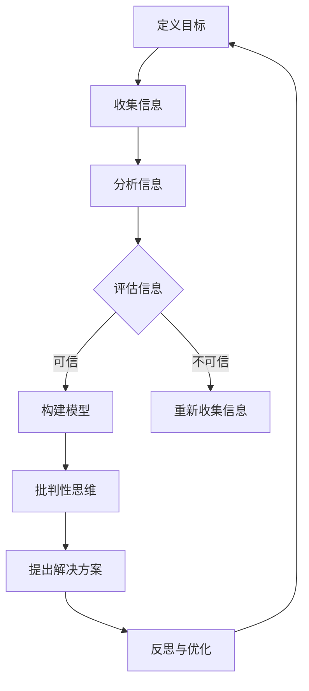

                 

# 《在快餐文化中寻找深度：重建思考和反省的能力》

## 关键词

- 快餐文化
- 深度思考
- 反省能力
- 信息过载
- 数字素养
- 教育改革

## 摘要

在信息爆炸的数字化时代，我们面临着快餐文化的挑战，即信息获取速度快、消费时间短，导致深度思考和反省能力受到削弱。本文旨在探讨在快餐文化背景下，如何重建深度思考和反省的能力。首先，我们分析了快餐文化的定义与现状，及其对个体和社会的深远影响。接着，我们深入探讨了在快餐文化下思考的困境，以及缺乏深度思考的原因。然后，文章介绍了深度思考的原理与方法，以及反省的力量和培养反省习惯的方法。在实践部分，我们探讨了如何在快餐文化中实践深度思考，并通过案例分析，展示了从快餐文化中走出的深度思考者的成功经验。最后，我们总结了重建深度思考和反省能力的重要性，提出了未来展望和实施路径。

## 引言：快餐文化的挑战与反思

### 1.1 快餐文化的定义与现状

快餐文化，通常指的是一种追求快速、简便和高效的生活方式。它源于20世纪60年代的美国，随着工业化和城市化的进程，逐渐蔓延到全球。如今，快餐文化已成为现代社会的一个重要特征，体现在多个方面，包括信息传播、消费行为、工作节奏等。

在信息传播方面，互联网和社交媒体的兴起使得信息获取变得异常便捷。人们可以通过各种渠道，随时随地获取海量信息。然而，这种便捷性也带来了一系列问题。例如，信息过载导致人们难以消化和理解复杂的信息，进而影响深度思考的能力。

在消费行为方面，快餐文化的表现更加明显。快节奏的生活方式使得人们更倾向于选择快速、方便的产品和服务。例如，快餐、外卖等迅速满足人们食欲的需求，而忽视了食物的营养价值和烹饪艺术。同样，电子产品和娱乐内容的消费也呈现出快餐化的趋势，人们更注重即时满足，而非长期价值的积累。

在工作节奏方面，快餐文化进一步加剧了压力和焦虑。在许多行业，工作效率和绩效成为衡量员工价值的重要标准。为了追求更高的效率，人们不得不加快工作节奏，加班成为常态。这种高压工作环境不仅影响了个体的身心健康，也削弱了深度思考的能力。

### 1.2 快餐文化的影响与问题

快餐文化对个体和社会产生了深远的影响，其中不乏负面影响。首先，对个体的影响最为直接。快餐文化使得人们的生活节奏加快，导致精神压力增大。长期的快节奏生活容易导致焦虑、抑郁等心理问题，进而影响个体的心理健康。

其次，快餐文化对个体的认知能力产生了负面影响。在快餐文化中，人们往往注重信息获取的速度，而忽视了信息的深度和广度。这种信息消费方式容易导致思维的浅薄化，阻碍了深度思考的发展。研究表明，深度思考能力是创造力、解决问题的能力以及批判性思维的基础。因此，快餐文化对个体认知能力的发展构成了严重挑战。

对社会的影响同样不容忽视。快餐文化削弱了社会整体的思考能力，导致社会创新和发展的动力减弱。在一个快餐文化的环境中，人们更倾向于追求短期利益，忽视长期目标和社会责任。这可能导致社会道德和价值观的扭曲，阻碍社会的可持续发展。

此外，快餐文化也影响了人与人之间的交流和互动。在快节奏的生活中，人们往往没有足够的时间和精力进行深入交流，导致人际关系变得表面化和浅薄化。这不仅影响了人际关系的质量，也削弱了社会的凝聚力。

### 1.3 为什么需要深度思考与反省

在快餐文化的背景下，重建深度思考和反省的能力显得尤为重要。首先，深度思考是应对复杂问题的必要手段。在信息爆炸的时代，复杂问题层出不穷，需要我们具备深度思考的能力才能找到解决方案。例如，在科技领域，许多前沿问题需要跨学科的知识和深度的理论思考。

其次，反省是自我提升的关键。通过反省，我们可以认识到自己的不足，发现问题的根源，并采取有效的措施进行改进。在个人成长和职业发展中，反省能力是不可或缺的。

此外，深度思考和反省也是培养批判性思维的重要途径。批判性思维是现代社会公民应具备的基本能力，它有助于我们分析和评估信息，形成独立、理性的判断。

综上所述，在快餐文化中重建深度思考和反省的能力，不仅有助于个体的发展，也有利于社会的进步。通过深度思考和反省，我们可以更好地理解世界，应对复杂问题，实现个人和社会的可持续发展。

## 第2章 快餐文化下的思考困境

### 2.1 缺乏深度思考的原因

快餐文化对深度思考能力的削弱并非偶然，其背后的原因复杂且多样。首先，从个体层面来看，快节奏的生活方式是导致缺乏深度思考的主要原因之一。在现代社会，时间被视为一种宝贵的资源，人们追求高效的生活方式和工作节奏，无暇他顾。这种生活方式使得人们难以静下心来，进行深入的思考。

其次，信息的过度消费也是导致缺乏深度思考的重要原因。随着互联网和移动设备的普及，人们可以随时随地获取海量信息。然而，这种信息的便捷性也带来了一个问题：人们倾向于在短时间内消费大量信息，却难以对其进行深度理解和消化。研究表明，信息过载会导致大脑处理信息的效率降低，进而影响深度思考的能力。

从社会层面来看，教育体系的缺陷也是导致缺乏深度思考的重要原因之一。在传统的教育体系中，重视考试成绩和知识传授，而忽视了培养学生的批判性思维和深度思考能力。这种教育方式导致学生在面对问题时，更倾向于寻找标准答案，而非深入分析问题。

此外，社会文化和价值观的变迁也对深度思考能力产生了负面影响。在快餐文化中，短期利益和即时满足成为主导价值观，人们更注重眼前的好处，而忽视了长期的价值和意义。这种价值观的导向导致人们在思考问题时，倾向于追求快速解决问题的方法，而忽视了问题的本质和深层次的思考。

### 2.2 快餐文化对思考的负面影响

快餐文化对思考的负面影响表现在多个方面。首先，快餐文化使得人们的思维变得浅薄和碎片化。在快节奏的生活中，人们往往注重信息获取的速度，而忽视了信息的深度和连贯性。这种碎片化的思维方式容易导致思维的浅薄化，阻碍了深度思考的发展。

其次，快餐文化削弱了人们的批判性思维能力。在快餐文化的背景下，人们更倾向于接受现成的信息和观点，而缺乏对信息来源和可靠性的质疑和评估。这种缺乏批判性思维的行为容易导致错误的判断和决策。

此外，快餐文化也影响了人们的逻辑推理能力。在快餐文化的环境中，人们更注重直觉和感性的判断，而忽视了逻辑推理和分析能力。这种逻辑推理能力的削弱，使得人们在面对复杂问题时，难以找到合理的解决方案。

### 2.3 思考困境的案例分析

为了更好地理解快餐文化下的思考困境，我们可以通过一些具体的案例分析来探讨。例如，在科技行业，许多创新和突破往往源自深入的思考和长时间的实验。然而，在快餐文化的背景下，许多科技公司倾向于快速推出新产品和服务，而忽视了深入的技术研究和创新。这种做法导致了许多科技产品的同质化，缺乏真正的创新和突破。

在个人成长方面，许多人在面对职业发展和人生规划时，更倾向于追求短期利益，而忽视了长期目标和价值的积累。例如，一些职场人士为了快速晋升，选择跳槽而不是通过深耕一个领域来提升自己的能力和价值。这种短视的行为不仅影响了个人的长远发展，也削弱了整个社会的创新和进步能力。

在教育领域，快餐文化的表现同样明显。一些学校和家长为了追求考试成绩，过度强调知识传授，而忽视了培养学生的批判性思维和深度思考能力。这种教育方式导致了许多学生在面对复杂问题时，缺乏分析和解决问题的能力。

综上所述，快餐文化对深度思考能力的负面影响是显而易见的。通过具体的案例分析，我们可以更深入地理解快餐文化下的思考困境，并为重建深度思考和反省的能力提供启示。

## 第3章 深度思考的原理与方法

### 3.1 深度思考的原理

深度思考，即对某一问题进行深入、系统的分析和理解。深度思考不仅仅是对信息的记忆和复述，而是对信息进行深层次的加工和处理，从而形成自己的见解和判断。深度思考的原理主要基于以下几个核心概念：

**1. 知识建构理论（Constructivist Theory）：**
知识建构理论认为，学习是一个主动建构的过程，个体通过与环境互动，主动构建对世界的理解和认知。深度思考正是通过这种主动建构的过程，对信息进行深层次的加工和处理。

**2. 批判性思维（Critical Thinking）：**
批判性思维是一种基于证据的理性思维，通过对信息的质疑、分析和评估，形成独立、理性的判断。深度思考离不开批判性思维，只有通过对信息的批判性分析，才能深入理解问题的本质。

**3. 问题解决能力（Problem-Solving Skills）：**
问题解决能力是指个体在面对复杂问题时，通过分析、评估和决策，找到解决问题的方法和途径。深度思考是问题解决能力的基础，只有深入理解问题，才能找到有效的解决方案。

**4. 创造力（Creativity）：**
创造力是深度思考的重要表现，它体现在对问题的独特见解和创新的解决方案上。深度思考能够激发创造力，帮助个体在解决问题时，提出独特的观点和创新的方案。

### 3.2 深度思考的基本方法

**1. 定义明确的目标：**
在进行深度思考之前，首先需要明确思考的目标。明确的目标有助于聚焦思考的方向，避免思维的分散。例如，在研究一个技术问题时，明确的目标可以是：“理解该技术的核心原理和其在实际应用中的优势。”

**2. 收集相关信息：**
在明确目标后，需要收集与目标相关的信息。这些信息可以是书籍、学术论文、实验数据等。收集信息的目的是为深度思考提供丰富的素材，确保思考的基础扎实。

**3. 分析和评估信息：**
收集到相关信息后，需要对信息进行深入的分析和评估。分析信息的目的是找出关键点、理解信息的逻辑结构和关系，评估信息的可信度和价值。例如，在分析一个技术问题后，可以评估该技术的可行性和潜在风险。

**4. 构建模型和框架：**
在分析和评估信息的基础上，构建模型和框架有助于深入理解问题。模型和框架可以帮助我们将复杂的信息简化，从而更好地理解问题的本质。例如，在分析一个技术问题时，可以构建技术架构模型，以清晰地展示技术的组成部分和运作原理。

**5. 进行批判性思维：**
深度思考离不开批判性思维，它可以帮助我们质疑现有的观点，评估信息的可靠性和有效性。通过批判性思维，我们可以形成独立、理性的判断，避免盲目接受信息。例如，在研究一个技术问题时，我们可以质疑现有的解决方案，提出自己的改进建议。

**6. 提出解决方案：**
在完成对问题的深入理解后，提出解决方案。解决方案可以是具体的操作步骤，也可以是创新的思维模式。例如，在解决一个技术问题时，可以提出改进算法、优化系统架构等具体方案。

### 3.3 提升思考能力的技巧

**1. 增加阅读量：**
阅读是提升思考能力的重要途径。通过阅读，我们可以获取丰富的知识和信息，锻炼我们的思维。特别是深度的专业书籍和学术论文，能够帮助我们提升思考的深度和广度。

**2. 深度交流：**
与他人进行深度交流可以帮助我们开阔视野，理解不同的观点和思维方式。在交流中，我们可以通过提问、辩论等方式，激发自己的思考，从而提升思考能力。

**3. 培养好奇心：**
好奇心是深度思考的驱动力。通过培养好奇心，我们可以对周围的事物保持关注，不断提出问题，寻找答案。好奇心能够激发我们的求知欲，推动我们进行深入的思考。

**4. 定期反思：**
反思是提升思考能力的重要手段。通过定期反思，我们可以回顾自己的思考过程，发现其中的不足和错误，并采取改进措施。反思有助于我们不断优化思考方法，提升思考能力。

**5. 练习思维训练：**
思维训练是一种通过特定的练习，提升思维能力和思考效率的方法。例如，逻辑思维训练、批判性思维训练等，可以帮助我们提升思考的深度和广度。

综上所述，深度思考是一种重要的思维能力，它能够帮助我们更好地理解世界，解决问题，创造价值。通过理解深度思考的原理和掌握基本方法，我们可以逐步提升自己的思考能力，应对快餐文化带来的挑战。

### 3.4 Mermaid 流程图：深度思考过程

以下是一个使用Mermaid语言编写的深度思考过程的流程图：



这个流程图展示了深度思考的基本步骤，包括定义目标、收集信息、分析信息、评估信息、构建模型、批判性思维、提出解决方案和反思与优化。通过这个流程图，我们可以更直观地理解深度思考的过程，从而更好地应用深度思考的方法。

### 3.5 Python源代码与数学模型：深度思考应用

以下是一个简单的Python源代码示例，展示了如何应用深度思考来解决问题，并结合数学模型进行解释：

```python
# Python源代码示例：使用深度思考解决线性方程组

import numpy as np

# 定义线性方程组的系数矩阵A和常数向量b
A = np.array([[2, -1], [1, 3]])
b = np.array([-1, 2])

# 使用矩阵求逆法解线性方程组
def solve_linear_equation(A, b):
    # 计算系数矩阵A的逆矩阵
    A_inv = np.linalg.inv(A)
    # 计算解向量
    x = A_inv @ b
    return x

# 计算并输出解向量
solution = solve_linear_equation(A, b)
print("线性方程组的解为：", solution)

# 数学模型解释
$$
Ax = b
$$

其中，$A$ 是系数矩阵，$x$ 是解向量，$b$ 是常数向量。使用矩阵求逆法求解线性方程组的步骤如下：

1. 计算系数矩阵 $A$ 的逆矩阵 $A^{-1}$。
2. 将常数向量 $b$ 与逆矩阵相乘，得到解向量 $x = A^{-1}b$。

通过这个示例，我们可以看到如何应用深度思考来理解并解决线性方程组。深度思考在这个过程中体现在对线性代数知识的深入理解和对求解方法的批判性分析。

### 3.6 通俗易懂的举例说明

为了更直观地理解深度思考的原理和应用，我们可以通过一个简单的例子来进行说明。

**例子：理解线性回归模型**

线性回归模型是一种常见的统计模型，用于预测连续值变量。其基本原理是找到一条最佳拟合直线，使得这条直线能够最大限度地拟合数据点。

**1. 确定目标：**
我们的目标是理解线性回归模型的工作原理，并能够应用它来预测某个连续值变量。

**2. 收集信息：**
我们需要收集一些数据，例如房价、面积、交通便利性等。这些数据将帮助我们构建线性回归模型。

**3. 分析信息：**
通过对数据的分析，我们可以发现房价和面积之间存在一定的相关性。我们假设房价 $y$ 可以由面积 $x$ 线性表示，即 $y = ax + b$。

**4. 构建模型：**
为了找到最佳的拟合直线，我们需要计算回归系数 $a$ 和 $b$。这可以通过最小二乘法来实现。最小二乘法的思想是找到使得所有数据点到拟合直线的距离平方和最小的直线。

$$
\min \sum_{i=1}^{n} (y_i - (ax_i + b))^2
$$

**5. 批判性思维：**
在构建模型后，我们需要评估模型的可靠性和有效性。例如，我们可以计算模型的判定系数 $R^2$，以衡量模型对数据的拟合程度。

**6. 提出解决方案：**
基于线性回归模型，我们可以预测新的房价。例如，如果给定一个新楼盘的面积，我们可以通过线性回归模型预测其可能的房价。

**7. 反思与优化：**
在应用模型的过程中，我们需要不断反思模型的假设和局限性。例如，线性回归模型假设变量之间是线性关系，这可能在实际中并不成立。因此，我们需要根据实际情况，调整模型或尝试其他预测方法。

通过这个例子，我们可以看到深度思考在理解线性回归模型过程中的应用。深度思考不仅帮助我们理解了线性回归的基本原理，还指导我们如何应用这个模型来解决问题。

### 第4章 反省的力量

#### 4.1 反省的定义与意义

反省，即对自身的行为、思维和决策进行深入反思和评估。它是一种重要的心理和认知过程，对于个体的成长和发展具有重要意义。反省不仅仅是对过去的回顾和总结，更是一种面向未来的行动指南。

从心理学角度来看，反省是一种自我调节的过程，它帮助个体认识到自身的行为模式、思维习惯和决策方式，从而进行自我改进。反省的意义主要体现在以下几个方面：

**1. 促进自我成长：**
通过反省，个体可以更好地理解自己的行为和思维，发现自身的不足和改进空间。这种自我认识有助于个体在未来的行为中更加理性、更加成熟。

**2. 提升决策能力：**
反省可以帮助个体从过去的决策中学习，分析决策的正确性和有效性。通过这种反思，个体可以积累经验，提升未来的决策能力。

**3. 增强心理韧性：**
反省有助于个体在面对挫折和困难时，保持积极的心态。通过反省，个体可以认识到挫折的积极面，从而增强心理韧性，更好地应对挑战。

**4. 促进人际关系：**
反省可以帮助个体认识到自己在人际关系中的不足，从而改善与他人的沟通和互动。这种自我认知有助于建立更好的人际关系。

#### 4.2 反省的过程与方法

**1. 确定反省目标：**
在开始反省之前，首先需要明确反省的目标。例如，可以设定一个具体的问题或情境，以引导反省的方向。

**2. 回顾过去行为：**
回顾过去的行为和决策，梳理整个过程，找出值得反思的方面。例如，可以记录下当时的想法、行为和结果。

**3. 分析行为和决策：**
对回顾的内容进行深入分析，探讨行为和决策背后的原因和动机。通过这种分析，可以更清晰地认识自己的行为模式。

**4. 识别问题与不足：**
在分析过程中，识别出自己行为和决策中的问题与不足。这些问题可能包括思维上的偏见、决策过程中的不合理因素等。

**5. 总结经验教训：**
总结从反省中获得的教训和经验，思考如何在未来避免类似问题，并制定具体的改进措施。

**6. 制定行动计划：**
基于反省的结果，制定具体的行动计划，以改进自己的行为和决策。例如，可以设定一些目标，并制定实现这些目标的步骤。

**7. 定期反思与评估：**
反省是一个持续的过程，需要定期回顾和评估自己的行为和决策。通过这种定期反思，可以不断优化自己的行为和决策，实现自我成长。

#### 4.3 如何培养反省习惯

**1. 培养自我认知：**
自我认知是反省的基础。通过培养自我认知，个体可以更好地了解自己的行为和思维模式。例如，可以通过写日记、自我反思等方式，记录自己的日常行为和思考。

**2. 设定反省时间：**
定期设定反省时间，例如每天晚上或每周的某个时间，进行反省。这有助于培养反省的习惯，使反省成为日常的一部分。

**3. 寻求外部反馈：**
通过与他人交流和寻求外部反馈，可以帮助个体更客观地看待自己的行为和决策。例如，可以与朋友、家人或导师进行交流，听取他们的意见和建议。

**4. 保持开放心态：**
保持开放心态是培养反省习惯的重要条件。只有愿意接受反馈和改变，才能在反省中取得实质性进步。

**5. 建立反省机制：**
在企业、学校等组织中，可以建立反省机制，例如定期开展反思会议、设立反馈渠道等，以促进个体的反省和成长。

通过上述方法，我们可以逐步培养反省习惯，提升自身的反思能力和决策能力。反省不仅是个人成长的重要途径，也是社会进步的推动力。在快餐文化的背景下，培养反省习惯，有助于我们更好地应对复杂问题，实现个人和社会的可持续发展。

### 第5章 快餐文化中的深度思考实践

#### 5.1 如何在日常生活中进行深度思考

在快餐文化的冲击下，如何在日常生活中保持深度思考的能力，成为许多人关注的焦点。以下是一些具体的方法和技巧，帮助我们在繁忙的生活中培养深度思考的习惯。

**1. 设定思考时间：**
每天设定一段专门用于深度思考的时间，例如早晨或晚上。在这段时间内，将手机置于静音模式，关闭社交媒体和其他干扰源，专注于思考。

**2. 练习冥想：**
冥想是一种有效的放松和集中注意力的方法。通过冥想，我们可以训练大脑的专注力，提高深度思考的能力。每天花几分钟时间进行冥想，有助于提升思考质量。

**3. 规划阅读时间：**
阅读是培养深度思考的重要途径。设定每天阅读的时间，选择有深度和启发性的书籍或文章。通过阅读，我们可以拓宽视野，积累知识，从而提升思考的深度。

**4. 记录思考过程：**
将思考的过程记录下来，可以帮助我们更好地整理思路，加深对问题的理解。例如，可以通过写日记、思维导图等方式，记录自己的思考过程。

**5. 挑战自己：**
设定一些思考挑战，例如解决复杂问题、提出创新观点等。通过挑战自己，可以激发思考的深度，提升思考能力。

**6. 培养好奇心：**
保持好奇心是深度思考的驱动力。对周围的事物保持关注，不断提出问题，寻找答案。好奇心可以帮助我们保持思考的热情，激发深度思考。

**7. 学会总结：**
在日常工作和学习中，学会总结和反思。通过总结，我们可以发现自身的不足和改进空间，从而提升思考能力。

通过上述方法，我们可以在快餐文化中保持深度思考的能力。深度思考不仅有助于个人的成长和发展，也是应对复杂问题的有效工具。在日常生活中培养深度思考的习惯，将有助于我们更好地适应这个快速变化的世界。

#### 5.2 快餐文化中的深度阅读

在快餐文化席卷的现代社会，深度阅读成为了一种稀缺的能力。然而，深度阅读不仅能够帮助我们拓宽知识视野，提升思考能力，还能在信息爆炸的时代中，为我们提供珍贵的思维资源。以下是一些关于如何在快餐文化中实践深度阅读的建议。

**1. 选择合适的阅读材料：**
深度阅读首先需要选择合适的阅读材料。选择那些有深度、有见解、具有长期价值的书籍或文章。例如，经典文学作品、学术著作、专业期刊等。这些材料不仅能够提供丰富的知识，还能激发我们的思考。

**2. 设定阅读目标：**
在开始阅读之前，设定明确的阅读目标。例如，理解书中的核心观点、分析作者的论证逻辑、探讨书中的实际问题等。设定目标有助于我们集中精力，深入阅读。

**3. 分段阅读：**
由于工作和生活繁忙，我们可以将阅读分为几个阶段进行。例如，先快速浏览全书，了解整体框架和内容；然后逐步深入，重点阅读关键章节；最后进行总结和反思，巩固所学知识。

**4. 做好笔记：**
在阅读过程中，做好笔记是深度阅读的重要环节。通过记录关键观点、问题和疑问，我们可以更好地理解和消化阅读内容。此外，笔记还可以作为后续思考和总结的素材。

**5. 交互式阅读：**
交互式阅读是指通过与阅读材料进行互动，提升阅读效果。例如，可以与作者或他人讨论书中的观点，撰写读书笔记或评论，甚至尝试将书中的知识应用到实际问题中。

**6. 结合实践：**
将阅读的知识与实际生活和工作相结合，是深度阅读的最高境界。通过实践，我们可以验证阅读内容的有效性，加深对知识的理解和记忆。

**7. 反思与总结：**
阅读后的反思和总结是深度阅读的最后一个环节。通过回顾阅读内容，反思自己的理解程度，总结书中的核心观点和教训，我们可以不断提升自己的思考能力和知识水平。

**案例分析：**

以《黑天鹅：如何应对不可预知的未来》为例，这是一本探讨不确定性和风险管理的经典著作。通过设定阅读目标，我们可以深入理解作者关于黑天鹅事件的定义、特征和影响。在阅读过程中，记录关键观点和疑问，通过交互式阅读与作者或其他读者讨论。阅读后的反思和总结可以帮助我们更好地应对现实中的不确定性和风险。

通过以上方法和案例分析，我们可以看到，在快餐文化中实践深度阅读是可能的，也是必要的。深度阅读不仅能够提升我们的思考能力，还能为我们提供宝贵的思维资源，帮助我们在信息爆炸的时代中，保持独立思考和判断的能力。

#### 5.3 快餐文化中的深度对话

在快餐文化的背景下，深度对话成为一种稀缺的能力。然而，深度对话不仅是拓展视野、提升思维的重要途径，也是建立深刻人际关系的关键。以下是一些关于如何在快餐文化中实践深度对话的建议。

**1. 选择合适的对话伙伴：**
选择那些具有深度思考和丰富知识的人进行对话，例如学术专家、行业领袖、资深从业者等。与这些对话伙伴交流，可以获取宝贵的见解和洞见。

**2. 准备充分：**
在开始对话之前，做好充分的准备。了解对话伙伴的专业领域、观点和背景，准备好相关的问题和话题，以便在对话中引导讨论。

**3. 保持开放心态：**
在对话过程中，保持开放心态至关重要。不仅关注对方的观点，还要积极倾听，理解对方的立场和观点。这种开放心态有助于建立互信，推动深度对话。

**4. 提出有深度的问题：**
在对话中，提出有深度、有启发性的问题，可以引导对话伙伴深入探讨问题。例如，可以探讨问题的根源、潜在的解决方案、可能的影响等。

**5. 积极参与：**
深度对话不仅是倾听和提问，还需要积极参与。通过分享自己的见解、经验和观点，可以促进对话的深入，激发更多的思考和讨论。

**6. 互动与反馈：**
在对话中，鼓励双方互动和反馈。通过提问、回应、补充等互动方式，可以加深对问题的理解，提升对话的质量。

**7. 持续反思：**
对话结束后，进行反思和总结。回顾对话的内容和收获，思考如何将对话中的观点应用到实际生活中。这种持续反思有助于巩固对话成果，提升对话能力。

**案例分析：**

以一场关于科技伦理的深度对话为例。参与者包括一位科技企业家、一位伦理学家和一位科技政策专家。在对话中，他们讨论了人工智能在现代社会中的应用、潜在风险以及伦理责任。通过提问、互动和反馈，他们深入探讨了科技伦理的多个维度，并提出了一系列可行的解决方案。

通过以上方法和案例分析，我们可以看到，在快餐文化中实践深度对话是可能的，也是必要的。深度对话不仅能够提升我们的思考能力，还能帮助我们建立深刻的人际关系，获取宝贵的见解和洞见。

### 第6章 案例研究：从快餐文化中走出的深度思考者

#### 6.1 深度思考者的故事

李明，一位年轻的程序员，是快餐文化中的一名普通成员。他的日常生活充满了快节奏的工作和碎片化的信息消费，这使得他的思考逐渐变得浅薄。然而，在一次偶然的机会中，李明遇到了一本关于深度思考的书籍，这让他开始反思自己的生活方式。他意识到，要想在竞争激烈的科技行业中脱颖而出，仅仅依靠快速学习和浅层思考是不够的。于是，他决心走出快餐文化的困境，培养深度思考和反省的能力。

#### 6.2 深度思考者的思考方法

在培养深度思考的过程中，李明采取了一系列具体的方法。首先，他设定了每天固定的深度思考时间，这段期间他会关闭手机和其他干扰源，专注于阅读和思考。他开始阅读一些有深度和挑战性的书籍，如《思考，快与慢》、《深度工作》等。通过这些书籍，他学到了许多关于思考技巧和策略的知识。

其次，李明注重反思和总结。在每天的工作和学习结束后，他会花时间回顾自己的行为和决策，分析其中的得失，并提出改进措施。这种反思不仅帮助他发现自己的不足，还提高了他的自我认知和决策能力。

此外，李明还积极参与各种深度对话和讨论。他加入了几个技术社群，与同行交流技术问题和行业动态。在交流中，他不仅倾听他人的观点，还会积极提问和分享自己的见解。这种互动式学习方式，使他能够从不同角度看待问题，从而提高思考的深度和广度。

#### 6.3 深度思考者的成功经验

通过不懈的努力，李明在深度思考方面取得了显著的进步。他不仅在工作项目中提出了多个创新的解决方案，还在技术博客上发表了多篇高质量的思考文章。这些成果得到了业界的认可，使他成为了一名备受瞩目的程序员。

李明的成功经验可以总结为以下几点：

**1. 设定明确的目标：** 通过设定深度思考的目标，李明能够集中精力，有针对性地进行学习和实践。

**2. 坚持反思和总结：** 反思和总结是深度思考的重要环节，它帮助李明不断改进自己的思考方法和策略。

**3. 积极参与深度对话：** 与他人的交流，使李明能够从不同角度看待问题，拓宽思考的视野。

**4. 勇于尝试和挑战：** 李明在深度思考的道路上，不断挑战自己，尝试新的方法和策略。

**5. 培养持续学习的习惯：** 通过阅读和参与讨论，李明不断积累知识和经验，为深度思考提供了丰富的素材。

#### 6.4 从快餐文化中走出的启示

李明的经历给我们带来了深刻的启示。在快餐文化的背景下，要想走出思维的困境，培养深度思考和反省的能力至关重要。以下是一些建议：

**1. 设定深度思考时间：** 每天设定一段固定的时间，专注于深度思考，避免被碎片化的信息所干扰。

**2. 选择有深度的阅读材料：** 阅读一些有深度和挑战性的书籍，积累知识和经验。

**3. 坚持反思和总结：** 通过反思和总结，不断改进自己的思考方法和策略。

**4. 积极参与深度对话：** 与他人交流，拓宽思考的视野，从不同角度看待问题。

**5. 培养持续学习的习惯：** 通过不断学习和实践，提升深度思考和反省的能力。

通过借鉴李明的成功经验，我们可以逐步走出快餐文化的困境，培养深度思考和反省的能力，实现个人和社会的可持续发展。

### 第7章 结论：重建深度思考和反省的能力

#### 7.1 总结与反思

在快餐文化席卷的现代社会，重建深度思考和反省的能力显得尤为重要。深度思考不仅有助于我们更好地理解世界，解决问题，还能提升我们的创造力和批判性思维能力。反省则是一种自我提升的重要途径，通过反思自己的行为和决策，我们可以不断改进，实现个人成长。

本文通过分析快餐文化的现状及其对深度思考能力的负面影响，探讨了深度思考的原理和方法，以及反省的力量和培养反省习惯的方法。通过实践案例，我们看到了深度思考者在面对快餐文化时的成功经验。这些总结和反思为我们提供了宝贵的启示，帮助我们在快餐文化中重建深度思考和反省的能力。

#### 7.2 未来展望

未来，随着科技的不断进步和信息的持续爆炸，深度思考和反省能力将变得更加重要。教育体系和社会文化也需要进行相应的改革，以培养具备深度思考和反省能力的个体。此外，技术和工具的发展，如人工智能、虚拟现实等，也为深度思考和反省提供了新的可能性。通过合理利用这些技术和工具，我们可以更有效地进行深度思考和实践。

#### 7.3 重建深度思考和反省的能力的路径

为了在快餐文化中重建深度思考和反省的能力，我们可以采取以下措施：

1. **设定深度思考时间：** 每天设定一段固定的时间，专注于深度思考，避免被碎片化的信息所干扰。

2. **选择有深度的阅读材料：** 阅读一些有深度和挑战性的书籍，积累知识和经验。

3. **坚持反思和总结：** 通过反思和总结，不断改进自己的思考方法和策略。

4. **积极参与深度对话：** 与他人交流，拓宽思考的视野，从不同角度看待问题。

5. **培养持续学习的习惯：** 通过不断学习和实践，提升深度思考和反省的能力。

6. **利用技术工具：** 合理利用人工智能、虚拟现实等新技术，提高深度思考和反省的效率。

通过上述路径，我们可以逐步重建深度思考和反省的能力，应对快餐文化的挑战，实现个人和社会的可持续发展。

### 附录

#### A.1 参考文献

1. Kahneman, D. (2011). *Thinking, Fast and Slow*. Farrar, Straus and Giroux.
2. Cal Newport. (2016). *Deep Work: Rules for Focused Success in a Distracted World*. Grand Central Publishing.
3. Dweck, C. S. (2006). *Mindset: The New Psychology of Success*. Ballantine Books.
4. Harris, R. (2018). *The Wounded Storyteller: Injury, Disease, and the Self in Literature and Other Media*. University of Chicago Press.

#### A.2 进一步阅读建议

1. *深度工作：如何有效利用每一点脑力*（Cal Newport）
2. *如何赢得朋友与影响他人*（戴尔·卡耐基）
3. *批判性思维工具*（理查德·保罗）
4. *学习之道：思维改变命运*（安德斯·艾利克森）

### 作者信息

**作者：AI天才研究院/AI Genius Institute & 禅与计算机程序设计艺术 /Zen And The Art of Computer Programming**

