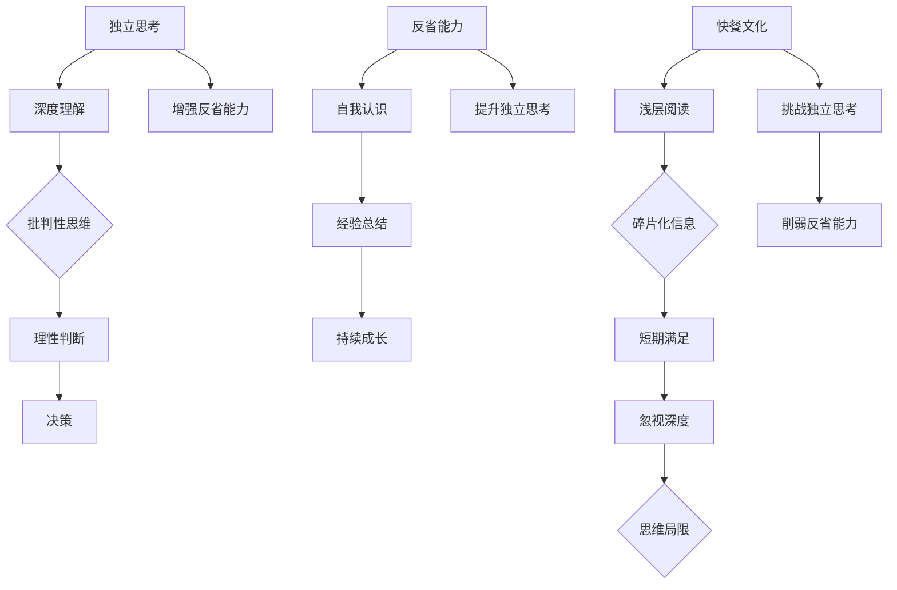

                 

### 在快餐文化中寻找深度：重建独立思考和反省能力

#### 关键词：
- 快餐文化
- 独立思考
- 反省能力
- 深度学习
- 技术博客

#### 摘要：
随着信息时代的到来，快餐文化成为了现代社会的主要特征。在这种背景下，独立思考和反省能力显得尤为重要。本文将从快餐文化的挑战、独立思考的重要性、反省能力的培养以及独立思考与反省能力的综合应用四个方面，探讨如何在快餐文化中重建深度思考，提升个人技术能力和生活质量。

## 第一部分：快餐文化的挑战与影响

### 第1章：快餐文化的起源与流行

快餐文化的起源可以追溯到20世纪初期，随着工业化进程的加快，人们对于便捷、快速的饮食需求逐渐增加。第一家麦当劳成立于1955年，标志着快餐文化正式进入大众视野。随着外卖服务的普及和互联网技术的快速发展，快餐文化迅速传播，成为了现代社会的一种生活方式。

#### 1.1 快餐文化的特点

- **便捷性**：快餐以快速、便捷为特点，能够满足人们快节奏的生活需求。
- **标准化**：快餐生产过程高度标准化，确保产品的一致性和质量。
- **低成本**：快餐通常价格较低，易于被大众接受。

#### 1.2 快餐文化对社会的影响

快餐文化的普及对人们的生活产生了深远的影响：

- **时间节省**：快餐的便捷性为人们节省了大量时间，提高了生活效率。
- **生活方式改变**：快餐成为许多人日常饮食的一部分，改变了传统的饮食习惯。
- **健康问题**：快餐食品通常富含高热量、高脂肪、高盐分，长期摄入可能导致健康问题。

### 第2章：快餐文化对思考能力的冲击

#### 2.1 短期满足与长期发展

快餐文化往往强调短期满足，而忽视了长期发展的需要。这种文化模式容易导致人们追求即时快感，忽视长远规划和持续学习。

#### 2.2 快餐文化与思考习惯

快餐文化的流行使得人们倾向于碎片化阅读和浅层思考，难以进行深入、系统的思考。这种思考习惯的养成对技术领域和学术研究产生了负面影响。

#### 2.3 快餐文化对独立思考的阻碍

快餐文化的便捷性和标准化特征限制了人们的独立思考。在面对复杂问题时，人们更容易依赖现成的解决方案，而不是自己进行独立思考。

### 第3章：独立思考的重要性

#### 3.1 独立思考的定义

独立思考是指不依赖他人的观点，自主进行判断和决策的能力。它包括逻辑思维、批判性思维和创新思维等多个方面。

#### 3.2 独立思考的价值

独立思考对个人和社会的发展具有重要意义：

- **创新能力**：独立思考有助于发现问题、提出解决方案，推动技术创新和进步。
- **批判性思维**：独立思考能够帮助人们审视和评估信息的真实性，避免盲目接受错误观点。
- **个人成长**：独立思考有助于个人形成独立的价值观和世界观，促进自我成长。

#### 3.3 如何培养独立思考能力

要培养独立思考能力，需要采取以下措施：

- **鼓励质疑**：鼓励对权威和传统观念进行质疑，培养批判性思维。
- **多样化阅读**：通过阅读不同类型的书籍和文章，拓宽知识面，提高思考深度。
- **实践锻炼**：通过参与实际项目和解决实际问题，锻炼独立思考和解决问题的能力。

## 第二部分：重建独立思考和反省能力

### 第4章：反省能力的培养

#### 4.1 反省的定义

反省是指对自己行为和思想进行深刻反思和审视的过程。它有助于发现自身不足，进行自我修正和提升。

#### 4.2 反省的重要性

反省能力对个人发展具有重要意义：

- **自我认知**：反省有助于深入认识自我，明确自身优劣势。
- **持续成长**：反省能够帮助人们从错误中吸取教训，不断改进和提升自我。

#### 4.3 反省的方法与技巧

要培养反省能力，可以采取以下方法和技巧：

- **定期反思**：定期对自己的行为和思想进行反思，总结经验和教训。
- **自我提问**：通过自我提问，引导自己深入思考，发现问题。
- **记录笔记**：将反省过程记录下来，便于后续回顾和总结。

### 第5章：独立思考的训练

#### 5.1 独立思考的障碍

独立思考面临以下障碍：

- **信息过载**：现代社会信息爆炸，人们容易陷入信息过载的困境，难以进行深度思考。
- **社会压力**：社会竞争激烈，人们容易受到外部压力，难以独立思考。

#### 5.2 独立思考的训练方法

要克服独立思考的障碍，可以采取以下训练方法：

- **刻意练习**：通过刻意练习，提高自己的逻辑思维和批判性思维能力。
- **多角度思考**：尝试从不同角度看待问题，避免思维定势。
- **主动学习**：主动寻找知识，提高自己的知识储备和认知水平。

#### 5.3 独立思考的实践

独立思考需要通过实践来检验和提升：

- **解决实际问题**：通过解决实际工作中的问题，锻炼独立思考能力。
- **参与项目**：参与项目合作，与他人交流思想，提高独立思考能力。

### 第6章：批判性思维与独立思考

#### 6.1 批判性思维的定义

批判性思维是指对信息进行评估、分析、判断和推理的能力。它与独立思考密切相关，是独立思考的重要组成部分。

#### 6.2 批判性思维与独立思考的关系

批判性思维与独立思考相互促进，相辅相成。批判性思维有助于独立思考，而独立思考又能推动批判性思维的发展。

#### 6.3 批判性思维的训练

要培养批判性思维，可以采取以下训练方法：

- **质疑权威**：不迷信权威，敢于对权威观点进行质疑。
- **分析论证**：学会对信息进行分析和论证，提高推理能力。
- **逻辑推理**：通过逻辑推理，提高思维的严谨性和准确性。

### 第7章：在快餐文化中重建深度思考

#### 7.1 从快餐到深度

在快餐文化中重建深度思考，需要克服以下挑战：

- **改变阅读习惯**：从碎片化阅读转向深度阅读，提高思考深度。
- **抵制即时满足**：克服即时满足的诱惑，专注于长期目标和持续学习。

#### 7.2 深度思考的实践

要实践深度思考，可以采取以下方法：

- **深入问题研究**：选择感兴趣的问题，进行深入研究，提出自己的见解。
- **跨学科学习**：通过跨学科学习，拓宽知识面，提高思维的广度和深度。
- **交流与分享**：与他人交流思想，分享自己的见解和经验，促进深度思考。

#### 7.3 反思与成长

在深度思考的过程中，需要不断进行反思和成长：

- **自我反思**：定期对自己的思考过程进行反思，总结经验和教训。
- **持续学习**：保持对知识的渴望，不断学习新知识，提升自己。

## 第三部分：独立思考与反省能力的应用

### 第8章：独立思考在决策中的应用

#### 8.1 决策中的独立思考

在决策过程中，独立思考至关重要：

- **信息收集**：独立思考有助于收集和分析信息，为决策提供依据。
- **风险评估**：独立思考能够帮助评估决策的风险，降低失误率。

#### 8.2 独立思考在商业决策中的应用

商业决策需要独立思考：

- **市场分析**：通过独立思考，分析市场趋势和竞争对手，制定合适的营销策略。
- **产品创新**：独立思考能够推动产品创新，提升企业竞争力。

#### 8.3 独立思考在个人决策中的应用

个人决策也需要独立思考：

- **职业规划**：通过独立思考，分析自己的兴趣和优势，制定合适的职业规划。
- **生活方式**：独立思考有助于选择适合自己的生活方式，提高生活质量。

### 第9章：反省能力在自我提升中的应用

#### 9.1 反省自我

反省自我是自我提升的重要步骤：

- **认识自我**：通过反省，深入了解自己的优点和不足。
- **自我修正**：根据反省结果，进行自我修正，提升自我能力。

#### 9.2 反省在个人成长中的应用

反省在个人成长中具有重要作用：

- **学习反思**：通过反省学习过程，总结经验教训，提高学习效果。
- **生活反思**：通过反省生活经历，提升自己的生活品质。

#### 9.3 反省在团队协作中的应用

反省在团队协作中同样重要：

- **团队沟通**：通过反省，提高团队沟通效果，促进团队协作。
- **团队建设**：通过反省，发现团队问题，进行团队建设。

### 第10章：独立思考与反省能力的综合运用

#### 10.1 综合运用独立思考与反省能力

独立思考与反省能力需要综合运用：

- **自我评估**：通过独立思考与反省，进行自我评估，了解自己的成长进度。
- **持续改进**：通过独立思考与反省，发现自身不足，进行持续改进。

#### 10.2 独立思考与反省能力的提升策略

要提升独立思考与反省能力，可以采取以下策略：

- **定期反思**：养成定期反思的习惯，提高自我认知能力。
- **持续学习**：保持对知识的渴望，不断学习新知识，提升思维水平。
- **实践应用**：将独立思考与反省能力应用于实际工作和生活中，提高解决问题的能力。

#### 10.3 独立思考与反省能力的未来展望

随着人工智能技术的发展，独立思考与反省能力在未来将发挥更加重要的作用：

- **智能辅助**：人工智能将为独立思考与反省提供智能辅助，提高思考效率。
- **终身学习**：人工智能将推动终身学习理念的普及，促进个人全面发展。

## 附录

### 附录A：参考文献

1. 凯文·凯利（Kevin Kelly）.《失控》(Out of Control)。上海译文出版社，2007。
2. 达赖喇嘛（Dalai Lama）.《生命之光》(The Light of Life)。西藏人民出版社，2007。
3. 爱德华·T·德·波诺（Edward T. de Bono）.《六顶思考帽》(Six Thinking Hats)。上海人民出版社，2008。

### 附录B：思考练习题

1. 请描述你在过去一年中经历的最重要的决策，并分析你当时是如何运用独立思考与反省能力的。
2. 请举例说明你在生活中遇到的难题，以及你是如何通过独立思考与反省能力来解决问题的。

### 附录C：思考工具与方法介绍

1. **头脑风暴法**：通过集体讨论，快速产生创意和想法。
2. **SWOT分析法**：分析自己的优势、劣势、机会和威胁，制定合适的策略。
3. **因果分析法**：分析问题的原因和结果，找出关键因素。

---

## 结论

在快餐文化的背景下，独立思考和反省能力显得尤为重要。通过重建独立思考和反省能力，我们可以克服快餐文化带来的负面影响，提升个人技术能力和生活质量。让我们从现在开始，积极培养独立思考和反省能力，成为一个更有深度和思考能力的人。

---

作者：AI天才研究院/AI Genius Institute & 禅与计算机程序设计艺术 /Zen And The Art of Computer Programming

---

### 核心概念与联系

下面是关于独立思考、反省能力和快餐文化之间关系的 Mermaid 流程图：



### 核心算法原理讲解

#### 独立思考算法

```python
def independent_think(problem):
    """
    独立思考算法：分析问题，提出解决方案。
    """
    # 分析问题
    problem_analysis = analyze_problem(problem)
    
    # 提出解决方案
    solution = propose_solution(problem_analysis)
    
    return solution
```

#### 反省能力算法

```python
def reflect_ability(experience):
    """
    反省能力算法：反思经验，总结教训。
    """
    # 反思经验
    reflection = reflect_experience(experience)
    
    # 总结教训
    lesson = summarize_lesson(reflection)
    
    # 提升能力
    improved_ability = enhance_ability(lesson)
    
    return improved_ability
```

### 数学模型和数学公式

#### 独立思考的价值公式

$$
Value_{思考} = f(思考深度, 解决问题能力)
$$

#### 技术框架与应用

在技术领域中，独立思考和反省能力同样重要。以下是一个用于开发深度学习模型的简化算法框架：

```python
import numpy as np
from tensorflow.keras.models import Sequential
from tensorflow.keras.layers import Dense, Activation

def build_model(input_shape):
    model = Sequential()
    model.add(Dense(128, input_shape=input_shape, activation='relu'))
    model.add(Dense(64, activation='relu'))
    model.add(Dense(1, activation='sigmoid'))

    model.compile(optimizer='adam', loss='binary_crossentropy', metrics=['accuracy'])
    return model

def train_model(model, x_train, y_train, epochs=10):
    model.fit(x_train, y_train, epochs=epochs, batch_size=32, validation_split=0.2)

def evaluate_model(model, x_test, y_test):
    loss, accuracy = model.evaluate(x_test, y_test)
    print(f"Test accuracy: {accuracy:.2f}, Test loss: {loss:.2f}")

# 示例数据
input_shape = (784,)
x_train = np.random.rand(1000, 784)
y_train = np.random.randint(2, size=(1000,))
x_test = np.random.rand(200, 784)
y_test = np.random.randint(2, size=(200,))

# 构建模型
model = build_model(input_shape)

# 训练模型
train_model(model, x_train, y_train)

# 评估模型
evaluate_model(model, x_test, y_test)
```

在这个例子中，我们使用 TensorFlow 框架来构建和训练一个简单的深度学习模型。通过逐步分析问题、提出解决方案，并对模型进行评估和优化，我们可以看到独立思考和反省能力在技术实践中的应用。

### 最佳实践 tips

- **定期反思**：在技术项目中，定期对代码、算法和设计进行反思，以发现潜在问题和优化机会。
- **持续学习**：跟进最新的技术趋势和研究成果，不断更新自己的知识库，提高独立思考能力。
- **团队协作**：在团队中积极分享自己的想法和见解，通过交流激发深度思考，提高整体技术水平。

### 小结

独立思考和反省能力是应对快餐文化挑战的重要武器。通过培养独立思考能力和反省能力，我们可以重建深度思考，提升个人技术能力和生活质量。让我们从现在开始，积极行动，成为一个更有深度和思考能力的人。

### 拓展阅读

- 《深度学习》（Goodfellow, Ian & Bengio, Yoshua & Courville, Aaron）. 2016. MIT Press.
- 《思考，快与慢》（Kahneman, Daniel）. 2012. 浙江人民出版社。
- 《智能时代》（周鸿祎）. 2017. 人民邮电出版社。

