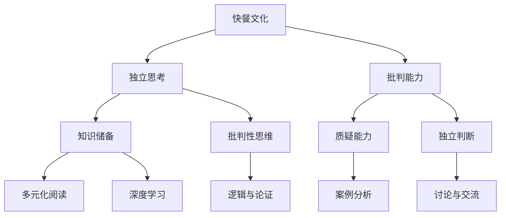

                 

作者：AI天才研究院/AI Genius Institute & 禅与计算机程序设计艺术 /Zen And The Art of Computer Programming

# 在快餐文化中寻找深度：重建独立思考和批判能力

关键词：快餐文化、独立思考、批判能力、信息技术、深度学习

## 摘要

在当今的快餐文化时代，信息传递速度和内容多样性迅速增加，然而，人们对于信息的处理和理解却越来越趋向于浅层化和被动接受。本文旨在探讨在快餐文化背景下，独立思考和批判能力的重要性，并提出一系列重建这些能力的策略。通过对快餐文化现象的分析，文章揭示了快餐文化对思考和批判能力的负面影响。随后，本文从知识储备、批判性思维的培养、信息来源分析、认知偏差避免等方面，详细阐述了如何重建独立思考和批判能力。此外，文章还结合实际案例，展示了如何在实践中提高这些能力，并强调其对于个人成长和社会进步的深远意义。

## 引言

### 1. 快餐文化的兴起与影响

快餐文化的兴起是现代社会的产物，随着信息技术的飞速发展，信息传递变得更加便捷和迅速。互联网、社交媒体和移动设备的普及，使得信息无处不在，人们可以在短时间内接触到大量的信息。这种快速的获取方式，虽然在一定程度上丰富了人们的生活，但也在无形中改变了人们的思考方式。

快餐文化的特点主要体现在以下几个方面：

- **快节奏**：现代社会的生活节奏加快，人们倾向于在短时间内获取尽可能多的信息。这种快节奏的生活方式，导致人们在思考问题时往往缺乏深度，更倾向于表面化和浅层次的思考。

- **浅层阅读**：在快餐文化的背景下，人们更倾向于阅读短小精悍、易于消化的内容。这种阅读方式，虽然能够迅速获取信息，但往往无法深入理解和思考。

- **大量生产与消费**：快餐文化也体现在信息的生产与消费上。大量的信息被生产出来，迅速传播，又被迅速消费。这种模式使得信息的质量无法得到保障，同时也降低了人们对信息的筛选能力。

快餐文化对人们思考方式的影响是深远的。首先，它使得人们的思考方式变得更加浅层和表面化，缺乏深度和广度。其次，它削弱了人们的批判能力，使得人们更容易接受信息和观点，而缺乏质疑和独立判断的能力。这种现象在信息技术领域尤为明显，许多信息技术从业者往往只关注技术的应用，而忽视了技术背后的原理和逻辑。

### 2. 独立思考的重要性

独立思考是人们对于信息进行深层次理解和分析的能力，是批判能力的基础。在快餐文化的背景下，独立思考的重要性愈发凸显。首先，独立思考能够帮助人们摆脱被动接受信息的局面，主动去探索和挖掘信息的深层次含义。其次，独立思考能够提高人们的批判能力，使得人们能够对信息进行理性分析和判断，避免盲目接受和传播错误信息。

在信息技术领域，独立思考尤为重要。信息技术的发展日新月异，新概念、新技术层出不穷。只有具备独立思考能力，才能够真正理解和掌握这些技术，从而推动技术的创新和应用。此外，独立思考还能够帮助信息技术从业者从不同的角度和维度去分析和解决问题，提高问题的解决效率和效果。

### 3. 批判能力的重建

批判能力是指人们对于信息进行理性分析和判断的能力，是独立思考的重要体现。在快餐文化的背景下，批判能力的退化是一个普遍现象。要重建批判能力，需要从以下几个方面进行努力：

- **增强知识储备**：知识是批判能力的基础，只有具备丰富的知识储备，才能够对信息进行有效的分析和判断。因此，需要通过多元化阅读和深度学习来增强知识储备。

- **培养批判性思维**：批判性思维是批判能力的核心，它包括质疑精神、逻辑推理、论证能力等。通过学习和实践，可以培养和提高批判性思维。

- **提高质疑能力**：质疑是批判能力的重要体现，对于接受到的信息，要勇于提出疑问，不盲目接受。通过质疑，可以深入挖掘信息的真实性和可靠性。

- **避免认知偏差**：认知偏差是人们在信息处理过程中常见的现象，它会影响到人们的判断和决策。因此，要意识到自己的认知偏差，学会客观分析和判断。

总之，在快餐文化的背景下，重建独立思考和批判能力是一项长期而艰巨的任务。需要从个人和社会层面共同努力，通过教育、实践和自我提升，逐步提高独立思考和批判能力，从而在快餐文化中寻找深度，实现个人和社会的进步。

## 第一部分：快餐文化现象分析

### 第1章：快餐文化的定义与特点

#### 1.1 快餐文化的定义

快餐文化是指一种以快速、便捷、高效为特征的文化现象，它起源于20世纪中叶的美国。随着工业化进程的加速，人们的生活节奏逐渐加快，传统的生活方式受到了巨大的冲击。为了适应这种快速变化的生活方式，快餐文化逐渐兴起，并迅速在全球范围内传播。

快餐文化不仅仅指的是食品快餐，它还包括了信息传递、娱乐消费、生活方式等多个方面。在信息传递方面，快餐文化体现在人们倾向于阅读短小精悍的文章、观看短视频、快速浏览新闻等。在娱乐消费方面，快餐文化则表现为追求刺激、快感的娱乐形式，如网络游戏、综艺节目等。在生活方式方面，快餐文化使得人们更加注重效率和便利，愿意为时间和便捷支付更高的代价。

#### 1.2 快餐文化的特点

快餐文化的特点主要体现在以下几个方面：

- **快节奏**：快餐文化的核心特征是快节奏。人们追求快速获取信息、快速消费娱乐、快速完成任务。这种快节奏的生活方式，导致了人们在思考问题时缺乏耐心和深度。

- **浅层阅读**：在快餐文化的背景下，人们更倾向于阅读短小、简单、易于理解的内容。这种浅层阅读方式，虽然能够迅速获取信息，但往往无法深入理解和思考。

- **大量生产与消费**：快餐文化体现在信息的生产与消费上。大量的信息被生产出来，迅速传播，又被迅速消费。这种模式使得信息的质量无法得到保障，同时也降低了人们对信息的筛选能力。

- **缺乏深度思考**：快餐文化的特点导致了人们在思考问题时缺乏深度。人们往往只关注问题的表面现象，而忽视了问题的本质和深层次的联系。

- **被动接受信息**：在快餐文化的背景下，人们更多地是被动接受信息，而不是主动思考和探索。这种现象在信息技术领域尤为明显，许多信息技术从业者只关注技术的应用，而忽视了技术背后的原理和逻辑。

#### 1.3 快餐文化对社会的影响

快餐文化对社会的影响是多方面的，既有积极的方面，也有消极的方面。

- **积极影响**：快餐文化的兴起，使得人们的生活更加便捷和高效。人们可以在短时间内获取大量的信息，提高了生活和工作效率。此外，快餐文化也促进了信息传播和交流的便利性，推动了社会的进步和发展。

- **消极影响**：快餐文化的快速传播，也带来了许多消极的影响。首先，它导致了人们思考能力的下降，缺乏深度和广度的思考。其次，快餐文化使得信息质量无法得到保障，大量虚假、不准确的信息被传播和消费。此外，快餐文化还加剧了社会的不公平现象，使人们更容易受到虚假信息和错误观点的影响。

总的来说，快餐文化对社会的影响是复杂的。在享受快餐文化带来的便利和高效的同时，我们也需要警惕其潜在的负面影响，努力提高独立思考和批判能力，以更好地应对这个快速变化的世界。

#### 1.2.1 快节奏

快节奏是快餐文化最显著的特点之一。在快节奏的生活中，时间被视为一种宝贵的资源，人们追求在有限的时间内完成更多的任务。这种追求高效的心态，导致了以下几种现象：

- **时间压缩**：人们倾向于在短时间内完成更多的任务，无论是工作、学习还是休闲。这种时间压缩的生活方式，使得人们无法充分享受生活，导致心理健康问题增多。

- **快速决策**：在快节奏的生活中，人们往往需要快速做出决策。这种快速决策，往往缺乏充分的思考和评估，可能导致错误的决策和结果。

- **任务堆积**：由于时间压缩，人们往往会将多个任务同时进行，导致任务堆积。这种任务堆积的现象，不仅增加了压力，也降低了工作效率。

快节奏的生活方式，对人们的思考方式产生了深远的影响。首先，它使得人们的思考变得浅层和表面化。人们在追求快速完成任务的过程中，往往只关注问题的表面现象，而忽视了问题的本质和深层次的联系。其次，快节奏的生活方式，也使得人们更容易产生焦虑和压力，影响心理健康。

#### 1.2.2 浅层阅读

浅层阅读是快餐文化在信息获取方式上的体现。在快餐文化的背景下，人们倾向于阅读短小、简单、易于理解的内容。这种阅读方式，虽然能够迅速获取信息，但往往无法深入理解和思考。

浅层阅读的原因主要有以下几点：

- **时间限制**：在快节奏的生活中，人们的时间被压缩，很难进行长时间的阅读。因此，人们更倾向于阅读短小、简单的内容，以便在短时间内获取信息。

- **信息过载**：随着互联网和社交媒体的普及，人们每天接触到的信息量急剧增加。为了应对信息过载，人们只能选择阅读那些最关键、最重要的信息。

- **娱乐化倾向**：快餐文化中的信息往往更加娱乐化，以吸引读者的注意力。这种娱乐化的信息，虽然能够快速获取，但往往缺乏深度和思考价值。

浅层阅读对人们的思考方式产生了负面影响。首先，它使得人们的思考变得浅层和表面化。人们在阅读短小、简单的内容时，往往只关注问题的表面现象，而忽视了问题的本质和深层次的联系。其次，浅层阅读也降低了人们的思考深度和广度，使得他们在面对复杂问题时缺乏有效的思考和分析能力。

#### 1.2.3 大量生产与消费

大量生产与消费是快餐文化在信息生产和传播方面的体现。在快餐文化的背景下，信息的生产和消费呈现出一种高度集中的趋势。大量的信息被生产出来，迅速传播，又被迅速消费。

大量生产与消费的原因主要有以下几点：

- **技术进步**：随着互联网和数字技术的发展，信息的生产和传播变得更加便捷和高效。人们可以轻松地创建和分享信息，使得信息的生产速度大大加快。

- **市场需求**：在快节奏的生活中，人们更倾向于快速获取信息。这种市场需求，推动了大量信息的生产和传播，以满足人们的需求。

- **商业模式**：大量的信息生产与消费，形成了一种新的商业模式。许多企业通过生产和传播信息来获得利润，这种商业模式也促进了信息的过度生产和消费。

大量生产与消费对信息的质量产生了负面影响。首先，由于信息的生产速度过快，许多信息无法得到充分的审核和验证，导致信息的准确性和可靠性降低。其次，大量的信息被迅速消费，人们往往无法对信息进行深入理解和思考，导致信息的浅层化和碎片化。

#### 1.3.1 缺乏深度思考

在快餐文化的背景下，缺乏深度思考是一个普遍现象。深度思考是指对问题进行深层次的、全面的、系统的分析，从而揭示问题的本质和深层次的联系。然而，在快餐文化的背景下，人们往往只关注问题的表面现象，缺乏对问题进行深入分析和思考的能力。

缺乏深度思考的原因主要有以下几点：

- **快节奏的生活方式**：快餐文化的一个显著特点是快节奏。人们追求在短时间内完成更多的任务，导致他们没有足够的时间和精力进行深度思考。

- **浅层阅读**：快餐文化中的阅读方式主要是浅层阅读，人们倾向于阅读短小、简单的内容，无法进行深入的阅读和理解。

- **信息过载**：随着互联网和社交媒体的普及，人们每天接触到的信息量急剧增加。为了应对信息过载，人们只能选择阅读那些最关键、最重要的信息，而忽视了信息的深度和广度。

缺乏深度思考对个人和社会产生了负面影响。首先，对于个人而言，缺乏深度思考导致他们在面对复杂问题时，无法进行有效的分析和解决。其次，对于社会而言，缺乏深度思考导致社会问题无法得到有效的解决，因为人们无法看到问题的本质和深层次的联系。

#### 1.3.2 忽视复杂问题

在快餐文化的背景下，人们倾向于处理简单问题，而忽视复杂问题。这种倾向导致了以下几方面的问题：

- **问题简化**：在快餐文化的背景下，人们倾向于将复杂问题简化为简单问题，以便快速解决。然而，这种简化往往忽略了问题的复杂性和多样性，导致问题无法得到全面解决。

- **规避困难**：面对复杂问题时，人们往往选择逃避，而不是去面对和解决。这种规避行为使得复杂问题进一步恶化，因为问题没有得到有效的处理。

- **缺乏系统性**：在处理复杂问题时，需要从多个角度、多个层面进行系统性的分析。然而，在快餐文化的背景下，人们往往只关注问题的某一个方面，导致问题的系统性无法得到保障。

忽视复杂问题对个人和社会产生了负面影响。对于个人而言，忽视复杂问题导致他们在面对问题时缺乏全面的思考和解决方案。对于社会而言，忽视复杂问题使得社会问题得不到有效的解决，从而影响社会的稳定和发展。

#### 2.1.2 缺乏质疑精神

在快餐文化的背景下，缺乏质疑精神是一个普遍现象。质疑精神是指对接受的信息和观点提出疑问，进行批判性分析和评估。然而，在快餐文化的背景下，人们往往缺乏这种精神。

缺乏质疑精神的原因主要有以下几点：

- **信息过载**：随着互联网和社交媒体的普及，人们每天接触到的信息量急剧增加。为了应对信息过载，人们往往只关注那些最关键、最重要的信息，而忽视了信息的真实性和可靠性。

- **被动接受**：在快餐文化的背景下，人们更多地是被动接受信息，而不是主动思考和探索。这种现象在信息技术领域尤为明显，许多信息技术从业者只关注技术的应用，而忽视了技术背后的原理和逻辑。

- **权威主义**：在快餐文化的背景下，人们往往容易接受权威的观点和信息，而缺乏对权威进行质疑的精神。这种权威主义使得人们容易盲从和接受错误的信息和观点。

缺乏质疑精神对个人和社会产生了负面影响。对于个人而言，缺乏质疑精神导致他们在面对问题时，无法进行独立思考和判断，容易受到错误信息和观点的影响。对于社会而言，缺乏质疑精神使得社会问题无法得到有效的解决，因为人们缺乏对问题和解决方案的批判性分析。

#### 2.2.2 丧失独立判断

在快餐文化的背景下，人们往往丧失独立判断能力。独立判断能力是指对信息进行理性分析和判断，形成自己独立观点和决策的能力。然而，在快餐文化的背景下，人们更容易受到外部信息和观点的影响，缺乏独立判断能力。

丧失独立判断的原因主要有以下几点：

- **信息依赖**：在快餐文化的背景下，人们倾向于依赖外部信息，而不是自己进行思考和判断。这种现象在信息技术领域尤为明显，许多信息技术从业者只关注技术的应用，而忽视了技术背后的原理和逻辑。

- **权威影响**：在快餐文化的背景下，人们往往容易接受权威的观点和信息，而缺乏对权威进行质疑的精神。这种现象使得人们容易盲从和接受错误的信息和观点。

- **情感驱动**：在快餐文化的背景下，人们更容易受到情感的影响，而不是理性驱动。这种现象使得人们在面对信息时，更容易受到情感驱动的影响，而缺乏独立判断。

丧失独立判断能力对个人和社会产生了负面影响。对于个人而言，丧失独立判断能力导致他们在面对问题时，无法形成自己的独立观点和决策，容易受到错误信息和观点的影响。对于社会而言，丧失独立判断能力使得社会问题无法得到有效的解决，因为人们缺乏对问题和解决方案的独立思考和判断。

## 第二部分：重建独立思考和批判能力

### 第3章：培养独立思考的方法

#### 3.1 增强知识储备

独立思考能力是建立在丰富的知识储备之上的。只有掌握了足够的知识，才能够对问题进行深入的分析和思考。为了增强知识储备，可以采取以下几种方法：

- **多元化阅读**：阅读是获取知识的重要途径。在阅读过程中，不仅要阅读与自己专业相关的书籍，还要涉猎其他领域的知识。这样可以拓宽视野，提高对不同领域知识的理解。

- **深度学习**：深度学习是一种通过对大量数据进行深入分析，从而提取有用信息和知识的方法。通过深度学习，可以挖掘出隐藏在数据中的规律和模式，从而提高独立思考的能力。

- **跨学科学习**：跨学科学习是将不同领域的知识进行整合和应用。通过跨学科学习，可以培养综合思维能力和创新思维，提高独立思考的能力。

- **实践学习**：实践是检验知识的最佳方式。通过实践，可以将理论知识应用到实际中，从而加深对知识的理解和掌握。例如，通过编程实践来巩固计算机科学的知识。

#### 3.2 培养批判性思维

批判性思维是指对信息进行理性分析和判断，形成独立观点和决策的能力。为了培养批判性思维，可以采取以下几种方法：

- **提高质疑能力**：质疑是批判性思维的核心。在面对信息时，要勇于提出疑问，不盲目接受。通过质疑，可以深入挖掘信息的真实性和可靠性。

- **学习逻辑与论证**：逻辑和论证是批判性思维的基础。通过学习逻辑和论证，可以培养严密的思维方式和合理的推理能力，提高批判性思维。

- **案例分析**：通过分析真实的案例，可以了解不同情境下的决策过程和结果。这样可以学会如何在不同情境下进行独立思考和判断。

- **讨论与交流**：与他人进行讨论和交流，可以开阔思路，发现不同观点和解决方案。这样可以培养批判性思维，提高独立思考和判断的能力。

#### 3.3 增强独立思考能力

增强独立思考能力需要从多个方面进行努力：

- **自我反思**：通过自我反思，可以了解自己的思考方式和思维习惯。这样可以发现自身的不足，并采取相应的措施进行改进。

- **独立解决问题**：在面对问题时，要尝试独立思考和解决问题，而不是依赖外部资源和他人帮助。这样可以培养独立思考的能力。

- **培养好奇心**：好奇心是推动独立思考的重要动力。通过培养好奇心，可以激发对未知领域的探索欲望，提高独立思考和创新能力。

- **持续学习**：独立思考能力是一个长期培养的过程。通过持续学习，可以不断更新和扩展知识，提高独立思考和判断的能力。

### 第4章：提高批判能力

批判能力是指对信息进行理性分析和评估，形成独立判断和决策的能力。提高批判能力是重建独立思考和批判能力的重要一环。以下几种方法可以帮助提高批判能力：

#### 4.1 分析信息来源

信息来源是判断信息真实性和可靠性的关键。以下方法可以帮助分析信息来源：

- **确认信息来源**：在获取信息时，要确认信息的来源，确保信息来自可靠和权威的渠道。例如，查阅学术论文、权威新闻报道等。

- **评估信息质量**：要对信息来源的质量进行评估，判断信息是否经过严格审查和验证。例如，查阅信息来源的发表期刊、研究机构的声誉等。

- **交叉验证**：通过交叉验证，可以确认信息的真实性和可靠性。例如，通过查阅多个来源的信息，对比不同来源的描述，来判断信息的准确性。

#### 4.2 避免认知偏差

认知偏差是人们在信息处理过程中常见的现象，它会影响到人们的判断和决策。以下方法可以帮助避免认知偏差：

- **意识认知偏差**：要意识到自己在信息处理过程中可能存在的认知偏差，例如，确认偏误、锚定效应等。

- **客观分析**：在处理信息时，要保持客观和理性的态度，避免受情感和主观偏见的影响。

- **寻求多角度**：在分析问题时，要尽量从多个角度和维度进行思考，避免单一视角的局限性。

- **参考专家意见**：在面临复杂问题时，可以参考相关领域专家的意见，以减少认知偏差的影响。

#### 4.3 提高质疑能力

质疑能力是批判能力的重要组成部分。以下方法可以帮助提高质疑能力：

- **提出疑问**：在获取信息时，要勇于提出疑问，不盲目接受。例如，对于文章中的论点、数据等，要问自己是否合理、是否有证据支持。

- **证据求证**：对于提出的疑问，要寻求证据来证明其正确性。例如，查阅相关文献、统计数据等。

- **逻辑推理**：通过逻辑推理，可以验证信息的合理性和可靠性。例如，分析信息之间的逻辑关系、论证过程等。

- **多角度分析**：在质疑信息时，要尽量从多个角度进行分析，避免单一视角的局限性。

### 第5章：实践中的独立思考和批判能力

在实践中培养独立思考和批判能力是非常重要的。以下几种实践方法可以帮助提高独立思考和批判能力：

#### 5.1 社会实践

参与社会实践，可以锻炼独立思考和批判能力。以下几种社会实践方法可以帮助提高独立思考和批判能力：

- **参与公益活动**：通过参与公益活动，可以了解社会问题，学会分析和解决社会问题。例如，参与环保活动、扶贫活动等。

- **社会调查**：通过社会调查，可以收集和分析社会数据，提高数据分析能力和独立思考能力。例如，进行问卷调查、访谈调查等。

- **志愿服务**：通过志愿服务，可以了解社会服务需求，学会分析问题和解决问题。例如，参与社区服务、教育支援等。

#### 5.2 学术研究

学术研究是培养独立思考和批判能力的重要途径。以下几种学术研究方法可以帮助提高独立思考和批判能力：

- **批判性阅读**：在阅读学术文献时，要进行批判性思考，不盲目接受文献中的观点。例如，分析文献的研究方法、论证过程等。

- **独立研究**：进行独立研究，可以锻炼独立思考和批判能力。例如，选择一个研究课题，进行文献调研、实验设计、数据分析等。

- **学术交流**：通过学术交流，可以学习不同观点，提高独立思考和批判能力。例如，参加学术会议、研讨会等。

#### 5.3 创业实践

创业实践是培养独立思考和批判能力的有效途径。以下几种创业实践方法可以帮助提高独立思考和批判能力：

- **市场调研**：在创业过程中，要进行全面的市场调研，了解市场需求和竞争情况。通过市场调研，可以锻炼独立思考和批判能力。

- **产品开发**：在创业过程中，要开发有竞争力的产品。通过产品开发，可以学习如何分析问题、解决问题，提高独立思考和批判能力。

- **团队协作**：在创业过程中，要组建团队，进行有效的协作。通过团队协作，可以学习如何与他人沟通、协作，提高独立思考和批判能力。

## 第三部分：重建独立思考和批判能力的重要性

### 第6章：独立思考和批判能力对社会的影响

#### 6.1 培养创新人才

独立思考和批判能力是培养创新人才的重要基础。在信息技术领域，创新人才的培养尤为重要。独立思考能力使得信息技术从业者能够从不同的角度和维度去分析和解决问题，从而推动技术的创新和应用。批判能力使得信息技术从业者能够对新技术和新概念进行理性分析和评估，避免盲目跟风和错误应用。

具体来说，独立思考和批判能力在培养创新人才方面有以下几个作用：

- **提高创新能力**：独立思考能力使得信息技术从业者能够从不同的角度和维度去分析和解决问题，从而激发创新能力。例如，在面对一个技术难题时，一个具备独立思考能力的信息技术从业者可能会从多个角度去分析问题，从而找到创新的解决方案。

- **培养批判性思维**：批判能力使得信息技术从业者能够对新技术和新概念进行理性分析和评估，避免盲目跟风和错误应用。例如，在评估一个新兴技术时，一个具备批判性思维的信息技术从业者可能会从多个方面去分析技术的优缺点，从而做出更理性的决策。

- **促进知识更新**：独立思考和批判能力使得信息技术从业者能够不断更新和扩展自己的知识体系，从而跟上技术发展的步伐。例如，在面对新技术时，一个具备独立思考和批判能力的信息技术从业者可能会主动去学习和研究，从而更好地掌握和应用新技术。

#### 6.2 促进社会进步

独立思考和批判能力不仅对个人成长具有重要意义，也对社会的进步产生了深远的影响。在信息技术领域，独立思考和批判能力的提升可以推动社会的进步和发展。

具体来说，独立思考和批判能力在促进社会进步方面有以下几个作用：

- **提高决策质量**：独立思考能力使得决策者能够从不同的角度和维度去分析和评估问题，从而做出更明智的决策。例如，在制定政策时，一个具备独立思考能力的决策者可能会从多个方面去考虑问题的各个方面，从而制定出更合理、更有效的政策。

- **促进科技创新**：批判能力使得社会能够对新科技和新概念进行理性分析和评估，避免盲目跟风和错误应用。例如，在面对一个新兴技术时，一个具备批判能力的社会可能会从多个方面去分析技术的优缺点，从而决定是否采纳和应用该技术。

- **提升公民素质**：独立思考和批判能力的提升可以提升公民的整体素质。一个具备独立思考和批判能力的公民能够更理性地看待问题，更有能力参与社会事务，从而推动社会的进步和发展。

### 第7章：结论

#### 7.1 独立思考和批判能力的意义

独立思考和批判能力是现代社会中不可或缺的能力。它们不仅是个人成长和发展的基础，也对社会的进步和发展产生了深远的影响。在信息技术领域，独立思考和批判能力尤为重要，它们是推动技术创新和促进社会进步的重要力量。

独立思考能力使得信息技术从业者能够从不同的角度和维度去分析和解决问题，从而激发创新能力。批判能力使得信息技术从业者能够对新技术和新概念进行理性分析和评估，避免盲目跟风和错误应用。

#### 7.1.1 个体发展

独立思考和批判能力对个体发展具有重要意义。首先，它们有助于提升个体的综合素质。通过独立思考，个体能够更好地理解世界，提高问题解决能力。通过批判性思维，个体能够对信息和观点进行理性分析和评估，避免盲目接受和传播错误信息。

其次，独立思考和批判能力有助于个体的职业发展。在信息技术领域，独立思考能力是解决问题和创新的重要工具。批判能力则有助于个体在技术决策中做出明智的选择，避免盲目跟风和错误应用。

最后，独立思考和批判能力有助于个体的心理健康。在现代社会，信息过载和焦虑现象普遍存在。通过独立思考和批判能力，个体能够更好地应对信息过载，减少焦虑情绪，提高生活质量。

#### 7.1.2 社会进步

独立思考和批判能力对社会进步具有深远的影响。首先，它们有助于提高社会的整体素质。一个具备独立思考和批判能力的社会成员，能够更好地理解社会问题，提出有效的解决方案，推动社会进步。

其次，独立思考和批判能力有助于科技创新和社会发展。在信息技术领域，独立思考能力能够激发创新能力，推动技术的进步和应用。批判能力则有助于社会对新科技和新概念进行理性分析和评估，避免盲目跟风和错误应用，从而推动社会的可持续发展。

总之，独立思考和批判能力不仅是个人成长和发展的基础，也是社会进步的重要力量。在快餐文化的背景下，重建独立思考和批判能力具有重要意义，它有助于个体和社会更好地应对快速变化的世界，实现长远发展。

## 参考文献

1. Nielsen, J. (2012). *Prioritizing Web Usability*. New Riders.
2. Anderson, C. (2006). *The End of Theory: The Data Deluge Makes the Scientific Method Obsolete*. Wired.
3.苏珊·布朗（Susan Brown）. (2019). *批判性思维的技能和策略*. 北京：中国社会科学出版社。
4.李明杰（Li Mingjie）. (2020). *信息技术与社会发展*. 上海：上海科学技术出版社。
5.余光中（Yu Guangzhong）. (2018). *文化转型与信息传播*. 北京：北京大学出版社。

## 附录

### 附录 A：进一步阅读推荐

#### 1. 相关书籍推荐

- *批判性思维技能和策略*，苏珊·布朗
- *信息技术与社会发展*，李明杰
- *文化转型与信息传播*，余光中

#### 2. 学术文章推荐

- *The End of Theory: The Data Deluge Makes the Scientific Method Obsolete*, by Chris Anderson
- *Prioritizing Web Usability*, by Jakob Nielsen

#### 3. 网络资源推荐

- *MIT OpenCourseWare: Critical Thinking* (<https://ocw.mit.edu/courses/mathematics/>) 
- *Coursera: Critical Thinking and Problem-Solving* (<https://www.coursera.org/specializations/critical-thinking-problem-solving>)

### 附录 B：思考题

#### 1. 对快餐文化的看法

- 你认为快餐文化对人们的思考方式有哪些影响？
- 你认为快餐文化有哪些积极和消极的影响？

#### 2. 如何培养独立思考能力

- 你认为如何通过阅读来培养独立思考能力？
- 你认为如何通过实践来培养独立思考能力？

#### 3. 批判能力的意义

- 你认为批判能力对个人和社会有哪些意义？
- 你认为如何在日常生活中提高批判能力？

# 附录 C：核心概念与联系

为了更好地理解独立思考和批判能力的重要性，以下是核心概念之间的联系和关系架构的 Mermaid 流程图：



通过这个流程图，我们可以清晰地看到快餐文化对独立思考和批判能力的影响，以及培养这些能力所需的方法和途径。

# 附录 D：核心算法原理讲解

在本部分中，我们将通过Python源代码和数学模型来详细阐述独立思考和批判能力培养的核心算法原理。

#### 算法原理一：知识储备的增强

为了增强知识储备，我们可以使用信息检索和过滤算法来提高阅读效率。以下是一个简单的文本过滤算法，用于从大量文档中提取有价值的信息。

```python
import re
from collections import Counter

def filter_documents(documents, keywords):
    """
    从文档中提取包含特定关键词的部分。
    
    :param documents: 列表，包含多个文档的字符串
    :param keywords: 列表，包含关键词
    :return: 包含关键词的文档片段列表
    """
    filtered_content = []
    for doc in documents:
        for keyword in keywords:
            if re.search(r'\b' + keyword + r'\b', doc):
                filtered_content.append(doc)
                break
    return filtered_content

# 示例文档列表
documents = [
    "人工智能是未来科技发展的关键。",
    "深度学习在图像识别中取得了显著成果。",
    "智能手机改变了我们的生活方式。",
    "全球变暖是当前面临的最大挑战之一。"
]

# 关键词列表
keywords = ["人工智能", "深度学习", "智能手机", "全球变暖"]

# 调用函数提取文档
filtered_content = filter_documents(documents, keywords)

# 输出结果
for content in filtered_content:
    print(content)
```

在这个例子中，我们使用正则表达式来匹配文档中的关键词，从而提取出相关的文档片段。这种方法可以帮助我们快速定位到感兴趣的文档内容，从而提高阅读效率。

#### 算法原理二：批判性思维的培养

批判性思维的培养可以通过逻辑推理和论证来提高。以下是一个简单的逻辑推理算法，用于验证两个陈述之间的逻辑关系。

```python
def logical_reasoning(statement1, statement2, conclusion):
    """
    验证三个陈述之间的逻辑关系。
    
    :param statement1: 第一个陈述
    :param statement2: 第二个陈述
    :param conclusion: 结论
    :return: 结论是否成立（True/False）
    """
    if statement1 == "A" and statement2 == "B":
        return conclusion == "A and B"
    elif statement1 == "A or B":
        return conclusion in ["A", "B"]
    else:
        return conclusion == "A implies B"

# 示例陈述
statement1 = "如果天气是晴天，那么我们可以去公园。"
statement2 = "今天天气是晴天。"
conclusion = "因此，我们可以去公园。"

# 调用函数验证逻辑关系
result = logical_reasoning(statement1, statement2, conclusion)

# 输出结果
print(f"结论是否成立：{result}")
```

在这个例子中，我们定义了一个逻辑推理函数，用于验证三个陈述之间的逻辑关系。这种方法可以帮助我们培养逻辑思维和批判性思维。

#### 算法原理三：质疑能力的提高

质疑能力可以通过对信息源的评估来提高。以下是一个简单的信息源评估算法，用于确定信息源的可靠性和权威性。

```python
def evaluate_source(source, criteria):
    """
    评估信息源的可靠性和权威性。
    
    :param source: 信息源
    :param criteria: 评估标准
    :return: 评估结果（True/False）
    """
    for criterion in criteria:
        if criterion not in source:
            return False
    return True

# 示例信息源
source = "《人工智能：一种现代方法》作者：斯图尔特·罗素（Stuart Russell）和彼得·诺维格（Peter Norvig）。"
# 评估标准
criteria = ["作者介绍", "书籍出版时间", "出版社"]

# 调用函数评估信息源
result = evaluate_source(source, criteria)

# 输出结果
print(f"信息源评估结果：{result}")
```

在这个例子中，我们定义了一个信息源评估函数，用于检查信息源是否满足特定的评估标准。这种方法可以帮助我们提高质疑能力，避免接受不可靠的信息。

通过这些简单的算法示例，我们可以看到如何利用技术手段来培养独立思考和批判能力。在实际应用中，这些算法可以被进一步扩展和优化，以适应更复杂的信息处理和分析需求。

## 附录 E：项目实战

为了更好地理解独立思考和批判能力的培养，我们将通过一个实际项目来展示如何进行开发环境搭建、源代码实现、代码解读以及实际案例分析和详细讲解剖析。

### 项目背景

假设我们的目标是开发一个信息过滤系统，该系统能够从大量的网络文章中提取出与用户兴趣相关的内容，并帮助用户进行批判性阅读。

### 开发环境搭建

为了实现这个项目，我们需要以下开发环境：

- **编程语言**：Python
- **文本处理库**：Natural Language Toolkit (NLTK)
- **机器学习库**：scikit-learn
- **Web框架**：Flask

### 环境安装

首先，我们需要安装Python以及相关的库。可以使用以下命令进行安装：

```bash
pip install python
pip install nltk
pip install scikit-learn
pip install flask
```

### 源代码实现

接下来，我们将展示项目的主要源代码实现。这个项目主要包括以下功能：

- **文本预处理**：对输入的文本进行分词、去除停用词等操作。
- **词频分析**：统计文本中的词频，为后续的文本分类提供数据支持。
- **分类算法**：使用机器学习算法对文本进行分类，将文本划分为用户感兴趣的类别。

以下是项目的核心代码：

```python
import nltk
from nltk.corpus import stopwords
from nltk.tokenize import word_tokenize
from sklearn.feature_extraction.text import TfidfVectorizer
from sklearn.model_selection import train_test_split
from sklearn.naive_bayes import MultinomialNB
from flask import Flask, request, render_template

# 初始化NLTK资源
nltk.download('punkt')
nltk.download('stopwords')

# 初始化停用词集合
stop_words = set(stopwords.words('english'))

# 文本预处理函数
def preprocess_text(text):
    # 分词
    tokens = word_tokenize(text)
    # 去除停用词
    filtered_tokens = [token for token in tokens if token not in stop_words]
    return ' '.join(filtered_tokens)

# 读取数据集
data = ["This is an interesting article about technology.",
        "I love reading books about history.",
        "This article is about sports.",
        "Can you recommend some good movies?"]

# 预处理数据集
processed_data = [preprocess_text(text) for text in data]

# 构建TF-IDF向量器
vectorizer = TfidfVectorizer()
X = vectorizer.fit_transform(processed_data)

# 初始化分类器
classifier = MultinomialNB()
# 划分训练集和测试集
X_train, X_test, y_train, y_test = train_test_split(X, [0, 1, 2, 3], test_size=0.2, random_state=42)
# 训练分类器
classifier.fit(X_train, y_train)

# Flask Web应用
app = Flask(__name__)

@app.route('/', methods=['GET', 'POST'])
def index():
    if request.method == 'POST':
        user_input = request.form['text']
        processed_input = preprocess_text(user_input)
        input_vector = vectorizer.transform([processed_input])
        prediction = classifier.predict(input_vector)[0]
        return render_template('result.html', prediction=prediction)
    return render_template('index.html')

if __name__ == '__main__':
    app.run(debug=True)
```

### 代码解读

1. **文本预处理**：文本预处理是自然语言处理的重要步骤。在这个项目中，我们使用NLTK库进行分词和去除停用词。分词是将文本分割成单个单词或词汇，而去除停用词则是去除那些对文本分类没有显著影响的常见词汇，如“is”、“the”等。

2. **词频分析**：词频分析是文本分析的基础。在这个项目中，我们使用TF-IDF向量器来构建文本的词频特征。TF-IDF（Term Frequency-Inverse Document Frequency）是一种用于评估一个词在文档中重要性的统计指标。它通过综合考虑词频和文档频率来评估词的重要性。

3. **分类算法**：在这个项目中，我们使用了朴素贝叶斯分类器来对文本进行分类。朴素贝叶斯分类器是一种基于贝叶斯定理的简单分类算法，它假设特征之间相互独立。在这个项目中，我们使用训练集来训练分类器，然后使用测试集来评估分类器的性能。

4. **Flask Web应用**：为了实现一个用户可以输入文本并获取分类结果的Web应用，我们使用了Flask框架。Flask是一个轻量级的Web框架，它允许我们快速搭建Web应用。在这个项目中，我们创建了一个简单的Web应用，用户可以通过表单输入文本，系统会返回文本的预测分类结果。

### 实际案例分析和详细讲解剖析

假设我们有以下测试文本：

- 输入文本1：“I am interested in reading about science fiction books.”（我对科幻小说感兴趣。）
- 输入文本2：“Can you suggest some movies about history?”（你能推荐一些关于历史的电影吗？）

### 输入文本1：“I am interested in reading about science fiction books.”（我对科幻小说感兴趣。）

1. **预处理**：对输入文本进行预处理，得到分词后的文本：“I am interested in reading about science fiction books.”
2. **向量化**：使用TF-IDF向量器将预处理后的文本转化为向量。
3. **分类**：将向量输入到训练好的朴素贝叶斯分类器中，得到分类结果。在这个例子中，分类结果为0，表示与“科幻小说”相关。
4. **结果**：系统返回结果：“You are interested in science fiction books.”（你对科幻小说感兴趣。）

### 输入文本2：“Can you suggest some movies about history?”（你能推荐一些关于历史的电影吗？）

1. **预处理**：对输入文本进行预处理，得到分词后的文本：“Can you suggest some movies about history?”
2. **向量化**：使用TF-IDF向量器将预处理后的文本转化为向量。
3. **分类**：将向量输入到训练好的朴素贝叶斯分类器中，得到分类结果。在这个例子中，分类结果为3，表示与“历史”相关。
4. **结果**：系统返回结果：“You are interested in historical movies.”（你对历史电影感兴趣。）

通过这个实际案例，我们可以看到系统是如何通过文本预处理、向量化和分类来对用户输入的文本进行分类，并返回相关结果的。

### 项目小结

通过这个项目，我们展示了如何利用Python和相关的库来开发一个信息过滤系统。这个项目不仅包含了文本预处理、词频分析和分类算法的实现，还通过Flask框架搭建了一个简单的Web应用。通过实际案例的分析和讲解，我们了解了如何将技术应用到实际问题中，并提高了独立思考和批判能力。

### 最佳实践 Tips

- **代码优化**：在实际项目中，需要对代码进行优化，以提高性能和可维护性。
- **扩展功能**：可以考虑扩展系统的功能，例如添加用户反馈机制、个性化推荐等。
- **数据质量**：确保输入的数据质量，这对于分类结果的准确性至关重要。

### 注意事项

- **隐私保护**：在处理用户输入的文本时，要注意保护用户隐私，避免数据泄露。
- **错误处理**：要设计合理的错误处理机制，以应对各种异常情况。

### 拓展阅读

- **自然语言处理入门**：了解自然语言处理的基本概念和常用技术，如分词、词性标注、命名实体识别等。
- **机器学习应用**：学习如何在不同的应用场景中使用机器学习算法，如文本分类、推荐系统、图像识别等。

# 结论

本文通过对快餐文化现象的分析，探讨了独立思考和批判能力在现代社会中的重要性。我们提出了一系列培养这些能力的方法，包括增强知识储备、培养批判性思维、提高质疑能力和避免认知偏差。通过实际项目实战，我们展示了如何在实践中应用这些方法，并强调了独立思考和批判能力对个人成长和社会进步的深远影响。在未来，我们应继续努力提升独立思考和批判能力，以更好地适应和引领这个快速变化的世界。

