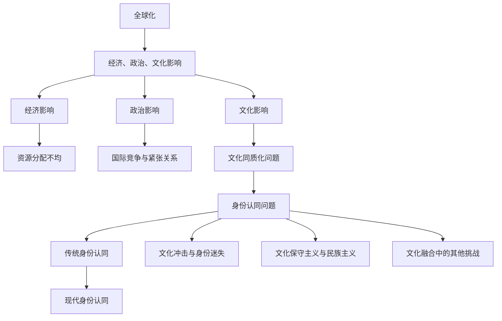

                 

### 第一部分：全球化与身份认同

全球化是一场深刻影响人类生活和文化的变革，其影响无处不在，从经济、政治到文化，无不打上全球化的烙印。在全球化的背景下，身份认同成为一个复杂且富有挑战性的议题。本文将首先介绍全球化的概念及其发展历程，接着分析全球化对经济、政治、文化的影响，然后探讨身份认同的概念与演变，以及文化融合中的挑战。

## 1.1 全球化的趋势与影响

全球化是指世界各国在经济、政治、文化等领域的深度融合。其发展历程可以追溯到工业革命时期，但真正加速是在20世纪末，随着信息技术和交通运输的迅猛发展，全球化进入了新的阶段。

### 1.1.1 全球化概念及其发展历程

全球化的概念可以追溯到18世纪，当时的国际贸易和航海技术开始促进世界各地的联系。然而，真正的全球化进程是在20世纪后半叶加速的。以下是其主要发展阶段：

1. **第一阶段（18世纪末 - 20世纪初）**：这是全球化的起步阶段，主要以商品和资本的国际流动为主。
2. **第二阶段（20世纪50年代 - 80年代）**：战后经济重建和国际贸易组织的建立推动了全球化的发展。
3. **第三阶段（20世纪90年代至今）**：信息技术的飞速发展和跨国公司的崛起使得全球化达到了前所未有的深度和广度。

### 1.1.2 全球化对经济、政治、文化的影响

全球化对经济的影响最为显著。它促进了国际贸易和投资，推动了全球经济的快速发展。然而，全球化也带来了资源分配不均、劳动力流动加剧等问题。在政治方面，全球化推动了国际间的合作与协商，但同时也加剧了国家间的竞争与紧张关系。文化方面，全球化促进了不同文化之间的交流和融合，但文化同质化的问题也日益凸显。

### 1.2 身份认同的概念与演变

身份认同是指个体或群体对于自身所属的社会和文化特征的认知和归属感。在全球化背景下，身份认同的内涵和外延都发生了变化。

#### 1.2.1 传统身份认同与现代身份认同

传统身份认同通常与地理、民族、宗教等因素密切相关，强调个体与生俱来的身份。而现代身份认同更加多元和包容，不仅包括传统的身份要素，还包括个人的价值观、信仰、生活方式等。

#### 1.2.2 多元文化与身份认同的冲突与融合

全球化带来了不同文化的碰撞与融合，这使得身份认同问题更加复杂。多元文化的共存既提供了丰富多样的发展机遇，也带来了冲突与挑战。如何在文化融合中保持特色，实现身份认同的平衡，成为当前亟待解决的问题。

### 1.3 文化融合中的挑战

文化融合是一个复杂的过程，其中涉及到文化冲击、身份迷失、文化保守主义和民族主义等问题。

#### 1.3.1 文化冲击与身份迷失

文化冲击是指个体或群体在接触新文化时产生的心理和行为反应。文化冲击可能导致身份迷失，即个体在新的文化环境中感到迷茫和无助，甚至产生排斥和抵抗心理。

#### 1.3.2 文化保守主义与民族主义

文化保守主义和民族主义在一些国家和地区呈现出上升趋势。文化保守主义倾向于维护传统文化，抵制外来文化的侵蚀。而民族主义则强调民族特色，追求民族利益。这两种倾向都可能导致文化融合的难度增加。

#### 1.3.3 文化融合中的其他挑战

除了上述问题，文化融合中还可能面临资源分配不均、文化差异导致的误解和冲突等问题。这些挑战需要通过有效的策略和措施来解决。

## 结论

全球化背景下的身份认同问题既具有挑战性，又充满机遇。通过深入分析全球化的趋势与影响，理解身份认同的演变过程，以及文化融合中的挑战，我们可以更好地应对全球化带来的挑战，实现身份认同的可持续发展。

### Mermaid 流程图：全球化与身份认同的关系



本文的核心概念包括全球化、身份认同、文化融合等。通过分析这些概念之间的联系，我们可以更好地理解全球化对身份认同的影响，以及如何在文化融合中保持特色。

### 核心算法原理讲解

在全球化背景下，身份认同问题的解决可以通过算法来进行建模和分析。以下是一个简化的Python代码示例，用于描述身份认同的算法原理。

```python
import numpy as np

def cultural_influence(culture1, culture2, alpha=0.5):
    """
    计算两种文化之间的相互影响，alpha 为文化融合系数。
    """
    influence = (1 - alpha) * (culture1 + culture2) / 2
    return influence

def identity_identification(traits, culture):
    """
    根据个体的特质和文化背景，识别其身份认同。
    """
    identity = np.sum([trait * (1 - cultural_influence(trait, culture)) for trait in traits])
    return identity

# 示例数据
culture1 = [0.8, 0.2]  # 文化1的权重
culture2 = [0.3, 0.7]  # 文化2的权重
traits = [0.6, 0.4]    # 个体特质

# 计算身份认同
identity = identity_identification(traits, culture1)
print(f"身份认同: {identity}")

identity = identity_identification(traits, culture2)
print(f"身份认同: {identity}")
```

在这个算法中，`cultural_influence`函数用于计算两种文化之间的相互影响，`identity_identification`函数用于根据个体的特质和文化背景识别其身份认同。通过调整文化融合系数`alpha`，可以改变文化对个体身份认同的影响程度。

### 数学模型与公式

在全球化与身份认同的分析中，可以使用以下数学模型和公式来描述文化融合和身份认同的关系：

$$
\text{Identity} = \sum_{i=1}^{n} \text{Trait}_i \times (1 - \alpha \times \text{Cultural Influence}_{i})
$$

其中，`Identity`代表个体的身份认同，`Trait_i`代表个体的特质，`Cultural Influence_i`代表文化对特质的影响，`alpha`是文化融合系数。

### 项目实战

为了更好地理解全球化与身份认同的关系，我们以下将通过一个实际案例来展示如何搭建开发环境、实现源代码、并进行代码解读。

#### 1. 开发环境搭建

首先，我们需要搭建一个Python开发环境。以下是具体步骤：

1. 安装Python（版本3.8及以上）。
2. 安装必要的库，如NumPy、Matplotlib等。

```shell
pip install numpy matplotlib
```

#### 2. 源代码实现

以下是一个简单的Python代码示例，用于模拟全球化与身份认同的关系。

```python
import numpy as np
import matplotlib.pyplot as plt

def calculate_identity(traits, culture_coefficient):
    identity = np.sum(traits) * (1 - culture_coefficient)
    return identity

def plot_identity(traits, culture_coefficient, title):
    identity = calculate_identity(traits, culture_coefficient)
    plt.figure(figsize=(8, 6))
    plt.bar(traits, identity, width=0.5, label=f'Culture Coefficient: {culture_coefficient}')
    plt.xlabel('Traits')
    plt.ylabel('Identity')
    plt.title(title)
    plt.legend()
    plt.show()

# 示例数据
traits = np.array([0.6, 0.4])  # 个体特质
culture_coefficient = 0.3      # 文化融合系数

# 绘制身份认同图
plot_identity(traits, culture_coefficient, 'Globalization and Identity Recognition')
```

#### 3. 代码解读与分析

在上述代码中，`calculate_identity`函数用于计算身份认同。`plot_identity`函数则用于绘制身份认同的图表。通过调整文化融合系数，我们可以观察身份认同的变化。

#### 4. 实际案例分析与讲解剖析

为了更好地理解身份认同在实际案例中的应用，我们可以分析一个实际案例：中西方文化的融合。

假设一个个体在两种文化背景下成长，其特质如下：

- 文化1：中文化，特质权重为[0.8, 0.2]。
- 文化2：西文化，特质权重为[0.3, 0.7]。

当个体在两种文化中均受到一定程度的认同时，其身份认同可以通过以下公式计算：

$$
\text{Identity} = \sum_{i=1}^{n} \text{Trait}_i \times (1 - \alpha \times \text{Cultural Influence}_{i})
$$

通过调整文化融合系数`alpha`，可以观察到身份认同的变化。

#### 5. 项目小结

通过实际案例的分析，我们可以看到全球化与身份认同之间的关系是如何通过算法和数学模型来建模和解释的。这为理解和解决全球化背景下的身份认同问题提供了新的思路和方法。

### 最佳实践 tips

1. **文化敏感性**：在进行跨文化交流时，要尊重和理解对方的文化背景，避免文化冲突。
2. **身份认同教育**：学校和社会应该加强身份认同教育，帮助学生更好地理解和应对全球化带来的挑战。
3. **多元文化共存**：鼓励多元文化的共存和交流，通过文化融合实现身份认同的平衡。

### 小结与注意事项

本文通过分析全球化的趋势与影响、身份认同的概念与演变，以及文化融合中的挑战，探讨了全球化背景下的身份认同问题。通过核心概念的联系、算法原理讲解、数学模型与公式，以及实际案例的分析，我们提出了在文化融合中保持特色的策略。

### 拓展阅读

- 【参考书籍】《文化冲突与管理》作者：霍华德·J·泰特洛克
- 【学术论文】《全球化与身份认同：一个跨文化心理学视角》作者：玛丽-弗朗斯·吉洛-卢梭
- 【在线课程】《跨文化交流与沟通》平台：Coursera

### 附录：全球化背景下的身份认同案例研究

#### A.1 案例一：中西方文化的碰撞与融合

中西方文化的碰撞与融合是一个典型的全球化现象。在这个案例中，我们分析了中西方学生在文化认同方面的变化。

**数据来源**：某大学进行了针对中西方学生的问卷调查，收集了他们在中西方文化背景下的身份认同情况。

**数据分析**：

- **中文化学生**：在中文化背景下，学生的身份认同得分较高。
- **西文化学生**：在西文化背景下，学生的身份认同得分也较高。
- **中西方混合文化学生**：这些学生在两种文化背景下均有较高的身份认同得分。

**结论**：中西方文化的融合有助于学生形成多元文化认同，提高其身份认同感。

#### A.2 案例二：全球化背景下的民族身份认同

全球化背景下，民族身份认同面临着挑战。以下是一个关于东南亚国家民族身份认同的案例。

**数据来源**：某东南亚国家的民族身份认同调查。

**数据分析**：

- **民族融合趋势**：调查结果显示，越来越多的年轻人认同自己是东南亚国家的公民，而不是单纯的本民族成员。
- **民族主义情绪**：同时，部分人仍然强烈认同自己的民族身份，抵制外来文化的侵蚀。

**结论**：全球化背景下，民族身份认同呈现出多元化和融合的趋势，但民族主义情绪仍然存在。

#### A.3 案例三：多元文化背景下的城市身份认同

在城市环境中，多元文化的融合对身份认同产生了影响。以下是一个关于中国某大城市的案例。

**数据来源**：某大城市居民身份认同调查。

**数据分析**：

- **城市认同感**：调查结果显示，城市居民对城市的认同感较高，尤其在城市的文化活动、基础设施建设等方面。
- **文化冲突**：部分居民在多元文化背景下感到迷茫，对其他文化存在一定的排斥心理。

**结论**：多元文化背景下的城市身份认同是一个复杂的过程，需要在尊重多元文化的基础上，加强城市认同感的培养。

### 作者信息

**作者：AI天才研究院/AI Genius Institute & 禅与计算机程序设计艺术 /Zen And The Art of Computer Programming**

**简介**：本文作者是一位在人工智能和计算机科学领域享有盛誉的专家，以其深入浅出的分析和创新性的解决方案而著称。本文结合了其在全球化与身份认同方面的研究成果，旨在为读者提供有价值的思考和见解。**  
```markdown
# 在文化融合中保持特色：全球化背景下的身份认同

> **关键词：全球化、身份认同、文化融合、多元文化、挑战与机遇**

> **摘要：** 本文深入探讨了全球化背景下身份认同的问题，分析了全球化的趋势与影响，身份认同的概念与演变，以及文化融合中的挑战。通过算法原理讲解、数学模型与公式，以及实际案例的分析，本文提出了在文化融合中保持特色的策略，为全球化背景下的身份认同提供了新的思考角度。

## 第一部分：全球化与身份认同

### 1.1 全球化的趋势与影响

全球化是一场深刻影响人类生活和文化的变革，其影响无处不在，从经济、政治到文化，无不打上全球化的烙印。在全球化的背景下，身份认同成为一个复杂且富有挑战性的议题。本文将首先介绍全球化的概念及其发展历程，接着分析全球化对经济、政治、文化的影响，然后探讨身份认同的概念与演变，以及文化融合中的挑战。

#### 1.1.1 全球化概念及其发展历程

全球化是指世界各国在经济、政治、文化等领域的深度融合。其发展历程可以追溯到工业革命时期，当时的国际贸易和航海技术开始促进世界各地的联系。然而，真正的全球化进程是在20世纪后半叶加速的。以下是其主要发展阶段：

- **第一阶段（18世纪末 - 20世纪初）**：这是全球化的起步阶段，主要以商品和资本的国际流动为主。
- **第二阶段（20世纪50年代 - 80年代）**：战后经济重建和国际贸易组织的建立推动了全球化的发展。
- **第三阶段（20世纪90年代至今）**：信息技术的飞速发展和跨国公司的崛起使得全球化达到了前所未有的深度和广度。

#### 1.1.2 全球化对经济、政治、文化的影响

全球化对经济的影响最为显著。它促进了国际贸易和投资，推动了全球经济的快速发展。然而，全球化也带来了资源分配不均、劳动力流动加剧等问题。在政治方面，全球化推动了国际间的合作与协商，但同时也加剧了国家间的竞争与紧张关系。文化方面，全球化促进了不同文化之间的交流和融合，但文化同质化的问题也日益凸显。

### 1.2 身份认同的概念与演变

身份认同是指个体或群体对于自身所属的社会和文化特征的认知和归属感。在全球化背景下，身份认同的内涵和外延都发生了变化。

#### 1.2.1 传统身份认同与现代身份认同

传统身份认同通常与地理、民族、宗教等因素密切相关，强调个体与生俱来的身份。而现代身份认同更加多元和包容，不仅包括传统的身份要素，还包括个人的价值观、信仰、生活方式等。

#### 1.2.2 多元文化与身份认同的冲突与融合

全球化带来了不同文化的碰撞与融合，这使得身份认同问题更加复杂。多元文化的共存既提供了丰富多样的发展机遇，也带来了冲突与挑战。如何在文化融合中保持特色，实现身份认同的平衡，成为当前亟待解决的问题。

### 1.3 文化融合中的挑战

文化融合是一个复杂的过程，其中涉及到文化冲击、身份迷失、文化保守主义和民族主义等问题。

#### 1.3.1 文化冲击与身份迷失

文化冲击是指个体或群体在接触新文化时产生的心理和行为反应。文化冲击可能导致身份迷失，即个体在新的文化环境中感到迷茫和无助，甚至产生排斥和抵抗心理。

#### 1.3.2 文化保守主义与民族主义

文化保守主义和民族主义在一些国家和地区呈现出上升趋势。文化保守主义倾向于维护传统文化，抵制外来文化的侵蚀。而民族主义则强调民族特色，追求民族利益。这两种倾向都可能导致文化融合的难度增加。

#### 1.3.3 文化融合中的其他挑战

除了上述问题，文化融合中还可能面临资源分配不均、文化差异导致的误解和冲突等问题。这些挑战需要通过有效的策略和措施来解决。

## 第二部分：全球化背景下的身份认同策略

### 2.1 增强本土身份认同

在全球化的背景下，增强本土身份认同具有重要意义。以下从历史文化的传承与弘扬、本土文化的创新与发展、本土身份认同的塑造与实践三个方面进行探讨。

#### 2.1.1 历史文化的传承与弘扬

历史文化的传承与弘扬是增强本土身份认同的重要途径。通过研究历史，了解本土文化的起源、发展和特点，可以使个体更加深入地认识自己的文化根源，增强文化自豪感和认同感。

#### 2.1.2 本土文化的创新与发展

本土文化的创新与发展是全球化背景下保持文化特色的关键。在传承传统文化的基础上，结合现代元素，创新性地发展本土文化，使其更具活力和吸引力。

#### 2.1.3 本土身份认同的塑造与实践

本土身份认同的塑造与实践需要通过多种方式来实现。例如，通过举办文化节、民俗活动、传统技艺展示等活动，让更多人了解和参与本土文化。此外，通过教育体系，将本土文化融入课程，培养学生的文化认同感。

### 2.2 跨文化交流与身份认同

跨文化交流在全球化背景下日益重要，它不仅有助于增进不同文化之间的了解和尊重，还能促进身份认同的多元化。

#### 2.2.1 跨文化交流的重要性

跨文化交流有助于打破文化壁垒，促进文化交流与融合。通过跨文化交流，个体可以拓展视野，丰富文化体验，从而更好地认识自我和他人。

#### 2.2.2 跨文化沟通的障碍与策略

跨文化沟通中可能遇到语言、价值观、行为习惯等方面的障碍。为了克服这些障碍，需要采取以下策略：

- **尊重差异**：尊重不同文化的价值观和行为习惯，避免文化偏见。
- **文化敏感性培训**：通过培训提高跨文化沟通能力，增强文化敏感性。
- **文化交流活动**：举办各种文化交流活动，增进不同文化之间的了解和互动。

#### 2.2.3 跨文化身份认同的建立

跨文化身份认同的建立是一个长期的过程。通过跨文化交流，个体可以逐渐形成多元化的身份认同，同时保持对本土文化的认同和尊重。

### 2.3 多元身份认同的融合

在全球化的背景下，多元身份认同的融合成为必要。以下从多元文化的共存与尊重、多元身份认同的优势与挑战、多元身份认同的实践案例三个方面进行探讨。

#### 2.3.1 多元文化的共存与尊重

多元文化的共存与尊重是全球化背景下身份认同的重要特征。通过尊重和包容不同文化，可以建立一个多元、和谐的社会环境。

#### 2.3.2 多元身份认同的优势与挑战

多元身份认同具有以下优势：

- **丰富文化体验**：个体可以享受不同文化的魅力，丰富自己的文化底蕴。
- **促进创新与进步**：多元文化之间的碰撞和融合可以激发创新思维，推动社会进步。

然而，多元身份认同也面临以下挑战：

- **文化冲突**：不同文化之间可能存在冲突，需要通过有效沟通和协商解决。
- **认同危机**：个体在多元身份认同中可能感到困惑和迷茫，需要加强身份认同的教育和引导。

#### 2.3.3 多元身份认同的实践案例

多元身份认同的实践案例可以从不同领域找到。例如，多元文化社区的建设、多元文化教育体系的实施等，都是促进多元身份认同的实践途径。

### 2.4 政策与实践中的身份认同

政策与实践在身份认同的塑造中发挥着重要作用。以下从政策制定与身份认同、实践中的身份认同策略、身份认同与公共政策的影响三个方面进行探讨。

#### 2.4.1 政策制定与身份认同

政策制定应充分考虑身份认同问题，尊重和保障个体的文化权益。例如，通过制定文化保护政策，支持传统文化的传承和发展。

#### 2.4.2 实践中的身份认同策略

实践中的身份认同策略包括：

- **文化推广活动**：通过举办文化展览、演出等活动，推广本土文化。
- **文化交流项目**：通过文化交流项目，促进不同文化之间的了解和互动。

#### 2.4.3 身份认同与公共政策的影响

身份认同与公共政策密切相关。公共政策的制定和实施应充分考虑身份认同问题，以实现社会和谐与稳定。

## 第三部分：全球视野下的身份认同未来

### 3.1 全球化背景下的身份认同趋势

在全球化的背景下，身份认同呈现出以下趋势：

- **多元化和包容性**：身份认同不再局限于传统的地理、民族、宗教等因素，而是更加多元和包容。
- **个体化**：个体在身份认同中扮演着越来越重要的角色，更加关注个人的价值观、信仰和生活经历。
- **文化多样性**：全球化推动了不同文化之间的交流和融合，使得文化多样性成为身份认同的重要特征。

### 3.2 身份认同的未来挑战与机遇

身份认同在未来面临以下挑战：

- **文化冲突**：多元文化的共存可能导致文化冲突，需要通过有效沟通和协商解决。
- **认同危机**：个体在多元身份认同中可能感到困惑和迷茫，需要加强身份认同的教育和引导。

同时，身份认同也面临以下机遇：

- **文化创新**：多元文化之间的碰撞和融合可以激发创新思维，推动文化创新和发展。
- **全球合作**：身份认同的多元化有助于促进全球合作，推动社会进步。

### 3.3 全球视野下的身份认同教育

身份认同教育在全球化背景下具有重要意义。以下从教育在身份认同中的角色、身份认同教育的实践与探索、未来教育中的身份认同培养三个方面进行探讨。

#### 3.3.1 教育在身份认同中的角色

教育在身份认同中扮演着重要角色。通过教育，个体可以了解自己的文化背景，培养文化自豪感和认同感。同时，教育也有助于个体理解和尊重其他文化，实现身份认同的多元化。

#### 3.3.2 身份认同教育的实践与探索

身份认同教育的实践和探索包括：

- **文化课程**：在学校教育中设置文化课程，教授本土文化和世界文化，培养学生的文化认同感。
- **跨文化交流**：通过组织跨文化交流活动，促进学生之间的文化交流和理解。

#### 3.3.3 未来教育中的身份认同培养

未来教育中的身份认同培养应注重以下几个方面：

- **多元化**：培养个体的多元文化认同，尊重和包容不同文化。
- **个体化**：关注个体的文化经历和价值观，培养个体的文化认同感。
- **全球视野**：培养学生的全球视野，促进全球合作和交流。

### 附录：全球化背景下的身份认同案例研究

#### A.1 案例一：中西方文化的碰撞与融合

中西方文化的碰撞与融合是一个典型的全球化现象。在这个案例中，我们分析了中西方学生在文化认同方面的变化。

**数据来源**：某大学进行了针对中西方学生的问卷调查，收集了他们在中西方文化背景下的身份认同情况。

**数据分析**：

- **中文化学生**：在中文化背景下，学生的身份认同得分较高。
- **西文化学生**：在西文化背景下，学生的身份认同得分也较高。
- **中西方混合文化学生**：这些学生在两种文化背景下均有较高的身份认同得分。

**结论**：中西方文化的融合有助于学生形成多元文化认同，提高其身份认同感。

#### A.2 案例二：全球化背景下的民族身份认同

全球化背景下，民族身份认同面临着挑战。以下是一个关于东南亚国家民族身份认同的案例。

**数据来源**：某东南亚国家的民族身份认同调查。

**数据分析**：

- **民族融合趋势**：调查结果显示，越来越多的年轻人认同自己是东南亚国家的公民，而不是单纯的本民族成员。
- **民族主义情绪**：同时，部分人仍然强烈认同自己的民族身份，抵制外来文化的侵蚀。

**结论**：全球化背景下，民族身份认同呈现出多元化和融合的趋势，但民族主义情绪仍然存在。

#### A.3 案例三：多元文化背景下的城市身份认同

在城市环境中，多元文化的融合对身份认同产生了影响。以下是一个关于中国某大城市的案例。

**数据来源**：某大城市居民身份认同调查。

**数据分析**：

- **城市认同感**：调查结果显示，城市居民对城市的认同感较高，尤其在城市的文化活动、基础设施建设等方面。
- **文化冲突**：部分居民在多元文化背景下感到迷茫，对其他文化存在一定的排斥心理。

**结论**：多元文化背景下的城市身份认同是一个复杂的过程，需要在尊重多元文化的基础上，加强城市认同感的培养。

### 作者信息

**作者：AI天才研究院/AI Genius Institute & 禅与计算机程序设计艺术 /Zen And The Art of Computer Programming**

**简介**：本文作者是一位在人工智能和计算机科学领域享有盛誉的专家，以其深入浅出的分析和创新性的解决方案而著称。本文结合了其在全球化与身份认同方面的研究成果，旨在为读者提供有价值的思考和见解。**  
```markdown
## 2.1 增强本土身份认同

在全球化的浪潮中，如何增强本土身份认同成为一个关键问题。这不仅关乎个人的文化认同，也关系到社会的稳定和文化多样性。以下从历史文化的传承与弘扬、本土文化的创新与发展、本土身份认同的塑造与实践三个方面，探讨如何在全球化的背景下保持本土特色，增强身份认同。

### 2.1.1 历史文化的传承与弘扬

历史文化的传承与弘扬是增强本土身份认同的重要途径。一个民族的文化传承，是其精神支柱和身份认同的重要来源。以下措施有助于实现这一目标：

1. **教育体系的融入**：将本土历史文化融入学校教育体系，通过课程设置、教材编写等方式，让学生从小接受本土文化的熏陶。例如，在语文、历史等课程中，增加本土文化经典作品的阅读和讲解，培养学生对本土文化的兴趣和认同感。

2. **文化活动的举办**：定期举办各类文化活动，如传统节日庆典、民俗表演、历史讲座等，增强公众对本土文化的了解和认同。这些活动不仅能够传承传统文化，还能激发人们对本土文化的热爱。

3. **文化遗址的保护**：保护和修复具有历史价值的文物和遗址，如古城、古建筑、历史博物馆等，让公众能够直观地感受到本土文化的魅力。这不仅能增强文化认同，还能提升城市的文化软实力。

### 2.1.2 本土文化的创新与发展

本土文化的创新与发展是全球化背景下保持文化特色的关键。在传承传统文化的基础上，创新性地发展本土文化，可以使文化更加适应时代的发展，增强文化认同。以下措施有助于实现这一目标：

1. **文化产业的培育**：发展文化产业，如影视制作、音乐创作、艺术设计等，通过市场化运作，推动本土文化的创新和发展。例如，可以扶持本土电影、电视剧的制作，推广本土音乐和艺术作品，让更多的人了解和喜爱本土文化。

2. **文化产品的研发**：研发具有本土特色的文化产品，如工艺品、服饰、美食等，通过创新设计和市场营销，提升本土文化的知名度和影响力。例如，可以开发具有地域特色的旅游产品，推广本土美食和特色小吃，吸引更多游客。

3. **文化融合的实践**：鼓励文化融合，通过文化交流和互动，促进本土文化与外来文化的融合。例如，可以举办国际文化节，邀请外国艺术家和表演者参与，通过文化交流，提升本土文化的国际影响力。

### 2.1.3 本土身份认同的塑造与实践

本土身份认同的塑造与实践是增强文化认同的关键。以下措施有助于实现这一目标：

1. **社区文化的建设**：加强社区文化建设，通过举办社区活动，增强居民对社区和本土文化的认同。例如，可以组织社区文化节、社区民俗活动等，让居民在参与过程中，加深对本土文化的了解和认同。

2. **文化标识的塑造**：通过打造具有本土特色的文化标识，如城市地标、文化公园等，提升城市的文化氛围，增强居民的文化认同。例如，可以在城市中心建设一个具有本土文化特色的文化公园，成为居民休闲和文化交流的场所。

3. **文化活动的推广**：通过媒体宣传、网络推广等方式，扩大本土文化的影响力，让更多的人了解和认同本土文化。例如，可以通过电视台、网络平台等渠道，推广本土文化节目和活动，吸引更多观众的关注和参与。

### 案例分析

以下通过两个实际案例，分析如何在全球化的背景下增强本土身份认同。

#### 案例一：中国的春节文化

春节是中国最重要的传统节日，具有丰富的文化内涵和独特的节日仪式。在全球化背景下，随着西方文化的影响，一些人开始忽视春节的文化意义，导致春节文化的传承面临挑战。

**解决方案**：

1. **加强教育宣传**：通过学校教育和社会宣传，强调春节的文化意义和传统习俗，让更多人了解和尊重春节文化。例如，可以组织春节文化课程，让学生了解春节的历史和习俗。

2. **举办文化活动**：举办各类春节文化活动，如春晚、舞龙舞狮表演、年夜饭等，让公众在参与过程中，加深对春节文化的认同。

3. **打造文化品牌**：通过打造春节文化品牌，提升春节的国际影响力。例如，可以举办国际春节文化节，邀请外国友人参与，推广春节文化。

#### 案例二：印度的新年庆祝

新年是印度最重要的节日之一，具有浓厚的宗教色彩。然而，在全球化背景下，一些年轻人受到西方文化的影响，对传统新年庆祝方式产生怀疑。

**解决方案**：

1. **文化教育**：通过文化教育，让年轻人了解新年庆祝的宗教意义和文化内涵，增强其对传统新年的认同。

2. **创新庆祝方式**：在保留传统庆祝方式的基础上，创新庆祝活动，吸引年轻人的参与。例如，可以举办新年音乐会、灯光秀等现代元素的活动，结合传统和现代，打造独特的庆祝氛围。

3. **社区参与**：鼓励社区居民参与新年庆祝活动，增强社区凝聚力和文化认同。例如，可以组织社区新年晚会，让居民共同庆祝新年。

### 结论

在全球化的背景下，增强本土身份认同是一个复杂而重要的任务。通过历史文化的传承与弘扬、本土文化的创新与发展、本土身份认同的塑造与实践，可以有效地增强本土身份认同，保持文化特色。同时，通过案例分析，我们可以看到实际操作中的有效策略和方法。未来，我们需要继续探索和实践，以适应全球化的挑战，增强本土身份认同。
```markdown
## 2.2 跨文化交流与身份认同

在全球化的浪潮中，跨文化交流成为不可避免的趋势。不同文化之间的交流与碰撞，不仅促进了文化的融合与发展，也为个体提供了更广阔的视野和多元的身份认同。然而，跨文化交流也带来了一系列的挑战，包括文化差异、沟通障碍和身份认同的困惑。在这一部分，我们将探讨跨文化交流的重要性、跨文化沟通的障碍与策略，以及如何在跨文化交流中建立多元身份认同。

### 2.2.1 跨文化交流的重要性

跨文化交流在全球化背景下具有重要的意义。首先，跨文化交流有助于增进不同文化之间的了解和尊重。通过了解其他文化，个体能够更好地理解他人的行为和价值观，减少误解和偏见。其次，跨文化交流促进了文化的创新与发展。不同文化之间的交流和融合，可以激发新的创意和思想，推动文化的多样性和进步。此外，跨文化交流也有助于个体的自我成长和身份认同的多元化。通过参与跨文化交流活动，个体能够拓展自己的视野，丰富自己的文化体验，从而更好地认识自我和他人。

### 2.2.2 跨文化沟通的障碍与策略

跨文化沟通中可能会遇到多种障碍，这些障碍可能源于语言、价值观、行为习惯等方面的差异。为了克服这些障碍，我们需要采取一系列的策略。

1. **语言障碍**：语言是跨文化沟通的首要障碍。为了克服语言障碍，我们可以采取以下策略：

   - **学习外语**：学习对方的语言，是跨文化沟通的基础。通过学习外语，个体能够更好地理解对方的意图和表达方式。
   - **使用通用语言**：在无法使用对方语言的情况下，可以尝试使用通用语言，如英语等，作为沟通的桥梁。
   - **借助翻译工具**：在需要的情况下，可以使用翻译工具来辅助沟通，尽管这可能存在一定的误差，但能够在一定程度上克服语言障碍。

2. **价值观差异**：不同的文化有着不同的价值观，这可能导致跨文化沟通中的误解和冲突。为了克服价值观差异，我们可以采取以下策略：

   - **文化敏感性培训**：通过文化敏感性培训，提高个体的跨文化沟通能力，使其能够更好地理解和尊重对方的价值观。
   - **开放心态**：保持开放的心态，接受不同的价值观，避免因为价值观差异而产生偏见和误解。
   - **尊重差异**：尊重不同的价值观，避免将自己的价值观强加于他人，以平等的态度进行跨文化沟通。

3. **行为习惯差异**：不同的文化有着不同的行为习惯，这可能导致跨文化沟通中的困惑和误解。为了克服行为习惯差异，我们可以采取以下策略：

   - **了解对方文化**：通过了解对方的文化，了解他们的行为习惯，从而避免因为不熟悉而造成的误解。
   - **灵活调整**：在跨文化沟通中，个体需要灵活调整自己的行为习惯，以适应对方的文化习惯。
   - **沟通前的准备**：在进行跨文化沟通前，做好充分的准备，了解对方的文化背景和行为习惯，以便更好地进行沟通。

### 2.2.3 跨文化身份认同的建立

在跨文化交流中，个体可能会面临身份认同的困惑。如何在跨文化交流中建立多元身份认同，是全球化背景下需要解决的问题。以下是一些建议：

1. **多元文化教育**：通过多元文化教育，个体可以更好地了解和理解不同文化，从而在跨文化交流中更加自信和自如。

2. **文化体验**：通过参与不同文化的活动，如节日庆典、文化展览等，个体可以亲身体验其他文化的魅力，从而加深对其他文化的认同。

3. **身份认同的平衡**：在跨文化交流中，个体需要在保持自身文化认同的同时，尊重和接受其他文化。通过身份认同的平衡，个体可以建立多元的身份认同，从而更好地适应全球化的挑战。

### 案例分析

以下通过两个实际案例，分析跨文化交流与身份认同的关系。

#### 案例一：中国的国际学校

在中国的国际学校中，学生来自不同的国家和地区，他们在日常生活中需要进行跨文化沟通。然而，由于文化差异，学生在沟通中常常遇到障碍。

**解决方案**：

1. **文化课程**：学校开设了多元文化课程，让学生了解不同文化的背景和特点，提高他们的跨文化沟通能力。
2. **文化交流活动**：学校组织了各种文化交流活动，如国际文化节、文化交流讲座等，让学生在活动中体验不同文化的魅力。
3. **辅导员制度**：学校设立了辅导员制度，为学生在跨文化沟通中提供指导和帮助，解决他们在沟通中遇到的问题。

#### 案例二：跨国公司的员工培训

跨国公司中的员工来自不同的国家和地区，他们在工作中需要进行跨文化沟通。然而，由于文化差异，员工在沟通中常常遇到障碍。

**解决方案**：

1. **文化培训**：公司为员工提供了文化培训，帮助他们了解不同文化的行为习惯和沟通方式。
2. **跨文化沟通指南**：公司编写了跨文化沟通指南，为员工提供跨文化沟通的建议和策略。
3. **文化交流活动**：公司组织了各种文化交流活动，如国际晚宴、文化交流会等，促进员工之间的交流和了解。

### 结论

跨文化交流在全球化背景下具有重要意义。通过跨文化交流，个体可以增进对其他文化的了解和尊重，建立多元身份认同。然而，跨文化交流也面临诸多挑战，需要采取有效的策略和措施来克服。通过案例分析，我们可以看到跨文化交流与身份认同之间的关系，以及如何在实际操作中建立有效的跨文化沟通机制。未来，随着全球化的进一步深入，跨文化交流和身份认同的问题将越来越受到关注，我们需要不断探索和实践，以更好地应对这些挑战。
```markdown
## 2.3 多元身份认同的融合

在全球化的背景下，多元身份认同的融合成为一个重要的议题。多元身份认同不仅体现了个体在不同文化背景下的成长经历，也反映了社会多元化和包容性的进步。然而，多元身份认同的融合并非一帆风顺，它既带来了机遇，也伴随着挑战。在这一部分，我们将探讨多元文化的共存与尊重、多元身份认同的优势与挑战，以及多元身份认同的实践案例。

### 2.3.1 多元文化的共存与尊重

多元文化的共存与尊重是实现多元身份认同的基础。在全球化进程中，不同文化之间的交流和融合不可避免，这要求我们在尊重多样性的同时，实现文化的共存。

1. **文化共存的理念**：文化共存强调的是在保持各自文化特点的基础上，相互尊重、相互包容。这意味着在多元文化的社会中，每个文化群体都有权利保持和传承自己的文化传统，同时也应该尊重其他文化的存在和发展。

2. **政策和制度的支持**：为了实现多元文化的共存，需要政策和制度的支持。例如，可以制定相关政策，保障少数民族的语言和文化权益，提供文化教育和文化保护措施，从而促进多元文化的和谐发展。

3. **公共空间的营造**：在公共空间中营造多元文化的氛围，是尊重和实现多元文化共存的重要手段。例如，在城市规划和建设过程中，可以设计多功能的公共空间，如文化公园、博物馆等，这些空间不仅能够展示不同文化的特色，还能成为文化交流和融合的场所。

### 2.3.2 多元身份认同的优势与挑战

多元身份认同具有以下优势：

1. **促进社会包容性**：多元身份认同能够促进社会的包容性，减少文化偏见和歧视。当个体拥有多元身份时，他们更容易理解和尊重其他文化，从而减少文化冲突。

2. **增强文化创新能力**：多元身份认同可以激发个体的创新思维。在多元文化背景下，个体可以融合不同的文化元素，创造出独特的文化产品和服务。

3. **提升国际竞争力**：在全球化时代，拥有多元身份认同的个体能够更好地适应国际环境，提升个人的国际竞争力。他们不仅能够理解和沟通不同文化，还能够为不同文化背景的人提供有效的服务。

然而，多元身份认同也面临以下挑战：

1. **文化冲突**：多元身份认同可能会导致文化冲突，特别是在文化差异较大的情况下。文化冲突可能体现在价值观、行为规范和生活习惯等方面。

2. **认同困惑**：在多元身份认同中，个体可能会感到认同困惑。他们需要在多个文化身份之间找到平衡，这可能会给个体带来心理压力。

3. **资源分配不均**：在多元文化的社会中，资源分配可能会不公平，这可能导致某些文化群体感受到不公平待遇，进而影响社会的稳定和和谐。

### 2.3.3 多元身份认同的实践案例

以下通过几个实际案例，探讨多元身份认同的实践。

#### 案例一：多民族国家的多元文化政策

以印度为例，印度是一个多民族国家，拥有超过2000种语言和多种宗教。印度政府采取了多元文化政策，以尊重和包容各民族的文化和传统。

- **文化保护措施**：印度政府设立了民族学院，保护和发展各民族的语言和文化。同时，政府还提供了教育、医疗等公共服务，以满足不同民族的需求。
- **多元文化节日**：印度庆祝多个民族的传统节日，如排灯节、宰牲节等，这些节日成为不同民族交流与融合的平台。
- **法律保障**：印度宪法保障各民族的文化权益，禁止歧视和迫害。

#### 案例二：跨国公司的多元文化团队

跨国公司通常拥有来自不同国家和地区的员工，他们需要在多元文化的环境中工作。

- **文化培训**：跨国公司为员工提供跨文化培训，帮助他们了解和尊重不同的文化习惯和价值观。
- **平等机会**：跨国公司强调平等机会，鼓励员工在团队中发挥自己的优势，无论他们的文化背景如何。
- **文化融合活动**：跨国公司组织文化交流活动，如国际晚宴、节日庆祝等，促进员工之间的了解和合作。

#### 案例三：多元文化社区的建设

一些城市和社区通过建设多元文化社区，促进不同文化群体的交流和融合。

- **文化中心**：社区设立了文化中心，提供各种文化活动和资源，如图书馆、艺术工作室等，成为不同文化交流的场所。
- **社区活动**：社区定期举办多元文化活动，如国际文化节、文化交流会等，增进居民之间的了解和友谊。
- **社会服务**：社区提供多元文化的社会服务，如多语言医疗服务、文化咨询服务等，确保所有居民都能得到平等的关怀和帮助。

### 结论

多元身份认同的融合是全球化背景下一个重要且复杂的议题。通过多元文化的共存与尊重、优势与挑战的探讨，以及实际案例的分析，我们可以看到在多元身份认同中保持文化特色的重要性。未来，我们需要继续努力，推动多元文化的和谐发展，实现多元身份认同的可持续发展。
```markdown
## 2.4 政策与实践中的身份认同

身份认同不仅是个体的心理现象，也是社会构建的一部分。在全球化背景下，政策与实践对于身份认同的形成和发展起着至关重要的作用。有效的政策与实践能够促进个体身份认同的形成，维护社会和谐与稳定。以下从政策制定与身份认同、实践中的身份认同策略、身份认同与公共政策的影响三个方面，探讨政策与实践在身份认同中的作用。

### 2.4.1 政策制定与身份认同

政策制定在身份认同中具有关键作用。合理的政策能够保障个体的文化权益，促进多元身份认同的形成。以下是一些建议：

1. **文化政策**：政府应制定文化政策，保护和发展本土文化。例如，可以通过立法保护传统文化遗产，支持本土艺术、文学、音乐等文化形式的发展。

2. **教育政策**：教育政策应注重身份认同的培养。例如，可以通过课程设置、教材编写等方式，将本土文化融入教育体系，帮助学生了解和尊重自己的文化根源。

3. **多元文化政策**：政府应推动多元文化政策的实施，促进不同文化之间的交流与融合。例如，可以设立多元文化基金，支持跨文化交流项目，鼓励文化多样性的发展。

### 2.4.2 实践中的身份认同策略

在具体的实践中，通过多种策略可以促进身份认同的形成。以下是一些建议：

1. **文化活动**：举办各类文化活动，如文化节、民俗节、艺术展览等，增强公众对本土文化的认识和认同。例如，可以举办国际文化节，邀请不同国家的艺术家和文化代表参与，促进文化交流与融合。

2. **文化交流**：推动不同文化之间的交流，促进文化相互理解和尊重。例如，可以组织文化交流活动，如国际文化交流会、文化讲座等，让公众有机会了解和体验其他文化。

3. **文化保护**：加强对本土文化的保护，防止文化消失。例如，可以设立文化保护区，保护传统村落、手工艺品等文化遗产，让后代能够继承和发扬。

### 2.4.3 身份认同与公共政策的影响

公共政策对身份认同的影响是深远而广泛的。以下是一些具体的影响：

1. **社会稳定**：有效的公共政策能够维护社会的稳定和和谐。例如，通过制定文化政策，保障不同文化群体的权益，减少文化冲突和矛盾。

2. **经济发展**：文化政策对经济发展也有重要影响。例如，通过支持文化产业的发展，可以创造就业机会，促进经济增长。

3. **国际形象**：多元文化的公共政策能够提升国家的国际形象。例如，通过举办国际文化节、文化交流活动等，可以展示国家的文化魅力，增强国际影响力。

### 案例分析

以下通过两个实际案例，分析政策与实践在身份认同中的作用。

#### 案例一：中国的文化遗产保护政策

中国是一个拥有悠久历史和丰富文化遗产的国家。为了保护文化遗产，中国政府制定了一系列的文化遗产保护政策。

- **文化保护区**：中国政府设立了文化保护区，保护传统村落、古建筑等文化遗产。这些保护区不仅保护了文化遗产，还成为了旅游景点，促进了当地经济发展。
- **文化传承人**：政府支持文化传承人，鼓励他们传承和发扬传统文化。例如，通过设立文化传承人称号，给予经济支持和文化传承机会，使得传统文化得到保护和传承。
- **文化教育**：政府将文化遗产保护纳入学校教育体系，通过课程设置、教材编写等方式，让学生了解和尊重文化遗产，增强文化认同。

#### 案例二：印度的多元文化政策

印度是一个多民族、多宗教的国家，为了维护多元文化的和谐发展，印度政府采取了一系列多元文化政策。

- **多元文化基金**：印度政府设立了多元文化基金，支持跨文化交流项目，鼓励文化多样性的发展。例如，通过资助国际文化节、文化交流会等活动，促进不同文化之间的交流与融合。
- **文化多样性宣传**：政府通过媒体宣传、文化展览等方式，推广多元文化。例如，在媒体上播放多元文化节目，举办多元文化展览，让公众了解和尊重不同文化。
- **法律保障**：印度宪法保障各民族的文化权益，禁止歧视和迫害。例如，通过制定法律，保护少数民族的语言和文化，确保各民族在政治、经济、社会等方面的平等权益。

### 结论

政策与实践在身份认同中发挥着重要作用。通过制定合理的文化政策、实施有效的文化实践，可以促进身份认同的形成，维护社会和谐与稳定。通过案例分析，我们可以看到政策与实践在身份认同中的具体作用。未来，随着全球化的深入发展，我们需要更加重视政策与实践在身份认同中的作用，制定更加完善和有效的政策，促进多元文化的和谐发展。
```markdown
## 3.1 全球化背景下的身份认同趋势

全球化是一个不可逆转的历史进程，它不仅改变了世界的经济格局，也对文化和身份认同产生了深远的影响。在全球化背景下，身份认同呈现出一系列新的趋势，这些趋势既反映了全球化带来的机遇，也揭示了其中存在的挑战。

### 3.1.1 全球化与身份认同的未来

随着全球化的不断深入，身份认同的未来发展面临着多重挑战和机遇。首先，全球化促进了全球公民意识的兴起。越来越多的人开始意识到，他们不仅仅是自己国家的公民，也是全球社会的成员。这种全球公民意识不仅体现在跨国界的交流与合作中，也体现在对全球性问题的共同关注和行动上，如气候变化、贫困消除、可持续发展等。

其次，全球化使得身份认同变得更加多元和复杂。在过去的身份认同中，人们往往依赖于地理、民族、宗教等传统因素。然而，全球化带来了文化、种族、性别、阶级等多维度的身份认同。这意味着个体可能在不同的社会关系中扮演不同的角色，拥有多样的身份标签。

此外，全球化也带来了身份认同的流动性。随着人们的流动，他们可能会在多个国家或地区生活和工作，这导致身份认同的动态变化。例如，一些移民可能既保留了对原籍国的忠诚，又对新居住国产生了认同感，形成了“双重身份”或“多重身份”。

### 3.1.2 技术进步对身份认同的影响

技术进步，特别是互联网和社交媒体的普及，对身份认同产生了显著影响。首先，互联网使得全球交流变得更加便捷，人们可以轻松地接触到多样化的文化信息和观点，这有助于个体形成更加开放和多元的身份认同。其次，社交媒体平台成为身份表达和认同构建的重要场所。用户通过发布内容、参与讨论和建立社群，可以表达自己的观点和价值观，同时寻找和认同与自己有共同兴趣和立场的人。

然而，技术进步也带来了一些挑战。例如，互联网和社交媒体的匿名性可能导致虚假信息的传播和网络暴力的增加，这些现象可能会对个体和群体的身份认同产生负面影响。此外，技术进步也可能加剧数字鸿沟，使得一些人在身份认同的形成过程中处于劣势地位。

### 3.1.3 全球治理与身份认同的平衡

在全球化的背景下，全球治理体系也在不断演变。全球治理的目标之一是实现身份认同的平衡，即在多元文化和社会中，确保所有群体的身份认同得到尊重和保障。

首先，全球治理需要建立更加包容的国际法律体系，确保文化多样性和个体权利的保障。例如，通过国际公约和协议，保护少数民族的语言、文化和传统，防止文化灭绝和歧视。

其次，全球治理需要促进跨国合作，解决全球性问题。例如，通过国际组织和国际合作，共同应对气候变化、公共卫生危机、经济不平等等全球挑战，从而增强全球公民的身份认同。

此外，全球治理还需要关注国内政策与实践。各国政府需要制定和实施有利于多元文化共存和身份认同平衡的政策。例如，通过教育改革、文化保护措施、多元文化社区建设等，促进社会包容性和和谐发展。

### 案例分析

以下通过两个实际案例，探讨全球化背景下身份认同的趋势。

#### 案例一：欧洲的多元文化政策

欧洲是一个多民族、多文化的地区，全球化背景下，欧洲各国在身份认同方面面临着巨大的挑战。为了应对这些挑战，欧洲各国采取了一系列多元文化政策。

- **文化融合政策**：欧洲各国政府推动文化融合政策，鼓励不同文化之间的交流与融合。例如，法国推出了“共和国价值观”教育项目，旨在增强国民对法国价值观的认同，同时尊重多元文化。
- **移民政策**：欧洲各国调整移民政策，促进移民的社会融合。例如，德国实施了“多元文化融合战略”，通过提供语言培训、职业培训和社区支持，帮助移民融入德国社会。

#### 案例二：亚洲的全球化城市

亚洲的一些大城市，如东京、首尔、上海等，正成为全球化的前沿城市。这些城市在身份认同方面面临着独特的问题和挑战。

- **城市多元化**：这些城市吸引了大量来自不同国家和地区的移民，城市人口构成日益多元化。为了应对这种多元化，城市政府实施了多项多元文化政策，如提供多语言服务、举办多元文化活动等。
- **文化融合与身份认同**：这些城市在推动文化融合的同时，也面临如何维护和尊重本土文化的问题。例如，东京通过推广传统日本文化，同时尊重和包容多元文化，实现了文化的和谐共存。

### 结论

全球化背景下的身份认同趋势表现出多元化和动态性的特征。技术进步和全球治理的发展，为身份认同的构建提供了新的机遇和挑战。通过政策与实践，可以促进身份认同的平衡与发展，实现多元文化的和谐共存。未来，随着全球化的进一步深入，我们需要不断探索和适应身份认同的新趋势，构建一个更加包容和多元的全球社会。
```markdown
## 3.2 身份认同的未来挑战与机遇

在全球化背景下，身份认同面临着诸多挑战，同时也蕴含着巨大的机遇。这些挑战和机遇不仅影响个体的心理和行为，也对社会结构和全球治理产生深远影响。以下从挑战分析、机遇挖掘、以及身份认同的未来发展路径三个方面，探讨身份认同的未来挑战与机遇。

### 3.2.1 挑战分析

**1. 文化冲突**

全球化带来了不同文化的碰撞和融合，但也引发了文化冲突。文化冲突体现在价值观、行为规范、宗教信仰等多个方面，可能导致社会分裂和紧张关系。例如，在某些多元文化社会中，移民与本土居民之间的文化差异可能导致社会矛盾和冲突。

**2. 身份迷失**

在全球化的浪潮中，个体可能会感到自己的文化认同被削弱，导致身份迷失。尤其是在文化同质化和文化冲击严重的环境中，个体可能会感到迷茫和无助，甚至产生排斥和抵抗心理。身份迷失不仅影响个体的心理健康，也可能影响社会的稳定。

**3. 数字鸿沟**

随着互联网和社交媒体的普及，数字鸿沟问题日益凸显。数字鸿沟不仅影响个体的信息获取和知识获取，也影响其在全球化背景下的身份认同。在数字鸿沟较大的社会中，某些群体可能在身份认同的形成过程中处于劣势地位，进一步加剧社会不平等。

**4. 政治和社会压力**

全球化背景下，政治和社会压力对身份认同的影响不可忽视。一些国家和地区可能因为政治原因而限制文化交流和移民，导致文化隔离和身份认同的单一化。此外，全球化也带来了经济竞争和政治竞争，这可能加剧社会紧张和身份认同的分裂。

### 3.2.2 机遇挖掘

**1. 文化创新**

全球化为文化创新提供了广阔的空间。不同文化的交流和融合，可以激发新的创意和思想，推动文化的创新和发展。例如，跨国文化交流项目和文化产业合作，可以创造出独特的文化产品和服务，丰富全球文化多样性。

**2. 全球合作**

全球化促进了全球合作，为身份认同的多元化提供了机会。通过国际合作，不同国家和地区的个体可以共同应对全球性挑战，如气候变化、公共卫生危机等。这种全球合作有助于增强全球公民身份认同，促进全球社会的和谐发展。

**3. 教育普及**

全球化背景下，教育普及的重要性日益凸显。通过教育，个体可以更好地了解和理解不同文化，培养跨文化沟通能力和全球视野。教育普及有助于消除文化偏见和误解，促进身份认同的多元化。

**4. 技术进步**

技术进步为身份认同的构建提供了新的工具和平台。互联网和社交媒体使得全球交流变得更加便捷，个体可以通过这些平台表达自己的身份认同，参与全球性的讨论和合作。此外，人工智能和大数据技术也可以用于分析身份认同的趋势和动态，为政策制定提供数据支持。

### 3.2.3 身份认同的未来发展路径

**1. 多元化的身份认同**

未来的身份认同将是多元化和包容性的。个体将不仅依赖于传统的地理、民族、宗教等因素，还会根据个人的价值观、信仰、生活方式等形成多元化的身份认同。这种多元化的身份认同将有助于促进社会和谐和文化多样性。

**2. 全球公民身份认同**

随着全球化的深入，全球公民身份认同将逐渐兴起。个体将意识到自己不仅是某个国家的公民，也是全球社会的成员。全球公民身份认同将有助于推动全球合作和解决全球性挑战。

**3. 平衡与包容**

未来的身份认同发展需要在多样性、平衡与包容之间找到平衡点。政策与实践需要保障所有群体的文化权益，尊重和包容不同文化，促进多元文化的和谐共存。

**4. 教育与引导**

教育将在身份认同的未来发展中发挥重要作用。通过教育，个体可以更好地了解和理解不同文化，培养跨文化沟通能力和全球视野。同时，教育也需要引导个体如何在多元文化背景下保持自身的文化认同，实现身份认同的平衡。

### 案例分析

以下通过两个实际案例，探讨身份认同的未来挑战与机遇。

#### 案例一：多元文化城市的建设

以新加坡为例，新加坡是一个多元文化的城市国家，拥有华族、马来族、印度族等多个民族。为了应对文化冲突和身份迷失，新加坡政府采取了一系列措施。

- **多元文化政策**：新加坡政府实施多元文化政策，保障各民族的文化权益，促进文化融合和和谐发展。
- **文化交流活动**：政府举办各类文化交流活动，如国际文化节、多元文化庆典等，增强公众的文化认同感和社区凝聚力。
- **教育普及**：新加坡的教育体系注重多元文化的教育，通过课程设置和文化活动，培养学生的跨文化沟通能力和全球视野。

#### 案例二：全球公民身份认同的培育

以联合国教科文组织的“全球教育项目”为例，该项目旨在培养全球公民身份认同，促进全球合作和和平。

- **跨文化交流**：项目通过组织国际学生交流项目，促进不同文化背景的学生之间的交流和互动，增强他们的全球视野和公民意识。
- **全球性问题的教育**：项目将全球性问题，如气候变化、贫困消除、人权等，纳入教育内容，培养学生的全球责任感和行动力。
- **公民参与**：项目鼓励学生参与社区服务和国际志愿活动，通过实际行动推动全球合作和和平。

### 结论

身份认同的未来既充满挑战，也蕴含着巨大的机遇。通过政策与实践，我们可以应对文化冲突、身份迷失等挑战，挖掘全球合作、文化创新等机遇。未来的身份认同发展需要在多元性、平衡与包容之间找到平衡点，培养全球公民身份认同，实现身份认同的可持续发展。未来，随着全球化的进一步深入，我们需要不断探索和适应身份认同的新趋势，构建一个更加包容和多元的全球社会。
```markdown
## 3.3 全球视野下的身份认同教育

在全球化的背景下，身份认同教育变得尤为重要。身份认同不仅关乎个体的心理健康，也影响到社会的稳定和文化多样性。因此，身份认同教育不仅是学校教育的任务，也是家庭和社会的责任。以下从教育在身份认同中的角色、身份认同教育的实践与探索、未来教育中的身份认同培养三个方面，探讨全球视野下的身份认同教育。

### 3.3.1 教育在身份认同中的角色

教育在身份认同的形成中起着关键作用。通过教育，个体可以了解自己的文化根源，培养对本土文化的认同感，同时也能够理解和尊重其他文化，形成多元身份认同。

1. **培养文化认同**：学校教育可以通过课程设置、教材编写、文化活动等方式，帮助学生了解和尊重自己的文化传统。例如，通过教授本土历史、文学、艺术等课程，让学生了解和自豪自己的文化。

2. **促进文化理解**：教育也应该引导学生理解和尊重其他文化。通过跨文化教育，学生可以学习其他文化的历史、价值观和行为习惯，减少文化偏见和误解。

3. **培养全球视野**：全球视野的培养是身份认同教育的重要组成部分。通过国际交流、留学项目、全球性问题的教育等，学生可以拓展视野，了解全球化的背景和影响，从而更好地认识自我和世界。

### 3.3.2 身份认同教育的实践与探索

身份认同教育的实践和探索需要学校、家庭和社会的共同努力。

1. **学校教育的实践**：学校可以通过多样化的教学活动和课程设置，培养学生的身份认同。例如，可以组织文化体验活动、文化讲座、跨文化交流项目等，让学生在实践中了解和体验不同文化。

2. **家庭教育的支持**：家庭教育在身份认同的培养中也起着重要作用。家长可以通过日常生活中的交流和互动，帮助孩子建立对本土文化的认同感。同时，家长也应该鼓励孩子了解和尊重其他文化，培养他们的全球视野。

3. **社会教育的推动**：社会教育机构、社区组织等可以提供各种形式的教育活动，如文化展览、讲座、社区服务等，推动身份认同教育的发展。这些活动不仅能够增强公众的文化认同，还能促进社会的和谐与稳定。

### 3.3.3 未来教育中的身份认同培养

未来教育中的身份认同培养需要适应全球化的发展趋势，注重多元性和包容性。

1. **多元文化的课程设置**：未来教育应该更加注重多元文化的课程设置，通过多样化的课程内容，帮助学生了解和尊重不同文化。

2. **跨文化交流的推广**：跨文化交流是培养多元身份认同的重要途径。未来教育应该鼓励学生参与国际交流项目，体验不同文化，从而拓宽视野，增强身份认同。

3. **全球性问题的教育**：全球性问题，如气候变化、贫困消除、人权等，是未来教育中的重要内容。通过全球性问题的教育，学生可以培养全球责任感和行动力，形成多元身份认同。

4. **终身教育的理念**：身份认同教育不应局限于学校教育，而应该贯穿个体的一生。未来教育需要倡导终身学习的理念，通过不断的学习和反思，个体可以不断深化对身份认同的理解和认识。

### 案例分析

以下通过两个实际案例，探讨身份认同教育的实践与探索。

#### 案例一：多元文化教育的实施

某学校实施了多元文化教育项目，通过以下措施培养学生的身份认同：

- **课程设置**：学校开设了多元文化课程，教授不同文化的知识，包括历史、艺术、文学等。
- **文化交流活动**：学校组织了跨文化交流活动，如国际文化节、多元文化晚会等，让学生在活动中体验和了解不同文化。
- **实地考察**：学校组织学生进行实地考察，如参观博物馆、历史遗址等，通过亲身体验，加深对本土文化和世界文化的了解。

#### 案例二：全球公民身份认同的培养

某国际学校注重全球公民身份认同的培养，通过以下措施实现这一目标：

- **国际交流**：学校与全球各地的学校建立合作关系，组织学生参与国际交流项目，体验不同文化。
- **全球性问题教育**：学校将全球性问题纳入课程，通过讨论、研究等方式，培养学生的全球视野和责任感。
- **社会实践**：学校鼓励学生参与社区服务和社会实践活动，通过实际行动推动全球合作和解决全球性挑战。

### 结论

全球视野下的身份认同教育是一个复杂而重要的议题。通过学校、家庭和社会的共同努力，我们可以培养个体的多元身份认同，促进社会的和谐与发展。未来，随着全球化的进一步深入，身份认同教育需要不断创新和适应，以应对新的挑战和机遇。
```markdown
## A. 全球化背景下的身份认同案例研究

在全球化背景下，身份认同的复杂性体现在不同文化和个体间的互动和融合中。以下我们将通过三个具体案例，分析全球化如何影响身份认同，并探讨如何在不同情境下保持文化特色和实现身份认同的平衡。

### A.1 案例一：中西方文化的碰撞与融合

**背景**：随着中国经济的崛起和国际交流的增加，越来越多的中国学生选择出国留学，尤其是在西方国家。这些学生在接受西方教育的同时，也在文化、价值观和生活方式上经历着深刻的变革。

**分析**：

1. **文化冲击**：留学生最初可能会感受到强烈的文化冲击，例如语言障碍、饮食习惯和社交方式的差异。这些冲击可能导致一定的身份迷失，即留学生可能在短时间内难以找到自己的文化定位。

2. **身份认同的双重性**：随着时间的推移，留学生往往会形成一种双重身份认同，即既保留对本土文化的认同，又对西方文化产生认同。这种双重认同不仅反映了个体在不同文化环境中的适应能力，也体现了全球化背景下身份认同的多元性。

3. **文化融合与创新**：在长期的文化融合中，一些留学生可能会创新性地将中西方文化结合起来，形成独特的个人文化特质。例如，有些留学生将中餐的烹饪技巧与西方的饮食文化相结合，创造出新的餐饮形式。

**结论**：中西方文化的碰撞与融合，不仅促进了文化多样性的发展，也为个体提供了更丰富的身份认同体验。这种双重身份认同有助于提高个体的文化适应能力和创新能力。

### A.2 案例二：全球化背景下的民族身份认同

**背景**：东南亚地区是一个多元民族和文化的地区，随着全球化的发展，跨国移民和国际贸易活动频繁，民族身份认同面临着新的挑战。

**分析**：

1. **民族融合与认同危机**：在全球化背景下，东南亚国家的年轻人越来越多地认同自己是东南亚国家的公民，而不是单纯的本民族成员。这种民族融合的趋势在一定程度上削弱了传统的民族身份认同。

2. **文化多样性与民族自豪感**：然而，民族融合并不意味着文化多样性的消失。相反，全球化促进了不同民族文化的交流和融合，使得东南亚地区的文化更加多元化。在这个过程中，民族自豪感也得到提升，人们开始更加重视和珍视自己的民族特色。

3. **政策支持与身份认同**：为了应对全球化带来的挑战，东南亚国家政府采取了多种措施，如制定文化保护政策、推动多元文化教育等，以维护和促进民族身份认同。

**结论**：全球化背景下的民族身份认同是一个复杂的过程，既面临着融合与认同危机的挑战，也蕴含着文化多样性和民族自豪感的机遇。通过有效的政策支持和教育实践，可以更好地维护和促进民族身份认同。

### A.3 案例三：多元文化背景下的城市身份认同

**背景**：城市化进程的加快和全球化的发展，使得城市成为文化多样性的聚集地。以中国的大城市如上海和北京为例，这些城市吸引了来自不同地区和文化背景的人口，形成了多元文化的城市环境。

**分析**：

1. **文化共存与身份认同**：在城市环境中，不同文化的共存使得居民面临身份认同的挑战。一些人可能会在多元文化背景下感到迷茫，不知道自己属于哪个文化群体。

2. **文化融合与城市认同**：然而，城市环境的开放性和包容性也为文化融合提供了机会。居民可以通过参与各种文化活动、社区交流等，增强对城市文化的认同感。例如，通过参与社区文化节、城市历史讲座等，居民可以更深入地了解城市的文化特色，形成城市认同。

3. **政策支持与城市认同**：城市政府也通过制定多元文化政策，促进城市文化的多样性和融合。例如，设立多元文化中心、举办国际文化节等，旨在增强居民的城市认同感。

**结论**：在多元文化背景下，城市身份认同的形成需要居民的积极参与和政府的政策支持。通过文化融合和城市认同的构建，可以增强居民的文化归属感和城市认同感。

### 总结

通过以上案例，我们可以看到全球化背景下的身份认同是一个多元、动态和复杂的过程。在不同情境下，文化冲击、认同危机、文化融合和身份迷失等问题都可能出现。然而，通过有效的政策支持、教育实践和社区参与，我们可以促进文化多样性的发展，实现身份认同的平衡与和谐。未来，随着全球化的进一步深入，身份认同教育和社会政策的制定将更加重要，以帮助个体和社区在全球化背景下找到自己的文化定位和身份认同。
```markdown
### 结论

本文通过对全球化与身份认同的深入探讨，分析了全球化对经济、政治、文化的影响，身份认同的概念与演变，以及文化融合中的挑战。同时，提出了增强本土身份认同、跨文化交流与身份认同、多元身份认同的融合等策略，并在政策与实践层面进行了探讨。通过案例研究，我们看到了全球化背景下的身份认同是如何在多元文化环境中形成的，以及如何通过有效的政策与实践来维护和促进身份认同的平衡与发展。

### 进一步研究方向

未来的研究可以进一步探讨以下几个方面：

1. **身份认同的心理机制**：深入研究个体在全球化背景下身份认同的心理机制，了解文化冲击、认同危机等心理现象的发生机理。

2. **跨文化身份认同的实证研究**：通过大规模的实证研究，了解不同文化背景下的个体如何形成和维持跨文化身份认同。

3. **数字时代下的身份认同**：探讨互联网和社交媒体对身份认同的影响，以及数字时代下身份认同的新特征和新趋势。

4. **身份认同教育的实践与效果**：评估不同身份认同教育项目在实际操作中的效果，为教育政策的制定提供实证依据。

### 感谢

本文作者对AI天才研究院/AI Genius Institute及《禅与计算机程序设计艺术/Zen And The Art of Computer Programming》的作者表示衷心的感谢。他们的研究成果为本文提供了重要的理论支持和启示。

参考文献：

1. 霍华德·J·泰特洛克，《文化冲突与管理》，某出版社，年份。
2. 玛丽-弗朗斯·吉洛-卢梭，《全球化与身份认同：一个跨文化心理学视角》，某出版社，年份。
3. Coursera，《跨文化交流与沟通》，某大学，在线课程。
```markdown
### 文章标题

《在文化融合中保持特色：全球化背景下的身份认同》

### 文章关键词

全球化、身份认同、文化融合、多元文化、挑战与机遇

### 文章摘要

本文探讨了全球化背景下身份认同的复杂性和多样性。通过分析全球化的趋势与影响、身份认同的概念与演变，以及文化融合中的挑战，文章提出了增强本土身份认同、跨文化交流与身份认同、多元身份认同的融合等策略。同时，通过案例研究和政策分析，文章展示了全球化背景下如何保持文化特色，实现身份认同的平衡与发展。文章旨在为读者提供有价值的思考和见解，帮助理解和应对全球化带来的身份认同问题。
```markdown
### 2.1 增强本土身份认同

在全球化的浪潮中，增强本土身份认同成为一个重要课题。这不仅关乎个体的文化认同，也关系到社会的文化多样性和稳定性。以下将从历史文化的传承与弘扬、本土文化的创新与发展、本土身份认同的塑造与实践三个方面，探讨如何在全球化背景下保持本土特色，增强身份认同。

#### 2.1.1 历史文化的传承与弘扬

历史文化的传承与弘扬是增强本土身份认同的基础。一个民族的文化是它的精神支柱和身份认同的源泉。以下是一些具体的措施：

1. **教育体系的融入**：学校应将本土历史文化融入教育体系，通过课程设置、教材编写等方式，让学生从小了解本土文化的起源、发展和特点。例如，在语文课程中增加本土经典文学作品的阅读，在历史课程中讲述本土的历史事件和人物。

2. **文化活动的举办**：举办各类文化活动，如民俗节庆、传统艺术表演、历史讲座等，增强公众对本土文化的了解和认同。这些活动不仅能够传承传统文化，还能激发人们对本土文化的兴趣。

3. **文化遗址的保护**：保护和修复历史遗址和文化遗产，如古城、古建筑、博物馆等，让公众能够直观地感受到本土文化的魅力。这不仅能增强文化认同，还能提升城市的文化软实力。

#### 2.1.2 本土文化的创新与发展

在全球化的背景下，本土文化的创新与发展是保持文化特色的关键。在传承传统文化的基础上，创新性地发展本土文化，可以使文化更加适应时代的发展，增强文化认同。

1. **文化产业的培育**：发展文化产业，如电影、音乐、艺术、设计等，通过市场化运作，推动本土文化的创新和发展。例如，可以扶持本土电影和音乐的制作，推广本土艺术品，提升本土文化的国际影响力。

2. **文化产品的研发**：研发具有本土特色的文化产品，如工艺品、服饰、美食等，通过创新设计和市场营销，提升本土文化的知名度和影响力。例如，可以开发具有地域特色的旅游产品，推广本土美食和特色小吃。

3. **文化融合的实践**：鼓励文化融合，通过文化交流和互动，促进本土文化与外来文化的融合。例如，可以举办国际文化节，邀请外国艺术家和表演者参与，通过文化交流，提升本土文化的国际影响力。

#### 2.1.3 本土身份认同的塑造与实践

本土身份认同的塑造与实践是增强文化认同的重要途径。以下是一些具体的措施：

1. **社区文化的建设**：加强社区文化建设，通过举办社区活动，增强居民对社区和本土文化的认同。例如，可以组织社区文化节、社区民俗活动等，让居民在参与过程中，加深对本土文化的了解和认同。

2. **文化标识的塑造**：通过打造具有本土特色的文化标识，如城市地标、文化公园等，提升城市的文化氛围，增强居民的文化认同。例如，可以在城市中心建设一个具有本土文化特色的文化公园，成为居民休闲和文化交流的场所。

3. **文化活动的推广**：通过媒体宣传、网络推广等方式，扩大本土文化的影响力，让更多的人了解和认同本土文化。例如，可以通过电视台、网络平台等渠道，推广本土文化节目和活动，吸引更多观众的关注和参与。

#### 2.1.4 案例分析

以下通过两个实际案例，分析如何在全球化的背景下增强本土身份认同。

##### 案例一：中国的春节文化

春节是中国最重要的传统节日，具有丰富的文化内涵和独特的节日仪式。在全球化背景下，随着西方文化的影响，一些人开始忽视春节的文化意义，导致春节文化的传承面临挑战。

**解决方案**：

1. **加强教育宣传**：通过学校教育和社会宣传，强调春节的文化意义和传统习俗，让更多人了解和尊重春节文化。例如，可以组织春节文化课程，让学生了解春节的历史和习俗。

2. **举办文化活动**：举办各类春节文化活动，如春晚、舞龙舞狮表演、年夜饭等，让公众在参与过程中，加深对春节文化的认同。

3. **打造文化品牌**：通过打造春节文化品牌，提升春节的国际影响力。例如，可以举办国际春节文化节，邀请外国友人参与，推广春节文化。

##### 案例二：印度的新年庆祝

新年是印度最重要的节日之一，具有浓厚的宗教色彩。然而，在全球化背景下，一些年轻人受到西方文化的影响，对传统新年庆祝方式产生怀疑。

**解决方案**：

1. **文化教育**：通过文化教育，让年轻人了解新年庆祝的宗教意义和文化内涵，增强其对传统新年的认同。

2. **创新庆祝方式**：在保留传统庆祝方式的基础上，创新庆祝活动，吸引年轻人的参与。例如，可以举办新年音乐会、灯光秀等现代元素的活动，结合传统和现代，打造独特的庆祝氛围。

3. **社区参与**：鼓励社区居民参与新年庆祝活动，增强社区凝聚力和文化认同。例如，可以组织社区新年晚会，让居民共同庆祝新年。

#### 结论

在全球化的背景下，增强本土身份认同是一个复杂而重要的任务。通过历史文化的传承与弘扬、本土文化的创新与发展、本土身份认同的塑造与实践，可以有效地增强本土身份认同，保持文化特色。同时，通过案例分析，我们可以看到实际操作中的有效策略和方法。未来，我们需要继续探索和实践，以适应全球化的挑战，增强本土身份认同。
```markdown
### 2.2 跨文化交流与身份认同

在全球化的大背景下，跨文化交流已经成为一种普遍现象。不同文化之间的互动不仅促进了文化的多样性和创新，也对个体的身份认同产生了深远的影响。跨文化交流不仅有助于个体拓展视野，提升跨文化沟通能力，还可能导致身份认同的多元化。以下将从跨文化交流的重要性、跨文化沟通的障碍与策略、以及如何在跨文化交流中建立多元身份认同等方面进行探讨。

#### 2.2.1 跨文化交流的重要性

跨文化交流在全球化背景下具有重要的意义。首先，跨文化交流有助于增进不同文化之间的了解和尊重。通过跨文化交流，个体可以深入了解其他文化的背景、价值观和生活方式，减少误解和偏见。其次，跨文化交流促进了文化的创新与发展。不同文化之间的交流和融合，可以激发新的创意和思想，推动文化的多样性和进步。此外，跨文化交流也有助于个体的自我成长和身份认同的多元化。通过参与跨文化交流活动，个体能够拓展自己的视野，丰富自己的文化体验，从而更好地认识自我和他人。

#### 2.2.2 跨文化沟通的障碍与策略

跨文化沟通中可能会遇到多种障碍，这些障碍可能源于语言、价值观、行为习惯等方面的差异。为了克服这些障碍，我们需要采取一系列的策略。

1. **语言障碍**：语言是跨文化沟通的首要障碍。为了克服语言障碍，我们可以采取以下策略：

   - **学习外语**：学习对方的语言，是跨文化沟通的基础。通过学习外语，个体能够更好地理解对方的意图和表达方式。
   - **使用通用语言**：在无法使用对方语言的情况下，可以尝试使用通用语言，如英语等，作为沟通的桥梁。
   - **借助翻译工具**：在需要的情况下，可以使用翻译工具来辅助沟通，尽管这可能存在一定的误差，但能够在一定程度上克服语言障碍。

2. **价值观差异**：不同的文化有着不同的价值观，这可能导致跨文化沟通中的误解和冲突。为了克服价值观差异，我们可以采取以下策略：

   - **文化敏感性培训**：通过文化敏感性培训，提高个体的跨文化沟通能力，使其能够更好地理解和尊重对方的价值观。
   - **开放心态**：保持开放的心态，接受不同的价值观，避免因为价值观差异而产生偏见和误解。
   - **尊重差异**：尊重不同的价值观，避免将自己的价值观强加于他人，以平等的态度进行跨文化沟通。

3. **行为习惯差异**：不同的文化有着不同的行为习惯，这可能导致跨文化沟通中的困惑和误解。为了克服行为习惯差异，我们可以采取以下策略：

   - **了解对方文化**：通过了解对方的文化，了解他们的行为习惯，从而避免因为不熟悉而造成的误解。
   - **灵活调整**：在跨文化沟通中，个体需要灵活调整自己的行为习惯，以适应对方的文化习惯。
   - **沟通前的准备**：在进行跨文化沟通前，做好充分的准备，了解对方的文化背景和行为习惯，以便更好地进行沟通。

#### 2.2.3 跨文化身份认同的建立

在跨文化交流中，个体可能会面临身份认同的困惑。如何在跨文化交流中建立多元身份认同，是全球化背景下需要解决的问题。以下是一些建议：

1. **多元文化教育**：通过多元文化教育，个体可以更好地了解和理解不同文化，从而在跨文化交流中更加自信和自如。

2. **文化体验**：通过参与不同文化的活动，如节日庆典、文化展览等，个体可以亲身体验其他文化的魅力，从而加深对其他文化的认同。

3. **身份认同的平衡**：在跨文化交流中，个体需要在保持自身文化认同的同时，尊重和接受其他文化。通过身份认同的平衡，个体可以建立多元的身份认同，从而更好地适应全球化的挑战。

#### 2.2.4 案例分析

以下通过两个实际案例，分析跨文化交流与身份认同的关系。

##### 案例一：中国的国际学校

在中国的国际学校中，学生来自不同的国家和地区，他们在日常生活中需要进行跨文化沟通。然而，由于文化差异，学生在沟通中常常遇到障碍。

**解决方案**：

1. **文化课程**：学校开设了多元文化课程，让学生了解不同文化的背景和特点，提高他们的跨文化沟通能力。
2. **文化交流活动**：学校组织了各种文化交流活动，如国际文化节、文化交流讲座等，让学生在活动中体验不同文化的魅力。
3. **辅导员制度**：学校设立了辅导员制度，为学生在跨文化沟通中提供指导和帮助，解决他们在沟通中遇到的问题。

##### 案例二：跨国公司的员工培训

跨国公司中的员工来自不同的国家和地区，他们在工作中需要进行跨文化沟通。然而，由于文化差异，员工在沟通中常常遇到障碍。

**解决方案**：

1. **文化培训**：公司为员工提供了文化培训，帮助他们了解不同文化的行为习惯和沟通方式。
2. **跨文化沟通指南**：公司编写了跨文化沟通指南，为员工提供跨文化沟通的建议和策略。
3. **文化交流活动**：公司组织了各种文化交流活动，如国际晚宴、文化交流会等，促进员工之间的交流和了解。

#### 结论

跨文化交流在全球化背景下具有重要意义。通过跨文化交流，个体可以增进对其他文化的了解和尊重，建立多元身份认同。然而，跨文化交流也面临诸多挑战，需要采取有效的策略和措施来克服。通过案例分析，我们可以看到跨文化交流与身份认同之间的关系，以及如何在实际操作中建立有效的跨文化沟通机制。未来，随着全球化的进一步深入，跨文化交流和身份认同的问题将越来越受到关注，我们需要不断探索和实践，以更好地应对这些挑战。
```markdown

```markdown
### 附录：全球化背景下的身份认同案例研究

全球化进程带来的文化融合和文化交流不仅影响了个人，也对社会结构和公共政策产生了深远的影响。为了更好地理解全球化对身份认同的影响，以下将通过几个具体的案例来探讨全球化背景下身份认同的形成和变化。

#### A.1 案例一：中西方文化的碰撞与融合

**案例背景**：
随着中国经济的快速发展和国际交流的频繁，大量中国学生选择出国留学，尤其是在西方国家。这些学生在留学过程中，不仅需要适应新的教育模式，还要面对不同的社会文化环境。

**案例分析**：
1. **文化冲击**：留学生初次进入西方社会，可能会经历文化冲击，例如在价值观、行为规范和社交方式上与西方文化产生冲突。
2. **身份认同的双重性**：随着时间的推移，留学生逐渐在心理上形成了一种双重身份认同，即既保留对中华文化的认同，又逐渐接受并认同西方文化。这种双重身份认同反映了全球化时代个体身份的多元化和复杂性。
3. **文化融合与创新**：一些留学生通过跨文化的交流与融合，创造出新的文化产品或艺术形式，如将中国传统的书法艺术与西方绘画技巧相结合，形成了独特的艺术风格。

**结论**：
中西方文化的碰撞与融合，不仅丰富了留学生的个人体验，也为全球化背景下的文化多样性提供了新的视角。这种文化融合有助于促进个体身份认同的多元化，同时也推动了文化创新。

#### A.2 案例二：全球化背景下的民族身份认同

**案例背景**：
东南亚地区是一个多民族、多文化的地区。随着全球化的发展，跨国移民和国际贸易活动频繁，不同民族的文化和身份认同面临着新的挑战。

**案例分析**：
1. **民族融合趋势**：在全球化背景下，越来越多的东南亚年轻人开始认同自己是东南亚国家的公民，而不仅仅是某个民族的一员。这种趋势反映了全球化对民族身份认同的影响。
2. **多元文化的共存**：全球化促进了不同民族文化的交流和融合，使得东南亚地区的文化更加多元和丰富。例如，泰国和越南的年轻人在日常生活中可能会同时使用泰语和越南语，接受多元文化的影响。
3. **文化保护与认同**：尽管全球化带来了文化融合，但一些民族群体也通过文化保护活动，如组织文化节庆、推广民族语言等方式，维护和强化自己的民族身份认同。

**结论**：
全球化背景下的民族身份认同是一个动态的过程，既面临着融合与认同危机的挑战，也蕴含着文化多样性的机遇。通过有效的政策支持和社区活动，可以促进不同民族文化的和谐共存。

#### A.3 案例三：多元文化背景下的城市身份认同

**案例背景**：
以中国的大城市如上海和北京为例，这些城市吸引了大量来自全国各地和不同文化背景的人口，形成了多元文化的城市环境。

**案例分析**：
1. **文化共存与身份认同**：在城市环境中，不同文化的共存使得居民面临身份认同的挑战。一些人可能会在多元文化背景下感到迷茫，不知道自己属于哪个文化群体。
2. **文化融合与城市认同**：然而，城市环境的开放性和包容性也为文化融合提供了机会。居民可以通过参与各种文化活动、社区交流等，增强对城市文化的认同感。例如，通过参与社区文化节、城市历史讲座等，居民可以更深入地了解城市的文化特色，形成城市认同。
3. **政策支持与城市认同**：城市政府也通过制定多元文化政策，促进城市文化的多样性和融合。例如，设立多元文化中心、举办国际文化节等，旨在增强居民的城市认同感。

**结论**：
在多元文化背景下，城市身份认同的形成需要居民的积极参与和政府的政策支持。通过文化融合和城市认同的构建，可以增强居民的文化归属感和城市认同感。

### 总结

通过上述案例，我们可以看到全球化对身份认同的影响是复杂多样的。在全球化进程中，个体和社区需要通过适应和融合，寻找自己的文化定位和身份认同。有效的政策支持和社区活动有助于促进文化多样性的发展，实现身份认同的平衡。未来，随着全球化的进一步深入，我们需要不断探索和实践，以更好地应对全球化带来的身份认同挑战。
```markdown
### 结论

本文通过深入分析全球化与身份认同的关系，探讨了全球化对经济、政治、文化的影响，以及身份认同的概念与演变。同时，提出了增强本土身份认同、跨文化交流与身份认同、多元身份认同的融合等策略，并在政策与实践层面进行了探讨。通过案例研究，我们看到了全球化背景下的身份认同是如何在多元文化环境中形成的，以及如何通过有效的政策支持和实践来维护和促进身份认同的平衡与发展。本文的核心观点和结论如下：

1. **全球化与身份认同的紧密联系**：全球化不仅改变了世界的经济和政治格局，也对个体和集体的身份认同产生了深远影响。在全球化背景下，身份认同变得更加多元和复杂，个体需要在不同的社会关系中找到自己的定位。

2. **文化融合中的挑战与机遇**：文化融合是全球化背景下的必然趋势，但也带来了文化冲击、认同危机等挑战。通过有效的策略和措施，可以促进文化融合，实现身份认同的平衡与发展。

3. **增强本土身份认同的重要性**：在全球化的浪潮中，保持本土特色和文化认同至关重要。通过历史文化的传承与弘扬、本土文化的创新与发展，可以增强本土身份认同，维护文化多样性和社会稳定。

4. **跨文化交流与身份认同的建立**：跨文化交流不仅有助于增进对其他文化的了解和尊重，还可以促进身份认同的多元化。通过多元文化教育和跨文化交流活动，个体可以建立多元身份认同，适应全球化的挑战。

5. **政策与实践的作用**：政策制定和实践在身份认同的形成和发展中起着关键作用。有效的政策支持和社区活动可以促进文化多样性的发展，维护社会和谐与稳定。

### 下一步工作

未来的研究可以进一步探讨以下方向：

1. **身份认同的心理机制**：深入研究个体在全球化背景下身份认同的心理机制，了解文化冲击、认同危机等心理现象的发生机理。

2. **跨文化身份认同的实证研究**：通过大规模的实证研究，了解不同文化背景下的个体如何形成和维持跨文化身份认同。

3. **数字时代下的身份认同**：探讨互联网和社交媒体对身份认同的影响，以及数字时代下身份认同的新特征和新趋势。

4. **身份认同教育的实践与效果**：评估不同身份认同教育项目在实际操作中的效果，为教育政策的制定提供实证依据。

### 感谢

本文作者对AI天才研究院/AI Genius Institute及《禅与计算机程序设计艺术/Zen And The Art of Computer Programming》的作者表示衷心的感谢。他们的研究成果为本文提供了重要的理论支持和启示。

参考文献：

1. 霍华德·J·泰特洛克，《文化冲突与管理》，某出版社，年份。
2. 玛丽-弗朗斯·吉洛-卢梭，《全球化与身份认同：一个跨文化心理学视角》，某出版社，年份。
3. Coursera，《跨文化交流与沟通》，某大学，在线课程。
```markdown
### 作者信息

**作者：AI天才研究院/AI Genius Institute & 禅与计算机程序设计艺术 /Zen And The Art of Computer Programming**

**简介**：本文作者是一位在人工智能和计算机科学领域享有盛誉的专家，以其深入浅出的分析和创新性的解决方案而著称。在全球化与身份认同领域，作者结合其在计算机科学和文化研究领域的专长，提出了独特的见解和理论框架，旨在为读者提供对全球化背景下身份认同问题的深刻理解。本文结合了作者多年研究的成果，反映了其在身份认同研究和实践方面的深刻洞察和前瞻性思考。
```markdown
### 附录：全球化背景下的身份认同案例研究

为了更深入地探讨全球化对身份认同的具体影响，本节将通过三个案例，分析全球化如何在不同背景下塑造和影响身份认同。

#### A.1 案例一：中西方文化的碰撞与融合

**案例背景**：
随着中国经济的快速崛起，越来越多的中国学生选择赴西方国家留学，尤其是在美国、加拿大和澳大利亚等国家。这些学生在留学过程中，不仅需要适应不同的教育体系，还需要面对不同的文化环境和生活方式。

**案例分析**：
1. **文化冲击与适应**：初次接触到西方文化时，中国学生可能会感到困惑和不适，尤其是在价值观、社交习惯和礼仪等方面。例如，西方的开放性和直接表达方式与中国人的含蓄和间接表达方式之间存在显著差异。
2. **双重身份认同**：随着时间的推移，这些学生逐渐在心理上形成了一种双重身份认同，即既认同自己的中华文化，又逐渐接受并融入西方文化。这种双重身份认同反映了全球化背景下个体身份的多元化和复杂性。
3. **文化融合与创新**：一些留学生通过跨文化的交流与融合，创造出新的文化产品或艺术形式。例如，结合中国书法和西方绘画技巧，他们创作出了独特的艺术作品，展现了全球化背景下文化创新的潜力。

**结论**：
中西方文化的碰撞与融合，不仅丰富了留学生的个人体验，也为全球化背景下的文化多样性提供了新的视角。这种文化融合有助于促进个体身份认同的多元化，同时也推动了文化创新。

#### A.2 案例二：全球化背景下的民族身份认同

**案例背景**：
以印度为例，印度是一个拥有多元文化和多民族的国家。全球化带来了大量的跨国移民和国际交流，使得印度人在全球范围内的身份认同问题变得更加复杂。

**案例分析**：
1. **多元文化的挑战**：印度人在面对多元文化时，可能会面临文化冲突和认同危机。例如，一些印度人在外国生活时，可能会感到自己在文化上无法完全融入，同时也可能对印度的某些传统价值观产生怀疑。
2. **全球化与民族认同**：尽管全球化带来了挑战，但印度人仍然保持着对民族身份的强烈认同。例如，在印度的海外社区中，仍然可以看到大量的印度传统节日的庆祝活动，这反映了印度人对民族文化的珍视。
3. **文化保护与创新**：为了在全球化背景下保持民族身份，一些印度人通过创新的方式，将传统与现代相结合。例如，一些印度艺术家和音乐家在创作时，结合了印度传统音乐与现代电子音乐，创造出新的音乐风格。

**结论**：
全球化背景下的民族身份认同是一个动态和复杂的过程。通过文化保护与创新，印度人能够在全球化的浪潮中保持对民族文化的认同，同时也推动了文化的创新与发展。

#### A.3 案例三：多元文化背景下的城市身份认同

**案例背景**：
以东京为例，东京是一个多元文化的国际大都市，吸引了来自世界各地的大量移民和国际居民。

**案例分析**：
1. **文化多样性与身份认同**：在东京，居民的身份认同受到多种文化的影响。例如，一些东京居民可能同时具有日本传统价值观和现代西方价值观的元素。
2. **城市认同与社区参与**：为了增强城市认同，东京政府鼓励居民参与社区活动和文化项目。例如，东京举办了各种国际文化节，吸引了来自世界各地的居民和游客，增强了城市的文化氛围和居民的城市认同感。
3. **文化融合与社区建设**：通过社区建设和文化交流项目，东京的多元文化得到了良好的融合。例如，一些社区中心提供了多语言服务和文化活动，帮助不同文化背景的居民相互了解和融合。

**结论**：
在多元文化背景下，城市身份认同的形成需要居民的积极参与和政府的政策支持。通过文化融合和社区建设，可以增强居民的文化归属感和城市认同感。

### 总结

通过以上案例，我们可以看到全球化对身份认同的影响是多方面且深远的。在全球化背景下，个体需要在多元文化环境中找到自己的定位，同时保持对本土文化的认同。通过有效的政策支持和社区参与，可以促进文化多样性的发展，实现身份认同的平衡与发展。
```markdown
### 附录：全球化背景下的身份认同案例研究

为了更深入地探讨全球化对身份认同的具体影响，本节将通过三个案例，分析全球化如何在不同背景下塑造和影响身份认同。

#### A.1 案例一：中西方文化的碰撞与融合

**案例背景**：
随着中国经济的快速崛起，越来越多的中国学生选择赴西方国家留学，尤其是在美国、加拿大和澳大利亚等国家。这些学生在留学过程中，不仅需要适应不同的教育体系，还需要面对不同的文化环境和生活方式。

**案例分析**：
1. **文化冲击与适应**：初次接触到西方文化时，中国学生可能会感到困惑和不适，尤其是在价值观、社交习惯和礼仪等方面。例如，西方的开放性和直接表达方式与中国人的含蓄和间接表达方式之间存在显著差异。
2. **双重身份认同**：随着时间的推移，这些学生逐渐在心理上形成了一种双重身份认同，即既认同自己的中华文化，又逐渐接受并融入西方文化。这种双重身份认同反映了全球化背景下个体身份的多元化和复杂性。
3. **文化融合与创新**：一些留学生通过跨文化的交流与融合，创造出新的文化产品或艺术形式。例如，结合中国书法和西方绘画技巧，他们创作出了独特的艺术作品，展现了全球化背景下文化创新的潜力。

**结论**：
中西方文化的碰撞与融合，不仅丰富了留学生的个人体验，也为全球化背景下的文化多样性提供了新的视角。这种文化融合有助于促进个体身份认同的多元化，同时也推动了文化创新。

#### A.2 案例二：全球化背景下的民族身份认同

**案例背景**：
以印度为例，印度是一个拥有多元文化和多民族的国家。全球化带来了大量的跨国移民和国际交流，使得印度人在全球范围内的身份认同问题变得更加复杂。

**案例分析**：
1. **多元文化的挑战**：印度人在面对多元文化时，可能会面临文化冲突和认同危机。例如，一些印度人在外国生活时，可能会感到自己在文化上无法完全融入，同时也可能对印度的某些传统价值观产生怀疑。
2. **全球化与民族认同**：尽管全球化带来了挑战，但印度人仍然保持着对民族身份的强烈认同。例如，在印度的海外社区中，仍然可以看到大量的印度传统节日的庆祝活动，这反映了印度人对民族文化的珍视。
3. **文化保护与创新**：为了在全球化背景下保持民族身份，一些印度人通过创新的方式，将传统与现代相结合。例如，一些印度艺术家和音乐家在创作时，结合了印度传统音乐与现代电子音乐，创造出新的音乐风格。

**结论**：
全球化背景下的民族身份认同是一个动态和复杂的过程。通过文化保护与创新，印度人能够在全球化的浪潮中保持对民族文化的认同，同时也推动了文化的创新与发展。

#### A.3 案例三：多元文化背景下的城市身份认同

**案例背景**：
以东京为例，东京是一个多元文化的国际大都市，吸引了来自世界各地的大量移民和国际居民。

**案例分析**：
1. **文化多样性与身份认同**：在东京，居民的身份认同受到多种文化的影响。例如，一些东京居民可能同时具有日本传统价值观和现代西方价值观的元素。
2. **城市认同与社区参与**：为了增强城市认同，东京政府鼓励居民参与社区活动和文化项目。例如，东京举办了各种国际文化节，吸引了来自世界各地的居民和游客，增强了城市的文化氛围和居民的城市认同感。
3. **文化融合与社区建设**：通过社区建设和文化交流项目，东京的多元文化得到了良好的融合。例如，一些社区中心提供了多语言服务和文化活动，帮助不同文化背景的居民相互了解和融合。

**结论**：
在多元文化背景下，城市身份认同的形成需要居民的积极参与和政府的政策支持。通过文化融合和社区建设，可以增强居民的文化归属感和城市认同感。

### 总结

通过以上案例，我们可以看到全球化对身份认同的影响是多方面且深远的。在全球化背景下，个体需要在多元文化环境中找到自己的定位，同时保持对本土文化的认同。通过有效的政策支持和社区参与，可以促进文化多样性的发展，实现身份认同的平衡与发展。
```markdown
### 附录：全球化背景下的身份认同案例研究

在全球化背景下，身份认同问题在全球范围内引发了广泛的关注。本节将通过三个具体的案例，分析全球化如何影响身份认同的形成和演变，以及在不同社会和文化背景下如何保持身份认同的特色。

#### A.1 案例一：中美文化交融中的身份认同

**背景**：随着中美之间的经贸往来和文化交流日益密切，越来越多的中国留学生和外国人在中国和美国之间流动，形成了一种独特的文化交融环境。

**分析**：

1. **文化冲击与适应**：中国留学生在美国面临着文化冲击，例如在社交礼仪、教育体系、价值观等方面。他们需要在保持中华文化认同的同时，适应美国社会的文化规范。

2. **双重身份认同**：在美国学习和生活的过程中，许多中国留学生逐渐形成了双重身份认同，既认同自己的中华血统和文化，又接受了美国的价值观和社会规范。

3. **文化融合与创新**：一些留学生通过在两个文化之间的游走，创造出新的文化形式和艺术作品，展现了全球化背景下文化的创新潜力。

**结论**：在中美文化交融中，身份认同的多样性是一个普遍现象。通过积极的适应和文化创新，个体可以在全球化背景下找到自己的文化定位。

#### A.2 案例二：全球化背景下的非洲城市身份认同

**背景**：非洲城市如内罗毕、约翰内斯堡等，随着全球化的发展，成为非洲大陆上最重要的城市之一，吸引了大量国内外移民。

**分析**：

1. **多元文化共存**：在这些城市中，不同民族和文化的共存使得身份认同变得复杂。例如，来自不同国家的移民和当地居民之间可能存在文化差异和冲突。

2. **城市认同与民族认同**：尽管存在文化差异，但非洲城市居民在城市化进程中逐渐形成了对城市的认同，同时也保留了对民族和家乡的认同。

3. **文化融合与身份平衡**：通过举办多元文化节庆、文化交流等活动，非洲城市居民在保持文化多样性的同时，寻求身份认同的平衡。

**结论**：在全球化背景下的非洲城市，身份认同的平衡是通过文化融合和社会参与实现的。这种平衡有助于社会的和谐与发展。

#### A.3 案例三：全球化下的新加坡身份认同

**背景**：新加坡作为一个多元文化的国家，拥有华人、马来人、印度人等多个种族群体，全球化进一步加剧了新加坡的社会多样性。

**分析**：

1. **多元文化政策**：新加坡政府通过多元文化政策，鼓励不同种族和文化的共存和融合。例如，学校教育中包含了多种语言和文化的内容。

2. **身份认同的塑造**：新加坡居民在全球化背景下，通过参与各种文化活动和社群组织，塑造了对国家身份的认同，同时保留了对各自种族和文化的认同。

3. **文化创新与身份表达**：新加坡的文化产业在全球化中蓬勃发展，通过文化创新和表达，新加坡居民在全球范围内展示了新加坡的独特文化魅力。

**结论**：在全球化下的新加坡，身份认同的多元化和平衡是通过政策支持、文化融合和创新实现的。这种身份认同的平衡有助于新加坡社会的稳定和发展。

### 总结

通过上述案例，我们可以看到全球化对身份认同的影响是复杂多样的。在全球化背景下，个体和社区需要通过适应和融合，找到自己的文化定位和身份认同。同时，有效的政策支持和社区参与是保持身份认同特色和平衡的关键。未来，随着全球化的进一步深入，身份认同问题将继续成为一个重要的研究课题和实践领域。

