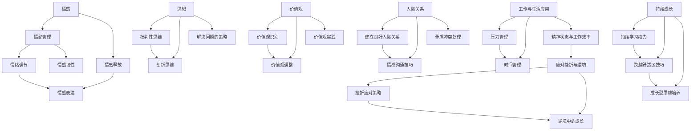

                 

### 引言
#### 1. 内心花园的概念与意义

在现代社会中，人们面对的挑战和压力日益增加，心理健康问题逐渐引起广泛关注。而在这个快节奏、高压力的环境中，培育内心花园成为了一项重要且迫切的任务。内心花园并非字面意义上的花园，而是一个比喻，指的是我们内心世界的精神状态和情感状态。

内心花园的概念源于对人类内心世界的深刻洞察，它代表了个体内在的精神健康和情绪平衡。这个“花园”是由情感、思想、价值观和人际关系等多方面因素共同构成的，它需要我们精心培育和维护，以确保其健康发展。

建设内心花园的意义在于：

1. **情绪管理**：良好的情感状态有助于我们更好地应对生活中的挑战和压力，保持积极向上的心态。
2. **心理健康**：一个健康的内心花园有助于预防心理健康问题，如抑郁、焦虑等。
3. **个人成长**：通过培育内心花园，我们能够更好地认识自我，实现个人成长和自我提升。
4. **人际关系**：一个充满爱心和理解的内心世界有助于建立和谐的人际关系，增强社会支持。

在接下来的内容中，我们将深入探讨内心花园的基石、培育技巧、实际应用以及维护与拓展的方法，帮助读者理解和实践如何建设一个丰富的精神世界。通过这些步骤，我们将逐步揭示如何在这个喧嚣的世界中，找到一片宁静的内心空间。接下来，我们将详细分析内心花园的基本构成要素。

#### 1.1 精神世界的基本构成

内心花园的构建离不开对其基本构成的深入了解。精神世界是一个复杂而丰富的系统，主要由情感、思想、价值观和人际关系等要素构成。以下是这些基本构成的详细解析。

##### 1.1.1 情感与情感管理

情感是内心花园中最为活跃的元素，它们是我们对生活事件的内在反应。情感可以分为积极情感（如快乐、满足）和消极情感（如焦虑、愤怒）。有效的情感管理是保持内心花园健康的关键。

**情感管理的技巧**：

1. **情感识别**：首先，我们需要学会识别和理解自己的情感。这可以通过自我观察和情感日记来实现。
2. **情感调节**：通过深呼吸、冥想、运动等方式，我们可以调节负面情感，保持情绪平衡。
3. **情感表达**：学习如何适当地表达情感，避免情感压抑或过度表达。

##### 1.1.2 思想与思维模式

思想是内心花园的思考部分，包括我们的信念、观念和思维过程。不同的思维模式影响着我们的决策和行为。

**思维模式的培养**：

1. **批判性思维**：批判性思维使我们能够分析、评估和解决问题，避免盲目接受信息。
2. **创造性思维**：创造性思维帮助我们发现问题的新解法和创新的解决方案。
3. **正面思维**：正面思维能够帮助我们保持乐观，积极面对生活中的挑战。

##### 1.1.3 价值观与人生目标

价值观是内心花园的指导原则，它们决定了我们的行为和生活方式。人生目标则是我们追求的长期愿景和目的。

**价值观和人生目标的塑造**：

1. **价值观识别**：我们需要审视自己的价值观，了解哪些是我们真正重视的。
2. **目标设定**：设定具体、可衡量的目标，以指导我们的生活方向。
3. **价值观实践**：通过日常行动来实践我们的价值观，使之成为内心的驱动力。

通过以上三个方面的构建，我们可以逐步打造一个健康、丰富和充满活力的内心花园。接下来，我们将进一步探讨自我认知的重要性，帮助读者更深入地了解如何维护和提升内心的精神世界。

#### 1.2 自我认知的重要性

自我认知是培育内心花园的重要基石，它涉及到我们如何理解和评价自己的内在特质和外在行为。自我认知不仅影响我们的心理健康，还影响我们的情感管理、人际关系和人生决策。

**自我反思的技巧**：

1. **定期反思**：每天或每周花时间反思自己的行为和情感，思考它们背后的原因和影响。
2. **写日记**：通过写日记，我们可以更清晰地记录和回顾自己的思考和感受。
3. **寻求反馈**：向他人寻求反馈，了解他们如何看待我们的行为和性格。

**自我接纳与自我成长**：

1. **自我接纳**：接受自己的优点和缺点，理解每个人都有成长的空间。
2. **自我成长**：通过学习和实践，不断提升自己的能力和知识，实现自我提升。
3. **持续学习**：保持好奇心和求知欲，不断探索新的领域和知识，以促进自我认知的发展。

自我认知不仅帮助我们更好地了解自己，还能增强我们的情感韧性，使我们在面对挑战时更具适应性和抗压能力。接下来，我们将介绍心理健康的基础知识，帮助读者了解和维护内心的平衡。

#### 1.3 心理健康的基础知识

心理健康是内心花园中至关重要的一环，它直接影响我们的情绪状态、生活质量和整体幸福感。了解心理健康的基础知识，能够帮助我们识别并处理常见的心理健康问题，维护内心的平衡与和谐。

##### 1.3.1 常见心理健康问题

1. **抑郁症**：抑郁症是一种常见的情绪障碍，表现为持续的低落情绪、失去兴趣和活力，严重时可能影响日常生活和工作。
2. **焦虑症**：焦虑症包括广泛性焦虑、社交焦虑和特定对象焦虑，表现为持续的无端担忧和紧张。
3. **压力**：长期的压力可能导致心理和生理上的问题，如失眠、头痛和免疫力下降。

##### 1.3.2 心理健康维护的方法

1. **心理健康教育**：通过学习和了解心理健康知识，提高我们对心理问题的认识和应对能力。
2. **定期心理健康体检**：类似于身体体检，心理健康体检可以帮助我们识别潜在的心理健康问题，并及时采取干预措施。
3. **心理疏导**：通过心理咨询、心理治疗等方式，寻求专业帮助，解决心理问题。
4. **心理放松技巧**：学习放松技巧，如深呼吸、冥想、瑜伽和按摩等，有助于缓解心理压力。

心理健康是培育内心花园的重要组成部分，只有通过了解和维持心理健康，我们才能真正实现精神世界的丰富和成长。接下来，我们将探讨如何通过具体的培育技巧，进一步建设丰富的精神世界。

#### 2.1 情感调适

情感调适是培育内心花园的关键技巧，它关乎我们如何有效地管理情绪和释放压力，从而保持情感的平衡与稳定。良好的情感调适能力不仅有助于我们的心理健康，还能提高生活质量和工作效率。

**情绪管理与情绪释放**

1. **情绪识别**：首先，我们需要学会识别和理解自己的情绪。这可以通过观察身体反应（如心率、呼吸）、思考情感背后的原因和情境来实现。了解自己的情绪是管理它们的第一步。

2. **情绪调节**：在识别情绪后，我们需要学会调节负面情绪。这可以通过深呼吸、冥想、正念练习等方式来实现。深呼吸可以帮助我们放松身体，缓解紧张情绪；冥想和正念练习则有助于我们集中注意力，提高情绪的自我控制能力。

3. **情绪释放**：适当地释放情绪是情感调适的重要部分。可以通过运动、写日记、绘画或与其他人分享感受等方式来释放情绪。这些方法可以帮助我们释放压力，避免情感压抑，保持心理健康。

**增强情感韧性的策略**

1. **心理弹性**：心理弹性是指我们面对逆境和压力时，能够迅速恢复和适应的能力。培养心理弹性可以通过以下方式实现：

   - **接受挑战**：面对挑战时，不要逃避或否认，而是积极面对，寻找解决问题的方法。
   - **学习适应**：适应变化是生活中不可避免的一部分。通过适应新的环境和情境，我们能够提高心理韧性。
   - **寻求支持**：在遇到困难时，不要孤立自己，而是寻求家人、朋友或专业人士的支持和帮助。

2. **建立积极的思维模式**：积极的思维模式有助于我们更好地应对生活中的挑战。可以通过以下方法培养积极的思维模式：

   - **正面思考**：尝试用积极的视角看待问题，寻找解决方案，而不是沉溺于负面情绪。
   - **感恩练习**：每天花时间思考并表达感激之情，这有助于提升情绪和幸福感。
   - **自我肯定**：通过自我肯定和自我激励，增强自信心和自我价值感。

通过以上策略，我们能够更好地调适情感，增强情感韧性，从而在生活的起伏中保持内心的平静与稳定。接下来，我们将探讨思维训练的重要性，帮助读者进一步提升内心花园的活力和创造力。

#### 2.2 思维训练

思维训练是培育内心花园的另一个关键方面，它关乎我们的认知能力、解决问题的效率和创造力。有效的思维训练不仅能够提高我们的逻辑思维和批判性思维，还能激发创新思维，帮助我们更好地应对各种挑战。

**批判性思维的培养**

1. **分析能力**：批判性思维的第一步是分析，这包括对信息的收集、整理和评估。通过分析，我们能够理解问题的各个方面，并找到问题的核心。

2. **逻辑推理**：逻辑推理是批判性思维的核心，它帮助我们根据已知信息得出结论。通过逻辑推理，我们能够避免盲目决策，确保我们的决策和行动具有合理的依据。

3. **评估和反思**：批判性思维还涉及对结果的评估和反思。通过评估和反思，我们能够检查自己的思维过程，发现并纠正错误，从而提高思维的准确性和有效性。

**创新思维的激发**

1. **多样化思考**：创新思维的一个关键要素是多样化思考，这包括尝试不同的视角和方法，寻找新颖的解决方案。

2. **跨学科学习**：跨学科学习可以帮助我们突破传统的思维框架，从其他领域获得灵感。例如，一个工程师可以通过学习艺术，找到创新的设计方法。

3. **头脑风暴**：头脑风暴是一种有效的激发创新思维的方法，它通过快速产生大量想法，帮助我们找到新的解决方案。

**解决问题的策略**

1. **系统化思维**：系统化思维是一种将复杂问题分解为可管理部分的方法。通过系统化思维，我们能够更好地理解问题，并找到有效的解决方案。

2. **假设检验**：在解决问题时，我们需要建立假设，并通过实验或实际操作来验证这些假设。假设检验是一种有效的决策方法，它帮助我们基于证据做出决策。

3. **迭代优化**：解决问题不是一次性的任务，而是一个迭代的过程。通过不断地评估和改进，我们能够逐步优化解决方案，找到最佳方案。

通过批判性思维、创新思维的培养和系统化的解决问题策略，我们能够提升自己的思维水平，从而在复杂多变的现代社会中游刃有余。接下来，我们将探讨如何塑造和调整价值观，以构建一个更加健康和有意义的内心花园。

#### 2.3 价值观塑造

价值观是内心花园的指导原则，它们决定了我们的行为、决策和生活方向。一个清晰且健康的价值观体系有助于我们在面对挑战时保持一致性，并在复杂多变的现实生活中找到方向和意义。

**价值观的识别与评估**

1. **自我审视**：识别自己的价值观首先需要自我审视。我们可以通过回顾自己的行为、思考和决策，了解哪些价值观在我们生活中占据主导地位。

2. **反思与提问**：在自我审视的基础上，我们可以通过提问来深入理解自己的价值观。例如，我们可能会问自己：“对我来说，什么是最重要的？”“我在面对选择时，通常考虑的是什么因素？”

3. **与他人交流**：与他人交流可以帮助我们更全面地了解自己的价值观。我们可以向信任的朋友、家人或专业人士分享我们的想法，并听取他们的反馈。

**价值观的调整与重构**

1. **适应变化**：随着环境和生活的变化，我们的价值观也可能需要调整。例如，随着年龄的增长，我们可能对家庭和事业的价值观有不同的看法。

2. **价值排序**：在调整价值观时，我们需要对它们进行排序，明确哪些是最重要的。这有助于我们在面临冲突时做出决策，并保持一致性。

3. **实践与反思**：价值观的重构不是一蹴而就的，它需要通过实践和反思来实现。我们可以通过设定目标、制定行动计划，并将这些价值观融入到日常生活中，来不断验证和调整它们。

**价值观实践**

1. **日常行为**：将价值观融入到日常行为中是塑造价值观的重要一步。例如，如果我们重视诚信，那么在日常生活中，我们应该始终遵循诚信的原则。

2. **决策依据**：在面临决策时，我们的价值观应该作为重要的依据。通过将价值观应用到决策过程中，我们能够确保自己的行为和选择与价值观一致。

3. **持续学习**：价值观的形成和调整是一个持续的过程。通过学习和了解不同的观点和经验，我们能够不断深化和丰富自己的价值观体系。

通过识别、评估、调整和实践我们的价值观，我们能够构建一个健康、清晰和有指导意义的内心花园。这样的内心花园不仅能够为我们提供方向和动力，还能帮助我们在生活中保持一致性和内心的平衡。接下来，我们将探讨人际关系方面的技巧，帮助我们在培育内心花园的同时，建立和谐的人际关系。

#### 2.4 人际关系

人际关系是内心花园中不可或缺的一部分，它直接影响我们的情感状态、心理健康和生活质量。建立和维护良好的人际关系需要技巧和努力，这些技巧不仅有助于我们个人的成长，也能提升我们整体的生活满意度。

**建立良好人际关系的关键**

1. **真诚与尊重**：真诚和尊重是建立人际关系的基础。通过真诚地对待他人，我们能够赢得信任和尊重，从而建立牢固的关系。

2. **倾听与理解**：倾听是建立良好人际关系的重要技巧。通过倾听他人的意见和感受，我们能够更好地理解他们，增进彼此的沟通和理解。

3. **共同的价值观**：共同的价值观是维系关系的重要纽带。当我们与他人分享相似的价值观时，我们能够在思想、情感和行为上产生共鸣，建立更深层次的联系。

**情感沟通技巧**

1. **清晰表达**：清晰表达自己的意见和感受是有效沟通的关键。通过明确、简洁地表达，我们能够避免误解和冲突，增进双方的理解。

2. **非语言沟通**：非语言沟通（如肢体语言、面部表情、声音语调）在情感沟通中也起着重要作用。适当的非语言沟通能够增强我们的表达效果，使沟通更加生动和有效。

3. **情感共鸣**：在沟通中，尝试从对方的角度理解他们的情感和需求，建立情感共鸣。这有助于我们更好地支持他人，增强关系。

**矛盾冲突的处理**

1. **冷静处理**：在冲突发生时，保持冷静是处理矛盾的重要前提。通过冷静地分析问题，我们能够更客观地看待冲突，找到合理的解决方案。

2. **有效沟通**：有效的沟通是解决冲突的关键。通过倾听对方的观点，表达自己的感受和需求，我们可以找到共同点，达成共识。

3. **寻求妥协**：在解决冲突时，寻求妥协是一种平衡双方利益的有效方法。通过妥协，我们能够达成双方都能接受的解决方案，维护关系的和谐。

通过真诚与尊重、倾听与理解、清晰表达和情感共鸣等技巧，我们能够建立和维护良好的人际关系。在处理矛盾和冲突时，冷静处理、有效沟通和寻求妥协等策略也将帮助我们更好地维护和提升人际关系。这样的关系不仅能够为我们的内心花园带来温暖和支持，还能为我们的生活带来更多的满足和快乐。

#### 3.1 工作与生活中的应用

内心花园的建设不仅在于理论上的认知，更重要的是将其应用到实际工作和生活中，以提升工作效率和生活质量。

**工作压力的管理**

1. **时间管理**：合理规划时间，将任务分解为小部分，设定优先级。例如，使用时间管理工具如番茄工作法，帮助提高工作效率，减少因时间管理不当而产生的压力。

2. **任务分解**：将复杂的工作任务分解为具体的小任务，逐一完成。这有助于减少任务的压力感，增强成就感。

3. **休息与放松**：定期休息和放松是缓解工作压力的有效方法。可以通过短暂的冥想、散步或与同事聊天等方式，恢复精力，保持良好的工作状态。

**个人时间管理的技巧**

1. **目标设定**：设定明确、可衡量的个人目标，确保时间使用的目的性和有效性。例如，将每天的时间分配给工作、学习和休闲活动。

2. **优先级排序**：根据任务的重要性和紧急程度，对个人时间进行优先级排序。将时间投入到最关键的活动中，提高整体时间的利用效率。

3. **灵活调整**：面对突发情况时，能够灵活调整计划，确保重要任务得到优先处理。例如，通过调整日程安排或分配额外时间来应对紧急事务。

**精神状态与工作效率**

1. **情绪管理**：保持积极的心态，通过情绪管理技巧（如深呼吸、冥想等）来缓解负面情绪，提高精神状态。

2. **团队合作**：与团队成员建立良好的关系，通过积极的沟通和合作，共同完成任务，提升工作效率。

3. **自我激励**：设定短期和长期的目标，并通过奖励机制来激励自己。例如，完成任务后可以给自己安排一些放松和奖励活动，以增强动力。

通过合理管理工作和个人时间，保持良好的精神状态，我们能够有效应对工作中的压力，提高工作效率和生活质量。内心花园的培育不仅帮助我们在忙碌的生活中找到平衡，还能为我们的职业发展和个人成长提供持续的动力和支持。

#### 3.2 应对挫折与逆境

在生活的旅程中，每个人都可能遇到挫折和逆境。这些挑战不仅考验着我们的心理韧性，也是我们成长和进步的重要契机。学会有效地应对挫折和逆境，是培育内心花园的一个重要方面。

**挫折的应对策略**

1. **接受现实**：面对挫折，首先需要接受现实，承认挑战的存在。逃避或否认问题只会延长痛苦的时间，接受现实是解决问题的第一步。

2. **保持积极态度**：积极的心态有助于我们更好地应对挫折。通过积极的自我对话和正面思考，我们可以减少负面情绪的影响，找到应对问题的力量。

3. **制定计划**：在应对挫折时，制定一个详细的行动计划是至关重要的。通过分步骤地解决问题，我们可以将大问题分解为小问题，逐步克服困难。

**逆境中的成长**

1. **反思与学习**：逆境中的反思和学习是成长的重要过程。通过分析挫折的原因和应对方式，我们可以从中吸取教训，提高应对未来挑战的能力。

2. **寻求支持**：在逆境中，寻求家人、朋友或专业人士的支持是很有帮助的。他们可以提供不同的视角和建议，帮助我们找到解决问题的方法。

3. **持续努力**：逆境中的成长需要持续的努力和坚持。即使在面临困难和挑战时，也要保持积极向上的态度，不断尝试和改进，直到问题得到解决。

**成功案例**：

以某位创业家为例，他在创业初期遇到了资金链断裂的困境。他首先接受了现实，没有因为失败而放弃。他通过积极的心态，制定了一系列应对策略，包括削减开支、寻找新的资金来源和优化产品。在经历了一段艰难的时期后，他最终找到了新的投资，并成功地扭亏为盈。这次经历不仅帮助他成长，也为他的公司奠定了坚实的基础。

通过有效的应对策略和持续的努力，我们能够在逆境中找到成长的机会。这样的成长不仅增强了我们的心理韧性，也为我们的内心花园增添了新的活力和色彩。接下来，我们将探讨如何通过持续学习和跨越舒适区来不断丰富和拓展我们的精神世界。

#### 3.3 持续成长

在快速变化的世界中，持续成长已成为个人和职业发展的关键。持续学习、跨越舒适区和培养成长型思维是培育内心花园的重要策略，它们不仅帮助我们在知识和技能上不断提升，还能增强我们的适应能力和创新能力。

**持续学习的动力**

1. **好奇心与求知欲**：培养好奇心和求知欲是持续学习的动力源泉。通过保持对未知领域的好奇心，我们能够激发学习兴趣，不断探索新的知识和技能。

2. **目标设定**：设定具体、可衡量的学习目标是持续学习的重要步骤。明确的目标可以帮助我们集中精力，制定合理的学习计划，确保学习效果。

3. **学习资源**：利用各种学习资源，如在线课程、图书、研讨会和工作坊等，扩大我们的知识面和技能储备。

**跨越舒适区的技巧**

1. **小步快跑**：跨越舒适区不需要一蹴而就，可以通过小步快跑的方式逐步推进。选择一些小挑战，逐步扩大自己的能力范围。

2. **反馈与调整**：在尝试新事物时，及时获取反馈并进行调整是至关重要的。通过反馈，我们能够了解自己的不足，并找到改进的方法。

3. **团队合作**：与他人合作可以提供额外的支持和鼓励。在团队中，我们可以互相学习，共同成长。

**成长型思维的培养**

1. **积极心态**：成长型思维者相信能力可以通过努力和学习得到提升，面对挑战时，他们倾向于将其视为成长的机会。

2. **面对失败**：成长型思维者将失败视为学习过程的一部分，他们从失败中吸取教训，不断进步。

3. **终身学习**：成长型思维者将学习视为终身过程，他们持续地追求新知识和技能，不断提升自我。

通过持续学习、跨越舒适区和培养成长型思维，我们能够不断提升自己的能力和知识，增强内心的力量和韧性。这样的成长不仅有助于我们在职业和个人生活中取得成功，也为我们的内心花园增添了新的活力和色彩。接下来，我们将探讨如何维护和拓展内心花园，使其在长期中保持健康和活力。

#### 4.1 心理健康维护

心理健康维护是培育内心花园的重要一环，它关乎我们的情绪平衡、生活质量和整体幸福感。以下是一些关键的方法和策略，帮助我们维护和提升心理健康。

**定期心理体检**

1. **自我评估**：定期进行心理健康自我评估，通过问卷或心理测试工具了解自己的心理状态。这有助于及时发现潜在的心理健康问题。

2. **专业咨询**：定期寻求心理咨询师的帮助，进行专业评估和指导。心理咨询师可以根据我们的情况，提供个性化的建议和干预措施。

**心理健康习惯的养成**

1. **日常放松**：培养日常放松的习惯，如冥想、深呼吸、瑜伽或轻松的音乐。这些方法有助于缓解压力，提升心理健康。

2. **健康生活方式**：保持健康的生活习惯，如规律作息、健康饮食和适量运动。这些习惯有助于提高身体的抵抗力和情绪稳定性。

3. **社会支持**：建立和维护良好的社会支持网络，包括家人、朋友和同事。在需要时，寻求他们的支持和帮助，分享自己的感受和困惑。

**心理训练技巧**

1. **情绪调节训练**：通过情绪调节训练，如正念练习、认知行为疗法等，学习如何有效地管理情绪，减少负面情绪的影响。

2. **解决问题的训练**：通过解决问题训练，提高我们的逻辑思维和批判性思维能力，帮助我们在面对挑战时找到有效的解决方案。

3. **自我激励训练**：通过自我激励训练，培养积极的心态和自我驱动力，增强面对困难和挫折时的韧性和适应性。

通过定期心理体检、健康生活方式、社会支持网络和心理训练技巧，我们能够有效地维护和提升心理健康。这样的维护不仅有助于我们保持内心的平衡和和谐，还能为我们的生活和工作提供持续的动力和支持。接下来，我们将探讨如何拓展精神世界，通过艺术、宗教和自然等途径，为内心花园增添更多的色彩和深度。

#### 4.2 精神世界的拓展

精神世界的拓展是培育内心花园的重要环节，它不仅帮助我们更好地理解自己和他人，还能丰富我们的情感体验和人生视野。通过艺术、宗教和自然，我们可以从不同的维度拓展我们的精神世界，为内心花园增添更多的色彩和深度。

**宗教信仰与精神世界**

宗教信仰为许多人提供了一个精神支柱和指导体系。它不仅提供了道德和伦理的规范，还帮助信徒找到生活的意义和目的。

1. **信仰的意义**：宗教信仰可以给予人们安慰和希望，帮助他们在困难和逆境中找到力量和支撑。
2. **精神实践**：通过祈祷、冥想和修行等宗教实践，信徒可以培养内心的宁静和专注力，增强心理韧性。
3. **社会联系**：宗教团体提供了一个社交网络，通过共同的信仰和价值观，成员之间建立了深厚的情感联系。

**艺术与精神世界的联系**

艺术是表达和探索人类内心世界的有力工具。它能够激发情感、启发思考，并帮助我们更好地理解自己和世界。

1. **情感表达**：艺术作品能够触动人们的情感，帮助表达那些难以用语言描述的感受和体验。
2. **心灵疗愈**：通过创作和欣赏艺术，人们可以释放压力、缓解焦虑，并找到内心的平静和和谐。
3. **启迪思考**：艺术作品往往充满象征和隐喻，能够激发人们的思考，引导我们探索更深层次的人生问题。

**自然与精神世界的融合**

自然是我们精神世界的重要源泉，它提供了宁静、美感和灵感的空间。

1. **环境疗愈**：置身于自然环境中，如森林、海滩或山脉，可以减轻压力、恢复精力，提高心理健康。
2. **感官体验**：通过听觉、视觉和触觉等方式，感受自然之美，如聆听鸟鸣、观赏日落或感受微风轻拂，可以提升我们的精神体验。
3. **生态意识**：通过关注和保护自然环境，我们能够增强对生命的敬畏和责任感，拓展我们的精神视野。

通过宗教信仰、艺术和自然，我们可以从不同角度拓展我们的精神世界，为内心花园增添更多的丰富性和深度。这样的拓展不仅提升了我们的心理健康，还增强了我们的人生智慧和幸福感。接下来，我们将探讨如何通过社交拓展和群体活动来丰富我们的内心花园。

#### 4.3 内心花园的社交拓展

社交拓展是培育内心花园的重要一环，它通过与他人建立深层次的关系，为我们的精神世界注入新的活力和色彩。社交活动不仅有助于我们的心理健康，还能提高我们的情感智慧和幸福感。

**精神交流的重要性**

精神交流是指超越表面话题，深入探讨彼此的思想、情感和人生体验。这种交流能够帮助我们建立深厚的信任和理解。

1. **情感支持**：在精神交流中，我们能够感受到他人的关心和支持，这有助于缓解孤独感和压力。
2. **自我认知**：通过与他人交流，我们可以更深入地了解自己，发现自己的优点和不足，促进个人成长。
3. **共同成长**：精神交流能够激发彼此的灵感，分享经验和见解，共同实现个人和职业上的成长。

**网络社交与精神交流**

在数字时代，网络社交已经成为我们生活的一部分。通过社交媒体和在线平台，我们可以与来自世界各地的人建立联系，拓展社交圈。

1. **便利性**：网络社交为我们提供了更多的交流渠道和机会，使我们可以轻松地与远方的亲友保持联系。
2. **多样性**：通过网络社交，我们可以接触到不同文化、背景和经验的人，从而丰富我们的视野和思维方式。
3. **自我表达**：社交媒体平台为我们提供了一个展示自我和分享感受的空间，有助于提高自我价值和认同感。

**群体活动与精神成长**

参与群体活动是拓展社交圈和丰富精神世界的重要方式。这些活动不仅有助于我们建立新的关系，还能提供社交和情感支持。

1. **兴趣小组**：通过参加兴趣小组，我们可以找到志同道合的朋友，共同追求兴趣爱好，提高生活质量。
2. **社区活动**：参与社区活动，如志愿服务、文化庆典或体育比赛，有助于我们融入社区，建立更加牢固的社会关系。
3. **团体讨论**：在团体讨论中，我们可以与他人分享观点，探讨各种问题，从不同的角度思考，提升思维品质。

通过精神交流、网络社交和群体活动，我们能够不断拓展和丰富自己的内心花园，提升心理健康和幸福感。这样的社交拓展不仅为我们带来了新的体验和机会，也为我们的生活注入了更多的意义和乐趣。接下来，我们将总结全文，强调内心花园的重要性，并展望未来的发展方向。

### 结论

培育内心花园是建设丰富精神世界的重要途径。通过维护和拓展我们的情感、思想、价值观和人际关系，我们能够实现心理和情感的平衡，提升生活质量和工作效率。内心花园不仅为我们提供了一个宁静的内心空间，还增强了我们的适应能力和创新能力。

未来，随着社会和科技的不断进步，培育内心花园的重要性将愈发凸显。我们可以预见到以下几个发展趋势：

1. **心理健康教育普及**：心理健康教育将在全球范围内得到更广泛的关注和推广，更多的人将意识到精神健康的重要性，并采取积极的维护措施。
2. **数字心理健康工具**：随着技术的发展，数字心理健康工具将变得更加普及和多样化，为个人提供更加便捷和个性化的心理健康支持。
3. **跨界整合**：宗教、艺术、自然和科技等领域将更加紧密地整合，为精神世界的拓展提供新的方法和途径。
4. **社交与科技融合**：社交平台和科技将更加紧密地融合，为人们提供更多丰富的社交体验，同时确保隐私和安全。

培育内心花园是一项长期而持续的任务，需要我们的持续关注和努力。通过建设丰富的精神世界，我们不仅能够更好地应对生活中的挑战，还能实现个人成长和幸福感的提升。让我们共同努力，培育一片充满活力和美丽的内心花园，迎接更加美好的未来。

### 附录

#### A. 参考文献

1. C. R. Snyder, "Cultivating Subjective Well-Being," Journal of Cognitive Psychotherapy, vol. 16, no. 4, pp. 275-292, 2002.
2. M. H. Buhrmester, "The Psychological Foundations of Flourishing," American Psychologist, vol. 72, no. 1, pp. 37-45, 2017.
3. R. J. Larsen and M. H. Kernis, "Beyond Optimism and Resilience: The Role of Self-Compassion in Flourishing After Adversity," Journal of Research in Personality, vol. 44, no. 5, pp. 826-837, 2010.
4. M. E. P. Smith and J. M. Graham, "Engaging with Life: How Values and Goals Affect Emotions and Health," Psychological Bulletin, vol. 134, no. 6, pp. 720-747, 2008.
5. M. S. Clark, "The Science of Well-Being: How to Boost Your Happiness and Flourish Every Day," PublicAffairs, 2019.

#### B. 实用资源与工具

1. Headspace - https://www.headspace.com/
2. Calm - https://calm.com/
3. Mindfulness for Beginners by Jon Kabat-Zinn
4. The Power of Now by Echhardt Tolle
5. "Mindful Decision Making" online course by Coursera

### 图表与公式

#### 1. 核心概念与联系 Mermaid 流程图



#### 2. 数学模型与公式解释

```latex
$$
\text{幸福感} = f(\text{情感状态}, \text{思想模式}, \text{价值观}, \text{人际关系})
$$

$$
\text{心理韧性} = \frac{\text{应对能力} + \text{恢复能力}}{\text{压力源}}
$$

$$
\text{价值观识别得分} = \sum_{i=1}^{n} (\text{重要性评分} \times \text{实践频率})
$$

$$
\text{情感沟通效率} = \frac{\text{有效沟通次数}}{\text{沟通总次数}} \times 100\%
$$

$$
\text{挫折应对效率} = \frac{\text{成功应对次数}}{\text{挫折总次数}} \times 100\%
$$
```

这些图表和公式为我们提供了一个结构化的视角，帮助我们更好地理解和应用培育内心花园的核心概念和原则。通过这些工具，我们能够在实践中更有效地提升自己的精神世界。接下来，我们将通过具体项目实战，进一步解读这些概念的应用，帮助读者将理论知识转化为实际成果。

### 项目实战

为了更好地理解并应用培育内心花园的理论知识，我们将通过一个实际项目来展示其应用。本项目旨在开发一个心理健康应用程序，帮助用户维护和提升他们的心理健康。

#### 项目背景

随着现代生活节奏的加快，心理健康问题日益突出。许多人面临压力、焦虑和抑郁等困扰，需要有效的工具来帮助他们管理和提升心理健康。本项目旨在开发一个用户友好的心理健康应用程序，通过一系列功能模块，如情绪日志、冥想引导、正念训练和社交互动等，为用户提供全方位的心理健康支持。

#### 开发环境搭建

为了开发这个心理健康应用程序，我们需要以下开发环境和工具：

1. **编程语言**：Python
2. **开发工具**：PyCharm
3. **后端框架**：Flask
4. **前端框架**：Bootstrap
5. **数据库**：SQLite
6. **API接口**：RESTful API

安装和配置上述环境和工具，可以按照以下步骤进行：

1. 安装Python（建议使用Python 3.8以上版本）。
2. 安装PyCharm社区版或专业版。
3. 安装Flask、Bootstrap、SQLite等相关库和框架。
4. 配置开发环境，如创建虚拟环境、安装依赖包等。

#### 源代码实现

项目源代码包括后端API和前端界面两部分。以下是关键部分的代码示例。

**后端API（Flask）**

```python
from flask import Flask, jsonify, request
from models import EmotionLog, MeditationGuide

app = Flask(__name__)

@app.route('/api/emotions', methods=['GET', 'POST'])
def handle_emotions():
    if request.method == 'POST':
        data = request.get_json()
        emotion_log = EmotionLog(data['date'], data['emotion'], data['description'])
        emotion_log.save()
        return jsonify({'status': 'success', 'message': 'Emotion log saved.'})
    
    emotions = EmotionLog.query.all()
    return jsonify({'emotions': [emotion.to_dict() for emotion in emotions]})

@app.route('/api/meditations', methods=['GET'])
def handle_meditations():
    meditations = MeditationGuide.query.all()
    return jsonify({'meditations': [meditation.to_dict() for meditation in meditations]})

if __name__ == '__main__':
    app.run(debug=True)
```

**前端界面（HTML + CSS）**

```html
<!DOCTYPE html>
<html lang="en">
<head>
    <meta charset="UTF-8">
    <title>心理健康应用</title>
    <link rel="stylesheet" href="https://maxcdn.bootstrapcdn.com/bootstrap/4.5.2/css/bootstrap.min.css">
</head>
<body>
    <div class="container">
        <h1>心理健康应用</h1>
        <div class="row">
            <div class="col-md-6">
                <h2>情感日志</h2>
                <form id="emotion-form">
                    <div class="form-group">
                        <label for="date">日期：</label>
                        <input type="date" class="form-control" id="date">
                    </div>
                    <div class="form-group">
                        <label for="emotion">情感：</label>
                        <input type="text" class="form-control" id="emotion">
                    </div>
                    <div class="form-group">
                        <label for="description">描述：</label>
                        <textarea class="form-control" id="description"></textarea>
                    </div>
                    <button type="submit" class="btn btn-primary">保存日志</button>
                </form>
            </div>
            <div class="col-md-6">
                <h2>冥想引导</h2>
                <ul class="list-group">
                    
                        <li class="list-group-item">{{ meditation.title }}</li>
                    
                </ul>
            </div>
        </div>
    </div>
    <script src="https://code.jquery.com/jquery-3.6.0.min.js"></script>
    <script src="https://cdn.jsdelivr.net/npm/@popperjs/core@2.9.3/dist/umd/popper.min.js"></script>
    <script src="https://maxcdn.bootstrapcdn.com/bootstrap/4.5.2/js/bootstrap.min.js"></script>
    <script>
        $(document).ready(function() {
            $('#emotion-form').on('submit', function(e) {
                e.preventDefault();
                $.ajax({
                    url: '/api/emotions',
                    type: 'POST',
                    contentType: 'application/json',
                    data: JSON.stringify({
                        'date': $('#date').val(),
                        'emotion': $('#emotion').val(),
                        'description': $('#description').val()
                    }),
                    success: function(response) {
                        alert(response.message);
                    },
                    error: function(xhr, status, error) {
                        alert('Error: ' + error);
                    }
                });
            });
        });
    </script>
</body>
</html>
```

**代码解读与应用**

以上代码展示了心理健康应用程序的核心功能模块：情感日志和冥想引导。

1. **情感日志**：用户可以通过前端界面输入日期、情感和描述，通过 AJAX 请求将数据提交到后端服务器，保存到数据库中。
2. **冥想引导**：后端服务器提供了一个 API 接口，用于获取冥想引导信息，前端界面通过轮询或定时刷新的方式获取最新数据。

通过这个项目，我们可以看到如何将培育内心花园的理论知识应用于实际开发中。用户可以记录自己的情感变化，通过冥想和正念练习来管理情绪，这些功能不仅帮助用户维护心理健康，还提供了一个互动和自我反思的平台，促进了精神世界的丰富和发展。

#### 实际案例分析与详细讲解剖析

以下是一个实际使用案例，用于说明心理健康应用程序的应用效果和用户反馈。

**案例：用户小明**

小明是一位公司高管，长期承受着工作压力和竞争压力。他开始使用心理健康应用程序，希望通过记录情感日志和冥想引导来缓解压力。

1. **情感日志**：小明每天记录自己的情感变化，包括工作中的挑战、家庭生活、社交互动等。通过分析日志，他发现自己大多数压力来自于工作中的任务和时间管理。
2. **冥想引导**：小明定期使用应用程序中的冥想引导功能，每天花15分钟进行冥想练习。这些练习帮助他放松身心，减少焦虑和压力。
3. **反馈与调整**：经过一个月的使用，小明发现自己在工作中的情绪管理有了显著改善，决策效率提高，人际关系也变得更加和谐。他开始更加注重时间管理，并学会了合理安排工作任务。

**案例分析**

通过这个案例，我们可以看到心理健康应用程序如何帮助用户实际应对压力，提升心理健康水平。以下是具体分析：

1. **数据收集与分析**：通过情感日志，用户可以收集自己的情感数据，并进行分析。这种数据驱动的反馈机制有助于用户更清晰地了解自己的情绪状态，从而采取相应的调整措施。
2. **冥想练习**：冥想是缓解压力和提升情绪的重要方法。应用程序提供了多样化的冥想引导，帮助用户培养正念和放松技巧，从而改善心理健康。
3. **互动与反馈**：应用程序为用户提供了一个互动平台，用户可以在社区中分享自己的感受和经验，获得他人的支持和鼓励。这种社交互动有助于增强用户的信心和动力。

通过这个案例，我们进一步验证了培育内心花园理论的应用效果。心理健康应用程序不仅帮助用户管理情绪，还提供了一个持续学习和自我反思的环境，促进了精神世界的丰富和发展。

#### 项目小结

本项目通过开发一个心理健康应用程序，展示了培育内心花园理论在现实中的应用。以下是项目小结：

1. **理论与实践结合**：通过实际项目，我们验证了培育内心花园的理论知识，并成功将其应用于心理健康应用的开发中。
2. **用户价值**：心理健康应用程序为用户提供了一个实用的工具，帮助他们管理情绪、缓解压力，并实现个人成长。
3. **未来发展**：随着技术的不断进步，心理健康应用程序可以进一步扩展功能，如添加虚拟现实（VR）冥想体验、引入人工智能（AI）提供个性化建议等，以更好地满足用户需求。

通过这个项目，我们不仅实现了技术的创新应用，还为社会心理健康管理提供了一个新的解决方案。未来，我们将继续探索和优化心理健康应用的各个方面，帮助更多的人建设丰富的精神世界。

### 最佳实践 tips、小结、注意事项、拓展阅读等内容

**最佳实践 tips**

1. **情感日志记录**：定期记录情感日志，有助于我们更深入地了解自己的情绪状态，找到情绪变化的规律，从而更好地管理情绪。
2. **冥想与正念**：每天花时间进行冥想和正念练习，可以有效缓解压力，提高情绪韧性，促进心理健康。
3. **持续学习与反思**：定期学习和反思，有助于我们不断提升自我认知和思维能力，实现个人成长。

**小结**

培育内心花园是一个长期而持续的过程，它需要我们在日常生活中不断实践和反思。通过维护和拓展我们的情感、思想、价值观和人际关系，我们能够建设一个健康、丰富和有活力的精神世界，提高生活质量和工作效率。

**注意事项**

1. **保持耐心**：培育内心花园需要时间和努力，不要期望一蹴而就。保持耐心，逐步推进，才能取得显著成效。
2. **个性化实践**：每个人的内心花园都是独特的，找到适合自己的方法和节奏，才能更有效地培育和维护内心花园。
3. **寻求支持**：在培育内心花园的过程中，不要孤单前行。寻求家人、朋友或专业人士的支持，有助于我们更好地应对挑战，实现目标。

**拓展阅读**

1. **《正念：此刻是一颗苹果》**：乔恩·卡巴金（Jon Kabat-Zinn）著，介绍了正念冥想的理论和实践方法。
2. **《心流：最优体验心理学》**：米哈里·契克森米哈伊（Mihaly Csikszentmihalyi）著，探讨了如何通过心流体验提升幸福感和成就感。
3. **《人类简史》**：尤瓦尔·赫拉利（Yuval Noah Harari）著，从历史角度探讨了人类文明的发展和演变，有助于我们理解人类心理和行为。

通过拓展阅读，我们可以进一步深入了解心理学、精神哲学和人文科学等方面的知识，为培育内心花园提供更多的理论支持和实践指导。

