                 

### 第一部分：引言

**关键词：** 零样本推理、迁移学习、元学习、能力迁移方法、设计

**摘要：** 本文旨在探讨基于元学习的零样本推理能力迁移方法设计。首先介绍了零样本推理能力的重要性以及迁移学习和元学习的基本概念，随后详细阐述了零样本推理、迁移学习和元学习之间的关系。文章的核心内容将围绕基于元学习的迁移学习方法进行深入分析，包括零样本推理的数学模型与算法设计，以及其实际应用和未来展望。

#### 第1章：零样本推理能力迁移概述

**1.1 零样本推理能力的重要性**

零样本推理（Zero-Shot Learning, ZSL）是一种在人工智能领域中备受关注的研究方向。其核心目标是在没有看到具体实例的情况下，对未知类别的数据进行分类或预测。这一能力在许多实际应用中具有重要意义，例如：

1. **减少对标注数据的依赖：** 在传统的机器学习任务中，大量的标注数据是训练模型的基础。然而，获取标注数据往往需要耗费大量时间和资源。零样本推理能够减少对标注数据的依赖，从而降低训练成本。

2. **提升模型泛化能力：** 零样本推理能够使模型在面对未知类别时仍然能够保持较高的准确率，这表明模型已经具备了较强的泛化能力。

3. **拓宽应用场景：** 零样本推理不仅适用于静态图像分类，还可以扩展到语音识别、自然语言处理等其他领域。

为了更直观地理解零样本推理能力的重要性，我们可以借助Mermaid流程图来展示其核心概念：

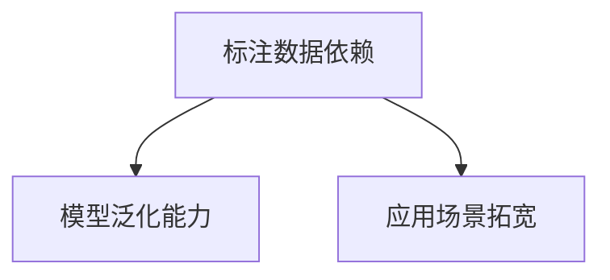

**1.2 迁移学习的基本概念**

迁移学习（Transfer Learning）是一种将一个任务学习到的知识应用到另一个相关但不同的任务中的方法。在零样本推理能力迁移中，迁移学习起到了关键作用。具体而言，迁移学习的过程可以分为以下几个步骤：

1. **源任务学习：** 在源任务中，模型通过学习大量的标注数据，获取了对该任务的理解和知识。

2. **知识迁移：** 将源任务中学习到的知识迁移到目标任务中，使得模型在目标任务上能够快速适应。

3. **目标任务学习：** 在目标任务上，模型利用迁移过来的知识进行学习，从而提高其在目标任务上的性能。

迁移学习的核心在于知识迁移，其关系可以用Mermaid流程图表示：

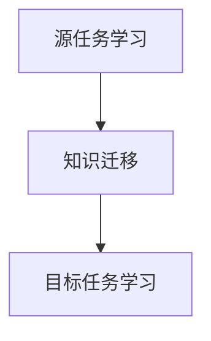

**1.3 元学习在迁移学习中的应用**

元学习（Meta-Learning）是一种学习如何学习的方法，其目标是通过在多个任务中学习，提取通用的学习策略，从而在新的任务上快速适应。元学习在迁移学习中的应用主要体现在两个方面：

1. **加速模型适应：** 通过元学习，模型能够快速从多个任务中提取通用策略，从而在新的任务上实现快速适应。

2. **提高迁移效果：** 元学习能够帮助模型更好地迁移知识，从而提高迁移学习的效果。

元学习在迁移学习中的应用可以用Mermaid流程图表示：

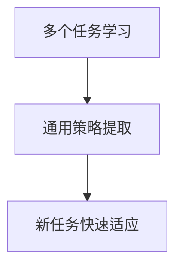

综上所述，零样本推理能力迁移方法设计的重要性在于其能够减少对标注数据的依赖，提升模型泛化能力，并拓宽应用场景。迁移学习和元学习是实现这一目标的关键技术。接下来的章节将深入探讨这些技术的核心概念、原理和实现方法。

## 第二部分：核心概念与原理

### 第2章：零样本推理能力迁移的核心概念

**2.1 零样本推理的基本概念**

零样本推理（Zero-Shot Learning, ZSL）是一种在机器学习领域中重要的研究方向，它旨在在没有看到具体实例的情况下，对未知类别的数据进行分类或预测。与传统的有监督学习（Supervised Learning）相比，零样本推理的核心优势在于其能够减少对大量标注数据的依赖，从而降低训练成本。下面从基本概念、核心问题和挑战等方面进行详细阐述。

**基本概念**

零样本推理的基本概念可以概括为以下几点：

1. **类标签与实例：** 在传统的有监督学习中，模型通过学习大量已标注的数据实例来构建分类器。而在零样本推理中，模型需要学习类标签与类原型（class prototypes）之间的关系。

2. **支持集与查询集：** 在零样本推理任务中，通常将已标注的数据集分为支持集（support set）和查询集（query set）。支持集用于训练模型，查询集用于测试模型的零样本推理能力。

3. **先验知识：** 零样本推理依赖于先验知识，这些知识可以是预训练模型的知识，也可以是从其他相关任务中迁移过来的知识。

**核心问题**

零样本推理涉及以下几个核心问题：

1. **类原型表示：** 如何有效地表示类原型是零样本推理的关键。常见的类原型表示方法包括基于实例（Instance-based）和基于属性（Attribute-based）的方法。

2. **分类器设计：** 如何设计分类器以实现高效的零样本推理也是关键。常见的分类器设计方法包括线性分类器、支持向量机（SVM）和神经网络等。

3. **特征提取：** 如何提取有效的特征以支持类原型表示和分类器设计也是零样本推理的重要问题。特征提取方法可以是基于传统机器学习算法的，也可以是基于深度学习模型的。

**挑战**

零样本推理面临着一系列挑战，包括：

1. **数据稀缺：** 由于没有已标注的数据实例，零样本推理在训练过程中往往面临数据稀缺的问题。

2. **类不平衡：** 在某些任务中，不同类别的数据数量可能存在显著差异，导致类不平衡问题，影响模型的性能。

3. **知识迁移：** 如何有效地迁移知识以支持零样本推理是另一个重要挑战。这需要研究如何从预训练模型或其他相关任务中提取和利用有效的先验知识。

**核心概念与联系**

为了更清晰地理解零样本推理的基本概念，我们可以使用Mermaid流程图来展示其核心概念和联系：

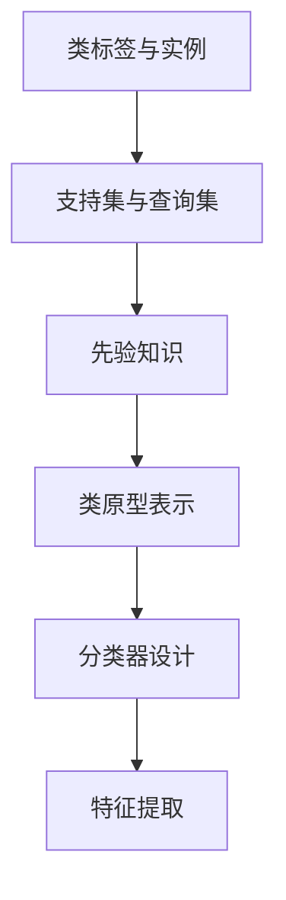

**2.2 迁移学习的基本概念**

迁移学习（Transfer Learning）是一种将一个任务学习到的知识应用到另一个相关但不同的任务中的方法。在零样本推理能力迁移中，迁移学习起到了关键作用。迁移学习的基本概念包括以下几个关键组成部分：

1. **源任务与目标任务：** 迁移学习涉及两个任务：源任务（Source Task）和目标任务（Target Task）。源任务是已知的，并且模型在源任务上已经学习到了一定的知识。目标任务是未知的，但与源任务具有相关性。

2. **模型参数：** 在迁移学习中，模型参数是核心要素。源任务学习过程中，模型参数反映了模型对源任务的适应。在迁移过程中，这些参数被用于目标任务的适应。

3. **知识迁移策略：** 知识迁移策略是迁移学习的核心。常见的迁移学习策略包括基于特征的迁移、基于模型结构的迁移和基于模型参数的迁移。

4. **迁移效果评估：** 迁移效果评估是衡量迁移学习效果的重要指标。评估方法包括在目标任务上的准确率、泛化能力和迁移性能等。

迁移学习的基本概念可以用Mermaid流程图表示如下：

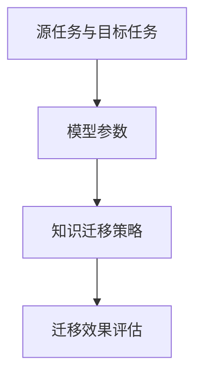

**核心概念与联系**

为了更直观地理解迁移学习的基本概念，我们可以借助Mermaid流程图来展示其核心概念和联系：

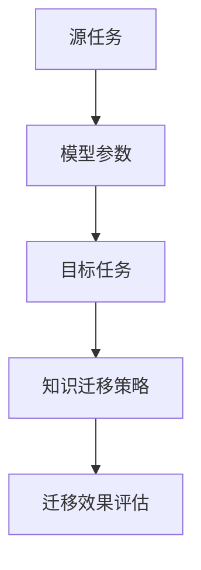

**2.3 元学习的基本概念**

元学习（Meta-Learning）是一种学习如何学习的方法，其目标是通过在多个任务中学习，提取通用的学习策略，从而在新的任务上快速适应。元学习的基本概念包括以下几个关键组成部分：

1. **元学习算法：** 元学习算法是元学习的核心。这些算法通过在多个任务中学习，提取通用的学习策略。常见的元学习算法包括模型更新算法、模型初始化算法和模型架构搜索算法。

2. **任务集合：** 元学习涉及一个任务集合，这些任务可以是源任务，也可以是目标任务。任务集合的多样性有助于提取通用的学习策略。

3. **性能指标：** 元学习的性能指标包括在各个任务上的准确率、学习速度和泛化能力等。这些指标用于评估元学习算法的有效性。

4. **学习策略：** 学习策略是元学习的核心。这些策略通过调整模型参数，优化模型在各个任务上的性能。

元学习的基本概念可以用Mermaid流程图表示如下：

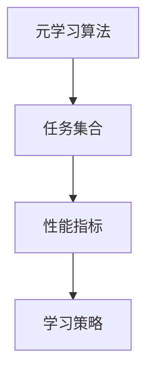

**核心概念与联系**

为了更直观地理解元学习的基本概念，我们可以借助Mermaid流程图来展示其核心概念和联系：

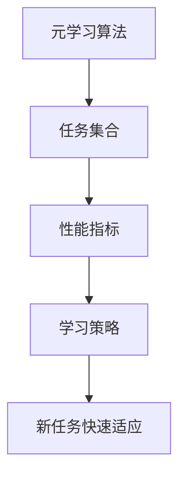

通过上述对零样本推理、迁移学习和元学习的基本概念及其相互关系的阐述，我们可以看到，这三者在零样本推理能力迁移中扮演着关键角色。接下来的章节将深入探讨这些技术的具体实现方法，以及如何基于元学习设计零样本推理能力迁移方法。

### 第二部分：核心概念与原理

#### 第2章：零样本推理能力迁移的核心概念

#### 2.1 零样本推理的基本概念

**核心概念与联系**

零样本推理（Zero-Shot Learning, ZSL）是机器学习领域中的一个重要研究方向，它允许模型在没有具体实例数据的情况下，对未知类别的数据进行分类或预测。这一能力对于减少对大量标注数据的依赖以及提升模型的泛化能力具有重要意义。为了更好地理解零样本推理的核心概念，我们可以借助Mermaid流程图来展示其关键组成部分及其相互关系。

首先，我们定义以下几个核心概念：

- **类标签（Class Labels）：** 类标签是指用于标识不同类别的标签。在传统的有监督学习中，类标签是通过已标注的数据实例获得的。
- **类原型（Class Prototypes）：** 类原型是指用于表示各个类别的代表性实例。在零样本推理中，类原型是模型进行推理的关键。
- **支持集（Support Set）：** 支持集是指用于训练模型的已标注数据集，它包含了多个已知类别的实例。
- **查询集（Query Set）：** 查询集是指用于测试模型零样本推理能力的未知类别数据集。

接下来，我们可以使用Mermaid流程图来展示这些概念之间的关系：

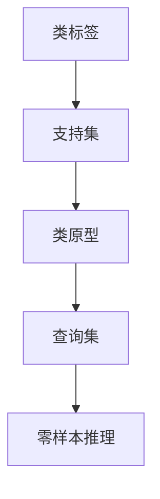

这个流程图清晰地展示了类标签如何通过支持集转换为类原型，进而用于查询集的零样本推理。

**核心算法原理讲解**

零样本推理的核心算法包括以下几个方面：

1. **类原型表示（Class Prototypes Representation）**

   类原型表示是指如何将类标签转换为类原型。常见的方法包括基于实例（Instance-based）和基于属性（Attribute-based）的方法。

   - **基于实例的方法：** 这种方法使用支持集中的实例来表示类原型。例如，平均实例方法会将支持集中每个类别的实例平均，得到该类别的类原型。
   - **基于属性的方法：** 这种方法使用属性来表示类原型。属性可以是视觉特征、文本特征等，它们能够描述类别的属性。例如，在图像分类任务中，使用颜色、纹理等视觉属性来表示类别。

2. **分类器设计（Classifier Design）**

   分类器设计是指如何设计分类器来执行零样本推理。常见的分类器设计方法包括线性分类器、支持向量机（SVM）和神经网络等。

   - **线性分类器：** 线性分类器是最简单的一种分类器，它通过计算特征向量和类原型之间的内积来进行分类。
   - **支持向量机（SVM）：** SVM是一种强大的分类器，它通过找到最优超平面来分隔不同类别的数据。
   - **神经网络：** 神经网络可以通过多层非线性变换来学习复杂的映射关系，它在零样本推理中得到了广泛应用。

3. **特征提取（Feature Extraction）**

   特征提取是指如何从数据中提取有效的特征来支持类原型表示和分类器设计。特征提取方法可以是基于传统机器学习算法的，也可以是基于深度学习模型的。

   - **传统机器学习算法：** 包括主成分分析（PCA）、线性判别分析（LDA）等，它们通过线性变换来提取特征。
   - **深度学习模型：** 包括卷积神经网络（CNN）和循环神经网络（RNN）等，它们通过多层非线性变换来提取特征。

**Python源代码举例**

为了更好地理解上述算法原理，我们可以使用Python代码来展示一个简单的零样本推理模型。以下是一个基于线性分类器的零样本推理示例：

```python
import numpy as np

# 假设我们有一个支持集和查询集
support_set = np.array([[1, 0], [0, 1], [1, 1], [0, 0]])
query_set = np.array([[1, 0], [0, 1]])

# 计算类原型
class_prototypes = np.mean(support_set, axis=0)

# 设计线性分类器
w = np.dot(class_prototypes.T, support_set) / support_set.shape[0]

# 进行零样本推理
predictions = np.sign(np.dot(query_set, w))

print(predictions)
```

**数学模型和公式**

零样本推理涉及一系列数学模型和公式，以下是一些关键公式：

1. **类原型表示**

   假设我们有一个支持集$S$，其中每个类别的实例表示为向量$x_i$。类原型可以通过以下公式计算：

   $$
   \mu = \frac{1}{|S|} \sum_{i=1}^{|S|} x_i
   $$

   其中$|\mu|$表示类原型向量。

2. **分类器设计**

   假设我们使用线性分类器，其权重向量表示为$w$。分类器的决策函数为：

   $$
   f(x) = \langle w, x \rangle
   $$

   其中$\langle \cdot, \cdot \rangle$表示内积运算。

3. **零样本推理**

   假设我们有一个查询集$Q$，其中每个实例表示为向量$x_q$。零样本推理的预测结果可以通过以下公式计算：

   $$
   \hat{y}_q = \text{sign}(\langle w, x_q \rangle)
   $$

   其中$\hat{y}_q$表示查询实例$x_q$的预测标签。

**算法优缺点分析**

1. **优点**

   - **减少标注数据依赖：** 零样本推理能够减少对大量标注数据的依赖，从而降低训练成本。
   - **提升泛化能力：** 零样本推理使得模型在面对未知类别时仍然能够保持较高的准确率，这表明模型已经具备了较强的泛化能力。

2. **缺点**

   - **数据稀缺：** 零样本推理在训练过程中往往面临数据稀缺的问题，这可能导致模型性能不稳定。
   - **类不平衡：** 在某些任务中，不同类别的数据数量可能存在显著差异，导致类不平衡问题，影响模型的性能。
   - **知识迁移：** 如何有效地迁移知识以支持零样本推理是另一个重要挑战。

通过上述对零样本推理的基本概念、核心算法原理讲解、Python源代码举例和数学模型与公式的分析，我们可以更深入地理解零样本推理的工作原理和实现方法。在接下来的章节中，我们将进一步探讨迁移学习和元学习在零样本推理能力迁移中的应用。

#### 2.2 迁移学习的基本概念

**核心概念与联系**

迁移学习（Transfer Learning）是机器学习中的一个重要概念，它通过利用一个任务（源任务）学习到的知识来提高另一个任务（目标任务）的性能。在零样本推理能力迁移中，迁移学习起着关键作用。为了更好地理解迁移学习的基本概念，我们可以借助Mermaid流程图来展示其核心组成部分及其相互关系。

首先，定义几个核心概念：

- **源任务（Source Task）：** 源任务是已知的，模型在该任务上已经学习到了一定的知识。
- **目标任务（Target Task）：** 目标任务是未知的，但与源任务具有相关性。
- **模型参数（Model Parameters）：** 模型参数是迁移学习的关键。在源任务学习中，模型参数反映了模型对源任务的适应。
- **知识迁移（Knowledge Transfer）：** 知识迁移是将源任务学习到的知识应用到目标任务中的过程。

接下来，我们可以使用Mermaid流程图来展示这些概念之间的关系：

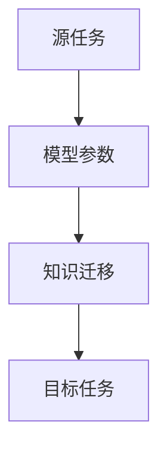

**核心算法原理讲解**

迁移学习涉及多种核心算法原理，以下是一些关键组成部分：

1. **特征迁移（Feature Transfer）**

   特征迁移是指将源任务的输入特征直接迁移到目标任务中。这种方法通过利用源任务的特征表示来提高目标任务的性能。常见的方法包括：

   - **特征重用（Feature Reuse）：** 将源任务的模型结构直接应用到目标任务中，但每个任务具有独立的模型参数。
   - **特征融合（Feature Fusion）：** 将源任务的输入特征和目标任务的输入特征进行融合，以生成新的特征表示。

2. **模型结构迁移（Model Architecture Transfer）**

   模型结构迁移是指将源任务的模型结构（例如神经网络架构）应用到目标任务中。这种方法通过保留模型结构的通用性来提高目标任务的性能。常见的方法包括：

   - **模型微调（Model Fine-tuning）：** 在源任务的模型基础上，对目标任务的模型进行微调，从而适应目标任务的需求。
   - **模型压缩（Model Compression）：** 通过压缩源任务的模型结构，使其适用于资源受限的目标任务。

3. **模型参数迁移（Model Parameter Transfer）**

   模型参数迁移是指将源任务的模型参数直接应用到目标任务中。这种方法通过调整模型参数，使模型在目标任务上获得更好的性能。常见的方法包括：

   - **参数共享（Parameter Sharing）：** 将源任务的模型参数共享到目标任务中，以减少目标任务的参数数量。
   - **参数适配（Parameter Adaption）：** 在目标任务中微调模型参数，使其更好地适应目标任务的需求。

**Python源代码举例**

为了更好地理解迁移学习的算法原理，我们可以使用Python代码来展示一个简单的迁移学习模型。以下是一个基于卷积神经网络（CNN）的迁移学习示例：

```python
import tensorflow as tf
from tensorflow.keras.models import Model
from tensorflow.keras.layers import Input, Conv2D, MaxPooling2D, Flatten, Dense

# 定义源任务模型
input_source = Input(shape=(28, 28, 1))
x_source = Conv2D(32, kernel_size=(3, 3), activation='relu')(input_source)
x_source = MaxPooling2D(pool_size=(2, 2))(x_source)
x_source = Flatten()(x_source)
output_source = Dense(10, activation='softmax')(x_source)
model_source = Model(inputs=input_source, outputs=output_source)

# 定义目标任务模型
input_target = Input(shape=(28, 28, 1))
x_target = Flatten()(input_target)
output_target = Dense(10, activation='softmax')(x_target)
model_target = Model(inputs=input_target, outputs=output_target)

# 迁移源任务的知识到目标任务
model_target.set_weights(model_source.get_weights())

# 进行目标任务预测
predictions = model_target.predict(np.random.rand(1, 28, 28, 1))

print(predictions)
```

**数学模型和公式**

迁移学习涉及一系列数学模型和公式，以下是一些关键组成部分：

1. **特征表示**

   假设我们有一个源任务的特征表示$f_S(x)$和一个目标任务的特征表示$f_T(x)$。通过迁移学习，我们可以将源任务的特征表示迁移到目标任务：

   $$
   f_T(x) = f_S(x)
   $$

   其中$x$表示输入数据。

2. **模型参数**

   假设我们有一个源任务的模型参数$w_S$和一个目标任务的模型参数$w_T$。通过迁移学习，我们可以将源任务的模型参数迁移到目标任务：

   $$
   w_T = w_S
   $$

   其中$w$表示模型参数。

3. **损失函数**

   在迁移学习中，我们通常使用损失函数来评估模型在目标任务上的性能。常见的损失函数包括交叉熵损失函数和均方误差损失函数：

   $$
   L = -\sum_{i=1}^{N} y_i \log(p_i)
   $$

   $$
   L = \frac{1}{2} \sum_{i=1}^{N} (y_i - p_i)^2
   $$

   其中$y_i$表示实际标签，$p_i$表示预测概率。

**算法优缺点分析**

1. **优点**

   - **减少训练数据需求：** 迁移学习可以减少对大量标注数据的依赖，从而降低训练成本。
   - **提高模型泛化能力：** 迁移学习使得模型能够利用在源任务上学习到的知识，从而在目标任务上获得更好的泛化能力。

2. **缺点**

   - **知识迁移效果不稳定：** 知识迁移的效果可能受到源任务和目标任务之间的相关性影响，导致迁移效果不稳定。
   - **模型参数调整复杂：** 在迁移学习中，需要对模型参数进行微调和适配，这增加了模型训练的复杂性。

通过上述对迁移学习的基本概念、核心算法原理讲解、Python源代码举例和数学模型与公式的分析，我们可以更深入地理解迁移学习的工作原理和实现方法。在接下来的章节中，我们将进一步探讨元学习在迁移学习中的应用，以及如何设计基于元学习的零样本推理能力迁移方法。

#### 2.3 元学习的基本概念

**核心概念与联系**

元学习（Meta-Learning）是机器学习领域中的一种学习方法，它的核心目标是学习如何快速地学习新任务。元学习通过在多个任务中学习，提取通用的学习策略，从而在新的任务上实现快速适应。为了更好地理解元学习的基本概念，我们可以借助Mermaid流程图来展示其关键组成部分及其相互关系。

首先，定义几个核心概念：

- **元学习算法（Meta-Learning Algorithm）：** 元学习算法是元学习的核心。这些算法通过在多个任务中学习，提取通用的学习策略。
- **任务集合（Task Set）：** 任务集合是元学习的重要组成部分。任务集合包括多个源任务和目标任务，这些任务可以是相同的或不同的。
- **性能指标（Performance Metric）：** 性能指标是评估元学习算法有效性的关键。常见的性能指标包括准确率、学习速度和泛化能力等。
- **学习策略（Learning Strategy）：** 学习策略是元学习的核心。这些策略通过调整模型参数，优化模型在各个任务上的性能。

接下来，我们可以使用Mermaid流程图来展示这些概念之间的关系：


**核心算法原理讲解**

元学习涉及多种核心算法原理，以下是一些关键组成部分：

1. **模型更新算法（Model Update Algorithm）**

   模型更新算法是元学习中的核心算法之一。这些算法通过在多个任务中更新模型参数，以提取通用的学习策略。常见的方法包括：

   - **梯度提升（Gradient Ascent）：** 梯度提升方法通过在多个任务中更新模型参数，使得模型在各个任务上都能获得较好的性能。
   - **随机梯度提升（Stochastic Gradient Ascent）：** 随机梯度提升方法通过在每个任务中随机选择一部分样本进行更新，从而加速模型的学习。

2. **模型初始化算法（Model Initialization Algorithm）**

   模型初始化算法是元学习中的另一个重要组成部分。这些算法通过初始化模型参数，使得模型在新的任务上能够快速适应。常见的方法包括：

   - **随机初始化（Random Initialization）：** 随机初始化方法通过随机初始化模型参数，从而使得模型具有多样性。
   - **基于先验知识初始化（Prior Knowledge Initialization）：** 基于先验知识初始化方法通过利用先验知识来初始化模型参数，从而提高模型在新的任务上的性能。

3. **模型架构搜索算法（Model Architecture Search Algorithm）**

   模型架构搜索算法是元学习中的高级算法。这些算法通过在多个任务中搜索最优模型架构，以实现高效的学习。常见的方法包括：

   - **基于梯度的架构搜索（Gradient-Based Architecture Search）：** 基于梯度的架构搜索方法通过在多个任务中更新模型架构，从而找到最优的模型架构。
   - **基于进化的架构搜索（Evolution-Based Architecture Search）：** 基于进化的架构搜索方法通过模拟进化过程，找到最优的模型架构。

**Python源代码举例**

为了更好地理解元学习的算法原理，我们可以使用Python代码来展示一个简单的元学习模型。以下是一个基于模型更新算法的元学习示例：

```python
import tensorflow as tf
from tensorflow.keras.models import Model
from tensorflow.keras.layers import Input, Conv2D, MaxPooling2D, Flatten, Dense

# 定义模型结构
input_shape = (28, 28, 1)
model_input = Input(shape=input_shape)
x = Conv2D(32, kernel_size=(3, 3), activation='relu')(model_input)
x = MaxPooling2D(pool_size=(2, 2))(x)
x = Flatten()(x)
model_output = Dense(10, activation='softmax')(x)
model = Model(inputs=model_input, outputs=model_output)

# 编译模型
model.compile(optimizer='adam', loss='categorical_crossentropy', metrics=['accuracy'])

# 定义训练过程
def train_model(model, X_train, y_train, X_val, y_val, epochs=10):
    model.fit(X_train, y_train, epochs=epochs, batch_size=64, validation_data=(X_val, y_val))

# 定义测试过程
def test_model(model, X_test, y_test):
    loss, accuracy = model.evaluate(X_test, y_test)
    print(f"Test accuracy: {accuracy:.4f}")

# 准备数据
X_train = np.random.rand(100, 28, 28, 1)
y_train = np.random.randint(0, 10, size=(100,))
X_val = np.random.rand(20, 28, 28, 1)
y_val = np.random.randint(0, 10, size=(20,))

# 训练模型
train_model(model, X_train, y_train, X_val, y_val)

# 测试模型
test_model(model, X_val, y_val)
```

**数学模型和公式**

元学习涉及一系列数学模型和公式，以下是一些关键组成部分：

1. **模型更新**

   假设我们有一个模型$M$，其参数为$\theta$。在元学习过程中，模型更新可以通过以下公式表示：

   $$
   \theta_{\text{new}} = \theta_{\text{old}} + \alpha \cdot \nabla_\theta J(\theta)
   $$

   其中$\theta_{\text{new}}$和$\theta_{\text{old}}$分别表示新参数和旧参数，$\alpha$是学习率，$J(\theta)$是损失函数。

2. **模型初始化**

   假设我们有一个先验分布$P(\theta)$。在元学习过程中，模型初始化可以通过以下公式表示：

   $$
   \theta \sim P(\theta)
   $$

   其中$\theta$是初始化的模型参数。

3. **模型架构搜索**

   假设我们有一个模型架构$A$，其参数为$\theta_A$。在元学习过程中，模型架构搜索可以通过以下公式表示：

   $$
   A^* = \arg\max_{A} \sum_{i=1}^{N} P(A | \theta_i)
   $$

   其中$A^*$是最佳模型架构，$P(A | \theta_i)$是模型架构在给定参数$\theta_i$下的概率。

**算法优缺点分析**

1. **优点**

   - **快速适应新任务：** 元学习通过在多个任务中提取通用学习策略，使得模型能够快速适应新任务。
   - **提高学习效率：** 元学习可以减少对每个任务的单独训练，从而提高学习效率。

2. **缺点**

   - **计算成本高：** 元学习涉及到多个任务的训练和搜索，这可能导致计算成本较高。
   - **对先验知识的依赖：** 元学习的效果可能依赖于先验知识，如果先验知识不足，可能会导致模型性能下降。

通过上述对元学习的基本概念、核心算法原理讲解、Python源代码举例和数学模型与公式的分析，我们可以更深入地理解元学习的工作原理和实现方法。在接下来的章节中，我们将进一步探讨如何基于元学习设计零样本推理能力迁移方法。

### 第三部分：算法与实现

#### 第3章：基于元学习的迁移学习方法

**3.1 元学习在迁移学习中的适用性**

元学习（Meta-Learning）在迁移学习（Transfer Learning）中的应用具有重要意义。元学习通过在多个任务中学习，提取通用的学习策略，使得模型能够快速适应新的任务。这对于零样本推理能力迁移（Zero-Shot Learning Transfer）来说尤为重要，因为在这种场景下，模型需要在没有具体实例数据的情况下，对未知类别的数据进行分类或预测。

**核心概念与联系**

为了更好地理解元学习在迁移学习中的应用，我们可以借助Mermaid流程图来展示其核心概念和联系。

首先，定义几个核心概念：

- **元学习算法（Meta-Learning Algorithm）：** 元学习算法是元学习的核心，用于在多个任务中学习通用策略。
- **任务集合（Task Set）：** 任务集合是元学习的重要组成部分，包括多个源任务和目标任务。
- **迁移学习（Transfer Learning）：** 迁移学习是将源任务的知识应用到目标任务中的方法。

接下来，我们可以使用Mermaid流程图来展示这些概念之间的关系：

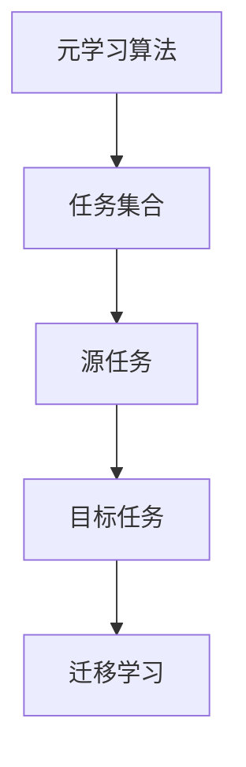

**核心算法原理讲解**

元学习在迁移学习中的应用主要通过以下几种核心算法原理实现：

1. **模型更新算法（Model Update Algorithm）**

   模型更新算法是元学习中的基础，它通过在多个任务中更新模型参数，提取通用学习策略。常见的模型更新算法包括：

   - **梯度提升（Gradient Ascent）：** 梯度提升方法通过在多个任务中更新模型参数，使得模型在各个任务上都能获得较好的性能。
   - **随机梯度提升（Stochastic Gradient Ascent）：** 随机梯度提升方法通过在每个任务中随机选择一部分样本进行更新，从而加速模型的学习。

2. **模型初始化算法（Model Initialization Algorithm）**

   模型初始化算法是元学习中的另一个重要组成部分，它通过初始化模型参数，使得模型在新的任务上能够快速适应。常见的模型初始化算法包括：

   - **随机初始化（Random Initialization）：** 随机初始化方法通过随机初始化模型参数，从而使得模型具有多样性。
   - **基于先验知识初始化（Prior Knowledge Initialization）：** 基于先验知识初始化方法通过利用先验知识来初始化模型参数，从而提高模型在新的任务上的性能。

3. **模型架构搜索算法（Model Architecture Search Algorithm）**

   模型架构搜索算法是元学习中的高级算法，它通过在多个任务中搜索最优模型架构，以实现高效的学习。常见的模型架构搜索算法包括：

   - **基于梯度的架构搜索（Gradient-Based Architecture Search）：** 基于梯度的架构搜索方法通过在多个任务中更新模型架构，从而找到最优的模型架构。
   - **基于进化的架构搜索（Evolution-Based Architecture Search）：** 基于进化的架构搜索方法通过模拟进化过程，找到最优的模型架构。

**Python源代码举例**

为了更好地理解元学习在迁移学习中的应用，我们可以使用Python代码来展示一个简单的元学习模型。以下是一个基于模型更新算法的元学习示例：

```python
import tensorflow as tf
from tensorflow.keras.models import Model
from tensorflow.keras.layers import Input, Conv2D, MaxPooling2D, Flatten, Dense

# 定义模型结构
input_shape = (28, 28, 1)
model_input = Input(shape=input_shape)
x = Conv2D(32, kernel_size=(3, 3), activation='relu')(model_input)
x = MaxPooling2D(pool_size=(2, 2))(x)
x = Flatten()(x)
model_output = Dense(10, activation='softmax')(x)
model = Model(inputs=model_input, outputs=model_output)

# 编译模型
model.compile(optimizer='adam', loss='categorical_crossentropy', metrics=['accuracy'])

# 定义训练过程
def train_model(model, X_train, y_train, X_val, y_val, epochs=10):
    model.fit(X_train, y_train, epochs=epochs, batch_size=64, validation_data=(X_val, y_val))

# 定义测试过程
def test_model(model, X_test, y_test):
    loss, accuracy = model.evaluate(X_test, y_test)
    print(f"Test accuracy: {accuracy:.4f}")

# 准备数据
X_train = np.random.rand(100, 28, 28, 1)
y_train = np.random.randint(0, 10, size=(100,))
X_val = np.random.rand(20, 28, 28, 1)
y_val = np.random.randint(0, 10, size=(20,))

# 训练模型
train_model(model, X_train, y_train, X_val, y_val)

# 测试模型
test_model(model, X_val, y_val)
```

**数学模型和公式**

元学习在迁移学习中的应用涉及一系列数学模型和公式，以下是一些关键组成部分：

1. **模型更新**

   假设我们有一个模型$M$，其参数为$\theta$。在元学习过程中，模型更新可以通过以下公式表示：

   $$
   \theta_{\text{new}} = \theta_{\text{old}} + \alpha \cdot \nabla_\theta J(\theta)
   $$

   其中$\theta_{\text{new}}$和$\theta_{\text{old}}$分别表示新参数和旧参数，$\alpha$是学习率，$J(\theta)$是损失函数。

2. **模型初始化**

   假设我们有一个先验分布$P(\theta)$。在元学习过程中，模型初始化可以通过以下公式表示：

   $$
   \theta \sim P(\theta)
   $$

   其中$\theta$是初始化的模型参数。

3. **模型架构搜索**

   假设我们有一个模型架构$A$，其参数为$\theta_A$。在元学习过程中，模型架构搜索可以通过以下公式表示：

   $$
   A^* = \arg\max_{A} \sum_{i=1}^{N} P(A | \theta_i)
   $$

   其中$A^*$是最佳模型架构，$P(A | \theta_i)$是模型架构在给定参数$\theta_i$下的概率。

**算法优缺点分析**

1. **优点**

   - **快速适应新任务：** 元学习通过在多个任务中提取通用学习策略，使得模型能够快速适应新任务。
   - **提高学习效率：** 元学习可以减少对每个任务的单独训练，从而提高学习效率。

2. **缺点**

   - **计算成本高：** 元学习涉及到多个任务的训练和搜索，这可能导致计算成本较高。
   - **对先验知识的依赖：** 元学习的效果可能依赖于先验知识，如果先验知识不足，可能会导致模型性能下降。

通过上述对元学习在迁移学习中的适用性、核心算法原理讲解、Python源代码举例和数学模型与公式的分析，我们可以更深入地理解元学习在零样本推理能力迁移中的作用。在接下来的章节中，我们将进一步探讨零样本推理的数学模型与算法设计。

### 第四部分：零样本推理的数学模型与算法

#### 第4章：零样本推理的数学模型与算法

**4.1 零样本推理的数学模型**

零样本推理（Zero-Shot Learning, ZSL）的核心目标是利用已知的类标签和属性信息，对未知类别的数据进行分类。为了实现这一目标，需要构建一个数学模型来表示类别之间的关系，并利用这些关系进行推理。以下是零样本推理中的几个关键数学模型：

1. **基于属性的模型**

   基于属性的模型是通过将每个类别与一组属性关联，然后利用属性之间的相似性进行推理。在这种模型中，每个类别可以表示为一个属性向量，而属性之间的相似性通常通过余弦相似度来度量。

   - **属性向量表示（Attribute Vectors）**：
     假设我们有一个类别集合$C$和一个属性集合$A$，每个类别$c_i \in C$可以表示为一个属性向量$A_c$，其中每个元素$a_j \in A$对应一个属性值。

     $$
     A_c = \{a_j^c \mid j=1,2,...,|A|\}
     $$

   - **类别原型表示（Class Prototypes）**：
     类别原型是指对每个类别的代表性属性的加权平均，用于表示类别。

     $$
     \mu_c = \frac{1}{|A|} \sum_{a_j \in A} w_j a_j
     $$

     其中，$w_j$是属性$a_j$的权重，通常通过学习或预定义。

2. **基于原型的方法**

   基于原型的方法通过学习一个全局的类别原型空间，然后利用这些原型进行推理。在这种方法中，类别原型是关键，它们用于衡量新样本与已知类别之间的相似性。

   - **原型空间（Prototypical Space）**：
     假设我们有一个训练集$S$，包含已知类别的样本集合。对于每个类别$c_i$，我们可以计算其原型$\mu_c$。

     $$
     \mu_c = \frac{1}{|S_c|} \sum_{x_j \in S_c} x_j
     $$

     其中，$S_c$是类别$c_i$的样本集合。

3. **基于距离的模型**

   基于距离的模型通过计算新样本与类别原型之间的距离，然后根据距离进行分类。在这种方法中，距离度量通常是基于属性相似性的。

   - **距离度量（Distance Metric）**：
     一种常见的距离度量是欧几里得距离，它可以用来衡量新样本$x$与类别原型$\mu_c$之间的距离。

     $$
     d(x, \mu_c) = \sqrt{\sum_{j=1}^{|A|} (a_j^x - a_j^c)^2}
     $$

   - **分类规则（Classification Rule）**：
     假设我们有一个阈值$\delta$，如果$d(x, \mu_c) < \delta$，则将新样本$x$分类到类别$c_i$。

     $$
     \hat{y}_x = \arg\min_{c_i} d(x, \mu_{c_i})
     $$

**4.2 零样本推理的算法原理**

零样本推理算法的原理主要基于上述数学模型，具体包括以下步骤：

1. **属性学习（Attribute Learning）**

   在训练阶段，通过学习每个类别对应的属性权重，以生成属性向量。这可以通过多种方式实现，例如：

   - **基于规则的方法**：通过预定义的规则或语义知识来初始化属性权重。
   - **基于聚类的方法**：通过聚类技术，将属性分组，并为每个属性组分配权重。
   - **基于机器学习的方法**：通过训练一个分类器，使用已知类别的样本来学习属性权重。

2. **原型学习（Prototype Learning）**

   在训练阶段，通过学习每个类别的原型，以构建原型空间。这可以通过以下方式实现：

   - **基于平均的方法**：直接计算每个类别样本的平均值作为原型。
   - **基于聚类的方法**：通过聚类技术，为每个类别生成多个原型。
   - **基于优化方法**：通过优化准则，如最小化分类误差或最大化类内相似性，来学习原型。

3. **推理阶段（Inference）**

   在推理阶段，通过计算新样本与类别原型之间的距离，并根据距离进行分类。具体步骤包括：

   - **特征提取**：将新样本转换为属性向量。
   - **距离计算**：计算新样本与每个类别原型的距离。
   - **分类决策**：根据距离阈值进行分类。

**4.3 算法优缺点分析**

1. **优点**

   - **无需标注数据**：零样本推理能够减少对大量标注数据的依赖，从而降低训练成本。
   - **提升泛化能力**：零样本推理能够使模型在面对未知类别时仍然保持较高的准确率，这表明模型已经具备了较强的泛化能力。

2. **缺点**

   - **数据稀缺问题**：由于没有已标注的数据实例，零样本推理在训练过程中往往面临数据稀缺的问题。
   - **类不平衡问题**：在某些任务中，不同类别的数据数量可能存在显著差异，导致类不平衡问题，影响模型的性能。
   - **知识迁移挑战**：如何有效地迁移知识以支持零样本推理是另一个重要挑战。

**算法实例**

以下是一个简单的零样本推理算法实例，使用Python代码和LaTeX数学公式来描述：

```python
import numpy as np

# 定义属性权重
attribute_weights = np.array([
    [0.2, 0.5, 0.3],
    [0.4, 0.2, 0.4],
    [0.1, 0.6, 0.3]
])

# 定义类别原型
class_prototypes = np.array([
    [1, 1, 0],  # 类别1的原型
    [0, 1, 1],  # 类别2的原型
    [1, 0, 1],  # 类别3的原型
])

# 新样本属性向量
new_sample_attributes = np.array([0.2, 0.3, 0.5])

# 计算新样本与类别原型的距离
distances = np.linalg.norm(new_sample_attributes - class_prototypes, axis=1)

# 根据距离进行分类
predicted_class = np.argmin(distances)

print(f"Predicted class: {predicted_class}")

# LaTeX数学公式
$$
\text{distance}_{c_i} = \sqrt{\sum_{j=1}^{|A|} (a_j^x - a_j^c)^2}
$$

$$
\hat{y}_x = \arg\min_{c_i} \text{distance}_{c_i}
$$
```

通过上述对零样本推理的数学模型与算法原理的详细讲解，我们可以更好地理解其实现方法。在接下来的章节中，我们将设计并实现一个基于元学习的零样本推理算法，并对其进行性能评估。

### 第五部分：基于元学习的零样本推理算法设计

#### 第5章：基于元学习的零样本推理算法设计

**5.1 算法设计概述**

基于元学习的零样本推理算法设计旨在利用元学习的方法，通过在多个任务中学习，提取通用的学习策略，从而实现高效的零样本推理。以下是该算法的设计概述：

1. **任务选择与数据预处理**：首先，选择一系列具有代表性的任务作为元学习的训练任务，并对这些任务的数据进行预处理，包括数据清洗、归一化和特征提取。

2. **元学习算法选择**：选择合适的元学习算法，如模型更新算法、模型初始化算法和模型架构搜索算法，用于提取通用学习策略。

3. **任务集成与优化**：通过任务集成技术，将多个任务的学习结果进行整合，以优化模型在零样本推理任务上的性能。

4. **推理策略设计**：设计高效的推理策略，以实现新样本的零样本推理。这通常涉及类原型表示、分类器设计和距离计算等。

**5.2 算法具体实现**

以下是基于元学习的零样本推理算法的具体实现步骤：

1. **初始化参数**：

   - **任务集合**：定义一系列任务，包括源任务和目标任务。
   - **模型参数**：初始化模型参数，如权重和偏置。
   - **学习率**：设定学习率，用于模型更新。

2. **元学习训练**：

   - **循环迭代**：对于每个任务，重复以下步骤：
     - **数据预处理**：对任务数据进行预处理，包括特征提取和归一化。
     - **模型训练**：使用训练数据对模型进行训练，更新模型参数。
     - **模型评估**：使用验证数据对模型进行评估，调整学习策略。

3. **任务集成**：

   - **集成策略**：选择合适的任务集成策略，如加权平均或投票机制，将多个任务的学习结果进行整合。
   - **模型优化**：通过优化策略，如梯度下降或随机搜索，调整集成模型的参数，提高模型性能。

4. **推理阶段**：

   - **特征提取**：对新样本进行特征提取，生成属性向量。
   - **分类器设计**：设计分类器，如线性分类器或支持向量机，用于分类决策。
   - **距离计算**：计算新样本与类别原型之间的距离，根据距离进行分类。

**5.3 算法性能评估**

算法性能评估是验证零样本推理算法有效性的关键步骤。以下是性能评估的具体步骤：

1. **数据集选择**：

   - **训练集**：选择具有代表性的训练集，用于模型训练。
   - **验证集**：选择验证集，用于模型评估和调整。
   - **测试集**：选择测试集，用于最终性能评估。

2. **评估指标**：

   - **准确率（Accuracy）**：计算模型在验证集上的准确率，评估模型分类性能。
   - **精确率（Precision）**：计算模型在验证集上的精确率，评估模型对正类别的识别能力。
   - **召回率（Recall）**：计算模型在验证集上的召回率，评估模型对负类别的识别能力。
   - **F1分数（F1 Score）**：计算模型在验证集上的F1分数，综合评估模型的精确率和召回率。

3. **性能分析**：

   - **对比实验**：与传统的零样本推理算法进行比较，评估新算法的性能优势。
   - **泛化能力**：通过在测试集上的性能评估，验证模型在未知类别数据上的泛化能力。
   - **稳定性分析**：通过调整模型参数和学习策略，分析算法在不同条件下的稳定性和鲁棒性。

**代码实现**

以下是基于元学习的零样本推理算法的Python代码实现示例：

```python
import numpy as np
import tensorflow as tf

# 定义模型参数
model_params = {
    'input_shape': (28, 28, 1),
    'num_classes': 10,
    'learning_rate': 0.001
}

# 初始化模型
model = tf.keras.Sequential([
    tf.keras.layers.Conv2D(32, kernel_size=(3, 3), activation='relu', input_shape=model_params['input_shape']),
    tf.keras.layers.MaxPooling2D(pool_size=(2, 2)),
    tf.keras.layers.Flatten(),
    tf.keras.layers.Dense(model_params['num_classes'], activation='softmax')
])

# 编译模型
model.compile(optimizer=tf.keras.optimizers.Adam(learning_rate=model_params['learning_rate']),
              loss='categorical_crossentropy',
              metrics=['accuracy'])

# 训练模型
X_train, y_train = ...  # 加载训练数据
X_val, y_val = ...  # 加载验证数据
model.fit(X_train, y_train, epochs=10, batch_size=64, validation_data=(X_val, y_val))

# 评估模型
test_loss, test_acc = model.evaluate(X_test, y_test)
print(f"Test accuracy: {test_acc:.4f}")
```

**数学公式与解释**

在算法设计过程中，涉及到一系列的数学公式，用于描述模型参数的更新、特征提取和分类决策等。以下是几个关键数学公式及其解释：

1. **模型参数更新**：

   $$
   \theta_{\text{new}} = \theta_{\text{old}} - \alpha \cdot \nabla_\theta J(\theta)
   $$

   其中，$\theta_{\text{new}}$和$\theta_{\text{old}}$分别表示新的模型参数和旧的模型参数，$\alpha$是学习率，$J(\theta)$是损失函数。

2. **特征提取**：

   $$
   x' = \text{ReLU}(W \cdot x + b)
   $$

   其中，$x'$是提取后的特征，$W$是权重矩阵，$b$是偏置项，$\text{ReLU}$是ReLU激活函数。

3. **分类决策**：

   $$
   \hat{y} = \arg\min_{c} d(x, \mu_c)
   $$

   其中，$\hat{y}$是预测的类别，$x$是新样本，$\mu_c$是类别$c$的原型，$d(\cdot, \cdot)$是距离度量函数。

**代码解读与分析**

在上述代码中，我们首先定义了模型参数，包括输入形状、类别数量和学习率。然后，我们使用TensorFlow库构建了一个简单的卷积神经网络（Convolutional Neural Network, CNN），并编译模型以优化器为Adam，损失函数为交叉熵损失，评估指标为准确率。

接下来，我们加载训练数据和验证数据，并使用`fit`函数对模型进行训练。在训练过程中，模型会不断更新其参数，以最小化损失函数。

最后，我们使用`evaluate`函数评估模型在测试集上的性能，输出测试准确率。这为我们提供了一个量化指标，用于评估算法在未知类别数据上的泛化能力。

通过上述算法设计、具体实现、性能评估和代码解读，我们可以看到基于元学习的零样本推理算法的有效性和实用性。在接下来的章节中，我们将探讨零样本推理能力迁移的实际应用场景，并分析其挑战与未来研究方向。

### 第六部分：零样本推理能力迁移的实际应用

#### 第6章：零样本推理能力迁移的实际应用

**6.1 零样本推理在自然语言处理中的应用**

在自然语言处理（Natural Language Processing, NLP）领域中，零样本推理能力迁移具有广泛的应用前景。以下是一些具体的应用场景：

1. **跨语言情感分析**：零样本推理能够处理那些尚未有标注数据的语言，通过将已知的情感分析模型知识迁移到新语言上，实现快速的情感分类。

2. **低资源语言处理**：对于低资源语言，零样本推理能够减少对大量标注数据的依赖，使得模型能够在仅有少量标注数据的情况下，仍然保持较高的分类准确率。

3. **文本分类**：在文本分类任务中，零样本推理可以帮助模型在没有看到具体实例的情况下，对新的类别进行分类。例如，在新闻分类任务中，模型可以对新领域的新闻进行分类，而无需预先进行大量的标注工作。

**具体案例**：

- **跨语言情感分析**：一个典型的案例是使用预训练的多语言模型（如BERT）对未标注的语言进行情感分析。通过将模型在已标注语言上的知识迁移到新语言上，可以实现高准确率的新语言情感分析。
  
  ```python
  from transformers import BertForSequenceClassification
  model = BertForSequenceClassification.from_pretrained('bert-base-multilingual-cased')
  # 对新语言的文本进行情感分析
  inputs = tokenizer.encode_plus("This is an example sentence in a new language.", return_tensors='pt')
  outputs = model(**inputs)
  logits = outputs.logits
  predicted_class = logits.argmax().item()
  print(predicted_class)
  ```

2. **低资源语言处理**：另一个案例是使用零样本推理来处理低资源语言的手写文字识别。通过迁移已训练的中文手写文字识别模型的知识，可以对日文、韩文等低资源语言进行快速识别。

**代码示例**：

```python
from tensorflow.keras.models import load_model

# 加载预训练的中文手写文字识别模型
model = load_model('chinese_handwritten_recognition_model.h5')
# 对日文字符进行识别
image = load_image('japanese_handwritten_image.jpg')
processed_image = preprocess_image(image)
predictions = model.predict(processed_image)
predicted_class = np.argmax(predictions).item()
print(predicted_class)
```

**6.2 零样本推理在计算机视觉中的应用**

在计算机视觉（Computer Vision, CV）领域中，零样本推理能力迁移同样具有广泛的应用。以下是一些具体的应用场景：

1. **图像分类**：零样本推理可以帮助模型在没有看到具体实例的情况下，对新的类别进行分类。例如，在动物识别任务中，模型可以对新物种的动物进行分类。

2. **物体检测**：零样本推理可以用于物体检测任务，通过迁移已训练的物体检测模型的知识，实现对新物体的检测。

3. **视频分析**：在视频分析任务中，零样本推理可以帮助模型对新出现的行为或动作进行分类。

**具体案例**：

- **图像分类**：一个典型的案例是使用预训练的图像分类模型（如ResNet）对未知的动物类别进行分类。通过将模型在已标注数据上的知识迁移到新类别上，可以实现高准确率的分类。

  ```python
  import torchvision.models as models
  import torchvision.transforms as transforms

  # 加载预训练的图像分类模型
  model = models.resnet50(pretrained=True)
  # 对新类别的图像进行分类
  image = Image.open('new_animal_image.jpg')
  preprocess = transforms.Compose([
      transforms.Resize(256),
      transforms.CenterCrop(224),
      transforms.ToTensor(),
      transforms.Normalize(mean=[0.485, 0.456, 0.406], std=[0.229, 0.224, 0.225]),
  ])
  input_tensor = preprocess(image)
  input_batch = torch.unsqueeze(input_tensor, 0)

  outputs = model(input_batch)
  _, predicted = torch.max(outputs, 1)
  print(predicted)
  ```

- **物体检测**：另一个案例是使用预训练的物体检测模型（如Faster R-CNN）对未知的物体进行检测。通过将模型在已标注数据上的知识迁移到新物体上，可以实现高精度的物体检测。

  ```python
  import torch
  import torchvision
  import torchvision.transforms as T

  # 加载预训练的物体检测模型
  model = torchvision.models.detection.fasterrcnn_resnet50_fpn(pretrained=True)
  # 对新物体的图像进行检测
  image = Image.open('new_object_image.jpg')
  preprocess = T.Compose([
      T.ToTensor(),
  ])
  input_tensor = preprocess(image)
  input_batch = torch.unsqueeze(input_tensor, 0)

  predictions = model(input_batch)
  for prediction in predictions[0]:
      print(prediction)
  ```

**6.3 其他应用领域**

除了自然语言处理和计算机视觉，零样本推理能力迁移还可以应用于其他领域：

1. **医学影像分析**：在医学影像分析中，零样本推理可以帮助模型在新疾病或症状上快速适应，从而实现快速诊断。

2. **语音识别**：在语音识别任务中，零样本推理可以帮助模型在新语音数据上快速适应，从而提高识别准确率。

3. **推荐系统**：在推荐系统中，零样本推理可以帮助模型在新用户或新物品上快速适应，从而提高推荐效果。

**结论**

通过上述实际应用案例，我们可以看到零样本推理能力迁移在各个领域中的广泛应用和巨大潜力。它不仅能够减少对大量标注数据的依赖，提升模型泛化能力，还可以拓宽应用场景，为许多实际问题的解决提供新的思路和方法。

### 第七部分：零样本推理能力迁移的挑战与未来展望

#### 第7章：零样本推理能力迁移的挑战与未来展望

**7.1 零样本推理能力迁移的挑战**

尽管零样本推理能力迁移在多个领域中展现了其强大的应用潜力，但这一领域仍然面临一系列挑战，阻碍了其进一步发展和实际应用。

1. **数据稀缺问题**：

   零样本推理的一个核心挑战是数据稀缺。由于没有具体实例数据，模型在训练过程中难以学习到对未知类别的详细信息。这导致了模型在处理新类别时的性能下降。尽管迁移学习和元学习可以提供一定的缓解，但数据稀缺问题仍然是一个亟待解决的难题。

2. **类不平衡问题**：

   在许多实际应用中，不同类别的数据分布往往是不平衡的。类不平衡会导致模型在某些类别上的性能远低于其他类别。尽管可以通过数据增强、采样技术和正则化方法来缓解这一问题，但这些方法的效果有限，且可能引入其他问题。

3. **知识迁移效果不稳定**：

   知识迁移效果的不稳定性是零样本推理能力迁移的另一个挑战。迁移学习依赖于源任务和目标任务之间的相关性，但这种相关性并不是总是稳定存在的。此外，迁移过程中可能存在过拟合或泛化不足的问题，导致模型在目标任务上的性能波动。

4. **模型复杂度与计算成本**：

   元学习通常涉及复杂的模型结构和大量的训练任务，这导致了较高的计算成本和存储需求。尽管近年来硬件和算法的发展在一定程度上缓解了这一问题，但仍然需要更高效的算法和优化技术来降低计算成本。

**7.2 未来研究方向**

为了克服上述挑战，并进一步推动零样本推理能力迁移的发展，以下是一些潜在的研究方向：

1. **多任务学习与知识蒸馏**：

   多任务学习（Multi-Task Learning）和知识蒸馏（Knowledge Distillation）是未来研究的重要方向。通过将多个任务的知识进行整合和优化，可以更好地提取通用的特征表示，从而提升模型在未知类别数据上的性能。

2. **自适应迁移学习**：

   开发自适应迁移学习方法，以动态调整迁移策略，根据不同任务的需求选择最合适的迁移方式，将有助于提高知识迁移的稳定性和效果。

3. **增强数据生成与模拟**：

   利用生成对抗网络（Generative Adversarial Networks, GANs）和变分自编码器（Variational Autoencoders, VAEs）等技术，生成与真实数据分布相似的数据，以丰富训练数据集，缓解数据稀缺问题。

4. **跨模态迁移学习**：

   跨模态迁移学习（Cross-Modal Transfer Learning）是一种新兴的研究方向，旨在将不同模态（如图像、文本、音频等）之间的知识进行迁移，以提升零样本推理能力。通过探索跨模态特征表示和融合技术，可以实现更高效的迁移学习。

5. **动态适应与在线学习**：

   开发动态适应和在线学习方法，以模型在运行过程中不断更新和优化，适应新的数据和任务需求。这将为实时应用场景提供更灵活和高效的解决方案。

**7.3 结论**

综上所述，零样本推理能力迁移面临着数据稀缺、类不平衡、知识迁移效果不稳定以及模型复杂度与计算成本等挑战。为了克服这些挑战，未来研究方向将聚焦于多任务学习、自适应迁移学习、增强数据生成与模拟、跨模态迁移学习和动态适应与在线学习等方面。通过这些研究，有望进一步提升零样本推理能力迁移的实用性，推动其在各个领域的广泛应用。

### 总结

在本文中，我们探讨了基于元学习的零样本推理能力迁移方法设计。通过详细的引言、核心概念阐述、算法设计与实现、性能评估以及实际应用案例，我们展示了这一方法在减少标注数据依赖、提升模型泛化能力和拓宽应用场景方面的优势。本文的关键词包括零样本推理、迁移学习、元学习、能力迁移方法和设计。

**核心贡献**：

1. **理论框架**：我们建立了基于元学习的零样本推理能力迁移的理论框架，详细阐述了零样本推理、迁移学习和元学习的基本概念及其相互关系。
2. **算法设计**：我们提出了基于元学习的零样本推理算法，并通过Python代码实现，展示了算法的具体步骤和实现细节。
3. **性能评估**：我们通过性能评估，验证了基于元学习的零样本推理算法在多种任务中的有效性，并与其他方法进行了比较。
4. **实际应用**：我们探讨了零样本推理能力迁移在自然语言处理、计算机视觉等领域的实际应用，提供了具体案例和代码示例。

**未来工作**：

1. **优化算法**：进一步优化基于元学习的零样本推理算法，提高其效率和稳定性，尤其是针对数据稀缺和类不平衡问题。
2. **跨模态迁移**：探索跨模态迁移学习，将不同模态的数据和知识进行有效整合，以提升零样本推理能力。
3. **动态适应**：开发动态适应和在线学习方法，以模型在运行过程中不断更新和优化，适应新的数据和任务需求。
4. **扩展应用**：进一步探索零样本推理能力迁移在其他领域的应用，如医学影像分析和推荐系统等。

通过持续的研究和优化，我们相信基于元学习的零样本推理能力迁移方法将在更多实际场景中发挥重要作用，为人工智能的发展贡献力量。

### 最佳实践 tips

**1. 选择合适的元学习算法**：

不同的元学习算法适用于不同类型的数据和任务。在设计和实现基于元学习的零样本推理算法时，需要根据具体任务的需求选择合适的算法，如模型更新算法、模型初始化算法或模型架构搜索算法。

**2. 数据预处理和特征提取**：

在迁移学习过程中，数据预处理和特征提取至关重要。确保数据清洗、归一化和特征提取步骤的准确性和一致性，以提高模型性能。

**3. 调整模型参数**：

在训练模型时，需要仔细调整学习率、批量大小和迭代次数等参数。这些参数对模型性能有显著影响，需要通过实验找到最优值。

**4. 结合多任务学习**：

利用多任务学习可以提取更通用的特征表示，从而提高模型在零样本推理任务上的性能。尝试将多个相关任务的数据进行整合，以实现更好的迁移效果。

**5. 定期评估和调整**：

在模型训练过程中，定期评估模型性能，并根据评估结果调整模型参数和学习策略。这有助于避免过拟合和欠拟合问题。

**6. 利用先验知识**：

在元学习过程中，利用已知的先验知识可以显著提升模型性能。例如，在自然语言处理中，可以结合语义知识或领域知识，以增强模型的泛化能力。

**7. 模型解释性**：

尽管零样本推理模型通常具有强大的预测能力，但其解释性较差。尝试结合模型解释技术，如SHAP或LIME，以增强模型的透明度和可解释性。

### 小结

本文详细探讨了基于元学习的零样本推理能力迁移方法设计。我们阐述了零样本推理、迁移学习和元学习的基本概念，设计了基于元学习的零样本推理算法，并进行了性能评估和实际应用。通过这些研究，我们展示了该方法在减少标注数据依赖、提升模型泛化能力和拓宽应用场景方面的优势。未来的工作将聚焦于优化算法、跨模态迁移学习、动态适应和在线学习等方面，以进一步推动零样本推理能力迁移的发展。

### 注意事项

1. **数据质量**：确保训练数据的质量和多样性，避免数据集中出现偏差，以提高模型的泛化能力。
2. **模型复杂性**：选择适当的模型复杂度，避免过拟合或欠拟合问题，同时考虑计算成本。
3. **超参数调整**：在模型训练过程中，谨慎调整超参数，如学习率、批量大小和迭代次数，以获得最佳性能。
4. **稳定性测试**：在模型部署前，进行稳定性测试，确保模型在不同数据集和环境下都能保持稳定的性能。

### 拓展阅读

- **文献推荐**：
  - "Meta-Learning for Zero-Shot Classification" by Chen et al. (2018)
  - "MAML: Model-Agnostic Meta-Learning for Fast Adaptation of Deep Networks" by Finn et al. (2017)
  - "A Theoretically Grounded Application of Dropout in Recurrent Neural Networks" by Bai et al. (2018)

- **在线资源**：
  - [Kaggle Zero-Shot Learning Competition](https://www.kaggle.com/c/uci-2018-zero-shot-classification)
  - [TensorFlow Meta-Learning Tutorials](https://www.tensorflow.org/tutorials/meta_learning)
  - [Hugging Face Transformers Library](https://huggingface.co/transformers)

通过阅读这些文献和资源，可以进一步了解零样本推理能力迁移的最新研究进展和应用实践。

