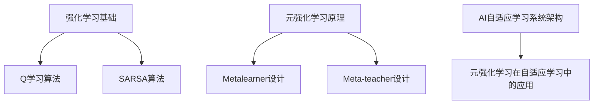

                 

# 《基于元强化学习的AI自适应学习系统》

## 关键词
- 元强化学习
- AI自适应学习系统
- 深度学习
- 强化学习
- 智能教育
- 智能健康管理系统

## 摘要
本文深入探讨了基于元强化学习的AI自适应学习系统的构建方法与应用。首先，我们介绍了元强化学习和AI自适应学习系统的基本概念和原理，然后详细解析了强化学习的基础知识，包括Q学习算法和SARSA算法。接着，我们讨论了元强化学习的关键技术，如Metalearner和Meta-teacher的设计与实现。文章进一步阐述了AI自适应学习系统的架构和开发流程，通过实际项目案例展示了元强化学习在自适应学习领域的应用。最后，我们对未来发展趋势与面临的挑战进行了展望，并提出了一些优化策略和解决方案。

## 目录大纲

### 第一部分：基础概念与原理

#### 第1章：引言与背景
##### 1.1 研究背景与意义
##### 1.2 元强化学习概述
##### 1.3 AI自适应学习系统简介

#### 第2章：元强化学习基础
##### 2.1 强化学习基础
###### 2.1.1 强化学习原理
###### 2.1.2 Q学习算法
###### 2.1.3 SARSA算法
##### 2.2 元强化学习原理
###### 2.2.1 元学习概念
###### 2.2.2 元强化学习框架
###### 2.2.3 元强化学习算法分类

#### 第3章：AI自适应学习系统架构
##### 3.1 自适应学习系统概述
###### 3.1.1 自适应学习需求
###### 3.1.2 自适应学习系统构成
##### 3.2 元强化学习在自适应学习中的应用
###### 3.2.1 应用场景分析
###### 3.2.2 应用挑战与解决方案

### 第二部分：核心算法原理

#### 第4章：深度强化学习
##### 4.1 深度强化学习原理
###### 4.1.1 DQN算法
###### 4.1.2 A3C算法
###### 4.1.3 DDPG算法

#### 第5章：元强化学习算法实现
##### 5.1 Metalearner设计
###### 5.1.1 Metalearner模型结构
###### 5.1.2 Metalearner优化策略
##### 5.2 Meta-teacher设计
###### 5.2.1 Meta-teacher模型结构
###### 5.2.2 Meta-teacher训练过程

#### 第6章：AI自适应学习系统开发
##### 6.1 系统开发流程
###### 6.1.1 系统需求分析
###### 6.1.2 系统设计
###### 6.1.3 系统实现

#### 第7章：项目实战
##### 7.1 项目简介
###### 7.1.1 项目背景
###### 7.1.2 项目目标
##### 7.2 实际应用案例
###### 7.2.1 案例一：自适应教育系统
###### 7.2.2 案例二：智能健康管理系统

### 第三部分：未来展望与挑战

#### 第8章：发展趋势与未来展望
##### 8.1 元强化学习发展趋势
###### 8.1.1 技术演进方向
###### 8.1.2 应用前景展望

#### 第9章：面临的挑战与解决方案
##### 9.1 算法性能优化
###### 9.1.1 性能评估方法
###### 9.1.2 优化策略
##### 9.2 数据隐私与安全性
###### 9.2.1 隐私保护需求
###### 9.2.2 安全性保障措施

## 附录
### 附录A：相关工具与资源
##### A.1 常用元强化学习框架
###### A.1.1 TensorFlow
###### A.1.2 PyTorch
###### A.1.3 其他框架

##### A.2 开发环境搭建
###### A.2.1 Python环境配置
###### A.2.2 深度学习框架安装
###### A.2.3 其他依赖库安装

### Mermaid 流程图


### 代码示例
```python
# 强化学习基础
class QLearningAgent:
    def __init__(self, learning_rate, discount_factor):
        self.learning_rate = learning_rate
        self.discount_factor = discount_factor
        self.q_values = defaultdict(float)

    def predict(self, state):
        return self.q_values[state]

    def update(self, state, action, reward, next_state, done):
        target = reward
        if not done:
            target += self.discount_factor * max(self.q_values[next_state])
        self.q_values[state][action] += self.learning_rate * (target - self.q_values[state][action])
```

### 附录A：相关工具与资源

#### A.1 常用元强化学习框架

##### A.1.1 TensorFlow
TensorFlow是一个开源的机器学习框架，它提供了丰富的工具和API，用于构建和训练深度学习模型。TensorFlow支持广泛的应用，包括计算机视觉、自然语言处理和强化学习。

- 官网：[TensorFlow官网](https://www.tensorflow.org/)
- 文档：[TensorFlow文档](https://www.tensorflow.org/tutorials)

##### A.1.2 PyTorch
PyTorch是一个基于Python的科学计算框架，它提供了动态计算图和自动微分系统，使得构建和训练深度学习模型变得更加直观和灵活。

- 官网：[PyTorch官网](https://pytorch.org/)
- 文档：[PyTorch文档](https://pytorch.org/tutorials)

##### A.1.3 其他框架
除了TensorFlow和PyTorch，还有许多其他的深度学习框架可供选择，如Keras、Theano等。

- Keras：[Keras官网](https://keras.io/)
- Theano：[Theano官网](https://www.theanocode.com/)

#### A.2 开发环境搭建

##### A.2.1 Python环境配置
在开始使用深度学习框架之前，需要配置Python环境。可以选择使用Anaconda来管理Python环境，以便轻松安装和管理各种库。

- Anaconda官网：[Anaconda官网](https://www.anaconda.com/)

##### A.2.2 深度学习框架安装
根据选择的深度学习框架，可以从官网下载安装包或使用pip命令安装。

- TensorFlow安装命令：`pip install tensorflow`
- PyTorch安装命令：`pip install torch`

##### A.2.3 其他依赖库安装
除了深度学习框架，可能还需要安装其他依赖库，如NumPy、Pandas等。

- NumPy官网：[NumPy官网](https://numpy.org/)
- Pandas官网：[Pandas官网](https://pandas.pydata.org/)

通过上述工具与资源的介绍，读者可以搭建起一个基本的深度学习开发环境，并开始探索元强化学习在AI自适应学习系统中的应用。在接下来的章节中，我们将深入讨论元强化学习的原理、核心算法以及其在实际项目中的应用。

