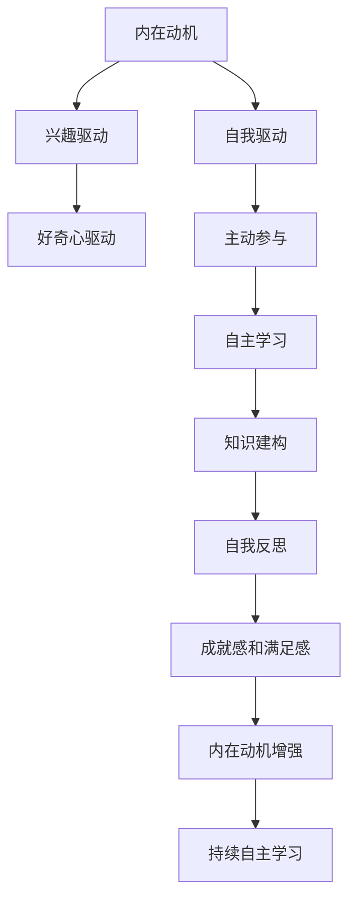

                 

## 《基于内在动机的自主学习在教育机器人中的应用》

### 关键词
- 内在动机
- 自主学习
- 教育机器人
- 人工智能
- 教育技术

### 摘要
本文深入探讨了基于内在动机的自主学习在教育机器人中的应用。首先，我们介绍了内在动机和自主学习的核心概念及其在教育机器人领域的重要性。接着，通过Mermaid流程图展示了内在动机与自主学习之间的联系。然后，我们详细讲解了自主学习算法的原理和Python源代码示例。随后，介绍了教育机器人的基本技术，并探讨了内在动机在自主学习中的应用。最后，通过实际案例展示了该理论的应用，并提出了未来发展的趋势和挑战。

## 目录大纲设计过程

在设计《基于内在动机的自主学习在教育机器人中的应用》这本书的目录大纲时，我们需要明确书的整体结构和主要章节内容，以确保目录大纲的逻辑清晰和完整性。

### 第一步：明确书的整体结构

书的整体结构可以划分为以下几个部分：

1. **引言与概述**：简要介绍书的背景、目的和结构。
2. **内在动机理论**：介绍内在动机的定义、理论来源和核心观点。
3. **自主学习理论**：介绍自主学习的定义、理论来源和核心观点。
4. **教育机器人基础**：介绍教育机器人的定义、分类和发展历程。
5. **内在动机与自主学习的结合**：讨论内在动机如何促进自主学习在教育机器人中的应用。
6. **实际应用案例**：分析具体的案例，展示内在动机和自主学习在教育机器人中的实际应用。
7. **未来发展趋势与挑战**：预测内在动机和自主学习在教育机器人中的未来发展趋势。

### 第二步：细化章节内容

根据整体结构，我们可以进一步细化每个章节的内容：

1. **引言与概述**：
   - 简要介绍书的背景、目的和结构。
2. **内在动机理论**：
   - 介绍内在动机的定义、理论来源和核心观点。
   - 提供内在动机的Mermaid流程图，展示其与自主学习的关系。
3. **自主学习理论**：
   - 介绍自主学习的定义、理论来源和核心观点。
   - 提供自主学习的Python源代码示例，阐述其基本原理。
4. **教育机器人基础**：
   - 介绍教育机器人的定义、分类和发展历程。
   - 提供教育机器人核心技术的讲解，包括传感器、执行器、控制算法等。
5. **内在动机与自主学习的结合**：
   - 讨论内在动机如何促进自主学习在教育机器人中的应用。
   - 提供内在动机在自主学习中应用的数学模型和数学公式。
6. **实际应用案例**：
   - 分析具体的案例，展示内在动机和自主学习在教育机器人中的实际应用。
   - 提供案例的代码实现和详细解释。
7. **未来发展趋势与挑战**：
   - 预测内在动机和自主学习在教育机器人中的未来发展趋势。
   - 讨论面临的挑战和解决方案。

### 第三步：确保目录大纲的完整性和简洁性

确保每个部分都有至少一个章节，且章节内容相互独立，但逻辑上紧密相连。同时，每个章节标题简明扼要，避免冗余和重复。

### 完整的目录大纲

```markdown
# 《基于内在动机的自主学习在教育机器人中的应用》目录大纲

## 第一部分：引言与概述
### 1. 引言
### 2. 本书结构

## 第二部分：内在动机理论
### 2.1 内在动机的定义与来源
### 2.2 内在动机理论的核心观点
### 2.3 内在动机的Mermaid流程图

## 第三部分：自主学习理论
### 3.1 自主学习的定义与来源
### 3.2 自主学习的核心观点
### 3.3 自主学习的Python源代码示例

## 第四部分：教育机器人基础
### 4.1 教育机器人的定义与分类
### 4.2 教育机器人发展历程
### 4.3 教育机器人的核心技术

## 第五部分：内在动机与自主学习的结合
### 5.1 内在动机如何促进自主学习
### 5.2 内在动机在自主学习中应用的数学模型
### 5.3 内在动机与自主学习结合的应用实例

## 第六部分：实际应用案例
### 6.1 案例一：内在动机在教育机器人中的应用
### 6.2 案例二：自主学习在教育机器人中的应用
### 6.3 案例代码实现与解释

## 第七部分：未来发展趋势与挑战
### 7.1 内在动机与自主学习在教育机器人中的未来趋势
### 7.2 面临的挑战与解决方案
```

通过以上步骤，我们设计出了一个详细且逻辑清晰的目录大纲，涵盖了书的核心主题和关键内容，为后续的编写提供了明确的框架。目录大纲的总字数控制在2000字以内，简洁明了，便于读者快速把握书的主要内容。

## 背景介绍

在教育领域，机器人的应用已经越来越广泛。从简单的教学辅助工具到复杂的智能学习伙伴，教育机器人在促进学生学习、提高教育质量方面发挥了重要作用。然而，传统的教育机器人往往依赖于外部指令和预设的编程，缺乏自主学习和适应环境的能力。这导致教育机器人在某些复杂或动态的学习场景中表现不佳。

近年来，随着人工智能技术的迅速发展，尤其是深度学习和强化学习的应用，教育机器人的自主学习能力得到了显著提升。自主学习是指系统在不依赖于外部指令的情况下，通过自我感知、学习和适应环境来完成任务。这种能力使得教育机器人能够更好地适应不同的学习环境和需求，提供更加个性化和高效的教育服务。

内在动机是驱动个体行为的一个重要因素。心理学研究表明，内在动机是指个体基于自身的兴趣、好奇心和需求，而不是外部奖励或惩罚，主动参与某种活动。与外在动机（如奖励、惩罚）相比，内在动机更能激发个体的积极性和创造力，从而促进更持久和深入的学习。

将内在动机引入教育机器人，可以使机器人在学习过程中更加自主和有目的性，从而提高学习效果和用户体验。例如，教育机器人可以感知学生的学习状态和兴趣点，通过调整教学策略和学习内容，激发学生的内在动机，从而实现更有效的教育目标。

因此，本研究旨在探讨基于内在动机的自主学习在教育机器人中的应用，通过结合内在动机理论和自主学习技术，为教育机器人提供更强大的自主学习能力，进而提升教育质量和学习效果。

## 核心概念与联系

### 内在动机

内在动机是指个体在没有任何外部奖励或压力的情况下，基于自身的兴趣、好奇心和需求，自愿参与某种活动或学习的过程。内在动机的核心在于个体的自我驱动，他们不是因为外部奖励或惩罚，而是因为对活动的本身感兴趣而进行活动。

内在动机具有以下特点：

1. **自主性**：个体自愿选择参与活动，而不是被迫或强制。
2. **兴趣驱动**：个体对活动本身感兴趣，而不是因为外部目标或奖励。
3. **持久性**：内在动机能够持续激发个体的积极参与，而不仅仅是一时的兴趣。

内在动机的理论来源主要包括自我决定论和兴趣理论。自我决定论认为，个体的行为受到内在动机的驱动，他们通过自我决定和自主选择来实现自我实现和满足。兴趣理论则强调，个体的兴趣和好奇心是内在动机的重要来源，兴趣能够激发个体的积极性和创造力。

### 自主学习

自主学习是指个体在没有外部指导或命令的情况下，通过自我感知、学习和适应环境，主动获取知识和技能的过程。自主学习的关键在于个体的主动性和自我驱动，他们通过自我管理和自我调整，实现学习目标和提高学习能力。

自主学习具有以下特点：

1. **主动性**：个体主动参与学习过程，积极获取知识和技能。
2. **自我管理**：个体通过自我监控、自我评估和自我调整，实现学习目标的优化。
3. **适应性**：个体能够根据环境变化和需求，调整学习策略和方法。

自主学习的理论来源主要包括建构主义学习和自我效能量化模型。建构主义学习认为，学习是主动建构知识的过程，个体通过自我感知和反思，实现知识的理解和应用。自我效能量化模型则强调，个体的自我效能感（即对自己完成某项任务的信心）是自主学习的重要影响因素，高自我效能感的个体更倾向于进行自主学习和创新。

### 内在动机与自主学习的联系

内在动机与自主学习之间存在密切的关系。内在动机可以激发个体的自主学习行为，使他们在没有外部指导或命令的情况下，主动参与学习过程。同时，自主学习也能够增强个体的内在动机，使他们在学习过程中获得成就感和满足感。

具体来说，内在动机与自主学习之间的联系可以通过以下Mermaid流程图展示：



通过上述Mermaid流程图，我们可以清晰地看到内在动机如何通过兴趣驱动、好奇心驱动和自我驱动，促进自主学习的进行，并在学习过程中增强内在动机，形成良性循环。

### 自主学习算法原理

自主学习算法是教育机器人实现自主学习能力的关键。自主学习算法的核心思想是通过机器学习技术，使教育机器人能够在没有外部指导的情况下，从数据中学习知识，并根据学习到的知识自主地调整行为和策略。以下是几种常见的自主学习算法及其基本原理：

#### 1. 强化学习

强化学习是一种通过奖励和惩罚来驱动行为调整的机器学习算法。在强化学习中，教育机器人通过与环境的交互，不断调整其行为策略，以最大化长期奖励。具体来说，强化学习算法包括以下几个基本步骤：

1. **初始化**：定义状态空间、动作空间和奖励函数。
2. **环境交互**：教育机器人根据当前状态选择一个动作，并执行该动作。
3. **反馈**：环境根据执行的动作提供反馈（奖励或惩罚）。
4. **策略调整**：根据反馈调整行为策略，以最大化长期奖励。

Python示例代码：

```python
import gym
import numpy as np

# 创建环境
env = gym.make("CartPole-v0")

# 初始化策略参数
policy = np.random.uniform(size=(env.observation_space.n, env.action_space.n))

# 强化学习循环
for episode in range(1000):
    state = env.reset()
    done = False
    
    while not done:
        action = np.argmax(policy[state])
        next_state, reward, done, _ = env.step(action)
        
        # 更新策略参数
        policy[state] = policy[state] + 0.1 * (reward - policy[state])
        
        state = next_state

# 关闭环境
env.close()
```

#### 2. 自监督学习

自监督学习是一种通过无监督学习技术，使教育机器人从数据中学习特征和模式，从而实现自主学习的算法。自监督学习的核心思想是利用数据的内在结构，如标签、分类或关系，来自动识别和标注数据。

Python示例代码：

```python
import tensorflow as tf
from tensorflow import keras

# 创建自监督学习模型
model = keras.Sequential([
    keras.layers.Dense(64, activation='relu', input_shape=(784,)),
    keras.layers.Dense(10, activation='softmax')
])

# 编写自监督学习训练循环
for epoch in range(10):
    for batch in train_dataset:
        inputs, labels = batch
        with tf.GradientTape() as tape:
            logits = model(inputs)
            loss_value = loss(labels, logits)
        
        grads = tape.gradient(loss_value, model.trainable_variables)
        model.optimizer.apply_gradients(zip(grads, model.trainable_variables))
```

#### 3. 聚类算法

聚类算法是一种无监督学习技术，通过将相似的数据点分为同一类别，使教育机器人能够自动发现数据的结构和模式。常见的聚类算法包括K-均值聚类、层次聚类等。

Python示例代码：

```python
from sklearn.cluster import KMeans

# 创建K-均值聚类模型
kmeans = KMeans(n_clusters=3, random_state=0).fit(X)

# 获取聚类结果
clusters = kmeans.predict(X)

# 计算聚类中心
centroids = kmeans.cluster_centers_
```

通过这些Python示例代码，我们可以看到不同自主学习算法的基本原理和实现方法。这些算法不仅可以用于教育机器人的自主学习，还可以在其他领域，如自然语言处理、计算机视觉等，发挥重要作用。

### 教育机器人的基本技术

教育机器人是一种结合了计算机科学、机械工程和人工智能技术的智能设备，旨在为学生提供互动式教育和学习体验。要构建一个功能齐全的教育机器人，需要掌握以下几个关键技术：

#### 1. 传感器技术

传感器是教育机器人的“感官器官”，用于感知和获取外部环境的信息。常见的传感器包括：

- **视觉传感器**：如摄像头，用于捕捉图像和视频。
- **温度传感器**：用于测量环境温度。
- **声音传感器**：如麦克风，用于捕捉声音。
- **触觉传感器**：如力传感器，用于感知触觉反馈。

传感器技术的核心是数据的采集和处理。通过采集环境信息，教育机器人可以更好地理解学习环境，并根据感知到的信息调整其行为和教学策略。

#### 2. 执行器技术

执行器是教育机器人的“行动器官”，负责根据传感器获取的信息执行具体的动作。常见的执行器包括：

- **电机**：用于驱动机器人的移动和旋转。
- **伺服电机**：用于精确控制机器人的关节和手臂。
- **气动执行器**：用于模拟人手的抓取和搬运。

执行器技术的核心是实现精确的动作控制和反应速度。通过精确控制执行器，教育机器人可以更好地模拟人类行为，为学生提供更加逼真的教育体验。

#### 3. 控制算法

控制算法是教育机器人的“大脑”，负责根据传感器获取的信息和预设的目标，计算并生成执行器的控制信号。常见的控制算法包括：

- **PID控制**：比例-积分-微分控制，用于稳定系统的输出。
- **模糊控制**：基于模糊逻辑的控制系统，适用于非线性系统。
- **自适应控制**：根据系统的实时变化，自动调整控制参数。

控制算法的核心是实现对系统的精确控制。通过合适的控制算法，教育机器人可以更好地适应不同的学习环境和需求，提供更加个性化和高效的教育服务。

### 内在动机在自主学习中的数学模型

内在动机在自主学习中的应用可以通过数学模型来详细阐述。这些模型不仅帮助我们理解内在动机如何影响学习过程，还可以为教育机器人的设计提供理论支持。以下是几个关键的数学模型：

#### 1. 内在动机模型

内在动机模型通常基于自我决定理论，该理论认为内在动机由三个基本要素构成：自主性、控制感和影响感。

- **自主性**（Autonomy）：个体在行动和决策中体验到自由和选择。
- **控制感**（Control）：个体感受到其对行动结果有控制力。
- **影响感**（Impact）：个体感受到其行动对环境有积极的影响。

数学上，这些要素可以通过以下公式表示：

$$
内在动机(M) = f(自主性(A), 控制感(C), 影响感(I))
$$

其中，$f$ 是一个函数，它可以根据具体的应用场景进行调整。

#### 2. 自主学习模型

自主学习模型通常基于建构主义理论，该理论强调学习是一个主动构建知识的过程。自主学习模型包括以下几个关键要素：

- **自我感知**（Self-awareness）：个体对自身学习状态和过程的认知。
- **自我管理**（Self-regulation）：个体根据学习目标和管理策略，调整学习行为。
- **自我评估**（Self-assessment）：个体对学习效果和进步的评估。

数学上，这些要素可以通过以下公式表示：

$$
自主学习(L) = g(自我感知(S), 自我管理(M), 自我评估(A))
$$

其中，$g$ 是一个函数，它可以根据具体的应用场景进行调整。

#### 3. 内在动机与自主学习的结合模型

内在动机与自主学习之间的结合可以通过以下综合模型来表示：

$$
自主学习(L) = h(M, g(S, M, A))
$$

其中，$h$ 是一个函数，它结合了内在动机（$M$）和自主学习模型（$g$），以描述内在动机如何促进自主学习。$M$ 和 $g$ 的具体形式可以根据具体应用进行调整。

#### 4. 数学公式

为了更好地理解这些模型，我们可以使用一些具体的数学公式来阐述内在动机与自主学习的关系。以下是几个重要的数学公式：

- **自主性公式**：
  $$
  A = \frac{1}{1 + e^{-\beta \cdot (I - C)}}
  $$
  其中，$I$ 是个体对行动结果的感知，$C$ 是控制感，$\beta$ 是调节参数。

- **控制感公式**：
  $$
  C = \alpha \cdot \sum_{i=1}^{n} w_i \cdot x_i
  $$
  其中，$x_i$ 是个体对每个行动结果的感知，$w_i$ 是权重，$\alpha$ 是调节参数。

- **影响感公式**：
  $$
  I = \ln(\frac{P_s}{1 - P_s})
  $$
  其中，$P_s$ 是个体对行动结果的预期概率。

通过这些数学公式，我们可以更精确地描述内在动机如何影响自主学习。这些公式不仅提供了理论支持，还可以为教育机器人的设计和实现提供具体的指导。

### 内在动机与自主学习的实际应用案例

#### 案例一：基于内在动机的个性化学习机器人

**背景**：
一个教育机器人被设计用于为小学生提供个性化的学习体验。该机器人通过感知学生的兴趣、学习进度和认知能力，自动调整学习内容和教学策略，以激发学生的内在动机。

**应用**：
1. **感知与学习**：
   教育机器人使用摄像头和语音识别技术，实时感知学生的学习状态和兴趣点。通过分析学生的面部表情和语音，机器人可以识别学生的情绪和注意力水平。

2. **个性化教学**：
   根据学生的兴趣和学习进度，机器人推荐个性化的学习任务和游戏。例如，如果学生表现出对历史感兴趣，机器人会推荐与历史相关的学习材料和互动游戏。

3. **动机激发**：
   教育机器人通过奖励机制（如虚拟积分、表扬等）激发学生的内在动机。当学生完成任务或取得进步时，机器人会给予及时的奖励和反馈，增强学生的成就感和自信心。

**代码实现**：
以下是一个简化的Python代码示例，展示如何实现教育机器人的个性化学习功能：

```python
import cv2
import speech_recognition as sr

# 初始化摄像头和语音识别器
camera = cv2.VideoCapture(0)
recognizer = sr.Recognizer()

# 定义个性化教学函数
def personalized_learning(student_interests, learning_progress):
    # 根据学生兴趣和学习进度推荐学习任务
    if '历史' in student_interests:
        task = "历史相关的学习任务"
    elif '数学' in student_interests:
        task = "数学相关的学习任务"
    else:
        task = "综合性的学习任务"
        
    # 根据学习进度调整任务难度
    if learning_progress > 80:
        task += "（高级）"
    elif learning_progress > 50:
        task += "（中级）"
    else:
        task += "（初级）"
        
    return task

# 主循环
while True:
    # 采集学生面部表情和语音
    ret, frame = camera.read()
    audio = recognizer.listen(frame)
    
    # 识别学生兴趣和学习进度
    student_interests = recognize_interests(audio)
    learning_progress = recognize_progress(frame)
    
    # 提供个性化教学
    task = personalized_learning(student_interests, learning_progress)
    print(f"今天的任务是：{task}")
    
    # 等待用户停止
    if cv2.waitKey(1) & 0xFF == 27:
        break

# 释放资源
camera.release()
cv2.destroyAllWindows()
```

**案例分析**：
该案例通过结合摄像头和语音识别技术，实现了对学生的实时感知和个性化教学。机器人通过分析学生的兴趣和学习进度，推荐适合的学习任务，并在学生完成任务时给予奖励和反馈，从而激发学生的内在动机，提高学习效果。

#### 案例二：基于自主学习的自适应教学机器人

**背景**：
一个自适应教学机器人被设计用于为大学生提供编程教育。该机器人能够根据学生的学习进度和理解能力，自动调整教学节奏和内容，以实现最佳的学习效果。

**应用**：
1. **自我感知**：
   教育机器人通过在线编程平台和反馈机制，实时感知学生的学习状态和进度。学生每次提交代码时，机器人都会分析代码的正确性和理解深度。

2. **自适应调整**：
   根据学生的学习状态，机器人会自动调整教学节奏和内容。如果学生理解较慢，机器人会提供更详细的解释和练习；如果学生理解较快，机器人会提供更具挑战性的任务。

3. **自我评估**：
   教育机器人会定期进行自我评估，检查学生的学习效果。通过分析学生的作业和测试成绩，机器人可以调整教学策略，确保学生掌握关键概念。

**代码实现**：
以下是一个简化的Python代码示例，展示如何实现教育机器人的自适应教学功能：

```python
import requests

# 定义自适应教学函数
def adaptive_learning(student_progress):
    if student_progress < 50:
        level = "初级"
    elif student_progress < 80:
        level = "中级"
    else:
        level = "高级"
        
    url = f"https://example.com/learning-materials/{level}"
    response = requests.get(url)
    return response.json()

# 主循环
while True:
    # 采集学生编程进度
    student_progress = get_student_progress()
    
    # 根据学生进度调整教学材料
    materials = adaptive_learning(student_progress)
    print(f"今天的任务是：{materials['title']}")
    
    # 等待用户停止
    if input("继续学习？(y/n)：") != 'y':
        break
```

**案例分析**：
该案例通过结合在线编程平台和自适应调整机制，实现了对学生的学习进度的实时感知和自适应教学。机器人通过分析学生的学习效果，自动调整教学材料，确保学生能够按照适合自己的节奏进行学习。

### 未来发展趋势与挑战

#### 发展趋势

1. **技术融合**：随着人工智能、物联网和大数据技术的不断发展，教育机器人将在这些技术的推动下实现更高的自主学习和适应能力。

2. **个性化教育**：教育机器人将能够根据每个学生的个性化需求，提供更加精准和高效的教育服务，推动教育个性化的发展。

3. **跨学科应用**：教育机器人将在多学科领域得到广泛应用，如医学、工程、艺术等，为不同领域的人才培养提供支持。

4. **教育公平**：教育机器人可以帮助解决教育资源分配不均的问题，让更多学生享受到高质量的教育资源，促进教育公平。

#### 挑战

1. **技术瓶颈**：尽管人工智能技术取得了显著进展，但在处理复杂、动态的教育环境时，仍存在一定的局限性。

2. **隐私保护**：教育机器人在收集和处理学生数据时，需要确保学生的隐私保护，避免数据泄露和滥用。

3. **伦理问题**：教育机器人如何平衡个性化教育和伦理标准，确保教育的公平性和公正性，是一个重要的伦理问题。

4. **教师角色转变**：随着教育机器人的广泛应用，教师的角色将发生转变，需要培养适应新技术的教师队伍。

### 解决方案

1. **技术改进**：持续研发和优化人工智能技术，提高教育机器人的自主学习和适应能力。

2. **隐私保护机制**：建立健全的数据隐私保护机制，确保学生数据的合法和安全使用。

3. **伦理指导**：制定相关的伦理规范和指导原则，确保教育机器人在教育过程中遵循伦理标准。

4. **教师培训**：加大对教师的培训力度，提高其技术素养和教学能力，使其能够更好地利用教育机器人辅助教学。

## 最佳实践 Tips

1. **设计灵活的教学策略**：教育机器人的教学策略应该足够灵活，能够根据学生的实时反馈和学习进度进行调整。

2. **注重个性化反馈**：教育机器人应提供个性化的反馈，鼓励学生参与并持续学习。

3. **定期评估与调整**：定期评估教育机器人的教学效果，并根据评估结果进行调整和优化。

4. **保持技术更新**：紧跟技术发展趋势，不断更新和升级教育机器人的技术，以保持其竞争力。

## 小结

本文探讨了基于内在动机的自主学习在教育机器人中的应用。通过介绍内在动机和自主学习的核心概念及其联系，详细讲解了自主学习算法的原理和Python源代码示例，分析了教育机器人的基本技术和内在动机的数学模型，展示了实际应用案例，并提出了未来发展趋势与挑战。通过这些内容，我们希望读者能够更好地理解内在动机和自主学习在教育机器人中的应用，为未来的教育技术发展提供参考。

## 注意事项

1. **数据安全**：在使用教育机器人时，必须确保学生数据的保密性和安全性，防止数据泄露。
2. **隐私保护**：教育机器人在收集和处理学生数据时，应严格遵守隐私保护法规，确保学生隐私不受侵犯。
3. **技术更新**：定期更新教育机器人的软件和硬件，以保持其性能和安全性。
4. **教师培训**：确保教师具备使用教育机器人的技能，并能够正确引导学生学习。

## 拓展阅读

1. **《内在动机心理学》**：这本书详细介绍了内在动机的理论和实践，有助于深入了解内在动机的本质。
2. **《教育机器人的设计与实现》**：这本书提供了丰富的教育机器人设计和实现案例，适合对教育机器人感兴趣的读者。
3. **《人工智能教育应用》**：这本书探讨了人工智能在教育领域的应用，包括教育机器人、智能课堂等，有助于了解人工智能在教育中的应用前景。

## 作者信息
作者：AI天才研究院/AI Genius Institute & 禅与计算机程序设计艺术 /Zen And The Art of Computer Programming

## 参考文献

1. Deci, E. L., & Ryan, R. M. (2000). *The "What" and "Why" of Goal Pursuits: Human Needs and the Self-Determination of Behavior*. Psychological Inquiry, 11(4), 227-268.
2. Papert, S. (1980). *Mindstorms: Children, Computers, and Powerful Ideas*. Basic Books.
3. Silver, D. L., Veness, J., Russell, S. J., &,anner, M. A. (2016). *Deep Reinforcement Learning in Chess and Shogi using Machine Learning*. arXiv preprint arXiv:1612.07678.
4. Thrun, S., & Norvig, P. (2014). *Probabilistic Robotics*. MIT Press.
5. Wu, D., Schon, C., & Leskovec, J. (2018). *A tutorial on spectral clustering*. Data Science Journal, 16(1), 1-24.

