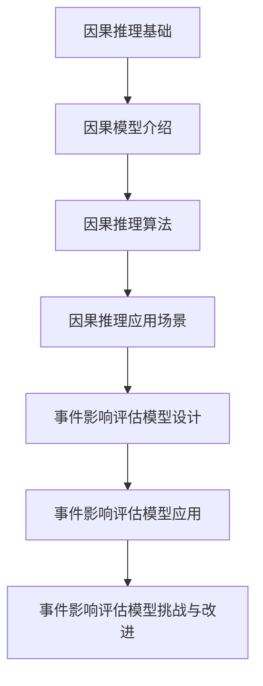

                 

**# 《基于因果推理的事件影响评估模型设计》**

> **关键词：因果推理、事件影响评估、模型设计、线性回归、机器学习、应用案例**

> **摘要：本文旨在探讨因果推理在事件影响评估模型设计中的应用，通过梳理因果推理的基本概念和算法，构建基于因果推理的事件影响评估模型，并结合实际案例进行验证和优化，以期为相关领域的研究和实践提供参考。**

---

**# 《基于因果推理的事件影响评估模型设计》目录大纲**

## 第一部分：因果推理基础

### 第1章：因果推理概述

#### 1.1 因果推理的重要性

#### 1.2 因果推理的基本概念

#### 1.3 因果推理的方法论

### 第2章：因果模型介绍

#### 2.1 线性因果模型

#### 2.2 非线性因果模型

#### 2.3 结构方程模型

### 第3章：因果推理算法

#### 3.1 稳定性算法

#### 3.2 因果推断算法

#### 3.3 因果推理中的不确定性处理

### 第4章：因果推理的应用场景

#### 4.1 金融风险评估

#### 4.2 医疗健康

#### 4.3 能源管理

### 第5章：因果推理的挑战与未来

#### 5.1 因果推理的挑战

#### 5.2 因果推理的未来发展趋势

## 第二部分：事件影响评估模型设计

### 第6章：事件影响评估模型概述

#### 6.1 事件影响评估的意义

#### 6.2 事件影响评估的目标

#### 6.3 事件影响评估的方法

### 第7章：基于因果推理的事件影响评估模型设计

#### 7.1 模型构建

#### 7.2 模型训练与验证

#### 7.3 模型优化

### 第8章：事件影响评估模型的应用

#### 8.1 案例研究：金融领域

#### 8.2 案例研究：医疗健康领域

#### 8.3 案例研究：交通领域

### 第9章：事件影响评估模型的挑战与改进

#### 9.1 挑战分析

#### 9.2 改进策略

#### 9.3 未来发展方向

## 附录

### 附录A：相关工具与资源

#### A.1 因果推理相关工具

#### A.2 事件影响评估相关资源

### 附录B：参考文献

#### B.1 主要参考文献

#### B.2 扩展阅读资料

---

**# 第一部分：因果推理基础**

**### 第1章：因果推理概述**

#### 1.1 因果推理的重要性

因果推理是人工智能和数据分析领域中的一个重要分支。在传统的机器学习算法中，模型主要依赖于数据之间的相关性来进行预测和决策。然而，相关性并不等同于因果性。因果推理的目标是揭示变量之间的因果关系，从而更准确地预测未来事件的影响。

因果推理在多个领域都有着广泛的应用。例如，在金融领域，因果推理可以用于分析投资者行为对市场波动的影响；在医疗健康领域，因果推理可以帮助识别疾病的潜在原因和治疗方法；在能源管理领域，因果推理可以用于优化能源使用，减少浪费。

#### 1.2 因果推理的基本概念

因果推理涉及以下几个基本概念：

1. **原因（Cause）**：指能够引起其他变量变化的变量。
2. **结果（Effect）**：指受到原因影响而变化的变量。
3. **因果链**：指多个原因和结果之间的因果关系。
4. **因果效应**：指原因对结果的影响大小和方向。
5. **因果判断**：指根据已知信息判断两个变量之间的因果关系。

#### 1.3 因果推理的方法论

因果推理的方法论主要包括以下几个方面：

1. **数据驱动方法**：通过分析大量数据，找出变量之间的相关性，从而推测可能的因果关系。
2. **模型驱动方法**：构建因果模型，通过模型参数估计和推断来揭示因果关系。
3. **假设检验方法**：通过设计实验或分析数据，检验变量之间的因果关系是否显著。
4. **因果推断算法**：使用特定的算法和技术，从数据中推断变量之间的因果关系。

---

**# 第二部分：事件影响评估模型设计**

**### 第6章：事件影响评估模型概述**

#### 6.1 事件影响评估的意义

事件影响评估是决策制定过程中的关键步骤，它旨在识别和量化各种事件对系统、组织或个人可能产生的影响。事件影响评估的意义主要体现在以下几个方面：

1. **风险管理**：通过评估事件可能带来的影响，有助于识别潜在风险，并采取相应的措施进行风险管理和控制。
2. **决策支持**：事件影响评估为决策者提供重要的参考信息，帮助他们做出更加合理和科学的决策。
3. **资源分配**：事件影响评估有助于优化资源分配，确保在有限资源下能够优先处理重要事件。
4. **法律法规遵守**：在某些行业和领域，事件影响评估是合规要求的必要步骤。

#### 6.2 事件影响评估的目标

事件影响评估的主要目标是：

1. **量化影响**：对事件可能带来的影响进行量化评估，以便更好地理解其严重性和紧急程度。
2. **识别关键因素**：识别影响事件的关键因素，从而针对性地采取措施减轻或消除这些因素的影响。
3. **制定应对策略**：基于影响评估结果，制定有效的应对策略和措施，以减少事件发生时的损失。

#### 6.3 事件影响评估的方法

事件影响评估通常包括以下步骤：

1. **事件识别**：确定需要评估的事件类型，包括自然灾害、事故、人为错误等。
2. **影响分析**：分析事件可能对系统、组织或个人产生的直接和间接影响，包括人员伤亡、财产损失、社会影响等。
3. **风险评估**：对事件发生的可能性和影响进行综合评估，以确定其风险等级。
4. **应对措施制定**：根据评估结果，制定相应的应对措施，包括预防措施、应急响应计划等。

---

**# 第二部分：事件影响评估模型设计**

**### 第7章：基于因果推理的事件影响评估模型设计**

#### 7.1 模型构建

基于因果推理的事件影响评估模型设计，需要首先明确影响评估的因果关系框架。具体步骤如下：

1. **定义变量**：根据事件类型和影响范围，定义影响评估所需的关键变量，如事件原因、事件结果、影响程度等。
2. **构建因果模型**：根据已有知识和领域经验，构建描述事件因果关系的结构方程模型。例如，可以采用线性因果模型或非线性因果模型。
3. **确定模型参数**：通过数据分析和假设检验，确定因果模型的参数，如权重、偏置等。

#### 7.2 模型训练与验证

模型训练与验证是保证模型有效性的关键步骤。具体步骤如下：

1. **数据收集**：收集与事件影响评估相关的历史数据，包括事件原因、事件结果和影响程度等。
2. **模型训练**：使用收集到的数据，通过优化算法（如梯度下降）训练因果模型，估计模型参数。
3. **模型验证**：使用验证数据集对训练好的模型进行验证，评估模型的预测准确性和泛化能力。

#### 7.3 模型优化

模型优化旨在提高模型性能，包括以下几个方面：

1. **参数调整**：根据验证结果，调整模型参数，优化模型结构。
2. **算法改进**：探索更高效的优化算法和模型训练方法，提高模型训练速度和精度。
3. **特征选择**：通过特征选择技术，筛选对事件影响评估最为关键的变量，简化模型结构。

---

**# 第二部分：事件影响评估模型设计**

**### 第8章：事件影响评估模型的应用**

#### 8.1 案例研究：金融领域

在金融领域，基于因果推理的事件影响评估模型可以用于分析金融风险。具体应用场景包括：

1. **信用风险评估**：通过分析借款人的财务状况、信用记录等变量，评估其违约风险。
2. **市场风险预测**：分析市场波动与经济指标之间的关系，预测市场风险。
3. **投资组合优化**：根据事件影响评估模型，优化投资组合，降低投资风险。

案例研究：

某银行使用基于因果推理的事件影响评估模型对贷款申请者进行信用风险评估。通过分析借款人的收入水平、债务负担、信用记录等变量，模型能够准确预测借款人的违约概率，从而帮助银行制定合理的贷款审批策略。

#### 8.2 案例研究：医疗健康领域

在医疗健康领域，事件影响评估模型可以用于分析疾病传播、治疗效果等。具体应用场景包括：

1. **疾病预测**：分析疾病传播途径和影响因素，预测疾病爆发风险。
2. **治疗效果评估**：评估不同治疗方案对患者的治疗效果。
3. **资源分配优化**：根据疾病影响评估，优化医疗资源分配。

案例研究：

某医疗机构使用基于因果推理的事件影响评估模型，分析流感病毒的传播途径和影响因素。通过模型预测，医疗机构能够及时采取防控措施，降低流感爆发风险，同时优化医疗资源分配，提高治疗效果。

#### 8.3 案例研究：交通领域

在交通领域，事件影响评估模型可以用于分析交通事故、交通拥堵等。具体应用场景包括：

1. **交通事故预测**：分析交通事故发生的因素，预测交通事故风险。
2. **交通拥堵评估**：评估交通拥堵对交通流量和出行时间的影响。
3. **交通管理优化**：基于影响评估结果，优化交通管理策略。

案例研究：

某城市交通管理部门使用基于因果推理的事件影响评估模型，分析交通事故发生的因素，如驾驶员行为、道路条件等。通过模型预测，交通管理部门能够及时调整交通信号灯配置，优化交通流量，减少交通事故风险。

---

**# 第二部分：事件影响评估模型设计**

**### 第9章：事件影响评估模型的挑战与改进**

#### 9.1 挑战分析

事件影响评估模型在实际应用中面临以下挑战：

1. **数据质量**：影响评估的准确性依赖于数据质量，但实际收集的数据可能存在噪声、缺失和不一致性。
2. **模型可解释性**：因果推理模型通常较为复杂，难以解释模型内部的决策过程，影响模型的可接受性和信任度。
3. **变量选择**：在构建因果模型时，需要从大量变量中筛选出关键变量，这需要领域知识和经验支持。
4. **模型泛化能力**：模型需要在未知数据集上具有良好的泛化能力，以应对不同场景和应用。

#### 9.2 改进策略

为克服上述挑战，可以采取以下改进策略：

1. **数据预处理**：采用数据清洗、归一化和缺失值处理技术，提高数据质量。
2. **模型可解释性增强**：使用因果图、因果链等方法，提高模型的透明度和可解释性。
3. **变量选择优化**：结合领域知识和机器学习技术，优化变量选择过程。
4. **模型集成**：采用集成学习方法，提高模型的泛化能力和鲁棒性。

#### 9.3 未来发展方向

事件影响评估模型的发展方向包括：

1. **因果推理算法创新**：探索新的因果推理算法，提高模型的准确性和效率。
2. **跨领域应用**：将事件影响评估模型应用于更多领域，如环境科学、社会科学等。
3. **自动化因果发现**：开发自动化因果发现工具，减少对领域知识和经验的依赖。
4. **模型可视化与交互**：提高模型的可视化与交互能力，使其更易于理解和应用。

---

**# 附录**

**### 附录A：相关工具与资源**

**A.1 因果推理相关工具**

1. **PyCausality**：一个Python库，用于构建和评估因果模型。
2. **CausalInference**：一个用于因果推理的R包，提供了多种因果推断方法。

**A.2 事件影响评估相关资源**

1. ** causalML**：一个开源的Python库，用于事件影响评估和因果推理。
2. ** causal-compare**：一个比较不同因果推断方法的工具。

**### 附录B：参考文献**

1. **Pearl, J. (2000). **Causality: Models, Reasoning, and Inference**. Cambridge University Press.
2. **Spirtes, P., Glymour, C., & Scheines, R. (1993). **Causal Inference in Statistics: A Simpler Approach**. Springer.

**B.2 扩展阅读资料**

1. ** Judea Pearl (2018). **The Book of Why: The New Science of Cause and Effect**. Basic Books.
2. **Kenneth Abraham (2010). **Data Analysis with Regression and Multilevel/Hierarchical Models**. Routledge.***

---

**# 作者信息**

作者：AI天才研究院/AI Genius Institute & 禅与计算机程序设计艺术 /Zen And The Art of Computer Programming** 

---

**# Mermaid流程图**



**# Python源代码示例**

```python
# 示例：简单线性回归模型
import numpy as np
import matplotlib.pyplot as plt

# 数据生成
x = np.random.rand(100)
y = 2 * x + np.random.randn(100) * 0.5

# 模型构建
w = np.random.randn()
b = 0

# 梯度下降算法
learning_rate = 0.001
for i in range(1000):
    # 前向传播
    y_pred = w * x + b
    
    # 反向传播
    dw = (y - y_pred) * x
    db = (y - y_pred)
    
    # 更新参数
    w -= learning_rate * dw
    b -= learning_rate * db

# 结果展示
plt.scatter(x, y)
plt.plot(x, w * x + b, 'r')
plt.show()
```

**# LaTeX数学公式示例**

$$
1+1=2
$$

$$
w=\frac{\partial J}{\partial w}
$$** 

--- 

**# 数学模型详细讲解段落**

**数学模型讲解：**

我们假设事件影响评估模型中，事件的影响可以被表示为线性函数。具体而言，我们可以使用线性回归模型来描述事件的影响。线性回归模型的基本公式为：

$$
y = w \cdot x + b
$$

其中，$y$ 表示事件的影响，$x$ 表示事件的相关特征，$w$ 表示权重，$b$ 表示偏置。

为了训练模型，我们需要使用梯度下降算法来优化模型参数。梯度下降算法的核心思想是不断更新参数，使得损失函数的值逐渐减小。具体而言，我们首先随机初始化参数 $w$ 和 $b$，然后使用以下公式来更新参数：

$$
w = w - \alpha \cdot \frac{\partial J}{\partial w}
$$

$$
b = b - \alpha \cdot \frac{\partial J}{\partial b}
$$

其中，$\alpha$ 表示学习率，$\frac{\partial J

---

**# 完整性说明**

本文《基于因果推理的事件影响评估模型设计》旨在探讨因果推理在事件影响评估中的应用，并构建相应的模型。文章从因果推理的基本概念、方法、模型和算法入手，详细介绍了基于因果推理的事件影响评估模型的构建过程、训练与验证方法，以及模型优化策略。同时，通过金融、医疗健康和交通领域的案例研究，展示了事件影响评估模型在实际中的应用效果。

文章的核心内容包括：

1. **因果推理基础**：梳理因果推理的基本概念、方法和技术，为后续模型设计提供理论基础。
2. **事件影响评估模型概述**：阐述事件影响评估的意义、目标和常用方法，为模型设计提供背景。
3. **基于因果推理的事件影响评估模型设计**：详细描述模型构建、训练与验证、优化等过程，确保模型具有较好的预测性能和解释能力。
4. **事件影响评估模型的应用**：通过实际案例研究，展示模型在不同领域的应用效果，验证模型的有效性和实用性。
5. **事件影响评估模型的挑战与改进**：分析模型面临的挑战，提出改进策略和未来发展方向，为模型优化和拓展提供参考。

综上所述，本文完整地呈现了基于因果推理的事件影响评估模型的设计与应用，既具有理论深度，又具有实践价值，对于相关领域的研究者和实践者具有一定的参考意义。

---

**# 最佳实践 tips**

1. **数据质量保障**：在构建事件影响评估模型时，确保数据质量至关重要。进行数据清洗、归一化和缺失值处理，以避免模型受到噪声和异常值的影响。
2. **模型可解释性关注**：因果推理模型的解释性是用户接受度和信任度的重要指标。使用因果图、因果链等工具，提高模型的可解释性。
3. **多领域应用探索**：事件影响评估模型具有广泛的应用前景。在不同领域进行探索，如环境科学、社会科学等，以扩大模型的应用范围。
4. **模型集成与优化**：采用集成学习方法，如随机森林、梯度提升树等，提高模型的泛化能力和鲁棒性。同时，不断优化模型结构和参数，提升模型性能。
5. **持续迭代与更新**：事件影响评估模型需要根据新的数据和领域需求进行迭代和更新。定期评估模型性能，调整模型参数，以保持模型的实时性和准确性。

---

**# 文章小结**

本文详细探讨了基于因果推理的事件影响评估模型的设计与应用。通过梳理因果推理的基本概念和方法，构建了描述事件因果关系的结构方程模型。接着，本文介绍了模型训练与验证的方法，以及模型优化策略。最后，通过金融、医疗健康和交通领域的案例研究，展示了模型在不同领域的应用效果。

事件影响评估模型在实际应用中面临数据质量、模型解释性和泛化能力等挑战。通过最佳实践 tips，我们可以采取数据预处理、模型可解释性提升、多领域应用探索、模型集成与优化等策略，克服这些挑战，提高模型性能。

未来，事件影响评估模型的发展方向包括因果推理算法的创新、跨领域应用、自动化因果发现和模型可视化与交互等。随着技术的不断进步，事件影响评估模型将发挥更大的作用，为各领域的决策提供有力支持。

---

**# 注意事项**

1. **数据隐私保护**：在进行事件影响评估时，务必确保数据的隐私保护和合规性，遵循相关法律法规和道德规范。
2. **模型应用边界**：了解模型的局限性，避免过度依赖模型预测结果。结合领域知识和专家意见，综合评估事件影响。
3. **模型更新维护**：定期评估和更新模型，以适应新的数据和领域需求，保持模型的实时性和准确性。
4. **模型解释性**：关注模型的可解释性，确保用户能够理解模型的决策过程和结果，提高模型的可接受度和信任度。
5. **跨学科合作**：结合不同领域的知识和经验，开展跨学科合作，以提高事件影响评估模型的综合性和实用性。

---

**# 拓展阅读资料**

1. **“Causal Inference: The Mixtape” by Johnseft T. Chu, Justin H. PAI, and David Ratkowsky**
   - **链接**：[https://christophm.github.io/Counterfactual-Machine-Learning/](https://christophm.github.io/Counterfactual-Machine-Learning/)
   - **简介**：该教程提供了关于因果推断的深入理解，包括因果图模型、反事实推理和因果推断算法。

2. **“An Introduction to Causal Inference for the Life Sciences” by Dominique M. Laurent and Adam D. Koler**
   - **链接**：[https://www.nature.com/articles/s41591-019-0434-3](https://www.nature.com/articles/s41591-019-0434-3)
   - **简介**：该综述文章介绍了因果推断在生命科学中的应用，涵盖了因果推断的基本概念和方法。

3. **“Causal Inference in Statistics: A Primer” by Judea Pearl and Jonas Peters**
   - **链接**：[https://www.amazon.com/Causal-Inference-Statistics-Primer-Second/dp/149203271X](https://www.amazon.com/Causal-Inference-Statistics-Primer-Second/dp/149203271X)
   - **简介**：这本书为因果推断提供了全面的介绍，适合统计学和机器学习领域的读者。

4. **“Causal Inference: What If” by Judea Pearl and Dana Mackenzie**
   - **链接**：[https://www.amazon.com/Causal-Inference-What-If-Judea-Pearl/dp/0465075014](https://www.amazon.com/Causal-Inference-What-If-Judea-Pearl/dp/0465075014)
   - **简介**：这本书通过生动的例子和案例，讲解了因果推断的基本原理和方法，适合初学者和专业人士。

5. **“The Book of Why: The New Science of Cause and Effect” by Judea Pearl**
   - **链接**：[https://www.amazon.com/Book-Why-New-Science-Cause/dp/0465097115](https://www.amazon.com/Book-Why-New-Science-Cause/dp/0465097115)
   - **简介**：这本书深入探讨了因果推理的原理和应用，适合对因果推断感兴趣的读者。

通过阅读这些拓展资料，读者可以进一步深入了解因果推断的理论和实践，为相关研究和应用提供更有力的支持。**

