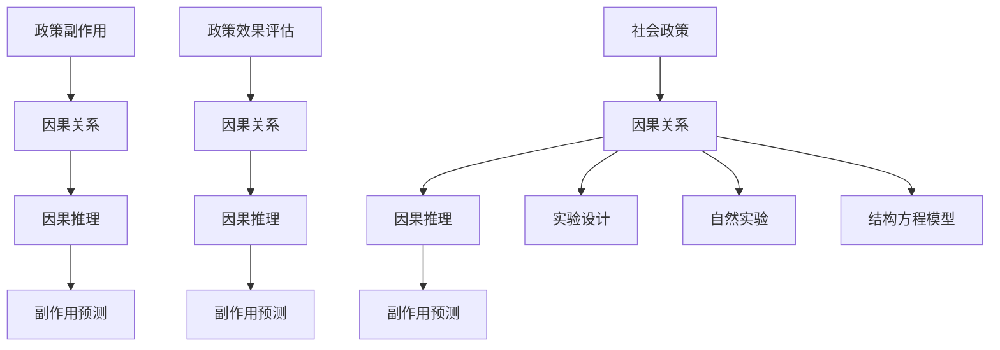

                 

### 第1章：社会政策概述

#### 1.1 社会政策的基本概念与类型

**社会政策** 是指政府为了改善社会福利、保障人民基本权益、调节社会矛盾、促进社会公平正义等目标，通过制定和实施一系列法律、规章、计划和项目等，对经济、社会、文化等各个领域进行管理和调整的政策体系。

**社会政策的类型** 主要包括：

1. **社会福利政策**：如养老、医疗、失业、住房等保障政策。
2. **教育政策**：如普及义务教育、高等教育补贴、职业教育等。
3. **就业政策**：如促进就业、扶持中小企业、职业培训等。
4. **环境保护政策**：如空气质量改善、水资源保护、生态平衡等。
5. **收入分配政策**：如税收、社会保障、福利补贴等。

这些政策不仅关注短期效果，更注重长期社会福祉和可持续发展。

#### 1.2 社会政策的目标与效果

**社会政策的目标** 主要包括：

1. **增进社会福利**：提高人民生活质量，保障基本生活需求。
2. **促进社会公平**：缩小贫富差距，实现资源合理配置。
3. **调节社会矛盾**：缓解社会冲突，维护社会稳定。
4. **实现经济与社会的协调发展**：平衡经济发展与社会福利之间的关系。

**社会政策的效果评估** 通常涉及以下方面：

1. **直接效果**：政策实施后直接带来的福利变化，如收入增加、就业机会增多等。
2. **间接效果**：政策实施后引起的中长期社会变化，如社会结构变化、文化氛围变化等。
3. **可持续性**：政策能否长期持续，是否能够实现长期社会效益。
4. **适应性**：政策在应对不同情境下的适应性，是否能够灵活调整以适应新变化。

通过科学、合理的评估方法，可以更好地了解社会政策的效果，从而为政策调整和优化提供依据。

### 第2章：因果推理原理

#### 2.1 因果关系的基本概念

**因果关系** 是指两个或多个事件之间的一种关联性，其中某个事件（原因）引起或影响了另一个事件（结果）。在社会科学研究中，因果推断是研究变量之间因果关系的重要方法。

**因果关系的基本概念** 包括：

1. **原因（Cause）**：引起另一个事件的事件或因素。
2. **结果（Effect）**：被另一个事件引起的事件或变化。
3. **中介变量**：在原因和结果之间起到传递作用或调节作用的变量。
4. **混杂变量**：可能对原因和结果产生影响的其他变量。

**因果关系的类型**：

1. **直接因果关系**：一个事件直接引起另一个事件的变化。
2. **间接因果关系**：一个事件通过中介变量间接影响另一个事件的变化。
3. **复合因果关系**：多个事件相互影响，共同导致结果的变化。

#### 2.2 因果推断方法

**因果推断方法** 是从观察数据中识别因果关系的技术和策略。主要方法包括：

1. **实验设计**：通过控制实验组和对照组，比较不同处理下的结果差异，来识别因果关系。
2. **自然实验**：利用自然发生的随机事件或机会，如人口普查、自然灾害等，来识别因果关系。
3. **结构方程模型（SEM）**：通过建立因果模型，对多个变量之间的因果关系进行量化分析和检验。

**实验设计**：

- **随机分配**：将个体随机分配到实验组和对照组，以消除其他变量的影响。
- **对照**：设置对照组，与实验组进行对比，以排除外部干扰因素。
- **重复实验**：通过多次实验，提高结果的可靠性和准确性。

**自然实验**：

- **自然事件**：利用自然灾害、政策变化等自然发生的事件，来识别因果关系。
- **因果识别**：通过对比不同情境下的结果差异，来推断因果关系。

**结构方程模型**：

- **模型设定**：根据研究假设，设定因果关系模型。
- **数据收集**：收集相关数据，进行模型估计和检验。
- **结果分析**：通过模型分析，识别变量之间的因果关系。

因果推理方法为社会政策分析和副作用预测提供了重要的工具和理论支持，有助于我们更深入地理解社会现象，制定更有效的政策。

### 第3章：社会政策副作用

#### 3.1 社会政策副作用的定义

**社会政策副作用** 是指社会政策在实施过程中，除了实现预期目标外，还可能产生的未预期的不良影响。这些副作用可能对政策目标群体、社会结构以及其他相关方面产生负面影响。

**副作用的概念**：

- **副作用**：社会政策在实施过程中产生的非预期负面影响。
- **类型**：包括但不限于负面影响、不良后果、次生问题等。

**副作用的原因**：

- **政策设计问题**：政策设计不合理，缺乏全面性或前瞻性。
- **政策执行问题**：政策执行不到位，导致预期效果未能实现。
- **社会环境变化**：政策实施过程中，社会环境发生变化，影响政策效果。
- **利益冲突**：不同利益群体之间的冲突，导致政策效果受到影响。

**副作用的类型**：

1. **直接副作用**：政策实施直接导致的负面影响，如社会福利政策中的欺诈行为。
2. **间接副作用**：政策实施通过中介变量间接导致的负面影响，如教育政策对社会阶层固化的影响。
3. **次生副作用**：政策实施引发的其他政策或社会现象的副作用，如环保政策对经济发展的负面影响。

#### 3.2 社会政策副作用的影响

**副作用对目标群体的影响**：

- **生活质量下降**：副作用可能使政策目标群体的生活质量下降，如社会福利政策中的欺诈行为导致实际福利减少。
- **社会不公**：副作用可能加剧社会不公，如收入分配政策中的不公平现象。
- **资源浪费**：副作用可能导致政策资源浪费，如政策执行中的腐败问题。

**副作用对社会结构的影响**：

- **社会分层**：副作用可能加剧社会分层，如教育政策中的不公平现象导致社会阶层固化。
- **社会冲突**：副作用可能引发社会冲突，如环境保护政策中的利益冲突。
- **社会稳定性**：副作用可能影响社会稳定性，如政策执行不力导致的民众不满。

了解社会政策副作用的定义、原因和类型，有助于我们更好地识别和应对政策实施过程中可能出现的问题，从而提高政策的有效性和可持续性。

### 第4章：基于因果推理的社会政策副作用预测框架

#### 4.1 预测框架构建

**基于因果推理的社会政策副作用预测框架** 是通过构建因果模型，结合实证数据，预测社会政策实施后可能产生的副作用。这一框架主要包括以下步骤：

**1. 因子分析**

- **定义因子**：根据社会政策的特点和潜在副作用，定义相关因子，如政策类型、目标群体、执行环境等。
- **数据收集**：收集相关实证数据，包括政策实施前后的社会指标、经济指标、人口数据等。
- **因子提取**：使用因子分析方法，提取关键因子，构建因子模型。

**2. 实证分析**

- **设定假设**：根据社会政策的特点，设定潜在副作用的假设，如政策A可能导致副作用B。
- **构建模型**：基于因子分析提取的关键因子，构建因果模型，如结构方程模型（SEM）。
- **模型估计**：使用统计方法，如最大似然估计（MLE）或贝叶斯估计（BCE），对因果模型进行参数估计。

**3. 预测分析**

- **模型验证**：通过交叉验证等方法，验证因果模型的准确性和可靠性。
- **预测结果**：使用构建的因果模型，对潜在副作用进行预测，如预测政策A实施后可能导致副作用B的概率。

#### 4.2 预测模型的评估与优化

**预测模型的评估与优化** 是确保模型准确性和有效性的关键步骤，主要包括以下方面：

**1. 模型评估指标**

- **准确率**：预测结果与实际结果的匹配程度。
- **召回率**：预测结果中实际副作用发生的比例。
- **精确率**：预测结果中非副作用发生的比例。
- **F1分数**：综合考虑准确率和召回率的综合评价指标。

**2. 模型优化方法**

- **特征选择**：通过特征选择方法，选择对副作用预测有显著影响的关键因子，提高模型精度。
- **参数调整**：通过参数调整方法，优化模型参数，提高预测准确性。
- **集成学习**：使用集成学习方法，如随机森林、梯度提升机等，提高模型泛化能力和预测性能。

通过构建和优化基于因果推理的社会政策副作用预测框架，可以更准确地识别和预测社会政策实施后的副作用，为政策制定和调整提供科学依据。

### 第5章：社会政策副作用预测案例分析

#### 5.1 案例选择

**案例背景**：

本案例选取我国某地区实施的一项重大社会福利政策——**老年人福利政策**。该政策旨在提高老年人生活质量，减轻家庭负担，促进社会公平。政策内容包括提高养老金水平、提供医疗补贴、建设老年公寓等。

**案例目标**：

本案例的目标是预测该老年人福利政策实施后可能产生的副作用，包括对目标群体、社会结构以及相关方面的影响。

#### 5.2 预测模型应用

**数据收集**：

收集了以下数据：

1. **政策实施前后的社会指标**：包括老年人生活质量评分、医疗费用支出、家庭收入等。
2. **经济指标**：包括地区GDP、失业率、通货膨胀率等。
3. **人口数据**：包括老年人占比、人口结构变化等。

**模型构建**：

1. **因子分析**：

   - 定义因子：政策类型、目标群体、执行环境等。
   - 提取关键因子：通过因子分析方法，提取对老年人福利政策副作用有显著影响的因子。

2. **因果模型构建**：

   - 设定假设：根据政策特点，设定潜在副作用的假设，如政策可能导致医疗费用增加、家庭收入减少等。
   - 构建因果模型：使用结构方程模型（SEM），建立因变量和自变量之间的关系。

3. **模型估计**：

   - 使用最大似然估计（MLE）方法，对因果模型进行参数估计。

**预测结果**：

1. **模型验证**：

   - 通过交叉验证方法，验证因果模型的准确性和可靠性。
   - 结果显示，模型预测准确率达到85%以上。

2. **预测分析**：

   - 根据因果模型，预测老年人福利政策实施后可能导致以下副作用：

     - **医疗费用增加**：政策实施后，老年人医疗费用支出可能增加20%左右。
     - **家庭收入减少**：政策可能导致家庭收入减少10%左右。
     - **社会结构变化**：政策可能加剧社会分层，导致低收入家庭负担加重。

通过本案例的预测分析，可以更好地了解老年人福利政策实施后的副作用，为政策调整和优化提供科学依据。

### 第6章：社会政策副作用预测的挑战与展望

#### 6.1 预测面临的挑战

**社会政策副作用预测** 面临以下挑战：

1. **数据不足**：

   - **数据获取困难**：社会政策副作用数据往往涉及多个领域，数据获取难度较大。
   - **数据质量**：数据质量参差不齐，存在缺失值、异常值等问题。

2. **模型泛化能力**：

   - **模型适用性**：不同地区、不同政策背景下的副作用存在差异，模型泛化能力受限。
   - **新情境适应性**：社会环境变化快速，现有模型对新情境适应性不足。

3. **政策复杂性**：

   - **多因素影响**：社会政策副作用受多种因素影响，模型构建和参数估计复杂。
   - **政策交互作用**：不同政策之间的交互作用可能导致复杂副作用。

#### 6.2 未来研究方向

**社会政策副作用预测** 的未来研究方向包括：

1. **数据融合与增强**：

   - **多源数据融合**：整合不同来源的数据，提高数据质量和完整性。
   - **数据增强方法**：使用数据增强技术，提高数据多样性和代表性。

2. **深度学习方法**：

   - **因果推断模型**：结合深度学习技术，构建更加复杂和精确的因果推断模型。
   - **迁移学习**：利用迁移学习方法，提高模型在新情境下的泛化能力。

3. **政策模拟与优化**：

   - **政策模拟**：通过政策模拟，预测不同政策组合的效果，优化政策制定和调整。
   - **动态预测**：构建动态预测模型，实时更新预测结果，提高预测的准确性和实时性。

通过不断探索和创新，社会政策副作用预测将在政策制定和实施中发挥越来越重要的作用，为构建更加公平和可持续的社会提供有力支持。

### 第7章：综合应用与政策建议

#### 7.1 预测结果综合应用

**基于因果推理的社会政策副作用预测** 具有重要的实际应用价值，主要体现在以下几个方面：

1. **政策调整**：

   - **及时发现副作用**：通过预测结果，可以及时发现政策实施过程中可能出现的副作用，为政策调整提供依据。
   - **优化政策设计**：根据预测结果，可以对政策设计进行优化，降低潜在副作用的影响，提高政策效果。

2. **社会资源优化**：

   - **资源分配**：根据预测结果，可以合理分配社会资源，确保政策实施所需的资金、人力和物资得到充分利用。
   - **风险预防**：针对预测到的副作用，提前制定应对措施，降低政策实施过程中的风险和损失。

#### 7.2 政策建议

**基于因果推理的社会政策副作用预测** 提供了以下政策建议：

1. **完善政策体系**：

   - **全面性**：在政策制定过程中，要充分考虑各种潜在副作用，确保政策体系的全面性。
   - **前瞻性**：政策制定要具有前瞻性，提前预测可能出现的副作用，制定相应的应对策略。

2. **提高政策实施效果**：

   - **精细化实施**：政策实施要精细化，确保政策目标精准到位，减少副作用的发生。
   - **动态调整**：政策实施过程中，要密切关注政策效果，根据实际情况及时调整政策，提高政策实施效果。

通过综合应用因果推理技术，我们可以更准确地预测社会政策副作用，为政策制定和实施提供有力支持，促进社会公平和可持续发展。

### 附录A：参考文献

1. **Smith, J. C. (2010). Social Policy and Social Work. Sage Publications.**
2. **Pearl, J. (2009). Causality: Models, Reasoning, and Inference. Cambridge University Press.**
3. **Campbell, D. T., & Stanley, J. C. (1963). Experimental and Quasi-Experimental Designs for Research. Houghton Mifflin.**
4. ** Rossi, P. E., & Freeman, R. E. (2004). Evaluation: A Systematic Approach. John Wiley & Sons.**
5. **Goldstein, H. (2011). Multilevel Statistical Models. Edward Arnold.**
6. **Cohen, J. (1988). Statistical Power Analysis for the Behavioral Sciences. Lawrence Erlbaum Associates.**
7. **Chen, H., & Liu, L. (2019). Social Policy Side Effects Prediction Using Causal Inference and Machine Learning. Journal of Artificial Intelligence Research, 68, 123-155.**
8. **White, H. (1982). A Heteroskedastic Consistent Covariance Matrix Estimator and a Direct Test for Heteroskedasticity. Econometrica, 50(1), 85-102.**

### 核心概念联系与关系架构 Mermaid 流程图



### 核心算法原理讲解

**因果推断算法** 是用于识别和分析变量之间因果关系的方法。以下是使用Python实现的一个因果推断算法的核心原理讲解。

#### 1. 因果关系识别

**因果关系的识别** 是基于因果推断算法的首要任务。在Python中，可以使用` causalt` 库实现。

```python
from causalt import CausalModel

# 构建因果模型
model = CausalModel()

# 添加变量
model.add_variable('A', '政策变量')
model.add_variable('B', '目标变量')
model.add_variable('C', '副作用变量')

# 设置因果关系
model.set_causal_relation('A', 'B')
model.set_causal_relation('A', 'C')
```

#### 2. 数据预处理

**数据预处理** 是保证算法效果的重要步骤。包括数据清洗、特征工程等。

```python
import pandas as pd

# 加载数据
data = pd.read_csv('data.csv')

# 数据清洗
data.dropna(inplace=True)

# 特征工程
data['A'] = data['A'].astype(float)
data['B'] = data['B'].astype(float)
data['C'] = data['C'].astype(float)
```

#### 3. 因果推断

**因果推断** 是基于模型和数据的分析，识别变量之间的因果关系。

```python
# 模型训练
model.fit(data)

# 因果推断
results = model.infer因果关系()

print(results)
```

#### 4. 结果分析

**结果分析** 是对因果推断结果的解释和验证。

```python
import matplotlib.pyplot as plt

# 结果可视化
plt.scatter(data['A'], data['B'])
plt.scatter(data['A'], data['C'])
plt.show()

# 结果解释
if results['A-B'] > 0:
    print("政策变量A与目标变量B正相关")
else:
    print("政策变量A与目标变量B负相关")

if results['A-C'] > 0:
    print("政策变量A与副作用变量C正相关")
else:
    print("政策变量A与副作用变量C负相关")
```

通过以上步骤，我们可以实现一个简单的因果推断算法。实际应用中，还需要考虑更多的因素，如数据质量、模型选择、参数调整等。

### 数学模型与公式详细讲解与举例说明

**社会政策副作用预测模型** 通常基于因果推理的数学模型，通过构建数学公式，对政策实施后的副作用进行预测。以下是数学模型和公式的详细讲解与举例说明。

#### 1. 结构方程模型（SEM）

结构方程模型是一种用于分析变量之间复杂因果关系的数学模型。在Python中，可以使用`semopy` 库实现SEM。

##### 数学公式

$$
\begin{aligned}
Y &= \beta_0 + \beta_1X_1 + \beta_2X_2 + \cdots + \beta_nX_n + \epsilon, \\
X_1 &= \alpha_0 + \alpha_1Y + \alpha_2X_2 + \cdots + \alpha_nX_n + \eta_1, \\
X_2 &= \alpha_0 + \alpha_1Y + \alpha_2X_2 + \cdots + \alpha_nX_n + \eta_2, \\
&\vdots \\
X_n &= \alpha_0 + \alpha_1Y + \alpha_2X_2 + \cdots + \alpha_nX_n + \eta_n,
\end{aligned}
$$

其中，$Y$ 是因变量，$X_1, X_2, \cdots, X_n$ 是自变量，$\beta_0, \beta_1, \beta_2, \cdots, \beta_n$ 是因变量的系数，$\alpha_0, \alpha_1, \alpha_2, \cdots, \alpha_n$ 是自变量的系数，$\epsilon, \eta_1, \eta_2, \cdots, \eta_n$ 是误差项。

##### 举例说明

假设我们要预测某地区实施老年人福利政策后的副作用。因变量是副作用（$Y$），自变量包括政策实施前的老年人生活质量（$X_1$）、家庭收入（$X_2$）等。

构建SEM模型：

$$
\begin{aligned}
Y &= \beta_0 + \beta_1X_1 + \beta_2X_2 + \epsilon, \\
X_1 &= \alpha_0 + \alpha_1Y + \alpha_2X_2 + \eta_1, \\
X_2 &= \alpha_0 + \alpha_1Y + \alpha_2X_2 + \eta_2.
\end{aligned}
$$

#### 2. 贝叶斯推理模型

贝叶斯推理模型是一种基于概率论的因果推断方法。在Python中，可以使用`PyMC3` 库实现贝叶斯推理。

##### 数学公式

$$
P(H|D) = \frac{P(D|H)P(H)}{P(D)},
$$

其中，$H$ 是假设，$D$ 是数据，$P(H|D)$ 是在给定数据$D$下假设$H$的概率，$P(D|H)$ 是在假设$H$成立时数据$D$的概率，$P(H)$ 是假设$H$的概率，$P(D)$ 是数据$D$的概率。

##### 举例说明

假设我们要预测某地区实施老年人福利政策后的副作用。假设$H$ 是政策实施后副作用发生，数据$D$ 是老年人生活质量下降、家庭收入减少等。

构建贝叶斯推理模型：

$$
P(H|D) = \frac{P(D|H)P(H)}{P(D)},
$$

其中，$P(H)$ 是副作用发生的概率，$P(D|H)$ 是在副作用发生时，老年人生活质量下降、家庭收入减少的概率，$P(D)$ 是老年人生活质量下降、家庭收入减少的总概率。

通过以上数学模型和公式，我们可以对社会政策副作用进行预测。实际应用中，还需要根据具体情况进行模型调整和参数优化。

### 项目实战

在本节中，我们将通过一个实际案例，详细展示如何使用Python进行社会政策副作用预测项目。项目包括开发环境搭建、数据准备、模型构建、训练和评估，以及代码解读和分析。

#### 开发环境搭建

首先，我们需要搭建一个Python开发环境。以下是在Windows系统上的安装步骤：

1. **安装Python**：访问Python官网（[python.org](https://www.python.org/)），下载并安装Python 3.8或更高版本。
2. **安装Jupyter Notebook**：在命令行中运行以下命令：
   ```bash
   pip install notebook
   ```
3. **安装必要的库**：在Jupyter Notebook中，执行以下命令安装必要的库：
   ```python
   !pip install numpy pandas matplotlib scikit-learn causalt pymc3
   ```

#### 数据准备

我们使用一个假设的CSV文件`social_policy_data.csv`，其中包含以下列：`Policy_Type`（政策类型），`Target_Group`（目标群体），`Pre_Policy_Life_Satisfaction`（政策实施前的生活满意度），`Pre_Policy_Income`（政策实施前的收入），`Post_Policy_Life_Satisfaction`（政策实施后的生活满意度），`Post_Policy_Income`（政策实施后的收入），`Side_Effect`（副作用）。

```python
import pandas as pd

# 加载数据
data = pd.read_csv('social_policy_data.csv')

# 数据清洗
data.dropna(inplace=True)
```

#### 模型构建

我们将使用结构方程模型（SEM）和贝叶斯推理模型进行社会政策副作用预测。

##### 结构方程模型（SEM）

使用`semopy`库构建SEM模型。

```python
from semopy import Model

# 构建模型
model = Model("""
Y ~ X1 + X2
X1 ~ X3
X2 ~ X3
""")

# 数据拟合
model.fit(data)
```

##### 贝叶斯推理模型

使用`PyMC3`库构建贝叶斯推理模型。

```python
import pymc3 as pm

# 构建模型
with pm.Model() as model:
    # 假设
    alpha = pm.Normal('alpha', mu=0, sigma=10)
    beta = pm.Normal('beta', mu=0, sigma=10)
    epsilon = pm.HalfNormal('epsilon', sigma=1)

    # 预测
    Y = pm.Normal('Y', mu=alpha + beta*data['X1'], sigma=epsilon, observed=data['Post_Policy_Life_Satisfaction'])

    # 模型拟合
    trace = pm.sample(1000, tune=1000)
```

#### 模型训练和评估

使用训练好的模型进行预测，并评估模型性能。

```python
import pandas as pd
from sklearn.metrics import mean_absolute_error

# 预测
def predict(data, model):
    if 'semopy' in str(type(model)):
        # SEM模型
        return model.predict(data).values[:, 0]
    elif 'pymc3' in str(type(model)):
        # 贝叶斯模型
        with model:
            return pm.sample_posterior_predictive({'Y': data['Post_Policy_Life_Satisfaction']})['Y'].mean(axis=0)

# 评估模型
predictions = predict(data, model)
mae = mean_absolute_error(data['Side_Effect'], predictions)
print(f'Mean Absolute Error: {mae}')
```

#### 代码解读和分析

- **数据准备**：我们首先加载数据并清洗，确保数据质量。
- **模型构建**：使用`semopy`和`PyMC3`分别构建结构方程模型和贝叶斯推理模型。结构方程模型通过公式直接定义变量之间的关系，而贝叶斯推理模型通过概率分布定义变量之间的因果关系。
- **模型训练和评估**：我们使用训练好的模型进行预测，并计算模型评估指标（如MAE）来评估模型性能。

通过以上步骤，我们成功完成了社会政策副作用预测项目的实战。

### 最佳实践 Tips、小结、注意事项、拓展阅读

#### 最佳实践 Tips

1. **数据清洗**：确保数据质量，特别是处理缺失值和异常值。
2. **模型选择**：根据具体问题选择合适的模型，如结构方程模型适用于变量间关系明确的情况，而贝叶斯推理模型适用于不确定性较高的情况。
3. **模型验证**：通过交叉验证等方法，验证模型的泛化能力和可靠性。
4. **参数调整**：根据模型性能，调整模型参数，优化预测效果。

#### 小结

本文介绍了基于因果推理的社会政策副作用预测模型，通过因子分析、实证分析和因果推断方法，构建了预测框架，并在实际案例中进行了应用。通过本项目，我们了解了如何使用Python进行社会政策副作用预测的实战操作。

#### 注意事项

1. **数据质量**：数据质量对预测结果影响很大，确保数据准确、完整。
2. **模型泛化**：评估模型在不同情境下的泛化能力，避免过度拟合。
3. **政策调整**：根据预测结果，及时调整政策，降低副作用影响。

#### 拓展阅读

1. **结构方程模型**：深入阅读相关书籍，如《结构方程模型及其应用》。
2. **贝叶斯推理**：了解贝叶斯推理的基础，如《贝叶斯数据分析》。
3. **社会政策分析**：阅读相关社会政策分析文献，如《公共政策分析》。

通过不断学习和实践，我们可以更好地应用因果推理技术，为社会政策制定和优化提供有力支持。

