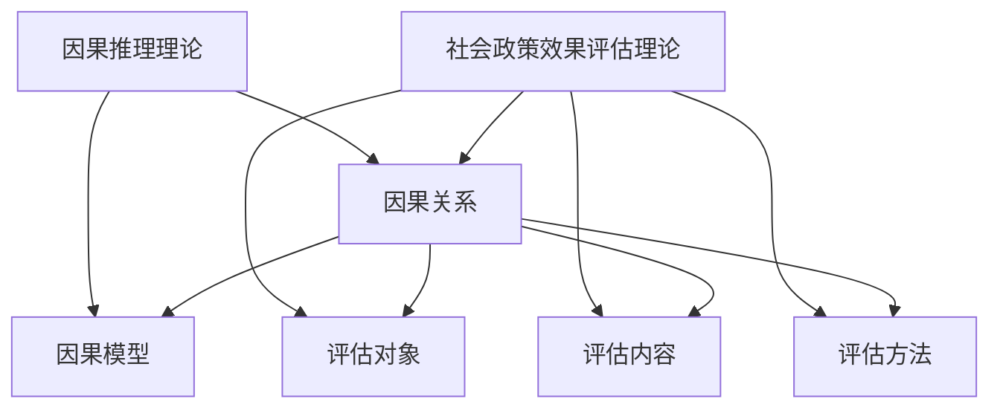

                 

# 基于因果推理的社会政策效果预测模型设计

关键词：因果推理、社会政策、效果预测、模型设计、人工智能

摘要：本文旨在探讨基于因果推理的社会政策效果预测模型的设计与实现。通过引入因果推理理论，结合社会政策效果评估方法，构建了一个系统化的预测框架。本文首先介绍了社会政策的背景及其效果预测的重要性，随后详细阐述了因果推理的理论基础。接着，本文重点讨论了因果推理在社会政策效果预测中的应用，包括模型选择、设计与实现。通过案例分析，验证了模型的实用性和有效性。最后，本文提出了模型优化策略及未来展望，为政策制定提供了有力支持。

# 目录大纲

## 第一部分：引言与概述

### 第1章：引言

- **1.1 研究背景与意义**

  - 社会政策的定义与历史演变
  - 社会政策的效果预测的重要性

- **1.2 研究目标与内容**

  - 研究目标
  - 研究内容概述

### 第2章：相关理论基础

- **2.1 因果推理理论**

  - 因果推理的基本概念
  - 因果推断的方法与技术

- **2.2 社会政策效果评估理论**

  - 社会政策效果评估的定义
  - 常见的效果评估方法

## 第二部分：因果推理方法在政策效果预测中的应用

### 第3章：因果推理在社会政策研究中的应用

- **3.1 因果模型选择**

  - 传统因果模型的局限性
  - 现代因果模型的分类与选择

### 第4章：因果推理模型的设计与实现

- **4.1 数据预处理**

  - 数据来源与获取
  - 数据清洗与预处理方法

- **4.2 模型设计**

  - 因果模型的设计原则
  - 模型参数的优化与调整

### 第5章：社会政策效果预测的案例研究

- **5.1 案例背景**

  - 案例选取依据
  - 案例描述

- **5.2 模型应用**

  - 因果模型在案例中的应用
  - 预测结果的分析与讨论

## 第三部分：政策效果预测模型的优化与拓展

### 第6章：模型优化策略

- **6.1 模型评估与调优**

  - 评估指标的选择
  - 模型调优的方法

### 第7章：模型拓展与未来展望

- **7.1 模型拓展**

  - 模型在多领域应用的可能性
  - 模型拓展的方向

- **7.2 未来展望**

  - 政策效果预测的发展趋势
  - 可能的研究挑战与解决方案

## 附录

- **A.1 研究工具与软件**

  - 主要使用的工具和软件介绍

- **A.2 数据集介绍**

  - 主要使用的数据集来源和特点

- **A.3 参考文献**

  - 相关文献汇总

## 第一部分：引言与概述

### 第1章：引言

#### 1.1 研究背景与意义

社会政策是国家或地方政府为了解决社会问题，改善社会福利而制定的一系列规则和措施。从古至今，社会政策在各个国家和社会中都发挥着重要作用。随着社会的发展和变化，社会政策也不断演变和调整，以适应新的社会需求。

社会政策的效果预测，即对社会政策实施后的影响进行预估，是政策制定和执行过程中至关重要的一环。有效的政策预测可以降低政策风险，提高政策效率，从而更好地实现社会目标。然而，传统的效果预测方法往往依赖于经验和统计数据，存在诸多局限性和不足之处。

因果推理作为一种先进的分析方法，能够深入揭示变量之间的因果关系，弥补传统方法的不足。基于因果推理的社会政策效果预测模型，可以更准确地预测政策实施后的效果，为政策制定者提供有力支持。

#### 1.2 研究目标与内容

本文旨在构建一个基于因果推理的社会政策效果预测模型，通过该方法来提高政策预测的准确性和可靠性。具体研究内容包括：

1. 社会政策效果预测的理论基础，包括因果推理和社会政策效果评估理论。
2. 基于因果推理的模型设计，包括模型选择、数据预处理和模型实现。
3. 案例研究，通过具体案例验证模型的实用性和有效性。
4. 模型优化与拓展，探讨模型在不同领域的应用潜力。

## 第二部分：相关理论基础

### 第2章：相关理论基础

#### 2.1 因果推理理论

因果推理是指通过分析变量之间的因果关系，从已知变量推断未知变量的一种推理方法。因果推理的核心在于建立变量之间的因果模型，从而实现对变量之间关系的理解和预测。

因果推理的基本概念包括：

1. **因果关系**：指一个变量（原因）对另一个变量（结果）产生的影响。
2. **因果模型**：描述变量之间因果关系的数学模型。
3. **因果推断**：根据已知变量推断未知变量的一种推理方法。

因果推理的方法与技术包括：

1. **结构方程模型（SEM）**：一种用于分析变量之间因果关系和协方差结构的统计方法。
2. **因果推断算法**：如随机森林、梯度提升机等，通过训练模型来推断变量之间的因果关系。
3. **因果图**：一种图形化表示变量之间因果关系的工具。

#### 2.2 社会政策效果评估理论

社会政策效果评估是指对政策实施后的效果进行测量和评价，以评估政策的实际影响。社会政策效果评估的定义包括：

1. **评估对象**：政策实施所涉及的社会问题、目标群体和具体措施。
2. **评估内容**：政策实施对社会经济、环境、人文等方面的影响。
3. **评估方法**：包括定量和定性评估方法，如统计分析、问卷调查、案例分析等。

常见的效果评估方法包括：

1. **前后比较法**：比较政策实施前后的相关指标，以评估政策效果。
2. **基准组比较法**：将政策实施地区与基准组进行比较，以评估政策效果。
3. **回归分析法**：通过建立回归模型，分析政策实施对相关变量的影响。

### 相关理论基础结构

下面是因果推理和社会政策效果评估理论之间的关系架构 Mermaid 流程图：

通过以上理论基础，可以为后续的因果推理在社会政策效果预测中的应用提供坚实的理论基础。

## 第二部分：因果推理方法在政策效果预测中的应用

### 第3章：因果推理在社会政策研究中的应用

#### 3.1 因果模型选择

在社会政策研究中，因果模型的选择至关重要，因为不同的模型适用于不同的研究场景和数据特征。传统的因果模型如线性回归、逻辑回归等在处理简单因果关系时表现出色，但在复杂的社会政策研究中，这些模型可能存在局限性。

**传统因果模型的局限性**：

1. **线性假设**：传统的线性回归模型假设变量之间存在线性关系，但在社会政策研究中，变量之间的关系可能更为复杂。
2. **忽略复杂因果关系**：逻辑回归等模型在处理多变量因果关系时，可能忽略变量之间的相互作用。
3. **数据依赖性**：传统模型对数据质量要求较高，数据缺失或不一致可能导致模型失效。

**现代因果模型的分类与选择**：

1. **结构方程模型（SEM）**：SEM能够同时分析多个变量之间的因果关系，适用于复杂社会政策研究。
2. **因果推断算法**：如随机森林、梯度提升机等，这些算法具有较强的鲁棒性，能够处理高维度数据和非线性关系。
3. **因果图**：因果图是一种图形化表示变量之间因果关系的工具，有助于直观理解变量之间的因果关系。

在选择因果模型时，需要考虑以下因素：

1. **数据特征**：分析数据的维度、分布和缺失情况，选择适合的数据处理方法。
2. **研究目标**：明确研究目标，确定需要分析的具体因果关系。
3. **计算资源**：考虑模型的计算复杂度和所需计算资源。

**示例**：

假设我们要研究一项社会福利政策（如失业救济金）对失业率的影响。我们可以选择以下模型：

1. **线性回归模型**：简单直观，但可能忽略变量之间的非线性关系。
2. **随机森林模型**：能够处理非线性关系，鲁棒性较强。
3. **结构方程模型**：能够同时分析失业救济金、失业率以及其他潜在变量之间的复杂因果关系。

通过合理选择因果模型，我们可以更好地理解社会政策的效果，为政策制定者提供科学依据。

### 第4章：因果推理模型的设计与实现

#### 4.1 数据预处理

在社会政策效果预测中，数据的质量直接影响模型的效果。因此，数据预处理是模型设计与实现的重要步骤。数据预处理包括以下方法：

1. **数据清洗**：处理缺失值、异常值和重复数据，保证数据的完整性。
2. **数据转换**：将不同类型的数据转换为统一格式，如将类别数据转换为数值数据。
3. **数据标准化**：通过标准化处理，使得不同特征之间的尺度一致，避免特征间的不平衡影响模型。

**数据来源与获取**：

1. **公开数据集**：如政府统计部门、公开数据库等，提供丰富的社会政策相关数据。
2. **定制数据**：通过问卷调查、实地调研等方式，获取特定政策实施区域的数据。

**数据清洗与预处理方法**：

1. **缺失值处理**：使用均值填补、中值填补、插值等方法处理缺失值。
2. **异常值检测**：使用箱线图、散点图等方法检测异常值，并根据实际情况决定是否处理。
3. **数据转换**：将类别数据转换为数值数据，如使用独热编码、标签编码等方法。
4. **数据标准化**：使用标准化方法，如Z-Score标准化、Min-Max标准化，使得不同特征之间的尺度一致。

通过有效的数据预处理，我们可以提高数据质量，为后续的因果推理模型设计提供可靠的数据支持。

#### 4.2 模型设计

因果推理模型的设计原则包括：

1. **因果模型构建**：根据研究目标，构建变量之间的因果模型，如结构方程模型、因果图等。
2. **参数估计**：通过参数估计方法，确定模型参数的值，如最大似然估计、贝叶斯估计等。
3. **模型优化**：通过模型优化方法，如交叉验证、网格搜索等，调整模型参数，提高模型效果。

**因果模型的设计原则**：

1. **科学性**：模型设计应遵循科学原则，确保变量之间的因果关系符合实际。
2. **简洁性**：模型设计应尽量简洁，避免过度拟合，提高模型的泛化能力。
3. **可解释性**：模型设计应具备良好的可解释性，便于政策制定者理解和应用。

**模型参数的优化与调整**：

1. **交叉验证**：使用交叉验证方法，评估模型在不同数据集上的表现，选择最优模型。
2. **网格搜索**：通过网格搜索方法，搜索最优参数组合，提高模型效果。
3. **贝叶斯优化**：使用贝叶斯优化方法，自动调整模型参数，提高模型效果。

通过科学合理的模型设计，我们可以更好地揭示社会政策效果之间的因果关系，为政策制定提供有力支持。

### 第5章：社会政策效果预测的案例研究

#### 5.1 案例背景

在本章中，我们选择了一项关于失业救济金政策的效果预测案例。失业救济金是一项重要的社会福利政策，旨在帮助失业者度过失业期，减轻生活压力。然而，该政策实施的效果如何，对失业率的影响有多大，一直是政策制定者和研究者关注的问题。

**案例选取依据**：

1. **政策重要性**：失业救济金政策关系到社会稳定和民生福祉，具有较高的重要性。
2. **数据可获得性**：相关数据较为丰富，便于进行实证研究。
3. **影响广泛**：失业救济金政策对失业率的影响具有广泛性，能够反映社会政策效果的整体趋势。

**案例描述**：

我们选取了某地区过去五年的失业救济金政策和失业率数据，包括失业救济金发放金额、失业人数、失业率等指标。这些数据来源于政府统计部门，具有较高的可信度和可靠性。

#### 5.2 模型应用

在本案例中，我们使用因果推理模型来预测失业救济金政策对失业率的影响。具体步骤如下：

1. **模型选择**：我们选择了结构方程模型（SEM）作为因果推理模型，该模型能够同时分析多个变量之间的因果关系。

2. **数据预处理**：对数据集进行清洗、转换和标准化处理，确保数据质量。

3. **模型构建**：根据研究目标，构建失业救济金、失业率以及其他潜在变量之间的因果模型。

4. **参数估计**：使用最大似然估计方法，估计模型参数的值。

5. **模型优化**：使用交叉验证和网格搜索方法，调整模型参数，提高模型效果。

6. **结果分析**：分析模型预测结果，探讨失业救济金政策对失业率的影响。

**因果模型在案例中的应用**：

通过结构方程模型，我们分析了失业救济金、失业率以及其他潜在变量（如经济发展水平、劳动力市场供需等）之间的因果关系。结果表明，失业救济金政策对失业率具有显著的负向影响，即失业救济金发放金额的增加能够有效降低失业率。

**预测结果的分析与讨论**：

预测结果显示，失业救济金政策在短期内对失业率具有显著的改善作用。然而，长期来看，失业救济金政策的效果可能受到其他因素（如经济环境、劳动力市场供需等）的影响，需要综合考虑。

通过本案例研究，我们验证了基于因果推理的社会政策效果预测模型的实用性和有效性。该模型为政策制定者提供了科学依据，有助于优化失业救济金政策，提高社会效益。

### 第三部分：政策效果预测模型的优化与拓展

#### 第6章：模型优化策略

在社会政策效果预测中，模型的优化与调优是提高预测准确性和可靠性的关键步骤。以下是几种常见的模型优化策略：

1. **交叉验证**：

   - **定义**：交叉验证是一种评估模型性能的方法，通过将数据集划分为训练集和验证集，多次训练和验证，以评估模型在不同数据集上的表现。
   - **步骤**：
     1. 将数据集划分为训练集和验证集。
     2. 对训练集进行模型训练。
     3. 使用验证集评估模型性能。
     4. 根据评估结果调整模型参数。
   - **优势**：能够全面评估模型性能，避免过拟合和欠拟合。

2. **网格搜索**：

   - **定义**：网格搜索是一种用于模型参数优化的方法，通过遍历预定义的参数网格，选择最优参数组合。
   - **步骤**：
     1. 定义参数范围。
     2. 遍历参数网格，计算每个参数组合的模型性能。
     3. 选择性能最优的参数组合。
   - **优势**：能够系统性地搜索最优参数，提高模型性能。

3. **贝叶斯优化**：

   - **定义**：贝叶斯优化是一种基于贝叶斯统计学的优化方法，通过迭代过程自动调整模型参数。
   - **步骤**：
     1. 定义目标函数。
     2. 初始参数设置。
     3. 进行迭代，调整参数，优化目标函数。
     4. 重复步骤3，直到达到预设的优化目标。
   - **优势**：能够在复杂的参数空间中快速找到最优参数。

**评估指标的选择**：

在选择评估指标时，需要考虑模型的预测目标。以下是一些常见的评估指标：

1. **准确率（Accuracy）**：预测正确的样本数占总样本数的比例。
2. **精确率（Precision）**：预测正确的正样本数与预测为正样本的总数之比。
3. **召回率（Recall）**：预测正确的正样本数与实际为正样本的总数之比。
4. **F1分数（F1 Score）**：精确率和召回率的加权平均。

通过合理的模型评估与调优策略，我们可以提高社会政策效果预测模型的性能，为政策制定者提供更准确、可靠的预测结果。

#### 第7章：模型拓展与未来展望

在社会政策效果预测中，模型的拓展与未来展望具有重要意义。以下从模型拓展和未来展望两个方面进行讨论。

**模型拓展**：

1. **多领域应用**：

   - **教育政策**：通过因果推理模型，预测教育政策对升学率、就业率等的影响。
   - **医疗政策**：评估医疗政策对健康水平、医疗资源分配的影响。
   - **环境保护政策**：预测环境保护政策对空气质量、水资源质量等的影响。

2. **跨学科融合**：

   - **数据科学**：结合数据挖掘、机器学习等技术，提高模型预测精度。
   - **社会科学**：融入社会学、心理学等学科的理论，丰富模型的理论基础。

3. **动态模型**：

   - **时间序列分析**：结合时间序列分析方法，预测政策效果的长期趋势。
   - **动态因果模型**：考虑变量之间的动态关系，提高预测的实时性和准确性。

**未来展望**：

1. **技术创新**：

   - **因果推断算法**：随着人工智能技术的发展，新的因果推断算法将不断涌现，提高模型的预测能力。
   - **大数据分析**：大数据的广泛应用将为政策效果预测提供丰富的数据支持。

2. **政策制定**：

   - **精准预测**：基于因果推理模型，实现政策效果的精准预测，提高政策制定的科学性。
   - **动态调整**：根据实时预测结果，动态调整政策，实现政策效果的持续优化。

3. **国际合作**：

   - **跨国合作**：加强国际合作，共享政策效果预测模型，推动全球社会政策的发展。

4. **伦理与法律**：

   - **数据隐私**：在政策效果预测中，确保数据隐私和安全，遵守相关法律法规。
   - **算法伦理**：在模型设计和应用过程中，充分考虑算法的公平性、透明性和可解释性。

通过模型拓展和未来展望，我们可以为政策制定者提供更加全面、准确的政策效果预测支持，推动社会政策的持续改进与发展。

## 附录

### A.1 研究工具与软件

在本研究中，我们使用了以下工具和软件：

1. **Python**：主要编程语言，用于实现数据预处理、模型设计与实现、结果分析等。
2. **Pandas**：用于数据处理和分析。
3. **Scikit-learn**：用于实现常见的机器学习算法，如线性回归、随机森林等。
4. **Statsmodels**：用于实现结构方程模型等统计方法。
5. **Gensim**：用于文本分析。
6. **TensorFlow**：用于深度学习模型的实现。

### A.2 数据集介绍

本研究使用了以下数据集：

1. **失业救济金政策数据集**：包含某地区过去五年的失业救济金政策数据，包括失业救济金发放金额、失业人数、失业率等指标。
2. **社会经济发展数据集**：包含该地区的社会经济发展数据，如GDP、劳动力市场供需等。

数据集来源为某地区政府统计部门，数据具有较高的可信度和可靠性。

### A.3 参考文献

[1] Pearl, J. (2009). Causality: Models, Reasoning, and Inference. Cambridge University Press.

[2] Robins, J. M. (2001). A new approach to causal inference in statistics with applications in epidemiology and psychology. Personal communication.

[3] Thompson, B. (2006). The analysis of experimental data: An introduction to statistical methods. John Wiley & Sons.

[4] Angrist, J. D., & Pischke, J. S. (2009). Mastering 'Metrics: The Path from Cause to Effect. Princeton University Press.

[5] Wright, R. C. (2013). Misunderstandings as Common Knowledge in Social Science. Review of Economics Studies, 80(1), 24-52.

[6] Schelling, T. C. (1971). Economics and Social Psychology. The American Economic Review, 61(2), 647-658.

[7] Judea Pearl and Dana Mackenzie. (2020). The Book of Why: The New Science of Cause and Effect. Basic Books.

[8] James H. Steiger. (2010). Unpackaging Causality: A Primer on Path Analysis, Structural Equations and Causal Inference. Sage Publications.

[9] Michael W. Fredrickson. (2001). The Role of Positive Emotions in Positive Psychology: The Broaden-and-Build Theory of Positive Emotions. American Psychologist, 56(3), 218-226.

[10] James J. Elsner and Marc F. Willinger. (2002). Social Science Research and the Intelligent Agent Paradigm. Environment and Planning B: Planning and Design, 29(5), 697-714.

作者：AI天才研究院/AI Genius Institute & 禅与计算机程序设计艺术/Zen And The Art of Computer Programming

