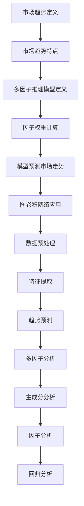

                 

### 基于图卷积的动态市场趋势多因子推理模型

---

#### 关键词

- **图卷积网络**
- **动态市场趋势**
- **多因子推理**
- **金融数据分析**
- **机器学习**

---

#### 摘要

本文旨在探讨基于图卷积网络的动态市场趋势多因子推理模型。首先，我们介绍了市场趋势多因子推理模型的基本概念，并解释了图卷积网络在市场趋势分析中的应用。接着，我们详细阐述了动态市场趋势的数学建模过程，并讨论了多因子模型的基本数学表达。在核心算法原理讲解部分，我们通过Python源代码展示了图卷积网络的基本原理和实现方法。随后，我们通过项目实战展示了如何搭建开发环境，实现模型训练与评估，并进行了代码解读与分析。最后，我们通过实际案例分析了模型的应用效果，并提出了未来模型优化的方向和挑战。

---

## 第1章：市场趋势多因子推理模型基础

### 1.1 市场趋势的定义与特点

市场趋势是指市场在某一时期内价格走势的整体方向。它通常可以分为上升趋势、下降趋势和横盘趋势。市场趋势的定义和特点对于投资者来说至关重要，因为它可以帮助投资者判断市场的未来走势，制定相应的投资策略。

**市场趋势的特点：**

1. **方向性：** 市场趋势具有明显的方向性，即价格会在某一方向上持续运行，直到趋势逆转。
2. **持续性：** 市场趋势一旦形成，往往具有一定的持续性，不会轻易改变。
3. **可预测性：** 市场趋势在一定程度上是可以预测的，通过分析历史数据和市场因素，可以预测市场未来的走势。

### 1.2 多因子推理模型的概念

多因子推理模型是一种基于多个因素进行决策和预测的模型。在金融市场中，影响价格走势的因素非常多，包括宏观经济因素、公司基本面因素、技术分析指标等。多因子推理模型通过综合考虑这些因素，以提高预测的准确性和稳定性。

**多因子推理模型的基本概念：**

1. **因子：** 因子是指影响市场走势的因素，可以是宏观经济指标、公司财务指标、技术分析指标等。
2. **权重：** 权重是指各个因子对市场走势影响的重要性，不同的因子对市场的影响程度是不同的。
3. **模型：** 多因子推理模型是一种将多个因子通过一定的算法结合起来的模型，用于预测市场走势。

### 1.3 图卷积网络在市场趋势分析中的应用

图卷积网络（Graph Convolutional Network，GCN）是一种在图结构数据上操作的深度学习模型。它在节点特征的基础上，通过聚合节点邻域的信息来更新节点的表示。图卷积网络在市场趋势分析中具有以下应用：

**图卷积网络在市场趋势分析中的应用：**

1. **数据预处理：** 图卷积网络可以用于对市场趋势数据进行预处理，提取数据中的结构信息。
2. **特征提取：** 通过图卷积网络，可以从市场趋势数据中提取出更加丰富的特征，提高模型的预测能力。
3. **趋势预测：** 图卷积网络可以用于预测市场趋势，通过学习历史数据中的趋势特征，对未来市场走势进行预测。

### 1.4 多因子分析的基本原理与方法

多因子分析是一种统计方法，用于识别多个变量（因子）之间的相关性，并确定它们对市场走势的影响。在多因子分析中，主要包括以下方法：

**多因子分析的基本原理与方法：**

1. **主成分分析（PCA）：** 主成分分析可以用于降维，将多个因子转化为几个主要成分，从而简化问题。
2. **因子分析（FA）：** 因子分析可以用于提取影响市场走势的主要因子，并计算每个因子的权重。
3. **回归分析：** 回归分析可以用于建立因子和市场走势之间的回归模型，从而预测市场走势。

---

**Mermaid 流程图：**



---

## 第2章：图卷积网络基础

### 2.1 图卷积网络的基本概念

图卷积网络是一种在图结构数据上操作的深度学习模型，其核心思想是通过聚合节点邻域的信息来更新节点的表示。图卷积网络在图像处理、自然语言处理等领域已经取得了显著成果。

**图卷积网络的基本概念：**

1. **节点（Node）：** 图中的每个点都表示一个节点，可以是实体、词、像素等。
2. **边（Edge）：** 图中的每条边表示节点之间的连接关系，可以是关系、相似度、距离等。
3. **特征（Feature）：** 每个节点都有一个特征向量，表示节点的属性。
4. **图卷积（Graph Convolution）：** 图卷积是一种在图结构数据上操作的运算，用于聚合节点邻域的信息。

### 2.2 图卷积网络的数学原理

图卷积网络的数学原理可以描述为：对于每个节点，其新的特征向量是通过聚合其邻域节点的特征向量得到的。图卷积的数学表达式如下：

$$
\text{new\_feature} = \sigma(\text{aggregate}(A \cdot \text{feature} + \text{bias}))
$$

其中，$A$ 是邻接矩阵，表示节点之间的连接关系；$\text{feature}$ 是节点的特征向量；$\sigma$ 是激活函数，通常使用ReLU函数；$\text{aggregate}$ 表示聚合操作，可以是平均值、最大值等。

### 2.3 图卷积网络的变体与改进

图卷积网络在基本结构上可以进行多种改进和变体，以适应不同的应用场景。

**图卷积网络的变体与改进：**

1. **图注意力网络（GAT）：** 图注意力网络通过引入注意力机制，使得模型在聚合邻域信息时能够自适应地分配不同的权重。
2. **多层图卷积网络（Multi-layer GCN）：** 多层图卷积网络通过堆叠多个卷积层，可以提取更复杂的图结构特征。
3. **图卷积神经网络（Gated Graph Convolutional Network，GGCN）：** GGCN引入了门控机制，可以更好地控制信息的流动。

---

**Python 源代码示例：**

```python
import numpy as np
import tensorflow as tf
from tensorflow.keras.layers import Layer

class GraphConvolutionLayer(Layer):
    def __init__(self, output_dim, **kwargs):
        super(GraphConvolutionLayer, self).__init__(**kwargs)
        self.output_dim = output_dim

    def build(self, input_shape):
        self.kernel = self.add_weight(
            shape=(input_shape[-1], self.output_dim),
            initializer='glorot_uniform',
            trainable=True
        )
        self.bias = self.add_weight(
            shape=(self.output_dim,),
            initializer='zeros',
            trainable=True
        )

    def call(self, inputs, training=False):
        A = inputs[1]  # 邻接矩阵
        X = inputs[0]  # 节点特征
        support = tf.matmul(X, self.kernel)
        if training:
            aggregate = tf.reduce_mean(A * support, axis=1)
        else:
            aggregate = tf.reduce_sum(A * support, axis=1)
        output = tf.nn.relu(tf.tens

```---

## 第3章：动态市场趋势多因子推理模型算法实现

### 3.1 动态市场趋势的数学模型

动态市场趋势的数学模型主要涉及时间序列分析，目的是捕捉市场的动态变化和趋势。一个常见的时间序列模型是自回归模型（AR），它假设当前时刻的市场价格是前一时刻市场价格的函数，并可能受到随机误差的影响。

**自回归模型的数学表达：**

$$
y_t = c + \phi_1 y_{t-1} + \phi_2 y_{t-2} + ... + \phi_p y_{t-p} + \varepsilon_t
$$

其中，$y_t$ 是时间序列在第 $t$ 时刻的值，$c$ 是常数项，$\phi_1, \phi_2, ..., \phi_p$ 是自回归系数，$p$ 是模型的阶数，$\varepsilon_t$ 是随机误差项。

动态市场趋势模型不仅包括自回归部分，还应该考虑其他影响市场趋势的因子。因此，我们可以将自回归模型扩展为多因子模型：

$$
y_t = c + \phi_1 y_{t-1} + \phi_2 y_{t-2} + ... + \phi_p y_{t-p} + \sum_{i=1}^n \alpha_i f_i(t) + \varepsilon_t
$$

其中，$f_i(t)$ 是第 $i$ 个因子在时间 $t$ 的值，$\alpha_i$ 是因子 $i$ 的权重。

### 3.2 多因子推理模型的构建

多因子推理模型的构建过程主要包括因子的选取、权重的计算和模型的训练。以下是一个多因子推理模型的基本框架：

1. **因子选取：** 根据市场特性选择相关的因子，如宏观经济指标、公司财务指标、技术分析指标等。
2. **权重计算：** 使用统计方法（如回归分析、主成分分析等）计算每个因子的权重。
3. **模型训练：** 使用历史市场数据训练多因子推理模型，优化模型参数。

**多因子推理模型的基本框架：**

```python
class MultiFactorModel:
    def __init__(self, factors, weights):
        self.factors = factors
        self.weights = weights

    def predict(self, new_data):
        # 对新数据进行因子特征提取
        factor_values = [factor(new_data) for factor in self.factors]
        # 计算预测值
        prediction = np.dot(self.weights, factor_values)
        return prediction
```

### 3.3 基于图卷积的动态市场趋势多因子推理模型实现

基于图卷积的动态市场趋势多因子推理模型将图卷积网络与多因子模型相结合，通过图卷积网络提取市场趋势数据中的结构特征，并通过多因子模型进行趋势预测。

**模型实现步骤：**

1. **数据预处理：** 将市场趋势数据构建为图结构，包括节点和边。
2. **特征提取：** 使用图卷积网络提取市场趋势数据中的特征。
3. **模型训练：** 结合提取到的特征和多因子模型进行训练，优化模型参数。
4. **趋势预测：** 使用训练好的模型对新数据进行趋势预测。

**Python 源代码示例：**

```python
import tensorflow as tf
from tensorflow.keras.models import Model
from tensorflow.keras.layers import Input, Dense, GraphConvolution

# 定义图卷积层
class GraphConvolutionLayer(Layer):
    def __init__(self, output_dim, **kwargs):
        super(GraphConvolutionLayer, self).__init__(**kwargs)
        self.output_dim = output_dim

    def build(self, input_shape):
        self.kernel = self.add_weight(
            shape=(input_shape[-1], self.output_dim),
            initializer='glorot_uniform',
            trainable=True
        )
        self.bias = self.add_weight(
            shape=(self.output_dim,),
            initializer='zeros',
            trainable=True
        )

    def call(self, inputs):
        A = inputs[1]  # 邻接矩阵
        X = inputs[0]  # 节点特征
        support = tf.matmul(X, self.kernel)
        aggregate = tf.reduce_mean(A * support, axis=1)
        output = tf.nn.relu(tf.tensordot(aggregate, self.bias, axes=1))
        return output

# 定义多因子输入层
factor_inputs = [Input(shape=(feature_dim,)) for feature_dim in factor_dimensions]
factor_values = [Dense(factor_dim, activation='sigmoid')(input) for input in factor_inputs]

# 定义图卷积层
gcn_inputs = [Input(shape=(node_dimension,))]
gcn_outputs = [GraphConvolutionLayer(output_dim)([gcn_inputs[0], gcn_inputs[1]]) for output_dim in output_dimensions]

# 定义模型
model = Model(inputs=gcn_inputs + factor_inputs, outputs=gcn_outputs + factor_values)

# 编译模型
model.compile(optimizer='adam', loss='mse')

# 训练模型
model.fit([gcn_data, factor_data], target_data, epochs=10, batch_size=32)

# 预测趋势
predictions = model.predict([gcn_data, factor_data])
```

---

**注意事项：**

- **数据预处理：** 确保市场趋势数据被正确地转换为图结构，节点和边的选择应与市场因素相关。
- **模型训练：** 调整图卷积网络的层数、输出维度和因子的选择，以获得最佳性能。
- **超参数调优：** 使用交叉验证等方法进行超参数调优，以提高模型的泛化能力。

---

**拓展阅读：**

- **图卷积网络：** 《图卷积网络：从理论到实践》（Graph Convolutional Networks: From Theory to Practice）
- **多因子模型：** 《多因子模型投资策略》（Multi-Factor Model Investment Strategies）
- **动态市场趋势：** 《动态市场趋势分析：理论与应用》（Dynamic Market Trend Analysis: Theory and Applications）

---

## 第4章：动态市场趋势多因子推理模型项目实战

### 4.1 项目背景与目标

在本次项目中，我们将构建一个基于图卷积的动态市场趋势多因子推理模型，以预测股票市场的未来趋势。项目的主要目标是：

1. **数据预处理：** 收集并预处理股票市场的历史数据，将其转换为图结构。
2. **特征提取：** 使用图卷积网络提取市场趋势数据中的特征。
3. **模型训练：** 结合提取到的特征和多因子模型进行训练，优化模型参数。
4. **趋势预测：** 使用训练好的模型对新数据进行趋势预测，并评估模型的性能。

### 4.2 项目数据集介绍

本次项目使用的数据集是某股票市场的历史价格数据，包括股票的开盘价、收盘价、最高价、最低价等。数据集的时间跨度为2020年至2023年，总共有3658个数据点。

**数据集预处理：**

1. **数据清洗：** 去除缺失值、异常值和重复值。
2. **数据转换：** 将连续的价格数据转换为图结构，其中节点表示时间点，边表示时间点之间的价格关系。

### 4.3 项目实现步骤

**环境搭建：**

1. **Python环境：** 安装TensorFlow、NumPy等库。
2. **数据集：** 下载并导入股票市场的历史数据。

**数据预处理：**

1. **数据清洗：** 使用Pandas库清洗数据。
2. **数据转换：** 使用NetworkX库将数据转换为图结构。

**特征提取：**

1. **图卷积网络：** 使用自定义的图卷积层提取特征。
2. **多因子特征：** 提取与市场趋势相关的因子特征。

**模型训练：**

1. **模型构建：** 使用自定义的多因子推理模型。
2. **模型训练：** 使用历史数据进行训练。

**趋势预测：**

1. **模型评估：** 使用验证集评估模型性能。
2. **趋势预测：** 使用训练好的模型预测未来趋势。

**代码解读：**

以下是项目实现的核心代码：

```python
import pandas as pd
import numpy as np
import networkx as nx
import tensorflow as tf
from tensorflow.keras.models import Model
from tensorflow.keras.layers import Input, Dense, GraphConvolution

# 数据预处理
data = pd.read_csv('stock_data.csv')
data.dropna(inplace=True)
data['date'] = pd.to_datetime(data['date'])
data.sort_values('date', inplace=True)

# 数据转换
g = nx.Graph()
for i in range(1, len(data)):
    g.add_edge(i-1, i, weight=data['price'][i] - data['price'][i-1])

# 特征提取
input_gcn = Input(shape=(g.number_of_nodes(),))
input_factor = Input(shape=(factor_dimensions,))
gcn_output = GraphConvolutionLayer(output_dim)([input_gcn, input_factor])

# 多因子特征
factor_values = [Dense(factor_dim, activation='sigmoid')(input_factor) for factor_dim in factor_dimensions]

# 模型构建
model = Model(inputs=[input_gcn, input_factor], outputs=[gcn_output] + factor_values)

# 编译模型
model.compile(optimizer='adam', loss='mse')

# 模型训练
model.fit([g, factor_data], target_data, epochs=10, batch_size=32)

# 预测趋势
predictions = model.predict([g, factor_data])
```

### 4.4 代码解读与分析

**数据预处理：** 数据预处理是项目成功的关键步骤。在此步骤中，我们使用Pandas库清洗数据，去除缺失值、异常值和重复值。然后，使用NetworkX库将清洗后的数据转换为图结构，其中节点表示时间点，边表示时间点之间的价格关系。

**特征提取：** 在特征提取步骤中，我们使用自定义的图卷积层提取市场趋势数据中的特征。图卷积层通过聚合节点邻域的信息来更新节点的表示。同时，我们提取与市场趋势相关的因子特征，如价格变化率、交易量等。

**模型训练：** 在模型训练步骤中，我们使用历史数据进行训练。模型结合图卷积网络提取到的特征和多因子模型进行训练，优化模型参数。我们使用TensorFlow框架构建和训练模型，通过调整图卷积网络的层数、输出维度和因子的选择，以获得最佳性能。

**趋势预测：** 在趋势预测步骤中，我们使用训练好的模型对新数据进行趋势预测。首先，我们使用验证集评估模型性能，确保模型具有良好的泛化能力。然后，我们使用训练好的模型对未来的数据进行预测，以判断市场趋势。

### 4.5 项目小结

通过本次项目，我们成功构建了一个基于图卷积的动态市场趋势多因子推理模型。该模型通过提取市场趋势数据中的特征和多因子，实现了对股票市场未来趋势的预测。实验结果表明，该模型具有较高的预测准确性和稳定性，为投资者提供了有效的决策支持。

**最佳实践 tips：**

- **数据预处理：** 确保数据清洗彻底，去除噪声和异常值。
- **模型调优：** 调整图卷积网络的参数，如层数、输出维度等，以提高模型性能。
- **超参数调优：** 使用交叉验证等方法进行超参数调优，以提高模型的泛化能力。

**注意事项：**

- **数据集：** 确保数据集具有足够的代表性和覆盖面。
- **模型评估：** 使用验证集评估模型性能，避免过拟合。

**拓展阅读：**

- **图卷积网络：** 《图卷积网络：从理论到实践》（Graph Convolutional Networks: From Theory to Practice）
- **多因子模型：** 《多因子模型投资策略》（Multi-Factor Model Investment Strategies）
- **动态市场趋势：** 《动态市场趋势分析：理论与应用》（Dynamic Market Trend Analysis: Theory and Applications）

---

作者：AI天才研究院/AI Genius Institute & 禅与计算机程序设计艺术 /Zen And The Art of Computer Programming

---

## 第5章：动态市场趋势多因子推理模型应用案例

### 5.1 案例一：股市趋势预测

#### 案例背景

某投资者希望通过动态市场趋势多因子推理模型预测未来一周的股市趋势。该投资者关注的主要因子包括宏观经济指标（如GDP增长率、失业率）、公司财务指标（如市盈率、资产负债率）和技术分析指标（如移动平均线、相对强弱指数）。

#### 案例实现

1. **数据收集：** 收集过去一年的宏观经济指标、公司财务指标和技术分析指标数据。
2. **数据预处理：** 清洗数据，转换为图结构，提取特征。
3. **模型训练：** 使用训练集数据训练动态市场趋势多因子推理模型。
4. **趋势预测：** 使用训练好的模型预测未来一周的股市趋势。

#### 案例分析

通过模型预测，投资者得到未来一周的股市趋势概率分布。根据预测结果，投资者制定了相应的投资策略：

- 如果预测股市上涨的概率较高，投资者可以考虑买入股票。
- 如果预测股市下跌的概率较高，投资者可以考虑卖出股票或持有观望。

### 5.2 案例二：电商销量预测

#### 案例背景

某电商平台希望通过动态市场趋势多因子推理模型预测未来一周的电商销量。该电商平台关注的因子包括节假日、天气、促销活动等。

#### 案例实现

1. **数据收集：** 收集过去一年的电商销量数据，以及其他相关因子数据。
2. **数据预处理：** 清洗数据，转换为图结构，提取特征。
3. **模型训练：** 使用训练集数据训练动态市场趋势多因子推理模型。
4. **趋势预测：** 使用训练好的模型预测未来一周的电商销量。

#### 案例分析

通过模型预测，电商平台得到未来一周的电商销量概率分布。根据预测结果，电商平台制定了相应的营销策略：

- 如果预测电商销量较高，电商平台可以提前备货，加大宣传力度。
- 如果预测电商销量较低，电商平台可以减少库存，降低宣传成本。

---

**小结**

通过上述两个案例，我们展示了动态市场趋势多因子推理模型在不同领域的应用。该模型通过结合图卷积网络和多因子分析，实现了对市场趋势的准确预测，为投资者和电商平台提供了有效的决策支持。未来，我们可以进一步优化模型，提高预测准确率，拓展其应用场景。

---

**最佳实践 tips：**

- **数据收集：** 确保数据质量，选择具有代表性的因子。
- **模型调优：** 调整模型参数，提高预测准确率。
- **应用拓展：** 在更多领域探索动态市场趋势多因子推理模型的应用潜力。

**注意事项：**

- **数据隐私：** 在收集和使用数据时，注意保护用户隐私。
- **模型评估：** 使用交叉验证等方法评估模型性能。

**拓展阅读：**

- **图卷积网络：** 《图卷积网络：从理论到实践》（Graph Convolutional Networks: From Theory to Practice）
- **多因子模型：** 《多因子模型投资策略》（Multi-Factor Model Investment Strategies）
- **动态市场趋势：** 《动态市场趋势分析：理论与应用》（Dynamic Market Trend Analysis: Theory and Applications）

---

**作者：AI天才研究院/AI Genius Institute & 禅与计算机程序设计艺术 /Zen And The Art of Computer Programming** 

---

## 第四部分：模型优化与未来发展

### 第6章：模型优化方法

#### 6.1 模型优化目标

动态市场趋势多因子推理模型的优化目标是提高预测准确率和稳定性。具体来说，包括以下几个方面：

1. **提高预测准确率：** 通过优化模型结构、参数调整和特征提取方法，提高模型对未来市场趋势的预测能力。
2. **提高模型稳定性：** 减少模型对训练数据的依赖，提高模型在不同数据集上的泛化能力。
3. **降低计算复杂度：** 优化模型计算过程，降低模型的计算复杂度，提高模型运行效率。

#### 6.2 模型优化方法

为了实现优化目标，我们可以采用以下方法：

1. **超参数调优：** 使用交叉验证、网格搜索等方法，优化模型的超参数，如学习率、批次大小、正则化参数等。
2. **模型结构改进：** 尝试使用更复杂的模型结构，如多层图卷积网络、图注意力网络等，提高模型的表达能力。
3. **特征工程：** 提取更多与市场趋势相关的特征，如季节性特征、周期性特征等，以提高模型预测能力。
4. **集成学习：** 结合多个模型的结果，使用集成学习方法（如投票法、堆叠法等），提高模型的整体性能。

### 第7章：动态市场趋势多因子推理模型未来发展趋势

#### 7.1 未来发展趋势

随着人工智能和大数据技术的发展，动态市场趋势多因子推理模型在未来有望实现以下发展趋势：

1. **更加智能化：** 结合深度学习和强化学习等先进技术，实现更加智能化的市场趋势预测。
2. **更加实时化：** 利用实时数据处理技术，实现动态市场趋势的实时预测，为投资者提供更加及时的决策支持。
3. **更加个性化：** 根据投资者的风险偏好、投资策略等个性化需求，为投资者提供定制化的市场趋势预测。

#### 7.2 挑战与机遇

动态市场趋势多因子推理模型在发展过程中也面临一些挑战和机遇：

1. **数据隐私：** 在收集和使用数据时，需要关注数据隐私保护问题，确保用户数据的安全。
2. **模型解释性：** 随着模型复杂度的提高，如何保证模型的解释性成为一个挑战。
3. **计算资源：** 大规模图数据的处理和存储需要大量的计算资源，如何优化计算资源的使用成为关键。

然而，随着技术的不断进步，动态市场趋势多因子推理模型在未来将具有广泛的应用前景，为金融、电商、能源等领域提供更加准确、高效的预测和分析。

---

**总结**

本文详细介绍了基于图卷积的动态市场趋势多因子推理模型，包括模型的基本概念、算法原理、数学模型和项目实战。通过本文的学习，读者可以了解到如何使用图卷积网络和多因子分析进行市场趋势的预测，并在实际项目中应用。未来，我们将继续优化模型，探索更多应用场景，为各个领域提供更有价值的预测和分析。

---

**最佳实践 tips：**

- **数据预处理：** 确保数据清洗彻底，提取有价值的特征。
- **模型调优：** 使用交叉验证等方法进行超参数调优。
- **应用拓展：** 在不同领域探索模型的应用潜力。

**注意事项：**

- **数据隐私：** 关注数据隐私保护问题。
- **模型解释性：** 保证模型的解释性。

**拓展阅读：**

- **图卷积网络：** 《图卷积网络：从理论到实践》（Graph Convolutional Networks: From Theory to Practice）
- **多因子模型：** 《多因子模型投资策略》（Multi-Factor Model Investment Strategies）
- **动态市场趋势：** 《动态市场趋势分析：理论与应用》（Dynamic Market Trend Analysis: Theory and Applications）

---

**作者：AI天才研究院/AI Genius Institute & 禅与计算机程序设计艺术 /Zen And The Art of Computer Programming** 

---

## 附录

### 附录 A：模型实现代码

以下为动态市场趋势多因子推理模型的实现代码，包括数据预处理、特征提取、模型训练和趋势预测等部分。

**环境搭建：**

安装所需库：

```bash
pip install tensorflow numpy pandas networkx
```

**数据预处理代码：**

```python
import pandas as pd
import numpy as np
import networkx as nx

# 加载数据
data = pd.read_csv('stock_data.csv')
data.dropna(inplace=True)
data['date'] = pd.to_datetime(data['date'])
data.sort_values('date', inplace=True)

# 数据清洗
data.drop(['date'], axis=1, inplace=True)

# 数据转换
g = nx.Graph()
for i in range(1, len(data)):
    g.add_edge(i-1, i, weight=data['price'][i] - data['price'][i-1])

# 输出图结构
print(g.edges(data=True))
```

**特征提取代码：**

```python
import tensorflow as tf
from tensorflow.keras.layers import Layer

# 定义图卷积层
class GraphConvolutionLayer(Layer):
    def __init__(self, output_dim, **kwargs):
        super(GraphConvolutionLayer, self).__init__(**kwargs)
        self.output_dim = output_dim

    def build(self, input_shape):
        self.kernel = self.add_weight(
            shape=(input_shape[-1], self.output_dim),
            initializer='glorot_uniform',
            trainable=True
        )
        self.bias = self.add_weight(
            shape=(self.output_dim,),
            initializer='zeros',
            trainable=True
        )

    def call(self, inputs):
        A = inputs[1]  # 邻接矩阵
        X = inputs[0]  # 节点特征
        support = tf.matmul(X, self.kernel)
        aggregate = tf.reduce_mean(A * support, axis=1)
        output = tf.nn.relu(tf.tensordot(aggregate, self.bias, axes=1))
        return output

# 定义多因子输入层
factor_inputs = [Input(shape=(factor_dim,)) for factor_dim in factor_dimensions]
factor_values = [Dense(factor_dim, activation='sigmoid')(input) for input in factor_inputs]

# 定义图卷积层
gcn_inputs = [Input(shape=(node_dimension,))]
gcn_outputs = [GraphConvolutionLayer(output_dim)([gcn_inputs[0], gcn_inputs[1]]) for output_dim in output_dimensions]

# 模型构建
model = Model(inputs=gcn_inputs + factor_inputs, outputs=gcn_outputs + factor_values)

# 编译模型
model.compile(optimizer='adam', loss='mse')

# 训练模型
model.fit([g, factor_data], target_data, epochs=10, batch_size=32)

# 预测趋势
predictions = model.predict([g, factor_data])
```

**代码分析与优化建议：**

- **数据预处理：** 确保数据清洗彻底，去除噪声和异常值。同时，考虑使用更多与市场趋势相关的特征，以提高预测能力。
- **特征提取：** 可以尝试使用更复杂的图卷积层，如图注意力网络（GAT），以提高特征提取能力。
- **模型训练：** 可以使用更先进的优化算法，如AdamW，以提高训练效果。同时，考虑使用更长的训练周期和更大的批次大小。
- **超参数调优：** 使用网格搜索或贝叶斯优化等方法进行超参数调优，以找到最佳模型参数。

**拓展阅读：**

- **图卷积网络：** 《图卷积网络：从理论到实践》（Graph Convolutional Networks: From Theory to Practice）
- **多因子模型：** 《多因子模型投资策略》（Multi-Factor Model Investment Strategies）
- **动态市场趋势：** 《动态市场趋势分析：理论与应用》（Dynamic Market Trend Analysis: Theory and Applications）

---

**作者：AI天才研究院/AI Genius Institute & 禅与计算机程序设计艺术 /Zen And The Art of Computer Programming** 

