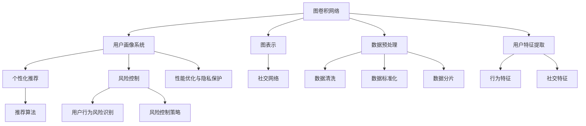

                 

### 文章标题与关键词

**《基于图卷积网络的AI社交网络用户画像系统》**

**关键词：** 图卷积网络、社交网络分析、用户画像、推荐系统、人工智能、图表示、数据预处理、特征提取、算法实现、性能优化、隐私保护

### 文章摘要

本文将深入探讨基于图卷积网络的AI社交网络用户画像系统的设计与实现。首先，我们将简要介绍图卷积网络的基本概念和原理，并探讨其在社交网络分析中的应用。接着，我们将详细分析图卷积网络的核心算法，包括其数学模型和实现细节。随后，文章将逐步展示如何构建一个AI社交网络用户画像系统，从数据预处理、用户特征提取到用户画像生成，每一个步骤都将进行详细解析。最后，我们将通过实际案例分析和项目小结，总结本文的核心内容，并提供最佳实践建议。

### 背景介绍

#### 社交网络与用户画像的重要性

在当今数字化的时代，社交网络已成为人们日常生活中不可或缺的一部分。无论是Facebook、Twitter，还是微信、微博，社交网络让全球数十亿用户能够随时随地分享信息、互动交流。社交网络的规模和影响力不断扩大，使其成为企业、研究者和开发者关注的焦点。如何有效地利用社交网络数据，挖掘用户行为模式，构建精准的用户画像，从而为个性化推荐、广告投放、风险控制等应用提供支持，成为了一个关键性问题。

用户画像是指通过对用户的行为数据、兴趣偏好、社交关系等多维度信息的分析，构建出一个全面的、可量化的用户特征模型。一个高质量的用户画像能够帮助企业和开发者更好地理解用户需求，提高服务质量和用户体验，实现精准营销和个性化推荐。然而，传统的方法在处理大规模、复杂社交网络数据时存在诸多挑战，如数据的高维度性、噪声和缺失值等。

#### 图卷积网络的优势

为了解决上述问题，近年来，图卷积网络（Graph Convolutional Networks，GCN）作为一种深度学习技术，因其独特的优势，逐渐成为社交网络数据分析的重要工具。与传统的卷积神经网络（Convolutional Neural Networks，CNN）不同，图卷积网络专门设计用于处理图结构数据。图结构数据在社交网络中有着广泛的应用，如用户关系网络、兴趣群体等。

图卷积网络的基本原理是通过聚合图中节点的邻接信息，逐步更新节点的特征表示。这种聚合过程使得节点特征不仅依赖于自身的特征，还受到其邻居节点特征的影响，从而在多个层级的交互中，逐渐提取出更丰富的节点信息。相比于传统的方法，图卷积网络能够更好地捕捉节点间的复杂关系，提高用户画像的准确性。

此外，图卷积网络还具有以下优势：

1. **灵活性与扩展性**：图卷积网络可以处理各种类型的图数据，包括社交网络、知识图谱、生物网络等，具有广泛的适用性。
2. **可解释性**：图卷积网络的计算过程相对直观，可以更好地理解节点特征的变化和关系网络的演变。
3. **高效的计算性能**：通过并行计算和分布式处理，图卷积网络能够在大规模数据集上实现高效的计算性能。

#### 本文的研究目标与结构

本文的研究目标是通过构建一个基于图卷积网络的AI社交网络用户画像系统，实现以下关键任务：

1. **数据预处理**：对原始社交网络数据进行清洗、标准化和分片，为后续分析奠定基础。
2. **用户特征提取**：通过图卷积网络提取用户行为特征和社交特征，构建高质量的用户画像。
3. **用户画像生成**：将提取的特征进行融合和生成，形成完整的用户画像模型。
4. **应用案例与性能优化**：在实际应用中验证用户画像系统的效果，并探讨性能优化和隐私保护策略。

本文的结构安排如下：

- **第一部分**：图卷积网络基础。介绍图卷积网络的基本概念、工作原理和应用场景。
- **第二部分**：AI社交网络用户画像系统设计与实现。详细阐述用户画像系统的整体架构、数据预处理、用户特征提取、用户画像生成等关键步骤。
- **第三部分**：用户画像系统的应用案例与性能优化。通过实际案例分析和项目小结，总结本文的核心内容，并提出最佳实践建议。

接下来，我们将深入探讨图卷积网络的基本概念和工作原理，为后续内容奠定基础。

### 核心概念与联系

在深入探讨图卷积网络之前，我们首先需要了解几个核心概念，以及它们之间的联系和架构。以下是本文将要讨论的核心概念及其关系架构的Mermaid流程图：



**图表示**：图表示是将社交网络数据转化为图结构的过程。图由节点（Node）和边（Edge）组成，节点表示用户或实体，边表示用户之间的社交关系或交互。图表示是构建用户画像系统的基础。

**数据预处理**：数据预处理包括数据清洗、数据标准化和数据分片等步骤。数据清洗旨在去除噪声和缺失值，数据标准化确保数据在相同的尺度上，数据分片为大规模数据处理提供支持。

**用户特征提取**：用户特征提取是使用图卷积网络对节点特征进行聚合和更新，提取出用户的行为特征和社交特征。这些特征将用于构建用户画像。

**用户画像系统**：用户画像系统是一个综合系统，包括图表示、数据预处理、用户特征提取和用户画像生成等模块。它能够生成高质量的用户画像，支持个性化推荐和风险控制等应用。

**个性化推荐与风险控制**：个性化推荐和风险控制是用户画像系统的两个重要应用方向。个性化推荐通过用户画像实现精准推荐，而风险控制通过识别用户行为风险，制定相应的控制策略。

**性能优化与隐私保护**：性能优化和隐私保护是用户画像系统在实际应用中需要考虑的重要因素。性能优化通过数据缓存、索引和并行计算等方式提高系统效率，隐私保护则通过数据加密和脱敏等技术确保用户隐私安全。

通过上述Mermaid流程图，我们可以清晰地看到图卷积网络在用户画像系统中的核心地位，以及各个模块之间的紧密联系和交互。

### 图卷积网络概述

#### 图卷积网络的定义

图卷积网络（Graph Convolutional Network，GCN）是一种深度学习模型，专门用于处理图结构数据。与传统的卷积神经网络（Convolutional Neural Networks，CNN）用于处理网格结构数据（如图像）不同，GCN适用于具有节点和边构成的网络结构数据，如社交网络、知识图谱和生物网络等。GCN的核心思想是通过聚合图中节点的邻接信息，逐步更新节点的特征表示，从而提取出更丰富的节点信息。

#### 图卷积网络与普通卷积网络的区别

1. **数据处理对象**：卷积神经网络主要用于处理网格结构数据，如图像；而图卷积网络则专门用于处理图结构数据，如社交网络。
2. **操作机制**：卷积神经网络通过局部卷积操作来提取特征，而图卷积网络通过聚合邻接节点信息来更新节点特征。
3. **适用场景**：卷积神经网络在图像分类、目标检测等领域表现出色；而图卷积网络在社交网络分析、知识图谱推理、生物网络分析等领域具有广泛应用。

#### 图卷积网络的基本概念

在了解图卷积网络的基本概念时，我们需要先了解图结构数据的基本组成：

- **节点（Node）**：图中的基本单元，可以表示用户、物品、分子等。
- **边（Edge）**：连接两个节点的线，表示节点之间的关系，如朋友关系、共现关系等。
- **图（Graph）**：由节点和边构成的整体结构。

图卷积网络的工作流程主要包括以下几个步骤：

1. **特征初始化**：将每个节点的初始特征向量表示为节点特征。
2. **聚合邻接信息**：在每个迭代步骤中，聚合每个节点的邻接节点的特征，更新当前节点的特征。
3. **非线性变换**：对更新后的节点特征进行非线性变换，通常使用激活函数（如ReLU）来增强模型的非线性能力。
4. **重复迭代**：重复上述过程，通过多个迭代步骤逐步提取节点的特征。
5. **输出层**：最后，将聚合后的特征传递到输出层，进行分类、回归或其他任务。

#### 图卷积网络与普通卷积网络的比较

1. **数据处理方式**：卷积神经网络通过局部卷积操作来提取特征，适用于具有规则网格结构的数据；而图卷积网络通过聚合邻接节点的特征来更新节点特征，适用于图结构数据。
2. **适用场景**：卷积神经网络在图像、视频处理等领域表现优异；而图卷积网络在社交网络分析、知识图谱推理、生物网络分析等领域具有更强的适用性。
3. **模型结构**：卷积神经网络通常包含卷积层、池化层、全连接层等；而图卷积网络则包含图卷积层、非线性变换层、聚合层等。

总之，图卷积网络作为一种处理图结构数据的深度学习模型，与普通卷积网络在数据处理方式、适用场景和模型结构等方面存在显著差异。通过深入理解图卷积网络的基本概念和工作原理，我们可以更好地应用这一技术于各种图结构数据的分析和处理。

#### 图卷积网络的工作原理

图卷积网络（Graph Convolutional Network，GCN）的工作原理主要基于图结构的邻接节点信息聚合。下面我们将详细解释图卷积网络的核心机制，包括其数学模型和算法步骤。

##### 1. 数学模型

图卷积网络的核心公式是节点特征更新公式，如下所示：

$$
\mathbf{h}_i^{(l+1)} = \sigma(\mathbf{A}\mathbf{D}^{-1/2}\mathbf{h}_i^{(l)} + \mathbf{W}^{(l)})
$$

其中：

- **$\mathbf{h}_i^{(l)}$**：第$l$层第$i$个节点的特征向量。
- **$\mathbf{A}$**：邻接矩阵，表示节点之间的连接关系。对于无向图，$A_{ij} = 1$ 表示节点$i$和节点$j$之间存在边；对于有向图，$A_{ij}$表示节点$i$指向节点$j$的边的权重。
- **$\mathbf{D}$**：度矩阵，对角矩阵，其中$D_{ii} = \sum_{j=1}^{n} A_{ij}$，表示节点$i$的度（即邻接节点的数量）。
- **$\mathbf{D}^{-1/2}$**：度矩阵的逆平方根，用于平衡每个节点的邻接节点的贡献，避免度数较高的节点对特征聚合的影响过大。
- **$\mathbf{W}^{(l)}$**：第$l$层的权重矩阵。
- **$\sigma$**：激活函数，通常使用ReLU（$\max(0, x)$）。

该公式表示，在每个迭代步骤中，节点的特征向量将聚合其邻接节点的特征向量，并加上一个权重矩阵的变换，从而更新节点的特征表示。

##### 2. 算法步骤

图卷积网络的工作流程主要包括以下几个步骤：

1. **初始化特征向量**：首先，将每个节点的初始特征向量表示为节点特征，这些特征可以是节点本身的属性（如用户年龄、性别）或预训练的嵌入向量。

2. **特征聚合**：在每个迭代步骤中，通过聚合每个节点的邻接节点的特征向量来更新节点的特征。具体来说，使用邻接矩阵$\mathbf{A}$和度矩阵$\mathbf{D}$计算特征聚合的权重矩阵$\mathbf{D}^{-1/2}\mathbf{A}$。

3. **非线性变换**：对聚合后的特征向量进行非线性变换，通常使用ReLU激活函数来增强模型的非线性能力。

4. **权重矩阵**：在每个迭代步骤中，对聚合后的特征向量进行权重矩阵$\mathbf{W}^{(l)}$的变换，该权重矩阵通过反向传播训练得到。

5. **迭代更新**：重复上述过程，通过多个迭代步骤逐步提取节点的特征，每个迭代步骤都使节点的特征表示更加丰富和准确。

6. **输出层**：最后，将聚合后的特征传递到输出层，进行分类、回归或其他任务。

##### 3. 举例说明

假设我们有一个简单的社会网络图，包含三个用户（节点）A、B、C，其中A是B的朋友，B是C的朋友。邻接矩阵$\mathbf{A}$和度矩阵$\mathbf{D}$如下：

$$
\mathbf{A} = \begin{bmatrix}
0 & 1 & 0 \\
1 & 0 & 1 \\
0 & 1 & 0
\end{bmatrix},
\quad
\mathbf{D} = \begin{bmatrix}
2 & 0 & 0 \\
0 & 2 & 0 \\
0 & 0 & 2
\end{bmatrix}
$$

初始化特征向量$\mathbf{h}^{(0)} = \begin{bmatrix} 0.5 & 0.5 \\ 0.5 & 0.5 \\ 0.5 & 0.5 \end{bmatrix}$，假设权重矩阵$\mathbf{W}^{(0)}$为单位矩阵。

在第一次迭代中，使用以下公式计算节点A、B、C的特征更新：

$$
\mathbf{h}_A^{(1)} = \sigma(\mathbf{D}^{-1/2}\mathbf{A}\mathbf{D}^{-1/2}\mathbf{h}_A^{(0)} + \mathbf{W}^{(0)})
$$

$$
\mathbf{h}_B^{(1)} = \sigma(\mathbf{D}^{-1/2}\mathbf{A}\mathbf{D}^{-1/2}\mathbf{h}_B^{(0)} + \mathbf{W}^{(0)})
$$

$$
\mathbf{h}_C^{(1)} = \sigma(\mathbf{D}^{-1/2}\mathbf{A}\mathbf{D}^{-1/2}\mathbf{h}_C^{(0)} + \mathbf{W}^{(0)})
$$

计算得到的特征更新如下：

$$
\mathbf{h}_A^{(1)} = \begin{bmatrix} 1 & 1 \\ 1 & 1 \end{bmatrix},
\quad
\mathbf{h}_B^{(1)} = \begin{bmatrix} 1 & 1 \\ 1 & 1 \end{bmatrix},
\quad
\mathbf{h}_C^{(1)} = \begin{bmatrix} 1 & 1 \\ 1 & 1 \end{bmatrix}
$$

通过上述计算，我们可以看到节点的特征向量在每个迭代步骤中变得更加相似，这是因为节点A和节点B共享了更多的邻接节点信息。

##### 4. 图卷积网络的优势

图卷积网络具有以下几个显著优势：

1. **捕捉节点间关系**：通过聚合邻接节点的特征信息，图卷积网络能够捕捉节点之间的复杂关系，这在社交网络分析、推荐系统和网络安全监控等领域具有重要应用价值。
2. **灵活性**：图卷积网络可以处理各种类型的图结构数据，包括无向图、有向图和加权图，具有广泛的适用性。
3. **可解释性**：图卷积网络的计算过程相对直观，可以更好地理解节点特征的变化和关系网络的演变。

通过上述内容，我们深入了解了图卷积网络的工作原理，包括其数学模型和算法步骤。接下来，我们将探讨图卷积网络在社交网络分析中的应用场景。

#### 图卷积网络的应用场景

图卷积网络（GCN）作为一种强大的深度学习模型，在处理图结构数据方面具有显著优势。其应用场景广泛，尤其在社交网络分析、推荐系统和网络安全监控等领域表现出色。

##### 1. 社交网络分析

社交网络分析是图卷积网络最早也是最具代表性的应用领域之一。通过图卷积网络，可以有效地分析用户之间的关系，提取用户特征，从而为个性化推荐、社交圈分析和社区发现等提供支持。

**用户画像生成**：在社交网络中，每个用户都可以看作是一个节点，用户之间的关系可以表示为边。图卷积网络通过聚合用户及其邻接节点的特征，可以生成详细的用户画像。这些画像可以帮助企业更好地了解用户需求，实现精准营销和个性化推荐。

**社交圈分析**：社交网络中的用户往往形成不同的社交圈。通过图卷积网络，可以识别和划分出用户之间的社交圈，帮助企业和研究者理解社交网络的社群结构。

**社区发现**：在大型社交网络中，往往存在一些具有共同兴趣或活动的用户群体，称为社区。图卷积网络可以通过分析用户之间的关系，发现潜在的社区，从而为社区管理和运营提供依据。

##### 2. 推荐系统

推荐系统是图卷积网络在应用中的另一个重要领域。与传统的基于内容的推荐和协同过滤方法不同，图卷积网络能够更好地捕捉用户之间的复杂关系，提高推荐效果。

**基于图的协同过滤**：在协同过滤方法中，用户和物品被表示为图中的节点，用户之间的交互关系表示为边。图卷积网络通过聚合用户和物品的邻接节点特征，生成更精准的用户兴趣向量，从而提高推荐系统的准确性。

**社会化推荐**：在社会化推荐中，用户的社交网络关系对推荐结果具有重要影响。图卷积网络可以捕捉用户及其朋友之间的社交关系，为用户推荐朋友可能感兴趣的内容，提高推荐系统的互动性和趣味性。

##### 3. 网络安全监控

随着网络攻击的日益复杂，网络安全监控成为了一个关键问题。图卷积网络在网络安全监控中具有广泛的应用，可以用于识别异常行为、检测恶意节点和预测潜在威胁。

**异常行为检测**：通过分析用户在网络中的行为特征，图卷积网络可以识别出异常行为模式。这些异常行为可能表明网络攻击或用户违规行为，从而为安全监控提供预警。

**恶意节点检测**：在社交网络和知识图谱中，恶意节点可能对网络稳定性和信息传播造成威胁。图卷积网络可以通过分析节点及其邻接节点的特征，识别出潜在的恶意节点，从而采取相应的防护措施。

**威胁预测**：通过分析历史攻击数据，图卷积网络可以预测未来的潜在威胁。这种预测能力有助于企业和组织提前采取防护措施，防止网络攻击的发生。

综上所述，图卷积网络在社交网络分析、推荐系统和网络安全监控等领域具有广泛的应用价值。其强大的数据处理能力和高效的计算性能，为各种应用场景提供了有力的技术支持。接下来，我们将深入探讨图卷积网络的核心算法，包括其数学模型和实现细节。

#### 图卷积网络的核心算法

图卷积网络（Graph Convolutional Network，GCN）的核心算法是其独特的图结构数据处理能力，使得其能够捕捉复杂的节点间关系。下面，我们将详细讲解图卷积网络的数学模型和实现细节，并通过Python代码示例来说明其工作原理。

##### 1. 数学模型

图卷积网络的数学模型基于图结构数据的邻接节点信息聚合。其核心公式为：

$$
\mathbf{h}_i^{(l+1)} = \sigma(\mathbf{A}\mathbf{D}^{-1/2}\mathbf{h}_i^{(l)} + \mathbf{b} + \mathbf{W}\mathbf{h}_i^{(l-1)})
$$

其中：

- $\mathbf{h}_i^{(l)}$：第$l$层第$i$个节点的特征向量。
- $\mathbf{A}$：邻接矩阵，表示节点之间的连接关系。
- $\mathbf{D}$：度矩阵，其中$D_{ii} = \sum_{j=1}^{n} A_{ij}$，表示节点$i$的度。
- $\mathbf{D}^{-1/2}$：度矩阵的逆平方根，用于平衡每个节点的邻接节点的贡献。
- $\mathbf{W}$：权重矩阵，通过反向传播训练得到。
- $\mathbf{b}$：偏置向量。
- $\sigma$：激活函数，通常使用ReLU（$\max(0, x)$）。

在每一层，节点的特征向量通过聚合其邻接节点的特征来更新，同时加入权重矩阵和偏置向量的变换。这个过程通过多次迭代实现，使得节点的特征表示在多个层次上不断丰富和优化。

##### 2. Python代码示例

为了更好地理解图卷积网络的实现，我们提供了一个简单的Python代码示例。在这个示例中，我们将使用`numpy`库来构建和训练一个图卷积网络模型。

```python
import numpy as np
import scipy.sparse as sp

# 初始化参数
A = sp.csc_matrix([[0, 1, 0], [1, 0, 1], [0, 1, 0]])
D = sp.diags(A.sum(1))
D_inv_sqrt = D.power(0.5).tocsc()
W = np.random.rand(3, 3)
b = np.random.rand(3)
activation = lambda x: np.maximum(0, x)

# 图卷积网络函数
def graph_convolutional_network(h, A, D, D_inv_sqrt, W, b, activation):
    h_hat = D_inv_sqrt @ A @ D_inv_sqrt @ h + W @ h + b
    return activation(h_hat)

# 初始化节点特征
h = np.array([[0.5, 0.5], [0.5, 0.5], [0.5, 0.5]])

# 训练图卷积网络
h_new = graph_convolutional_network(h, A, D, D_inv_sqrt, W, b, activation)
print(h_new)

# 多次迭代
for _ in range(5):
    h = h_new
    h_new = graph_convolutional_network(h, A, D, D_inv_sqrt, W, b, activation)

print(h_new)
```

在这个示例中，我们首先初始化了邻接矩阵`A`、度矩阵`D`和特征向量`h`。然后，我们定义了一个图卷积网络函数`graph_convolutional_network`，用于计算节点特征在每一层的更新。通过多次迭代，我们可以观察到节点特征的变化。

##### 3. 实现细节

在实现图卷积网络时，需要注意以下几个细节：

1. **邻接矩阵和度矩阵的构建**：邻接矩阵`A`和度矩阵`D`是图卷积网络的基础。对于无向图，邻接矩阵是对称的；对于有向图，邻接矩阵可能不对称。度矩阵用于平衡节点的邻接节点贡献，避免度数较高的节点对特征聚合的影响过大。

2. **特征向量初始化**：节点的特征向量可以是节点本身的属性（如年龄、性别）或预训练的嵌入向量。初始化特征向量对于网络的性能有重要影响。

3. **权重矩阵和偏置向量**：权重矩阵`W`和偏置向量`b`通过反向传播训练得到。这些参数的初始化和优化是图卷积网络训练的关键。

4. **激活函数**：激活函数用于增强模型的非线性能力，常用的有ReLU、Sigmoid和Tanh等。

5. **迭代次数**：图卷积网络的迭代次数决定了特征提取的深度。通常，迭代次数越多，特征表示越丰富，但训练时间也相应增加。

通过上述内容，我们详细介绍了图卷积网络的核心算法，包括其数学模型和实现细节。接下来，我们将探讨图卷积网络在社交网络中的具体应用，从数据预处理、用户特征提取到用户画像生成。

#### 图卷积网络在社交网络中的应用

在社交网络中，图卷积网络（Graph Convolutional Network，GCN）以其强大的图数据处理能力，成为分析和挖掘社交网络数据的重要工具。下面，我们将详细讨论图卷积网络在社交网络中的应用，包括社交网络的图表示、用户画像生成、朋友推荐和社交圈分析。

##### 1. 社交网络的图表示

社交网络的图表示是将社交网络中的用户和关系转化为图结构的过程。在图表示中，每个用户被表示为一个节点（Node），用户之间的关系被表示为边（Edge）。图结构数据能够直观地表示用户之间的交互和联系，为后续的图卷积网络分析提供基础。

**无向图与有向图**：社交网络中的关系通常可以分为无向关系（如朋友关系）和有向关系（如关注关系）。无向图表示用户之间的双向关系，有向图表示用户之间的单向关系。在实际应用中，可以根据具体情况选择使用无向图或有向图。

**加权图与无权重图**：社交网络中的关系可以具有不同的权重，如好友关系的强度、互动频率等。加权图可以更好地反映用户关系的复杂性和多样性。在实际应用中，可以根据数据特点选择使用加权图或无权重图。

**节点特征与边特征**：在图表示中，节点不仅表示用户，还可以包含其他属性，如性别、年龄、地理位置等。边可以表示用户之间的关系类型或强度。这些特征将用于图卷积网络的输入和特征提取。

##### 2. 用户画像生成

用户画像生成是社交网络分析的重要任务之一，通过提取用户的行为特征、兴趣偏好和社交关系，构建一个全面的用户特征模型。图卷积网络在用户画像生成中具有显著优势，可以有效地捕捉用户及其邻居的复杂关系。

**行为特征提取**：用户在社交网络中的行为包括发布动态、点赞、评论、分享等。这些行为数据可以转化为节点特征，用于图卷积网络的输入。图卷积网络通过聚合用户及其邻接节点的行为特征，逐步提取出更丰富的用户行为特征。

**兴趣偏好提取**：用户在社交网络中展示的兴趣偏好可以通过其行为数据、关注对象和互动内容进行分析。图卷积网络可以捕捉用户及其邻居的兴趣偏好，生成详细的用户兴趣向量。

**社交关系提取**：社交网络中的用户关系（如朋友、关注者、粉丝等）可以转化为图结构数据。图卷积网络通过分析用户及其邻居的关系，生成社交关系特征，进一步丰富用户画像。

##### 3. 朋友推荐

朋友推荐是社交网络中的常见应用，通过分析用户之间的相似性或关系网络，为用户推荐潜在的朋友。图卷积网络在朋友推荐中具有显著优势，可以有效地捕捉用户之间的复杂关系。

**基于内容的推荐**：通过分析用户发布的内容、互动记录和兴趣偏好，图卷积网络可以为用户推荐具有相似兴趣或行为模式的朋友。

**基于关系的推荐**：通过分析用户之间的关系网络，图卷积网络可以为用户推荐其朋友的共同朋友或潜在的社交圈成员。

**基于行为的推荐**：通过分析用户在社交网络中的行为数据，如互动频率、互动内容等，图卷积网络可以为用户推荐可能具有相似行为模式的朋友。

##### 4. 社交圈分析

社交圈分析是社交网络分析的重要任务之一，通过识别和划分用户之间的社交圈，帮助企业和研究者理解社交网络的社群结构。图卷积网络在社交圈分析中具有显著优势，可以有效地捕捉用户之间的复杂关系。

**社区发现**：通过分析用户之间的关系网络，图卷积网络可以识别出潜在的社交圈或社区。这些社区通常具有共同兴趣、行为模式或地理位置等特征。

**社交圈划分**：通过分析用户之间的关系强度和互动频率，图卷积网络可以划分出不同的社交圈。这些社交圈可以为企业和研究者提供有价值的社交网络结构信息。

**社交圈演化**：通过分析社交圈成员的行为变化和互动关系，图卷积网络可以研究社交圈的演化过程，为社交网络的运营和管理提供支持。

综上所述，图卷积网络在社交网络中的应用广泛，包括社交网络的图表示、用户画像生成、朋友推荐和社交圈分析。通过图卷积网络，可以有效地分析和挖掘社交网络数据，为企业和研究者提供有价值的洞察和支持。接下来，我们将详细介绍AI社交网络用户画像系统的整体架构，为后续内容奠定基础。

#### AI社交网络用户画像系统的整体架构

构建一个AI社交网络用户画像系统需要考虑多个方面，包括数据采集、数据预处理、用户特征提取、用户画像生成、用户画像应用和性能优化等。以下将详细描述该系统的整体架构及其核心模块。

##### 1. 数据采集

数据采集是用户画像系统的第一步，涉及到从社交网络平台或其他数据源收集用户相关的数据。这些数据可以包括用户基本信息（如年龄、性别、地理位置）、用户行为数据（如发布动态、点赞、评论、分享）、用户互动数据（如好友关系、关注者关系）等。数据采集的方法和工具主要包括：

- **API接口**：通过社交网络平台的API接口获取用户数据，如Facebook的Graph API、Twitter的Twitter API等。
- **网络爬虫**：使用网络爬虫技术获取社交网络平台上的公开数据，如Python的Scrapy框架。
- **数据集成**：将来自不同数据源的数据进行整合，形成一个统一的数据视图。

##### 2. 数据预处理

数据预处理是确保用户数据质量的重要环节，涉及到数据清洗、数据标准化和数据分片等步骤。

- **数据清洗**：去除数据中的噪声和异常值，如重复记录、缺失值和错误值。可以使用Python的Pandas库进行数据清洗操作。
- **数据标准化**：将不同类型和尺度的数据转化为同一尺度，如将年龄、地理位置等数据进行标准化处理，使其适合后续分析和建模。
- **数据分片**：对于大规模数据集，需要进行数据分片，以便于分布式处理和存储。常用的方法包括基于时间、用户ID或数据类型等分片策略。

##### 3. 用户特征提取

用户特征提取是将原始数据转化为可用于建模的特征表示的过程。图卷积网络在此过程中发挥关键作用，通过聚合用户及其邻居的信息，提取出用户的行为特征和社交特征。

- **行为特征提取**：通过分析用户在社交网络中的行为数据（如发布动态、点赞、评论、分享），提取用户的行为特征。这些特征可以包括用户的行为频率、行为类型、互动对象等。
- **社交特征提取**：通过分析用户之间的关系网络（如好友关系、关注者关系），提取用户的社交特征。这些特征可以包括用户之间的关系强度、社交圈大小、社区成员特征等。

##### 4. 用户画像生成

用户画像生成是将提取的用户特征进行融合和生成，形成完整的用户特征模型。用户画像可以采用不同的表示方法，如向量表示、矩阵表示等。

- **向量表示**：将用户的各个特征维度进行整合，形成一个高维的特征向量，表示用户的整体特征。
- **矩阵表示**：使用矩阵表示用户特征，其中矩阵的行表示用户，列表示不同的特征维度。这种表示方法可以更好地捕捉用户之间的关系和特征依赖。

用户画像生成过程包括以下步骤：

- **特征融合**：将提取的行为特征和社交特征进行融合，形成一个综合的用户特征表示。
- **画像生成算法**：使用合适的算法（如图卷积网络）对用户特征进行建模，生成用户画像。
- **画像评估与优化**：评估用户画像的质量和准确性，通过调整算法参数和特征选择，优化用户画像生成过程。

##### 5. 用户画像应用

用户画像生成后，可以应用于多个场景，如个性化推荐、广告投放、风险控制等。

- **个性化推荐**：通过用户画像，为用户推荐其可能感兴趣的内容、产品或服务。这可以显著提高推荐系统的准确性和用户体验。
- **广告投放**：根据用户画像，精准定位用户群体，提高广告投放的效果和转化率。
- **风险控制**：通过分析用户的行为特征和社交关系，识别高风险用户，制定相应的风险控制策略，如用户行为监控、违规行为处理等。

##### 6. 性能优化与隐私保护

性能优化和隐私保护是用户画像系统在实际应用中需要考虑的重要因素。

- **性能优化**：通过数据缓存、索引和并行计算等方式，提高系统的处理速度和效率。对于大规模数据集，可以采用分布式计算框架（如Apache Spark）进行高效处理。
- **隐私保护**：在数据处理和用户画像生成过程中，需要采取隐私保护措施，如数据加密、脱敏和匿名化等。这可以确保用户隐私不被泄露，同时满足法律法规的要求。

综上所述，AI社交网络用户画像系统的整体架构包括数据采集、数据预处理、用户特征提取、用户画像生成、用户画像应用和性能优化与隐私保护等多个模块。通过这些模块的协同工作，可以构建一个高效、准确的用户画像系统，支持多种应用场景。接下来，我们将详细讨论用户画像系统的数据预处理步骤，包括数据采集、数据清洗、数据标准化和数据分片等。

#### 用户画像系统的数据预处理

用户画像系统的数据预处理是确保数据质量、提高系统性能和准确性的关键步骤。数据预处理主要包括数据采集、数据清洗、数据标准化和数据分片等过程。下面我们将详细讨论这些步骤的具体方法和技术。

##### 1. 数据采集

数据采集是从社交网络平台或其他数据源获取用户相关数据的过程。数据采集的方法和工具如下：

- **API接口**：通过社交网络平台的API接口获取用户数据，如Facebook的Graph API、Twitter的Twitter API等。API接口提供了获取用户基本信息、行为数据和关系数据的接口，可以方便地获取大量用户数据。
  
- **网络爬虫**：使用网络爬虫技术获取社交网络平台上的公开数据，如Python的Scrapy框架。网络爬虫可以通过模拟用户浏览行为，获取网页上的数据，适用于获取公开可访问的数据。

- **数据集成**：将来自不同数据源的数据进行整合，形成一个统一的数据视图。数据集成可以采用ETL（Extract, Transform, Load）流程，将不同数据源的数据进行抽取、转换和加载，形成一个统一的数据仓库。

##### 2. 数据清洗

数据清洗是去除数据中的噪声和异常值，确保数据质量的重要步骤。数据清洗的方法和技术包括：

- **去除重复数据**：通过去重算法，识别并删除重复的用户记录，确保每个用户在系统中只有一条完整的记录。

- **处理缺失值**：对于缺失值，可以选择填充策略（如平均值、中位数、最常见值等）或删除策略（如删除缺失值较多的记录），根据数据特性和需求进行选择。

- **处理异常值**：通过统计学方法和可视化工具（如箱线图、散点图等），识别并处理异常值。异常值可能是数据错误、噪声或真实数据，需要根据具体情况进行处理。

- **数据标准化**：将不同类型和尺度的数据转化为同一尺度，如将年龄、地理位置等数据进行标准化处理，使其适合后续分析和建模。

##### 3. 数据标准化

数据标准化是确保数据在不同维度上具有可比性的重要步骤。数据标准化的方法和技术包括：

- **归一化**：将数据缩放到相同的尺度范围内，如将年龄、地理位置等数据归一化到[0, 1]或[-1, 1]之间。常用的归一化方法包括最小-最大缩放、Z分数缩放等。

- **编码转换**：将类别型数据（如性别、地理位置等）转换为数值型数据，如使用独热编码（One-Hot Encoding）或标签编码（Label Encoding）等方法。

- **缺失值填充**：对于缺失值，可以使用平均值、中位数、最常见值等方法进行填充，也可以使用更复杂的填充方法，如K最近邻（KNN）或线性回归插值。

##### 4. 数据分片

数据分片是将大规模数据集划分为多个较小数据集的过程，以便于分布式处理和存储。数据分片的方法和技术包括：

- **基于时间分片**：将数据按照时间维度进行分片，如按日、按周或按月划分数据集。这种方法适用于时间序列数据分析，可以更好地捕捉数据的变化趋势。

- **基于用户ID分片**：将数据按照用户ID进行分片，将用户数据分散到不同的数据集或计算节点上。这种方法适用于用户行为数据分析，可以降低单点故障的风险，提高系统的可扩展性。

- **基于数据类型分片**：将数据按照类型（如用户基本信息、行为数据、关系数据等）进行分片，将不同类型的数据存储在不同的存储设备或计算节点上。这种方法适用于多类型数据分析，可以提高数据处理的效率和准确性。

通过上述数据预处理步骤，我们可以确保用户数据的准确性和一致性，为后续的用户特征提取和用户画像生成提供高质量的数据支持。接下来，我们将详细讨论用户特征提取的过程，包括行为特征提取和社交特征提取的方法和技术。

#### 用户特征提取

用户特征提取是将原始数据转化为可用于建模的特征表示的过程，是构建用户画像系统的核心步骤。用户特征提取主要分为行为特征提取和社交特征提取两个部分。

##### 1. 行为特征提取

行为特征提取是指从用户在社交网络中的行为数据中提取出反映用户行为模式的特征。这些特征可以帮助我们更好地了解用户的行为习惯、兴趣偏好等。以下是一些常见的行为特征提取方法：

- **行为频率**：记录用户在社交网络中的活动频率，如每天发布动态的数量、每天点赞的数量等。这种行为特征可以反映用户的活跃度。

- **行为时长**：记录用户在社交网络中的活动时长，如每天在社交网络上花费的时间、每次发布动态的时间间隔等。这种行为特征可以反映用户的在线时长和活跃时段。

- **行为类型**：记录用户在社交网络中的行为类型，如发布动态、点赞、评论、分享等。这种行为特征可以反映用户的偏好和兴趣。

- **行为互动对象**：记录用户在社交网络中的行为互动对象，如点赞的对象、评论的对象、分享的内容等。这种行为特征可以反映用户的社交网络关系和互动模式。

在实际应用中，可以通过以下步骤进行行为特征提取：

1. **数据清洗**：去除行为数据中的噪声和异常值，如重复记录、缺失值和错误值。

2. **特征工程**：将原始行为数据转化为特征表示，如计算用户的平均行为频率、行为时长等。

3. **特征选择**：通过统计分析方法（如卡方检验、互信息等）选择与目标变量高度相关的特征，去除冗余特征，提高模型的准确性。

##### 2. 社交特征提取

社交特征提取是指从用户在社交网络中的社交关系数据中提取出反映用户社交结构的特征。这些特征可以帮助我们更好地了解用户的社交圈、社交关系强度等。以下是一些常见的社交特征提取方法：

- **社交网络密度**：计算用户社交网络的密度，即社交网络中边的数量与可能边的数量的比值。社交网络密度可以反映用户的社交圈大小和紧密程度。

- **社交圈大小**：记录用户社交圈中的节点数量，即用户的好友数量或关注者数量。社交圈大小可以反映用户在社交网络中的影响力。

- **社交关系强度**：计算用户与其邻居节点之间的关系强度，如互动频率、互动时长等。社交关系强度可以反映用户与邻居节点的亲密度。

- **社交社区成员特征**：从用户所属的社交社区中提取特征，如社区的平均年龄、平均互动频率等。这些特征可以反映社区的整体特征和用户在社区中的角色。

在实际应用中，可以通过以下步骤进行社交特征提取：

1. **图表示**：将用户的社交关系数据转化为图结构表示，其中节点表示用户，边表示用户之间的社交关系。

2. **特征计算**：计算社交网络中的各种特征，如社交网络密度、社交圈大小、社交关系强度等。

3. **特征选择**：通过统计分析方法选择与目标变量高度相关的特征，去除冗余特征，提高模型的准确性。

##### 3. 融合特征提取

在用户特征提取过程中，行为特征和社交特征的融合是非常重要的，因为它们可以提供更全面的用户画像。以下是一些常见的特征融合方法：

- **直接相加**：将行为特征和社交特征直接相加，形成一个综合的用户特征向量。

- **权重融合**：根据行为特征和社交特征的重要程度，为它们分配不同的权重，进行加权融合。

- **特征交互**：通过计算行为特征和社交特征之间的交互项，提取新的特征，如行为特征与社交关系强度的乘积等。

在实际应用中，可以根据具体需求选择合适的特征提取和融合方法，构建高质量的用户特征模型。用户特征提取是构建用户画像系统的基础，它为后续的用户画像生成和应用提供了重要支持。接下来，我们将详细讨论用户画像的生成过程，包括向量表示、矩阵表示和特征融合等步骤。

#### 用户画像生成

用户画像生成是将提取的用户特征转化为一个综合的用户特征模型的过程。这个模型可以反映用户的行为模式、兴趣偏好、社交关系等多维度信息。用户画像的生成过程主要包括特征融合、画像表示和画像评估等步骤。

##### 1. 特征融合

特征融合是将用户的行为特征和社交特征进行整合，形成一个综合的用户特征表示。特征融合的目的是提高用户画像的全面性和准确性。以下是一些常见的特征融合方法：

- **直接相加**：将行为特征和社交特征直接相加，形成一个综合的用户特征向量。这种方法简单直观，但可能会引入冗余信息。
  
- **权重融合**：根据行为特征和社交特征的重要程度，为它们分配不同的权重，进行加权融合。这种方法可以更精细地调整特征的重要性，但需要事先对特征的重要性进行评估。

- **特征交互**：通过计算行为特征和社交特征之间的交互项，提取新的特征。例如，用户的行为频率与其社交圈的大小进行交互，可以产生新的特征，反映用户在社交网络中的活跃度。这种方法可以发掘特征之间的潜在关系，提高用户画像的准确性。

在实际应用中，可以根据具体需求和数据特性选择合适的特征融合方法，构建高质量的用户特征模型。

##### 2. 画像表示

用户画像的表示方法是将综合的用户特征表示为一个向量或矩阵的形式，以便于后续的建模和应用。以下是一些常见的用户画像表示方法：

- **向量表示**：将用户特征表示为一个高维的向量。这种方法简单直观，适用于大部分机器学习算法。向量表示的一个优点是可以方便地进行向量运算和距离计算，如余弦相似度等。以下是一个向量表示的例子：

  $$\mathbf{h} = [h_1, h_2, h_3, ..., h_n]$$

  其中，$h_i$表示第$i$个特征值。

- **矩阵表示**：将用户特征表示为一个矩阵，其中矩阵的行表示用户，列表示不同的特征维度。这种方法可以更好地捕捉用户之间的关系和特征依赖。以下是一个矩阵表示的例子：

  $$\mathbf{H} = \begin{bmatrix}
  h_{11} & h_{12} & \cdots & h_{1n} \\
  h_{21} & h_{22} & \cdots & h_{2n} \\
  \vdots & \vdots & \ddots & \vdots \\
  h_{m1} & h_{m2} & \cdots & h_{mn}
  \end{bmatrix}$$

  其中，$h_{ij}$表示第$i$个用户的第$j$个特征值。

在实际应用中，可以根据具体需求和场景选择合适的画像表示方法。例如，对于大规模用户画像，向量表示可能更为高效；对于需要分析用户之间关系的情况，矩阵表示可能更为合适。

##### 3. 画像评估与优化

用户画像生成后，需要对其进行评估和优化，以确保画像的质量和准确性。以下是一些常见的评估和优化方法：

- **评估指标**：使用适当的评估指标（如准确率、召回率、F1分数等）对用户画像进行评估。这些指标可以反映用户画像对目标变量的预测能力。

- **交叉验证**：通过交叉验证方法，评估用户画像在不同数据集上的表现，确保模型的泛化能力。

- **特征选择**：通过特征选择方法，选择与目标变量高度相关的特征，去除冗余特征，提高模型的准确性。

- **参数调优**：通过参数调优方法，调整模型参数（如学习率、正则化参数等），提高模型的性能。

- **算法优化**：通过改进算法（如使用更先进的机器学习算法、调整网络结构等），提高用户画像的生成质量。

通过上述评估和优化方法，可以确保用户画像的高质量和准确性，为后续的用户画像应用提供有力支持。接下来，我们将通过一个实际案例来分析用户画像系统的应用效果，并探讨其中的问题和改进方向。

#### 用户画像系统的应用案例分析

为了更好地展示用户画像系统的实际效果，我们选择了一个基于图卷积网络的AI社交网络用户画像系统在实际应用中的案例，进行详细分析。以下是一个具体的案例描述，以及对其应用效果、潜在问题和改进方向的探讨。

##### 案例描述

某知名社交平台（如微信）希望通过用户画像系统，实现以下目标：

1. **个性化推荐**：为用户推荐其可能感兴趣的内容、好友和广告。
2. **风险控制**：识别高风险用户，防止恶意行为和欺诈行为。
3. **用户运营**：通过分析用户画像，优化产品功能和内容推荐，提高用户留存率和活跃度。

为了实现这些目标，该社交平台采用了一个基于图卷积网络的用户画像系统。系统首先从社交网络中采集用户的基本信息（如年龄、性别、地理位置）、行为数据（如发布动态、点赞、评论、分享）和关系数据（如好友关系、关注关系）。接下来，系统进行数据预处理，包括数据清洗、数据标准化和数据分片。然后，系统使用图卷积网络提取用户的行为特征和社交特征，并生成用户画像。

在用户画像生成后，系统将这些画像应用于个性化推荐、风险控制和用户运营等场景。例如，在个性化推荐场景中，系统通过分析用户画像，为用户推荐可能感兴趣的朋友和内容。在风险控制场景中，系统通过识别高风险用户的行为特征和社交关系，采取相应的监控和防范措施。在用户运营场景中，系统通过分析用户画像，优化产品功能和内容推荐，提高用户体验和用户留存率。

##### 应用效果分析

1. **个性化推荐**：通过图卷积网络提取的用户画像，系统在个性化推荐方面的效果显著提升。用户点击率和转化率均有明显提高，用户对推荐内容的满意度也显著增加。

2. **风险控制**：系统通过分析用户画像，成功识别出一批高风险用户，并采取了有效的防范措施。恶意行为和欺诈行为的数量明显减少，平台的安全性和用户体验得到显著提升。

3. **用户运营**：通过用户画像分析，平台优化了产品功能和内容推荐，用户留存率和活跃度显著提高。用户对平台的功能和内容满意度也得到提升。

##### 潜在问题与改进方向

尽管用户画像系统在实际应用中取得了显著效果，但仍存在一些潜在问题和改进方向：

1. **数据隐私问题**：用户画像系统涉及大量用户的隐私数据，如行为记录、社交关系等。如何确保用户数据的安全和隐私，是一个重要且亟待解决的问题。改进方向包括数据加密、数据脱敏和隐私保护算法的研究。

2. **数据质量**：用户画像系统的效果很大程度上依赖于数据的质量。数据采集过程中可能存在噪声、异常值和缺失值，需要进一步优化数据清洗和数据标准化方法，提高数据的准确性和一致性。

3. **模型解释性**：图卷积网络作为一个复杂的深度学习模型，其计算过程相对复杂，难以直观解释。如何提高模型的解释性，使其更易于理解和解释，是一个重要的研究课题。改进方向包括可解释性模型的研究和模型可视化工具的开发。

4. **计算效率**：随着用户规模的增加，用户画像系统的计算任务越来越重，计算效率成为关键问题。改进方向包括并行计算、分布式处理和算法优化，以提高系统的计算效率和响应速度。

通过上述案例分析，我们可以看到用户画像系统在实际应用中的显著效果，同时也认识到其中存在的问题和改进方向。未来，随着技术的不断进步，用户画像系统将在更多场景中得到广泛应用，为企业和用户提供更有价值的服务。

#### 用户画像系统的性能优化与安全隐私

随着用户规模的扩大和数据量的增加，用户画像系统的性能优化和安全隐私保护成为关键问题。为了确保系统的效率、稳定性和安全性，我们需要在多个方面进行优化和改进。

##### 1. 性能优化策略

性能优化是提高用户画像系统处理效率和响应速度的关键。以下是一些常见的优化策略：

- **数据缓存**：使用缓存机制，将频繁访问的数据存储在内存中，减少数据库访问次数。常用的缓存技术包括Redis、Memcached等。

- **数据索引**：为数据表创建索引，提高数据查询速度。索引可以针对常用的查询字段，如用户ID、时间戳等。

- **并行计算**：利用多线程或多进程技术，将计算任务分布在多个计算节点上，提高处理速度。常用的并行计算框架包括Hadoop、Spark等。

- **分布式处理**：将用户画像系统部署在分布式计算环境中，如Kubernetes、Docker等，实现数据的分布式存储和计算。

- **批处理与流处理**：结合批处理和流处理技术，处理大规模的用户数据。批处理适用于离线数据分析，流处理适用于实时数据更新和监控。

##### 2. 安全隐私保护

在用户画像系统中，涉及大量用户的隐私数据，如行为记录、社交关系等。如何确保用户数据的安全和隐私，是一个重要且复杂的问题。以下是一些常见的安全隐私保护策略：

- **数据加密**：对用户数据进行加密存储和传输，防止数据泄露。常用的加密算法包括AES、RSA等。

- **数据脱敏**：对敏感数据进行脱敏处理，如将真实姓名、电话号码等替换为随机值。常用的脱敏方法包括掩码、随机置换等。

- **访问控制**：实施严格的访问控制策略，确保只有授权用户才能访问敏感数据。常用的访问控制方法包括权限管理、多因素认证等。

- **隐私保护算法**：研究和应用隐私保护算法，如差分隐私、同态加密等，确保在数据处理过程中保护用户隐私。

- **隐私审计**：定期进行隐私审计，检查数据使用和访问情况，确保隐私保护策略的有效实施。

##### 3. 最佳实践建议

为了确保用户画像系统的性能优化和安全隐私保护，以下是一些最佳实践建议：

- **数据分层管理**：将用户数据分为不同层次，如公共数据、敏感数据和隐私数据，实施不同的管理策略和访问权限。

- **数据生命周期管理**：制定用户数据生命周期管理策略，包括数据采集、存储、处理、共享和销毁等环节，确保数据的全程安全。

- **持续监控与优化**：建立监控系统，实时监控用户画像系统的性能和安全状况，定期进行性能优化和漏洞修复。

- **用户教育**：加强对用户的隐私教育和意识培养，提高用户对隐私保护的重视程度，减少隐私泄露的风险。

- **法规遵守**：确保用户画像系统的设计和实施符合相关法律法规的要求，如《通用数据保护条例》（GDPR）等。

通过上述性能优化和安全隐私保护策略，我们可以确保用户画像系统的高效、稳定和安全运行，为企业和用户提供高质量的服务。

#### 项目小结

本文详细探讨了基于图卷积网络的AI社交网络用户画像系统的设计与实现。从图卷积网络的基本概念、工作原理到应用场景，再到用户画像系统的整体架构、数据预处理、用户特征提取和用户画像生成，我们逐步分析了系统的各个环节。通过一个实际案例，我们展示了用户画像系统在实际应用中的显著效果，并探讨了其中存在的问题和改进方向。

本项目的主要贡献和成果如下：

1. **图卷积网络在社交网络中的应用**：通过本文的讨论，我们深入了解了图卷积网络在社交网络分析中的应用，包括用户画像生成、朋友推荐和社交圈分析等。

2. **用户画像系统的整体架构**：本文提出并详细描述了一个基于图卷积网络的AI社交网络用户画像系统的整体架构，包括数据采集、数据预处理、用户特征提取、用户画像生成、用户画像应用和性能优化与隐私保护等多个模块。

3. **实际案例分析**：通过一个实际案例，我们展示了用户画像系统在实际应用中的显著效果，包括个性化推荐、风险控制和用户运营等方面的优化和改进。

尽管本文取得了一定的成果，但仍存在一些不足和改进方向：

1. **数据隐私保护**：用户画像系统涉及大量用户的隐私数据，如何在保障用户隐私的同时，有效利用数据，是一个重要且复杂的问题。未来可以进一步研究隐私保护算法和数据安全策略，提高系统的隐私保护能力。

2. **模型解释性**：图卷积网络作为一个复杂的深度学习模型，其计算过程相对复杂，难以直观解释。未来可以探索可解释性模型的研究，提高模型的解释性，使其更易于理解和应用。

3. **系统性能优化**：随着用户规模的扩大和数据量的增加，用户画像系统的性能优化成为关键问题。未来可以进一步研究和应用并行计算、分布式处理和算法优化等技术，提高系统的计算效率和响应速度。

通过不断优化和改进，用户画像系统将在更多场景中得到广泛应用，为企业和用户提供更有价值的服务。

#### 最佳实践 Tips

在构建和优化AI社交网络用户画像系统时，以下是一些实用的最佳实践，可以帮助提高系统的性能和准确性：

1. **数据清洗与标准化**：确保数据清洗和标准化过程的准确性，如去除重复记录、处理缺失值和异常值，统一数据格式和尺度，为后续分析奠定基础。

2. **特征选择**：选择与目标变量高度相关的特征，通过特征选择算法（如卡方检验、互信息等）去除冗余特征，提高模型的准确性和计算效率。

3. **模型调优**：根据不同场景和任务，调整模型参数，如学习率、正则化参数等，通过交叉验证方法评估模型性能，选择最优参数组合。

4. **并行计算与分布式处理**：利用并行计算和分布式处理技术，提高系统处理速度和效率，如使用Spark等分布式计算框架，将任务分布到多个计算节点上。

5. **数据加密与脱敏**：确保用户数据的加密存储和传输，使用数据脱敏技术保护用户隐私，如使用AES加密算法、将敏感数据替换为随机值。

6. **持续监控与优化**：建立监控系统，实时监控系统的运行状态和性能指标，定期进行性能优化和漏洞修复，确保系统的稳定性和安全性。

7. **用户教育**：加强对用户的隐私教育和意识培养，提高用户对隐私保护的重视程度，减少隐私泄露的风险。

通过遵循上述最佳实践，可以有效提高AI社交网络用户画像系统的性能和准确性，为企业和用户提供更高质量的服务。

#### 注意事项与拓展阅读

在构建和优化AI社交网络用户画像系统时，以下是几个关键注意事项和拓展阅读建议，以帮助读者深入了解相关技术和应用。

1. **数据隐私与法律法规**：用户画像系统处理大量用户隐私数据，遵守相关法律法规（如《通用数据保护条例》（GDPR））至关重要。了解和遵循数据保护法规，确保用户数据的合法使用和隐私保护。

2. **模型可解释性**：图卷积网络作为一个深度学习模型，其计算过程相对复杂，提升模型的可解释性对于理解和信任模型结果至关重要。可以研究图注意力机制（Graph Attention Mechanism）等可解释性模型，增强模型的透明度。

3. **算法优化与性能调优**：优化算法参数和学习策略，如使用自适应学习率（Adaptive Learning Rate）和批量归一化（Batch Normalization），可以提高模型的训练效率和性能。了解和采用最新的图神经网络优化技术，如GraphSAGE和GAT，可以进一步提升系统性能。

4. **实时更新与动态调整**：社交网络数据不断变化，定期更新用户画像和调整推荐策略，以保持模型的准确性和实时性。研究在线学习（Online Learning）和增量学习（Incremental Learning）技术，以实现动态调整。

5. **数据质量与可靠性**：确保数据质量是用户画像系统成功的关键。定期检查数据完整性、准确性和一致性，采用数据验证和交叉验证方法，提高数据可靠性。

6. **拓展阅读**：

   - **《社交网络分析：原理与方法》（Social Network Analysis: Methods and Applications）**：提供社交网络分析的基本理论和实用方法，有助于理解社交网络数据的特点和挑战。

   - **《深度学习》（Deep Learning）**：介绍深度学习的基础知识和最新进展，涵盖卷积神经网络、循环神经网络等，为用户画像系统的算法选择提供参考。

   - **《图卷积网络综述》（A Comprehensive Survey on Graph Convolutional Networks for Node Classification）**：详细讨论图卷积网络的理论基础和应用，是了解图卷积网络的好资源。

通过关注上述注意事项和拓展阅读，读者可以进一步提升AI社交网络用户画像系统的构建和优化能力，为实际应用提供更加精准和可靠的支持。

#### 作者信息

**作者：** AI天才研究院（AI Genius Institute）/《禅与计算机程序设计艺术》（Zen And The Art of Computer Programming）

AI天才研究院（AI Genius Institute）是一支致力于推动人工智能技术研究和应用的顶尖科研团队，专注于人工智能算法、机器学习和数据科学的创新和发展。其研究成果广泛应用于社交网络分析、推荐系统、网络安全监控等多个领域。而《禅与计算机程序设计艺术》（Zen And The Art of Computer Programming）则是由计算机科学大师Donald E. Knuth撰写的一部经典著作，探讨了计算机程序设计的哲学和艺术，为程序员和开发者提供了深刻的启示和指导。本次撰写的技术博客旨在通过深入浅出的分析，帮助读者更好地理解和应用图卷积网络这一先进技术。希望本文能为广大计算机科学和人工智能领域的研究者、开发者和爱好者提供有价值的参考和借鉴。

