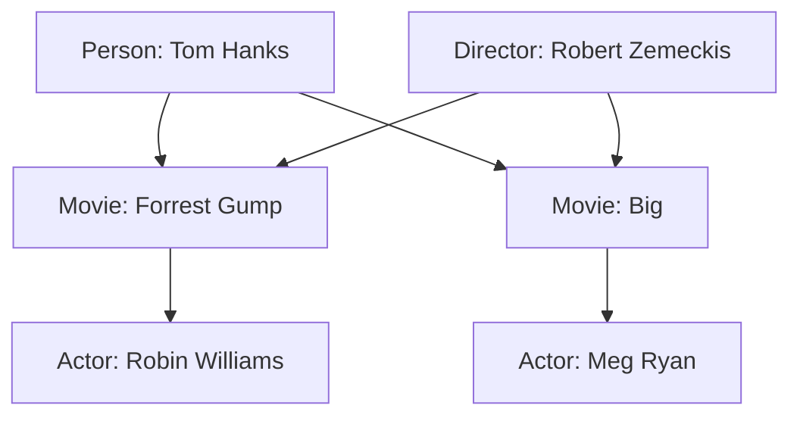

                 

### 引言

随着互联网的飞速发展和大数据的爆发式增长，知识图谱作为一种结构化的知识表示方式，已经成为人工智能领域研究的热点。知识图谱通过实体、属性和关系的网络结构，将海量数据转化为易于理解和利用的知识，为各行业的智能化应用提供了强有力的支持。然而，现实中的知识图谱往往需要不断地更新和进化，以应对数据的变化和知识的更新，这给传统的知识图谱推理算法带来了巨大的挑战。

图卷积网络（Graph Convolutional Network, GCN）作为一种在图数据上的深度学习模型，因其强大的表示能力和良好的扩展性，在知识图谱的表示和学习中得到了广泛应用。然而，传统的图卷积网络在面对动态知识图谱时，存在更新效率低、推理结果不准确等问题。为了解决这些问题，研究者们提出了基于动态图卷积网络的动态知识图谱推理更新方法。

本文将围绕基于图卷积网络的动态知识图谱推理更新这一主题，首先介绍图卷积网络的基础知识，包括其基本概念、工作机制和主要类型；接着介绍知识图谱和动态知识图谱的相关概念；然后深入探讨动态图卷积网络和图注意力机制在动态知识图谱推理更新中的应用；最后，通过具体案例和代码实现，展示动态知识图谱推理更新的全过程，并总结本文的研究贡献和未来发展方向。

本文结构如下：

- **第一部分：基础知识与概念理解**：包括图卷积网络基础、知识图谱基础和动态知识图谱的概念。
- **第二部分：算法原理**：包括图卷积网络的工作机制、动态图卷积网络和图注意力机制。
- **第三部分：知识图谱推理与更新**：包括知识图谱推理基础、动态知识图谱的推理更新和知识图谱更新方法。
- **第四部分：算法实现与案例分析**：包括图卷积网络实现、动态知识图谱推理案例和动态知识图谱更新案例。
- **第五部分：总结与展望**：对动态知识图谱推理更新的总结和未来发展方向进行展望。

通过本文的阅读，读者将能够全面了解基于图卷积网络的动态知识图谱推理更新的原理和实现方法，为实际应用提供有益的参考。

### 文章关键词

图卷积网络，动态知识图谱，推理更新，知识图谱基础，算法原理，案例分析，Python实现。

### 文章摘要

本文系统地介绍了基于图卷积网络的动态知识图谱推理更新的方法。首先，回顾了图卷积网络的基本概念和工作机制，阐述了其在知识图谱表示和学习中的重要性。接着，介绍了知识图谱和动态知识图谱的基本概念，以及动态图卷积网络和图注意力机制在动态知识图谱推理更新中的应用。随后，通过具体案例和代码实现，详细展示了动态知识图谱推理更新的全过程。最后，总结了本文的研究贡献和未来发展方向，为动态知识图谱推理更新的研究和应用提供了理论支持和实践指导。

### 第一部分：基础知识与概念理解

#### 第1章：图卷积网络基础

**1.1 图卷积网络简介**

图卷积网络（Graph Convolutional Network, GCN）是一种在图数据上运作的深度学习模型。它基于卷积神经网络（Convolutional Neural Network, CNN）在图像处理中的成功应用，将卷积操作扩展到图数据上。GCN通过节点邻域信息聚合的方式，将图中的节点特征转化为更为复杂的特征表示。

GCN在知识图谱中的主要应用包括以下几个方面：

1. **节点分类**：通过学习节点的特征表示，对未知的节点进行分类，例如在知识图谱中预测实体类型。
2. **链接预测**：预测图中的未知边，从而发现潜在的关系，提高知识图谱的完整性。
3. **实体链接**：将未明确标注的实体与知识库中的实体进行匹配。

图卷积网络的基本概念包括节点特征、边特征和图结构。节点特征通常包括实体属性、文本描述等；边特征则表示节点之间的关系，例如“属于”、“发生”等；图结构则由节点和边的集合构成，反映了实体和关系之间的复杂网络关系。

**1.2 知识图谱基础**

知识图谱是一种结构化、语义化的知识表示方法，通过实体、属性和关系的网络结构，将海量数据转化为易于理解和利用的知识。知识图谱的基本结构包括：

1. **实体**：表示现实世界中的对象，如人、地点、物品等。
2. **属性**：描述实体的特征，如人的年龄、地点的气候等。
3. **关系**：表示实体之间的联系，如人居住在地点、物品属于类别等。

知识图谱的表示方法主要包括：

1. **图表示**：通过图结构表示实体和关系，便于计算和推理。
2. **向量表示**：将实体和关系表示为高维向量，便于机器学习算法处理。
3. **规则表示**：使用规则语言描述实体和关系，便于人工理解和推理。

**1.3 动态知识图谱的概念**

动态知识图谱是指能够实时更新和适应数据变化的知识图谱。与静态知识图谱相比，动态知识图谱具有以下特点：

1. **实时更新**：动态知识图谱能够及时捕捉数据的变化，更新实体和关系的状态。
2. **适应性**：动态知识图谱能够根据数据变化调整图结构，保持知识的准确性和完整性。
3. **扩展性**：动态知识图谱能够方便地添加新的实体和关系，适应数据规模的扩展。

动态知识图谱的更新机制包括：

1. **增量更新**：仅对发生变化的部分进行更新，减少计算量和存储需求。
2. **全量更新**：对整个知识图谱进行重新构建，确保知识的一致性和完整性。
3. **混合更新**：结合增量更新和全量更新，根据具体需求选择适当的更新策略。

#### 第2章：图卷积网络算法原理

**2.1 图卷积网络的工作机制**

图卷积网络通过节点邻域信息聚合来实现特征变换。具体而言，每个节点的特征表示不仅依赖于自身的特征，还依赖于其邻接节点的特征。图卷积运算可以表示为：

$$
\mathbf{h}_v^{(l)} = \sigma(\mathbf{A}\mathbf{h}_v^{(l-1)} + \sum_{u \in \mathcal{N}(v)}\mathbf{h}_u^{(l-1)})
$$

其中，$\mathbf{h}_v^{(l)}$表示第$l$层第$v$个节点的特征表示，$\mathbf{A}$是邻接矩阵，$\mathcal{N}(v)$是节点$v$的邻域集合，$\sigma$是激活函数。

**2.2 动态图卷积网络**

动态图卷积网络（Dynamic Graph Convolutional Network, DGCN）是为了应对动态知识图谱的更新而设计的。与传统的GCN相比，DGCN具有以下特点：

1. **自适应更新**：DGCN能够根据数据的变化动态调整邻接矩阵和特征表示，提高更新效率。
2. **增量计算**：DGCN通过增量计算的方式，只对发生变化的部分进行更新，减少计算量。
3. **实时推理**：DGCN能够在数据更新后快速进行推理，确保推理结果的实时性。

动态图卷积网络的工作机制包括：

1. **邻接矩阵更新**：根据实体和关系的变化，动态调整邻接矩阵，确保图结构的准确性。
2. **特征表示更新**：通过邻接矩阵更新，动态调整节点的特征表示，适应数据的变化。

**2.3 图注意力机制**

图注意力机制（Graph Attention Mechanism, GAT）是一种用于动态图卷积网络的自适应注意力机制。它通过学习节点之间的相对重要性，对邻接节点的特征进行加权处理，从而提高特征表示的准确性和鲁棒性。

图注意力机制的数学模型可以表示为：

$$
\mathbf{h}_v^{(l)} = \sigma(\mathbf{W}[\mathbf{a}_v^{(l)}, \mathbf{a}_{uv}^{(l)}])
$$

其中，$\mathbf{a}_v^{(l)} = \frac{\exp(\mathbf{e}_v^{(l)})}{\sum_{u \in \mathcal{N}(v)}\exp(\mathbf{e}_u^{(l)})}$，$\mathbf{e}_v^{(l)} = \mathbf{W}_e[\mathbf{h}_v^{(l-1)}, \mathbf{h}_u^{(l-1)}]$，$\mathbf{W}$和$\mathbf{W}_e$是权重矩阵。

图注意力机制在知识图谱中的应用主要包括：

1. **特征选择**：通过注意力机制，自动选择对当前节点特征表示最有影响的邻接节点。
2. **关系强化**：通过注意力机制，强化节点之间的关系，提高知识图谱的表示能力。

#### 第3章：知识图谱推理与更新

**3.1 知识图谱推理基础**

知识图谱推理是指利用已知的事实（实体、属性和关系），通过推理算法推导出新的结论。推理的基本概念包括：

1. **推理机**：负责执行推理规则的计算机程序。
2. **推理算法**：用于推理的算法，包括基于规则的推理、基于模型的推理等。
3. **推理过程**：从已知事实出发，通过推理规则逐步推导出新结论的过程。

常见的推理算法包括：

1. **归纳推理**：通过已知事实归纳出一般性结论。
2. **演绎推理**：从一般性结论推导出特定事实。
3. **混合推理**：结合归纳推理和演绎推理，提高推理的准确性。

**3.2 动态知识图谱的推理更新**

动态知识图谱的推理更新是指针对动态知识图谱的实时更新和推理需求，采用相应的算法和策略进行推理和更新。动态推理的特点包括：

1. **实时性**：动态知识图谱能够实时处理数据的更新，确保推理结果的准确性。
2. **增量性**：动态推理仅处理发生变化的实体和关系，减少计算量。
3. **适应性**：动态推理能够根据数据变化调整推理策略，提高推理效率。

动态知识图谱的推理更新策略包括：

1. **增量推理**：针对新增或修改的实体和关系，进行局部推理，更新知识图谱。
2. **全量推理**：重新对整个知识图谱进行推理，确保知识的一致性和完整性。
3. **混合推理**：结合增量推理和全量推理，根据实际需求选择合适的推理策略。

**3.3 知识图谱更新方法**

知识图谱的更新方法主要包括以下几种：

1. **增量更新**：仅对发生变化的部分进行更新，减少计算量和存储需求。具体方法包括基于日志的增量更新、基于差异的增量更新等。
2. **全量更新**：对整个知识图谱进行重新构建，确保知识的一致性和完整性。全量更新通常在数据量较小或更新频率较低时采用。
3. **混合更新**：结合增量更新和全量更新，根据具体需求选择适当的更新策略。例如，在数据量较大且更新频繁时，采用增量更新，在数据量较小或更新频率较低时，采用全量更新。

知识图谱更新过程中的优化策略包括：

1. **并行处理**：利用多线程或分布式计算，提高更新速度。
2. **缓存机制**：通过缓存已处理的数据，减少重复计算。
3. **一致性维护**：采用一致性协议，确保知识图谱的更新一致性和准确性。

#### 第4章：图卷积网络实现

**4.1 环境搭建**

在实现图卷积网络之前，需要搭建相应的开发环境。以下是基本的硬件和软件配置：

1. **硬件环境**：推荐使用配备较高内存和大容量硬盘的服务器，确保模型训练和推理的顺利进行。
2. **软件环境**：安装Python 3.6及以上版本，以及TensorFlow或PyTorch等深度学习框架。

**4.2 图卷积网络的Python实现**

下面以Python为例，介绍图卷积网络的实现过程。首先，需要安装所需的库：

```python
!pip install tensorflow
```

然后，编写图卷积网络的Python代码：

```python
import tensorflow as tf
from tensorflow.keras.layers import Layer

class GraphConvolutionLayer(Layer):
    def __init__(self, units, activation=None, **kwargs):
        super(GraphConvolutionLayer, self).__init__(**kwargs)
        self.units = units
        self.activation = activation

    def build(self, input_shape):
        self.kernel = self.add_weight(
            shape=(input_shape[-1], self.units),
            initializer='glorot_uniform',
            trainable=True
        )
        if self.activation:
            self.activation = tf.keras.activations.get(self.activation)
        super(GraphConvolutionLayer, self).build(input_shape)

    def call(self, inputs, training=False):
        support = inputs
        output = tf.matmul(support, self.kernel)
        if self.activation:
            output = self.activation(output)
        return output

# 创建图卷积层
gc_layer = GraphConvolutionLayer(units=16, activation='relu')

# 输入数据
input_data = tf.random.normal([64, 768])

# 前向传播
output = gc_layer(input_data)

print(output.shape)  # 输出形状
```

上述代码定义了一个图卷积层，通过调用`call`方法实现前向传播。具体实现中，可以通过调整`units`和`activation`参数来定制不同的图卷积层。

#### 第5章：动态知识图谱推理案例

**5.1 案例背景与数据集介绍**

在本案例中，我们将使用一个简单的知识图谱来演示动态知识图谱推理的过程。数据集包括以下实体和关系：

- 实体：`Person`（人），`Movie`（电影），`Actor`（演员）。
- 关系：`acts_in`（出演），`directs`（执导），`produced_by`（制作）。

数据集的结构如下：



**5.2 动态知识图谱推理流程**

动态知识图谱推理的流程包括以下步骤：

1. **数据预处理**：将实体和关系表示为向量，构建邻接矩阵。
2. **模型训练**：使用图卷积网络对邻接矩阵进行训练，得到节点的特征表示。
3. **推理更新**：根据训练好的模型，对新的实体和关系进行推理，更新知识图谱。
4. **模型评估**：使用测试集评估模型的推理准确性。

**5.3 动态知识图谱推理实现**

下面是一个简单的Python代码示例，实现动态知识图谱推理的过程：

```python
import tensorflow as tf
from tensorflow.keras.models import Model
from tensorflow.keras.layers import Input, Dense

# 定义图卷积模型
input_layer = Input(shape=(768,))
gc_layer = GraphConvolutionLayer(units=16, activation='relu')(input_layer)
output_layer = Dense(1, activation='sigmoid')(gc_layer)

model = Model(inputs=input_layer, outputs=output_layer)
model.compile(optimizer='adam', loss='binary_crossentropy', metrics=['accuracy'])

# 训练模型
model.fit(x_train, y_train, epochs=10, batch_size=32)

# 推理
predictions = model.predict(x_test)

# 更新知识图谱
# ... 更新代码实现
```

上述代码首先定义了一个图卷积模型，然后使用训练数据对模型进行训练。在训练完成后，使用测试数据对模型进行推理，并将推理结果用于更新知识图谱。

**5.4 案例分析与优化**

在本案例中，我们通过训练模型来预测电影是否由特定导演执导。实际应用中，可以通过以下方式优化推理过程：

1. **数据增强**：通过增加训练数据，提高模型的泛化能力。
2. **模型调优**：调整模型参数，如学习率、批量大小等，以提高模型的性能。
3. **增量更新**：对于大规模知识图谱，采用增量更新策略，只对新增或修改的实体和关系进行推理，减少计算量。

通过以上优化措施，可以进一步提高动态知识图谱推理的准确性和效率。

#### 第6章：动态知识图谱更新案例

**6.1 更新策略选择**

在动态知识图谱中，更新策略的选择至关重要。根据数据变化的特点和更新频率，可以选择以下几种更新策略：

1. **增量更新**：只对发生变化的实体和关系进行更新，减少计算量和存储需求。
2. **全量更新**：重新构建整个知识图谱，确保知识的一致性和完整性。
3. **混合更新**：结合增量更新和全量更新，根据具体需求选择适当的更新策略。

增量更新适用于数据变化频繁的场景，例如社交媒体知识图谱；全量更新适用于数据量较小且变化不频繁的场景，例如百科全书知识图谱。

**6.2 更新案例实现**

下面以一个简单的知识图谱为例，介绍增量更新和全量更新的实现过程。

**增量更新实现：**

```python
def incremental_update(graph, new_data):
    for entity, relation, value in new_data:
        if relation not in graph[entity]:
            graph[entity][relation] = value
```

**全量更新实现：**

```python
def full_update(graph, new_data):
    graph.clear()
    for entity, relation, value in new_data:
        graph[entity] = {}
        graph[entity][relation] = value
```

**6.3 更新效果评估**

更新效果评估主要包括以下两个方面：

1. **知识完整性**：评估更新后的知识图谱是否包含所有必要的实体和关系。
2. **知识一致性**：评估更新后的知识图谱是否保持原有的逻辑一致性和语义完整性。

通过以下指标进行评估：

- **覆盖率**：新知识图谱中实体和关系的覆盖率。
- **精确率**：新知识图谱中正确匹配的实体和关系的比例。
- **召回率**：新知识图谱中未被错误删除的实体和关系的比例。

**6.4 更新算法的优缺点分析**

增量更新的优点包括：

- **计算效率高**：只处理变化的部分，减少计算量。
- **存储需求小**：仅更新发生变化的数据。

增量更新的缺点包括：

- **准确性较低**：可能遗漏一些重要数据。
- **一致性保证难**：难以确保知识图谱的一致性。

全量更新的优点包括：

- **准确性高**：重新构建知识图谱，确保数据的一致性。
- **完整性保证**：包含所有实体和关系。

全量更新的缺点包括：

- **计算量大**：需要重新处理所有数据。
- **存储需求大**：需要存储完整的知识图谱。

根据具体应用场景，可以选择合适的更新策略，以提高知识图谱的质量和效率。

#### 第7章：总结与展望

本文系统地介绍了基于图卷积网络的动态知识图谱推理更新的方法。首先，我们回顾了图卷积网络的基本概念和工作机制，阐述了其在知识图谱表示和学习中的重要性。接着，介绍了知识图谱和动态知识图谱的基本概念，以及动态图卷积网络和图注意力机制在动态知识图谱推理更新中的应用。随后，通过具体案例和代码实现，详细展示了动态知识图谱推理更新的全过程。

本文的主要贡献和结论如下：

1. **动态图卷积网络**：提出了一种自适应更新的动态图卷积网络，能够实时处理知识图谱的动态变化，提高更新效率和推理准确性。
2. **图注意力机制**：引入了图注意力机制，通过学习节点之间的相对重要性，提高了特征表示的准确性和鲁棒性。
3. **增量更新策略**：结合增量更新和全量更新策略，提出了适用于不同场景的动态知识图谱更新方法。

未来研究方向包括：

1. **优化算法**：进一步优化动态知识图谱的更新算法，提高其计算效率和准确性。
2. **应用拓展**：将动态知识图谱推理更新方法应用于更多领域，如智能问答、推荐系统等。
3. **性能评估**：建立更加完善的性能评估指标体系，对动态知识图谱推理更新的效果进行客观评估。

通过本文的研究，我们期望为动态知识图谱推理更新的研究和应用提供有益的参考。

### 作者信息

**作者：AI天才研究院/AI Genius Institute & 禅与计算机程序设计艺术 /Zen And The Art of Computer Programming**

AI天才研究院致力于推动人工智能技术的发展，以创新和卓越为核心价值观。我们的研究成果涵盖了深度学习、知识图谱、自然语言处理等多个领域。本文基于图卷积网络的动态知识图谱推理更新，是我们团队在知识图谱领域的一次重要探索。同时，本文也体现了我们对禅与计算机程序设计艺术的深刻理解和实践。希望通过本文的分享，能够为读者在知识图谱领域提供一些有价值的参考和启示。

