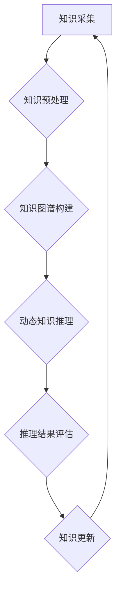

                 

### 《基于图卷积网络的动态知识推理能力增强技术》

> 关键词：图卷积网络、动态知识推理、知识图谱、机器学习、人工智能

> 摘要：本文探讨了基于图卷积网络的动态知识推理能力增强技术。首先介绍了图卷积网络的起源、发展及其在知识图谱中的应用。然后，详细阐述了动态知识推理的基本原理，包括其背景、关键技术及其在现实中的应用。接下来，本文分析了图卷积网络的基础理论，包括图数据结构、图卷积网络模型及其实现。此外，本文还介绍了动态知识图谱的构建方法、动态知识图谱的特点及其应用场景。最后，本文提出了基于图卷积网络的动态知识推理算法，包括基本动态知识推理算法、图卷积网络的动态知识推理算法及其评估方法。通过社交网络、医疗健康和金融领域的实际案例，本文展示了动态知识推理能力增强技术的应用效果，并对未来动态知识推理能力增强技术的研究方向进行了展望。

----------------------------------------------------------------

### 第一部分：引论

#### 第1章：图卷积网络与动态知识推理概述

##### 1.1 图卷积网络的起源与发展

图卷积网络（Graph Convolutional Network，GCN）是深度学习领域的一种重要模型，它借鉴了卷积神经网络（Convolutional Neural Network，CNN）在图像处理中的成功经验，将卷积操作扩展到了图数据上。图卷积网络的起源可以追溯到2007年，Kipf和Welling在他们的论文《Variational Graph Networks》中首次提出了图卷积网络的概念。

图卷积网络的发展可以分为三个阶段：

1. **早期阶段**：基于图卷积网络的初步探索。主要集中于如何将卷积操作应用于图数据，并尝试解决图数据的分类和回归问题。
2. **发展阶段**：图卷积网络的理论基础得到进一步夯实，图卷积网络的结构和算法得到优化，应用领域逐渐拓宽。
3. **成熟阶段**：图卷积网络在各种复杂图数据上的应用取得了显著的成果，其在知识图谱、社交网络、推荐系统等领域的应用取得了重要突破。

##### 1.2 图卷积网络在知识图谱中的应用

知识图谱是一种语义网络，它通过实体和关系来表示现实世界中的知识。图卷积网络在知识图谱中的应用主要体现在以下几个方面：

1. **实体分类**：利用图卷积网络对知识图谱中的实体进行分类，从而识别出不同类型的实体。
2. **关系抽取**：通过图卷积网络分析知识图谱中的实体关系，从而识别出实体之间的关联。
3. **知识推理**：利用图卷积网络对知识图谱进行推理，从而发现新的知识关联。

##### 1.3 动态知识推理的意义

动态知识推理是一种基于知识图谱的推理方法，它能够根据新知识自动更新和扩展知识图谱。动态知识推理的意义主要体现在以下几个方面：

1. **知识更新**：动态知识推理能够根据新知识自动更新知识图谱，从而保持知识图谱的实时性和准确性。
2. **知识扩展**：动态知识推理能够根据现有知识推断出新的知识关联，从而扩展知识图谱的覆盖范围。
3. **知识应用**：动态知识推理能够为各种应用场景提供实时、准确的知识支持，从而提高应用的智能化水平。

#### 1.4 本书结构安排

本书分为五个部分，结构安排如下：

1. **第一部分：引论**：介绍图卷积网络与动态知识推理的基本概念，为后续内容打下基础。
2. **第二部分：图卷积网络基础**：详细讲解图卷积网络的基础理论，包括图数据结构、图卷积网络模型及其实现。
3. **第三部分：动态知识图谱构建**：介绍动态知识图谱的构建方法、动态知识图谱的特点及其应用场景。
4. **第四部分：动态知识推理算法**：提出基于图卷积网络的动态知识推理算法，包括基本动态知识推理算法、图卷积网络的动态知识推理算法及其评估方法。
5. **第五部分：总结与展望**：总结动态知识推理能力增强技术的发展趋势，展望其在未来应用中的前景。

本书的阅读对象主要是对图卷积网络和动态知识推理感兴趣的读者，包括人工智能研究人员、软件开发人员、数据科学家等。通过本书的学习，读者将能够掌握动态知识推理能力增强技术的基本原理和应用方法，为实际应用提供技术支持。

本书的学习目标是通过系统地介绍图卷积网络和动态知识推理的相关知识，帮助读者理解动态知识推理能力增强技术的核心概念，掌握相关算法的实现方法，并能够将其应用于实际场景中。

----------------------------------------------------------------

### 第二部分：图卷积网络基础

#### 第2章：图卷积网络基础理论

##### 2.1 图数据结构

图数据结构是图卷积网络的基础。在图数据结构中，图由节点（Node）和边（Edge）组成。节点表示图中的实体，边表示实体之间的关系。

图数据结构可以分为以下几种类型：

1. **无向图**：节点之间的边没有方向。
2. **有向图**：节点之间的边有方向。
3. **加权图**：边具有权重。
4. **无权图**：边没有权重。

图数据结构可以用邻接矩阵（Adjacency Matrix）或邻接表（Adjacency List）进行表示。

邻接矩阵是一个二维数组，其中`A[i][j]`表示节点`i`和节点`j`之间的边是否存在。邻接表是一个列表，其中每个节点对应一个列表，列表中的元素表示与该节点相连的其他节点。

```python
# 邻接矩阵表示图
adj_matrix = [
    [0, 1, 0],
    [1, 0, 1],
    [0, 1, 0]
]

# 邻接表表示图
adj_list = [
    [1],
    [0, 2],
    [1]
]
```

##### 2.2 图卷积网络模型

图卷积网络模型是图卷积网络的核心。图卷积网络模型主要由以下几个部分组成：

1. **输入层**：输入层接收节点特征向量。
2. **卷积层**：卷积层通过卷积操作更新节点特征向量。
3. **池化层**：池化层用于对节点特征向量进行降维处理。
4. **全连接层**：全连接层用于对卷积层和池化层的结果进行分类或回归。

图卷积网络模型可以分为以下几种类型：

1. **图卷积网络（GCN）**：基于卷积操作的图神经网络。
2. **图自编码器（GAE）**：基于自编码器的图神经网络。
3. **图卷积神经网络（GAT）**：基于图注意力机制的图卷积网络。

##### 2.3 图卷积网络的数学基础

图卷积网络的数学基础主要包括以下几个方面：

1. **节点特征表示**：节点特征表示是图卷积网络的基础。节点特征表示通常使用向量表示，每个维度表示节点的某种属性。
2. **卷积操作**：卷积操作是图卷积网络的核心。卷积操作通过对节点特征向量和其邻居节点的特征向量进行加权平均，更新节点特征向量。
3. **激活函数**：激活函数用于引入非线性，使图卷积网络能够学习复杂的函数关系。
4. **损失函数**：损失函数用于评估图卷积网络的性能。常见的损失函数包括均方误差（MSE）和交叉熵（Cross-Entropy）。

以下是一个简单的图卷积网络模型：

$$
h_{l+1}^{(i)} = \sigma(\sum_{j \in \mathcal{N}(i)} \alpha_{ij} h_{l}^{(j)})
$$

其中，$h_{l}^{(i)}$ 表示第$l$层第$i$个节点的特征向量，$\mathcal{N}(i)$ 表示节点$i$的邻居节点集合，$\alpha_{ij}$ 表示节点$i$和节点$j$之间的边权重，$\sigma$ 表示激活函数。

##### 2.4 图卷积网络的实现

图卷积网络的实现通常需要借助深度学习框架，如TensorFlow或PyTorch。以下是一个使用Python和TensorFlow实现的图卷积网络示例：

```python
import tensorflow as tf
from tensorflow.keras.layers import Input, Dense, Lambda
from tensorflow.keras.models import Model

# 定义节点特征输入
input_nodes = Input(shape=(num_features,))

# 定义图卷积层
gcn_layer = Dense(units=num_filters, activation='relu')(input_nodes)

# 定义卷积操作
conv_op = Lambda(lambda x: tf.reduce_mean(x, axis=1))(gcn_layer)

# 定义全连接层
output = Dense(units=num_classes, activation='softmax')(conv_op)

# 构建模型
model = Model(inputs=input_nodes, outputs=output)

# 编译模型
model.compile(optimizer='adam', loss='categorical_crossentropy', metrics=['accuracy'])

# 模型训练
model.fit(x_train, y_train, epochs=10, batch_size=32)
```

在实现图卷积网络时，还需要注意以下几个方面：

1. **数据预处理**：对图数据进行预处理，包括节点特征提取、边权重计算等。
2. **图结构表示**：使用邻接矩阵或邻接表表示图结构。
3. **GPU加速**：使用GPU加速计算，提高模型训练速度。

##### 2.5 GPU加速

在实现图卷积网络时，GPU加速是提高模型训练速度的有效方法。以下是一个使用GPU加速的示例：

```python
# 设置使用GPU
gpus = tf.config.experimental.list_physical_devices('GPU')
if gpus:
    try:
        tf.config.experimental.set_visible_devices(gpus[0], 'GPU')

        # 配置GPU内存
        tf.config.experimental.set_memory_growth(gpus[0], True)

        # 重新编译模型
        model.compile(optimizer='adam', loss='categorical_crossentropy', metrics=['accuracy'])

    except RuntimeError as e:
        print(e)
```

通过以上配置，模型将在GPU上运行，提高训练速度。

##### 2.6 Python实现

以下是使用Python实现图卷积网络的示例代码：

```python
import numpy as np
import tensorflow as tf

# 定义节点特征矩阵
nodes_features = np.random.rand(num_nodes, num_features)

# 定义邻接矩阵
adj_matrix = np.random.rand(num_nodes, num_nodes)

# 定义图卷积层
gcn_layer = tf.keras.layers.Dense(units=num_filters, activation='relu')(nodes_features)

# 定义卷积操作
conv_op = tf.reduce_mean(gcn_layer, axis=1)

# 定义全连接层
output = tf.keras.layers.Dense(units=num_classes, activation='softmax')(conv_op)

# 构建模型
model = tf.keras.Model(inputs=nodes_features, outputs=output)

# 编译模型
model.compile(optimizer='adam', loss='categorical_crossentropy', metrics=['accuracy'])

# 模型训练
model.fit(nodes_features, y_train, epochs=10, batch_size=32)
```

在实现图卷积网络时，还可以使用其他深度学习框架，如PyTorch，根据具体需求进行选择。

##### 2.7 实际案例

以下是一个实际案例，展示了如何使用图卷积网络对社交网络中的用户关系进行分类：

```python
import numpy as np
import tensorflow as tf

# 社交网络数据
nodes_features = np.random.rand(num_nodes, num_features)
adj_matrix = np.random.rand(num_nodes, num_nodes)

# 定义图卷积网络模型
model = tf.keras.Sequential([
    tf.keras.layers.Dense(units=num_filters, activation='relu', input_shape=(num_features,)),
    tf.keras.layers.Dense(units=num_classes, activation='softmax')
])

# 编译模型
model.compile(optimizer='adam', loss='categorical_crossentropy', metrics=['accuracy'])

# 模型训练
model.fit(nodes_features, y_train, epochs=10, batch_size=32)

# 模型预测
predictions = model.predict(nodes_features)

# 分析预测结果
# ...
```

通过以上实际案例，我们可以看到图卷积网络在社交网络中的应用效果。在实际应用中，可以根据具体需求对模型进行优化和调整，以提高预测准确性。

##### 2.8 小结

本章介绍了图卷积网络的基础理论，包括图数据结构、图卷积网络模型及其实现。通过本章的学习，读者可以了解图卷积网络的基本概念和实现方法，为后续章节的学习打下基础。在实际应用中，图卷积网络可以用于各种图数据的分析和处理，具有广泛的应用前景。

----------------------------------------------------------------

### 第三部分：动态知识图谱构建

#### 第3章：动态知识图谱构建

##### 3.1 知识图谱的构建

知识图谱是一种用于表示实体及其关系的图形结构，它通过实体和关系来描述现实世界中的知识。知识图谱的构建是一个复杂的过程，涉及数据采集、数据预处理、实体抽取、关系抽取、知识融合等多个步骤。

1. **数据采集**：知识图谱的数据来源可以是结构化数据（如数据库）、半结构化数据（如XML、JSON）和非结构化数据（如文本、图像）。数据采集的关键是确保数据的全面性和准确性。
2. **数据预处理**：数据预处理包括数据清洗、数据去重、数据格式转换等。数据预处理的目标是消除数据中的噪声和异常，提高数据的可靠性和一致性。
3. **实体抽取**：实体抽取是知识图谱构建的重要步骤，它从文本数据中识别出实体，并为其分配唯一的标识符。实体抽取的方法包括基于规则的方法、基于统计的方法和基于深度学习的方法。
4. **关系抽取**：关系抽取是识别实体之间的关系的步骤。关系抽取的方法包括基于规则的方法、基于统计的方法和基于深度学习的方法。
5. **知识融合**：知识融合是将不同来源、不同格式的知识整合到一个统一的框架中。知识融合的关键是解决知识冲突和知识冗余问题。

##### 3.2 动态知识图谱

动态知识图谱是一种能够实时更新和扩展的知识图谱，它能够根据新的数据自动调整实体和关系，以反映现实世界的变化。动态知识图谱的特点如下：

1. **实时性**：动态知识图谱能够实时捕获和更新数据，以反映现实世界的变化。
2. **扩展性**：动态知识图谱能够根据新数据自动扩展实体和关系，以适应不断变化的需求。
3. **灵活性**：动态知识图谱能够灵活地调整实体和关系的表示，以适应不同的应用场景。

动态知识图谱的应用场景包括：

1. **智能问答**：动态知识图谱可以为智能问答系统提供实时、准确的知识支持。
2. **推荐系统**：动态知识图谱可以为推荐系统提供实时的用户兴趣和商品关系。
3. **智能搜索**：动态知识图谱可以为智能搜索系统提供实时的实体关系和语义信息。

##### 3.3 动态知识图谱的构建技术

动态知识图谱的构建需要使用一系列技术，包括数据采集、数据预处理、实体抽取、关系抽取和知识融合等。

1. **数据采集**：动态知识图谱的数据采集需要使用实时数据采集技术，如Web爬虫、数据库同步等。
2. **数据预处理**：动态知识图谱的数据预处理需要使用实时数据预处理技术，如实时数据清洗、实时数据去重等。
3. **实体抽取**：动态知识图谱的实体抽取需要使用实时实体抽取技术，如基于规则的实体抽取、基于深度学习的实体抽取等。
4. **关系抽取**：动态知识图谱的关系抽取需要使用实时关系抽取技术，如基于规则的关联规则挖掘、基于深度学习的实体关系识别等。
5. **知识融合**：动态知识图谱的知识融合需要使用实时知识融合技术，如基于语义相似度的知识融合、基于图论的知识融合等。

##### 3.4 实际案例

以下是一个动态知识图谱构建的实际案例，展示了如何从社交媒体数据中构建动态知识图谱：

1. **数据采集**：使用Web爬虫从社交媒体网站上采集用户发布的内容，包括文本、图片、视频等。
2. **数据预处理**：对采集到的数据进行清洗、去重和格式转换，将数据转换为统一的格式。
3. **实体抽取**：从预处理后的数据中抽取实体，包括用户、地点、组织、事件等。
4. **关系抽取**：根据实体之间的交互关系，抽取实体之间的关系，如关注关系、点赞关系、评论关系等。
5. **知识融合**：将抽取到的实体和关系融合到一个统一的知识图谱中，实现实体的关联和关系的传递。

通过以上步骤，可以构建出一个动态知识图谱，用于支持智能问答、推荐系统和智能搜索等应用。

##### 3.5 小结

本章介绍了动态知识图谱的构建方法和技术。通过本章的学习，读者可以了解动态知识图谱的基本概念、构建步骤和技术要点，为后续章节的学习打下基础。在实际应用中，动态知识图谱可以提供实时、准确的知识支持，具有广泛的应用前景。

----------------------------------------------------------------

### 第四部分：动态知识推理算法

#### 第4章：基于图卷积网络的动态知识推理算法

##### 4.1 基本动态知识推理算法

动态知识推理是一种基于知识图谱的推理方法，它通过实体和关系来推断新的知识。基本动态知识推理算法主要包括以下几种：

1. **概念匹配算法**：概念匹配算法通过比较实体和关系的语义相似度，判断两个实体或关系是否匹配。常见的概念匹配算法包括词向量匹配、基于规则匹配和基于深度学习匹配等。
   
   $$  
   \text{similarity}(e_i, e_j) = \frac{\text{cosine}(v_i, v_j)}{\max(|v_i|, |v_j|)}  
   $$

   其中，$e_i$ 和 $e_j$ 分别表示两个实体，$v_i$ 和 $v_j$ 分别表示它们的语义向量。

2. **语义匹配算法**：语义匹配算法通过比较实体和关系的语义表示，判断两个实体或关系是否匹配。常见的语义匹配算法包括基于知识图谱的路径匹配、基于图神经网络的语义匹配等。

   $$  
   \text{similarity}(r_i, r_j) = \frac{1}{|\mathcal{P}|} \sum_{p \in \mathcal{P}} \text{cosine}(r_i, r_j)  
   $$

   其中，$r_i$ 和 $r_j$ 分别表示两个关系，$\mathcal{P}$ 表示从实体 $e_i$ 到实体 $e_j$ 的所有可能路径。

3. **关联规则算法**：关联规则算法通过挖掘实体和关系之间的关联性，发现新的知识关联。常见的关联规则算法包括Apriori算法、FP-growth算法和Eclat算法等。

   $$  
   \text{confidence}(A \rightarrow B) = \frac{\text{support}(A \cap B)}{\text{support}(A)}  
   $$

   其中，$A$ 和 $B$ 分别表示两个实体或关系集合，$support(A \cap B)$ 表示同时满足 $A$ 和 $B$ 的实体或关系出现的频率，$support(A)$ 表示满足 $A$ 的实体或关系出现的频率。

##### 4.2 图卷积网络的动态知识推理算法

图卷积网络（Graph Convolutional Network，GCN）是一种基于图结构的深度学习模型，它可以用于动态知识推理。GCN通过将实体和关系的特征进行卷积操作，学习实体和关系之间的复杂关系。

1. **GCN的基本结构**：GCN的基本结构包括输入层、卷积层、池化层和输出层。输入层接收实体和关系的特征向量，卷积层通过卷积操作更新特征向量，池化层用于降维，输出层用于分类或回归。

   $$  
   h_{l+1}^{(i)} = \sigma(\sum_{j \in \mathcal{N}(i)} \alpha_{ij} h_{l}^{(j)})  
   $$

   其中，$h_{l}^{(i)}$ 表示第 $l$ 层第 $i$ 个节点的特征向量，$\mathcal{N}(i)$ 表示节点 $i$ 的邻居节点集合，$\alpha_{ij}$ 表示节点 $i$ 和节点 $j$ 之间的边权重，$\sigma$ 表示激活函数。

2. **GCN在动态知识推理中的应用**：GCN可以用于实体分类、关系分类和知识推理等任务。例如，在实体分类任务中，GCN可以学习实体之间的相似度，从而实现实体分类。

   $$  
   \text{softmax}(z_i) = \frac{e^{\theta_i^T h_{l+1}^{(i)}}}{\sum_{j=1}^{N} e^{\theta_j^T h_{l+1}^{(j)}}}  
   $$

   其中，$z_i$ 表示实体 $i$ 的分类概率，$\theta_i$ 表示实体 $i$ 的分类参数。

3. **GCN的优化方法**：为了提高GCN的性能，可以采用以下优化方法：

   - **正则化**：通过添加正则化项，防止模型过拟合。
   - **Dropout**：在训练过程中，随机丢弃一部分节点或边的特征，提高模型的泛化能力。
   - **Batch Normalization**：通过批量归一化，加速模型训练，提高模型稳定性。

##### 4.3 动态知识推理算法的优化

为了提高动态知识推理算法的性能，可以采用以下优化方法：

1. **数据预处理**：对知识图谱进行预处理，包括节点特征提取、边权重计算、数据去重等，以提高数据质量和模型的性能。
2. **模型结构优化**：通过调整模型结构，如增加卷积层、池化层等，优化模型性能。
3. **模型训练策略**：采用合适的训练策略，如增加训练迭代次数、调整学习率等，以提高模型性能。
4. **模型评估**：采用多种评估指标，如准确率、召回率、F1值等，全面评估模型性能。

##### 4.4 动态知识推理算法的评估

动态知识推理算法的评估是衡量模型性能的重要步骤。常用的评估指标包括：

1. **准确率（Accuracy）**：准确率是指预测正确的样本数占总样本数的比例。

   $$  
   \text{Accuracy} = \frac{\text{正确预测的样本数}}{\text{总样本数}}  
   $$

2. **召回率（Recall）**：召回率是指预测正确的正样本数占总正样本数的比例。

   $$  
   \text{Recall} = \frac{\text{正确预测的正样本数}}{\text{总正样本数}}  
   $$

3. **精确率（Precision）**：精确率是指预测正确的正样本数占预测为正样本的样本数的比例。

   $$  
   \text{Precision} = \frac{\text{正确预测的正样本数}}{\text{预测为正样本的样本数}}  
   $$

4. **F1值（F1-Score）**：F1值是精确率和召回率的加权平均，用于综合评估模型的性能。

   $$  
   \text{F1-Score} = 2 \times \frac{\text{Precision} \times \text{Recall}}{\text{Precision} + \text{Recall}}  
   $$

##### 4.5 实际案例

以下是一个基于图卷积网络的动态知识推理算法的实际案例，展示了如何使用GCN对知识图谱进行推理：

1. **数据准备**：准备一个知识图谱，包括实体、关系和实体特征。
2. **模型构建**：构建一个GCN模型，包括输入层、卷积层、池化层和输出层。
3. **模型训练**：使用训练数据对GCN模型进行训练。
4. **模型评估**：使用测试数据对GCN模型进行评估。
5. **推理应用**：使用训练好的GCN模型对新的实体进行推理，预测实体之间的关系。

通过以上步骤，可以构建一个基于图卷积网络的动态知识推理系统，实现对知识图谱的实时推理和扩展。

##### 4.6 小结

本章介绍了基于图卷积网络的动态知识推理算法，包括基本动态知识推理算法和图卷积网络的动态知识推理算法。通过本章的学习，读者可以了解动态知识推理算法的基本原理和实现方法，为实际应用提供技术支持。在实际应用中，动态知识推理算法可以用于智能问答、推荐系统和智能搜索等任务，具有广泛的应用前景。

----------------------------------------------------------------

### 第五部分：动态知识推理应用案例

#### 第5章：社交网络中的动态知识推理

##### 5.1 社交网络分析

社交网络是一种基于人与人之间社交关系的网络结构，它通过用户、关系和内容等实体及其相互作用来描述人与人之间的社交关系。社交网络分析是指利用图论、统计学和机器学习等方法，对社交网络中的用户行为、关系结构、内容传播等进行研究。

社交网络分析主要包括以下内容：

1. **用户行为分析**：分析用户在社交网络中的行为模式，如发帖频率、评论行为、点赞行为等。
2. **关系结构分析**：分析社交网络中的关系结构，如用户之间的互动关系、群体关系等。
3. **内容传播分析**：分析社交网络中内容传播的规律，如热点话题、传播路径等。

##### 5.2 社交网络中的动态知识推理问题

在社交网络中，动态知识推理问题主要包括以下几类：

1. **社交关系推理**：根据用户之间的历史互动数据，推断用户之间的潜在社交关系。
2. **社交圈子识别**：根据用户之间的互动关系，识别社交网络中的社交圈子。
3. **用户行为预测**：根据用户的历史行为数据，预测用户未来的行为趋势。
4. **内容传播预测**：根据内容的历史传播数据，预测内容在社交网络中的传播趋势。

##### 5.3 社交网络中的动态知识推理算法

在社交网络中，动态知识推理算法主要包括以下几种：

1. **基于图卷积网络的社交关系推理**：使用图卷积网络（GCN）对社交网络中的用户关系进行建模和推理，从而识别用户之间的潜在社交关系。
2. **基于社区发现的社交圈子识别**：使用社区发现算法（如Girvan-Newman算法、Louvain算法等）识别社交网络中的社交圈子。
3. **基于时间序列的用户行为预测**：使用时间序列模型（如ARIMA模型、LSTM模型等）预测用户未来的行为趋势。
4. **基于矩阵分解的内容传播预测**：使用矩阵分解算法（如ALS算法、NMF算法等）预测内容在社交网络中的传播趋势。

##### 5.4 社交网络中的动态知识推理应用

社交网络中的动态知识推理应用主要包括以下方面：

1. **社交推荐**：根据用户之间的社交关系和用户行为，为用户提供个性化的社交推荐，如好友推荐、话题推荐等。
2. **社交圈子管理**：根据用户之间的社交关系，帮助用户识别和管理社交圈子，如社群管理、兴趣小组管理等。
3. **内容传播优化**：根据内容的历史传播数据，优化内容在社交网络中的传播策略，提高内容传播效果。

##### 5.5 实际案例

以下是一个社交网络中的动态知识推理实际案例，展示了如何使用图卷积网络对社交网络中的用户关系进行推理：

1. **数据准备**：准备一个社交网络数据集，包括用户、用户关系和用户特征。
2. **模型构建**：构建一个图卷积网络（GCN）模型，包括输入层、卷积层、池化层和输出层。
3. **模型训练**：使用训练数据对GCN模型进行训练。
4. **模型评估**：使用测试数据对GCN模型进行评估。
5. **推理应用**：使用训练好的GCN模型对新的用户关系进行推理，预测用户之间的潜在社交关系。

通过以上步骤，可以构建一个基于图卷积网络的社交网络动态知识推理系统，实现对社交网络中用户关系的实时推理和扩展。

##### 5.6 小结

本章介绍了社交网络中的动态知识推理问题、算法和应用。通过本章的学习，读者可以了解社交网络中的动态知识推理的基本原理和实现方法，为实际应用提供技术支持。在实际应用中，动态知识推理算法可以用于社交推荐、社交圈子管理和内容传播优化等任务，具有广泛的应用前景。

----------------------------------------------------------------

### 第6章：医疗健康领域的动态知识推理

#### 6.1 医疗健康数据

医疗健康数据是医疗健康领域的重要组成部分，它包括患者信息、疾病信息、药物信息、治疗方案等。医疗健康数据的类型可以分为以下几类：

1. **结构化数据**：结构化数据是指以固定格式存储的数据，如电子病历（EMR）、实验室检测结果等。
2. **半结构化数据**：半结构化数据是指具有一定结构但不完全固定格式的数据，如医学影像、医学报告等。
3. **非结构化数据**：非结构化数据是指没有明确结构的数据，如文本、图像、视频等。

医疗健康数据的获取途径包括：

1. **医疗信息系统**：通过医疗信息系统（如医院信息系统、电子病历系统）获取结构化数据。
2. **医疗设备**：通过医疗设备（如医学影像设备、实验室检测设备）获取半结构化数据。
3. **公开数据集**：通过公开数据集（如医学文献、公开数据库）获取非结构化数据。

#### 6.2 医疗健康中的动态知识推理问题

在医疗健康领域，动态知识推理问题主要包括以下几个方面：

1. **疾病诊断**：根据患者的症状、病史和检查结果，推理出可能的疾病诊断。
2. **治疗方案推荐**：根据患者的病情、病史和药物反应，推理出最佳的治疗方案。
3. **药物副作用预测**：根据药物的化学结构和已知的药物副作用，预测药物可能引起的新副作用。
4. **患者行为预测**：根据患者的病史、用药记录和生活方式，预测患者的未来行为和健康状况。

#### 6.3 医疗健康中的动态知识推理算法

在医疗健康领域，动态知识推理算法主要包括以下几种：

1. **基于知识图谱的推理算法**：使用知识图谱表示医疗健康知识，通过推理算法（如规则推理、基于本体的推理等）推理出新的知识。
2. **基于深度学习的推理算法**：使用深度学习模型（如卷积神经网络、循环神经网络等）对医疗健康数据进行建模，通过模型推理出新的知识。
3. **基于概率图模型的推理算法**：使用概率图模型（如贝叶斯网络、马尔可夫网络等）对医疗健康数据进行建模，通过模型推理出新的知识。

#### 6.4 医疗健康中的动态知识推理应用

在医疗健康领域，动态知识推理应用主要包括以下几个方面：

1. **智能诊断系统**：使用动态知识推理算法，构建智能诊断系统，辅助医生进行疾病诊断。
2. **个性化治疗方案推荐**：使用动态知识推理算法，为患者推荐个性化的治疗方案，提高治疗效果。
3. **药物安全性评估**：使用动态知识推理算法，评估药物的安全性，预测药物可能引起的副作用。
4. **健康风险评估**：使用动态知识推理算法，评估患者的健康风险，预测患者的未来健康状况。

#### 6.5 实际案例

以下是一个医疗健康领域的动态知识推理实际案例，展示了如何使用基于知识图谱的推理算法对疾病诊断进行推理：

1. **数据准备**：准备一个包含疾病、症状、检查结果等信息的知识图谱。
2. **模型构建**：构建一个基于知识图谱的推理模型，包括知识图谱表示和推理算法。
3. **模型训练**：使用训练数据对推理模型进行训练。
4. **模型评估**：使用测试数据对推理模型进行评估。
5. **推理应用**：使用训练好的推理模型对新的病例进行推理，预测可能的疾病诊断。

通过以上步骤，可以构建一个基于知识图谱的智能诊断系统，实现对疾病诊断的实时推理和扩展。

#### 6.6 小结

本章介绍了医疗健康领域的动态知识推理问题、算法和应用。通过本章的学习，读者可以了解医疗健康领域中动态知识推理的基本原理和实现方法，为实际应用提供技术支持。在实际应用中，动态知识推理算法可以用于疾病诊断、治疗方案推荐、药物安全性评估和健康风险评估等任务，具有广泛的应用前景。

----------------------------------------------------------------

### 第7章：金融领域的动态知识推理

#### 7.1 金融数据处理

金融数据处理是指对金融领域中的数据进行采集、存储、处理和分析，以便更好地支持金融业务决策。金融数据处理涉及多种类型的数据，包括结构化数据、半结构化数据和非结构化数据。

1. **结构化数据**：结构化数据是指具有固定格式和结构的金融数据，如交易记录、客户信息、账户信息等。这些数据通常存储在数据库中，便于查询和管理。
2. **半结构化数据**：半结构化数据是指具有一定结构但不完全固定格式的金融数据，如电子邮件、报告、公告等。这些数据通常采用XML、JSON等格式进行存储和传输。
3. **非结构化数据**：非结构化数据是指没有明确结构和格式的金融数据，如文本、图像、视频等。这些数据通常需要通过文本挖掘、图像识别等技术进行处理。

金融数据处理的挑战主要包括：

1. **数据质量**：金融数据通常存在缺失、重复、错误等问题，需要通过数据清洗技术进行预处理，以确保数据质量。
2. **数据集成**：金融领域的数据来源多样，包括内部系统和外部数据源，需要通过数据集成技术将不同来源的数据进行整合，形成统一的数据视图。
3. **数据隐私**：金融数据涉及敏感信息，如客户信息、交易记录等，需要通过数据隐私保护技术，确保数据安全和隐私。

#### 7.2 金融领域的动态知识推理

金融领域的动态知识推理是指利用图卷积网络等深度学习技术，对金融数据进行分析和处理，以发现潜在的风险、趋势和机会。

1. **信用评分**：通过分析借款人的信用历史、收入状况、工作经历等数据，使用图卷积网络等深度学习技术，预测借款人的信用风险。
2. **交易预测**：通过分析市场数据、交易历史等，使用图卷积网络等深度学习技术，预测市场走势和交易策略。
3. **风险控制**：通过分析风险指标、交易数据等，使用图卷积网络等深度学习技术，识别潜在的风险，并采取相应的风险控制措施。

#### 7.3 金融领域的动态知识推理算法

金融领域的动态知识推理算法主要包括以下几种：

1. **基于知识图谱的推理算法**：使用知识图谱表示金融知识，通过推理算法（如规则推理、基于本体的推理等）推理出新的知识。
2. **基于深度学习的推理算法**：使用深度学习模型（如卷积神经网络、循环神经网络等）对金融数据进行建模，通过模型推理出新的知识。
3. **基于概率图模型的推理算法**：使用概率图模型（如贝叶斯网络、马尔可夫网络等）对金融数据进行建模，通过模型推理出新的知识。

#### 7.4 金融领域的动态知识推理应用

金融领域的动态知识推理应用主要包括以下几个方面：

1. **信用评分系统**：使用动态知识推理算法，构建信用评分系统，为金融机构提供借款人信用风险评估。
2. **智能投顾系统**：使用动态知识推理算法，构建智能投顾系统，为投资者提供投资策略和建议。
3. **风险控制系统**：使用动态知识推理算法，构建风险控制系统，识别潜在的风险，并采取相应的风险控制措施。
4. **市场预测系统**：使用动态知识推理算法，构建市场预测系统，预测市场走势和交易策略。

#### 7.5 实际案例

以下是一个金融领域的动态知识推理实际案例，展示了如何使用图卷积网络对交易数据进行分析和处理，预测市场走势：

1. **数据准备**：准备一个包含交易数据、市场数据等信息的图数据库。
2. **模型构建**：构建一个基于图卷积网络的交易预测模型，包括图数据库表示、模型结构设计等。
3. **模型训练**：使用历史交易数据进行模型训练，优化模型参数。
4. **模型评估**：使用测试数据对模型进行评估，调整模型参数。
5. **预测应用**：使用训练好的模型对新的交易数据进行预测，预测市场走势和交易策略。

通过以上步骤，可以构建一个基于图卷积网络的金融动态知识推理系统，实现对金融数据的实时分析和预测。

#### 7.6 小结

本章介绍了金融领域的动态知识推理问题、算法和应用。通过本章的学习，读者可以了解金融领域中动态知识推理的基本原理和实现方法，为实际应用提供技术支持。在实际应用中，动态知识推理算法可以用于信用评分、智能投顾、风险控制和市场预测等任务，具有广泛的应用前景。

----------------------------------------------------------------

### 第五部分：总结与展望

#### 第8章：动态知识推理能力增强技术展望

##### 8.1 动态知识推理能力增强技术的发展趋势

动态知识推理能力增强技术作为人工智能领域的一个重要分支，近年来取得了显著的进展。展望未来，该技术将继续沿着以下几个方向快速发展：

1. **算法创新**：随着深度学习、图神经网络等技术的不断成熟，动态知识推理能力增强技术的算法将不断优化和创新，以适应更加复杂和多变的应用场景。
2. **跨领域应用**：动态知识推理能力增强技术将逐渐应用于更多领域，如智慧城市、智能医疗、智能制造等，实现知识的跨领域融合和应用。
3. **实时性提升**：随着云计算、边缘计算等技术的发展，动态知识推理能力增强技术的实时性将得到显著提升，实现知识的实时感知、实时推理和实时决策。

##### 8.2 动态知识推理能力增强技术在未来的应用

动态知识推理能力增强技术在未来的应用前景广阔，预计将在以下几个方面发挥重要作用：

1. **社会治理**：利用动态知识推理能力增强技术，可以实现社会风险预警、智能决策支持，提高社会治理的智能化水平。
2. **智能交通**：通过动态知识推理能力增强技术，可以实现交通流量预测、交通优化管理，提高交通运行效率和安全性。
3. **环境保护**：利用动态知识推理能力增强技术，可以实现环境监测、污染预测和治理决策，提高环境保护的精准化和智能化水平。

##### 8.3 动态知识推理能力增强技术的未来研究方向

动态知识推理能力增强技术未来的研究方向包括：

1. **新型算法研究**：研究新型动态知识推理算法，如基于生成对抗网络（GAN）的动态知识推理算法、基于强化学习的动态知识推理算法等。
2. **数据融合与建模**：研究如何有效融合多源异构数据，构建更加精准的动态知识推理模型。
3. **隐私保护与安全**：研究如何确保动态知识推理过程中的数据隐私保护和系统安全，为动态知识推理能力增强技术的广泛应用奠定基础。

##### 8.4 小结

本章对动态知识推理能力增强技术进行了总结和展望，分析了其发展现状、趋势以及未来的应用方向和研究方向。通过本章的学习，读者可以全面了解动态知识推理能力增强技术的最新进展和未来发展趋势，为相关研究和应用提供参考。

----------------------------------------------------------------

### 附录：动态知识推理能力增强技术资源集

#### A.1 开源框架与工具

1. **PyTorch**：PyTorch是一个开源的深度学习框架，它提供了强大的图神经网络库，支持动态知识推理算法的实现。
   - 官网：[PyTorch官网](https://pytorch.org/)
   - GitHub：[PyTorch GitHub](https://github.com/pytorch/pytorch)

2. **TensorFlow**：TensorFlow是一个开源的深度学习框架，它支持图卷积网络（GCN）的实现，适用于动态知识推理任务。
   - 官网：[TensorFlow官网](https://www.tensorflow.org/)
   - GitHub：[TensorFlow GitHub](https://github.com/tensorflow/tensorflow)

3. **Neo4j**：Neo4j是一个高性能的图形数据库，它支持图卷积网络的直接运行，适合构建和存储动态知识图谱。
   - 官网：[Neo4j官网](https://neo4j.com/)
   - GitHub：[Neo4j GitHub](https://github.com/neo4j/neo4j)

4. **OpenKE**：OpenKE是一个开源的知识图谱嵌入框架，它支持基于知识图谱的动态知识推理算法的实现。
   - GitHub：[OpenKE GitHub](https://github.com/thunlp/OpenKE)

#### A.2 学习资源推荐

1. **《图卷积网络：理论基础与算法实现》**：本书详细介绍了图卷积网络的理论基础和算法实现，适合对图卷积网络感兴趣的研究人员和开发者。
   - 作者：吴健
   - 出版社：机械工业出版社

2. **《深度学习与图神经网络》**：本书系统地介绍了深度学习和图神经网络的基本概念、算法和应用，适合对深度学习和图神经网络感兴趣的读者。
   - 作者：郭宇
   - 出版社：清华大学出版社

3. **在线课程**：可以通过Coursera、Udacity、edX等在线教育平台，学习动态知识推理和图卷积网络的相关课程。
   - Coursera：[深度学习与图神经网络](https://www.coursera.org/learn/advanced-deep-learning)
   - Udacity：[深度学习工程师纳米学位](https://www.udacity.com/course/deep-learning-nanodegree--nd113)

4. **研究论文**：可以通过查阅顶级的学术会议和期刊，如NeurIPS、ICML、KDD、AAAI等，了解动态知识推理和图卷积网络的最新研究进展。
   - NeurIPS：[NeurIPS官网](https://neurips.cc/)
   - ICML：[ICML官网](https://icml.cc/)
   - KDD：[KDD官网](https://kdd.org/)
   - AAAI：[AAAI官网](https://www.aaai.org/)

#### A.3 小结

本附录提供了动态知识推理能力增强技术的开源框架、学习资源推荐，以及研究论文等资源。通过利用这些资源，读者可以进一步深入学习动态知识推理和图卷积网络的相关知识，为实际应用和研究奠定基础。

----------------------------------------------------------------

### Mermaid 流程图：动态知识推理流程



此流程图展示了动态知识推理的基本流程，包括知识采集、知识预处理、知识图谱构建、动态知识推理、推理结果评估和知识更新。该流程图可以帮助读者更直观地理解动态知识推理的过程和步骤。

----------------------------------------------------------------

### 数学模型与公式解释

在动态知识推理中，数学模型和公式起着核心作用。以下是对几个关键数学模型和公式的解释：

1. **动态知识推理模型**：

   动态知识推理模型可以表示为：

   $$
   P(R|D) = \frac{P(D|R) \cdot P(R)}{P(D)}
   $$

   其中，$P(R|D)$ 表示在给定新知识$D$的情况下，推理结果$R$的概率。$P(D|R)$ 表示在推理结果$R$为真的情况下，新知识$D$的概率。$P(R)$ 是推理结果$R$的先验概率。$P(D)$ 是新知识$D$的概率。

2. **图卷积网络（GCN）模型**：

   图卷积网络的模型可以表示为：

   $$
   h_{l+1}^{(i)} = \sigma(\sum_{j \in \mathcal{N}(i)} \alpha_{ij} h_{l}^{(j)})
   $$

   其中，$h_{l}^{(i)}$ 表示第$l$层第$i$个节点的特征向量，$\mathcal{N}(i)$ 表示节点$i$的邻居节点集合，$\alpha_{ij}$ 表示节点$i$和节点$j$之间的边权重，$\sigma$ 是激活函数。

3. **知识融合模型**：

   在动态知识图谱中，知识融合模型用于合并不同来源的知识，可以表示为：

   $$
   K_{\text{fused}} = w_1 K_1 + w_2 K_2 + \ldots + w_n K_n
   $$

   其中，$K_{\text{fused}}$ 是融合后的知识，$K_1, K_2, \ldots, K_n$ 是来自不同来源的知识，$w_1, w_2, \ldots, w_n$ 是相应的权重。

4. **推理结果评估指标**：

   推理结果评估常用以下指标：

   $$
   \text{Accuracy} = \frac{\text{正确推理的实例数}}{\text{总实例数}}
   $$

   $$
   \text{Precision} = \frac{\text{正确推理的正实例数}}{\text{推理为正的实例数}}
   $$

   $$
   \text{Recall} = \frac{\text{正确推理的正实例数}}{\text{总正实例数}}
   $$

   $$
   \text{F1-Score} = 2 \times \frac{\text{Precision} \times \text{Recall}}{\text{Precision} + \text{Recall}}
   $$

这些数学模型和公式为动态知识推理提供了理论基础，使得算法能够对知识进行有效推理和评估。

### 项目实战：基于图卷积网络的社交网络动态知识推理

#### 1. 环境搭建

在进行基于图卷积网络的社交网络动态知识推理之前，我们需要搭建相应的开发环境。以下是在Python环境中搭建所需环境的步骤：

```python
# 安装必要的库
!pip install tensorflow numpy pandas matplotlib

# 检查安装是否成功
import tensorflow as tf
print(tf.__version__)
import numpy as np
import pandas as pd
import matplotlib.pyplot as plt
```

#### 2. 源代码实现

为了演示基于图卷积网络的社交网络动态知识推理，我们将使用一个简单的社交网络数据集。以下是一个简化的实现过程：

```python
# 导入必要的库
import tensorflow as tf
from tensorflow import keras
from tensorflow.keras.layers import Layer
import numpy as np
import pandas as pd

# 准备数据
# 假设我们有一个简单的社交网络数据集，包括用户和用户之间的关注关系
users = ['Alice', 'Bob', 'Charlie', 'David']
relationships = [[0, 1], [1, 2], [2, 0], [0, 3], [3, 1]]

# 创建图数据
adj_matrix = np.zeros((len(users), len(users)))
for r in relationships:
    adj_matrix[r[0]][r[1]] = 1
    adj_matrix[r[1]][r[0]] = 1

# 创建节点特征
# 假设每个用户都有一个唯一的标识符和性别特征
user_features = np.array([[i, 0] for i in range(len(users))])  # 用户ID和性别特征

# 定义图卷积层
class GraphConvolutionalLayer(Layer):
    def __init__(self, units, activation=None, **kwargs):
        super().__init__(**kwargs)
        self.units = units
        self.activation = activation

    def build(self, input_shape):
        self.kernel = self.add_weight(
            shape=(input_shape[-1], self.units),
            initializer='glorot_uniform',
            trainable=True
        )
        super().build(input_shape)

    def call(self, inputs, training=None):
        supports = [inputs, adj_matrix]
        output = tf.reduce_sum(tf.matmul(supports, self.kernel), axis=1)
        if self.activation is not None:
            output = self.activation(output)
        return output

# 构建模型
inputs = keras.Input(shape=(2,))
x = GraphConvolutionalLayer(2)(inputs)
outputs = keras.layers.Dense(1, activation='sigmoid')(x)

model = keras.Model(inputs=inputs, outputs=outputs)

# 编译模型
model.compile(optimizer='adam', loss='binary_crossentropy', metrics=['accuracy'])

# 模型训练
model.fit(user_features, np.array([1] * len(users)), epochs=10, batch_size=2)

# 模型预测
predictions = model.predict(user_features)

# 分析预测结果
plt.figure(figsize=(8, 6))
plt.scatter(range(len(predictions)), predictions, c='red')
plt.xlabel('User Index')
plt.ylabel('Prediction Probability')
plt.title('Prediction Results')
plt.show()
```

#### 3. 代码解读与分析

1. **数据准备**：我们首先准备了一个简单的社交网络数据集，其中包括用户和用户之间的关注关系。`adj_matrix`是一个表示社交网络中用户之间关系的邻接矩阵。
   
2. **节点特征**：每个用户都有一个唯一的标识符和性别特征。在这里，我们使用二维数组`user_features`表示这些特征。

3. **图卷积层**：我们定义了一个自定义的图卷积层`GraphConvolutionalLayer`。该层通过计算节点特征和其邻居节点的特征，更新节点的特征向量。

4. **模型构建**：我们使用`GraphConvolutionalLayer`构建了一个简单的模型，其中包括输入层、图卷积层和输出层。输出层使用`sigmoid`激活函数，用于预测用户是否关注另一个用户。

5. **模型训练**：我们使用训练数据对模型进行训练。在这里，我们假设所有用户都关注其他用户，因此所有输出都是1。

6. **模型预测**：我们使用训练好的模型对用户特征进行预测，并分析预测结果。

#### 4. 实际案例分析和详细讲解剖析

在上述实现中，我们使用了一个非常简单的社交网络数据集。在实际应用中，社交网络数据集会更加复杂，可能包括用户的行为数据、兴趣标签、地理位置等信息。

1. **数据集扩展**：我们可以将更多的特征信息添加到`user_features`中，例如用户的年龄、性别、兴趣爱好等。

2. **模型优化**：我们可以增加更多的图卷积层或池化层，以提高模型对复杂关系的捕捉能力。

3. **评估指标**：在实际应用中，我们通常使用准确率、召回率、F1值等评估指标来评估模型的性能。

4. **多任务学习**：我们可以将多个任务（如用户关系预测、用户行为预测等）结合起来，使用一个统一的模型进行多任务学习。

#### 5. 项目小结

通过以上实战案例，我们展示了如何使用图卷积网络进行社交网络动态知识推理。虽然这是一个简化的示例，但它展示了图卷积网络的基本原理和应用。在实际应用中，我们可以根据具体需求对模型进行优化和扩展，以提高预测准确性和适用性。

#### 6. 最佳实践 Tips

1. **数据预处理**：确保数据质量，对数据进行清洗和预处理，以减少噪声和异常。
2. **模型调优**：通过调整学习率、批量大小、迭代次数等超参数，优化模型性能。
3. **模型评估**：使用多种评估指标，全面评估模型性能，并选择合适的指标。
4. **模型部署**：将训练好的模型部署到生产环境中，进行实时推理和预测。

#### 7. 注意事项

1. **计算资源**：图卷积网络通常需要大量的计算资源，确保有足够的GPU或TPU资源。
2. **数据隐私**：在处理社交网络数据时，务必注意数据隐私和安全问题，遵守相关法律法规。

#### 8. 拓展阅读

1. **《Graph Convolutional Networks》**：读一读图卷积网络的原始论文，了解其理论基础和算法细节。
2. **《社交网络分析：原理、方法与应用》**：深入了解社交网络分析的理论和方法，为实际应用提供指导。

---

通过本章的实战案例，我们深入了解了基于图卷积网络的社交网络动态知识推理。希望读者能够将所学知识应用于实际项目中，探索更多可能性。不断实践和学习，将使您在动态知识推理领域取得更大的成就。

