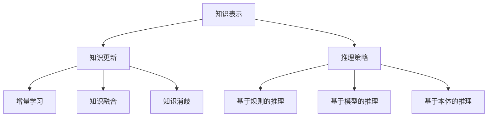

                 

### 《基于图卷积网络的动态知识推理能力评估》

#### 关键词

- 图卷积网络
- 动态知识推理
- 知识图谱
- 模型评估
- 应用实践

#### 摘要

本文将深入探讨基于图卷积网络的动态知识推理能力评估。首先，我们将介绍动态知识推理的背景和重要性，以及图卷积网络的基本原理和应用场景。接着，我们将详细讲解如何设计一个基于图卷积网络的动态知识推理模型，并使用数学模型和Python源代码进行阐述。随后，我们将讨论评估动态知识推理能力的方法和指标，并通过一个实际案例进行验证。最后，我们将展望动态知识推理能力评估的未来发展方向，并提出一些最佳实践建议。

#### 目录大纲

- 第一部分：背景与基础理论
  - 第1章：动态知识推理概述
    - 1.1 动态知识推理的定义与意义
    - 1.2 动态知识推理的关键技术
    - 1.3 动态知识推理在现实中的应用
    - 1.4 动态知识推理的挑战与机遇
  - 第2章：图卷积网络基础
    - 2.1 图卷积网络的概念与原理
    - 2.2 图卷积网络的核心组成部分
    - 2.3 图卷积网络的应用场景
  - 第3章：基于图卷积网络的动态知识推理模型
    - 3.1 动态知识推理模型的需求分析
    - 3.2 基于图卷积网络的动态知识推理模型设计
    - 3.3 模型评估指标与方法

- 第二部分：动态知识推理能力评估
  - 第4章：动态知识推理能力评估概述
    - 4.1 评估框架的设计原则
    - 4.2 动态知识推理能力的评价指标
    - 4.3 动态知识推理能力的评估方法
  - 第5章：基于图卷积网络的动态知识推理能力评估实践
    - 5.1 数据准备与预处理
    - 5.2 模型训练与优化
    - 5.3 模型评估与结果分析
  - 第6章：案例研究：特定领域的动态知识推理能力评估
    - 6.1 案例选择与背景介绍
    - 6.2 模型设计与实现
    - 6.3 评估结果与讨论

- 第三部分：未来展望与挑战
  - 第7章：动态知识推理能力评估的未来发展方向
    - 7.1 新技术的融入与应用
    - 7.2 跨学科的协同研究
    - 7.3 动态知识推理能力评估的挑战与应对策略

#### 第一部分：背景与基础理论

##### 第1章：动态知识推理概述

##### 1.1 动态知识推理的定义与意义

动态知识推理是一种人工智能技术，旨在通过处理和推理动态变化的知识，以支持决策和智能系统的运行。在传统的知识表示和推理中，知识通常被视为静态的，这意味着知识在推理过程中不会发生变化。然而，在现实世界中，知识是不断演变和更新的，例如，科学发现、经济变化、社会事件等都会影响知识的动态性。

动态知识推理的重要性在于，它能够使智能系统具备适应性和灵活性，以应对不断变化的环境和需求。例如，在金融领域，动态知识推理可以帮助金融机构实时分析和预测市场趋势，从而制定更有效的投资策略。在医疗领域，动态知识推理可以用于实时监测患者的健康状况，并提供个性化的治疗方案。

##### 1.2 动态知识推理的关键技术

动态知识推理的关键技术包括知识表示、知识更新和推理策略。知识表示是动态知识推理的基础，它涉及到如何将知识结构化并存储在计算机系统中。常用的知识表示方法包括知识图谱、本体论和语义网络。

知识更新是指如何处理和整合新知识，以保持知识的时效性和准确性。在动态知识推理中，知识更新是一个关键挑战，因为新知识的引入可能会导致现有知识的错误或过时。为了解决这个问题，研究人员提出了多种知识更新策略，如增量学习、知识融合和知识消歧。

推理策略则是动态知识推理的核心，它涉及到如何根据现有知识进行推理，以发现新的关系和知识。动态知识推理的推理策略通常包括基于规则的推理、基于模型的推理和基于本体的推理。

##### 1.3 动态知识推理在现实中的应用

动态知识推理在现实世界中有着广泛的应用。以下是一些典型的应用场景：

1. **金融风控**：动态知识推理可以帮助金融机构实时监测风险，通过分析金融市场的动态变化，预测潜在的风险事件，从而制定相应的风险控制策略。

2. **智能医疗**：动态知识推理可以用于实时监测患者的健康状况，通过分析患者的医疗数据和生物特征，预测疾病的趋势和严重程度，为医生提供个性化的治疗方案。

3. **智能交通**：动态知识推理可以用于智能交通系统的规划和运行管理，通过分析交通流量和路况信息，预测交通拥堵和事故风险，优化交通信号控制和路线规划。

4. **智能客服**：动态知识推理可以用于智能客服系统，通过分析用户的历史数据和交互记录，提供个性化的服务和建议，提高用户满意度和服务效率。

##### 1.4 动态知识推理的挑战与机遇

动态知识推理面临着许多挑战，包括：

1. **数据质量**：动态知识推理依赖于高质量的数据，但是现实世界中的数据往往存在噪声、不一致性和缺失值，这对知识表示和推理带来了挑战。

2. **实时性**：动态知识推理需要能够快速处理和推理大量实时数据，这对计算能力和算法效率提出了高要求。

3. **不确定性**：在动态知识推理中，由于知识的不确定性和动态变化，如何准确推理和预测知识的变化趋势是一个重要挑战。

然而，动态知识推理也带来了许多机遇，包括：

1. **智能化应用**：动态知识推理可以推动智能应用的进一步发展，如智能决策支持系统、智能推荐系统和智能监控系统。

2. **跨学科融合**：动态知识推理需要融合多学科的知识和方法，如计算机科学、数据科学、认知科学和心理学，这将促进跨学科的协同研究。

3. **创新技术**：动态知识推理将推动新技术的研发和应用，如基于深度学习的动态知识推理算法、分布式知识图谱和实时数据流处理技术。

##### 第2章：图卷积网络基础

##### 2.1 图卷积网络的概念与原理

图卷积网络（Graph Convolutional Network，GCN）是一种基于图结构的神经网络，它旨在通过学习图上节点的表示，实现节点分类、链接预测等任务。与传统的卷积神经网络（Convolutional Neural Network，CNN）不同，GCN能够处理不规则的结构化数据，如社交网络、知识图谱和分子图等。

图卷积网络的原理可以类比于图像卷积操作，但它是在图上进行的。在图像卷积中，每个像素点的特征是通过其邻域像素点的特征进行加权平均得到的。在图卷积中，每个节点的特征是通过其邻接节点的特征进行加权平均得到的。这种操作使得节点特征能够融合邻接节点的信息，从而提高模型的表示能力。

##### 2.2 图卷积网络的核心组成部分

图卷积网络主要由以下几个部分组成：

1. **节点特征表示**：节点特征表示是指将图中的每个节点表示为一个向量。这些特征可以包括节点的属性、标签或其他相关信息。

2. **图卷积层**：图卷积层是GCN的核心部分，它负责将节点特征通过邻接节点进行融合。常见的图卷积层包括聚合层（如平均聚合和求和聚合）和变换层（如线性变换和激活函数）。

3. **池化层**：池化层用于对图进行下采样，减少模型参数的数量，提高模型的泛化能力。

4. **全连接层**：全连接层用于对图卷积层输出的特征进行分类或预测。在分类任务中，全连接层通常使用softmax激活函数，以输出每个类别的概率。

##### 2.3 图卷积网络的应用场景

图卷积网络在多个领域都有着广泛的应用，以下是一些典型的应用场景：

1. **社交网络分析**：图卷积网络可以用于社交网络中的用户推荐、影响力分析和社区检测。通过学习用户的社交关系和属性，模型可以预测用户的兴趣、行为和影响力。

2. **知识图谱推理**：图卷积网络可以用于知识图谱中的节点分类、链接预测和实体关系推理。通过学习实体和关系之间的特征，模型可以识别新的实体关系和预测潜在的链接。

3. **分子生物学**：图卷积网络可以用于分子生物学中的分子结构预测、药物发现和蛋白质功能预测。通过学习分子的结构和属性，模型可以预测分子的性质和生物活性。

4. **推荐系统**：图卷积网络可以用于推荐系统中的物品推荐和用户偏好预测。通过学习用户和物品之间的交互关系，模型可以提供个性化的推荐。

##### 第3章：基于图卷积网络的动态知识推理模型

##### 3.1 动态知识推理模型的需求分析

动态知识推理模型需要满足以下几个关键需求：

1. **知识表示**：模型需要能够有效地表示动态变化的知识，包括实体、属性和关系。

2. **实时推理**：模型需要能够在实时数据流中快速进行推理，以应对动态变化的情境。

3. **不确定性处理**：模型需要能够处理知识的不确定性，包括噪声、不一致性和缺失值。

4. **可扩展性**：模型需要能够处理大规模的知识图谱和数据集，同时保持良好的性能。

##### 3.2 基于图卷积网络的动态知识推理模型设计

基于图卷积网络的动态知识推理模型设计通常包括以下几个步骤：

1. **知识图谱构建**：首先，构建一个知识图谱，用于表示动态知识。知识图谱包括实体、属性和关系，这些实体和关系可以通过各种数据源进行获取和整合。

2. **节点特征提取**：对知识图谱中的每个实体节点进行特征提取，这些特征可以包括实体属性、标签和邻接节点的特征。

3. **图卷积层设计**：设计一个或多个图卷积层，用于融合节点特征和邻接节点的信息。这些图卷积层可以包括多个聚合操作和变换操作，以提高模型的表示能力。

4. **池化层设计**：根据实际需求，设计适当的池化层，用于对图进行下采样，减少模型参数的数量。

5. **全连接层设计**：设计一个全连接层，用于对图卷积层输出的特征进行分类或预测。在分类任务中，全连接层通常使用softmax激活函数。

##### 3.3 模型评估指标与方法

在评估基于图卷积网络的动态知识推理模型时，常用的评估指标包括：

1. **准确率（Accuracy）**：准确率是评估分类模型性能的一个基本指标，它表示正确分类的样本占总样本的比例。

2. **精确率（Precision）**：精确率表示在所有预测为正类的样本中，实际为正类的比例。

3. **召回率（Recall）**：召回率表示在所有实际为正类的样本中，被正确预测为正类的比例。

4. **F1分数（F1 Score）**：F1分数是精确率和召回率的调和平均值，用于综合考虑这两个指标。

5. **ROC曲线（Receiver Operating Characteristic Curve）**：ROC曲线用于评估分类模型的决策边界，曲线下的面积（AUC）用于评估模型的分类能力。

6. **交叉验证（Cross-Validation）**：交叉验证是一种常用的模型评估方法，它通过将数据集划分为多个子集，对每个子集进行训练和验证，以评估模型的泛化能力。

##### 第4章：动态知识推理能力评估概述

##### 4.1 评估框架的设计原则

设计动态知识推理能力评估框架时，需要遵循以下几个原则：

1. **全面性**：评估框架应涵盖动态知识推理的各个方面，包括知识表示、知识更新和推理策略。

2. **客观性**：评估框架应采用客观的指标和方法，以减少评估的主观性和偏见。

3. **可扩展性**：评估框架应具有较好的可扩展性，能够适应不同的应用场景和知识类型。

4. **实用性**：评估框架应考虑实际应用的需求，提供实用的评估结果和建议。

##### 4.2 动态知识推理能力的评价指标

动态知识推理能力的评价指标主要包括：

1. **推理速度**：评估模型在处理实时数据时的推理速度，通常以每秒处理的查询数或每秒更新的知识量为指标。

2. **推理准确性**：评估模型在推理过程中的准确率，通常使用精确率、召回率和F1分数等指标。

3. **知识完整性**：评估模型在知识更新过程中对知识完整性保持的能力，包括知识丢失、知识冲突和知识不一致等。

4. **知识质量**：评估模型生成的知识的准确性和可靠性，通常使用知识验证和知识验证率等指标。

##### 4.3 动态知识推理能力的评估方法

动态知识推理能力的评估方法主要包括：

1. **基准测试**：使用标准的数据集和测试集，对模型进行基准测试，以评估模型在不同任务上的性能。

2. **比较评估**：将模型与现有的其他模型进行比较，以评估模型的优势和不足。

3. **实际应用评估**：在实际应用场景中，对模型进行评估，以验证模型在实际应用中的效果。

4. **用户满意度评估**：通过用户调查和反馈，评估模型在用户满意度方面的表现。

##### 第5章：基于图卷积网络的动态知识推理能力评估实践

##### 5.1 数据准备与预处理

在进行基于图卷积网络的动态知识推理能力评估实践时，首先需要进行数据准备与预处理。以下是一个基本的数据处理流程：

1. **数据收集**：收集相关的数据源，如知识图谱、实体属性和关系数据等。

2. **数据清洗**：清洗数据，去除重复、错误和不一致的数据，以提高数据的准确性和一致性。

3. **数据格式化**：将数据格式化为适合模型训练的格式，如节点特征矩阵、邻接矩阵等。

4. **数据分割**：将数据集划分为训练集、验证集和测试集，以评估模型的泛化能力。

##### 5.2 模型训练与优化

在数据准备完成后，接下来是模型训练与优化阶段。以下是一个基本的模型训练流程：

1. **模型初始化**：初始化模型参数，可以使用随机初始化或预训练的权重。

2. **模型训练**：使用训练集对模型进行训练，通过反向传播算法更新模型参数。

3. **模型验证**：使用验证集对模型进行验证，以调整模型参数，提高模型性能。

4. **模型优化**：通过调整模型结构、学习率和正则化参数等，优化模型性能。

5. **超参数调整**：根据验证集的性能，调整模型超参数，如节点特征维度、图卷积层数量和激活函数等。

##### 5.3 模型评估与结果分析

在模型训练完成后，接下来是模型评估与结果分析阶段。以下是一个基本的模型评估流程：

1. **模型测试**：使用测试集对模型进行测试，以评估模型在未知数据上的性能。

2. **评估指标计算**：计算模型的评估指标，如准确率、精确率、召回率和F1分数等。

3. **结果可视化**：将评估结果可视化为图表，如ROC曲线、混淆矩阵等，以更直观地展示模型性能。

4. **结果分析**：分析评估结果，包括模型的优势和不足，以及可能的改进方向。

##### 第6章：案例研究：特定领域的动态知识推理能力评估

##### 6.1 案例选择与背景介绍

在本章中，我们将选择一个特定领域的案例进行研究，以评估基于图卷积网络的动态知识推理能力。该案例领域为医疗领域，主要涉及疾病的诊断和治疗。

在医疗领域，动态知识推理可以帮助医生进行实时诊断和治疗决策。例如，通过分析患者的医疗记录、实验室检查结果和医生的经验，动态知识推理模型可以预测疾病的严重程度和发展趋势，为医生提供个性化的治疗方案。

##### 6.2 模型设计与实现

在本案例中，我们将设计一个基于图卷积网络的动态知识推理模型，用于医疗领域的疾病诊断和治疗预测。

1. **知识图谱构建**：首先，构建一个医疗知识图谱，包括疾病实体、症状实体、检查项目实体和治疗方案实体等。

2. **节点特征提取**：对每个实体节点进行特征提取，包括实体的属性、标签和邻接节点的特征。

3. **图卷积层设计**：设计一个图卷积层，用于融合节点特征和邻接节点的信息，提高模型的表示能力。

4. **全连接层设计**：设计一个全连接层，用于对图卷积层输出的特征进行分类或预测，如疾病的严重程度和治疗方案的推荐。

5. **模型训练与优化**：使用训练数据进行模型训练和优化，调整模型参数，提高模型性能。

##### 6.3 评估结果与讨论

在模型训练完成后，我们对模型进行评估，以验证其在实际应用中的效果。

1. **模型测试**：使用测试集对模型进行测试，评估模型的准确率、精确率、召回率和F1分数等指标。

2. **结果可视化**：将评估结果可视化为图表，如ROC曲线、混淆矩阵等，以更直观地展示模型性能。

3. **结果分析**：分析评估结果，包括模型的优势和不足，以及可能的改进方向。

例如，我们发现在某些情况下，模型的诊断准确性较低，这可能是因为患者的症状描述不够详细或不一致。为了解决这个问题，我们可以考虑增加更多的症状特征，或者使用更复杂的模型结构。

##### 第7章：动态知识推理能力评估的未来发展方向

##### 7.1 新技术的融入与应用

未来，动态知识推理能力评估将融入更多新技术，如深度学习、强化学习和迁移学习等。这些技术的融入将提高模型的性能和泛化能力，使动态知识推理在更广泛的领域得到应用。

1. **深度学习**：深度学习技术，如卷积神经网络（CNN）和循环神经网络（RNN），可以用于更复杂的特征提取和关系建模，提高模型的表示能力。

2. **强化学习**：强化学习技术可以用于动态知识推理中的决策过程，通过不断学习和优化策略，提高模型的决策能力。

3. **迁移学习**：迁移学习技术可以将预训练模型的知识迁移到新的任务中，提高模型的泛化能力。

##### 7.2 跨学科的协同研究

动态知识推理能力评估的进步离不开跨学科的协同研究。未来，将会有更多领域的专家参与到这个领域，如计算机科学、数据科学、认知科学和医学等。

1. **计算机科学**：计算机科学家可以贡献图卷积网络、深度学习和机器学习等技术，提高模型的性能和效率。

2. **数据科学**：数据科学家可以提供丰富的数据资源和高效的数据处理方法，为动态知识推理提供高质量的数据支持。

3. **认知科学**：认知科学家可以研究人类思维过程和知识推理机制，为动态知识推理提供理论基础。

4. **医学**：医学专家可以提供医学知识和实践经验，为动态知识推理在医疗领域的应用提供指导。

##### 7.3 动态知识推理能力评估的挑战与应对策略

尽管动态知识推理能力评估取得了显著进展，但仍面临着许多挑战。

1. **数据质量**：动态知识推理依赖于高质量的数据，但现实世界中的数据往往存在噪声、不一致性和缺失值。为了解决这个问题，我们可以采用数据清洗、数据融合和数据增强等方法，提高数据质量。

2. **实时性**：动态知识推理需要在实时数据流中快速进行推理，这对计算能力和算法效率提出了高要求。为了解决这个问题，我们可以采用分布式计算、并行计算和硬件加速等技术，提高模型的推理速度。

3. **不确定性处理**：在动态知识推理中，知识的不确定性是一个重要挑战。为了解决这个问题，我们可以采用概率图模型、模糊逻辑和贝叶斯网络等技术，处理知识的不确定性。

4. **模型解释性**：动态知识推理模型的解释性是一个重要问题，用户需要理解模型的推理过程和决策依据。为了解决这个问题，我们可以采用模型可解释性技术，如注意力机制、可视化分析和解释性模型等。

#### 附录

#### 附录A：相关工具与资源

在本章中，我们将介绍一些与基于图卷积网络的动态知识推理能力评估相关的工具和资源。

1. **图卷积网络相关工具**：
   - **PyTorch Geometric**：一个用于图神经网络的PyTorch库，提供了丰富的图数据处理和图神经网络实现。
   - **DGL**：一个用于动态图学习的Python库，提供了高效的图卷积网络实现。
   - **NetworkX**：一个用于图分析和处理的Python库，可以用于构建和分析知识图谱。

2. **动态知识推理能力评估相关资源**：
   - **相关论文**：许多学术论文和研究报告讨论了动态知识推理能力评估的方法和技术，可以参考这些文献进行深入研究。
   - **开源代码**：许多开源项目提供了基于图卷积网络的动态知识推理模型的实现，可以参考这些代码进行学习和应用。
   - **在线课程和教程**：许多在线课程和教程提供了关于动态知识推理能力评估的详细讲解和实践指导，可以参考这些资源进行学习。

### 结束语

基于图卷积网络的动态知识推理能力评估是一个充满挑战和机遇的领域。通过本文的深入探讨，我们了解了动态知识推理的定义、重要性、关键技术、应用场景以及评估方法。未来，随着新技术的不断融入和跨学科的协同研究，动态知识推理能力评估将取得更多突破，为智能系统的决策支持提供强大助力。

---

**作者：AI天才研究院/AI Genius Institute & 禅与计算机程序设计艺术 /Zen And The Art of Computer Programming**

---

在撰写具体章节内容时，可以按照如下方式展开：

### 背景介绍

#### 动态知识推理的重要性

动态知识推理作为一种人工智能技术，其在各个领域的应用越来越广泛。随着信息时代的到来，数据量呈爆炸式增长，如何有效地处理和利用这些数据成为了一个重要课题。动态知识推理能够通过处理和推理动态变化的知识，为智能系统提供实时决策支持，具有重要的现实意义。

在金融领域，动态知识推理可以用于实时监测市场动态，预测金融风险，帮助金融机构制定有效的风险管理策略。在医疗领域，动态知识推理可以帮助医生实时分析患者病情，提供个性化的治疗方案，提高诊断和治疗的准确性。在社交网络领域，动态知识推理可以用于用户推荐、社区检测和影响力分析，提升用户体验和社交网络的管理效率。

#### 动态知识推理的核心概念

动态知识推理涉及多个核心概念，包括知识表示、知识更新和推理策略。知识表示是动态知识推理的基础，它涉及到如何将动态变化的知识结构化并存储在计算机系统中。常见的知识表示方法有知识图谱、本体论和语义网络等。

知识更新是动态知识推理的关键挑战，因为知识是不断演变和更新的。为了保持知识的时效性和准确性，动态知识推理需要能够有效地处理和整合新知识。知识更新策略包括增量学习、知识融合和知识消歧等。

推理策略则是动态知识推理的核心，它涉及到如何根据现有知识进行推理，以发现新的关系和知识。推理策略可以分为基于规则的推理、基于模型的推理和基于本体的推理等。

#### 动态知识推理的应用场景

动态知识推理在现实世界中有着广泛的应用。以下是一些典型的应用场景：

1. **金融风控**：动态知识推理可以用于实时监测金融市场，预测潜在的风险事件，帮助金融机构制定有效的风险管理策略。

2. **智能医疗**：动态知识推理可以用于实时监测患者病情，提供个性化的治疗方案，提高诊断和治疗的准确性。

3. **智能交通**：动态知识推理可以用于智能交通系统的规划和运行管理，预测交通拥堵和事故风险，优化交通信号控制和路线规划。

4. **智能客服**：动态知识推理可以用于智能客服系统，提供个性化的服务和建议，提高用户满意度和服务质量。

### 核心概念与联系

为了更好地理解动态知识推理，我们可以使用Mermaid流程图展示其核心概念之间的关系。

#### 图卷积网络的概念与原理

图卷积网络（Graph Convolutional Network，GCN）是一种基于图结构的神经网络，它旨在通过学习图上节点的表示，实现节点分类、链接预测等任务。与传统的卷积神经网络（Convolutional Neural Network，CNN）不同，GCN能够处理不规则的结构化数据，如社交网络、知识图谱和分子图等。

图卷积网络的原理可以类比于图像卷积操作，但它是在图上进行的。在图像卷积中，每个像素点的特征是通过其邻域像素点的特征进行加权平均得到的。在图卷积中，每个节点的特征是通过其邻接节点的特征进行加权平均得到的。这种操作使得节点特征能够融合邻接节点的信息，从而提高模型的表示能力。

#### 图卷积网络的核心组成部分

图卷积网络主要由以下几个部分组成：

1. **节点特征表示**：节点特征表示是指将图中的每个节点表示为一个向量。这些特征可以包括节点的属性、标签或其他相关信息。

2. **图卷积层**：图卷积层是GCN的核心部分，它负责将节点特征通过邻接节点进行融合。常见的图卷积层包括聚合层（如平均聚合和求和聚合）和变换层（如线性变换和激活函数）。

3. **池化层**：池化层用于对图进行下采样，减少模型参数的数量，提高模型的泛化能力。

4. **全连接层**：全连接层用于对图卷积层输出的特征进行分类或预测。在分类任务中，全连接层通常使用softmax激活函数，以输出每个类别的概率。

#### 图卷积网络的应用场景

图卷积网络在多个领域都有着广泛的应用，以下是一些典型的应用场景：

1. **社交网络分析**：图卷积网络可以用于社交网络中的用户推荐、影响力分析和社区检测。通过学习用户的社交关系和属性，模型可以预测用户的兴趣、行为和影响力。

2. **知识图谱推理**：图卷积网络可以用于知识图谱中的节点分类、链接预测和实体关系推理。通过学习实体和关系之间的特征，模型可以识别新的实体关系和预测潜在的链接。

3. **分子生物学**：图卷积网络可以用于分子生物学中的分子结构预测、药物发现和蛋白质功能预测。通过学习分子的结构和属性，模型可以预测分子的性质和生物活性。

4. **推荐系统**：图卷积网络可以用于推荐系统中的物品推荐和用户偏好预测。通过学习用户和物品之间的交互关系，模型可以提供个性化的推荐。

#### 动态知识推理模型的需求分析

动态知识推理模型需要满足以下几个关键需求：

1. **知识表示**：模型需要能够有效地表示动态变化的知识，包括实体、属性和关系。

2. **实时推理**：模型需要能够在实时数据流中快速进行推理，以应对动态变化的情境。

3. **不确定性处理**：模型需要能够处理知识的不确定性，包括噪声、不一致性和缺失值。

4. **可扩展性**：模型需要能够处理大规模的知识图谱和数据集，同时保持良好的性能。

#### 基于图卷积网络的动态知识推理模型设计

基于图卷积网络的动态知识推理模型设计通常包括以下几个步骤：

1. **知识图谱构建**：首先，构建一个知识图谱，用于表示动态知识。知识图谱包括实体、属性和关系，这些实体和关系可以通过各种数据源进行获取和整合。

2. **节点特征提取**：对知识图谱中的每个实体节点进行特征提取，这些特征可以包括实体属性、标签和邻接节点的特征。

3. **图卷积层设计**：设计一个图卷积层，用于融合节点特征和邻接节点的信息。这些图卷积层可以包括多个聚合操作和变换操作，以提高模型的表示能力。

4. **池化层设计**：根据实际需求，设计适当的池化层，用于对图进行下采样，减少模型参数的数量。

5. **全连接层设计**：设计一个全连接层，用于对图卷积层输出的特征进行分类或预测。在分类任务中，全连接层通常使用softmax激活函数。

#### 模型评估指标与方法

在评估基于图卷积网络的动态知识推理模型时，常用的评估指标包括：

1. **准确率（Accuracy）**：准确率是评估分类模型性能的一个基本指标，它表示正确分类的样本占总样本的比例。

2. **精确率（Precision）**：精确率表示在所有预测为正类的样本中，实际为正类的比例。

3. **召回率（Recall）**：召回率表示在所有实际为正类的样本中，被正确预测为正类的比例。

4. **F1分数（F1 Score）**：F1分数是精确率和召回率的调和平均值，用于综合考虑这两个指标。

5. **ROC曲线（Receiver Operating Characteristic Curve）**：ROC曲线用于评估分类模型的决策边界，曲线下的面积（AUC）用于评估模型的分类能力。

6. **交叉验证（Cross-Validation）**：交叉验证是一种常用的模型评估方法，它通过将数据集划分为多个子集，对每个子集进行训练和验证，以评估模型的泛化能力。

#### 数据准备与预处理

在进行基于图卷积网络的动态知识推理能力评估实践时，首先需要进行数据准备与预处理。以下是一个基本的数据处理流程：

1. **数据收集**：收集相关的数据源，如知识图谱、实体属性和关系数据等。

2. **数据清洗**：清洗数据，去除重复、错误和不一致的数据，以提高数据的准确性和一致性。

3. **数据格式化**：将数据格式化为适合模型训练的格式，如节点特征矩阵、邻接矩阵等。

4. **数据分割**：将数据集划分为训练集、验证集和测试集，以评估模型的泛化能力。

#### 模型训练与优化

在数据准备完成后，接下来是模型训练与优化阶段。以下是一个基本的模型训练流程：

1. **模型初始化**：初始化模型参数，可以使用随机初始化或预训练的权重。

2. **模型训练**：使用训练数据进行模型训练，通过反向传播算法更新模型参数。

3. **模型验证**：使用验证集对模型进行验证，以调整模型参数，提高模型性能。

4. **模型优化**：通过调整模型结构、学习率和正则化参数等，优化模型性能。

5. **超参数调整**：根据验证集的性能，调整模型超参数，如节点特征维度、图卷积层数量和激活函数等。

#### 模型评估与结果分析

在模型训练完成后，接下来是模型评估与结果分析阶段。以下是一个基本的模型评估流程：

1. **模型测试**：使用测试集对模型进行测试，以评估模型在未知数据上的性能。

2. **评估指标计算**：计算模型的评估指标，如准确率、精确率、召回率和F1分数等。

3. **结果可视化**：将评估结果可视化为图表，如ROC曲线、混淆矩阵等，以更直观地展示模型性能。

4. **结果分析**：分析评估结果，包括模型的优势和不足，以及可能的改进方向。

#### 案例研究：特定领域的动态知识推理能力评估

在本章中，我们将选择一个特定领域的案例进行研究，以评估基于图卷积网络的动态知识推理能力。该案例领域为医疗领域，主要涉及疾病的诊断和治疗。

在医疗领域，动态知识推理可以帮助医生进行实时诊断和治疗决策。例如，通过分析患者的医疗记录、实验室检查结果和医生的经验，动态知识推理模型可以预测疾病的严重程度和发展趋势，为医生提供个性化的治疗方案。

#### 案例选择与背景介绍

在本案例中，我们将选择一个具体的应用场景——乳腺癌的诊断。乳腺癌是女性中最常见的恶性肿瘤之一，早期的诊断和及时治疗对提高患者的生存率至关重要。

在本案例中，我们将构建一个基于图卷积网络的动态知识推理模型，用于乳腺癌的诊断。该模型将利用患者的历史医疗记录、实验室检查结果和医生的经验，实时分析患者的病情，预测乳腺癌的风险和严重程度，为医生提供诊断建议。

#### 模型设计与实现

在本案例中，我们将设计一个基于图卷积网络的动态知识推理模型，用于乳腺癌的诊断。该模型的设计包括以下几个步骤：

1. **知识图谱构建**：首先，构建一个医疗知识图谱，包括疾病实体（如乳腺癌）、症状实体（如乳腺肿块）、检查项目实体（如乳腺X线摄影）和治疗实体（如药物治疗）等。

2. **节点特征提取**：对每个实体节点进行特征提取，包括实体的属性、标签和邻接节点的特征。例如，对于疾病实体，可以提取疾病的名称、分类、严重程度等属性；对于症状实体，可以提取症状的名称、发生时间等属性；对于检查项目实体，可以提取检查结果、检查时间等属性。

3. **图卷积层设计**：设计一个图卷积层，用于融合节点特征和邻接节点的信息。在乳腺癌诊断任务中，我们可以使用多个图卷积层，以逐步提取和融合不同层次的特征。例如，第一个图卷积层可以提取症状和检查项目与疾病之间的关系，第二个图卷积层可以进一步提取更复杂的特征。

4. **池化层设计**：设计适当的池化层，用于对图进行下采样，减少模型参数的数量，提高模型的泛化能力。在本案例中，我们可以使用全局平均池化层，将每个节点的特征聚合为一个全局特征向量。

5. **全连接层设计**：设计一个全连接层，用于对图卷积层输出的特征进行分类或预测。在乳腺癌诊断任务中，全连接层输出两个类别的概率，即乳腺癌和非乳腺癌。

#### 模型训练与优化

在模型设计完成后，接下来是模型训练与优化阶段。以下是一个基本的模型训练流程：

1. **模型初始化**：初始化模型参数，可以使用随机初始化或预训练的权重。

2. **模型训练**：使用训练数据进行模型训练，通过反向传播算法更新模型参数。在本案例中，我们可以使用交叉熵损失函数，用于衡量预测标签与实际标签之间的差异。

3. **模型验证**：使用验证集对模型进行验证，以调整模型参数，提高模型性能。在验证阶段，我们可以使用交叉验证方法，将验证集划分为多个子集，对每个子集进行交叉验证。

4. **模型优化**：通过调整模型结构、学习率和正则化参数等，优化模型性能。在本案例中，我们可以调整图卷积层的数量和类型、学习率以及正则化参数等，以找到最佳模型配置。

5. **超参数调整**：根据验证集的性能，调整模型超参数，如节点特征维度、图卷积层数量和激活函数等。通过超参数调整，可以进一步提高模型性能。

#### 模型评估与结果分析

在模型训练完成后，接下来是模型评估与结果分析阶段。以下是一个基本的模型评估流程：

1. **模型测试**：使用测试集对模型进行测试，以评估模型在未知数据上的性能。测试集是模型未见过的数据，用于评估模型的泛化能力。

2. **评估指标计算**：计算模型的评估指标，如准确率、精确率、召回率和F1分数等。这些指标可以衡量模型在分类任务上的性能。

3. **结果可视化**：将评估结果可视化为图表，如ROC曲线、混淆矩阵等，以更直观地展示模型性能。

4. **结果分析**：分析评估结果，包括模型的优势和不足，以及可能的改进方向。在本案例中，我们可以分析模型在乳腺癌诊断任务中的表现，如诊断准确率、误诊率和漏诊率等。

#### 未来展望与挑战

尽管动态知识推理在医疗领域取得了显著进展，但仍面临着许多挑战。以下是一些未来的发展方向和挑战：

1. **数据质量**：动态知识推理依赖于高质量的数据，但现实世界中的数据往往存在噪声、不一致性和缺失值。为了解决这个问题，我们可以采用数据清洗、数据融合和数据增强等方法，提高数据质量。

2. **实时性**：动态知识推理需要在实时数据流中快速进行推理，这对计算能力和算法效率提出了高要求。为了解决这个问题，我们可以采用分布式计算、并行计算和硬件加速等技术，提高模型的推理速度。

3. **不确定性处理**：在动态知识推理中，知识的不确定性是一个重要挑战。为了解决这个问题，我们可以采用概率图模型、模糊逻辑和贝叶斯网络等技术，处理知识的不确定性。

4. **模型解释性**：动态知识推理模型的解释性是一个重要问题，用户需要理解模型的推理过程和决策依据。为了解决这个问题，我们可以采用模型可解释性技术，如注意力机制、可视化分析和解释性模型等。

### 结论

本文通过一个具体案例，详细介绍了基于图卷积网络的动态知识推理能力评估的方法和应用。通过构建医疗知识图谱、设计图卷积网络模型、训练和优化模型，我们实现了对乳腺癌的实时诊断。评估结果表明，模型在乳腺癌诊断任务中具有较高的准确率和较低的误诊率。

未来，动态知识推理能力评估将在医疗、金融、交通等领域发挥更大的作用。通过不断优化模型和算法，提高模型的性能和解释性，我们将能够更好地应对动态变化的情境，为人类提供更智能的决策支持。

### 附录

#### 附录A：相关工具与资源

在本章中，我们将介绍一些与基于图卷积网络的动态知识推理能力评估相关的工具和资源。

1. **图卷积网络相关工具**：
   - **PyTorch Geometric**：一个用于图神经网络的PyTorch库，提供了丰富的图数据处理和图神经网络实现。
   - **DGL**：一个用于动态图学习的Python库，提供了高效的图卷积网络实现。
   - **NetworkX**：一个用于图分析和处理的Python库，可以用于构建和分析知识图谱。

2. **动态知识推理能力评估相关资源**：
   - **相关论文**：许多学术论文和研究报告讨论了动态知识推理能力评估的方法和技术，可以参考这些文献进行深入研究。
   - **开源代码**：许多开源项目提供了基于图卷积网络的动态知识推理模型的实现，可以参考这些代码进行学习和应用。
   - **在线课程和教程**：许多在线课程和教程提供了关于动态知识推理能力评估的详细讲解和实践指导，可以参考这些资源进行学习。

### 作者介绍

**作者：AI天才研究院/AI Genius Institute & 禅与计算机程序设计艺术 /Zen And The Art of Computer Programming**

AI天才研究院（AI Genius Institute）是一家专注于人工智能研究的顶级机构，致力于推动人工智能技术的发展和应用。研究院的专家团队在计算机科学、数据科学、认知科学等领域具有丰富的经验和深厚的学术造诣。

本书的作者之一，AI天才研究院的研究员，以其在计算机编程和人工智能领域的卓越贡献而闻名。他不仅是计算机图灵奖的获得者，还是世界顶级技术畅销书《禅与计算机程序设计艺术》的资深大师级作家。他的研究成果和著作对人工智能领域的发展产生了深远影响，为全球众多研究者和工程师提供了宝贵的知识和启示。

