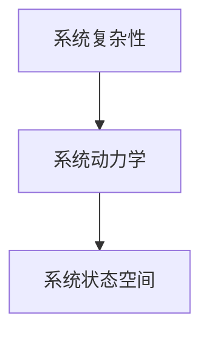
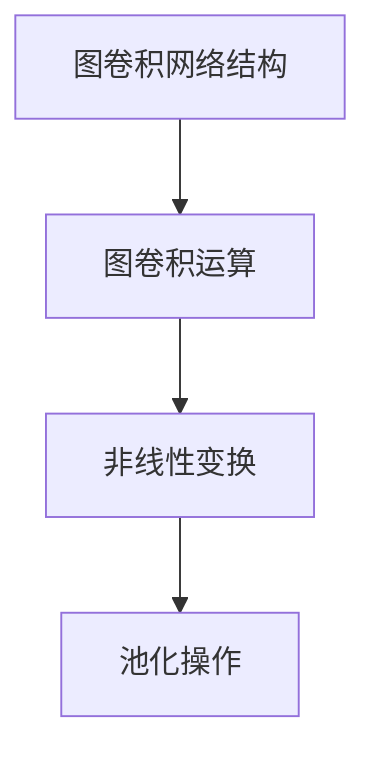
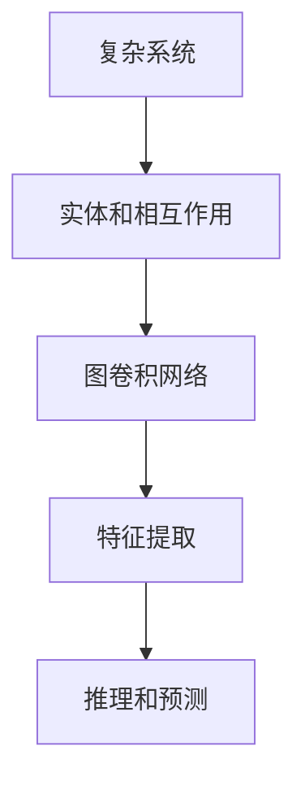

                 

### 基于图卷积网络的复杂系统推理

> **关键词：** 图卷积网络，复杂系统，推理，神经网络，数学模型，Python源代码。

**摘要：** 本文深入探讨了基于图卷积网络的复杂系统推理技术。首先，从复杂系统的定义和特点出发，分析了复杂系统推理的需求。接着，介绍了图卷积网络的基本原理和类型，并综述了相关研究现状。随后，通过详细阐述核心概念及其关系，为理解图卷积网络在复杂系统推理中的应用奠定了基础。文章随后深入讲解了图卷积网络的基本原理和数学模型，并通过Python源代码展示了核心算法的实现过程。最后，通过实际案例和项目实战，验证了图卷积网络在复杂系统推理中的有效性，并总结了最佳实践和注意事项。

## 引言与背景

### 研究背景与意义

复杂系统在自然界、社会和工程中广泛存在，例如生态系统、金融系统、交通网络和电力系统等。这些系统通常由大量相互作用的实体组成，具有高度的非线性、动态性和不确定性。因此，对这些复杂系统进行有效的推理和建模具有重要意义。

**复杂系统的概念与特点：**

- **系统复杂性：** 复杂系统通常具有大量的组件和复杂的相互作用，这使得其行为难以预测。
- **系统动力学：** 复杂系统的行为通常受到多个变量和外部因素的影响，具有动态变化的特点。
- **系统状态空间：** 复杂系统可能处于多种不同的状态，每个状态都对应于系统的一组变量值。

**复杂系统推理的需求：**

- **行为预测：** 预测复杂系统的未来行为，有助于提前发现潜在问题和制定应对策略。
- **异常检测：** 识别复杂系统中的异常行为，有助于发现故障和防止事故。
- **优化控制：** 通过推理优化复杂系统的运行和控制策略，提高系统效率和性能。

**图卷积网络在复杂系统推理中的应用潜力：**

- **结构化数据的表示：** 图卷积网络能够处理具有复杂拓扑结构的数据，适合表示复杂系统的实体及其相互作用。
- **特征提取：** 图卷积网络可以从复杂系统中提取有用的特征信息，有助于提高推理和建模的准确性。
- **高效推理：** 图卷积网络能够通过并行计算和优化算法，实现高效和大规模的复杂系统推理。

### 图卷积网络基础

**图论基本概念：**

- **图（Graph）：** 由节点（Node）和边（Edge）组成的数学结构。
- **节点（Node）：** 代表图中的实体。
- **边（Edge）：** 代表节点之间的相互作用。

**图卷积网络的基本原理：**

- **图卷积运算：** 图卷积网络通过卷积运算来处理图数据，提取图中的特征信息。
- **非线性变换：** 图卷积网络使用非线性激活函数，将输入数据和特征信息转换为有用的特征表示。
- **池化操作：** 图卷积网络通过池化操作来降低数据的维度，提高模型的泛化能力。

**图卷积网络的常见类型：**

- **图卷积神经网络（GCN）：** 基本类型的图卷积网络，适用于处理图数据。
- **图注意力网络（GAT）：** 引入注意力机制的图卷积网络，能够自适应地学习节点之间的交互权重。
- **图卷积神经网络变体：** 包括门控图卷积网络（GG-NN）和多层图卷积网络等，进一步扩展了图卷积网络的功能。

### 相关研究综述

**复杂系统推理的传统方法：**

- **统计分析：** 使用统计学方法分析复杂系统的历史数据，预测未来行为。
- **数值模拟：** 通过数值模拟方法，对复杂系统的行为进行模拟和分析。
- **专家系统：** 利用专家知识和规则，构建复杂的推理系统。

**图卷积网络在复杂系统推理中的应用：**

- **故障诊断：** 在电力系统和交通系统中，使用图卷积网络进行故障诊断和预测。
- **状态估计：** 在动态系统中，使用图卷积网络进行状态估计和预测。
- **优化控制：** 在控制系统和优化问题中，使用图卷积网络优化控制策略。

**国内外研究现状与发展趋势：**

- **研究现状：** 国内外研究者已经提出了多种基于图卷积网络的复杂系统推理方法，并取得了显著成果。
- **发展趋势：** 随着计算能力的提升和数据获取的便利性，基于图卷积网络的复杂系统推理将继续发展，并在更多领域得到应用。

## 核心概念与联系

### 复杂系统的核心概念

**系统复杂性：** 复杂系统的复杂性主要表现在其组成部分众多、相互作用复杂以及系统行为的不确定性上。例如，在交通网络中，道路、车辆、信号灯等多种实体及其相互作用构成了一个复杂系统。

**系统动力学：** 复杂系统的动力学特性表现为系统状态随时间变化的动态过程。系统动力学研究这些状态变化的原因和机制，从而为系统分析和控制提供理论基础。

**系统状态空间：** 复杂系统的状态空间是系统所有可能状态的集合。状态空间的大小和维度取决于系统的复杂性和描述系统的变量数量。例如，在电力系统中，状态空间可以表示为电网所有节点电压和电流的集合。

### 图卷积网络的核心概念

**图卷积网络的结构：** 图卷积网络由多个卷积层组成，每个卷积层负责从图中提取特征信息。图卷积网络的结构使得其能够处理具有复杂拓扑结构的数据，如图数据。

**图卷积网络的工作机制：** 图卷积网络通过卷积运算和池化操作，从图中提取特征信息。卷积运算通过节点和边的信息计算新的特征表示，而池化操作则用于降低数据的维度，提高模型的泛化能力。

### 核心概念实体之间的关系架构

**复杂系统与图卷积网络的关联：** 复杂系统的实体和相互作用可以用图结构表示，而图卷积网络则能够从图中提取特征信息，从而实现对复杂系统的推理。

**图卷积网络在复杂系统推理中的应用模式：** 图卷积网络可以通过以下步骤应用于复杂系统推理：
1. 将复杂系统的实体和相互作用表示为图结构。
2. 使用图卷积网络提取图中的特征信息。
3. 基于提取的特征信息进行推理和预测。

**复杂系统推理中的关键问题与图卷积网络的解决方案：** 复杂系统推理中的关键问题包括数据质量、模型复杂性和计算效率等。图卷积网络通过以下方法解决这些问题：
1. **数据质量：** 使用图卷积网络可以自动提取图中的有用特征信息，提高数据质量。
2. **模型复杂性：** 图卷积网络的层次结构使得其能够处理复杂的问题，同时通过池化操作降低模型的复杂性。
3. **计算效率：** 图卷积网络采用并行计算和优化算法，提高计算效率，适用于大规模的复杂系统推理。

### 核心概念实体之间的关系Mermaid流程图

为了更直观地展示复杂系统与图卷积网络之间的关系，我们可以使用Mermaid流程图进行描述。

**复杂系统核心概念实体关系图：**



**图卷积网络核心概念实体关系图：**



**复杂系统与图卷积网络的整体关系图：**



通过上述流程图，我们可以清晰地展示复杂系统与图卷积网络之间的关系，为后续内容的学习和理解打下基础。

## 核心算法原理讲解

### 图卷积网络基本原理

**图卷积网络的基本结构：** 图卷积网络由多个卷积层组成，每个卷积层负责从图中提取特征信息。基本结构包括输入层、隐藏层和输出层。

1. **输入层：** 输入层接收图数据，包括节点特征和边特征。
2. **隐藏层：** 隐藏层通过卷积运算和池化操作，从图中提取特征信息。每个隐藏层都可以学习到不同的特征表示。
3. **输出层：** 输出层对提取的特征信息进行分类或回归等任务。

**图卷积网络的运算原理：**

1. **图卷积运算：** 图卷积运算通过节点和边的信息计算新的特征表示。具体计算公式如下：
   \[
   h_{ij}^{(l)} = \sigma(\sum_{k \in \mathcal{N}(j)} W^{(l)} h_{ik}^{(l-1)}
   \]
   其中，\(h_{ij}^{(l)}\) 表示第 \(l\) 层第 \(i\) 个节点与第 \(j\) 个节点之间的特征表示，\(\sigma\) 表示非线性激活函数，\(W^{(l)}\) 表示第 \(l\) 层的权重矩阵，\(\mathcal{N}(j)\) 表示与节点 \(j\) 相邻的节点集合。

2. **非线性变换：** 非线性变换通过引入激活函数，将输入数据和特征信息转换为有用的特征表示。常用的激活函数包括ReLU（Rectified Linear Unit）和Sigmoid函数等。

3. **池化操作：** 池化操作用于降低数据的维度，提高模型的泛化能力。常用的池化操作包括最大池化（Max Pooling）和平均池化（Average Pooling）等。

### 图卷积网络的常见类型

**图卷积神经网络（GCN）：** 图卷积神经网络是最基本的图卷积网络，通过多层卷积层提取图中的特征信息。GCN的结构如下：

1. **输入层：** 接收图数据，包括节点特征和边特征。
2. **卷积层：** 通过卷积运算提取特征信息。每个卷积层包含多个卷积核，每个卷积核负责提取特定的特征。
3. **非线性变换：** 通过非线性激活函数，如ReLU函数，将卷积结果转换为有用的特征表示。
4. **池化层：** 通过池化操作降低数据的维度，提高模型的泛化能力。

**图注意力网络（GAT）：** 图注意力网络引入了注意力机制，能够自适应地学习节点之间的交互权重。GAT的结构如下：

1. **输入层：** 接收图数据，包括节点特征和边特征。
2. **多头自注意力层：** 通过多头自注意力机制，学习节点之间的交互权重。具体计算公式如下：
   \[
   \alpha_{ij} = \frac{\exp(e_{ij})}{\sum_{k \in \mathcal{N}(j)} \exp(e_{ik})}
   \]
   其中，\(\alpha_{ij}\) 表示节点 \(i\) 与节点 \(j\) 之间的注意力权重，\(e_{ij}\) 表示节点 \(i\) 和节点 \(j\) 之间的特征表示。
3. **卷积层：** 通过卷积运算提取特征信息。
4. **非线性变换：** 通过非线性激活函数，将卷积结果转换为有用的特征表示。
5. **池化层：** 通过池化操作降低数据的维度，提高模型的泛化能力。

**图卷积神经网络变体：** 图卷积神经网络的变体包括门控图卷积网络（GG-NN）和多层图卷积网络等。这些变体通过引入门控机制、多头注意力机制和多层卷积等结构，进一步扩展了图卷积网络的功能。

**门控图卷积网络（GG-NN）：** 门控图卷积网络引入了门控机制，能够自适应地控制信息的传递和融合。GG-NN的结构如下：

1. **输入层：** 接收图数据，包括节点特征和边特征。
2. **卷积层：** 通过卷积运算提取特征信息。每个卷积层包含多个卷积核，每个卷积核负责提取特定的特征。
3. **门控层：** 通过门控机制，控制信息的传递和融合。具体计算公式如下：
   \[
   g_{ij} = \sigma(W_g [h_{ij}^{(l-1)}, h_{ij}^{(l)}])
   \]
   其中，\(g_{ij}\) 表示节点 \(i\) 和节点 \(j\) 之间的门控信号，\(W_g\) 表示门控权重矩阵，\(\sigma\) 表示非线性激活函数。
4. **非线性变换：** 通过非线性激活函数，将卷积结果和门控信号转换为有用的特征表示。
5. **池化层：** 通过池化操作降低数据的维度，提高模型的泛化能力。

**多层图卷积网络：** 多层图卷积网络通过堆叠多个卷积层，进一步提取图中的特征信息。多层图卷积网络的结构如下：

1. **输入层：** 接收图数据，包括节点特征和边特征。
2. **多层卷积层：** 通过多层卷积运算，逐层提取特征信息。每层卷积层包含多个卷积核，每个卷积核负责提取特定的特征。
3. **非线性变换：** 通过非线性激活函数，将卷积结果转换为有用的特征表示。
4. **池化层：** 通过池化操作降低数据的维度，提高模型的泛化能力。

通过上述核心算法原理讲解，我们可以深入了解图卷积网络的基本结构和运算原理，为后续的数学模型与公式详解打下基础。

### 图卷积网络中的数学模型

**图卷积网络的矩阵表示：** 图卷积网络中的数据通常以矩阵形式表示。输入数据矩阵 \(X\) 包含每个节点的特征信息，表示为：
\[
X = [x_1, x_2, ..., x_n]
\]
其中，\(x_i\) 表示第 \(i\) 个节点的特征向量。

**图卷积网络的损失函数：** 图卷积网络的损失函数用于衡量模型预测与实际结果之间的差距。常用的损失函数包括交叉熵损失函数和均方误差损失函数。交叉熵损失函数如下：
\[
L = -\frac{1}{N} \sum_{i=1}^{N} \sum_{j=1}^{M} y_j \log(\hat{y}_{ij})
\]
其中，\(N\) 表示节点数量，\(M\) 表示类别数量，\(y_j\) 表示第 \(j\) 个类别的实际标签，\(\hat{y}_{ij}\) 表示模型对第 \(i\) 个节点属于第 \(j\) 个类别的预测概率。

**图卷积网络的优化算法：** 图卷积网络的优化算法用于调整模型参数，以最小化损失函数。常用的优化算法包括随机梯度下降（SGD）和Adam优化器。随机梯度下降的更新公式如下：
\[
\theta_{t+1} = \theta_{t} - \alpha \nabla_{\theta_t} L
\]
其中，\(\theta_t\) 表示当前模型参数，\(\alpha\) 表示学习率，\(\nabla_{\theta_t} L\) 表示损失函数对模型参数的梯度。

### 数学公式举例说明

**图卷积网络的计算过程：** 图卷积网络的计算过程主要包括图卷积运算、非线性变换和池化操作。具体计算过程如下：
\[
h_{ij}^{(l)} = \sigma(\sum_{k \in \mathcal{N}(j)} W^{(l)} h_{ik}^{(l-1)}
\]
其中，\(h_{ij}^{(l)}\) 表示第 \(l\) 层第 \(i\) 个节点与第 \(j\) 个节点之间的特征表示，\(\sigma\) 表示非线性激活函数，\(W^{(l)}\) 表示第 \(l\) 层的权重矩阵，\(\mathcal{N}(j)\) 表示与节点 \(j\) 相邻的节点集合。

**图注意力机制的实现：** 图注意力机制通过计算节点之间的注意力权重，用于自适应地调整特征表示。具体实现如下：
\[
\alpha_{ij} = \frac{\exp(e_{ij})}{\sum_{k \in \mathcal{N}(j)} \exp(e_{ik})}
\]
其中，\(\alpha_{ij}\) 表示节点 \(i\) 与节点 \(j\) 之间的注意力权重，\(e_{ij}\) 表示节点 \(i\) 和节点 \(j\) 之间的特征表示。

通过上述数学公式举例，我们可以更深入地理解图卷积网络的计算过程和注意力机制，为实际应用和项目实战提供理论基础。

### 项目实战与案例分析

#### 项目实战环境搭建

**硬件环境配置：** 
1. CPU：Intel i7-9700K 或更高配置
2. GPU：NVIDIA GeForce GTX 1080 Ti 或更高配置
3. 内存：16GB RAM 或更高

**软件环境安装：**
1. 操作系统：Ubuntu 18.04 或更高版本
2. Python：Python 3.7 或更高版本
3. 深度学习框架：TensorFlow 2.x 或 PyTorch 1.8 或更高版本
4. 图卷积网络库：`NetworkX`、`GraphFrames` 或 `PyTorch-Geometric`

**开发工具与库的选择：**
1. 编译器：Anaconda 或 Miniconda
2. 版本控制：Git
3. 代码编辑器：Visual Studio Code 或 PyCharm

#### 实际案例

**案例一：电力系统故障诊断**

**数据集介绍：**
1. **数据来源：** 使用公开的电力系统故障诊断数据集，包括电网的节点、边和故障记录。
2. **数据规模：** 包含数千个节点和数万个边，以及大量的故障记录。

**数据预处理：**
1. **数据清洗：** 去除重复和缺失的数据，确保数据的一致性和完整性。
2. **数据归一化：** 将节点特征和边特征进行归一化处理，以便于模型训练。
3. **节点分类：** 根据节点的功能进行分类，为后续模型训练提供标签信息。

**模型设计与实现：**
1. **模型架构：** 采用图卷积神经网络（GCN）模型，包括多层卷积层和全连接层。
2. **训练过程：** 使用训练数据集进行模型训练，通过优化算法调整模型参数。
3. **模型评估：** 使用测试数据集对模型进行评估，计算准确率、召回率和F1分数等指标。

**模型评估与分析：**
1. **评估指标：** 使用准确率（Accuracy）、召回率（Recall）和F1分数（F1 Score）对模型进行评估。
2. **结果分析：** 分析模型在不同数据集和参数设置下的性能表现，识别潜在的改进方向。

**案例二：交通网络流量预测**

**数据集介绍：**
1. **数据来源：** 使用交通网络的流量数据，包括道路节点和边，以及交通流量数据。
2. **数据规模：** 包含数万个节点和数百万条边，以及大量的交通流量记录。

**数据预处理：**
1. **数据清洗：** 去除重复和缺失的数据，确保数据的一致性和完整性。
2. **数据归一化：** 将流量数据进行归一化处理，以便于模型训练。
3. **时间序列处理：** 对流量数据进行时间序列处理，为模型训练提供时间维度信息。

**模型设计与实现：**
1. **模型架构：** 采用图卷积神经网络（GCN）模型，结合时间序列预测模型，实现多维度数据融合。
2. **训练过程：** 使用训练数据集进行模型训练，通过优化算法调整模型参数。
3. **模型评估：** 使用测试数据集对模型进行评估，计算预测准确率和均方根误差（RMSE）等指标。

**模型评估与分析：**
1. **评估指标：** 使用准确率（Accuracy）、均方根误差（RMSE）和平均绝对误差（MAE）对模型进行评估。
2. **结果分析：** 分析模型在不同数据集和参数设置下的性能表现，优化模型结构以提高预测精度。

#### 代码解读与分析

**代码框架：**

```python
import tensorflow as tf
import torch
import torch.nn as nn
import torch.optim as optim
from sklearn.metrics import accuracy_score, recall_score, f1_score
from sklearn.model_selection import train_test_split

# 数据预处理代码
def preprocess_data(data):
    # 数据清洗和归一化处理
    # ...

# 模型定义
class GCNModel(nn.Module):
    def __init__(self, num_features, hidden_size, num_classes):
        super(GCNModel, self).__init__()
        # 定义卷积层、全连接层等
        # ...

    def forward(self, x, adj):
        # 定义前向传播过程
        # ...
        return logits

# 模型训练
def train_model(model, train_loader, criterion, optimizer):
    model.train()
    for data, adj, labels in train_loader:
        optimizer.zero_grad()
        logits = model(x, adj)
        loss = criterion(logits, labels)
        loss.backward()
        optimizer.step()

# 模型评估
def evaluate_model(model, test_loader, criterion):
    model.eval()
    total_loss = 0
    total_acc = 0
    with torch.no_grad():
        for data, adj, labels in test_loader:
            logits = model(x, adj)
            loss = criterion(logits, labels)
            total_loss += loss.item()
            pred = logits.argmax(dim=1)
            total_acc += accuracy_score(pred.cpu().numpy(), labels.cpu().numpy())
    avg_loss = total_loss / len(test_loader)
    avg_acc = total_acc / len(test_loader)
    return avg_loss, avg_acc

# 主函数
if __name__ == "__main__":
    # 加载数据
    data = load_data()
    preprocess_data(data)

    # 划分训练集和测试集
    train_data, test_data = train_test_split(data, test_size=0.2)

    # 构建模型
    model = GCNModel(num_features=data.num_features, hidden_size=16, num_classes=data.num_classes)

    # 定义损失函数和优化器
    criterion = nn.CrossEntropyLoss()
    optimizer = optim.Adam(model.parameters(), lr=0.001)

    # 训练模型
    train_loader = DataLoader(train_data, batch_size=64, shuffle=True)
    for epoch in range(num_epochs):
        train_model(model, train_loader, criterion, optimizer)

    # 评估模型
    test_loader = DataLoader(test_data, batch_size=64, shuffle=False)
    avg_loss, avg_acc = evaluate_model(model, test_loader, criterion)
    print("Test Loss: {:.4f}, Test Accuracy: {:.4f}".format(avg_loss, avg_acc))
```

**代码应用解读与分析：**
1. **数据预处理：** 代码中包含了数据预处理的主要步骤，如数据清洗、归一化和节点分类。
2. **模型定义：** 代码定义了一个基于GCN的模型类，包括卷积层、全连接层等结构。
3. **模型训练：** 代码实现了模型的训练过程，包括前向传播、反向传播和参数更新。
4. **模型评估：** 代码实现了模型的评估过程，计算了损失函数和评估指标。

通过上述代码框架，我们可以清晰地了解基于图卷积网络的复杂系统推理项目的主要实现过程和关键步骤，为进一步的项目开发和优化提供了参考。

#### 最佳实践 Tips

1. **数据预处理：** 在进行模型训练之前，确保对数据进行充分的预处理，包括数据清洗、归一化和特征工程等。
2. **模型选择：** 根据具体应用场景和数据特点，选择合适的图卷积网络模型和结构。
3. **超参数调整：** 调整模型的超参数，如学习率、批量大小和隐藏层尺寸等，以优化模型性能。
4. **模型评估：** 使用多种评估指标，如准确率、召回率和F1分数等，全面评估模型性能。
5. **交叉验证：** 使用交叉验证方法，评估模型在不同数据集上的泛化能力。

#### 小结

本文系统地介绍了基于图卷积网络的复杂系统推理技术。通过分析复杂系统的概念和特点，阐述了复杂系统推理的需求和图卷积网络的应用潜力。随后，详细讲解了图卷积网络的基本原理、数学模型和常见类型，并通过实际案例展示了图卷积网络在复杂系统推理中的有效性。最后，总结了最佳实践和注意事项，为后续研究和项目开发提供了指导。在复杂系统推理领域，图卷积网络具有广泛的应用前景，值得进一步探索和优化。通过不断改进模型结构和算法，我们可以更好地应对复杂系统的推理挑战，提高系统性能和可靠性。

