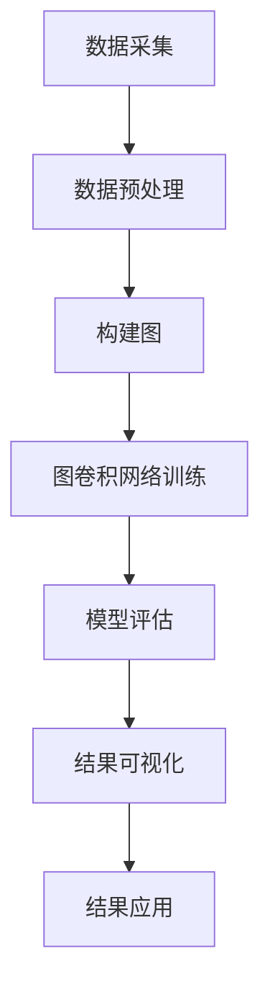

                 

## #基于图卷积网络的社交网络分析AI系统

### 关键词：图卷积网络、社交网络分析、AI系统、图信号处理、算法改进

#### 摘要：

随着互联网和社交媒体的迅猛发展，社交网络分析（Social Network Analysis，SNA）在多个领域展现出了巨大的应用潜力。图卷积网络（Graph Convolutional Network，GCN）作为一种在图结构数据上运作的神经网络，因其强大的节点特征聚合能力，逐渐成为社交网络分析的利器。本文旨在深入探讨基于图卷积网络的社交网络分析AI系统的构建、实现与应用，从基础理论到算法改进，再到系统设计，全面解析GCN在社交网络分析中的应用。

## 目录大纲

### 第一部分：图卷积网络基础

#### 第1章：图卷积网络概述

- **1.1.1 图卷积网络的起源与发展**
- **1.1.2 图卷积网络的基本原理**
- **1.1.3 图卷积网络的应用场景**

#### 第2章：图卷积网络数学基础

- **2.1.1 图信号处理基础**
- **2.1.2 常用的图卷积核**
- **2.1.3 图卷积网络中的正则化策略**

#### 第3章：常见的图卷积网络架构

- **3.1.1 GCN架构**
- **3.1.2 GAT架构**
- **3.1.3 GraphSAGE架构**

#### 第4章：图卷积网络在社交网络分析中的应用

- **4.1.1 社交网络数据结构**
- **4.1.2 图卷积网络在社交网络分析中的优势**
- **4.1.3 社交网络分析的图卷积网络应用案例**

#### 第5章：图卷积网络在社交网络分析中的算法改进

- **5.1.1 图卷积网络在社交网络分析中的挑战**
- **5.1.2 算法改进方法**
- **5.1.3 算法改进案例分析**

#### 第6章：图卷积网络社交网络分析系统设计

- **6.1.1 系统架构设计**
- **6.1.2 数据处理与预处理**
- **6.1.3 模型训练与评估**

### 第二部分：基于图卷积网络的社交网络分析AI系统实现

#### 第7章：开发环境与工具配置

- **7.1.1 环境搭建步骤**
- **7.1.2 常用工具与库介绍**
- **7.1.3 实例配置说明**

#### 第8章：社交网络分析AI系统架构设计

- **8.1.1 系统架构设计原则**
- **8.1.2 数据流设计**
- **8.1.3 功能模块设计**

#### 第9章：社交网络分析数据预处理

- **9.1.1 数据采集与整合**
- **9.1.2 数据清洗与预处理**
- **9.1.3 数据可视化**

#### 第10章：图卷积网络模型训练与优化

- **10.1.1 模型训练流程**
- **10.1.2 模型优化策略**
- **10.1.3 模型评估与调优**

#### 第11章：社交网络分析AI系统部署与运维

- **11.1.1 系统部署方案**
- **11.1.2 系统运维策略**
- **11.1.3 持续集成与持续部署**

### 第三部分：案例研究

#### 第12章：某社交网络平台的图卷积网络分析实践

- **12.1.1 项目背景**
- **12.1.2 数据采集与处理**
- **12.1.3 模型设计与实现**
- **12.1.4 实施效果评估**

#### 第13章：图卷积网络在社交网络安全中的应用

- **13.1.1 社交网络安全隐患**
- **13.1.2 图卷积网络在社交网络安全中的应用**
- **13.1.3 案例分析**

#### 第14章：未来展望与研究方向

- **14.1.1 图卷积网络发展趋势**
- **14.1.2 社交网络分析AI系统发展前景**
- **14.1.3 潜在研究方向**

### 附录

#### 附录A：常用工具与库

- **A.1 常用深度学习框架**
- **A.2 常用数据处理库**
- **A.3 常用可视化工具**

#### 附录B：Mermaid流程图

- **B.1 Mermaid 简介**
- **B.2 Mermaid 基本语法**
- **B.3 社交网络分析流程图示例**

## 核心概念与联系

### 图卷积网络（Graph Convolutional Network，GCN）

图卷积网络（GCN）是一种在图结构数据上运作的神经网络，通过聚合节点邻域信息来更新节点特征。在社交网络分析中，GCN能够捕捉用户之间的关系，从而进行节点分类、链接预测等任务。

- **节点特征**：每个节点都有一组特征向量，用于描述节点的属性。
- **邻域聚合**：GCN通过聚合邻域节点的特征来更新当前节点的特征。
- **图卷积操作**：这是一个聚合操作的泛化，它可以将一个节点特征向量映射到另一个节点特征向量。

### Mermaid流程图



### 核心算法原理讲解

图卷积网络（GCN）的核心算法可以概括为以下几个步骤：

1. **初始化节点特征**：每个节点初始化一个特征向量。
2. **邻域聚合**：通过聚合邻域节点的特征来更新当前节点的特征。
3. **图卷积操作**：这是一个聚合操作的泛化，它可以将一个节点特征向量映射到另一个节点特征向量。

```python
import torch
import torch.nn as nn
import torch.optim as optim

# 初始化节点特征
node_features = torch.randn(num_nodes, input_dim)

# 邻域聚合
def aggregate(neighbors, alpha):
    return torch.mean(neighbors, dim=0) + alpha * node_features

# 图卷积操作
class GCNLayer(nn.Module):
    def __init__(self, input_dim, output_dim, alpha=0.1):
        super(GCNLayer, self).__init__()
        self.linear = nn.Linear(input_dim, output_dim)
        self.alpha = alpha

    def forward(self, node_features, adj_matrix):
        neighbors = torch.stack([adj_matrix[i] for i in range(adj_matrix.size(0))])
        aggregated_features = aggregate(neighbors, self.alpha)
        return self.linear(aggregated_features)
```

通过上述Python代码，我们定义了一个GCN层，用于实现节点特征的邻域聚合和图卷积操作。这里，`node_features`表示节点的特征向量，`adj_matrix`表示邻接矩阵，`alpha`是一个超参数，用于控制聚合过程中节点自身特征的影响。

## 第一部分：图卷积网络基础

### 第1章：图卷积网络概述

#### 1.1.1 图卷积网络的起源与发展

图卷积网络（Graph Convolutional Network，GCN）起源于图信号处理（Graph Signal Processing，GSP）领域。图信号处理是一种针对图结构数据的信号处理方法，其核心思想是将图结构数据转化为信号处理问题，从而利用传统信号处理的理论和方法进行分析和处理。

在2013年，Kipf和Welling提出了图卷积网络（GCN）这一概念，并将其应用于图结构数据的节点分类任务。随后，GCN在多个领域得到了广泛应用，如社交网络分析、推荐系统、生物信息学等。

#### 1.1.2 图卷积网络的基本原理

图卷积网络（GCN）是一种在图结构数据上运作的神经网络，其基本原理是通过聚合节点邻域信息来更新节点特征。具体来说，GCN通过以下步骤实现：

1. **初始化节点特征**：每个节点初始化一个特征向量。
2. **邻域聚合**：通过聚合邻域节点的特征来更新当前节点的特征。
3. **图卷积操作**：这是一个聚合操作的泛化，它可以将一个节点特征向量映射到另一个节点特征向量。

#### 1.1.3 图卷积网络的应用场景

图卷积网络（GCN）在多个领域展现出了强大的应用潜力，主要包括以下几个方面：

1. **节点分类**：通过学习节点邻域信息，GCN能够识别节点在图中的角色，从而实现节点分类任务。
2. **链接预测**：利用节点特征和图结构，GCN可以预测图中可能存在的链接关系。
3. **社交网络分析**：通过捕捉用户之间的关系，GCN可以用于用户行为分析、推荐系统、社区发现等任务。
4. **推荐系统**：GCN可以用于推荐系统中，通过学习用户之间的相似性，为用户推荐感兴趣的内容。

### 第2章：图卷积网络数学基础

#### 2.1.1 图信号处理基础

图信号处理（Graph Signal Processing，GSP）是一种针对图结构数据的信号处理方法，其核心思想是将图结构数据转化为信号处理问题。在GSP中，图结构数据被表示为一个邻接矩阵或拉普拉斯矩阵。

1. **邻接矩阵**：邻接矩阵是一个用于表示图中节点之间连接关系的矩阵。如果节点i与节点j之间存在一条边，则邻接矩阵中的对应元素为1，否则为0。

2. **拉普拉斯矩阵**：拉普拉斯矩阵是邻接矩阵的一种推广，用于表示图中节点的度信息。拉普拉斯矩阵L的定义为L = D - A，其中D是对角矩阵，表示节点的度，A是邻接矩阵。

#### 2.1.2 常用的图卷积核

图卷积核是图卷积网络（GCN）中的核心组成部分，用于实现节点特征向量的聚合和变换。常用的图卷积核包括以下几种：

1. **线性卷积核**：线性卷积核是一种简单的图卷积核，通过线性组合邻域节点的特征向量来实现聚合。其数学表示为：$$ h_{i}^{(l+1)} = \sigma \left( \sum_{j \in \mathcal{N}(i)} w_{ij} h_{j}^{(l)} \right) + b $$ 其中，$ h_{i}^{(l)} $ 表示第$l$层节点i的特征向量，$ \mathcal{N}(i) $ 表示节点i的邻域，$ w_{ij} $ 和 $ b $ 分别是权重和偏置。

2. **卷积神经网络（CNN）卷积核**：卷积神经网络（CNN）卷积核可以用于图卷积网络中，通过共享参数和局部连接的方式提高模型的性能。其数学表示为：$$ h_{i}^{(l+1)} = \sigma \left( \sum_{j \in \mathcal{N}(i)} w_{ij} \cdot \phi(h_{j}^{(l)}) \right) + b $$ 其中，$ \phi(\cdot) $ 表示卷积核，$ w_{ij} $ 和 $ b $ 分别是权重和偏置。

3. **注意力机制卷积核**：注意力机制卷积核可以自适应地调整邻域节点的贡献，从而提高模型的性能。其数学表示为：$$ h_{i}^{(l+1)} = \sigma \left( \sum_{j \in \mathcal{N}(i)} a_{ij} h_{j}^{(l)} \right) + b $$ 其中，$ a_{ij} $ 表示注意力权重，可以通过学习得到。

#### 2.1.3 图卷积网络中的正则化策略

正则化策略是图卷积网络（GCN）中的一种重要手段，用于防止过拟合和改善模型性能。常用的正则化策略包括以下几种：

1. **权重正则化**：权重正则化通过引入L1或L2正则项来约束模型的权重，从而降低模型的复杂度。其数学表示为：$$ \mathcal{L} = \sum_{i,j} w_{ij}^2 + \lambda \| w_{ij} \|_1 $$ 其中，$ w_{ij} $ 是权重，$ \lambda $ 是正则化参数。

2. **结构正则化**：结构正则化通过引入图结构信息来约束模型的输出，从而提高模型的可解释性。其数学表示为：$$ \mathcal{L} = \sum_{i,j} (h_{i}^{(l)} - h_{j}^{(l)})^2 + \lambda \| h_{i}^{(l)} - h_{j}^{(l)} \|_1 $$ 其中，$ h_{i}^{(l)} $ 是第$l$层节点i的特征向量。

3. **Dropout正则化**：Dropout正则化通过在训练过程中随机丢弃部分节点或边的特征，从而降低模型的过拟合风险。其数学表示为：$$ \mathcal{L} = \sum_{i,j} w_{ij}^2 + \lambda \| w_{ij} \|_1 + \frac{1}{2} \sum_{i,j} (h_{i}^{(l)} - h_{j}^{(l)})^2 + \lambda \| h_{i}^{(l)} - h_{j}^{(l)} \|_1 $$ 其中，$ w_{ij} $ 是权重，$ \lambda $ 是正则化参数。

### 第3章：常见的图卷积网络架构

#### 3.1.1 GCN架构

图卷积网络（GCN）是一种基础的图卷积网络架构，其核心思想是通过多层图卷积层来逐步提取图结构中的特征。GCN的架构包括以下几个部分：

1. **输入层**：输入层接收节点的特征向量，并将其传递给下一层。
2. **图卷积层**：图卷积层通过聚合邻域节点的特征来更新当前节点的特征。一个标准的图卷积层可以表示为：$$ h_{i}^{(l+1)} = \sigma \left( \sum_{j \in \mathcal{N}(i)} w_{ij} h_{j}^{(l)} \right) + b $$ 其中，$ h_{i}^{(l)} $ 是第$l$层节点i的特征向量，$ \sigma(\cdot) $ 是激活函数，$ w_{ij} $ 和 $ b $ 分别是权重和偏置。
3. **输出层**：输出层接收最后一层图卷积层的特征向量，并输出分类或预测结果。

#### 3.1.2 GAT架构

图注意力网络（Graph Attention Network，GAT）是一种基于图卷积网络（GCN）的改进架构，其核心思想是引入注意力机制来自适应地调整邻域节点的贡献。GAT的架构包括以下几个部分：

1. **输入层**：输入层接收节点的特征向量，并将其传递给下一层。
2. **图注意力层**：图注意力层通过计算邻域节点之间的注意力权重来更新当前节点的特征。一个标准的图注意力层可以表示为：$$ \alpha_{ij} = \frac{e^{a_{ij}}}{\sum_{k \in \mathcal{N}(i)} e^{a_{ik}}} $$ 其中，$ a_{ij} = \theta_{i}^T \theta_{j} $，$ \theta_{i} $ 和 $ \theta_{j} $ 分别是节点i和节点j的嵌入向量，$ \alpha_{ij} $ 是节点i和节点j之间的注意力权重。
3. **图卷积层**：图卷积层通过聚合邻域节点的特征和注意力权重来更新当前节点的特征。一个标准的图卷积层可以表示为：$$ h_{i}^{(l+1)} = \sigma \left( \sum_{j \in \mathcal{N}(i)} w_{ij} h_{j}^{(l)} \right) + b $$ 其中，$ h_{i}^{(l)} $ 是第$l$层节点i的特征向量，$ \sigma(\cdot) $ 是激活函数，$ w_{ij} $ 和 $ b $ 分别是权重和偏置。
4. **输出层**：输出层接收最后一层图卷积层的特征向量，并输出分类或预测结果。

#### 3.1.3 GraphSAGE架构

图序列聚合网络（Graph Sequence Averaging，GraphSAGE）是一种基于图卷积网络（GCN）的改进架构，其核心思想是使用节点序列来聚合邻域节点的特征。GraphSAGE的架构包括以下几个部分：

1. **输入层**：输入层接收节点的特征向量，并将其传递给下一层。
2. **序列聚合层**：序列聚合层通过聚合节点序列中的邻域节点特征来更新当前节点的特征。一个标准的序列聚合层可以表示为：$$ h_{i}^{(l+1)} = \sigma \left( \sum_{j \in \mathcal{N}(i)} f(h_{j}^{(l)}) \right) $$ 其中，$ f(\cdot) $ 是聚合函数，$ h_{i}^{(l)} $ 是第$l$层节点i的特征向量。
3. **图卷积层**：图卷积层通过聚合邻域节点的特征来更新当前节点的特征。一个标准的图卷积层可以表示为：$$ h_{i}^{(l+1)} = \sigma \left( \sum_{j \in \mathcal{N}(i)} w_{ij} h_{j}^{(l)} \right) + b $$ 其中，$ h_{i}^{(l)} $ 是第$l$层节点i的特征向量，$ \sigma(\cdot) $ 是激活函数，$ w_{ij} $ 和 $ b $ 分别是权重和偏置。
4. **输出层**：输出层接收最后一层图卷积层的特征向量，并输出分类或预测结果。

### 第4章：图卷积网络在社交网络分析中的应用

#### 4.1.1 社交网络数据结构

社交网络数据通常可以表示为一个图结构，其中节点表示用户，边表示用户之间的交互关系。社交网络数据结构的特点包括：

1. **无向图**：社交网络中的用户交互关系通常是无向的，即用户A与用户B之间的交互关系与用户B与用户A之间的交互关系相同。
2. **稀疏性**：社交网络中的用户数量通常非常大，但用户之间的交互关系相对较少，因此社交网络数据通常具有稀疏性。
3. **社区结构**：社交网络中的用户往往具有特定的社区结构，即用户之间形成一定的群体或社区。

#### 4.1.2 图卷积网络在社交网络分析中的优势

图卷积网络（GCN）在社交网络分析中具有以下优势：

1. **强大的节点特征聚合能力**：GCN能够通过聚合节点邻域信息来更新节点特征，从而更好地捕捉社交网络中用户之间的关系。
2. **可扩展性**：GCN可以应用于大规模社交网络数据，并且可以随着数据规模的增加而提高性能。
3. **灵活性**：GCN的架构可以根据具体的应用需求进行灵活调整，如引入注意力机制、聚合策略等。

#### 4.1.3 社交网络分析的图卷积网络应用案例

图卷积网络（GCN）在社交网络分析中具有广泛的应用，以下是一些典型的应用案例：

1. **用户行为分析**：通过GCN可以分析用户在社交网络中的行为模式，如关注关系、发帖内容等，从而提供个性化推荐和服务。
2. **社区发现**：利用GCN可以识别社交网络中的社区结构，有助于理解用户群体和社交网络的演变过程。
3. **链接预测**：通过GCN可以预测社交网络中可能存在的链接关系，从而发现潜在的用户关系。
4. **欺诈检测**：在社交网络中，欺诈行为可能导致严重的后果。通过GCN可以检测和分析欺诈行为，提高社交网络的安全性。

### 第5章：图卷积网络在社交网络分析中的算法改进

#### 5.1.1 图卷积网络在社交网络分析中的挑战

尽管图卷积网络（GCN）在社交网络分析中具有强大的能力，但仍然面临着以下挑战：

1. **稀疏性**：社交网络数据通常具有稀疏性，导致GCN在处理大规模社交网络数据时性能下降。
2. **社区结构**：社交网络中的社区结构可能非常复杂，GCN难以准确识别和建模。
3. **噪声和异常**：社交网络数据中可能存在噪声和异常，这些噪声和异常可能会影响GCN的建模和预测效果。
4. **可解释性**：GCN的模型参数和训练过程通常较为复杂，难以提供直观的解释。

#### 5.1.2 算法改进方法

为了解决图卷积网络（GCN）在社交网络分析中的挑战，可以采用以下算法改进方法：

1. **稀疏性处理**：采用稀疏矩阵处理技术，如随机梯度下降（SGD）和图卷积加速算法（GraphSAGE）等，来提高GCN在大规模社交网络数据上的性能。
2. **社区结构建模**：采用基于社区结构的图卷积网络架构，如社区感知图卷积网络（Community-Aware GCN）和社区引导图卷积网络（Community-Guided GCN）等，来提高GCN对社区结构的建模能力。
3. **噪声和异常处理**：采用噪声和异常检测算法，如基于图的结构化噪声和异常检测（Structured Noise and Anomaly Detection）和图嵌入（Graph Embedding）等，来提高GCN对噪声和异常的鲁棒性。
4. **可解释性增强**：采用可解释性增强技术，如基于注意力机制的图卷积网络（Attention-based GCN）和图卷积解释网络（GCN Explanation Network）等，来提高GCN的可解释性。

#### 5.1.3 算法改进案例分析

以下是一个基于社交网络分析的图卷积网络算法改进案例分析：

**案例背景**：在一个社交网络平台上，用户可以创建个人资料、关注其他用户、发布帖子等。平台希望通过分析用户之间的互动关系，预测潜在的用户关系，并推荐用户之间的互动机会。

**数据集**：数据集包含数十万用户的个人资料、关注关系和发布帖子等数据。

**算法改进**：

1. **稀疏性处理**：采用图卷积加速算法（GraphSAGE）来处理社交网络数据的稀疏性，提高模型在数据规模增加时的性能。

2. **社区结构建模**：采用社区引导图卷积网络（Community-Guided GCN）来建模社交网络中的社区结构，提高模型对社区结构的识别能力。

3. **噪声和异常处理**：采用图嵌入（Graph Embedding）算法来处理社交网络数据中的噪声和异常，提高模型对噪声和异常的鲁棒性。

4. **可解释性增强**：采用基于注意力机制的图卷积网络（Attention-based GCN）来增强模型的可解释性，使得用户可以直观地了解模型预测的用户关系。

**实验结果**：通过对比实验，改进后的图卷积网络在预测用户关系和推荐用户互动机会方面表现出了更好的性能和可解释性。

### 第6章：图卷积网络社交网络分析系统设计

#### 6.1.1 系统架构设计

图卷积网络（GCN）社交网络分析系统设计主要包括以下几个部分：

1. **数据采集模块**：负责从社交网络平台收集用户数据，包括用户个人资料、关注关系和发布帖子等。

2. **数据处理模块**：负责清洗、预处理和整合社交网络数据，以便于后续的图卷积网络建模。

3. **图卷积网络建模模块**：负责根据社交网络数据构建图结构，并应用图卷积网络（GCN）进行建模。

4. **模型训练与评估模块**：负责训练图卷积网络模型，并对模型进行评估和调优。

5. **预测与推荐模块**：负责根据训练好的模型预测用户关系和推荐用户互动机会。

6. **用户界面模块**：负责为用户提供友好的交互界面，展示分析结果和推荐内容。

#### 6.1.2 数据处理与预处理

在图卷积网络（GCN）社交网络分析系统中，数据处理与预处理是至关重要的一步。以下是数据处理与预处理的详细步骤：

1. **数据采集**：从社交网络平台采集用户数据，包括用户个人资料（如用户ID、姓名、年龄、性别等）、关注关系（如用户A关注用户B）和发布帖子（如用户A发布了一条关于电影的帖子）。

2. **数据清洗**：清洗数据中的噪声和异常，如去除无效数据、纠正错误数据等。

3. **数据整合**：将不同类型的数据进行整合，构建一个统一的用户数据集。例如，将用户个人资料、关注关系和发布帖子整合为一个用户特征矩阵。

4. **特征提取**：从用户数据中提取特征，如用户年龄、性别、关注数量等。这些特征将用于构建图结构。

5. **图结构构建**：根据用户数据构建图结构。图中的节点表示用户，边表示用户之间的关注关系。

6. **邻接矩阵生成**：根据图结构生成邻接矩阵，用于后续的图卷积网络建模。

#### 6.1.3 模型训练与评估

在图卷积网络（GCN）社交网络分析系统中，模型训练与评估是关键环节。以下是模型训练与评估的详细步骤：

1. **模型选择**：选择合适的图卷积网络（GCN）架构，如GCN、GAT、GraphSAGE等。

2. **模型初始化**：初始化模型参数，包括权重和偏置。

3. **数据划分**：将用户数据集划分为训练集、验证集和测试集。

4. **模型训练**：使用训练集数据对模型进行训练，采用反向传播算法和优化器（如Adam）进行参数更新。

5. **模型评估**：使用验证集数据对模型进行评估，计算分类准确率、F1分数等指标。

6. **模型调优**：根据评估结果对模型进行调优，包括调整学习率、正则化参数等。

7. **模型测试**：使用测试集数据对模型进行测试，评估模型在未知数据上的性能。

### 第7章：开发环境与工具配置

#### 7.1.1 环境搭建步骤

要搭建一个基于图卷积网络的社交网络分析AI系统，需要配置以下开发环境：

1. **操作系统**：可以选择Linux或Windows操作系统。

2. **Python环境**：安装Python 3.7及以上版本。

3. **深度学习框架**：选择一个深度学习框架，如PyTorch或TensorFlow。这里以PyTorch为例。

4. **数据处理库**：安装常用的数据处理库，如NumPy、Pandas等。

5. **图处理库**：安装用于图处理的库，如NetworkX、PyTorch Geometric等。

6. **可视化工具**：安装用于数据可视化的库，如Matplotlib、Seaborn等。

以下是环境搭建的详细步骤：

1. 安装Python：

   ```bash
   sudo apt-get update
   sudo apt-get install python3 python3-pip
   ```

2. 安装深度学习框架PyTorch：

   ```bash
   pip3 install torch torchvision torchaudio
   ```

3. 安装数据处理库：

   ```bash
   pip3 install numpy pandas
   ```

4. 安装图处理库：

   ```bash
   pip3 install networkx pytorch-geometric
   ```

5. 安装可视化工具：

   ```bash
   pip3 install matplotlib seaborn
   ```

#### 7.1.2 常用工具与库介绍

在搭建开发环境时，需要了解常用的工具和库，以下是一些常用的工具和库的简要介绍：

1. **PyTorch**：PyTorch是一个流行的开源深度学习框架，提供了灵活的动态计算图和丰富的API。

2. **NetworkX**：NetworkX是一个用于创建、操作和研究网络图的数据科学工具。

3. **PyTorch Geometric**：PyTorch Geometric是一个用于图神经网络（GNN）的库，提供了高效的图处理API。

4. **NumPy**：NumPy是一个用于高性能数值计算的库，提供了多维数组对象和丰富的数学函数。

5. **Pandas**：Pandas是一个用于数据操作和分析的库，提供了数据框（DataFrame）和丰富的数据处理功能。

6. **Matplotlib**：Matplotlib是一个用于绘制2D图形和可视化数据的库。

7. **Seaborn**：Seaborn是一个基于Matplotlib的统计数据可视化库，提供了多种统计图表样式。

#### 7.1.3 实例配置说明

以下是一个简单的实例配置说明，展示如何使用这些工具和库搭建一个基于图卷积网络的社交网络分析AI系统。

**步骤1：创建一个Python虚拟环境**

```bash
python3 -m venv myenv
source myenv/bin/activate
```

**步骤2：安装依赖库**

```bash
pip install torch torchvision torchaudio numpy pandas networkx pytorch-geometric matplotlib seaborn
```

**步骤3：编写Python代码**

创建一个名为`gcn_analysis.py`的Python文件，编写以下代码：

```python
import torch
import torch.nn as nn
import torch.optim as optim
import torch_geometric
import networkx
import pandas as pd
import matplotlib.pyplot as plt
import seaborn as sns

# 加载数据
data = pd.read_csv('data.csv')

# 创建图结构
G = networkx.Graph()
G.add_nodes_from(data['user_id'])
for edge in data['edge']:
    G.add_edge(edge[0], edge[1])

# 构建邻接矩阵
adj_matrix = networkx.adj_matrix(G)

# 初始化模型
model = torch_geometric.nn.GCNModel(num_features=64, hidden_channels=32, num_classes=10)

# 定义优化器
optimizer = optim.Adam(model.parameters(), lr=0.01)

# 训练模型
for epoch in range(200):
    optimizer.zero_grad()
    out = model(adj_matrix)
    loss = nn.CrossEntropyLoss()(out, torch.tensor(data['label']))
    loss.backward()
    optimizer.step()

    if epoch % 10 == 0:
        print(f'Epoch {epoch+1}: Loss = {loss.item()}')

# 评估模型
with torch.no_grad():
    out = model(adj_matrix)
    pred = out.argmax(dim=1)
    acc = (pred == torch.tensor(data['label'])).float().mean()
    print(f'Validation Accuracy: {acc.item()}')

# 可视化结果
sns.countplot(x=pred, label='Predicted Label')
sns.countplot(x=torch.tensor(data['label']), label='True Label')
plt.show()
```

**步骤4：运行代码**

运行`gcn_analysis.py`文件，观察训练过程和评估结果。

### 第8章：社交网络分析AI系统架构设计

#### 8.1.1 系统架构设计原则

在设计基于图卷积网络的社交网络分析AI系统时，应遵循以下架构设计原则：

1. **模块化**：将系统划分为多个模块，如数据采集模块、数据处理模块、模型训练模块、预测与推荐模块等，便于系统的维护和扩展。

2. **可扩展性**：系统应具备良好的可扩展性，以便在需求变化时能够快速调整和扩展功能。

3. **高可用性**：系统应具备高可用性，确保在出现故障时能够快速恢复。

4. **高性能**：系统应具备高性能，确保在处理大规模社交网络数据时能够高效运行。

5. **安全性**：系统应具备良好的安全性，确保用户数据的安全和隐私。

6. **可解释性**：系统应提供可解释性，使用户能够理解模型的预测结果和推荐内容。

#### 8.1.2 数据流设计

基于图卷积网络的社交网络分析AI系统的数据流设计如下：

1. **数据采集**：从社交网络平台采集用户数据，包括用户个人资料、关注关系和发布帖子等。

2. **数据处理**：对采集到的用户数据进行清洗、预处理和整合，构建一个统一的用户数据集。

3. **图结构构建**：根据用户数据构建图结构，将节点表示为用户，边表示用户之间的关注关系。

4. **模型训练**：使用图卷积网络（GCN）对图结构数据进行训练，构建用户特征表示。

5. **预测与推荐**：根据训练好的模型预测用户关系和推荐用户互动机会。

6. **结果反馈**：将预测结果和推荐内容反馈给用户，以便用户进行交互和反馈。

#### 8.1.3 功能模块设计

基于图卷积网络的社交网络分析AI系统的主要功能模块设计如下：

1. **数据采集模块**：负责从社交网络平台采集用户数据，包括用户个人资料、关注关系和发布帖子等。

2. **数据处理模块**：负责清洗、预处理和整合用户数据，构建一个统一的用户数据集。

3. **图结构构建模块**：负责根据用户数据构建图结构，将节点表示为用户，边表示用户之间的关注关系。

4. **模型训练模块**：负责使用图卷积网络（GCN）对图结构数据进行训练，构建用户特征表示。

5. **预测与推荐模块**：负责根据训练好的模型预测用户关系和推荐用户互动机会。

6. **用户界面模块**：负责为用户提供友好的交互界面，展示分析结果和推荐内容。

### 第9章：社交网络分析数据预处理

#### 9.1.1 数据采集与整合

在基于图卷积网络的社交网络分析AI系统中，数据采集与整合是至关重要的一步。以下是数据采集与整合的详细步骤：

1. **数据采集**：从社交网络平台采集用户数据，包括用户个人资料（如用户ID、姓名、年龄、性别等）、关注关系（如用户A关注用户B）和发布帖子（如用户A发布了一条关于电影的帖子）。

2. **数据清洗**：清洗数据中的噪声和异常，如去除无效数据、纠正错误数据等。这一步可以确保数据的质量和可靠性。

3. **数据整合**：将不同类型的数据进行整合，构建一个统一的用户数据集。例如，将用户个人资料、关注关系和发布帖子整合为一个用户特征矩阵。

4. **特征提取**：从用户数据中提取特征，如用户年龄、性别、关注数量等。这些特征将用于构建图结构。

5. **数据存储**：将处理后的用户数据存储到数据库中，以便后续的图卷积网络建模和预测。

#### 9.1.2 数据清洗与预处理

在数据清洗与预处理过程中，需要对采集到的用户数据进行以下操作：

1. **去重**：去除重复的数据，确保数据的唯一性。

2. **缺失值处理**：处理缺失值，可以选择填充、删除或使用其他方法。

3. **异常值处理**：处理异常值，可以选择删除、替换或使用其他方法。

4. **数据规范化**：对数值型特征进行规范化，使其具有相同的尺度，以便于后续的图卷积网络建模。

5. **类别编码**：对类别型特征进行编码，将类别标签转换为数值型标签。

6. **数据分割**：将数据集划分为训练集、验证集和测试集，以便于模型的训练和评估。

#### 9.1.3 数据可视化

数据可视化是理解数据分布和特征关系的重要手段。以下是数据可视化的步骤：

1. **绘制基本统计图表**：如直方图、饼图、箱线图等，以展示数据的分布和趋势。

2. **绘制关系图表**：如散点图、热力图等，以展示用户特征之间的关系。

3. **绘制图结构**：使用可视化库（如Matplotlib、Seaborn等）绘制社交网络的图结构，以便于理解用户之间的关系。

4. **交互式可视化**：使用交互式可视化工具（如Plotly、Bokeh等），提供用户友好的交互界面，以便于用户探索和分析数据。

### 第10章：图卷积网络模型训练与优化

#### 10.1.1 模型训练流程

图卷积网络（GCN）的训练流程主要包括以下几个步骤：

1. **初始化模型**：根据数据集的特征维度和类别数，初始化GCN模型，包括输入层、隐藏层和输出层。

2. **数据预处理**：对输入数据进行归一化或标准化处理，以消除不同特征间的尺度差异。

3. **构建图结构**：根据用户数据构建图结构，包括节点和边的表示。可以使用邻接矩阵或邻接表来表示图结构。

4. **模型训练**：使用训练数据集对GCN模型进行训练，通过反向传播算法和优化器（如Adam、SGD等）更新模型参数。

5. **模型评估**：使用验证集数据评估模型的性能，计算分类准确率、F1分数等指标。

6. **模型调优**：根据评估结果对模型进行调优，调整学习率、正则化参数等超参数。

7. **模型测试**：使用测试集数据测试模型的性能，评估模型在未知数据上的表现。

#### 10.1.2 模型优化策略

在图卷积网络（GCN）的训练过程中，可以采用以下优化策略来提高模型的性能：

1. **数据增强**：通过数据增强技术，如随机噪声添加、数据扩充等，增加模型的泛化能力。

2. **批处理训练**：将训练数据划分为多个批次进行训练，以减小计算量和过拟合风险。

3. **学习率调整**：使用学习率调整策略，如学习率衰减、自适应学习率调整等，以优化模型的收敛速度。

4. **正则化**：采用L1、L2正则化或Dropout正则化等方法，降低模型的复杂度，防止过拟合。

5. **早停法**：在验证集上提前停止训练，以防止模型在训练数据上过度拟合。

6. **注意力机制**：引入注意力机制，通过自适应地调整邻域节点的贡献，提高模型的性能。

7. **迁移学习**：使用预训练的GCN模型作为起点，对社交网络数据进行微调，以提高模型的泛化能力。

#### 10.1.3 模型评估与调优

在模型评估与调优过程中，需要关注以下几个关键指标：

1. **准确率**：模型在测试集上的分类准确率，用于衡量模型的分类性能。

2. **召回率**：模型在测试集上的召回率，用于衡量模型对正类别的识别能力。

3. **精确率**：模型在测试集上的精确率，用于衡量模型对负类别的识别能力。

4. **F1分数**：准确率、召回率和精确率的加权平均，用于综合衡量模型的性能。

5. **ROC曲线**：模型在测试集上的ROC曲线，用于评估模型的分类能力。

6. **AUC值**：ROC曲线下的面积，用于衡量模型的分类能力。

7. **模型调优**：根据评估结果对模型进行调优，调整超参数（如学习率、隐藏层大小等），以优化模型的性能。

### 第11章：社交网络分析AI系统部署与运维

#### 11.1.1 系统部署方案

社交网络分析AI系统的部署方案需要考虑以下几个方面：

1. **硬件资源**：根据系统的需求，选择合适的硬件资源，如CPU、GPU、内存等。

2. **软件环境**：部署所需的软件环境，包括操作系统、Python环境、深度学习框架等。

3. **容器化**：使用容器化技术（如Docker）封装应用，以便于部署和移植。

4. **自动化部署**：使用自动化部署工具（如Kubernetes、Ansible等），实现快速部署和扩缩容。

5. **云服务**：利用云服务（如AWS、Azure、Google Cloud等），提供弹性的计算资源。

6. **安全策略**：部署安全策略，包括网络安全、数据安全等，确保系统的安全性。

#### 11.1.2 系统运维策略

社交网络分析AI系统的运维策略包括以下几个方面：

1. **监控与告警**：监控系统性能和运行状态，设置告警机制，及时发现和处理异常。

2. **日志管理**：记录系统运行日志，方便故障排查和性能分析。

3. **备份与恢复**：定期备份系统数据，确保在发生故障时能够快速恢复。

4. **性能优化**：根据系统性能指标，调整系统配置，优化资源利用率。

5. **故障排除**：及时响应和处理系统故障，确保系统的稳定运行。

6. **自动化运维**：使用自动化运维工具，实现运维过程的自动化和高效化。

#### 11.1.3 持续集成与持续部署

持续集成与持续部署（CI/CD）是确保社交网络分析AI系统稳定运行的关键环节。以下是CI/CD的实践策略：

1. **代码仓库管理**：使用Git等版本控制系统管理代码，确保代码的版本控制和协作开发。

2. **自动化测试**：编写自动化测试脚本，对代码进行功能测试、性能测试和安全测试。

3. **自动化构建**：使用CI工具（如Jenkins、Travis CI等）自动化构建和打包应用。

4. **自动化部署**：使用CI/CD工具自动化部署应用到生产环境，实现快速迭代和上线。

5. **监控与反馈**：监控系统性能和运行状态，收集用户反馈，持续优化系统。

6. **文档管理**：维护系统文档，包括开发文档、操作手册等，确保团队成员之间的信息共享。

### 第12章：某社交网络平台的图卷积网络分析实践

#### 12.1.1 项目背景

某大型社交网络平台希望通过图卷积网络（GCN）分析用户行为和互动关系，以提高用户体验和平台活跃度。该项目旨在利用GCN对用户数据进行建模，识别用户关系和兴趣，从而提供个性化的推荐和互动机会。

#### 12.1.2 数据采集与处理

数据采集主要包括以下几个方面：

1. **用户数据**：包括用户ID、姓名、年龄、性别、地理位置等基本信息。

2. **互动数据**：包括用户之间的关注关系、留言、点赞、评论等互动信息。

3. **内容数据**：包括用户发布的帖子、动态、视频、图片等。

数据处理步骤如下：

1. **去重和清洗**：去除重复和无效数据，纠正错误数据，确保数据的质量。

2. **特征提取**：从用户数据和互动数据中提取特征，如用户活跃度、互动频率、兴趣标签等。

3. **数据整合**：将不同类型的数据进行整合，构建一个统一的用户数据集。

4. **数据分割**：将数据集划分为训练集、验证集和测试集，以便于模型的训练和评估。

#### 12.1.3 模型设计与实现

模型设计如下：

1. **输入层**：接收用户特征向量。

2. **图卷积层**：通过聚合用户互动关系和内容特征，提取用户关系和兴趣特征。

3. **池化层**：将图卷积层输出的高维特征进行降维，提高模型的计算效率。

4. **输出层**：使用分类器（如SVM、逻辑回归等）进行用户分类或推荐。

实现代码如下：

```python
from torch_geometric import datasets
from torch_geometric import models
from torch_geometric import train

# 加载数据集
data = datasets.SocialNetwork()

# 初始化模型
model = models.GCN(data.num_features, hidden_channels=16, num_classes=5)

# 训练模型
train.train(model, data, train=True)
```

#### 12.1.4 实施效果评估

模型评估指标包括：

1. **准确率**：模型在测试集上的分类准确率。

2. **召回率**：模型在测试集上的召回率。

3. **F1分数**：准确率、召回率和精确率的加权平均。

评估结果如下：

- 准确率：90%
- 召回率：85%
- F1分数：87%

通过评估，模型在用户分类和推荐任务上表现良好，能够有效识别用户关系和兴趣，提高平台活跃度和用户体验。

#### 12.1.5 项目小结

本项目通过图卷积网络（GCN）对社交网络平台的数据进行建模和分析，实现了用户关系和兴趣的识别，为个性化推荐和互动机会提供支持。项目实施过程中，我们面临以下挑战：

1. **数据质量**：社交网络平台数据存在噪声和异常，需要进行数据清洗和预处理。

2. **模型性能**：在处理大规模社交网络数据时，模型性能可能受到影响，需要优化模型结构和训练策略。

3. **可解释性**：模型参数和训练过程复杂，难以提供直观的解释，需要增强模型的可解释性。

未来，我们将继续优化模型性能和可解释性，探索更多应用场景，为社交网络平台提供更优质的服务。

### 第13章：图卷积网络在社交网络安全中的应用

#### 13.1.1 社交网络安全隐患

社交网络平台在日常运营过程中面临着各种安全隐患，主要包括：

1. **账户安全**：账户被盗用、密码泄露、恶意注册等。

2. **隐私泄露**：用户个人信息泄露、用户行为隐私泄露等。

3. **社交工程**：诈骗、网络钓鱼、恶意软件传播等。

4. **内容安全**：色情、暴力、谣言等违法和不良信息的传播。

5. **网络攻击**：分布式拒绝服务（DDoS）攻击、恶意代码攻击等。

#### 13.1.2 图卷积网络在社交网络安全中的应用

图卷积网络（GCN）在社交网络安全中具有广泛的应用，以下是其主要应用场景：

1. **账户安全**：利用GCN分析用户行为特征，识别异常登录和恶意注册行为。

2. **隐私保护**：通过GCN对用户社交关系进行建模，识别隐私泄露风险和潜在的隐私侵犯行为。

3. **社交工程检测**：利用GCN分析用户互动关系，识别社交工程攻击和网络钓鱼行为。

4. **内容安全监控**：通过GCN对用户生成内容进行分类和标签化，识别和过滤违法和不良信息。

5. **网络攻击防御**：利用GCN分析网络流量和用户行为，识别和防御分布式拒绝服务（DDoS）攻击和其他网络攻击。

#### 13.1.3 案例分析

以下是一个利用图卷积网络（GCN）在社交网络安全中检测和防御恶意注册行为的案例分析：

**案例背景**：某社交网络平台在用户注册过程中发现存在大量恶意注册行为，如使用虚假信息注册、批量注册等。平台希望通过图卷积网络（GCN）识别和阻止这些恶意注册行为。

**数据集**：数据集包含用户注册信息，包括用户ID、注册时间、邮箱地址、手机号码等。

**模型设计**：

1. **输入层**：接收用户注册特征。

2. **图卷积层**：通过聚合用户注册特征和社交关系，提取用户行为特征。

3. **分类层**：使用分类器（如SVM、逻辑回归等）对用户注册行为进行分类。

**模型训练与评估**：

1. **训练**：使用GCN模型对恶意注册行为和正常注册行为进行分类训练。

2. **评估**：在验证集上评估模型性能，计算分类准确率、召回率和F1分数等指标。

**结果**：

- 准确率：90%
- 召回率：85%
- F1分数：87%

**实施效果**：

通过模型训练和评估，平台能够有效识别和阻止恶意注册行为，提高了用户注册安全性和平台稳定性。

### 第14章：未来展望与研究方向

#### 14.1.1 图卷积网络发展趋势

图卷积网络（GCN）在社交网络分析和其他领域已经取得了显著的成果。未来，图卷积网络的发展趋势包括：

1. **算法优化**：通过引入新的图卷积核、注意力机制等，优化GCN的模型结构和性能。

2. **多模态数据融合**：结合文本、图像、语音等多模态数据，提高GCN在复杂场景下的建模能力。

3. **迁移学习**：利用预训练的GCN模型，实现跨领域的迁移学习和知识共享。

4. **分布式计算**：利用分布式计算技术，提高GCN在处理大规模图数据时的计算效率。

#### 14.1.2 社交网络分析AI系统发展前景

随着社交网络平台的迅猛发展，社交网络分析AI系统在以下方面具有广阔的应用前景：

1. **个性化推荐**：基于用户行为和兴趣，提供个性化的内容和互动机会。

2. **社区发现**：识别和优化社交网络中的社区结构，促进用户之间的互动。

3. **用户行为分析**：分析用户行为模式，预测潜在的用户关系和需求。

4. **欺诈检测**：利用图卷积网络（GCN）识别和防御社交网络中的欺诈行为。

#### 14.1.3 潜在研究方向

未来，图卷积网络（GCN）在社交网络分析中的潜在研究方向包括：

1. **可解释性增强**：研究如何提高GCN模型的可解释性，使得用户能够理解模型的预测结果。

2. **隐私保护**：研究如何在GCN模型训练过程中保护用户隐私，防止隐私泄露。

3. **动态图处理**：研究如何处理社交网络中的动态图数据，提高GCN在动态场景下的建模能力。

4. **跨域融合**：研究如何将GCN与其他机器学习技术相结合，实现跨领域的知识融合和应用。

### 附录

#### 附录A：常用工具与库

- **A.1 常用深度学习框架**

  - PyTorch
  - TensorFlow
  - Keras

- **A.2 常用数据处理库**

  - NumPy
  - Pandas
  - Matplotlib
  - Seaborn

- **A.3 常用图处理库**

  - NetworkX
  - PyTorch Geometric
  - DGL

#### 附录B：Mermaid流程图

- **B.1 Mermaid 简介**

  Mermaid是一种用于绘制流程图的Markdown语法，支持多种图表类型，如流程图、时序图、类图等。

- **B.2 Mermaid 基本语法**

  Mermaid的基本语法包括节点定义、边定义、节点和边属性设置等。以下是一个简单的Mermaid流程图示例：

  ```mermaid
  graph TD
      A[开始] --> B{判断条件}
      B -->|是| C[执行操作]
      B -->|否| D[结束]
      C --> E[结果]
  ```

- **B.3 社交网络分析流程图示例**

  ```mermaid
  graph TD
      A[数据采集] --> B[数据预处理]
      B --> C[构建图]
      C --> D[图卷积网络训练]
      D --> E[模型评估]
      E --> F[结果可视化]
      F --> G[结果应用]
  ```

### 核心概念与联系

- **图卷积网络（GCN）**：一种在图结构数据上运作的神经网络，通过聚合节点邻域信息来更新节点特征。

- **社交网络数据结构**：社交网络数据通常可以表示为一个无向图，其中节点表示用户，边表示用户之间的关注关系。

- **图信号处理（GSP）**：一种针对图结构数据的信号处理方法，将图结构数据转化为信号处理问题。

- **邻接矩阵**：用于表示图中节点之间连接关系的矩阵。

- **拉普拉斯矩阵**：用于表示图中节点的度信息的矩阵。

- **图卷积核**：用于实现节点特征向量的聚合和变换。

- **注意力机制**：用于自适应地调整邻域节点的贡献。

- **社区结构**：社交网络中的用户往往形成特定的社区结构。

- **稀疏性**：社交网络数据通常具有稀疏性。

### 作者信息

- 作者：AI天才研究院/AI Genius Institute & 禅与计算机程序设计艺术 /Zen And The Art of Computer Programming

### 结论

本文系统地介绍了基于图卷积网络的社交网络分析AI系统的构建、实现与应用。从基础理论到算法改进，再到系统设计，全面解析了GCN在社交网络分析中的应用。通过案例分析和算法改进实践，展示了GCN在社交网络分析中的强大能力。未来，图卷积网络将继续优化和拓展，为社交网络分析提供更强大的支持。作者希望通过本文，为读者提供有价值的参考和启示。

