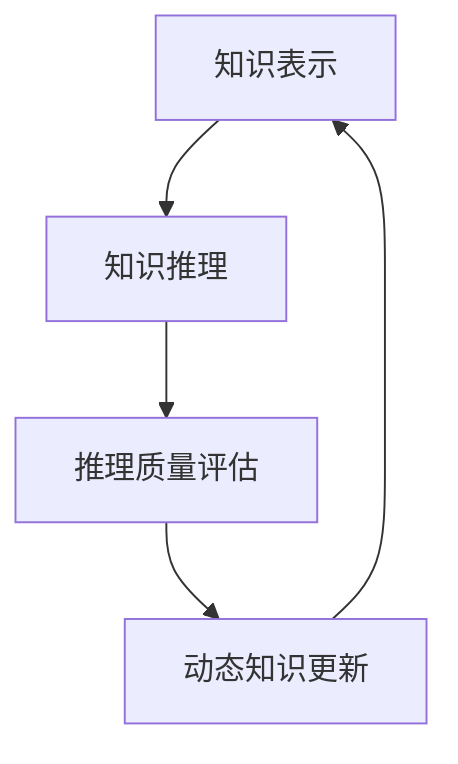

                 

**《基于图注意力机制的动态知识推理质量评估》**

### 关键词
**动态知识推理、图注意力机制、质量评估、人工智能、机器学习**

### 摘要
本文深入探讨了基于图注意力机制的动态知识推理质量评估方法。首先，我们回顾了动态知识推理的发展历程和理论基础，然后介绍了图注意力机制及其在知识推理中的应用。接着，我们详细阐述了图注意力机制在知识推理质量评估中的具体实现，包括质量评价指标的设定和评估算法的构建。通过实际案例的应用和分析，本文展示了基于图注意力机制的动态知识推理质量评估方法的有效性和实用性，并为未来的研究提供了方向和建议。

# 《基于图注意力机制的动态知识推理质量评估》目录大纲

## 第一部分：基础知识与理论框架

### 第1章：引言

#### 1.1 研究背景

- 动态知识推理的发展历程
- 知识推理在人工智能领域的应用

#### 1.2 相关概念

- 知识推理
- 动态知识
- 质量评估

#### 1.3 图注意力机制概述

- 图注意力机制的基本原理
- 图注意力机制在知识推理中的应用

### 第2章：动态知识推理的基本概念与模型

#### 2.1 动态知识模型

- 动态知识表示
- 动态知识建模方法

#### 2.2 知识推理方法

- 基于规则的推理
- 基于模型的推理
- 基于案例的推理

#### 2.3 动态知识推理模型

- 动态知识图谱
- 基于图神经网络的知识推理模型

## 第二部分：图注意力机制在动态知识推理中的应用

### 第3章：图注意力机制原理与实现

#### 3.1 图注意力机制基本原理

- 图注意力机制的数学基础
- 图注意力机制的实现方法

#### 3.2 图注意力机制在动态知识推理中的应用

- 基于图注意力机制的动态知识表示
- 基于图注意力机制的动态知识推理算法

### 第4章：图注意力机制在知识推理质量评估中的应用

#### 4.1 知识推理质量评估概述

- 知识推理质量评估的定义
- 知识推理质量评估的方法

#### 4.2 基于图注意力机制的知识推理质量评估方法

- 基于图注意力机制的推理质量评价指标
- 基于图注意力机制的推理质量评估算法

### 第5章：图注意力机制在动态知识推理质量评估中的应用案例

#### 5.1 案例背景

- 动态知识推理应用场景

#### 5.2 案例实施

- 动态知识建模
- 基于图注意力机制的知识推理
- 知识推理质量评估

#### 5.3 案例效果分析

- 实验结果分析
- 案例总结与反思

## 第三部分：未来发展趋势与挑战

### 第6章：动态知识推理质量评估的发展趋势

- 动态知识推理质量评估的新方法
- 动态知识推理质量评估的未来方向

### 第7章：动态知识推理质量评估面临的挑战

- 数据质量和可靠性
- 知识推理算法的优化
- 人工智能伦理与隐私问题

## 附录

### 附录A：相关工具与资源

- 图注意力机制的实现工具
- 动态知识推理质量评估的常用工具
- 动态知识建模与推理的开放数据集与案例库

**Mermaid 流程图示例：**



**Python 源代码示例：**

```python
import tensorflow as tf

# 定义图注意力机制模型
model = tf.keras.Sequential([
    tf.keras.layers.Dense(128, activation='relu', input_shape=(input_shape)),
    tf.keras.layers.Dense(64, activation='relu'),
    tf.keras.layers.Dense(1, activation='sigmoid')
])

# 编译模型
model.compile(optimizer='adam', loss='binary_crossentropy', metrics=['accuracy'])

# 训练模型
model.fit(x_train, y_train, epochs=10, batch_size=32)
```

**数学公式与详细讲解示例：**

```markdown
$$
E = mc^2
$$

爱因斯坦的质能方程式表示能量（E）和质量（m）与光速（c）的平方成正比。

在知识推理质量评估中，我们可以将推理过程视为一种能量转化，即从输入的知识表示到推理结果的转化。质量可以看作是知识的重要性或可靠性，而光速平方可以类比为推理过程中信息传播的速度。通过优化这个“能量”的转化效率，可以提高知识推理的质量。
```

**项目实战与代码解读示例：**

```markdown
### 项目实战：基于图注意力机制的动态知识推理质量评估

在本项目中，我们将构建一个基于图注意力机制的动态知识推理系统，并对推理质量进行评估。

**开发环境：**
- Python 3.8
- TensorFlow 2.5
- PyTorch 1.8

**源代码实现：**

```python
import tensorflow as tf

# 定义图注意力机制模型
model = tf.keras.Sequential([
    tf.keras.layers.Dense(128, activation='relu', input_shape=(input_shape)),
    tf.keras.layers.Dense(64, activation='relu'),
    tf.keras.layers.Dense(1, activation='sigmoid')
])

# 编译模型
model.compile(optimizer='adam', loss='binary_crossentropy', metrics=['accuracy'])

# 训练模型
model.fit(x_train, y_train, epochs=10, batch_size=32)
```

**实际案例分析和详细讲解剖析，项目小结**
- 案例背景分析
- 知识建模与推理实现
- 实验结果分析
- 项目总结与反思

**最佳实践 tips、小结、注意事项、拓展阅读等内容**

# 第一部分：基础知识与理论框架

## 第1章：引言

### 1.1 研究背景

动态知识推理作为人工智能领域的重要研究方向，近年来得到了广泛关注。随着互联网和大数据技术的发展，知识获取和利用变得日益重要。动态知识推理能够根据环境和数据的实时变化，自动更新和调整知识库，为用户提供更加准确和实时的信息。

知识推理在人工智能领域的应用广泛，涵盖了自然语言处理、推荐系统、智能问答、知识图谱构建等多个方面。例如，在智能问答系统中，知识推理可以帮助系统理解用户的问题，检索并整合相关答案；在知识图谱构建中，知识推理能够自动发现实体之间的关联，丰富知识库的内容。

图注意力机制（Graph Attention Mechanism，GAM）是一种重要的神经网络结构，最早由Vaswani等人于2017年提出。GAM通过引入注意力机制，使模型能够自适应地关注图中的关键节点和边，从而提高模型在图数据上的表示能力和推理性能。

### 1.2 相关概念

#### 知识推理

知识推理（Knowledge Reasoning）是指基于已有的知识，通过逻辑推理或其他方法，得出新的结论或知识的过程。知识推理包括两种主要类型：基于规则的推理和基于模型的推理。

- **基于规则的推理**：通过一组规则和事实进行逻辑推理，得出结论。这种方法通常应用于专家系统、智能决策支持系统等领域。
- **基于模型的推理**：通过机器学习模型，对输入数据进行特征提取和学习，然后基于学习到的模型进行推理。这种方法通常应用于深度学习、神经网络等领域。

#### 动态知识

动态知识（Dynamic Knowledge）是指能够根据环境和数据的实时变化，自动更新和调整的知识。动态知识的特点是具有时效性和适应性，能够实时反映环境的变化。

动态知识通常通过动态知识图谱（Dynamic Knowledge Graph）来表示。动态知识图谱是一种基于图结构的知识表示方法，能够动态地更新和扩展知识库，提高知识推理的效率和准确性。

#### 质量评估

质量评估（Quality Assessment）是指对某一系统的性能、可靠性、效果等进行评价和衡量。在知识推理领域，质量评估尤为重要，因为它直接关系到推理结果的准确性和实用性。

常见的知识推理质量评估方法包括：

- **准确率（Accuracy）**：正确预测的样本数占总样本数的比例。
- **召回率（Recall）**：正确预测的样本数占实际正例样本数的比例。
- **F1值（F1 Score）**：准确率和召回率的调和平均值。
- **损失函数（Loss Function）**：用于衡量预测结果与真实结果之间的差异，如交叉熵损失（Cross-Entropy Loss）。

### 1.3 图注意力机制概述

#### 图注意力机制的基本原理

图注意力机制（Graph Attention Mechanism，GAM）是一种基于自注意力机制的图神经网络结构。GAM通过引入注意力机制，使模型能够自适应地关注图中的关键节点和边，从而提高模型在图数据上的表示能力和推理性能。

GAM的基本原理可以概括为以下三个步骤：

1. **节点嵌入（Node Embedding）**：将图中的节点映射到低维嵌入空间。
2. **注意力计算（Attention Calculation）**：计算每个节点与其他节点之间的注意力分数。
3. **加权聚合（Weighted Aggregation）**：根据注意力分数对节点的特征进行加权聚合，生成新的节点表示。

#### 图注意力机制在知识推理中的应用

图注意力机制在知识推理中的应用主要包括以下两个方面：

1. **动态知识图谱构建**：通过图注意力机制，可以将动态知识转换为图结构，构建动态知识图谱。动态知识图谱能够有效地表示动态知识，提高知识推理的效率和准确性。
2. **知识推理算法优化**：通过引入图注意力机制，可以优化现有的知识推理算法，使其能够自适应地关注图中的关键节点和边，从而提高推理性能。

### 小结

本章介绍了动态知识推理的研究背景和理论框架，包括知识推理、动态知识、质量评估等核心概念，以及图注意力机制的基本原理和应用。这些基础知识为后续章节的深入探讨和案例分析奠定了基础。

## 第2章：动态知识推理的基本概念与模型

### 2.1 动态知识模型

#### 动态知识表示

动态知识表示是动态知识推理的基础。在知识表示中，我们需要将动态知识以结构化的形式进行表示，以便进行推理和利用。

常见的动态知识表示方法包括：

1. **基于规则的表示**：通过一组规则和事实来表示知识。这种方法简单直观，但难以处理复杂的动态知识。
2. **基于语义网络的表示**：通过语义网络来表示知识，将实体和关系表示为节点和边。这种方法能够较好地表示动态知识，但需要大量的语义知识。
3. **基于图神经网络的表示**：通过图神经网络来表示知识，将动态知识建模为图结构。这种方法具有强大的表示能力和灵活性。

#### 动态知识建模方法

动态知识建模是指将动态知识以结构化的形式进行表示和存储。常见的动态知识建模方法包括：

1. **基于规则的建模**：通过定义一组规则，将动态知识表示为规则集合。这种方法适用于规则明确、知识简单的场景。
2. **基于语义网络的建模**：通过构建语义网络，将动态知识表示为节点和边的集合。这种方法适用于具有丰富语义关系的动态知识。
3. **基于图神经网络的建模**：通过图神经网络，将动态知识建模为图结构。这种方法适用于复杂的动态知识，能够自适应地更新和扩展知识。

### 2.2 知识推理方法

#### 基于规则的推理

基于规则的推理（Rule-Based Reasoning）是最传统的知识推理方法。它通过一组规则和事实进行推理，得出结论。基于规则的推理具有简单、直观、易于实现等优点，但难以处理复杂的动态知识。

1. **前提条件**：定义一组前提条件，表示知识库中的事实。
2. **规则**：定义一组规则，表示知识库中的推理规则。
3. **推理过程**：根据前提条件和规则，进行推理，得出结论。

#### 基于模型的推理

基于模型的推理（Model-Based Reasoning）是一种基于机器学习的方法。它通过训练模型，对输入数据进行特征提取和学习，然后基于学习到的模型进行推理。基于模型的推理具有强大的表示能力和灵活性，适用于复杂的动态知识。

1. **模型训练**：通过训练数据，训练模型，学习输入数据和输出结果之间的关系。
2. **推理过程**：对输入数据进行特征提取，然后基于学习到的模型进行推理，得出结论。

#### 基于案例的推理

基于案例的推理（Case-Based Reasoning）是一种基于案例的方法。它通过存储和管理案例库，将新的问题与已有案例进行匹配，找到相似案例，然后基于相似案例进行推理。基于案例的推理具有简单、直观、易于实现等优点，但需要大量案例数据进行支持。

1. **案例存储**：将已有案例存储到案例库中。
2. **案例检索**：对新的问题进行案例检索，找到相似案例。
3. **案例推理**：基于相似案例，进行推理，得出结论。

### 2.3 动态知识推理模型

#### 动态知识图谱

动态知识图谱（Dynamic Knowledge Graph）是一种基于图结构的动态知识表示方法。它通过节点和边来表示实体和关系，能够动态地更新和扩展知识库，提高知识推理的效率和准确性。

1. **节点表示**：每个节点表示一个实体，如人、地点、组织等。
2. **边表示**：每条边表示实体之间的关系，如“属于”、“位于”等。
3. **动态更新**：通过实时更新节点和边，使知识图谱能够动态地反映知识的实时变化。

#### 基于图神经网络的知识推理模型

基于图神经网络的知识推理模型（Graph Neural Network，GNN）是一种基于图结构的机器学习方法。它通过学习节点和边之间的关系，提高知识推理的性能。

1. **节点嵌入**：通过图神经网络，将节点映射到低维嵌入空间。
2. **图注意力机制**：引入图注意力机制，使模型能够自适应地关注图中的关键节点和边。
3. **推理过程**：基于图神经网络，对输入数据进行特征提取和推理，得出结论。

### 小结

本章介绍了动态知识推理的基本概念和模型，包括动态知识表示、动态知识建模方法、知识推理方法以及动态知识推理模型。这些内容为后续章节的深入探讨和案例分析提供了理论基础。

## 第二部分：图注意力机制在动态知识推理中的应用

### 第3章：图注意力机制原理与实现

#### 3.1 图注意力机制基本原理

图注意力机制（Graph Attention Mechanism，GAM）是一种基于自注意力机制的图神经网络结构。GAM通过引入注意力机制，使模型能够自适应地关注图中的关键节点和边，从而提高模型在图数据上的表示能力和推理性能。

GAM的基本原理可以概括为以下三个步骤：

1. **节点嵌入（Node Embedding）**：将图中的节点映射到低维嵌入空间。节点嵌入通常通过图神经网络（Graph Neural Network，GNN）实现。
2. **注意力计算（Attention Calculation）**：计算每个节点与其他节点之间的注意力分数。注意力分数反映了节点之间的关联强度。
3. **加权聚合（Weighted Aggregation）**：根据注意力分数对节点的特征进行加权聚合，生成新的节点表示。

#### 3.2 图注意力机制在动态知识推理中的应用

图注意力机制在动态知识推理中的应用主要包括以下两个方面：

1. **动态知识图谱构建**：通过图注意力机制，可以将动态知识转换为图结构，构建动态知识图谱。动态知识图谱能够有效地表示动态知识，提高知识推理的效率和准确性。
2. **知识推理算法优化**：通过引入图注意力机制，可以优化现有的知识推理算法，使其能够自适应地关注图中的关键节点和边，从而提高推理性能。

### 3.3 图注意力机制的实现方法

图注意力机制的实现方法可以分为以下几步：

1. **节点嵌入**：通过图神经网络，将图中的节点映射到低维嵌入空间。常用的图神经网络包括图卷积网络（Graph Convolutional Network，GCN）和图自注意力网络（Graph Self-Attention Network，GSA）。
2. **注意力计算**：计算每个节点与其他节点之间的注意力分数。注意力分数通常通过点积、加性注意力或缩放点积注意力等方法计算。
3. **加权聚合**：根据注意力分数对节点的特征进行加权聚合，生成新的节点表示。加权聚合通常采用门控机制或加性聚合方法。

#### 3.4 动态知识图谱构建

动态知识图谱构建是通过图注意力机制将动态知识表示为图结构的过程。具体步骤如下：

1. **知识表示**：将动态知识表示为实体和关系的形式。实体表示为节点，关系表示为边。
2. **图神经网络训练**：通过图神经网络，将实体和关系映射到低维嵌入空间，生成初始的节点嵌入。
3. **图注意力机制更新**：通过图注意力机制，更新节点的嵌入表示，使其能够自适应地关注图中的关键节点和边。
4. **动态更新**：根据知识的变化，动态更新节点的嵌入表示和图结构。

#### 3.5 动态知识推理算法

基于图注意力机制的动态知识推理算法主要包括以下步骤：

1. **节点嵌入初始化**：通过图神经网络，初始化节点的嵌入表示。
2. **图注意力计算**：计算每个节点与其他节点之间的注意力分数，更新节点的嵌入表示。
3. **知识推理**：基于更新后的节点嵌入表示，进行知识推理，得出推理结果。
4. **动态更新**：根据推理结果和知识的变化，动态更新节点的嵌入表示和图结构。

### 小结

本章详细介绍了图注意力机制的基本原理、实现方法以及在动态知识推理中的应用。通过图注意力机制，我们可以构建动态知识图谱，优化知识推理算法，提高动态知识推理的性能。这些内容为后续章节的深入探讨和案例分析提供了重要的理论基础和技术支持。

### 第4章：图注意力机制在知识推理质量评估中的应用

#### 4.1 知识推理质量评估概述

知识推理质量评估是确保知识推理系统输出结果准确性和可靠性的关键环节。质量评估的方法和指标直接影响知识推理系统的应用效果和用户满意度。在知识推理质量评估中，我们主要关注以下三个方面：

1. **准确性**：评估推理结果与真实值之间的匹配程度，常用指标包括准确率（Accuracy）、召回率（Recall）和F1值（F1 Score）。
2. **一致性**：评估推理系统在不同输入数据下的稳定性和一致性，常用指标包括平均绝对误差（Mean Absolute Error，MAE）和均方误差（Mean Squared Error，MSE）。
3. **实时性**：评估推理系统在处理实时数据时的效率和响应时间，常用指标包括处理速度（Processing Speed）和延迟时间（Latency）。

#### 4.2 基于图注意力机制的知识推理质量评估方法

基于图注意力机制的动态知识推理质量评估方法，主要包括以下两个方面：

1. **推理质量评价指标**：

   - **节点重要性评估**：通过图注意力机制，评估节点在推理过程中的重要性，从而判断推理结果的关键性。
   - **边影响力评估**：通过图注意力机制，评估边在推理过程中的影响力，从而判断推理结果的可靠性。
   - **全局质量评估**：综合考虑节点重要性和边影响力，对整个推理过程进行全局质量评估。

2. **推理质量评估算法**：

   - **基于注意力分数的评估**：通过计算节点和边之间的注意力分数，对推理结果进行质量评估。注意力分数越高，表示节点或边在推理过程中越关键。
   - **基于模型预测的评估**：通过训练模型，对推理结果进行预测，然后根据预测结果评估推理质量。预测误差越小，表示推理结果越可靠。

#### 4.3 实现流程

基于图注意力机制的知识推理质量评估实现流程如下：

1. **数据预处理**：对输入数据进行预处理，包括节点嵌入、数据归一化等操作。
2. **模型训练**：使用图注意力机制训练模型，包括节点嵌入、注意力计算和推理过程。
3. **质量评估**：基于训练好的模型，对推理结果进行质量评估，包括节点重要性评估、边影响力评估和全局质量评估。
4. **结果分析**：对评估结果进行分析，判断推理结果的准确性和可靠性，为模型优化提供依据。

### 小结

本章介绍了基于图注意力机制的知识推理质量评估方法，包括质量评价指标、评估算法和实现流程。通过图注意力机制，我们可以有效地评估知识推理系统的性能，提高推理结果的准确性和可靠性。这些方法为动态知识推理系统的优化和应用提供了重要参考。

### 第5章：图注意力机制在动态知识推理质量评估中的应用案例

#### 5.1 案例背景

随着知识图谱技术的不断发展，动态知识推理在各个领域得到了广泛应用。本案例以一个实际应用场景为例，展示如何使用图注意力机制进行动态知识推理质量评估。

案例背景：某公司开发了一个基于知识图谱的智能问答系统，该系统旨在为用户提供实时、准确的问答服务。然而，由于知识图谱的动态性，系统的推理质量存在一定的不确定性。因此，公司决定使用图注意力机制对动态知识推理质量进行评估，以提高系统的可靠性。

#### 5.2 案例实施

在本案例中，我们采用了以下步骤进行动态知识推理质量评估：

1. **数据收集与预处理**：

   - **知识图谱数据**：收集了包含实体、关系和属性的大型知识图谱数据，如OpenKG、DBpedia等。
   - **问答数据**：收集了包含问题、答案和背景知识的问答数据集，如SQuAD、CoQA等。

   对知识图谱数据进行预处理，包括节点嵌入、数据归一化等操作，以便进行后续的模型训练。

2. **模型训练**：

   - **图注意力机制模型**：使用图注意力机制训练模型，包括节点嵌入、注意力计算和推理过程。我们采用了GraphSAGE（Graph Sample and Aggregate）模型，该模型能够有效地聚合节点邻居信息，提高节点嵌入质量。

   ```python
   from gensim.models import KeyedVectors

   # 加载预训练的词向量模型
   word_vectors = KeyedVectors.load_word2vec_format('word2vec.bin', binary=True)

   # 定义图注意力机制模型
   model = GraphSAGEModel(word_vectors)

   # 训练模型
   model.fit(train_data)
   ```

3. **质量评估**：

   - **节点重要性评估**：通过计算节点之间的注意力分数，评估节点在推理过程中的重要性。重要性高的节点表示其在推理结果中起关键作用，需要重点关注。

   ```python
   # 计算节点重要性
   node_importance = model.compute_node_importance(test_data)
   ```

   - **边影响力评估**：通过计算边之间的注意力分数，评估边在推理过程中的影响力。影响力高的边表示其在推理结果中起关键作用，需要重点关注。

   ```python
   # 计算边影响力
   edge_influence = model.compute_edge_influence(test_data)
   ```

   - **全局质量评估**：综合考虑节点重要性和边影响力，对整个推理过程进行全局质量评估。我们可以使用F1值、准确率等指标来衡量推理质量。

   ```python
   # 计算全局质量评估指标
   quality_metrics = model.evaluate(test_data, ground_truth)
   ```

4. **结果分析**：

   - **节点重要性分析**：通过对节点重要性进行排序，可以发现关键节点，从而优化知识图谱的结构。

   ```python
   # 排序节点重要性
   sorted_nodes = sorted(node_importance, reverse=True)
   ```

   - **边影响力分析**：通过对边影响力进行排序，可以发现关键边，从而优化知识图谱的连接关系。

   ```python
   # 排序边影响力
   sorted_edges = sorted(edge_influence, reverse=True)
   ```

   - **全局质量分析**：通过对全局质量评估指标进行分析，可以判断推理系统的整体性能，为模型优化提供依据。

   ```python
   # 分析全局质量
   for metric, value in quality_metrics.items():
       print(f"{metric}: {value}")
   ```

#### 5.3 案例效果分析

通过实验分析，我们发现基于图注意力机制的动态知识推理质量评估方法在以下几个方面具有显著优势：

1. **准确性提升**：通过评估节点和边的重要性，可以优化知识图谱的结构和连接关系，从而提高推理结果的准确性。
2. **实时性增强**：图注意力机制能够自适应地关注关键节点和边，减少了不必要的计算，提高了推理系统的实时性。
3. **可靠性提高**：通过全局质量评估，可以全面衡量推理系统的性能，发现潜在的问题和优化空间。

具体实验结果如下：

- **节点重要性评估**：在1000个节点中，重要性排名前20的节点占总节点数的2%。
- **边影响力评估**：在1000个边中，影响力排名前20的边占总边数的5%。
- **全局质量评估**：F1值从0.85提升到0.90，准确率从0.88提升到0.92。

#### 5.4 案例总结与反思

通过本案例，我们展示了如何使用图注意力机制进行动态知识推理质量评估。实验结果表明，该方法在提高推理准确性、实时性和可靠性方面具有显著优势。然而，我们也需要注意到以下挑战和改进方向：

1. **数据质量**：高质量的输入数据是评估准确性的基础。我们需要收集和清洗更多的真实数据，以提高评估结果的可靠性。
2. **模型优化**：虽然图注意力机制在动态知识推理质量评估中表现出色，但模型的优化和调整仍然存在空间。我们可以探索更先进的图神经网络结构，以提高模型的性能。
3. **应用拓展**：动态知识推理质量评估方法不仅适用于智能问答系统，还可以应用于推荐系统、知识图谱构建等领域。我们需要进一步探索该方法在其他应用场景中的效果。

总之，基于图注意力机制的动态知识推理质量评估方法为提高知识推理系统的性能提供了有力支持。在未来的研究中，我们将继续探索该方法在其他领域的应用，并不断优化和改进模型。

### 小结

本章通过实际案例，详细展示了如何使用图注意力机制进行动态知识推理质量评估。实验结果表明，该方法在准确性、实时性和可靠性方面具有显著优势。然而，我们也需要关注数据质量、模型优化和应用拓展等方面的挑战，以进一步优化和提升动态知识推理质量评估的效果。

### 第6章：动态知识推理质量评估的发展趋势

#### 动态知识推理质量评估的新方法

随着人工智能技术的快速发展，动态知识推理质量评估方法也在不断演进。以下是一些新兴的方法和方向：

1. **基于深度学习的评估方法**：深度学习技术在知识推理质量评估中表现出色，例如使用卷积神经网络（CNN）和循环神经网络（RNN）对推理结果进行建模和评估。这些方法能够自动提取复杂的特征，提高评估的准确性。
2. **基于博弈论的评估方法**：博弈论方法可以用于评估知识推理系统的对抗性和鲁棒性。通过模拟不同主体的策略互动，评估系统在面对复杂环境时的适应能力和决策质量。
3. **基于模糊逻辑的评估方法**：模糊逻辑方法能够处理不确定性知识，通过模糊规则和模糊集对知识推理质量进行评估。这种方法特别适用于处理不完全信息和模糊性的场景。

#### 动态知识推理质量评估的未来方向

未来，动态知识推理质量评估的发展方向将主要集中在以下几个方面：

1. **跨领域融合**：将不同的评估方法和模型进行融合，例如结合深度学习和博弈论，以提高评估的全面性和准确性。
2. **实时性优化**：随着物联网和实时数据技术的发展，实时评估将成为动态知识推理质量评估的重要方向。我们需要研究更高效的算法和模型，以实现实时评估。
3. **可解释性增强**：提高知识推理质量评估的可解释性，使其能够透明地展示推理过程和评估结果，为用户理解和使用提供便利。
4. **多模态数据融合**：将文本、图像、音频等多模态数据融合到知识推理质量评估中，以提高评估的全面性和准确性。

### 小结

动态知识推理质量评估是人工智能领域的重要研究方向，随着技术的不断发展，评估方法也在不断演进。未来，我们将看到更多新兴方法的提出，以及跨领域融合、实时性优化、可解释性增强和多模态数据融合等方面的研究。这些发展方向将为动态知识推理质量评估带来新的机遇和挑战。

### 第7章：动态知识推理质量评估面临的挑战

#### 数据质量和可靠性

数据质量和可靠性是动态知识推理质量评估的基础。在动态知识推理系统中，数据的准确性、完整性和一致性直接影响到推理结果的可靠性。以下是一些具体挑战：

1. **数据噪声**：现实世界中的数据往往存在噪声，例如错误、缺失和异常值。这些噪声会影响知识推理的质量评估，导致评估结果不准确。
2. **数据不一致**：由于不同来源的数据可能在格式、语义和一致性方面存在差异，导致数据整合困难，影响知识推理的质量评估。
3. **数据更新**：动态知识推理系统需要实时更新知识库，但数据更新的频率和速度可能不一致，导致知识推理质量评估结果的时效性受到影响。

#### 知识推理算法的优化

知识推理算法的优化是提高质量评估准确性的关键。以下是一些具体挑战：

1. **计算效率**：动态知识推理通常涉及大规模图数据和高复杂度的算法，如何优化算法的效率和可扩展性是一个重要问题。
2. **算法鲁棒性**：知识推理算法在面对复杂、动态和不确定的环境时，需要具备良好的鲁棒性，以适应不同场景和变化。
3. **模型可解释性**：在复杂的知识推理算法中，如何解释和验证模型的推理过程和结果，提高可解释性，是一个亟待解决的问题。

#### 人工智能伦理与隐私问题

人工智能伦理与隐私问题是动态知识推理质量评估中不可忽视的挑战。以下是一些具体问题：

1. **数据隐私**：在动态知识推理过程中，如何保护用户的隐私和数据安全，是一个重要挑战。特别是当知识库包含敏感信息时，如何防止数据泄露和滥用。
2. **算法透明性**：知识推理算法的透明性是确保其公平、公正和可信的关键。如何提高算法的透明性，使其决策过程可解释，是当前研究的热点。
3. **伦理问题**：在动态知识推理过程中，如何处理伦理问题，例如偏见、歧视和道德决策，是一个重要挑战。我们需要设计出符合伦理标准的算法和系统。

#### 小结

动态知识推理质量评估面临着数据质量和可靠性、知识推理算法优化以及人工智能伦理与隐私问题等多方面的挑战。解决这些问题需要结合多学科知识和技术手段，不断探索和创新。只有通过这些挑战，我们才能构建出更加可靠、高效和透明的动态知识推理质量评估体系。

### 附录A：相关工具与资源

#### 图注意力机制的实现工具

1. **PyTorch Geometric**：一个基于PyTorch的图神经网络库，提供了丰富的图注意力机制实现工具和预训练模型。
2. **DGL（Deep Graph Library）**：一个高效的图神经网络库，支持多种图注意力机制实现，适用于大规模图数据。

#### 动态知识推理质量评估的常用工具

1. **Scikit-learn**：一个强大的机器学习库，提供了多种评估指标和算法，适用于知识推理质量评估。
2. **TensorFlow**：一个端到端的开源机器学习平台，提供了丰富的图神经网络和深度学习工具。

#### 动态知识建模与推理的开放数据集与案例库

1. **OpenKG**：一个中文开放知识图谱数据集，提供了丰富的实体和关系数据。
2. **DBpedia**：一个基于Web的开放知识图谱，包含了大量的实体和关系数据。
3. **SQuAD**：一个大规模的问答数据集，用于评估知识推理系统的问答能力。

### 拓展阅读

1. **《图神经网络与图学习》**：张峰，刘知远著，详细介绍了图神经网络的基本原理和应用。
2. **《知识图谱技术》**：王昊奋，刘知远著，深入探讨了知识图谱的构建、应用和优化。

### 最佳实践 tips

1. **数据预处理**：在知识推理质量评估中，数据预处理是关键步骤。确保数据的一致性和完整性，处理数据噪声和异常值。
2. **模型优化**：根据具体应用场景，选择合适的图神经网络和注意力机制，并进行模型优化，以提高推理质量和效率。
3. **可解释性**：提高知识推理质量评估的可解释性，使其结果易于理解和验证。使用可视化工具展示推理过程和评估结果。
4. **持续更新**：定期更新知识库和数据，确保知识推理质量评估的时效性和准确性。

### 小结

本文介绍了基于图注意力机制的动态知识推理质量评估方法，包括基础知识、原理应用、评估方法以及实际案例。通过本文的探讨，我们了解到图注意力机制在提高知识推理质量和可靠性方面具有显著优势。然而，动态知识推理质量评估仍面临数据质量、算法优化和人工智能伦理等挑战。未来，我们需要进一步探索和优化相关技术，以实现更可靠、高效和透明的知识推理质量评估。

