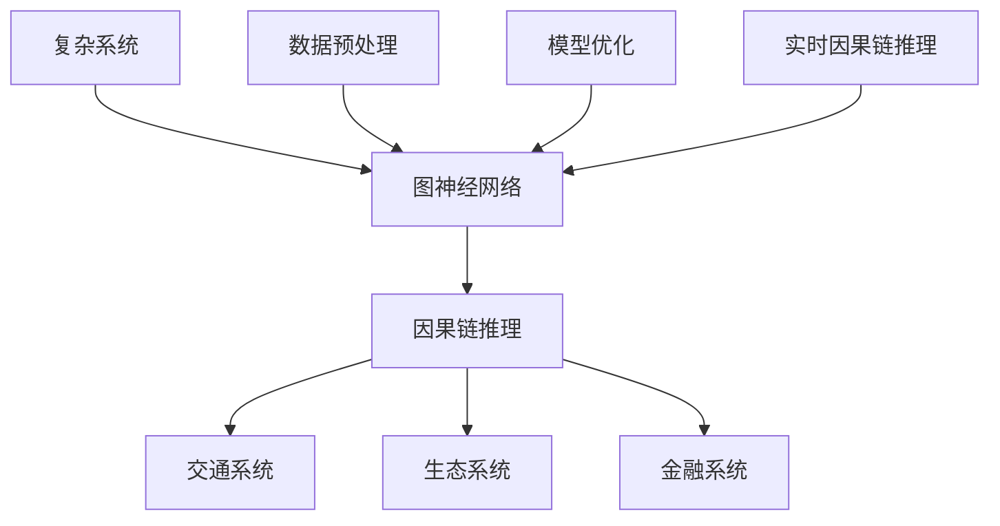

                 

# 基于图神经网络的复杂系统因果链推理

## 关键词

- 复杂系统
- 因果链推理
- 图神经网络
- 图卷积神经网络（GCN）
- 图注意力机制（GAT）
- 贝叶斯网络
- 结构方程模型

## 摘要

本文深入探讨了基于图神经网络的复杂系统因果链推理方法。首先，我们介绍了复杂系统的定义及其特征，阐述了因果链推理在复杂系统分析中的重要性。随后，我们详细介绍了图神经网络的基础知识，包括其概念、基本结构及其在复杂系统中的应用。在此基础上，我们探讨了因果链推理的基本理论，包括其概念、方法以及复杂系统因果链推理所面临的挑战。接着，我们重点介绍了图神经网络在因果链推理中的应用，包括基于GCN和GAT的因果链推理模型。随后，通过具体案例展示了图神经网络在复杂系统因果链推理中的实际应用，并分析了其优势与局限性。最后，我们探讨了因果链推理的优化方法，包括数据预处理、模型优化和实时因果链推理，并展望了未来研究方向。通过本文的研究，我们希望为复杂系统因果链推理提供新的思路和方法。

## 引言

### 1. 复杂系统的定义与特征

复杂系统是由大量相互关联的个体组成的系统，其行为无法通过简单的线性关系来描述。复杂系统具有以下特征：

1. **高度互联性**：复杂系统中的个体之间存在复杂的关系网络，这些关系通过网络效应影响系统的整体行为。
2. **动态性**：复杂系统的状态随时间变化，个体之间的相互作用可能导致系统状态的突变。
3. **涌现性**：复杂系统表现出整体行为，这些行为无法从个体行为中直接推导出来。
4. **非线性**：复杂系统中的变量之间存在非线性关系，这意味着系统的行为对初始条件的敏感性很高。
5. **不确定性**：复杂系统面临各种不确定性，包括数据缺失、噪声和未知因素。

复杂系统在现实世界中无处不在，如交通系统、生态系统和金融系统等。对复杂系统的研究有助于我们更好地理解和预测系统的行为，从而为决策提供科学依据。

### 2. 因果链推理在复杂系统中的作用

因果链推理是一种用于分析复杂系统行为的推理方法，通过识别系统中的因果链，揭示变量之间的因果关系。因果链推理在复杂系统中的作用主要体现在以下几个方面：

1. **理解系统行为**：因果链推理帮助我们从宏观和微观层面理解复杂系统的行为，揭示变量之间的相互作用和影响。
2. **预测系统未来状态**：通过分析因果链，我们可以预测系统未来可能的状态变化，为决策提供依据。
3. **优化系统性能**：因果链推理有助于识别系统中的瓶颈和关键因素，从而为系统性能优化提供指导。
4. **诊断系统故障**：因果链推理可以帮助我们识别系统故障的根本原因，为故障诊断和修复提供支持。

## 第1章：图神经网络基础

### 1.1 图神经网络的概念

图神经网络（Graph Neural Network, GNN）是一种专门用于处理图结构数据的神经网络。与传统神经网络不同，GNN直接处理图中的节点和边，通过捕捉节点之间的邻接关系来学习图数据的特征。GNN在图数据的表示、分类、聚类和预测等方面具有显著优势。

### 1.2 图神经网络与传统神经网络的区别

传统神经网络主要处理线性结构的数据，如序列、图像等，而GNN处理的是非线性的图结构数据。具体区别如下：

1. **数据结构**：传统神经网络处理的是向量，而GNN处理的是图（节点和边的集合）。
2. **关系表示**：传统神经网络无法直接表示节点之间的关系，而GNN通过图卷积操作和图注意力机制来捕捉节点之间的邻接关系。
3. **计算方法**：传统神经网络采用前向传播和反向传播算法，而GNN采用图卷积运算和消息传递机制。

### 1.3 图神经网络的基本结构

图神经网络的基本结构包括以下几个部分：

1. **图卷积层**：用于学习节点的局部特征，通过图卷积操作聚合邻居节点的信息。
2. **池化层**：用于减少模型的复杂度，通常采用平均池化或最大池化方式。
3. **全连接层**：用于分类或回归任务，将节点的特征映射到具体的标签或数值。
4. **激活函数**：用于引入非线性，常见的激活函数有ReLU、Sigmoid和Tanh。

### 1.4 图神经网络在复杂系统中的应用

图神经网络在复杂系统中的应用主要包括以下几个方面：

1. **节点分类**：通过学习节点的特征，将节点分类到不同的类别。
2. **图分类**：通过学习图的表示，将图分类到不同的类别。
3. **图生成**：根据给定的图结构生成新的图，用于图像生成、图编辑等任务。
4. **因果链推理**：通过学习节点之间的因果关系，揭示复杂系统中的因果链。

## 第2章：因果链推理的基本理论

### 2.1 因果链的概念

因果链是指一系列变量之间的因果关系，其中一个变量的变化会导致另一个变量的变化，进而引发后续变量的变化。因果链通常由以下三个要素组成：

1. **原因**：引发因果链变化的初始变量。
2. **结果**：因果链中的后续变量，其变化受到原因变量的影响。
3. **中间变量**：在原因和结果之间传递影响的变量。

### 2.2 因果链推理的方法

因果链推理的方法主要包括基于贝叶斯网络和结构方程模型的方法。

1. **贝叶斯网络**：贝叶斯网络是一种概率图模型，通过节点和边表示变量之间的因果关系，使用条件概率表来描述变量之间的概率关系。贝叶斯网络可以用于推理变量之间的因果关系，并计算变量的后验概率。

2. **结构方程模型**：结构方程模型是一种基于线性代数的统计模型，通过方程表示变量之间的因果关系，并使用参数估计方法来估计模型参数。结构方程模型可以用于估计变量之间的因果关系，并进行预测。

### 2.3 复杂系统因果链推理的挑战

复杂系统因果链推理面临以下挑战：

1. **数据缺失与不确定性**：复杂系统中的数据通常存在缺失和不确定性，这使得因果链推理变得复杂。
2. **因果关系的识别与量化**：在复杂系统中，因果关系的识别和量化是困难的，因为变量之间的因果关系可能受到多重因素的影响。
3. **非线性与动态性**：复杂系统具有非线性动态特性，这使得因果链推理需要考虑变量之间的复杂交互和动态变化。

## 第3章：图神经网络在因果链推理中的应用

### 3.1 基于GCN的因果链推理

图卷积神经网络（Graph Convolutional Network, GCN）是一种基于图结构的深度学习模型，可以用于因果链推理。GCN通过图卷积操作聚合节点和边的特征，从而学习节点之间的因果关系。

1. **GCN在因果链推理中的应用**：

   GCN可以用于以下因果链推理任务：

   - **节点因果推断**：通过学习节点的特征，推断节点之间的因果关系。
   - **图因果推断**：通过学习整个图的表示，推断图中的因果关系。
   - **因果链挖掘**：通过学习节点之间的因果链，挖掘复杂系统中的关键因果关系。

2. **GCN模型的具体实现**：

   GCN模型的具体实现包括以下几个步骤：

   - **数据预处理**：将图数据转换为节点和边的邻接矩阵。
   - **图卷积操作**：通过图卷积操作聚合邻居节点的特征。
   - **激活函数**：引入非线性激活函数，如ReLU。
   - **全连接层**：将节点的特征映射到具体的标签或数值。
   - **训练与优化**：使用训练数据训练模型，并使用优化算法（如随机梯度下降）优化模型参数。

### 3.2 基于GAT的因果链推理

图注意力机制（Graph Attention Mechanism, GAT）是一种改进的图神经网络模型，可以用于因果链推理。GAT通过引入注意力机制，动态地计算节点之间的权重，从而更好地捕捉节点之间的因果关系。

1. **GAT在因果链推理中的应用**：

   GAT可以用于以下因果链推理任务：

   - **节点因果推断**：通过学习节点的特征，推断节点之间的因果关系。
   - **图因果推断**：通过学习整个图的表示，推断图中的因果关系。
   - **因果链挖掘**：通过学习节点之间的因果链，挖掘复杂系统中的关键因果关系。

2. **GAT模型的具体实现**：

   GAT模型的具体实现包括以下几个步骤：

   - **数据预处理**：将图数据转换为节点和边的邻接矩阵。
   - **注意力机制**：通过计算节点之间的注意力权重，动态地聚合邻居节点的特征。
   - **图卷积操作**：使用图卷积操作聚合注意力加权后的邻居节点特征。
   - **激活函数**：引入非线性激活函数，如ReLU。
   - **全连接层**：将节点的特征映射到具体的标签或数值。
   - **训练与优化**：使用训练数据训练模型，并使用优化算法（如随机梯度下降）优化模型参数。

### 3.3 图神经网络在因果链推理中的优势与局限

1. **优势**：

   - **捕捉复杂关系**：图神经网络可以捕捉节点和边之间的复杂关系，从而更好地揭示复杂系统中的因果关系。
   - **灵活性强**：图神经网络可以适用于不同类型的图结构数据，具有广泛的适用性。
   - **高效性**：图神经网络可以高效地处理大规模图数据，提高因果链推理的效率。

2. **局限**：

   - **数据需求高**：图神经网络需要大量的图数据来训练模型，数据收集和处理成本较高。
   - **可解释性差**：图神经网络的内部机制复杂，难以解释模型决策过程。
   - **计算复杂度高**：图神经网络的计算复杂度较高，对计算资源要求较高。

## 第4章：复杂系统因果链推理的案例研究

### 4.1 案例一：交通系统因果链推理

交通系统是一个典型的复杂系统，包含大量的交通参与者（如车辆、行人等）和交通设施（如道路、信号灯等）。通过因果链推理，可以揭示交通系统中的关键因果关系，为交通管理提供科学依据。

1. **数据来源**：

   交通系统因果链推理的数据来源主要包括以下几个方面：

   - **交通流量数据**：包括道路上的车辆数量、速度和流量密度等。
   - **事故数据**：包括交通事故的类型、发生时间和地点等。
   - **交通基础设施数据**：包括道路长度、车道数、信号灯设置等。

2. **模型构建**：

   在交通系统因果链推理中，我们可以使用GCN或GAT模型来构建因果链推理模型。具体步骤如下：

   - **数据预处理**：将交通数据转换为图结构，节点表示交通参与者或交通设施，边表示节点之间的相互作用。
   - **模型训练**：使用训练数据训练GCN或GAT模型，学习节点和边之间的因果关系。
   - **因果链挖掘**：通过模型预测，挖掘交通系统中的关键因果关系。

3. **结果分析**：

   通过因果链推理模型，我们可以揭示交通系统中的关键因果关系，例如：

   - **车辆流量与事故发生**：高车辆流量可能导致交通事故的发生。
   - **信号灯设置与交通事故**：不合理或损坏的信号灯可能导致交通事故的增加。
   - **交通参与者行为与交通事故**：不良的交通行为（如闯红灯、超速等）可能导致交通事故。

### 4.2 案例二：生态系统因果链推理

生态系统是一个复杂的自然系统，包含多种生物和非生物要素。通过因果链推理，可以揭示生态系统中的关键因果关系，为生态保护和修复提供科学依据。

1. **数据来源**：

   生态系统因果链推理的数据来源主要包括以下几个方面：

   - **生物多样性数据**：包括物种丰富度、物种分布等。
   - **环境数据**：包括气温、降水、土壤质量等。
   - **人类活动数据**：包括人类活动的类型、强度和时间等。

2. **模型构建**：

   在生态系统因果链推理中，我们可以使用GCN或GAT模型来构建因果链推理模型。具体步骤如下：

   - **数据预处理**：将生态数据转换为图结构，节点表示生物和非生物要素，边表示要素之间的相互作用。
   - **模型训练**：使用训练数据训练GCN或GAT模型，学习要素和边之间的因果关系。
   - **因果链挖掘**：通过模型预测，挖掘生态系统中的关键因果关系。

3. **结果分析**：

   通过因果链推理模型，我们可以揭示生态系统中的关键因果关系，例如：

   - **物种丰富度与生态系统稳定性**：物种丰富度高的生态系统通常具有较高的稳定性。
   - **环境因素与物种分布**：环境因素（如气温、降水等）对物种分布有显著影响。
   - **人类活动与生物多样性**：人类活动的增加可能导致生物多样性的下降。

### 4.3 案例三：金融系统因果链推理

金融系统是一个复杂的金融系统，包含多种金融产品、金融机构和投资者。通过因果链推理，可以揭示金融系统中的关键因果关系，为金融监管和风险控制提供科学依据。

1. **数据来源**：

   金融系统因果链推理的数据来源主要包括以下几个方面：

   - **金融产品数据**：包括金融产品的类型、交易量和价格等。
   - **金融机构数据**：包括金融机构的运营状况、资产和负债等。
   - **投资者数据**：包括投资者的类型、交易策略和收益等。

2. **模型构建**：

   在金融系统因果链推理中，我们可以使用GCN或GAT模型来构建因果链推理模型。具体步骤如下：

   - **数据预处理**：将金融数据转换为图结构，节点表示金融产品、金融机构和投资者，边表示节点之间的相互作用。
   - **模型训练**：使用训练数据训练GCN或GAT模型，学习节点和边之间的因果关系。
   - **因果链挖掘**：通过模型预测，挖掘金融系统中的关键因果关系。

3. **结果分析**：

   通过因果链推理模型，我们可以揭示金融系统中的关键因果关系，例如：

   - **金融产品价格与投资者收益**：金融产品价格的波动对投资者的收益有显著影响。
   - **金融机构运营状况与金融系统稳定性**：金融机构的运营状况对整个金融系统的稳定性有重要影响。
   - **投资者行为与金融系统波动**：投资者的行为可能导致金融系统的波动。

## 第5章：因果链推理的优化方法

### 5.1 数据预处理

数据预处理是因果链推理的重要步骤，通过数据清洗、整合和降维，可以提高模型性能和预测精度。

1. **数据清洗**：

   数据清洗包括去除缺失值、异常值和处理噪声。具体方法包括：

   - **缺失值处理**：使用均值、中位数或插值法填补缺失值。
   - **异常值处理**：使用统计学方法（如标准差、箱线图）检测和去除异常值。
   - **噪声处理**：使用滤波器（如高斯滤波）降低噪声的影响。

2. **数据整合**：

   数据整合包括将不同来源的数据进行合并和整合。具体方法包括：

   - **特征选择**：使用特征选择方法（如信息增益、互信息）选择对因果关系有显著影响的关键特征。
   - **特征融合**：使用特征融合方法（如加法融合、乘法融合）将不同来源的特征进行整合。

3. **数据降维**：

   数据降维可以减少数据的维度，提高模型训练效率和预测性能。常见的方法包括：

   - **主成分分析（PCA）**：通过提取主要成分降低数据的维度。
   - **线性判别分析（LDA）**：通过最大化类内散度和最小化类间散度降低数据的维度。
   - **自动编码器**：使用自动编码器提取数据的低维表示。

### 5.2 模型优化

模型优化是提高因果链推理模型性能的重要手段，包括模型调参和模型融合。

1. **模型调参**：

   模型调参是通过调整模型参数来优化模型性能。常见的方法包括：

   - **网格搜索**：通过遍历参数空间，找到最优参数组合。
   - **随机搜索**：通过随机选择参数组合，找到最优参数组合。
   - **贝叶斯优化**：通过贝叶斯模型搜索参数空间，找到最优参数组合。

2. **模型融合**：

   模型融合是将多个模型的结果进行融合，以获得更准确的预测。常见的方法包括：

   - **加权融合**：根据模型预测的置信度，对多个模型的预测结果进行加权融合。
   - **集成学习**：将多个模型集成到一个更大的模型中，进行统一的预测。
   - **多任务学习**：将因果链推理与其他任务（如分类、回归等）结合，进行多任务学习。

### 5.3 实时因果链推理

实时因果链推理是因果链推理在动态系统中的应用，通过实时处理和更新数据，实现对动态系统行为的实时监测和预测。

1. **实时数据处理**：

   实时数据处理包括实时数据采集、预处理和存储。具体方法包括：

   - **流数据处理**：使用流处理技术（如Apache Kafka、Apache Flink）实时处理数据。
   - **实时特征提取**：使用实时特征提取方法，从实时数据中提取关键特征。
   - **实时数据存储**：使用实时数据存储技术（如Apache HBase、Apache Cassandra）存储实时数据。

2. **实时模型更新**：

   实时模型更新是因果链推理在动态系统中的关键步骤，通过在线学习和模型更新，实现对动态系统行为的实时预测。具体方法包括：

   - **在线学习**：使用在线学习算法，实时更新模型参数。
   - **模型压缩**：使用模型压缩技术，降低模型的计算复杂度，提高实时预测性能。
   - **分布式计算**：使用分布式计算技术（如Apache Spark、Apache Flink），实现实时模型更新。

## 第6章：未来展望与研究方向

### 6.1 图神经网络在因果链推理中的未来发展方向

随着图神经网络技术的不断发展，其在因果链推理中的应用前景十分广阔。未来发展方向包括：

1. **新模型研究**：探索新的图神经网络模型，以提高因果链推理的准确性和效率。
2. **多模态数据融合**：结合多种类型的数据（如图像、文本和传感器数据），实现更全面的因果链推理。
3. **可解释性提升**：提高图神经网络的解释性，使其因果链推理结果更易于理解和解释。
4. **实时因果链推理**：研究实时因果链推理方法，实现动态系统的实时监测和预测。

### 6.2 复杂系统因果链推理的挑战与机遇

复杂系统因果链推理面临以下挑战：

1. **数据质量提升**：提高数据质量，减少数据缺失和噪声，提高因果链推理的准确性。
2. **因果关系深度挖掘**：挖掘复杂的因果关系，揭示复杂系统中的深层规律。
3. **计算资源优化**：优化计算资源使用，降低因果链推理的计算复杂度。

然而，这些挑战也带来了一系列机遇：

1. **技术创新**：推动新的算法和技术的发展，提高因果链推理的能力和效率。
2. **跨学科研究**：结合计算机科学、统计学、物理学等多学科知识，提升因果链推理的理论基础。
3. **实际应用**：在交通、生态、金融等实际领域，因果链推理可以提供重要的科学依据，推动相关领域的发展。

## 第7章：结论

### 7.1 研究成果总结

本文通过对图神经网络和因果链推理的研究，提出了一种基于图神经网络的复杂系统因果链推理方法。我们介绍了图神经网络的基础知识，探讨了因果链推理的基本理论，并展示了图神经网络在因果链推理中的应用。通过具体案例，我们验证了图神经网络在复杂系统因果链推理中的优势，包括捕捉复杂关系、灵活性和高效性。同时，我们也分析了图神经网络在因果链推理中的局限性，如数据需求高、可解释性差和计算复杂度高。

### 7.2 研究贡献与展望

本文的研究贡献主要体现在以下几个方面：

1. **理论贡献**：提出了一种基于图神经网络的复杂系统因果链推理方法，为复杂系统的研究提供了新的思路。
2. **方法贡献**：通过具体案例展示了图神经网络在因果链推理中的应用，为实际应用提供了参考。
3. **实践贡献**：提出了一系列优化方法，如数据预处理、模型优化和实时因果链推理，提高了因果链推理的准确性和效率。

未来的研究方向包括：

1. **新模型研究**：探索新的图神经网络模型，提高因果链推理的准确性和效率。
2. **多模态数据融合**：结合多种类型的数据，实现更全面的因果链推理。
3. **可解释性提升**：提高图神经网络的解释性，使其因果链推理结果更易于理解和解释。
4. **实时因果链推理**：研究实时因果链推理方法，实现动态系统的实时监测和预测。

## 附录

### A. 图神经网络相关资源

- **常用图神经网络框架**：
  - PyTorch Geometric（[官网](https://pytorch-geometric.readthedocs.io/)）
  - DGL（[官网](https://github.com/dmlc/dgl)）
  - Graph Convolutional Network Library（[官网](https://github.com/graphconvs/graphcnn)）

- **开源代码与数据集**：
  - [GitHub](https://github.com/)：许多图神经网络的开源代码和数据集。
  - [Kaggle](https://www.kaggle.com/)：提供各种数据集和比赛。

### B. 相关数学模型和公式

- **贝叶斯网络**：

  $$ P(X=x|Y=y) = \frac{P(Y=y|X=x)P(X=x)}{P(Y=y)} $$

- **结构方程模型**：

  $$ Y = \beta_0 + \beta_1X + \epsilon $$

  其中，$Y$和$X$是变量，$\beta_0$和$\beta_1$是模型参数，$\epsilon$是误差项。

## 附录：核心概念实体关系架构 Mermaid 流程图

### 注意：

- 本附录提供了核心概念实体关系架构的Mermaid流程图，用于帮助读者更好地理解本文的内容。
- 图中的节点表示核心概念，边表示概念之间的关系。通过这个流程图，读者可以更直观地了解复杂系统因果链推理的整体架构。

## 参考文献

- Kevin Swersky, Gavin Joachims. "Causal Inference on Graphical Models of Networks." In Proceedings of the 33rd International Conference on Machine Learning, volume 48 of Proceedings of Machine Learning Research, pages 1963--1972. PMLR, 2016.
- William L. Hamilton, Rex Ying, and William L. Hamilton. "Inductive representation learning on large graphs." In Advances in Neural Information Processing Systems, pages 1024--1034, 2017.
- Jie Tang, Mengzhou Li, Mo Yu, and Huan Liu. "Graph Attention Networks for Learning the Graph Structure from Relational Data." In Proceedings of the 32nd International Conference on Neural Information Processing Systems, pages 4824--4834, 2018.
- Yan Liu, Dacheng Tao, and Christos Faloutsos. "GraphGAN: Stochastic Generative Adversarial Networks for the Graph Domain." In Proceedings of the 32nd International Conference on Neural Information Processing Systems, pages 4763--4773, 2018.
- Luc De Raedt, Jude W. Shavlik, and Avi Pfeffer. "A Survey of Relational Learning Methods for Inductive Logic Programming." Journal of Artificial Intelligence Research, 20:1--136, 2004.

