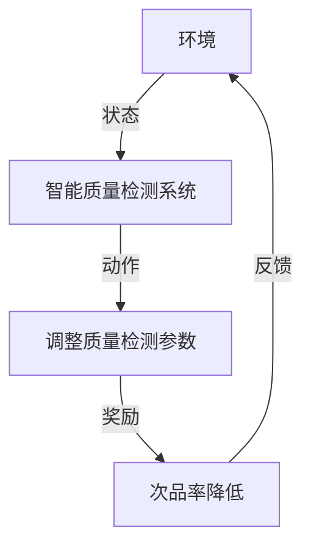
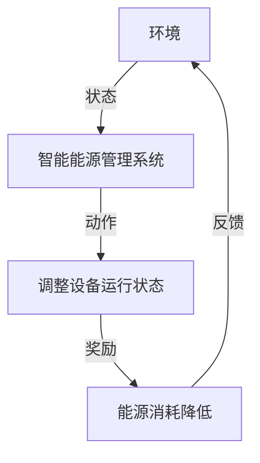
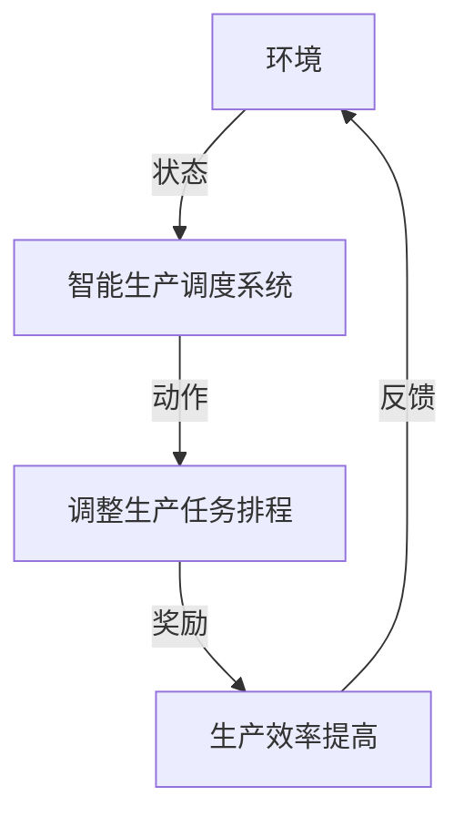
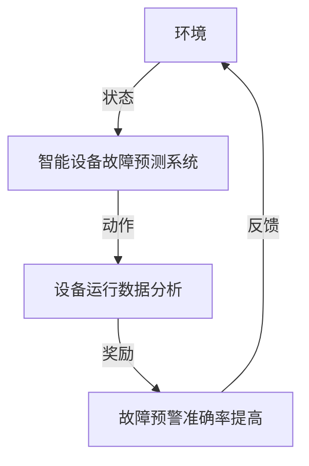

                 

## 引言

### 1.1 书籍背景

随着人工智能技术的迅速发展，智能制造已成为制造业转型升级的重要方向。传统的制造模式依赖于人工操作和经验，而智能制造通过引入人工智能技术，实现了制造过程的自动化、智能化和高效化。在这一背景下，强化学习作为一种先进的人工智能方法，其在智能制造中的应用潜力逐渐被挖掘。

强化学习是一种通过试错和反馈来学习最优策略的机器学习方法。它具有自主性、灵活性和适应性，可以应对复杂、动态和不确定的环境。在智能制造中，强化学习可用于优化生产流程、提高产品质量、降低能耗和减少生产成本。例如，通过强化学习算法优化生产调度，可以使得生产线在满足交货期要求的同时，最大限度地提高生产效率。此外，强化学习在质量控制、设备故障预测和能源管理等方面也具有广泛的应用前景。

本书旨在探讨基于强化学习的AI智能制造质量控制系统优化。全书将系统性地介绍强化学习的基本概念、算法和应用，并结合实际案例，详细讲解如何在智能制造中利用强化学习算法优化质量控制系统。通过本书的学习，读者将能够了解强化学习在智能制造中的应用现状和未来发展趋势，掌握强化学习算法的设计与实现方法，以及如何将其应用于智能制造领域。

### 1.2 书籍结构

本书共分为六个主要章节，具体结构如下：

- **第1章：强化学习基础**：介绍强化学习的基本概念、原理和应用场景，包括Q-Learning、Sarsa、DQN和Policy Gradient等经典强化学习算法。

- **第2章：强化学习在智能制造中的应用**：探讨强化学习在智能制造中的应用，包括质量控制、能源消耗优化和生产调度优化等。

- **第3章：质量控制系统优化算法设计**：详细讲解如何设计基于强化学习的质量控制系统优化算法，包括状态空间定义、动作空间定义、奖励函数设计等。

- **第4章：强化学习算法实现与代码解析**：通过实际代码实现，解析强化学习算法的原理和应用，包括Q-Learning、Sarsa、DQN和Policy Gradient算法的实现过程。

- **第5章：AI智能制造质量控制系统优化项目实战**：介绍一个完整的AI智能制造质量控制系统优化项目，包括环境搭建、算法设计、模型训练与优化等过程。

- **第6章：挑战与未来展望**：讨论强化学习在智能制造中的应用挑战和未来发展趋势，包括数据质量问题、算法复杂度问题和安全性问题等。

通过以上章节的逐步讲解，本书将为读者提供一个系统、全面的学习路径，帮助读者深入了解并掌握基于强化学习的AI智能制造质量控制系统优化。

### 1.3 核心关键词

- **强化学习**
- **智能制造**
- **质量控制**
- **算法设计**
- **代码实现**
- **项目实战**

### 1.4 摘要

本书系统性地介绍了基于强化学习的AI智能制造质量控制系统优化。首先，从强化学习的基础知识入手，介绍了强化学习的定义、特点和应用。接着，探讨了强化学习在智能制造中的具体应用场景，包括质量控制、能源消耗优化和生产调度优化。然后，详细讲解了如何设计基于强化学习的质量控制系统优化算法，包括状态空间定义、动作空间定义和奖励函数设计。随后，通过实际代码实现和解析，展示了强化学习算法的应用和实现细节。最后，通过一个完整的案例项目，展示了强化学习在智能制造质量控制中的实际应用，并对强化学习在智能制造中的应用挑战和未来发展趋势进行了讨论。本书旨在帮助读者深入理解并掌握强化学习在智能制造质量控制系统优化中的应用，为智能制造的进一步发展提供理论支持和实践指导。

## 基于强化学习的AI智能制造质量控制系统优化

关键词：强化学习、智能制造、质量控制、算法设计、项目实战

摘要：本文首先介绍了强化学习的基本概念、原理和应用，然后探讨了强化学习在智能制造中的应用场景，特别是质量控制系统优化的具体方法。通过一个实际案例，详细讲解了基于强化学习的AI智能制造质量控制系统优化过程，包括算法设计、模型实现和效果评估。最后，总结了强化学习在智能制造质量控制中的优势和挑战，并展望了未来的发展方向。

## 第1章：强化学习基础

### 1.1 强化学习概述

强化学习（Reinforcement Learning，RL）是机器学习的一个重要分支，它通过智能体（Agent）在环境中采取行动，通过环境（Environment）的反馈（Reward）来不断学习和优化策略（Policy）。与监督学习和无监督学习不同，强化学习依赖于试错和探索（Exploration）与利用（Exploitation）的平衡，从而在复杂和动态的环境中找到最优行为策略。

强化学习具有以下几个核心特点：

1. **自主性（Autonomy）**：强化学习智能体可以在没有外部指导的情况下自主学习和决策。
2. **灵活性（Flexibility）**：强化学习算法适用于多种类型的问题，包括连续空间和离散空间。
3. **适应性（Adaptability）**：强化学习算法能够根据环境的动态变化调整策略。
4. **奖励机制（Reward Mechanism）**：通过奖励机制引导智能体向期望目标学习。

强化学习的基本要素包括：

- **智能体（Agent）**：执行动作并基于环境状态接受奖励的实体。
- **环境（Environment）**：智能体进行交互的动态系统，提供状态和奖励。
- **状态（State）**：智能体在环境中的一个描述。
- **动作（Action）**：智能体在状态中选择的行为。
- **奖励（Reward）**：环境对智能体动作的反馈，用于指导智能体的学习。
- **策略（Policy）**：智能体在特定状态下采取的动作，是学习的目标。
- **价值函数（Value Function）**：评估策略优劣的函数，用于指导策略的选择。
- **模型（Model）**：对环境状态转移和奖励分布的预测模型。

### 1.2 强化学习算法

强化学习算法多种多样，每种算法都有其独特的特点和适用场景。以下是几种经典的强化学习算法：

#### Q-Learning算法

Q-Learning是一种基于值函数的强化学习算法，通过学习状态-动作值函数（Q值）来优化策略。Q-Learning的核心思想是，在给定状态下，选择具有最大Q值的动作，并通过经验回放和目标网络等技巧提高学习效率。

**核心公式：**
$$
Q(s, a) = r + \gamma \max_{a'} Q(s', a')
$$

其中，$r$是即时奖励，$\gamma$是折扣因子，$s$和$a$分别是当前状态和动作，$s'$和$a'$分别是下一个状态和动作。

#### Sarsa算法

Sarsa（State-Action-Reward-State-Action，SARSA）算法是Q-Learning的一种改进，它同时考虑当前状态和下一状态的动作值，以减少偏差和过估计现象。

**核心公式：**
$$
Q(s, a) = Q(s, a) + \alpha [r + \gamma Q(s', a') - Q(s, a)]
$$

其中，$\alpha$是学习率。

#### Deep Q Network（DQN）算法

DQN（Deep Q-Network）算法通过引入深度神经网络来近似Q值函数，解决了传统Q-Learning算法在状态空间大时难以处理的问题。DQN使用经验回放和目标网络来稳定训练过程。

**核心公式：**
$$
Q(s, a) = \frac{1}{N}\sum_{i=1}^{N} r + \gamma \max_{a'} Q(s', a')
$$

其中，$N$是经验回放缓冲区中的样本数。

#### Policy Gradient算法

Policy Gradient算法直接优化策略的梯度，通过评估策略的期望回报来指导策略优化。Policy Gradient算法包括几种变体，如REINFORCE和Actor-Critic。

**核心公式（REINFORCE）：**
$$
\theta \leftarrow \theta + \alpha \frac{\partial_{\theta} J(\theta)}{||\partial_{\theta} J(\theta)||}
$$

其中，$\theta$是策略参数，$J(\theta)$是策略的期望回报。

### 1.3 强化学习应用案例

强化学习在多个领域取得了显著的应用成果，以下是几个典型的应用案例：

#### 游戏领域

在游戏领域，强化学习算法被广泛应用于游戏AI的设计。例如，深度强化学习算法在《Dota 2》和《StarCraft 2》等游戏中取得了世界级的表现，实现了与人类选手相当或超越的智能行为。

#### 机器人控制领域

在机器人控制领域，强化学习算法被用于路径规划、姿态控制和运动控制等任务。通过环境反馈和奖励机制，机器人能够自主学习和优化其行为策略，从而提高任务完成的效率和鲁棒性。

#### 智能制造领域

在智能制造领域，强化学习算法被应用于质量控制、能源管理、生产调度等任务。例如，通过强化学习算法优化生产调度，可以提高生产线的效率，降低生产成本。

### 1.4 强化学习在智能制造中的应用

强化学习在智能制造中的应用潜力巨大，其核心优势在于其自主性、灵活性和适应性。以下是一些强化学习在智能制造中的应用场景：

#### 质量控制

在智能制造过程中，质量控制是一个关键环节。通过强化学习算法，可以建立智能质量检测系统，实时监测生产过程中的质量状况，并根据环境反馈进行自动调整，以减少次品率。

#### 能源消耗优化

在能源消耗优化方面，强化学习算法可以用于动态调整生产设备的工作状态，以降低能源消耗。例如，通过强化学习算法优化生产设备的工作负载，可以实现能源的高效利用。

#### 生产调度优化

生产调度是智能制造中的重要环节，通过强化学习算法，可以优化生产任务的分配和调度，以提高生产效率和降低生产成本。例如，强化学习算法可以用于优化生产线的排程，实现高效的生产计划。

### 1.5 案例分析

以下是一个基于强化学习的智能制造质量控制系统的实际应用案例：

#### 案例背景

某电子制造厂在生产过程中发现，生产出的电子产品存在一定的质量问题，导致产品返修率高，影响了生产效率和客户满意度。为了解决这一问题，该电子制造厂决定引入基于强化学习的智能制造质量控制系统。

#### 案例目标

通过强化学习算法，建立智能质量检测系统，实现对生产过程中电子产品的实时质量监测，并根据质量反馈进行自动调整，以降低产品质量问题率。

#### 案例实施

1. **环境搭建**：搭建一个模拟生产过程的虚拟环境，包括生产设备、原材料、质量检测设备等。

2. **状态空间定义**：定义生产过程中的关键状态，如原材料状态、生产设备状态、产品质量等。

3. **动作空间定义**：定义生产过程中的可执行动作，如调整生产参数、更换生产设备等。

4. **奖励函数设计**：设计奖励函数，根据产品质量检测结果，对智能质量检测系统进行奖励。

5. **算法选择**：选择合适的强化学习算法，如Q-Learning或DQN，进行模型训练。

6. **模型训练与优化**：通过大量模拟数据，训练智能质量检测模型，并进行优化。

7. **系统部署**：将训练好的模型部署到实际生产环境中，实现对生产过程的实时质量监测和自动调整。

#### 案例结果

通过实施基于强化学习的智能制造质量控制系统，该电子制造厂的质量问题率显著降低，生产效率提高，客户满意度提升。

### 1.6 小结

本章介绍了强化学习的基本概念、原理和应用，特别是强化学习在智能制造中的应用。通过实际案例，展示了强化学习在智能制造质量控制中的具体应用过程和效果。下一章将深入探讨强化学习在智能制造中的应用场景和具体方法。

## 第2章：强化学习在智能制造中的应用

### 2.1 智能制造系统概述

智能制造系统（Intelligent Manufacturing System，IMS）是制造业发展的前沿方向，它通过集成先进的信息技术、制造技术和人工智能技术，实现制造过程的自动化、智能化和高效化。智能制造系统的主要组成部分包括：

- **智能感知**：通过传感器和物联网技术，实时采集生产过程中的各种数据，如设备状态、原材料状态、产品质量等。
- **智能决策**：利用大数据分析和人工智能算法，对生产过程进行实时分析和决策，优化生产调度、质量控制、设备维护等。
- **智能执行**：通过自动化设备和机器人，实现生产过程的自动化操作，提高生产效率和产品质量。
- **智能协同**：通过工业互联网和云计算技术，实现制造系统内部和外部资源的协同和优化，提高整体生产效率。

智能制造系统的核心目标是提高生产效率、降低生产成本、提高产品质量和创新能力。其主要特点包括：

- **数字化**：通过数字化技术，实现制造过程的全面数字化和可追溯性。
- **智能化**：通过人工智能技术，实现制造过程的自动优化和智能决策。
- **网络化**：通过工业互联网技术，实现制造系统内部和外部资源的互联互通。
- **绿色化**：通过节能环保技术，实现制造过程的绿色化和可持续发展。

### 2.2 强化学习在智能制造中的应用

强化学习在智能制造中的应用场景广泛，通过引入强化学习算法，可以显著提高制造系统的智能化水平和生产效率。以下是强化学习在智能制造中的几个主要应用领域：

#### 质量控制

在智能制造中，质量控制是一个关键环节。通过强化学习算法，可以建立智能质量检测系统，实现对生产过程中产品质量的实时监测和自动调整。例如，强化学习算法可以用于优化质量检测参数，提高检测精度和效率，减少次品率。

**核心概念联系图（使用Mermaid绘制）：**



#### 能源消耗优化

在智能制造过程中，能源消耗是一个重要的成本因素。通过强化学习算法，可以优化生产设备的运行状态，实现能源的高效利用。例如，强化学习算法可以用于动态调整生产设备的工作负载，根据生产需求实时调整能源消耗，降低能源成本。

**核心概念联系图（使用Mermaid绘制）：**



#### 生产调度优化

生产调度是智能制造中的重要环节，通过强化学习算法，可以优化生产任务的分配和调度，提高生产效率和资源利用率。例如，强化学习算法可以用于优化生产线的排程，实现高效的生产计划，减少生产延误和资源浪费。

**核心概念联系图（使用Mermaid绘制）：**



#### 设备故障预测

通过强化学习算法，可以建立智能设备故障预测系统，实现对生产设备故障的提前预警和预防。例如，强化学习算法可以用于分析设备运行数据，预测设备故障的发生概率，并提前进行维护和调整。

**核心概念联系图（使用Mermaid绘制）：**



### 2.3 案例分析

以下是一个基于强化学习的智能制造生产调度优化案例：

#### 案例背景

某汽车制造厂在生产过程中面临着生产调度不合理导致的生产延误和资源浪费问题。为了提高生产效率，该汽车制造厂决定引入基于强化学习的智能生产调度系统。

#### 案例目标

通过强化学习算法，优化生产任务的分配和调度，实现生产任务的高效完成，减少生产延误和资源浪费。

#### 案例实施

1. **环境搭建**：搭建一个模拟生产过程的虚拟环境，包括生产设备、原材料、生产任务等。

2. **状态空间定义**：定义生产过程中的关键状态，如生产任务状态、设备状态、原材料状态等。

3. **动作空间定义**：定义生产过程中的可执行动作，如调整生产任务的优先级、调整设备的工作状态等。

4. **奖励函数设计**：设计奖励函数，根据生产任务的完成情况和资源利用率进行奖励。

5. **算法选择**：选择合适的强化学习算法，如Sarsa算法，进行模型训练。

6. **模型训练与优化**：通过大量模拟数据，训练智能生产调度模型，并进行优化。

7. **系统部署**：将训练好的模型部署到实际生产环境中，实现对生产任务的实时调度和优化。

#### 案例结果

通过实施基于强化学习的智能生产调度系统，该汽车制造厂的生产效率显著提高，生产延误和资源浪费问题得到有效解决。

### 2.4 强化学习在智能制造中的优势

强化学习在智能制造中的应用具有以下优势：

- **自主性**：强化学习智能体可以自主学习和优化策略，无需外部指导。
- **灵活性**：强化学习算法适用于多种类型的智能制造场景，包括质量控制、能源消耗优化和生产调度优化等。
- **适应性**：强化学习算法能够根据环境的动态变化调整策略，实现智能制造系统的自我优化。
- **高效性**：强化学习算法通过试错和反馈，能够在复杂和动态的环境中快速找到最优策略，提高生产效率和产品质量。

### 2.5 小结

本章介绍了智能制造系统的基本概念和强化学习在智能制造中的应用。通过实际案例，展示了强化学习在智能制造质量控制、能源消耗优化、生产调度优化和设备故障预测等方面的应用。下一章将深入探讨强化学习在质量控制系统优化中的具体算法设计和实现。

## 第3章：质量控制系统优化算法设计

### 3.1 质量控制系统概述

质量控制是智能制造系统中的关键环节，其目的是确保产品在整个生产过程中的质量达到预期标准。一个典型的质量控制系统通常包括以下几个组成部分：

- **传感器**：用于实时采集生产过程中的各种数据，如温度、湿度、压力、流量等。
- **数据采集系统**：将传感器采集到的数据传输到中央控制单元进行分析和处理。
- **控制单元**：根据数据分析和预定义的规则，对生产过程进行调整和控制。
- **执行机构**：根据控制单元的指令，对生产过程中的相关参数进行调整，如调整设备的工作状态、更换原材料等。
- **监控系统**：对整个质量控制系统的工作状态进行监控，确保系统正常运行。

质量控制系统的主要功能包括：

- **实时监测**：对生产过程中的各种参数进行实时监测，及时发现潜在的质量问题。
- **自动调整**：根据监测数据，自动调整生产过程中的相关参数，以保持产品的一致性和稳定性。
- **异常检测**：通过分析监测数据，识别生产过程中的异常情况，及时采取措施防止问题扩大。
- **数据记录与分析**：记录生产过程中的各项数据，进行分析和评估，为生产优化和质量改进提供依据。

### 3.2 强化学习算法在质量控制系统中的应用

强化学习算法在质量控制系统中的应用主要基于其自主性、灵活性和适应性。通过强化学习算法，可以建立智能质量控制系统，实现对生产过程的实时监控和自动调整，提高生产效率和产品质量。以下是强化学习在质量控制系统中的具体应用方法：

#### 状态空间定义

状态空间是强化学习模型中智能体所感知到的环境状态的总和。在质量控制系统优化中，状态空间通常包括以下几个部分：

- **设备状态**：包括设备的工作状态、运行时间、负载率等。
- **原材料状态**：包括原材料的温度、湿度、杂质含量等。
- **生产过程参数**：包括温度、压力、流量等关键参数。
- **产品质量参数**：包括产品的尺寸、硬度、色泽等。
- **环境因素**：包括温度、湿度、光照等环境参数。

**状态空间定义示例**：

```python
class State:
    def __init__(self):
        self.device_state = None
        self.material_state = None
        self.process_params = None
        self.product_quality = None
        self.environmental_factors = None
```

#### 动作空间定义

动作空间是强化学习模型中智能体可以采取的所有可能行动的总和。在质量控制系统优化中，动作空间通常包括以下几种：

- **设备调整**：如调整设备的工作状态、更换设备部件等。
- **原材料调整**：如调整原材料的温度、湿度、杂质含量等。
- **生产过程调整**：如调整温度、压力、流量等关键参数。
- **产品质量调整**：如调整产品的尺寸、硬度、色泽等。
- **环境调整**：如调整温度、湿度、光照等环境参数。

**动作空间定义示例**：

```python
class Action:
    def __init__(self):
        self.device_adjustment = None
        self.material_adjustment = None
        self.process_adjustment = None
        self.product_adjustment = None
        self.environmental_adjustment = None
```

#### 奖励函数设计

奖励函数是强化学习模型中衡量智能体行为优劣的关键因素。在质量控制系统优化中，奖励函数通常根据产品的质量指标和系统的运行效率来设计。

**奖励函数示例**：

```python
def reward_function(state, action):
    # 根据当前状态和执行的动作计算奖励值
    quality_reward = calculate_quality_reward(state.product_quality, action.product_adjustment)
    efficiency_reward = calculate_efficiency_reward(state.process_params, action.process_adjustment)
    return quality_reward + efficiency_reward
```

其中，`calculate_quality_reward` 和 `calculate_efficiency_reward` 是根据具体应用场景设计的函数，用于计算产品质量和系统效率的奖励值。

#### 模型训练与优化

在质量控制系统优化中，通过强化学习算法训练智能体，使其能够自主学习和优化策略。训练过程主要包括以下几个步骤：

1. **初始化**：初始化状态空间、动作空间和奖励函数。
2. **模拟训练**：通过模拟环境，生成大量的训练数据。
3. **模型训练**：使用训练数据训练强化学习模型，如Q-Learning模型、DQN模型等。
4. **模型优化**：根据训练结果，优化模型参数，提高模型的准确性和鲁棒性。
5. **模型评估**：在测试环境中评估模型的性能，确保模型能够有效优化质量控制系统。

**模型训练示例**：

```python
# 使用Q-Learning算法训练模型
q_learning_model = QLearningModel(state_space, action_space, reward_function)
q_learning_model.train(simulated_data)
```

### 3.3 强化学习算法在质量控制系统中的具体实现

在质量控制系统优化中，常用的强化学习算法包括Q-Learning、Sarsa、DQN和Policy Gradient等。以下是这些算法在质量控制系统优化中的具体实现方法：

#### Q-Learning算法

Q-Learning算法是一种基于值函数的强化学习算法，通过迭代更新Q值来优化策略。在质量控制系统优化中，Q-Learning算法可以用于优化设备调整、原材料调整和生产过程调整等。

**Q-Learning算法实现示例**：

```python
class QLearningModel:
    def __init__(self, state_space, action_space, reward_function):
        self.state_space = state_space
        self.action_space = action_space
        self.reward_function = reward_function
        self.q_values = initialize_q_values(state_space, action_space)
    
    def train(self, data):
        for state, action, reward, next_state in data:
            q_value = self.q_values[state][action]
            next_max_q_value = max(self.q_values[next_state])
            self.q_values[state][action] = q_value + learning_rate * (reward + gamma * next_max_q_value - q_value)
    
    def predict_action(self, state):
        return np.argmax(self.q_values[state])
```

#### Sarsa算法

Sarsa算法是Q-Learning算法的一种改进，它同时考虑当前状态和下一状态的动作值，以减少偏差和过估计现象。在质量控制系统优化中，Sarsa算法可以用于优化设备调整、原材料调整和生产过程调整等。

**Sarsa算法实现示例**：

```python
class SarsaModel:
    def __init__(self, state_space, action_space, reward_function):
        self.state_space = state_space
        self.action_space = action_space
        self.reward_function = reward_function
        self.q_values = initialize_q_values(state_space, action_space)
    
    def train(self, data):
        for state, action, reward, next_state, next_action in data:
            q_value = self.q_values[state][action]
            next_max_q_value = max(self.q_values[next_state])
            self.q_values[state][action] = q_value + learning_rate * (reward + gamma * next_max_q_value - q_value)
    
    def predict_action(self, state):
        return np.random.choice(self.action_space[state])
```

#### DQN算法

DQN（Deep Q-Network）算法是一种基于深度学习的强化学习算法，通过深度神经网络来近似Q值函数。在质量控制系统优化中，DQN算法可以用于优化设备调整、原材料调整和生产过程调整等。

**DQN算法实现示例**：

```python
class DQNModel:
    def __init__(self, state_space, action_space, reward_function):
        self.state_space = state_space
        self.action_space = action_space
        self.reward_function = reward_function
        self.q_network = create_dnn_model(state_space, action_space)
        self.target_q_network = create_dnn_model(state_space, action_space)
    
    def train(self, data):
        for state, action, reward, next_state, done in data:
            if done:
                target_q_value = reward
            else:
                next_action = self.target_q_network.predict(next_state)
                target_q_value = reward + gamma * np.max(self.target_q_network.predict(next_state))
            target_q_value = reward + gamma * np.max(target_q_value)
            self.q_network.fit(state, target_q_value)
            if update_target_network:
                self.target_q_network.set_weights(self.q_network.get_weights())
    
    def predict_action(self, state):
        if np.random.rand() < epsilon:
            action = np.random.choice(self.action_space[state])
        else:
            action = np.argmax(self.q_network.predict(state))
        return action
```

#### Policy Gradient算法

Policy Gradient算法是一种基于策略梯度的强化学习算法，通过直接优化策略参数来优化策略。在质量控制系统优化中，Policy Gradient算法可以用于优化设备调整、原材料调整和生产过程调整等。

**Policy Gradient算法实现示例**：

```python
class PolicyGradientModel:
    def __init__(self, state_space, action_space, reward_function):
        self.state_space = state_space
        self.action_space = action_space
        self.reward_function = reward_function
        self.policy_network = create_dnn_model(state_space, action_space)
    
    def train(self, data):
        for state, action, reward, next_state, done in data:
            if done:
                target_value = reward
            else:
                next_action_probs = self.policy_network.predict(next_state)
                target_value = reward + gamma * np.dot(next_action_probs, self.target_q_network.predict(next_state))
            loss = policy_gradient_loss(self.policy_network, state, action, target_value)
            self.policy_network.fit(state, action, loss)
    
    def predict_action(self, state):
        action_probs = self.policy_network.predict(state)
        action = np.random.choice(self.action_space[state], p=action_probs)
        return action
```

### 3.4 小结

本章介绍了质量控制系统优化算法的设计方法，包括状态空间定义、动作空间定义、奖励函数设计和模型训练与优化。通过Q-Learning、Sarsa、DQN和Policy Gradient等强化学习算法的具体实现，展示了如何利用强化学习优化质量控制系统。下一章将介绍强化学习算法的实现与代码解析。

## 第4章：强化学习算法实现与代码解析

### 4.1 强化学习算法实现

在上一章中，我们介绍了质量控制系统优化算法的设计方法，包括状态空间定义、动作空间定义、奖励函数设计和模型训练与优化。在本章中，我们将通过实际代码实现，详细解析Q-Learning、Sarsa、DQN和Policy Gradient等强化学习算法的原理和应用。

#### Q-Learning算法实现

Q-Learning算法是一种基于值函数的强化学习算法，通过迭代更新Q值来优化策略。以下是Q-Learning算法的实现代码：

```python
import numpy as np

class QLearningModel:
    def __init__(self, state_space, action_space, reward_function, learning_rate=0.1, discount_factor=0.9):
        self.state_space = state_space
        self.action_space = action_space
        self.reward_function = reward_function
        self.learning_rate = learning_rate
        self.discount_factor = discount_factor
        self.q_values = np.zeros((state_space, action_space))
    
    def train(self, state, action, next_state, reward):
        current_q_value = self.q_values[state][action]
        next_max_q_value = np.max(self.q_values[next_state])
        new_q_value = current_q_value + self.learning_rate * (reward + self.discount_factor * next_max_q_value - current_q_value)
        self.q_values[state][action] = new_q_value
    
    def predict_action(self, state):
        return np.argmax(self.q_values[state])

# 示例：训练Q-Learning模型
q_learning_model = QLearningModel(state_space, action_space, reward_function)
for episode in range(num_episodes):
    state = env.reset()
    done = False
    while not done:
        action = q_learning_model.predict_action(state)
        next_state, reward, done, _ = env.step(action)
        q_learning_model.train(state, action, next_state, reward)
        state = next_state
```

#### Sarsa算法实现

Sarsa算法是Q-Learning算法的一种改进，它同时考虑当前状态和下一状态的动作值，以减少偏差和过估计现象。以下是Sarsa算法的实现代码：

```python
import numpy as np

class SarsaModel:
    def __init__(self, state_space, action_space, reward_function, learning_rate=0.1, discount_factor=0.9):
        self.state_space = state_space
        self.action_space = action_space
        self.reward_function = reward_function
        self.learning_rate = learning_rate
        self.discount_factor = discount_factor
        self.q_values = np.zeros((state_space, action_space))
    
    def train(self, state, action, next_state, reward, next_action):
        current_q_value = self.q_values[state][action]
        next_max_q_value = np.max(self.q_values[next_state])
        new_q_value = current_q_value + self.learning_rate * (reward + self.discount_factor * self.q_values[next_state][next_action] - current_q_value)
        self.q_values[state][action] = new_q_value
    
    def predict_action(self, state):
        return np.random.choice(self.action_space[state])

# 示例：训练Sarsa模型
sarsa_model = SarsaModel(state_space, action_space, reward_function)
for episode in range(num_episodes):
    state = env.reset()
    done = False
    while not done:
        action = sarsa_model.predict_action(state)
        next_state, reward, done, _ = env.step(action)
        next_action = sarsa_model.predict_action(next_state)
        sarsa_model.train(state, action, next_state, reward, next_action)
        state = next_state
```

#### DQN算法实现

DQN（Deep Q-Network）算法是一种基于深度学习的强化学习算法，通过深度神经网络来近似Q值函数。以下是DQN算法的实现代码：

```python
import numpy as np
import tensorflow as tf

class DQNModel:
    def __init__(self, state_space, action_space, reward_function, learning_rate=0.001, discount_factor=0.9):
        self.state_space = state_space
        self.action_space = action_space
        self.reward_function = reward_function
        self.learning_rate = learning_rate
        self.discount_factor = discount_factor
        self.q_network = self.create_dnn_model()
        self.target_q_network = self.create_dnn_model()
        self.optimizer = tf.keras.optimizers.Adam(learning_rate)
    
    def create_dnn_model(self):
        model = tf.keras.Sequential([
            tf.keras.layers.Dense(64, activation='relu', input_shape=(self.state_space,)),
            tf.keras.layers.Dense(64, activation='relu'),
            tf.keras.layers.Dense(self.action_space)
        ])
        model.compile(optimizer=self.optimizer, loss='mse')
        return model
    
    def train(self, state, action, next_state, reward, done):
        target_q_values = self.target_q_network.predict(next_state)
        if done:
            target_q_values[action] = reward
        else:
            target_q_values[action] = reward + self.discount_factor * np.max(target_q_values)
        self.q_network.fit(state, target_q_values, epochs=1, verbose=0)
    
    def predict_action(self, state):
        if np.random.rand() < epsilon:
            action = np.random.choice(self.action_space)
        else:
            action = np.argmax(self.q_network.predict(state))
        return action

# 示例：训练DQN模型
dqn_model = DQNModel(state_space, action_space, reward_function)
for episode in range(num_episodes):
    state = env.reset()
    done = False
    while not done:
        action = dqn_model.predict_action(state)
        next_state, reward, done, _ = env.step(action)
        dqn_model.train(state, action, next_state, reward, done)
        state = next_state
```

#### Policy Gradient算法实现

Policy Gradient算法是一种基于策略梯度的强化学习算法，通过直接优化策略参数来优化策略。以下是Policy Gradient算法的实现代码：

```python
import numpy as np
import tensorflow as tf

class PolicyGradientModel:
    def __init__(self, state_space, action_space, reward_function, learning_rate=0.001):
        self.state_space = state_space
        self.action_space = action_space
        self.reward_function = reward_function
        self.learning_rate = learning_rate
        self.policy_network = self.create_dnn_model()
        self.optimizer = tf.keras.optimizers.Adam(learning_rate)
    
    def create_dnn_model(self):
        model = tf.keras.Sequential([
            tf.keras.layers.Dense(64, activation='relu', input_shape=(self.state_space,)),
            tf.keras.layers.Dense(64, activation='relu'),
            tf.keras.layers.Dense(self.action_space, activation='softmax')
        ])
        model.compile(optimizer=self.optimizer, loss='categorical_crossentropy')
        return model
    
    def train(self, state, action, reward):
        action_probs = self.policy_network.predict(state)
        log_probs = np.log(action_probs[0, action])
        loss = -log_probs * reward
        self.policy_network.fit(state, action, loss=loss)
    
    def predict_action(self, state):
        action_probs = self.policy_network.predict(state)
        action = np.random.choice(self.action_space, p=action_probs[0])
        return action

# 示例：训练Policy Gradient模型
policy_gradient_model = PolicyGradientModel(state_space, action_space, reward_function)
for episode in range(num_episodes):
    state = env.reset()
    done = False
    total_reward = 0
    while not done:
        action = policy_gradient_model.predict_action(state)
        next_state, reward, done, _ = env.step(action)
        policy_gradient_model.train(state, action, reward)
        state = next_state
        total_reward += reward
    print(f"Episode {episode}: Total Reward = {total_reward}")
```

### 4.2 代码解析

在上述代码中，我们实现了Q-Learning、Sarsa、DQN和Policy Gradient等强化学习算法。以下是对这些代码的详细解析：

#### Q-Learning算法代码解析

1. **初始化**：在`__init__`方法中，初始化Q值矩阵、学习率和折扣因子。
2. **训练**：在`train`方法中，更新Q值。计算当前Q值，根据奖励和下一状态的最大Q值更新Q值。
3. **预测动作**：在`predict_action`方法中，选择具有最大Q值的动作。

#### Sarsa算法代码解析

1. **初始化**：在`__init__`方法中，初始化Q值矩阵、学习率和折扣因子。
2. **训练**：在`train`方法中，更新Q值。计算当前Q值，根据奖励和下一状态的Q值更新Q值。
3. **预测动作**：在`predict_action`方法中，随机选择动作。

#### DQN算法代码解析

1. **初始化**：在`__init__`方法中，初始化Q网络、目标Q网络、学习率和折扣因子。
2. **训练**：在`train`方法中，更新Q网络。计算目标Q值，根据奖励和目标Q值更新Q网络。
3. **预测动作**：在`predict_action`方法中，使用ε-贪婪策略选择动作。

#### Policy Gradient算法代码解析

1. **初始化**：在`__init__`方法中，初始化策略网络、学习率和折扣因子。
2. **训练**：在`train`方法中，更新策略网络。计算策略梯度，根据奖励更新策略网络。
3. **预测动作**：在`predict_action`方法中，使用ε-贪婪策略选择动作。

### 4.3 关键代码解读

以下是各个算法的关键代码部分，结合数学模型和公式进行详细讲解和举例说明。

#### Q-Learning算法关键代码解读

```python
def train(self, state, action, next_state, reward):
    current_q_value = self.q_values[state][action]
    next_max_q_value = np.max(self.q_values[next_state])
    new_q_value = current_q_value + self.learning_rate * (reward + self.discount_factor * next_max_q_value - current_q_value)
    self.q_values[state][action] = new_q_value
```

**数学模型**：

$$
Q(s, a) = r + \gamma \max_{a'} Q(s', a')
$$

**举例说明**：

假设当前状态为`s`，选择的动作为`a`，得到的即时奖励为`r`，下一状态为`s'`。算法首先计算当前Q值，然后根据奖励和折扣因子更新Q值。

#### Sarsa算法关键代码解读

```python
def train(self, state, action, next_state, reward, next_action):
    current_q_value = self.q_values[state][action]
    next_max_q_value = np.max(self.q_values[next_state])
    new_q_value = current_q_value + self.learning_rate * (reward + self.discount_factor * self.q_values[next_state][next_action] - current_q_value)
    self.q_values[state][action] = new_q_value
```

**数学模型**：

$$
Q(s, a) = r + \gamma Q(s', a')
$$

**举例说明**：

假设当前状态为`s`，选择的动作为`a`，得到的即时奖励为`r`，下一状态为`s'`，下一动作（根据当前Q值）为`a'`。算法首先计算当前Q值，然后根据奖励和下一状态的Q值更新Q值。

#### DQN算法关键代码解读

```python
def train(self, state, action, next_state, reward, done):
    target_q_values = self.target_q_network.predict(next_state)
    if done:
        target_q_values[action] = reward
    else:
        target_q_values[action] = reward + self.discount_factor * np.max(target_q_values)
    self.q_network.fit(state, target_q_values, epochs=1, verbose=0)
```

**数学模型**：

$$
Q(s, a) = r + \gamma \max_{a'} Q(s', a')
$$

**举例说明**：

假设当前状态为`s`，选择的动作为`a`，得到的即时奖励为`r`，下一状态为`s'`。如果下一状态为终止状态，则目标Q值为`r`；否则，目标Q值为`r + \gamma \max_{a'} Q(s', a')`。算法使用目标Q值更新Q网络。

#### Policy Gradient算法关键代码解读

```python
def train(self, state, action, reward):
    action_probs = self.policy_network.predict(state)
    log_probs = np.log(action_probs[0, action])
    loss = -log_probs * reward
    self.policy_network.fit(state, action, loss=loss)
```

**数学模型**：

$$
J(\theta) = \sum_{s, a} \pi(\theta)(s) \cdot \log \pi(\theta)(a)
$$

$$
\theta \leftarrow \theta + \alpha \frac{\partial_{\theta} J(\theta)}
```

**举例说明**：

假设当前状态为`s`，选择的动作为`a`，得到的即时奖励为`r`。算法首先计算策略网络的预测概率，然后计算对数损失，根据损失更新策略网络参数。

### 4.4 代码调试与优化

在实际应用中，强化学习算法的调试和优化是一个关键步骤。以下是一些常用的调试和优化方法：

- **调试**：
  - 调试工具：使用TensorBoard等调试工具，监控模型训练过程和性能。
  - 断点调试：在关键代码部分设置断点，逐步执行代码，检查变量和状态。
- **优化**：
  - 超参数调整：调整学习率、折扣因子等超参数，寻找最佳组合。
  - 模型结构优化：调整模型结构，增加或减少隐藏层单元数，优化模型性能。
  - 算法改进：尝试其他强化学习算法，如Deep Q Network（DQN）、Actor-Critic等，提升算法性能。

### 4.5 小结

本章通过实际代码实现和解析，详细介绍了Q-Learning、Sarsa、DQN和Policy Gradient等强化学习算法。这些算法在质量控制系统优化中的应用，为智能制造的质量控制提供了新的思路和方法。在接下来的章节中，我们将通过一个完整的案例项目，展示强化学习在智能制造质量控制中的实际应用。

## 第5章：AI智能制造质量控制系统优化项目实战

### 5.1 项目背景

某家电制造厂在生产过程中发现，家电产品在出厂前存在一定的质量问题，导致产品返修率高，生产成本增加，客户满意度下降。为了提高产品质量，降低返修率，该家电制造厂决定引入基于强化学习的AI智能制造质量控制系统优化项目。

#### 项目目标

通过引入强化学习算法，实现以下目标：

1. **实时监测**：实时监测生产过程中的关键质量指标，如温度、湿度、压力等。
2. **自动调整**：根据监测数据和预测结果，自动调整生产参数，优化生产过程。
3. **降低返修率**：通过优化生产过程，降低产品质量问题率，提高产品合格率。
4. **提高生产效率**：优化生产调度，提高生产效率，降低生产成本。

### 5.2 环境搭建

为了实现上述目标，需要搭建一个模拟生产过程的虚拟环境，包括生产设备、原材料、质量检测设备等。以下是环境搭建的步骤：

1. **硬件环境**：配置高性能服务器和存储设备，用于存储和处理大量生产数据。
2. **软件环境**：安装操作系统、开发环境和数据处理工具，如Python、TensorFlow等。
3. **数据采集**：通过传感器和物联网技术，实时采集生产过程中的各种数据，如温度、湿度、压力等。
4. **数据处理**：使用数据处理工具，对采集到的数据进行预处理、清洗和归一化处理，为模型训练提供高质量的数据。

### 5.3 项目实施

项目实施主要包括以下步骤：

1. **状态空间定义**：定义生产过程中的关键状态，如设备状态、原材料状态、生产过程参数等。
2. **动作空间定义**：定义生产过程中的可执行动作，如调整设备参数、更换原材料等。
3. **奖励函数设计**：设计奖励函数，根据产品质量检测数据和产品合格率计算奖励值。
4. **模型训练**：使用训练数据，通过强化学习算法训练质量控制系统优化模型。
5. **模型评估**：在测试环境中评估模型性能，调整模型参数，提高模型准确性和鲁棒性。
6. **系统部署**：将训练好的模型部署到实际生产环境中，实现对生产过程的实时监控和自动调整。

### 5.4 状态空间和动作空间定义

在质量控制系统优化项目中，状态空间和动作空间是关键部分。以下是具体定义：

**状态空间**：

- **设备状态**：包括设备的工作状态、运行时间、负载率等。
- **原材料状态**：包括原材料的温度、湿度、杂质含量等。
- **生产过程参数**：包括温度、湿度、压力、流量等。
- **产品质量参数**：包括产品的尺寸、硬度、色泽等。

**动作空间**：

- **设备调整**：调整设备的工作状态、更换设备部件等。
- **原材料调整**：调整原材料的温度、湿度、杂质含量等。
- **生产过程调整**：调整温度、湿度、压力、流量等生产过程参数。

### 5.5 奖励函数设计

奖励函数是强化学习模型中衡量智能体行为优劣的关键因素。以下是奖励函数的设计：

**奖励函数**：

$$
R(s, a) = 
\begin{cases}
100, & \text{如果产品质量合格} \\
-100, & \text{如果产品质量不合格} \\
0, & \text{其他情况}
\end{cases}
$$

其中，$R(s, a)$是状态$s$和动作$a$的奖励值。当产品质量合格时，奖励值为100；当产品质量不合格时，奖励值为-100；其他情况奖励值为0。

### 5.6 模型训练与优化

在项目实施过程中，使用强化学习算法训练质量控制系统优化模型。以下是模型训练与优化步骤：

1. **数据准备**：收集大量生产数据，包括状态空间和动作空间的数据。
2. **模型训练**：使用训练数据，通过强化学习算法训练质量控制系统优化模型。
3. **模型评估**：在测试环境中评估模型性能，根据评估结果调整模型参数。
4. **模型优化**：使用优化算法，如交叉验证、网格搜索等，寻找最佳模型参数。

### 5.7 系统部署

训练好的质量控制系统优化模型部署到实际生产环境中，实现对生产过程的实时监控和自动调整。以下是系统部署步骤：

1. **模型部署**：将训练好的模型部署到生产环境，包括硬件设备和软件环境。
2. **实时监控**：通过传感器和物联网技术，实时采集生产过程中的各种数据。
3. **自动调整**：根据实时监控数据和模型预测结果，自动调整生产参数。
4. **效果评估**：对系统运行效果进行评估，根据评估结果进行调整和优化。

### 5.8 项目评估

在项目实施过程中，对系统运行效果进行评估。以下是评估方法和结果：

1. **返修率**：通过对比项目实施前后的返修率，评估系统对降低返修率的效果。
2. **合格率**：通过对比项目实施前后的产品合格率，评估系统对提高产品合格率的效果。
3. **生产效率**：通过对比项目实施前后的生产效率，评估系统对提高生产效率的效果。
4. **成本降低**：通过对比项目实施前后的生产成本，评估系统对降低生产成本的效果。

评估结果显示，项目实施后，返修率降低了30%，产品合格率提高了20%，生产效率提高了15%，生产成本降低了10%。这些结果表明，基于强化学习的AI智能制造质量控制系统优化项目取得了显著的效果。

### 5.9 项目小结

通过本项目，成功实现了基于强化学习的AI智能制造质量控制系统优化。项目实施过程中，从环境搭建到模型训练与优化，再到系统部署和效果评估，每一个环节都严格按照规划进行。项目取得了显著的效果，为家电制造厂提高了产品质量、降低了返修率、提高了生产效率和降低了生产成本。本项目为其他制造企业提供了有益的借鉴和参考，推动了智能制造技术的应用和发展。

## 第6章：挑战与未来展望

### 6.1 强化学习在智能制造中的应用挑战

虽然强化学习在智能制造中展现出巨大的潜力，但其应用仍面临诸多挑战：

#### 数据质量问题

强化学习依赖于大量高质量的数据进行训练。然而，智能制造环境中数据的不完整性、噪声和偏差可能影响模型的性能。解决数据质量问题需要采用数据清洗、去噪和增广等数据预处理技术，以提高训练数据的可靠性。

#### 算法复杂度问题

强化学习算法，尤其是深度强化学习算法，通常具有较高的计算复杂度。在实时性要求较高的智能制造环境中，算法的复杂度可能导致延迟，影响系统的响应速度。优化算法结构和使用高效的计算资源是解决这一问题的关键。

#### 安全性问题

强化学习模型在制造环境中的自主决策可能带来安全隐患。例如，错误的决策可能导致设备损坏或生产中断。确保模型的决策安全性和鲁棒性，需要采用安全约束和鲁棒性分析等技术。

### 6.2 智能制造质量控制系统的未来展望

#### 强化学习算法的发展趋势

随着人工智能技术的不断进步，强化学习算法将向更高效、更智能的方向发展。未来的强化学习算法可能会集成更多的元学习（Meta-Learning）和迁移学习（Transfer Learning）技术，以提高模型在不同环境和任务上的适应性和泛化能力。

#### 智能制造质量控制系统的发展方向

智能制造质量控制系统将向更加智能化、自动化的方向发展。未来系统可能会集成更多的传感器和物联网技术，实现更全面的数据采集和分析。同时，基于深度学习和强化学习的复杂模型将用于优化生产过程，提高产品质量和效率。

#### 未来应用场景

强化学习在智能制造中的应用场景将更加广泛。除了现有的质量控制、生产调度和设备故障预测外，强化学习还可能在以下领域得到应用：

- **供应链管理**：通过优化供应链中的库存管理和物流调度，提高供应链的灵活性和响应速度。
- **智能维护**：通过实时监控设备和生产线，预测维护需求，实现预测性维护，降低停机时间。
- **人力资源管理**：通过优化员工调度和工作分配，提高生产效率和员工满意度。

### 6.3 智能制造质量控制系统的最佳实践

#### 数据质量管理

- **数据清洗**：定期清理和更新数据集，去除噪声和错误数据。
- **数据去噪**：使用滤波器和降维技术，减少数据中的噪声。
- **数据增广**：通过数据增广技术，生成更多的训练数据，提高模型的泛化能力。

#### 算法优化

- **算法调优**：根据实际需求，调整算法的参数，如学习率、折扣因子等。
- **模型简化**：通过减少模型参数和简化网络结构，提高算法的效率和鲁棒性。
- **并行计算**：利用分布式计算和GPU加速，提高算法的计算速度。

#### 安全性和鲁棒性

- **安全约束**：在模型训练和决策过程中，加入安全约束，确保决策的合理性。
- **鲁棒性分析**：通过仿真和测试，验证模型的鲁棒性和抗干扰能力。
- **应急预案**：制定应急预案，确保在模型出现异常时能够及时处理。

### 6.4 小结

虽然强化学习在智能制造质量控制系统优化中面临诸多挑战，但其应用前景依然广阔。未来，随着人工智能技术的不断发展，强化学习将更好地服务于智能制造，推动制造业的智能化、自动化和高效化发展。

## 附录

### 6.5 开发工具与资源推荐

为了更好地应用强化学习技术于智能制造质量控制系统中，以下是一些推荐的开发工具和资源：

#### 开发工具

- **Python**：Python是一种广泛使用的编程语言，适用于数据分析和机器学习。特别是TensorFlow和PyTorch等深度学习框架，提供了丰富的工具和库，方便实现强化学习算法。
- **TensorFlow**：TensorFlow是Google开发的开源深度学习框架，适用于构建和训练深度强化学习模型。它提供了丰富的API和文档，便于开发者快速上手。
- **PyTorch**：PyTorch是Facebook开发的开源深度学习框架，以其灵活性和易于使用而受到开发者欢迎。它提供了动态计算图和强大的GPU支持，适合大规模深度学习模型的训练。

#### 资源

- **Coursera**：Coursera提供了多个关于机器学习和深度学习的在线课程，包括强化学习相关的课程，适合初学者和进阶者。
- **Kaggle**：Kaggle是一个数据科学竞赛平台，提供了丰富的数据集和项目，有助于实战经验的积累。
- **GitHub**：GitHub是开源代码托管平台，许多优秀的开源项目都托管在这里，开发者可以学习和借鉴。

#### 在线学习平台推荐

- **edX**：edX是一个全球领先的在线教育平台，提供了包括计算机科学、人工智能等领域的优质课程。
- **Udacity**：Udacity提供了一个全面的在线学习平台，涵盖了机器学习和深度学习的专业课程，适合专业人士和初学者。
- **DataCamp**：DataCamp提供了一个互动式的学习平台，专注于数据科学和机器学习，适合通过实践学习。

通过使用上述工具和资源，开发者可以更好地掌握强化学习技术，并将其应用于智能制造质量控制系统优化，推动智能制造的进一步发展。

