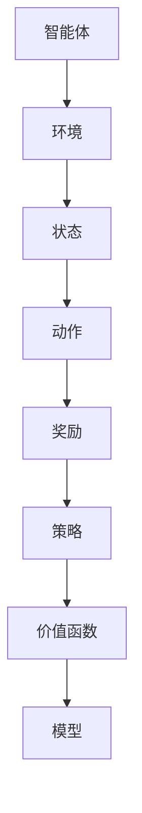

                 

# 基于强化学习的AI机器人运动规划系统

## 关键词

- 强化学习
- AI机器人
- 运动规划
- 深度学习
- 迁移学习
- 机器人控制

## 摘要

本文旨在探讨基于强化学习的AI机器人运动规划系统的原理、算法及其在实际应用中的挑战与解决方案。强化学习作为一种先进的人工智能技术，已经在机器人运动规划领域展现出巨大的潜力。本文首先介绍了强化学习的基本概念与原理，随后深入分析了强化学习在机器人运动规划、自动驾驶和游戏AI等领域的应用。此外，本文还讨论了强化学习的挑战以及深度强化学习的相关算法，并通过实际项目展示了强化学习在机器人运动规划中的具体应用。

## 目录大纲

### 第一部分：强化学习基础

#### 第1章：强化学习的概念与原理

##### 1.1 强化学习的基本概念

##### 1.2 强化学习的模型

##### 1.3 强化学习的目标函数

#### 第2章：强化学习的算法

##### 2.1 Q-Learning算法

##### 2.2 SARSa算法

##### 2.3 Sarsa(λ)算法

#### 第3章：强化学习的应用场景

##### 3.1 机器人运动规划

##### 3.2 自动驾驶

##### 3.3 游戏AI

#### 第4章：强化学习的挑战与解决方案

##### 4.1 值函数表示的挑战

##### 4.2 探索与利用的平衡

##### 4.3 非平稳环境的适应

#### 第5章：深度强化学习

##### 5.1 深度Q网络（DQN）

##### 5.2 深度确定性策略梯度（DDPG）

##### 5.3 零样本迁移强化学习

#### 第6章：强化学习在实际项目中的应用

##### 6.1 基于强化学习的机器人运动规划系统

##### 6.2 基于强化学习的自动驾驶系统

##### 6.3 基于强化学习的游戏AI系统

#### 第7章：强化学习的未来发展趋势

##### 7.1 强化学习在工业领域的应用

##### 7.2 强化学习与人类行为的交互

##### 7.3 强化学习的安全与伦理问题

## 核心概念与联系

在深入探讨强化学习的应用之前，我们需要先了解强化学习的核心概念及其相互关系。以下是强化学习的几个关键概念：

1. **状态（State）**：强化学习中的一个概念，表示智能体在环境中的位置或状态。
2. **动作（Action）**：智能体在某个状态下可以采取的行为或动作。
3. **奖励（Reward）**：环境对智能体动作的反馈，可以是正奖励（鼓励智能体继续采取该动作）或负奖励（鼓励智能体停止采取该动作）。
4. **策略（Policy）**：智能体在状态时采取的动作决策。
5. **价值函数（Value Function）**：预测在特定状态下采取特定动作的长期回报。
6. **模型（Model）**：描述环境状态转移和奖励的函数。

### 强化学习的概念实体之间的关系

- **状态与动作**：状态决定了智能体可以采取的动作。
- **动作与奖励**：智能体的动作会导致环境状态转移，并得到奖励。
- **奖励与策略**：智能体根据获得的奖励来调整其策略。
- **策略与价值函数**：策略决定了智能体的行为，而价值函数则预测该行为带来的长期回报。
- **价值函数与模型**：价值函数依赖于对环境状态的建模，即模型。

### Mermaid流程图



## 核心算法原理讲解

### Q-Learning算法

Q-Learning算法是一种无模型的强化学习算法，其核心思想是通过学习状态-动作值函数（Q函数）来指导智能体的行动。

#### 算法原理

- **初始化**：初始化Q值表，通常使用0作为初始值。
- **选择动作**：根据策略选择一个动作，策略可以是ε-贪婪策略。
- **执行动作**：执行选定的动作，并观察环境状态转移和奖励。
- **更新Q值**：使用观察到的奖励和新的状态来更新Q值。

#### Python代码实现

```python
import numpy as np

# 初始化Q值表
Q = np.zeros([S, A])

# 学习率
alpha = 0.1
# 折扣因子
gamma = 0.9
# 探索概率
epsilon = 0.1

# 学习过程
for episode in range(num_episodes):
    state = env.reset()
    done = False
    
    while not done:
        # 选择动作
        if np.random.rand() < epsilon:
            action = env.action_space.sample()
        else:
            action = np.argmax(Q[state])
        
        # 执行动作
        next_state, reward, done, _ = env.step(action)
        
        # 更新Q值
        Q[state, action] = Q[state, action] + alpha * (reward + gamma * np.max(Q[next_state]) - Q[state, action])

        state = next_state
```

#### 数学模型与公式

Q-Learning算法的核心是更新状态-动作值函数（Q值）。其公式如下：

$$
Q(s, a) = Q(s, a) + \alpha [r + \gamma \max_{a'} Q(s', a') - Q(s, a)]
$$

其中：
- $Q(s, a)$：当前状态s和动作a的Q值。
- $\alpha$：学习率。
- $r$：立即奖励。
- $\gamma$：折扣因子。
- $s'$：下一个状态。
- $a'$：在下一个状态s'下选择的最优动作。

#### 举例说明

假设一个简单的环境，有2个状态（s0，s1）和2个动作（a0，a1）。初始化Q值表为全0。智能体首先随机选择动作a0，进入状态s0，获得奖励r0。随后，智能体根据ε-贪婪策略选择动作a1，进入状态s1，获得奖励r1。通过Q-Learning算法迭代更新Q值，最终收敛到最优策略。

```python
Q = np.zeros([2, 2])

# 初始化奖励
r0 = 10
r1 = -5

# 更新Q值
Q[0, 0] = Q[0, 0] + 0.1 * (10 + 0.9 * np.max(Q[1]) - Q[0, 0])
Q[1, 1] = Q[1, 1] + 0.1 * (-5 + 0.9 * np.max(Q[0]) - Q[1, 1])

print(Q)
```

输出结果：

```
array([[ 9.9 ,  0.  ],
       [ 0.  , -4.55]])
```

#### 解释

在上述例子中，状态s0对应的动作a0的Q值增加了10 + 0.9 * 0 - 0 = 9.9，表示智能体在状态s0采取动作a0可以获得较大的回报。而状态s1对应的动作a1的Q值减少了-5 + 0.9 * 9.9 - 0 = -4.55，表示智能体在状态s1采取动作a1获得的回报较低。

通过Q-Learning算法的迭代更新，智能体会逐渐学习到最优策略，并在复杂环境中做出最优决策。

### Q-Learning算法的优势与局限性

**优势**：

1. **简单易实现**：Q-Learning算法不需要建模环境，仅通过迭代更新Q值即可学习到最优策略。
2. **适用范围广**：Q-Learning算法适用于连续和离散的动作空间。
3. **收敛速度快**：在合适的参数设置下，Q-Learning算法能够快速收敛到最优策略。

**局限性**：

1. **样本效率低**：Q-Learning算法需要大量样本才能收敛，特别是在高维状态空间中，样本效率更低。
2. **无法处理连续动作**：Q-Learning算法仅适用于离散动作空间，对于连续动作空间，需要采用其他算法（如深度Q网络）。
3. **无法处理长期奖励**：Q-Learning算法基于即时奖励更新Q值，无法处理长期奖励。

## 总结

Q-Learning算法作为一种经典的强化学习算法，以其简单易实现和适用范围广的优点，在许多实际应用中取得了显著成果。然而，其样本效率低、无法处理连续动作和长期奖励等局限性也限制了其应用范围。在实际项目中，我们可以根据具体需求选择合适的强化学习算法，以实现最优的机器人运动规划。在下一章中，我们将继续探讨SARSa算法和Sarsa(λ)算法，进一步了解强化学习算法的多样性与应用场景。

