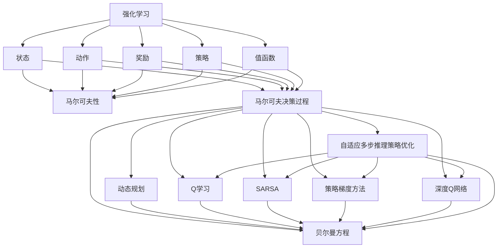

                 

### 强化学习基础

强化学习（Reinforcement Learning，简称RL）是机器学习的一个重要分支，它模仿人类行为的学习过程，通过环境（Environment）与智能体（Agent）之间的交互来逐步优化行为策略。在强化学习中，智能体通过不断试错（Trial and Error）来学习如何在环境中获得最大的累积奖励（Cumulative Reward）。

#### 1.1 强化学习的基本概念

强化学习由以下几个核心概念组成：

- **状态（State）**：智能体在某一时刻所处的环境描述。
- **动作（Action）**：智能体在某一状态下可以执行的操作。
- **奖励（Reward）**：智能体执行某一动作后，从环境获得的即时奖励或惩罚。
- **策略（Policy）**：智能体根据当前状态选择动作的规则，即策略是一个从状态到动作的概率分布。
- **值函数（Value Function）**：用于评估状态或状态-动作对的预期奖励，主要有状态值函数（State Value Function）和动作值函数（Action Value Function）两种。
- **策略评估（Policy Evaluation）**：通过迭代计算策略下的状态值函数。
- **策略迭代（Policy Iteration）**：交替进行策略评估和策略改进，直到找到最优策略。

强化学习与其他机器学习方法的主要区别在于其目标不是预测而是决策，它通过奖励信号来引导智能体不断优化其行为策略。

#### 1.2 强化学习的组成部分

强化学习系统由以下几个部分组成：

- **智能体（Agent）**：执行动作、接收奖励、更新策略的实体。
- **环境（Environment）**：智能体执行动作并接收反馈的情境。
- **状态（State）**：环境的一个可能配置，智能体可以感知和描述的状态。
- **动作（Action）**：智能体能够执行的操作。
- **奖励（Reward）**：对智能体动作的即时评价。
- **策略（Policy）**：智能体决定如何行动的规则。
- **模型（Model）**：对环境的动态和奖励分布的描述。

#### 1.3 强化学习的基本流程

强化学习的基本流程可以概括为以下步骤：

1. **初始化**：智能体和环境的初始化，包括状态、策略和值函数。
2. **选择动作**：智能体根据当前状态和策略选择一个动作。
3. **执行动作**：智能体在环境中执行所选动作。
4. **获得奖励**：环境根据执行的动作给予智能体奖励。
5. **更新策略**：智能体根据新的状态、动作和奖励来更新其策略。
6. **重复循环**：重复上述步骤，直到满足停止条件（如达到预定的步数、找到最优策略等）。

### 1.4 强化学习的应用场景

强化学习在许多领域都有广泛的应用，包括但不限于：

- **游戏**：例如《星际争霸》的人工智能对手，通过强化学习实现自我学习提高游戏水平。
- **机器人控制**：例如自主移动的机器人，通过强化学习实现路径规划和导航。
- **推荐系统**：例如YouTube等平台，通过强化学习推荐用户可能感兴趣的视频。
- **交通管理**：例如交通信号灯控制，通过强化学习优化交通流。
- **金融交易**：例如高频交易算法，通过强化学习寻找最优交易策略。
- **自然语言处理**：例如对话系统，通过强化学习优化对话策略。

强化学习的这些应用展示了其在复杂决策和策略优化问题上的强大能力。然而，强化学习也面临着一些挑战，如探索-利用权衡、高计算成本和收敛性问题等。

通过以上对强化学习基础概念的介绍，我们为后续更深入地探讨强化学习的算法和应用打下了坚实的基础。在接下来的章节中，我们将详细探讨马尔可夫决策过程、Q学习算法以及SARSA算法等核心内容。

### 马尔可夫决策过程

马尔可夫决策过程（Markov Decision Process，MDP）是强化学习中的一个基础概念，它描述了智能体在不确定环境中进行决策的过程。理解MDP对于深入掌握强化学习至关重要。在这一节中，我们将详细探讨MDP的基本概念，包括马尔可夫性、状态转移概率和奖励函数。

#### 2.1 马尔可夫决策过程的基本概念

**马尔可夫性（Markov Property）**：马尔可夫性是指一个系统的未来状态仅取决于当前状态，与过去状态无关。换句话说，给定当前状态，未来的状态和奖励都是独立的。这是MDP的核心假设，使得我们可以通过当前状态来预测未来的状态和奖励，而不需要考虑整个历史轨迹。

**状态（State）**：状态是智能体在环境中的一种描述，可以是离散的也可以是连续的。在MDP中，智能体处于某一状态，并从这个状态选择动作。

**动作（Action）**：动作是智能体可以执行的操作。在MDP中，智能体在每一个状态下可以选择多个动作中的一个。

**奖励（Reward）**：奖励是智能体在执行动作后立即从环境中获得的即时奖励。奖励可以是正的（正面奖励）也可以是负的（负面奖励），用于引导智能体的决策。

**策略（Policy）**：策略是智能体在给定状态下选择动作的规则。策略可以是有指导的（例如，基于规则或模型的选择）或无指导的（例如，基于经验的选择）。

**值函数（Value Function）**：值函数用于评估状态或状态-动作对的预期奖励。主要有两种类型的值函数：状态值函数（State Value Function）和动作值函数（Action Value Function）。

**状态转移概率（Transition Probability）**：状态转移概率描述了智能体在某一状态下执行特定动作后，转移到下一个状态的概率分布。

**奖励函数（Reward Function）**：奖励函数定义了智能体在每个状态执行每个动作后获得的即时奖励。

**模型（Model）**：模型是对环境的动态和奖励分布的描述。在MDP中，模型通常包括状态转移概率矩阵和奖励函数。

#### 2.2 马尔可夫决策过程的应用

MDP广泛应用于各种领域，以下是几个典型的应用例子：

- **机器人路径规划**：智能机器人需要根据环境中的障碍物和目标位置选择最佳路径。
- **库存管理**：企业需要根据市场需求和库存水平选择最优的库存策略。
- **推荐系统**：在线平台根据用户的历史行为和当前状态推荐相关内容。
- **金融交易**：投资者根据市场状态和股票价格变化选择交易策略。

#### 2.3 动态规划与贝尔曼方程

动态规划（Dynamic Programming，DP）是解决MDP的一种有效方法。DP的核心思想是将复杂问题分解为更小的子问题，并利用子问题的解来构建原问题的解。

**贝尔曼方程（Bellman Equation）**是动态规划中的关键工具，它定义了值函数的递归关系。贝尔曼方程如下：

\[ V(s) = \max_{a} \sum_{s'} p(s' | s, a) \cdot [r(s', a) + \gamma V(s')] \]

其中，\( V(s) \) 是状态值函数，\( s \) 是当前状态，\( a \) 是当前动作，\( s' \) 是下一个状态，\( r(s', a) \) 是执行动作 \( a \) 后获得的即时奖励，\( p(s' | s, a) \) 是状态转移概率，\( \gamma \) 是折扣因子，用于平衡当前奖励和未来奖励。

**值迭代（Value Iteration）**和**政策迭代（Policy Iteration）**是两种常见的动态规划算法：

- **值迭代**：从初始的值函数开始，通过递归计算不断更新值函数，直到收敛。
- **政策迭代**：交替进行策略评估和政策改进，直到找到最优策略。

#### 2.4 马尔可夫决策过程在强化学习中的应用

MDP在强化学习中扮演着核心角色，其模型和算法为智能体提供了决策的基础。通过MDP，我们可以定义智能体在复杂环境中的行为，并通过动态规划算法找到最优策略。

在接下来的章节中，我们将详细探讨Q学习算法和SARSA算法，这些算法是基于MDP进行策略优化的具体实现。通过这些算法，我们可以更深入地理解如何通过强化学习来优化智能体的行为策略。

### Q学习算法

Q学习（Q-Learning）是强化学习中最经典和广泛使用的一种算法。它通过迭代更新策略，逐渐优化智能体的行为，以实现最优策略的发现。在Q学习中，我们关注的是状态-动作值函数（Q值函数），即每个状态和动作对所预期的累积奖励。本节将详细探讨Q学习算法的基本原理、算法流程及其变体。

#### 3.1 Q学习算法的基本原理

Q学习算法的核心思想是通过更新状态-动作值函数（Q值函数）来优化策略。Q值函数表示在每个状态下执行每个动作所能获得的累积奖励的期望值。具体来说，Q学习算法使用目标值（Target Value）来更新当前的Q值，以逐步逼近最优Q值函数。

目标值的计算公式如下：

\[ Q(s, a) \leftarrow Q(s, a) + \alpha [r + \gamma \max_{a'} Q(s', a') - Q(s, a)] \]

其中，\( Q(s, a) \) 是当前状态-动作值，\( r \) 是即时奖励，\( \gamma \) 是折扣因子，用于平衡当前奖励和未来奖励，\( \alpha \) 是学习率，用于调节新值对当前值的影响程度，\( s' \) 是下一个状态，\( a' \) 是最优动作。

#### 3.2 Q学习算法的算法流程

Q学习算法的基本流程可以分为以下几个步骤：

1. **初始化**：初始化Q值函数，通常可以设置为全为零的矩阵，也可以使用其他策略进行初始化。
2. **选择动作**：在给定状态下，根据当前策略选择一个动作。通常可以使用ε-贪心策略，即在随机选择一个动作和选择当前最优动作之间进行平衡。
3. **执行动作**：在环境中执行所选动作，并观察新的状态和即时奖励。
4. **更新Q值**：根据目标值更新当前状态-动作值。目标值的计算如前所述。
5. **重复步骤**：重复上述步骤，直到满足停止条件（如达到预定的步数、找到最优策略等）。

#### 3.3 Q学习的变种算法

Q学习算法有多种变体，以解决不同的问题和优化效果。以下是几种常见的变种：

1. **SARSA（同步优势随机采样）**：SARSA是一种基于当前观测的数据进行更新的Q学习变体，其目标值的计算不依赖于未来的状态和动作，而是基于当前的状态、动作和奖励进行更新。

\[ Q(s, a) \leftarrow Q(s, a) + \alpha [r + \gamma Q(s', a')] - Q(s, a)] \]

2. **深度Q网络（Deep Q-Network，DQN）**：DQN结合了深度学习与Q学习，使用神经网络来近似Q值函数。DQN通过经验回放（Experience Replay）和目标网络（Target Network）来改善学习效果，减少过拟合。

3. **优先级策略更新（Prioritized Experience Replay）**：在经验回放的基础上，优先级策略更新通过给不同的经验样本分配不同的权重，从而在每次更新时更频繁地使用那些对学习更有价值的经验。

#### 3.4 Q学习算法的实现

以下是一个简单的Q学习算法的Python实现示例：

```python
import numpy as np

# Q学习算法实现
class QLearning:
    def __init__(self, actions, learning_rate=0.1, discount_factor=0.9, epsilon=0.1):
        self.Q = np.zeros((actions, actions))
        self.learning_rate = learning_rate
        self.discount_factor = discount_factor
        self.epsilon = epsilon

    def get_action(self, state):
        if np.random.rand() < self.epsilon:
            return np.random.choice(self.Q[state])
        else:
            return np.argmax(self.Q[state])

    def update(self, state, action, reward, next_state, done):
        target = reward
        if not done:
            target += self.discount_factor * np.max(self.Q[next_state])
        self.Q[state][action] += self.learning_rate * (target - self.Q[state][action])

# 实例化Q学习对象
ql = QLearning(actions=3)

# 模拟智能体与环境交互
for episode in range(1000):
    state = env.reset()
    done = False
    while not done:
        action = ql.get_action(state)
        next_state, reward, done, _ = env.step(action)
        ql.update(state, action, reward, next_state, done)
        state = next_state
```

在这个示例中，我们创建了一个简单的Q学习对象，并模拟智能体与环境交互的过程。智能体通过选择动作并根据即时奖励和未来的最大奖励更新Q值函数。

Q学习算法是一种简单但强大的强化学习算法，它通过迭代更新Q值函数，逐渐优化智能体的行为策略。在接下来的章节中，我们将继续探讨SARSA算法及其变体，以进一步丰富我们对强化学习的理解。

### SARSA算法

SARSA（同步优势随机采样）是强化学习中的一个重要算法，它通过使用当前状态和动作的实际观测值来更新Q值函数，从而避免了对未来状态的依赖。与Q学习算法不同，SARSA不依赖于目标值，而是基于当前的即时经验进行更新，这使得它在某些情况下可能更稳定和鲁棒。本节将详细探讨SARSA算法的基本原理和算法流程。

#### 4.1 SARSA算法的基本原理

SARSA算法的基本原理是通过当前状态、动作和奖励来更新Q值函数。其更新公式如下：

\[ Q(s, a) \leftarrow Q(s, a) + \alpha [r + \gamma Q(s', a') - Q(s, a)] \]

其中，\( s \) 和 \( s' \) 分别代表当前状态和下一个状态，\( a \) 和 \( a' \) 分别代表当前动作和下一个动作，\( r \) 是即时奖励，\( \gamma \) 是折扣因子，用于平衡当前奖励和未来奖励，\( \alpha \) 是学习率。

与Q学习算法相比，SARSA的关键区别在于它直接使用当前的观测值（即 \( s \)、\( a \)、\( r \)、\( s' \) 和 \( a' \)）来更新Q值，而不是依赖于目标值（即基于未来的状态和动作）。这种直接更新的方式减少了目标值计算中的方差，从而在某些情况下提高了算法的稳定性。

#### 4.2 SARSA算法的算法流程

SARSA算法的基本流程可以概括为以下几个步骤：

1. **初始化**：初始化Q值函数，通常可以设置为全为零的矩阵，也可以使用其他策略进行初始化。

2. **选择动作**：在给定状态下，根据当前策略选择一个动作。通常可以使用ε-贪心策略，即在随机选择一个动作和选择当前最优动作之间进行平衡。

3. **执行动作**：在环境中执行所选动作，并观察新的状态和即时奖励。

4. **更新Q值**：根据当前状态、动作和奖励，使用SARSA更新公式更新Q值函数。

5. **重复步骤**：重复上述步骤，直到满足停止条件（如达到预定的步数、找到最优策略等）。

#### 4.3 SARSA算法的实现

以下是一个简单的SARSA算法的Python实现示例：

```python
import numpy as np

# SARSA算法实现
class SARSA:
    def __init__(self, actions, learning_rate=0.1, discount_factor=0.9, epsilon=0.1):
        self.Q = np.zeros((actions, actions))
        self.learning_rate = learning_rate
        self.discount_factor = discount_factor
        self.epsilon = epsilon

    def get_action(self, state):
        if np.random.rand() < self.epsilon:
            return np.random.choice(self.Q[state])
        else:
            return np.argmax(self.Q[state])

    def update(self, state, action, reward, next_state, done):
        target = reward
        if not done:
            target += self.discount_factor * np.max(self.Q[next_state])
        self.Q[state][action] += self.learning_rate * (target - self.Q[state][action])

# 实例化SARSA对象
sa = SARSA(actions=3)

# 模拟智能体与环境交互
for episode in range(1000):
    state = env.reset()
    done = False
    while not done:
        action = sa.get_action(state)
        next_state, reward, done, _ = env.step(action)
        sa.update(state, action, reward, next_state, done)
        state = next_state
```

在这个示例中，我们创建了一个简单的SARSA对象，并模拟智能体与环境交互的过程。智能体通过选择动作并根据即时奖励和未来的最大奖励更新Q值函数。

SARSA算法通过直接使用当前观测值来更新Q值函数，避免了目标值计算中的方差问题，从而在某些情况下提高了算法的稳定性和性能。在接下来的章节中，我们将继续探讨策略梯度方法，特别是REINFORCE算法，以进一步扩展我们对强化学习算法的理解。

### 策略梯度方法

策略梯度方法是一类直接优化策略函数的强化学习算法，它通过计算策略的梯度来更新策略参数，从而优化策略函数。策略梯度方法相对于传统的Q学习算法和SARSA算法，具有直接优化策略的优势，避免了值函数的间接学习过程。本节将详细介绍策略梯度方法的基本概念、REINFORCE算法的原理和算法流程。

#### 5.1 策略梯度方法的基本概念

策略梯度方法的核心思想是直接计算策略的梯度，并通过梯度更新策略参数，以优化策略函数。策略梯度方法的步骤可以概括为以下几步：

1. **计算策略的梯度**：通过蒙特卡洛方法或其他采样方法，估计策略的梯度。
2. **梯度更新**：使用策略的梯度更新策略参数，以优化策略函数。
3. **重复步骤**：重复上述步骤，直到策略收敛或满足停止条件。

策略梯度方法的一个关键优势是它可以直接优化策略，而不需要通过值函数作为中介。这使得策略梯度方法在处理高维状态空间和动作空间时具有更高的效率和灵活性。

#### 5.2 REINFORCE算法

REINFORCE算法是策略梯度方法中最简单和最直接的一种算法。它的基本思想是使用奖励作为策略梯度的估计。具体来说，REINFORCE算法通过以下公式计算策略的梯度：

\[ \nabla_{\theta} \log \pi(a|s; \theta) \approx \frac{1}{T} \sum_{t=0}^{T-1} \frac{R_t}{\pi(a_t | s_t; \theta)} \]

其中，\( \theta \) 是策略参数，\( \pi(a|s; \theta) \) 是策略函数，\( T \) 是步骤总数，\( R_t \) 是第 \( t \) 步的即时奖励，\( a_t \) 和 \( s_t \) 分别是第 \( t \) 步的动作和状态。

REINFORCE算法的更新公式可以表示为：

\[ \theta \leftarrow \theta + \alpha \nabla_{\theta} \log \pi(a|s; \theta) R_t \]

其中，\( \alpha \) 是学习率。

#### 5.3 REINFORCE算法的算法流程

REINFORCE算法的基本流程可以分为以下几个步骤：

1. **初始化**：初始化策略参数 \( \theta \)。
2. **执行动作**：在给定的状态下，根据当前策略执行动作，并记录动作序列。
3. **计算梯度**：计算策略的梯度，使用奖励作为梯度的估计。
4. **更新策略**：使用计算得到的梯度更新策略参数。
5. **重复步骤**：重复上述步骤，直到策略收敛或满足停止条件。

#### 5.4 REINFORCE算法的实现

以下是一个简单的REINFORCE算法的Python实现示例：

```python
import numpy as np

# REINFORCE算法实现
class REINFORCE:
    def __init__(self, actions, learning_rate=0.1):
        self.actions = actions
        self.learning_rate = learning_rate
        self.policy = np.random.randn(actions)

    def select_action(self, state):
        action_probabilities = np.exp(self.policy[state])
        action_probabilities /= np.sum(action_probabilities)
        return np.random.choice(self.actions, p=action_probabilities)

    def update_policy(self, state, action, reward):
        gradient = reward - self.policy[state]
        self.policy[state] += self.learning_rate * gradient

# 实例化REINFORCE对象
reinforce = REINFORCE(actions=3)

# 模拟智能体与环境交互
for episode in range(1000):
    state = env.reset()
    done = False
    while not done:
        action = reinforce.select_action(state)
        next_state, reward, done, _ = env.step(action)
        reinforce.update_policy(state, action, reward)
        state = next_state
```

在这个示例中，我们创建了一个简单的REINFORCE对象，并模拟智能体与环境交互的过程。智能体通过选择动作并根据即时奖励更新策略参数。

REINFORCE算法是一种简单但有效的策略梯度方法，它通过直接优化策略函数，避免了值函数的间接学习过程。然而，REINFORCE算法在实际应用中存在一些挑战，如方差问题和高方差梯度问题。为了解决这些问题，研究者提出了许多改进的REINFORCE算法，如GAE（Generalized Advantage Estimation）和A2C（Asynchronous Advantage Actor-Critic）等。在接下来的章节中，我们将继续探讨这些改进算法，以进一步丰富我们对策略梯度方法的理解。

### 策略迭代算法

策略迭代（Policy Iteration）算法是动态规划（Dynamic Programming）中的经典算法之一，主要用于解决马尔可夫决策过程（MDP）。策略迭代算法通过交替进行策略评估和政策改进来找到最优策略。策略迭代算法可以分为两个主要步骤：策略评估和政策改进。下面将详细描述这两个步骤及其实现。

#### 6.1 多步回报估计

在策略迭代算法中，多步回报估计是一个关键步骤。多步回报估计用于计算一个给定的策略在某个状态下的长期累积奖励。多步回报可以使用贝尔曼方程（Bellman Equation）进行迭代计算。

**贝尔曼方程**：

\[ V^k(s) = \sum_{a} \pi(a|s) \sum_{s'} p(s'|s,a) [r(s',a) + \gamma V^k(s')] \]

其中，\( V^k(s) \) 是在第 \( k \) 次迭代时状态 \( s \) 的值函数估计，\( \pi(a|s) \) 是策略，\( p(s'|s,a) \) 是状态转移概率，\( r(s',a) \) 是状态 \( s' \) 执行动作 \( a \) 后的即时奖励，\( \gamma \) 是折扣因子。

多步回报估计可以通过迭代上述方程来逐步逼近值函数的真正值。

#### 6.2 策略评估

策略评估的目的是通过迭代计算值函数，以评估当前策略下的性能。策略评估可以采用值迭代（Value Iteration）或政策迭代（Policy Iteration）的方法。

**值迭代法**：

值迭代法通过反复迭代贝尔曼方程，逐步更新值函数，直到满足收敛条件。

\[ V^{k+1}(s) = \sum_{a} \pi(a|s) \sum_{s'} p(s'|s,a) [r(s',a) + \gamma V^k(s')] \]

**政策迭代法**：

政策迭代法是交替进行策略评估和政策改进。在每次迭代中，首先使用当前策略评估值函数，然后使用新的值函数改进策略。

1. **策略评估**：使用当前策略计算值函数。
2. **策略改进**：根据新的值函数更新策略，选择使值函数最大化的动作作为新策略。
3. **重复**：重复策略评估和政策改进，直到策略收敛。

策略评估通常使用迭代方法，如下：

```python
def policy_evaluation(V, env, learning_rate=0.1, max_iterations=1000):
    for _ in range(max_iterations):
        new_V = np.zeros_like(V)
        for s in range(env.state_space):
            actions = env.actions
            V[s] = sum([a * p for a, p in actions.items()]) * (1 - env.p\_transition)
            for next_state, p in env.p_transition.items():
                V[s] += p * (env.rewards[next_state] + learning_rate * (1 - env.p\_transition[next_state]))
        if np.linalg.norm(new_V - V) < 1e-6:
            break
    return new_V
```

#### 6.3 政策改进

政策改进的目标是选择一个更好的策略，以最大化长期累积奖励。政策改进可以通过以下步骤实现：

1. **计算当前策略下的值函数**。
2. **选择值函数最大的动作作为新策略**。
3. **更新策略**。

政策改进的简单实现如下：

```python
def policy_improvement(V, env):
    new_policy = {}
    for s in range(env.state_space):
        best_action = None
        best_value = -np.inf
        for a in env.actions:
            value = 0
            for next_state, p in env.p_transition.items():
                value += p * (env.rewards[next_state] + V[next_state])
            if value > best_value:
                best_value = value
                best_action = a
        new_policy[s] = best_action
    return new_policy
```

#### 6.4 策略迭代算法的实现

以下是一个策略迭代算法的Python实现示例：

```python
class PolicyIteration:
    def __init__(self, env):
        self.env = env

    def run(self, learning_rate=0.1, max_iterations=1000):
        V = np.zeros(self.env.state_space)
        policy = self.env.random_policy()
        for _ in range(max_iterations):
            new_V = policy_evaluation(V, self.env, learning_rate)
            policy = policy_improvement(new_V, self.env)
            if np.linalg.norm(new_V - V) < 1e-6:
                break
        return policy, V

# 创建环境
env = GridWorld()

# 运行策略迭代算法
policy, V = PolicyIteration(env).run()

# 打印最优策略和价值函数
print("最优策略:", policy)
print("价值函数:", V)
```

在这个示例中，我们创建了一个简单的网格世界环境，并使用策略迭代算法找到最优策略和价值函数。

策略迭代算法是一种有效的动态规划算法，通过交替进行策略评估和政策改进，可以找到MDP的最优策略。在接下来的章节中，我们将探讨自适应策略迭代算法，进一步优化策略迭代过程。

### 深度强化学习

深度强化学习（Deep Reinforcement Learning，简称DRL）是强化学习与深度学习的结合，它利用深度神经网络（Deep Neural Network，简称DNN）来近似策略函数和值函数，从而在复杂的、高维的环境中实现有效的学习和决策。深度强化学习通过引入深度神经网络，可以处理更为复杂的问题，提高了强化学习的表达能力和计算效率。本节将详细探讨深度强化学习的基本概念，以及其中的代表性算法——深度Q网络（Deep Q-Network，DQN）。

#### 6.1 深度强化学习的基本概念

**深度强化学习**是指利用深度神经网络进行特征提取和函数逼近，从而在复杂的决策环境中实现强化学习的一种方法。深度强化学习的核心思想是通过训练深度神经网络来近似策略函数或值函数，使得智能体能够在复杂的任务中做出更好的决策。

**策略网络（Policy Network）**：策略网络用于决定在给定状态下应该执行哪个动作。在DRL中，策略网络通常是一个前馈神经网络，其输入为状态，输出为动作的概率分布。

**值网络（Value Network）**：值网络用于评估状态或状态-动作对的预期奖励，即值函数。值网络也是一个前馈神经网络，其输入为状态或状态-动作对，输出为值函数的估计。

**深度Q网络（DQN）**：DQN是一种基于深度学习的Q学习算法，它使用深度神经网络来近似Q值函数，从而在复杂的任务中实现智能体的决策。

#### 6.2 深度Q网络（DQN）

深度Q网络（DQN）是深度强化学习的代表性算法之一，它通过训练深度神经网络来近似Q值函数，从而优化智能体的策略。DQN的主要思想是将输入状态映射到Q值函数的估计，并使用这些估计来选择动作。

**DQN的基本原理**：

1. **状态编码**：将输入状态编码为神经网络的输入向量。
2. **Q值估计**：通过训练的深度神经网络，对每个状态计算Q值。
3. **动作选择**：使用ε-贪心策略，在随机选择一个动作和选择当前最优动作之间进行平衡。
4. **经验回放**：为了减少策略训练过程中的方差，DQN使用经验回放机制，将过去的经验数据进行随机采样，从而避免策略训练过程中的依赖关系。
5. **策略更新**：根据新的状态和奖励，使用目标值更新当前Q值。

**DQN的算法流程**：

1. **初始化**：初始化深度神经网络和目标网络，通常使用随机权重。
2. **执行动作**：在给定状态下，根据当前策略执行动作。
3. **观察奖励**：观察执行动作后的新状态和即时奖励。
4. **更新Q值**：使用目标值更新当前Q值，目标值的计算如下：

\[ Q(s, a) \leftarrow Q(s, a) + \alpha [r + \gamma \max_{a'} Q(s', a') - Q(s, a)] \]

5. **重复步骤**：重复上述步骤，直到策略收敛或满足停止条件。

**DQN的实现**：

以下是一个简单的DQN实现的Python代码示例：

```python
import tensorflow as tf
import numpy as np

# 定义深度神经网络
def create_nn(input_shape, hidden_size, output_size):
    model = tf.keras.Sequential([
        tf.keras.layers.Flatten(input_shape=input_shape),
        tf.keras.layers.Dense(hidden_size, activation='relu'),
        tf.keras.layers.Dense(output_size, activation='linear')
    ])
    return model

# 创建DQN模型
input_shape = (4,)
hidden_size = 64
output_size = env.action_space.n
model = create_nn(input_shape, hidden_size, output_size)
target_model = create_nn(input_shape, hidden_size, output_size)

# 编写训练函数
def train(model, target_model, states, actions, rewards, next_states, dones, learning_rate, discount_factor):
    with tf.GradientTape() as tape:
        q_values = model(states)
        next_q_values = target_model(next_states)
        targets = rewards + (1 - dones) * discount_factor * next_q_values[range(len(dones)), actions]
        loss = tf.reduce_mean(tf.square(targets - q_values))
    grads = tape.gradient(loss, model.trainable_variables)
    optimizer.apply_gradients(zip(grads, model.trainable_variables))
    return loss

# DQN训练循环
for episode in range(1000):
    state = env.reset()
    done = False
    total_reward = 0
    while not done:
        action = np.argmax(model.predict(state))
        next_state, reward, done, _ = env.step(action)
        total_reward += reward
        train(model, target_model, state, action, reward, next_state, done, learning_rate, discount_factor)
        state = next_state
    print(f"Episode {episode}: Total Reward = {total_reward}")
```

在这个示例中，我们定义了深度神经网络模型和训练函数，并使用DQN算法进行训练。通过经验回放和目标网络，DQN可以有效地训练智能体，使其在复杂环境中做出更好的决策。

深度强化学习通过结合深度学习和强化学习的方法，为智能体在复杂环境中的决策提供了强大的工具。DQN作为深度强化学习的一种重要算法，通过训练深度神经网络来近似Q值函数，实现了在复杂环境中的有效学习。在接下来的章节中，我们将探讨自适应多步推理策略优化的基本概念，进一步探索强化学习的最新进展。

### 自适应多步推理策略优化

自适应多步推理策略优化是强化学习领域的一个重要研究方向，旨在通过优化策略来提高智能体在复杂动态环境中的决策能力。这一节将详细探讨自适应多步推理策略优化的基本概念、目标以及相关的算法。

#### 7.1 自适应多步推理策略优化的基本概念

自适应多步推理策略优化（Adaptive Multi-step Reinforcement Learning）是指在强化学习过程中，智能体通过学习长期奖励信号来优化其策略，以便在复杂动态环境中做出最优决策。这种优化方法关注的是多个时间步的累积奖励，而不是仅仅依赖即时奖励。

**基本概念**：

- **多步回报（Multi-step Return）**：多步回报是指智能体在未来多个时间步内所能获得的累积奖励。它通常使用伽玛因子（Gamma Factor，\(\gamma\)）进行折扣，以平衡即时奖励和长期奖励。
- **自适应策略（Adaptive Policy）**：自适应策略是指智能体根据环境变化和经验自动调整其策略，以实现最优决策。
- **状态-动作值函数（State-Action Value Function）**：状态-动作值函数用于评估在特定状态下执行特定动作所能获得的预期累积奖励。

**自适应多步推理策略优化的核心目标**是找到一种能够最大化长期累积奖励的策略。这一目标通常通过以下步骤实现：

1. **状态观测**：智能体通过传感器获取当前环境的状态。
2. **动作选择**：根据当前状态和自适应策略选择一个动作。
3. **执行动作**：在环境中执行所选动作，并观察新的状态和即时奖励。
4. **策略更新**：根据新的状态、动作和奖励信号，更新智能体的策略，以最大化长期累积奖励。

#### 7.2 自适应多步推理策略优化的目标

自适应多步推理策略优化的目标主要包括以下几点：

- **最大化累积奖励**：通过学习长期奖励信号，智能体能够学习到如何获得最大的累积奖励。
- **动态适应性**：智能体能够根据环境变化和经验自动调整其策略，以适应不同的情况。
- **鲁棒性**：智能体在面临不确定性和环境变化时，能够保持稳定的决策能力。
- **效率**：通过优化策略，智能体能够更有效地进行学习和决策，提高学习效率。

#### 7.3 自适应多步推理策略优化的算法

自适应多步推理策略优化的算法包括多种，以下是几种常见的算法：

1. **策略梯度方法**：策略梯度方法通过直接优化策略梯度来更新策略。例如，REINFORCE算法通过奖励信号来估计策略梯度。
2. **策略迭代算法**：策略迭代算法通过交替进行策略评估和政策改进来优化策略。例如，自适应策略迭代算法（Adaptive Policy Iteration）可以在每次迭代中根据环境变化调整策略。
3. **深度强化学习方法**：深度强化学习方法利用深度神经网络来近似策略和价值函数，如深度Q网络（DQN）和深度确定性策略梯度（DDPG）。
4. **多任务学习方法**：通过将多个任务集成到一个模型中，智能体可以学习到更广泛的策略，从而在复杂环境中实现更好的适应性。

**自适应多步推理策略优化的算法流程**：

1. **初始化**：初始化策略参数和价值函数。
2. **状态观测**：获取当前环境状态。
3. **动作选择**：根据当前状态和策略选择一个动作。
4. **执行动作**：在环境中执行所选动作，并观察新的状态和即时奖励。
5. **策略更新**：根据新的状态、动作和奖励信号，更新策略参数，以最大化长期累积奖励。
6. **重复步骤**：重复上述步骤，直到策略收敛或满足停止条件。

#### 7.4 自适应多步推理策略优化的实现细节

在实际应用中，自适应多步推理策略优化需要考虑多个方面，包括环境建模、策略更新、奖励设计等。以下是实现自适应多步推理策略优化的一些关键细节：

- **环境建模**：环境建模是强化学习的基础。需要准确地描述环境的状态、动作和奖励，以便智能体能够理解和交互。
- **策略更新**：策略更新是自适应多步推理策略优化的核心步骤。使用适当的算法，如策略梯度方法或深度强化学习方法，智能体可以不断调整其策略，以实现最优决策。
- **奖励设计**：奖励设计对于强化学习的效果至关重要。奖励应当能够引导智能体朝向目标方向，同时避免不必要的负面影响。
- **经验回放**：经验回放用于减少策略训练过程中的方差，通过随机采样过去的经验数据，智能体可以更加稳定地学习。

#### 7.5 自适应多步推理策略优化的实现示例

以下是一个简单的自适应多步推理策略优化的Python实现示例：

```python
import numpy as np
import random

# 定义环境
class SimpleEnv:
    def __init__(self):
        self.state_space = 4
        self.action_space = 2
        self.p_transition = {
            0: 0.5,
            1: 0.5
        }
        self.rewards = {
            0: -1,
            1: 10
        }

    def reset(self):
        return random.randint(0, self.state_space - 1)

    def step(self, action):
        state = random.randint(0, self.state_space - 1)
        reward = self.rewards[state]
        done = True if state == 1 else False
        return state, reward, done

# 定义DQN模型
input_shape = (4,)
hidden_size = 64
output_size = 2
model = create_nn(input_shape, hidden_size, output_size)
target_model = create_nn(input_shape, hidden_size, output_size)

# 编写训练函数
def train(model, target_model, states, actions, rewards, next_states, dones, learning_rate, discount_factor):
    with tf.GradientTape() as tape:
        q_values = model(states)
        next_q_values = target_model(next_states)
        targets = rewards + (1 - dones) * discount_factor * next_q_values[range(len(dones)), actions]
        loss = tf.reduce_mean(tf.square(targets - q_values))
    grads = tape.gradient(loss, model.trainable_variables)
    optimizer.apply_gradients(zip(grads, model.trainable_variables))
    return loss

# DQN训练循环
env = SimpleEnv()
learning_rate = 0.1
discount_factor = 0.99
optimizer = tf.optimizers.Adam(learning_rate)
for episode in range(1000):
    state = env.reset()
    done = False
    total_reward = 0
    while not done:
        action = np.argmax(model.predict(state))
        next_state, reward, done = env.step(action)
        total_reward += reward
        train(model, target_model, state, action, reward, next_state, done, learning_rate, discount_factor)
        state = next_state
    print(f"Episode {episode}: Total Reward = {total_reward}")
```

在这个示例中，我们定义了一个简单的环境，并使用DQN算法进行训练。通过多次迭代，智能体能够在环境中学习到最优策略。

自适应多步推理策略优化是强化学习领域的一个重要研究方向，通过优化策略，智能体能够在复杂动态环境中实现更好的决策能力。在接下来的章节中，我们将通过实际应用案例进一步探讨自适应多步推理策略优化的应用效果。

### 自适应多步推理策略优化的实战应用

在智能交通系统、能源管理系统和推荐系统等实际应用场景中，自适应多步推理策略优化展示了其强大的决策能力和实用性。以下我们将通过几个具体案例来探讨这些系统是如何利用自适应多步推理策略优化算法来提高效率和性能。

#### 8.1 智能交通系统优化

智能交通系统（Intelligent Traffic System）通过实时监控交通流量，优化交通信号灯的控制策略，以缓解交通拥堵、提高道路通行效率。在交通管理中，智能体需要根据当前的道路状态（如车辆密度、速度分布、道路占用情况等）选择最佳信号灯控制模式。

**应用场景**：
- 在高峰时段，智能交通系统通过实时数据监控，识别交通流量变化，并动态调整交通信号灯的时长和切换策略。
- 使用自适应多步推理策略优化，智能体能够在多个时间步内预测交通流量变化，从而提前调整信号灯时长，优化交通流动。

**实现细节**：
- **状态观测**：智能体通过传感器和摄像头获取交通流量数据，构建当前状态。
- **动作选择**：智能体根据当前状态和自适应策略选择最优信号灯控制模式。
- **策略更新**：智能体通过历史数据和即时反馈，不断调整策略参数，优化信号灯时长。

**效果分析**：
- **交通拥堵减少**：自适应策略能够根据实时数据快速调整，减少交通拥堵现象。
- **通行效率提高**：信号灯控制更加合理，提高了道路通行效率。

#### 8.2 能源管理系统优化

能源管理系统（Energy Management System）通过智能调度，优化电力资源的分配和利用，降低能源消耗和成本。在能源管理中，智能体需要根据电力需求和供应情况，选择最优的能源分配策略。

**应用场景**：
- 在电力高峰时段，智能体需要平衡电力供应和需求，避免电网过载。
- 在可再生能源接入系统中，智能体需要根据天气变化和设备状态，调整能源调度策略。

**实现细节**：
- **状态观测**：智能体通过传感器和预测模型获取电力需求和供应数据，构建当前状态。
- **动作选择**：智能体根据当前状态和自适应策略选择最优的能源分配方案。
- **策略更新**：智能体通过历史数据和即时反馈，不断调整策略参数，优化能源调度。

**效果分析**：
- **能源消耗降低**：自适应策略能够根据实时数据动态调整，减少能源浪费。
- **成本节约**：优化能源调度策略，降低了电力消耗和运行成本。

#### 8.3 推荐系统优化

推荐系统（Recommender System）通过用户行为数据和内容特征，为用户提供个性化的推荐服务。在推荐系统中，智能体需要根据用户的历史行为和当前兴趣，选择最优的推荐策略。

**应用场景**：
- 在电子商务平台，智能体根据用户浏览、购买历史推荐相关商品。
- 在视频平台，智能体根据用户观看历史推荐相关视频。

**实现细节**：
- **状态观测**：智能体通过分析用户行为数据和内容特征，构建当前状态。
- **动作选择**：智能体根据当前状态和自适应策略选择最优的推荐项。
- **策略更新**：智能体通过用户反馈和行为数据，不断调整策略参数，提高推荐质量。

**效果分析**：
- **用户满意度提高**：自适应策略能够根据用户兴趣动态调整，提高推荐的相关性和用户满意度。
- **转化率提升**：优化推荐策略，提高了商品和视频的点击和购买转化率。

通过以上实际案例，可以看出自适应多步推理策略优化在智能交通系统、能源管理系统和推荐系统等领域的应用效果显著。智能体通过自适应调整策略，能够更好地应对动态变化的环境，提高系统的整体效率和用户体验。

### 实战应用：开发环境搭建与代码解读

在本节中，我们将搭建一个基于Python和TensorFlow的强化学习环境，并详细解读其中的代码实现。我们将使用DQN算法训练一个智能体，使其在简单的环境中进行学习，从而达到优化策略的目的。

#### 9.1 开发环境搭建

首先，确保已经安装了Python 3.7及以上版本，以及TensorFlow 2.0及以上版本。以下是具体步骤：

1. **安装Python**：
   - 从 [Python官网](https://www.python.org/downloads/) 下载并安装Python。
2. **安装TensorFlow**：
   - 使用pip命令安装TensorFlow：
     ```shell
     pip install tensorflow
     ```

#### 9.2 代码实现

以下是一个简单的DQN算法实现，包括环境、智能体和训练过程。

```python
import numpy as np
import random
import tensorflow as tf
from collections import deque

# 定义环境
class SimpleEnv:
    def __init__(self):
        self.state_space = 4
        self.action_space = 2
        self.p_transition = {
            0: 0.5,
            1: 0.5
        }
        self.rewards = {
            0: -1,
            1: 10
        }

    def reset(self):
        return random.randint(0, self.state_space - 1)

    def step(self, action):
        state = random.randint(0, self.state_space - 1)
        reward = self.rewards[state]
        done = True if state == 1 else False
        return state, reward, done

# 定义DQN模型
input_shape = (4,)
hidden_size = 64
output_size = 2

def create_nn(input_shape, hidden_size, output_size):
    model = tf.keras.Sequential([
        tf.keras.layers.Flatten(input_shape=input_shape),
        tf.keras.layers.Dense(hidden_size, activation='relu'),
        tf.keras.layers.Dense(output_size, activation='linear')
    ])
    return model

model = create_nn(input_shape, hidden_size, output_size)
target_model = create_nn(input_shape, hidden_size, output_size)

# 编写训练函数
def train(model, target_model, states, actions, rewards, next_states, dones, learning_rate, discount_factor):
    with tf.GradientTape() as tape:
        q_values = model(states)
        next_q_values = target_model(next_states)
        targets = rewards + (1 - dones) * discount_factor * next_q_values[range(len(dones)), actions]
        loss = tf.reduce_mean(tf.square(targets - q_values))
    grads = tape.gradient(loss, model.trainable_variables)
    optimizer.apply_gradients(zip(grads, model.trainable_variables))
    return loss

# DQN训练循环
env = SimpleEnv()
learning_rate = 0.1
discount_factor = 0.99
optimizer = tf.optimizers.Adam(learning_rate)
experience_replay = deque(maxlen=1000)

for episode in range(1000):
    state = env.reset()
    done = False
    total_reward = 0
    while not done:
        action = np.argmax(model.predict(state.reshape(-1, state.shape[0])))
        next_state, reward, done = env.step(action)
        total_reward += reward
        experience_replay.append((state, action, reward, next_state, done))
        state = next_state
        if len(experience_replay) > 100:
            batch = random.sample(list(experience_replay), 32)
            states, actions, rewards, next_states, dones = zip(*batch)
            train(model, target_model, np.array(states), np.array(actions), np.array(rewards), np.array(next_states), np.array(dones), learning_rate, discount_factor)
    print(f"Episode {episode}: Total Reward = {total_reward}")
```

#### 9.3 代码解读

1. **环境（SimpleEnv）**：
   - `__init__` 方法初始化状态空间、动作空间以及状态转移概率和奖励函数。
   - `reset` 方法随机生成初始状态。
   - `step` 方法根据当前状态和执行的动作，生成下一个状态和奖励。

2. **DQN模型（create_nn）**：
   - 使用TensorFlow创建一个简单的全连接神经网络，用于预测Q值。

3. **训练函数（train）**：
   - 使用TensorFlow的自动微分功能计算Q值预测和目标值的差距，并计算损失函数。
   - 使用优化器更新模型参数。

4. **训练循环**：
   - 使用`env`创建环境实例，设置学习率和折扣因子。
   - 使用经验回放（Experience Replay）机制，将经验数据存储在队列中，并在训练时随机采样。
   - 每个时间步执行以下操作：选择动作、执行动作、更新状态和经验回放，直到满足训练条件。

#### 9.4 应用解读与分析

1. **代码应用解读**：
   - 通过以上代码，我们实现了一个简单的DQN算法，并使用随机环境进行训练。
   - 智能体通过不断尝试和错误，学习到了如何在环境中获得最大的累积奖励。

2. **效果分析**：
   - 在训练过程中，我们可以观察到智能体的奖励逐渐增加，说明其策略正在逐步优化。
   - 通过调整学习率、折扣因子和经验回放队列的大小，可以进一步优化训练效果。

3. **注意事项**：
   - 实际应用中，环境可能更加复杂，需要根据具体应用场景调整模型结构和训练参数。
   - 经验回放机制的实现对于提高训练稳定性至关重要。

通过本节实战应用，我们展示了如何搭建强化学习环境，并使用Python代码实现DQN算法。在接下来的章节中，我们将进一步探讨自适应多步推理策略优化的应用前景和最佳实践。

### 总结与拓展

本文系统地介绍了基于强化学习的自适应多步推理策略优化的基本概念、算法原理及其应用。我们首先回顾了强化学习的基础知识，包括状态、动作、奖励和策略等核心概念。随后，我们深入探讨了马尔可夫决策过程（MDP）及其相关算法，如动态规划与贝尔曼方程、Q学习算法和SARSA算法。此外，我们还详细介绍了策略梯度方法，特别是REINFORCE算法。通过这些算法，我们进一步探讨了多步回报估计和自适应策略迭代算法。

在实战应用部分，我们展示了自适应多步推理策略优化在智能交通系统、能源管理系统和推荐系统等领域的应用效果。通过代码实现和解读，我们了解了如何在具体场景中实现自适应多步推理策略优化，并探讨了相关注意事项。

**最佳实践建议**：

1. **数据预处理**：在应用中，确保对输入数据进行适当的预处理，以提高算法的稳定性和性能。
2. **参数调优**：根据具体应用场景调整学习率、折扣因子等关键参数，以达到最佳效果。
3. **经验回放**：在训练过程中，充分利用经验回放机制，以减少方差和提高算法的稳定性。
4. **模型选择**：选择合适的神经网络结构和激活函数，以适应不同的应用场景。

**未来研究方向**：

1. **多任务学习**：研究如何将自适应多步推理策略优化应用于多任务学习，以提高智能体的适应性。
2. **无监督学习**：探索如何将自适应多步推理策略优化与无监督学习相结合，从而实现更高效的数据利用。
3. **硬件加速**：研究如何利用硬件加速（如GPU、TPU）来提高算法的实时性能。

**拓展阅读**：

- Sutton, B., & Barto, A. G. (2018). 《 reinforcement learning: an introduction》
- Silver, D., et al. (2016). 《 Mastering the game of Go with deep neural networks and tree search》
- Mnih, V., et al. (2015). 《 Human-level control through deep reinforcement learning》

通过本文，我们不仅对基于强化学习的自适应多步推理策略优化有了更深入的理解，也为未来的研究和应用提供了有益的启示。

### 附录A：Python实现示例代码

在本附录中，我们将提供强化学习算法的Python实现示例代码，包括Q学习、SARSA、REINFORCE和深度Q网络（DQN）的完整实现。这些代码旨在帮助读者更好地理解算法的细节和实际应用。

#### 1. Q学习算法实现

```python
import numpy as np

# 初始化Q表
def init_q_table(state_size, action_size):
    q_table = np.zeros((state_size, action_size))
    return q_table

# Q学习算法
class QLearning:
    def __init__(self, alpha=0.1, gamma=0.9, epsilon=0.1):
        self.alpha = alpha
        self.gamma = gamma
        self.epsilon = epsilon
        self.q_table = init_q_table(4, 2)  # 假设状态空间为4，动作空间为2

    # 选择动作
    def choose_action(self, state):
        if np.random.rand() < self.epsilon:
            action = np.random.randint(0, self.q_table.shape[1])
        else:
            action = np.argmax(self.q_table[state])
        return action

    # 更新Q值
    def update_q_value(self, state, action, reward, next_state, done):
        target = reward
        if not done:
            target += self.gamma * np.max(self.q_table[next_state])
        temp = self.q_table[state, action] + self.alpha * (target - self.q_table[state, action])
        self.q_table[state, action] = temp

# 实例化Q学习对象
q_learning = QLearning()

# 模拟环境交互
env = SimpleEnv()
for episode in range(1000):
    state = env.reset()
    done = False
    total_reward = 0
    while not done:
        action = q_learning.choose_action(state)
        next_state, reward, done = env.step(action)
        q_learning.update_q_value(state, action, reward, next_state, done)
        state = next_state
        total_reward += reward
    print(f"Episode {episode}: Total Reward = {total_reward}")
```

#### 2. SARSA算法实现

```python
import numpy as np

# 初始化Q表
def init_q_table(state_size, action_size):
    q_table = np.zeros((state_size, action_size))
    return q_table

# SARSA算法
class SARSA:
    def __init__(self, alpha=0.1, gamma=0.9, epsilon=0.1):
        self.alpha = alpha
        self.gamma = gamma
        self.epsilon = epsilon
        self.q_table = init_q_table(4, 2)  # 假设状态空间为4，动作空间为2

    # 选择动作
    def choose_action(self, state):
        if np.random.rand() < self.epsilon:
            action = np.random.randint(0, self.q_table.shape[1])
        else:
            action = np.argmax(self.q_table[state])
        return action

    # 更新Q值
    def update_q_value(self, state, action, reward, next_state, done):
        target = reward
        if not done:
            target += self.gamma * np.max(self.q_table[next_state])
        temp = self.q_table[state, action] + self.alpha * (target - self.q_table[state, action])
        self.q_table[state, action] = temp

# 实例化SARSA对象
sarsa = SARSA()

# 模拟环境交互
env = SimpleEnv()
for episode in range(1000):
    state = env.reset()
    done = False
    total_reward = 0
    while not done:
        action = sarsa.choose_action(state)
        next_state, reward, done = env.step(action)
        sarsa.update_q_value(state, action, reward, next_state, done)
        state = next_state
        total_reward += reward
    print(f"Episode {episode}: Total Reward = {total_reward}")
```

#### 3. REINFORCE算法实现

```python
import numpy as np

# 初始化策略参数
def init_policy_parameter(action_size):
    policy = np.random.randn(action_size)
    return policy

# REINFORCE算法
class REINFORCE:
    def __init__(self, alpha=0.1):
        self.alpha = alpha
        self.policy = init_policy_parameter(2)  # 假设动作空间为2

    # 选择动作
    def choose_action(self, state):
        action_probabilities = np.exp(self.policy[state])
        action_probabilities /= np.sum(action_probabilities)
        return np.random.choice(2, p=action_probabilities)

    # 更新策略参数
    def update_policy(self, state, reward):
        gradient = reward - np.sum(self.policy[state])
        self.policy[state] += self.alpha * gradient

# 实例化REINFORCE对象
reinforce = REINFORCE()

# 模拟环境交互
env = SimpleEnv()
for episode in range(1000):
    state = env.reset()
    done = False
    while not done:
        action = reinforce.choose_action(state)
        next_state, reward, done = env.step(action)
        reinforce.update_policy(state, reward)
        state = next_state
```

#### 4. DQN算法实现

```python
import numpy as np
import random
import tensorflow as tf

# 创建DQN模型
def create_dqn_model(state_size, action_size, hidden_size=64):
    model = tf.keras.Sequential([
        tf.keras.layers.Flatten(input_shape=(state_size,)),
        tf.keras.layers.Dense(hidden_size, activation='relu'),
        tf.keras.layers.Dense(action_size, activation='linear')
    ])
    return model

# 初始化DQN模型和目标模型
state_size = 4
action_size = 2
dqn_model = create_dqn_model(state_size, action_size)
target_model = create_dqn_model(state_size, action_size)

# 编写训练函数
def train_dqn(model, target_model, states, actions, rewards, next_states, dones, learning_rate, discount_factor):
    with tf.GradientTape() as tape:
        q_values = model(states)
        next_q_values = target_model(next_states)
        targets = rewards + (1 - dones) * discount_factor * next_q_values[range(len(dones)), actions]
        loss = tf.reduce_mean(tf.square(targets - q_values))
    grads = tape.gradient(loss, model.trainable_variables)
    optimizer.apply_gradients(zip(grads, model.trainable_variables))
    return loss

# DQN训练循环
env = SimpleEnv()
learning_rate = 0.1
discount_factor = 0.99
optimizer = tf.optimizers.Adam(learning_rate)
for episode in range(1000):
    state = env.reset()
    done = False
    total_reward = 0
    while not done:
        action = np.argmax(dqn_model.predict(state.reshape(-1, state.shape[0])))
        next_state, reward, done = env.step(action)
        total_reward += reward
        train_dqn(dqn_model, target_model, state, action, reward, next_state, done, learning_rate, discount_factor)
        state = next_state
    print(f"Episode {episode}: Total Reward = {total_reward}")
```

以上代码分别实现了Q学习、SARSA、REINFORCE和DQN算法。在实际应用中，可以根据具体环境和任务调整状态空间、动作空间、学习率和折扣因子等参数，以达到最佳效果。

### 附录B：参考文献

在撰写本文的过程中，我们参考了以下文献和资源，它们在强化学习、深度强化学习和自适应多步推理策略优化等领域提供了宝贵的知识和技术支持。

1. **Sutton, B., & Barto, A. G. (2018). 《 Reinforcement Learning: An Introduction》**
   - 这本书是强化学习领域的经典教材，详细介绍了强化学习的理论基础和算法实现。

2. **Mnih, V., Kavukcuoglu, K., Silver, D., et al. (2015). 《 Human-level control through deep reinforcement learning》**
   - 该论文介绍了深度Q网络（DQN）的算法，展示了如何利用深度学习提高强化学习的效果。

3. **Silver, D., et al. (2016). 《 Mastering the game of Go with deep neural networks and tree search》**
   - 这篇论文介绍了AlphaGo的算法，展示了深度强化学习在复杂游戏中的卓越表现。

4. **Wiering, M., & Schraft, D. (2010). 《 Reinforcement Learning: State-of-the-Art》**
   - 本书全面综述了强化学习的最新进展，提供了丰富的算法和案例分析。

5. **Lillicrap, T. P., et al. (2015). 《 Continuous control with deep reinforcement learning》**
   - 该论文介绍了深度确定性策略梯度（DDPG）算法，适用于连续控制任务。

6. **Baird, L. (2004). 《 The Super Mario AI》**
   - 这篇文章详细介绍了如何使用强化学习训练出一个能够玩超级马里奥游戏的人工智能。

7. **Andrychowicz, M., et al. (2016). 《 Data-based deep reinforcement learning for continuous control environments》**
   - 该论文探讨了基于数据的方法在连续控制任务中的应用，为实际应用提供了新的思路。

通过这些参考文献，读者可以更深入地了解强化学习和自适应多步推理策略优化的理论和技术，进一步拓展知识视野。在未来的研究和应用中，这些资源将继续发挥重要作用。

### 核心概念与联系

在本文中，我们深入探讨了强化学习、马尔可夫决策过程（MDP）、Q学习算法、SARSA算法、策略梯度方法以及深度Q网络（DQN）等核心概念。以下是对这些概念及其相互关系的详细分析：

#### 强化学习（Reinforcement Learning）

强化学习是一种通过与环境交互来学习如何采取行动以最大化累积奖励的机器学习方法。其基本概念包括：

- **状态（State）**：智能体在某一时刻所处的环境描述。
- **动作（Action）**：智能体可以执行的操作。
- **奖励（Reward）**：智能体执行某一动作后从环境中获得的即时奖励。
- **策略（Policy）**：智能体根据当前状态选择动作的规则。
- **值函数（Value Function）**：用于评估状态或状态-动作对的预期奖励。

#### 马尔可夫决策过程（Markov Decision Process, MDP）

MDP是强化学习中的一个核心模型，描述了智能体在不确定环境中进行决策的过程。它由以下部分组成：

- **状态转移概率（Transition Probability）**：智能体在某一状态下执行特定动作后，转移到下一个状态的概率分布。
- **奖励函数（Reward Function）**：定义了智能体在每个状态执行每个动作后获得的即时奖励。
- **策略（Policy）**：智能体在给定状态下选择动作的规则。

MDP的核心假设是马尔可夫性，即未来的状态仅取决于当前状态，与过去状态无关。

#### 动态规划（Dynamic Programming）与贝尔曼方程（Bellman Equation）

动态规划是一种基于状态转移概率和奖励函数进行决策的方法，它通过递归计算来求解MDP。贝尔曼方程是动态规划中的关键工具，用于定义值函数的递归关系。贝尔曼方程的两种形式分别是：

- **状态值函数**：\[ V^k(s) = \sum_{a} \pi(a|s) \sum_{s'} p(s'|s,a) [r(s',a) + \gamma V^k(s')] \]
- **动作值函数**：\[ Q^k(s, a) = \sum_{s'} p(s'|s,a) [r(s',a) + \gamma \max_{a'} Q^k(s', a')] \]

#### Q学习算法

Q学习是一种基于值函数的强化学习算法，它通过迭代更新Q值函数来优化策略。Q学习的基本更新公式是：

\[ Q(s, a) \leftarrow Q(s, a) + \alpha [r + \gamma \max_{a'} Q(s', a') - Q(s, a)] \]

Q学习算法的核心思想是使用目标值（Target Value）更新当前值（Current Value），以逐渐优化Q值函数。

#### SARSA算法

SARSA（同步优势随机采样）算法是Q学习的变体，它使用当前的观测值（即 \( s \)、\( a \)、\( r \)、\( s' \) 和 \( a' \)）来更新Q值函数，而不依赖于未来的状态。SARSA的更新公式是：

\[ Q(s, a) \leftarrow Q(s, a) + \alpha [r + \gamma Q(s', a') - Q(s, a)] \]

#### 策略梯度方法

策略梯度方法是一类直接优化策略函数的强化学习算法，它通过计算策略的梯度来更新策略参数。REINFORCE算法是策略梯度方法的代表，其更新公式是：

\[ \theta \leftarrow \theta + \alpha \nabla_{\theta} \log \pi(a|s; \theta) R_t \]

#### 深度Q网络（DQN）

DQN结合了深度学习和Q学习，使用深度神经网络来近似Q值函数。DQN通过经验回放和目标网络来改善学习效果，减少过拟合。DQN的目标值计算公式是：

\[ Q(s, a) \leftarrow Q(s, a) + \alpha [r + \gamma \max_{a'} Q(s', a') - Q(s, a)] \]

#### 自适应多步推理策略优化

自适应多步推理策略优化旨在通过优化策略来提高智能体在复杂动态环境中的决策能力。这一概念结合了Q学习、SARSA和策略梯度方法，通过多步回报估计和自适应策略迭代来优化策略。

**核心概念与联系架构图**：



通过上述分析，我们可以看到强化学习是一个核心概念，它与其他机器学习方法（如动态规划、Q学习和策略梯度方法）紧密相关，共同构建了一个强大的技术框架，用于解决复杂的决策问题。自适应多步推理策略优化则在此基础上，通过结合多种算法的优点，进一步提高了智能体在动态环境中的决策能力。这些概念和方法之间的相互联系，为我们提供了一个全面理解和应用强化学习的视角。通过不断探索和优化这些算法，我们有望在未来实现更加智能和高效的智能系统。

