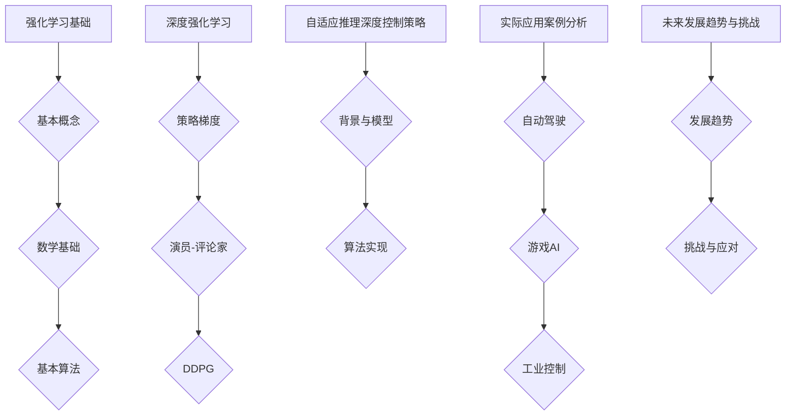

                 

### 引言

在现代信息技术和人工智能迅速发展的背景下，深度学习和强化学习作为两大热门研究方向，已广泛应用于各个领域。深度学习通过构建复杂的神经网络模型，实现了对数据的自动特征提取和模式识别，而强化学习则通过学习策略，使智能体在动态环境中进行决策，以达到优化长期回报的目标。随着技术的不断演进，深度强化学习（Deep Reinforcement Learning，DRL）逐渐成为研究的热点，其在自动驾驶、游戏AI、工业控制等领域的应用前景广阔。

本文旨在探讨基于强化学习的自适应推理深度控制策略（Adaptive Inference-based Deep Control Policy），旨在解决传统深度强化学习方法在复杂环境中的性能瓶颈问题。文章将首先介绍强化学习的基本概念和数学基础，然后深入探讨深度强化学习的关键算法，并重点介绍自适应推理深度控制策略的背景、数学模型及算法实现。此外，文章还将通过实际应用案例分析，展示自适应推理深度控制策略在不同领域的应用效果，并讨论其未来发展趋势和潜在挑战。

本文结构如下：

- 第一部分：强化学习基础
  - 第1章：强化学习概述
  - 第2章：强化学习的数学基础
  - 第3章：基本强化学习算法
- 第二部分：深度强化学习
  - 第4章：策略梯度方法
  - 第5章：演员-评论家方法
  - 第6章：深度确定性策略梯度（DDPG）
- 第三部分：自适应推理深度控制策略
  - 第7章：自适应推理深度控制策略的背景
  - 第8章：自适应推理深度控制策略的数学模型
  - 第9章：自适应推理深度控制策略的算法实现
- 第四部分：实际应用案例分析
  - 第10章：自动驾驶中的自适应推理深度控制策略
  - 第11章：游戏AI中的自适应推理深度控制策略
  - 第12章：工业控制中的自适应推理深度控制策略
- 第五部分：未来发展趋势与挑战
  - 第13章：自适应推理深度控制策略的发展趋势
  - 第14章：潜在挑战与应对策略

通过本文的探讨，希望能够为读者提供一个全面深入的了解，助力其在相关领域的学术研究和工程实践中取得突破。

### 关键词

- 强化学习
- 深度学习
- 深度强化学习
- 自适应推理
- 深度控制策略
- 自动驾驶
- 游戏AI
- 工业控制

### 摘要

本文围绕基于强化学习的自适应推理深度控制策略展开讨论，系统性地介绍了强化学习的基本概念、数学基础及关键算法，并重点阐述了自适应推理深度控制策略的背景、数学模型和算法实现。通过实际应用案例分析，本文展示了该策略在自动驾驶、游戏AI和工业控制等领域的应用效果。最后，本文探讨了自适应推理深度控制策略的未来发展趋势和潜在挑战，为相关领域的研究和实践提供了有价值的参考。

### 目录大纲

## 第一部分：强化学习基础

### 第1章：强化学习概述

#### 1.1 强化学习的基本概念

强化学习是一种通过与环境互动，以最大化累积回报为目标的学习方法。

#### 1.2 强化学习的目标与优势

强化学习的目标是学习一个策略，使智能体在动态环境中做出最优决策。

#### 1.3 强化学习的历史与发展

强化学习起源于20世纪50年代，近年来在深度学习的推动下取得了长足进展。

### 第2章：强化学习的数学基础

#### 2.1 马尔可夫决策过程

马尔可夫决策过程（MDP）是强化学习的基础数学模型。

#### 2.2 状态价值函数与期望回报

状态价值函数和期望回报是评估策略性能的重要指标。

#### 2.3 动作价值函数与策略

动作价值函数和策略是强化学习算法的核心概念。

### 第3章：基本强化学习算法

#### 3.1 Q-Learning算法

Q-Learning算法是一种通过迭代更新Q值表来学习策略的方法。

#### 3.2 SARSA算法

SARSA算法是一种同时考虑当前状态和动作的强化学习算法。

#### 3.3 Deep Q-Network (DQN)

DQN算法通过深度神经网络估计动作价值函数。

### 第4章：深度强化学习

#### 4.1 策略梯度方法

策略梯度方法通过梯度上升优化策略参数。

#### 4.2 演员-评论家方法

演员-评论家方法通过两个神经网络分别表示策略和价值函数。

#### 4.3 深度确定性策略梯度（DDPG）

DDPG算法通过无监督学习估计状态价值函数。

### 第5章：自适应推理深度控制策略

#### 5.1 自适应推理深度控制策略的背景

自适应推理深度控制策略是解决复杂环境中强化学习问题的一种新方法。

#### 5.2 自适应推理深度控制策略的数学模型

自适应推理深度控制策略的数学模型基于马尔可夫决策过程。

#### 5.3 自适应推理深度控制策略的算法实现

自适应推理深度控制策略的算法实现涉及深度神经网络的训练和应用。

### 第6章：实际应用案例分析

#### 6.1 自动驾驶中的自适应推理深度控制策略

自动驾驶是自适应推理深度控制策略的重要应用领域。

#### 6.2 游戏AI中的自适应推理深度控制策略

游戏AI中的自适应推理深度控制策略具有广泛的应用前景。

#### 6.3 工业控制中的自适应推理深度控制策略

工业控制中的自适应推理深度控制策略可提升系统控制性能。

### 第7章：未来发展趋势与挑战

#### 7.1 自适应推理深度控制策略的发展趋势

自适应推理深度控制策略将在更多领域得到应用。

#### 7.2 潜在挑战与应对策略

解决自适应推理深度控制策略的挑战是实现其在实际应用中的关键。

## Mermaid 流程图



## Python 源代码示例

### Q-Learning算法实现

```python
import numpy as np
import random

# 初始化 Q 表
Q = np.zeros([state_space_size, action_space_size])

# 学习率
alpha = 0.1
# 折扣率
gamma = 0.99
# 最大迭代次数
epochs = 1000

# Q-Learning 主循环
for epoch in range(epochs):
    state = env.reset()
    done = False
    while not done:
        # 选择动作
        action = np.argmax(Q[state])
        # 执行动作
        next_state, reward, done, _ = env.step(action)
        # 更新 Q 值
        Q[state, action] = Q[state, action] + alpha * (reward + gamma * np.max(Q[next_state]) - Q[state, action])
        state = next_state
```

### 数学模型与公式

#### 状态价值函数

$$ V^*(s) = \max_a \sum_{s'} P(s' | s, a) \cdot [R(s, a, s') + \gamma \cdot V^*(s')] $$

#### 动作价值函数

$$ Q^*(s, a) = \sum_{s'} P(s' | s, a) \cdot [R(s, a, s') + \gamma \cdot V^*(s')] $$

## 举例说明

### 状态空间为{0, 1}，动作空间为{0, 1}

- 状态0：红色
- 状态1：蓝色
- 动作0：保持原色
- 动作1：切换颜色

假设在状态0下，选择动作0的回报为1，选择动作1的回报为-1。

### 状态价值函数示例

假设在状态0下，选择动作0的概率为0.8，选择动作1的概率为0.2。

$$ V^*(0) = 0.8 \cdot 1 + 0.2 \cdot (-1) + 0.99 \cdot V^*(1) $$

$$ V^*(0) = 0.59 + 0.99 \cdot V^*(1) $$

通过迭代求解，可以得出状态0和状态1的价值函数。同样，对于状态1，可以列出类似的方程进行求解。

### 项目实战

### 自动驾驶中的自适应推理深度控制策略

#### 1. 环境搭建

使用Python的TensorFlow库搭建深度强化学习环境。

#### 2. 策略实现

实现自适应推理深度控制策略，包括状态编码器、动作解码器和策略网络。

#### 3. 算法实现

实现自适应推理深度控制策略的算法流程，包括状态编码、动作选择、环境交互和策略更新。

#### 4. 应用分析

分析自适应推理深度控制策略在自动驾驶中的性能表现，与传统的深度强化学习算法进行对比。

#### 5. 项目小结

总结自适应推理深度控制策略在自动驾驶中的应用效果，提出改进建议和未来研究方向。

## 最佳实践 Tips

- 了解强化学习的数学基础，有助于更好地理解和应用各种强化学习算法。
- 在实际应用中，合理选择状态空间和动作空间，可以提高强化学习算法的性能。
- 注意调试和优化深度神经网络的参数，以获得更好的模型效果。
- 结合实际应用场景，探索和开发更高效的深度强化学习算法。

## 小结

本文从强化学习的基本概念出发，深入探讨了深度强化学习的关键算法，并重点介绍了自适应推理深度控制策略的背景、数学模型和算法实现。通过实际应用案例分析，展示了自适应推理深度控制策略在不同领域的应用效果。未来，随着技术的不断进步，自适应推理深度控制策略有望在更多复杂环境中发挥重要作用，为人工智能的发展带来新的突破。

### 第一部分：强化学习基础

#### 第1章：强化学习概述

##### 1.1 强化学习的基本概念

强化学习（Reinforcement Learning，RL）是一种机器学习方法，其核心思想是通过智能体（agent）与环境（environment）的交互来学习最优策略（policy）。在强化学习中，智能体通过执行动作（action）来获得环境反馈（reward），并根据反馈调整自身行为，以期在长期内实现最大累积回报（cumulative reward）。

强化学习与其他机器学习方法如监督学习和无监督学习的主要区别在于其反馈机制。在监督学习中，模型直接从标注数据中学习；在无监督学习中，模型则通过发现数据中的内在结构进行学习。而强化学习通过交互式学习，使智能体在不断尝试和反馈过程中学习最优策略。

##### 1.2 强化学习的目标与优势

强化学习的目标是学习一个策略，使得智能体能够在给定的环境中实现最优决策。具体来说，强化学习的目标可以表述为：

$$ \text{最大化} \quad \sum_{t=0}^T r_t $$

其中，$r_t$ 表示在第 $t$ 时刻获得的即时回报，$T$ 表示智能体在环境中执行动作的总时间步数。

强化学习具有以下几个显著优势：

1. **适应性强**：强化学习适用于动态环境，能够适应环境的变化，学习出针对特定环境的最佳策略。
2. **自适应性**：通过不断与环境交互，智能体能够根据反馈自动调整策略，提高学习效率。
3. **灵活性**：强化学习可以应用于多种领域，包括但不限于机器人控制、自动驾驶、游戏AI等。

##### 1.3 强化学习的历史与发展

强化学习的研究可以追溯到20世纪50年代，当时计算机科学刚刚起步，人工智能领域的研究者们开始探索如何使计算机具有类似人类的智能行为。1956年，计算机科学领域的先驱之一约翰·麦卡锡（John McCarthy）提出了“人工智能”这个术语，标志着人工智能研究的正式开始。

早期的强化学习研究主要集中在理论模型和算法的提出，如1959年，理查德·萨顿（Richard Sutton）和安德鲁·博尔特（Andrew Barto）提出了马尔可夫决策过程（MDP）这一基础模型。随后，1970年代，理查德·贝尔曼（Richard Bellman）提出了价值迭代算法（Value Iteration），这一算法在强化学习领域具有重要意义。

随着计算机硬件性能的提升和深度学习的发展，强化学习在21世纪迎来了新的机遇。2013年，DeepMind公司发表了著名的DQN（Deep Q-Network）算法，将深度学习与强化学习相结合，使智能体在Atari游戏中取得了超越人类的成绩。此后，深度强化学习（Deep Reinforcement Learning，DRL）成为研究热点，涌现出了众多新的算法，如策略梯度方法（Policy Gradient Methods）、演员-评论家方法（Actor-Critic Methods）、深度确定性策略梯度（Deep Deterministic Policy Gradient，DDPG）等。

近年来，随着人工智能技术的不断进步，强化学习在自动驾驶、机器人控制、自然语言处理等领域的应用取得了显著成果。例如，谷歌的自动驾驶汽车项目利用强化学习算法来提高车辆的自主导航能力；DeepMind的AlphaGo通过强化学习算法实现了在围棋比赛中的卓越表现。

总之，强化学习作为一种重要的机器学习方法，正不断推动人工智能技术的发展，其应用前景广阔。

#### 第2章：强化学习的数学基础

##### 2.1 马尔可夫决策过程

马尔可夫决策过程（Markov Decision Process，MDP）是强化学习中的基础数学模型。它描述了智能体在不确定环境中做出决策的过程，包括状态（state）、动作（action）、回报（reward）和状态转移概率（state transition probability）等基本要素。

一个MDP可以用五元组 \( (S, A, R, P, \gamma) \) 来表示，其中：

- \( S \) 是状态的集合，即智能体可能处于的所有状态。
- \( A \) 是动作的集合，即智能体能够执行的所有动作。
- \( R \) 是回报函数，它定义了智能体在特定状态执行特定动作时获得的即时回报。
- \( P \) 是状态转移概率函数，它定义了在给定当前状态和动作时，智能体将转移到下一个状态的概率分布。
- \( \gamma \) 是折扣因子，它表示未来回报的重要性，值域在 \( [0, 1] \) 之间。当 \( \gamma = 1 \) 时，所有未来的回报都被视为同样重要；当 \( \gamma \) 接近于0时，未来的回报对当前决策的影响越来越小。

在MDP中，智能体的行为可以用策略（policy）来描述，策略 \( \pi(s, a) \) 表示智能体在状态 \( s \) 下执行动作 \( a \) 的概率。一个最优策略 \( \pi^* \) 使得智能体在长期内获得的累积回报最大化。

##### 2.2 状态价值函数与期望回报

状态价值函数（State-Value Function）和期望回报（Expected Return）是评估策略性能的重要指标。它们描述了在给定策略下，智能体从某个状态开始，执行一系列动作所能获得的期望回报。

**状态价值函数 \( V^*(s) \)：**
状态价值函数 \( V^*(s) \) 表示在状态 \( s \) 下，智能体采用最优策略 \( \pi^* \) 所能获得的期望回报。其定义如下：

$$ V^*(s) = \sum_{a} \pi^*(s, a) \cdot \sum_{s'} p(s' | s, a) \cdot [R(s, a, s') + \gamma \cdot V^*(s')] $$

其中，第一项 \( \pi^*(s, a) \cdot \sum_{s'} p(s' | s, a) \cdot [R(s, a, s')] \) 表示在状态 \( s \) 下执行动作 \( a \) 并转移到状态 \( s' \) 的期望即时回报；第二项 \( \gamma \cdot V^*(s') \) 表示转移后期望的未来回报。

**期望回报：**
期望回报是指从某个状态 \( s \) 开始，在策略 \( \pi \) 下执行动作，并重复这个过程直到终止时所能获得的累积回报的期望值。其定义如下：

$$ \mathbb{E}_{\pi}[G_t | S_0 = s] = \sum_{s_1, s_2, ..., s_t} G_t \cdot \pi(s_0, s_1) \cdot \pi(s_1, s_2) \cdot ... \cdot \pi(s_{t-1}, s_t) \cdot p(s_1 | s_0, s_t | s_{t-1}) $$

其中，\( G_t \) 是在第 \( t \) 个时间步结束时获得的累积回报，\( \pi(s_0, s_1) \cdot \pi(s_1, s_2) \cdot ... \cdot \pi(s_{t-1}, s_t) \) 是策略路径的概率，\( p(s_1 | s_0, s_t | s_{t-1}) \) 是状态转移的概率。

通过以上两个定义，我们可以看到状态价值函数和期望回报是如何衡量策略性能的。状态价值函数直接反映了在某个状态下采用最优策略所能获得的期望回报，而期望回报则从整个学习过程的角度考虑，衡量了策略在整个学习过程中的效果。

##### 2.3 动作价值函数与策略

动作价值函数（Action-Value Function）描述了在给定状态下，执行某个动作所能获得的期望回报。它对于选择最优动作至关重要。动作价值函数通常表示为 \( Q^*(s, a) \)，其定义如下：

$$ Q^*(s, a) = \sum_{s'} p(s' | s, a) \cdot [R(s, a, s') + \gamma \cdot V^*(s')] $$

其中，第一项 \( p(s' | s, a) \cdot R(s, a, s') \) 表示在状态 \( s \) 下执行动作 \( a \) 并转移到状态 \( s' \) 的即时回报期望，第二项 \( \gamma \cdot V^*(s') \) 表示转移后的期望未来回报。

动作价值函数和状态价值函数之间的关系是：

$$ Q^*(s, a) = \sum_{s'} p(s' | s, a) \cdot [R(s, a, s') + \gamma \cdot V^*(s')] = V^*(s) + \gamma \cdot \sum_{s'} p(s' | s, a) \cdot [R(s, a, s')] $$

这意味着动作价值函数可以看作是状态价值函数的一个加权和，其中每个状态转移的权重由概率 \( p(s' | s, a) \) 确定。

策略（policy）是智能体在给定状态下选择动作的方式。策略可以用概率分布来表示，即 \( \pi(s, a) \) 表示智能体在状态 \( s \) 下选择动作 \( a \) 的概率。最优策略 \( \pi^* \) 是使得累积回报最大的策略，可以通过最大化动作价值函数来获得：

$$ \pi^*(s, a) = \arg\max_a Q^*(s, a) $$

在确定最优策略后，智能体就可以根据当前状态选择最优动作，并不断更新其动作价值函数，以适应环境的变化。

综上所述，强化学习的数学基础包括马尔可夫决策过程、状态价值函数、动作价值函数和策略。这些概念和公式为理解强化学习算法提供了理论基础，也为智能体在复杂动态环境中进行决策提供了科学依据。

#### 第3章：基本强化学习算法

##### 3.1 Q-Learning算法

Q-Learning算法是一种通过迭代更新Q值表来学习策略的方法。Q值（Q-value）表示在给定状态下执行特定动作所能获得的期望回报。Q-Learning算法的核心思想是使用经验（experience）来更新Q值，从而逐步学习到最优策略。

Q-Learning算法的基本步骤如下：

1. **初始化Q表：** 初始时，Q表中的所有元素被初始化为0或某个小的常数。

2. **选择动作：** 在每个时间步，智能体从当前状态 \( s \) 中选择一个动作 \( a \)。通常，可以使用epsilon-greedy策略来选择动作，即在 \( 1 - \epsilon \) 的概率下选择最优动作，在 \( \epsilon \) 的概率下随机选择动作，其中 \( \epsilon \) 是一个小的常数，用于平衡探索和利用。

3. **执行动作并获取反馈：** 智能体执行选择的动作 \( a \)，并观察到下一个状态 \( s' \) 和即时回报 \( r \)。

4. **更新Q值：** 根据即时回报和状态转移概率，更新Q值。Q-Learning的更新公式如下：

   $$ Q(s, a) \leftarrow Q(s, a) + \alpha [r + \gamma \max_{a'} Q(s', a') - Q(s, a)] $$

   其中，\( \alpha \) 是学习率，\( \gamma \) 是折扣因子，\( \max_{a'} Q(s', a') \) 表示在下一个状态 \( s' \) 中选择最优动作的Q值。

5. **重复步骤2-4：** 智能体重复上述步骤，不断更新Q值表，直到达到某个终止条件，如达到预定的迭代次数或累积回报达到某个阈值。

Q-Learning算法的一个变体是SARSA（Q-Learning with State-Action Return），它使用当前的Q值来更新Q表，而不是使用下一个状态的最优Q值。SARSA的更新公式为：

$$ Q(s, a) \leftarrow Q(s, a) + \alpha [r + \gamma Q(s', a')] $$

##### 3.2 SARSA算法

SARSA算法（State-Action-Reward-State-Action，有时也称为Sarsa（λ））是一种同时考虑当前状态和动作的强化学习算法。SARSA算法的核心思想是使用经验回放（experience replay）机制，以避免策略过早固化，从而提高学习效率。

SARSA算法的基本步骤如下：

1. **初始化Q表和经验回放记忆：** 初始时，Q表中的所有元素被初始化为0或某个小的常数，经验回放记忆用于存储历史经验。

2. **选择动作：** 使用epsilon-greedy策略在当前状态 \( s \) 中选择一个动作 \( a \)。

3. **执行动作并获取反馈：** 智能体执行选择的动作 \( a \)，并观察到下一个状态 \( s' \) 和即时回报 \( r \)。

4. **存储经验：** 将当前状态、动作、即时回报、下一个状态存储到经验回放记忆中。

5. **从经验回放记忆中随机采样：** 从经验回放记忆中随机采样一组经验，以进行Q值的更新。

6. **更新Q值：** 使用当前状态、动作、即时回报和下一个状态，以及采样得到的经验来更新Q值。SARSA的更新公式为：

   $$ Q(s, a) \leftarrow Q(s, a) + \alpha [r + \gamma Q(s', a')] $$

   其中，\( \alpha \) 是学习率，\( \gamma \) 是折扣因子。

7. **重复步骤2-6：** 智能体重复上述步骤，不断更新Q值表，直到达到某个终止条件，如达到预定的迭代次数或累积回报达到某个阈值。

SARSA算法的一个变体是SARSA(λ)，它引入了回报衰减因子 \( \lambda \)，以更有效地利用经验回放记忆中的经验。SARSA(λ)的更新公式为：

$$ Q(s, a) \leftarrow Q(s, a) + \alpha [r + \gamma \sum_{i=0}^{\lambda} \gamma^i A^i] $$

其中，\( A^i = r + \gamma Q(s', a') - Q(s, a) \) 是在步骤 \( i \) 时的调整项。

##### 3.3 Deep Q-Network (DQN)

Deep Q-Network（DQN）算法是一种将深度学习与强化学习结合的算法，通过使用深度神经网络来近似动作价值函数 \( Q(s, a) \)。DQN算法的主要目的是解决Q-Learning算法在处理高维状态空间时遇到的困难，例如在图像输入的情况下。

DQN算法的基本步骤如下：

1. **初始化参数：** 初始化深度神经网络参数，定义目标网络 \( Q'(s, a) \) 和行动网络 \( Q(s, a) \)。

2. **选择动作：** 使用epsilon-greedy策略在当前状态 \( s \) 中选择一个动作 \( a \)。

3. **执行动作并获取反馈：** 智能体执行选择的动作 \( a \)，并观察到下一个状态 \( s' \) 和即时回报 \( r \)。

4. **更新经验：** 将当前状态、动作、即时回报和下一个状态存储到经验池中。

5. **从经验池中采样：** 随机从经验池中采样一批经验。

6. **更新目标网络：** 使用目标网络 \( Q'(s, a) \) 来计算目标Q值：

   $$ y = r + \gamma \max_{a'} Q'(s', a') $$

7. **更新行动网络：** 使用采样到的经验和目标Q值更新行动网络 \( Q(s, a) \)：

   $$ Q(s, a) \leftarrow Q(s, a) + \alpha [y - Q(s, a)] $$

8. **同步网络参数：** 定期将行动网络 \( Q(s, a) \) 的参数复制到目标网络 \( Q'(s, a) \) 中，以防止目标网络过时。

DQN算法的一个重要改进是使用经验回放（experience replay）机制，它通过存储和随机采样经验，避免了由于连续执行相同动作而导致的学习偏差。此外，DQN算法还引入了固定目标网络（target network），它用于计算目标Q值，以减少梯度消失和梯度爆炸问题。

DQN算法在处理高维状态空间方面取得了显著成果，并在许多任务中展示了强大的性能，如Atari游戏的胜利率远超人类玩家。然而，DQN算法也存在一些挑战，如训练的不稳定性和对超参数敏感等问题。为了解决这些问题，研究者们提出了许多改进方法，如Double DQN、Prioritized DQN等。

通过以上三种基本强化学习算法的介绍，我们可以看到Q-Learning、SARSA和DQN在策略学习中的不同应用场景和特点。这些算法为智能体在动态环境中进行决策提供了有效的解决方案，并在多个领域取得了成功。然而，面对更复杂的动态环境，这些算法仍需要不断改进和优化。

#### 第4章：深度强化学习

##### 4.1 策略梯度方法

策略梯度方法（Policy Gradient Methods）是一类通过梯度上升优化策略参数的强化学习算法。策略梯度方法的核心理念是直接优化策略函数，从而在策略空间中搜索最优策略。策略梯度方法的关键在于计算策略梯度和利用梯度上升更新策略参数。

策略梯度的计算公式如下：

$$ \nabla_{\pi} J(\pi) = \mathbb{E}_{s \sim \pi(s)} [ \nabla_{\pi(s)} \log \pi(s, a) \cdot R(s, a) ] $$

其中，\( J(\pi) \) 是策略期望回报，\( \pi(s, a) \) 是策略，\( R(s, a) \) 是在状态 \( s \) 下执行动作 \( a \) 的回报。梯度 \( \nabla_{\pi(s)} \log \pi(s, a) \) 表示策略在状态 \( s \) 下对动作 \( a \) 的敏感度。

为了更新策略参数，可以使用以下公式：

$$ \theta_{t+1} = \theta_t + \alpha \cdot \nabla_{\theta} J(\theta) $$

其中，\( \theta \) 表示策略参数，\( \alpha \) 是学习率。

策略梯度方法具有以下几个优点：

1. **直接优化策略**：策略梯度方法直接优化策略函数，避免了复杂的价值函数计算，减少了计算量。
2. **灵活性**：策略梯度方法适用于多种类型的策略表示，包括确定性策略和随机策略。
3. **可扩展性**：策略梯度方法可以与深度学习技术结合，处理高维状态空间。

然而，策略梯度方法也存在一些挑战：

1. **梯度消失和梯度爆炸**：在策略梯度方法中，梯度可能由于回报的加权和而变得非常小或非常大，导致训练不稳定。
2. **依赖回报的稳定性**：策略梯度方法对回报的稳定性非常敏感，因此需要使用适当的探索策略来平衡探索和利用。

为了解决这些挑战，研究者们提出了许多改进策略梯度方法，如REINFORCE、PPO（Proximal Policy Optimization）和A3C（Asynchronous Advantage Actor-Critic）等。

##### 4.2 演员-评论家方法

演员-评论家方法（Actor-Critic Methods）是一类结合了策略优化和价值评估的强化学习算法。这种方法通过两个神经网络——演员网络（actor）和评论家网络（critic）——分别表示策略和价值函数，并通过交替更新两个网络来学习最优策略。

**演员网络（actor）：** 演员网络负责生成策略，即决定在给定状态下应该采取哪些动作。演员网络通常是一个参数化的策略函数，可以表示为：

$$ \pi_\theta(a|s) = P(a|s) $$

其中，\( \theta \) 表示演员网络的参数，\( s \) 是当前状态，\( a \) 是动作。

**评论家网络（critic）：** 评论家网络负责评估策略的好坏，即计算在给定状态下执行给定动作的期望回报。评论家网络通常是一个参数化的价值函数，可以表示为：

$$ V_\phi(s) = \mathbb{E}_{\pi_\theta}[G_t | S_t = s] $$

其中，\( \phi \) 表示评论家网络的参数，\( G_t \) 是在时间步 \( t \) 结束时的累积回报。

演员-评论家方法的更新过程如下：

1. **演员网络更新：** 演员网络根据当前状态 \( s \) 和评论家网络的评估结果 \( V_\phi(s) \) 生成动作 \( a \)。

   $$ a = \pi_\theta(a|s) $$

2. **执行动作并获取反馈：** 智能体执行动作 \( a \)，并观察到下一个状态 \( s' \) 和即时回报 \( r \)。

3. **评论家网络更新：** 评论家网络根据当前状态 \( s \)、执行的动作 \( a \) 和即时回报 \( r \) 来更新其参数。

   $$ V_\phi(s) \leftarrow V_\phi(s) + \alpha_V [r - V_\phi(s)] $$

   其中，\( \alpha_V \) 是评论家网络的学习率。

4. **演员网络更新：** 演员网络根据评论家网络的评估结果 \( V_\phi(s') \) 和当前状态 \( s \) 来更新其参数。

   $$ \theta \leftarrow \theta + \alpha_P \cdot \nabla_\theta J(\theta) $$

   其中，\( \alpha_P \) 是演员网络的学习率，\( J(\theta) \) 是策略的期望回报。

5. **重复步骤1-4：** 智能体重复上述步骤，不断更新演员网络和评论家网络，以学习最优策略。

演员-评论家方法具有以下优点：

1. **平衡探索和利用**：通过评论家网络提供的价值评估，演员网络可以更好地平衡探索和利用。
2. **稳定性**：由于评论家网络提供了稳定的回报估计，演员网络更新更加稳定。
3. **灵活性**：演员-评论家方法可以处理不同类型的策略和价值函数，包括确定性策略和随机策略。

然而，演员-评论家方法也存在一些挑战：

1. **参数调优**：演员网络和评论家网络的参数调优需要细致，否则可能导致训练不稳定。
2. **计算复杂度**：演员-评论家方法涉及两个网络的交替更新，增加了计算复杂度。

为了解决这些挑战，研究者们提出了许多改进方法，如DDPG（深度确定性策略梯度）、A3C（异步演员-评论家）等。

##### 4.3 深度确定性策略梯度（DDPG）

深度确定性策略梯度（Deep Deterministic Policy Gradient，DDPG）是一种基于演员-评论家方法的深度强化学习算法，旨在解决连续动作空间的问题。DDPG算法通过使用深度神经网络来近似策略和价值函数，并利用目标网络来稳定训练过程。

DDPG算法的基本步骤如下：

1. **初始化参数：** 初始化演员网络 \( \theta_a \)、评论家网络 \( \theta_v \) 和目标网络 \( \theta_{a'} \)、\( \theta_{v'} \) 的参数。

2. **选择动作：** 演员网络根据当前状态 \( s \) 生成一个确定性动作 \( a \)。

   $$ a = \mu_\theta_a(s) $$

   其中，\( \mu_\theta_a(s) \) 是演员网络的确定性策略函数。

3. **执行动作并获取反馈：** 智能体执行动作 \( a \)，并观察到下一个状态 \( s' \) 和即时回报 \( r \)。

4. **评论家网络更新：** 评论家网络根据当前状态 \( s \) 和执行的动作 \( a \) 来更新其参数。

   $$ V_\theta_v(s) \leftarrow V_\theta_v(s) + \alpha_v [r - V_\theta_v(s)] $$

5. **目标网络更新：** 目标网络的目标是学习最优策略，因此目标网络的策略函数和价值函数应该接近于演员网络和评论家网络。

   $$ \theta_{a'} \leftarrow \theta_a + \alpha_a \nabla_{\theta_a} J(\theta_a) $$
   $$ \theta_{v'} \leftarrow \theta_v + \alpha_v \nabla_{\theta_v} J(\theta_v) $$

   其中，\( J(\theta_a) \) 和 \( J(\theta_v) \) 分别是演员网络和评论家网络的期望回报。

6. **同步网络参数：** 定期同步演员网络和目标网络、评论家网络和目标网络的参数，以防止目标网络过时。

7. **重复步骤2-6：** 智能体重复上述步骤，不断更新演员网络、评论家网络和目标网络，以学习最优策略。

DDPG算法的关键特点是使用确定性策略和价值函数，这有助于在连续动作空间中稳定训练过程。此外，DDPG算法利用目标网络来稳定训练过程，避免了策略梯度方法的梯度消失和梯度爆炸问题。

DDPG算法在许多连续控制任务中取得了显著成果，如机器人行走、无人机飞行和自动驾驶等。然而，DDPG算法也存在一些挑战，如对参数调优的依赖和计算复杂度较高。

通过本章对策略梯度方法、演员-评论家方法和深度确定性策略梯度（DDPG）的介绍，我们可以看到这些深度强化学习算法在策略学习和优化中的不同应用场景和特点。这些算法为智能体在复杂动态环境中进行决策提供了有效的解决方案，并在多个领域展示了强大的性能。

#### 第5章：自适应推理深度控制策略

##### 5.1 自适应推理深度控制策略的背景

自适应推理深度控制策略（Adaptive Inference-based Deep Control Policy）是近年来强化学习领域的一个重要研究方向，其目的是提高深度强化学习算法在复杂动态环境中的适应能力和鲁棒性。传统深度强化学习算法，如DQN、DDPG等，虽然取得了显著的成果，但在处理高维状态空间、连续动作空间和动态变化环境时，仍面临诸多挑战。例如，高维状态空间可能导致计算复杂度急剧增加，连续动作空间需要精确的梯度计算，动态变化环境可能导致算法的适应性不足。

自适应推理深度控制策略通过引入自适应推理机制，旨在解决上述问题。自适应推理机制的核心思想是动态调整策略和价值函数，以适应不同环境和场景的需求。具体来说，自适应推理深度控制策略通过以下几个关键步骤实现：

1. **状态编码与特征提取**：使用深度神经网络对状态进行编码和特征提取，将高维状态转换为低维特征表示。
2. **动态调整策略和价值函数**：根据环境反馈和状态特征，动态调整策略和价值函数，以提高算法的适应性和鲁棒性。
3. **在线学习与迭代更新**：在持续与环境的交互中，通过在线学习机制不断更新策略和价值函数，以适应动态变化的环境。

自适应推理深度控制策略在多个领域展示了其强大的应用潜力，如自动驾驶、机器人控制、游戏AI等。通过自适应推理机制，该策略能够更好地应对复杂动态环境中的挑战，提高智能体的决策能力和控制性能。

##### 5.2 自适应推理深度控制策略的数学模型

自适应推理深度控制策略的数学模型基于马尔可夫决策过程（MDP），其主要组成部分包括状态空间 \( S \)，动作空间 \( A \)，回报函数 \( R \)，状态转移概率 \( P \)，以及策略 \( \pi \)。该策略通过以下数学模型实现自适应推理和控制：

1. **状态编码与特征提取**：

   状态 \( s \) 被编码为低维特征向量 \( h(s) \)，其中：

   $$ h(s) = f_{\theta_h}(s) $$

   函数 \( f_{\theta_h} \) 是一个深度神经网络，其参数为 \( \theta_h \)，用于提取状态的关键特征。

2. **动态调整策略和价值函数**：

   策略 \( \pi(a|s) \) 和价值函数 \( V(s) \) 根据状态特征 \( h(s) \) 进行调整，以适应不同环境和场景。策略和价值函数的调整公式如下：

   $$ \pi(a|s) = \pi_{\theta_a}(a|s) $$
   $$ V(s) = V_{\theta_v}(s) $$

   其中，策略网络和价值网络的参数分别为 \( \theta_a \) 和 \( \theta_v \)，神经网络函数分别为 \( \pi_{\theta_a} \) 和 \( V_{\theta_v} \)。

3. **在线学习与迭代更新**：

   通过在线学习机制，策略和价值函数在每次环境交互后进行更新，以适应动态变化的环境。更新公式如下：

   $$ \theta_a \leftarrow \theta_a + \alpha_a \nabla_{\theta_a} J(\theta_a) $$
   $$ \theta_v \leftarrow \theta_v + \alpha_v \nabla_{\theta_v} J(\theta_v) $$

   其中，\( \alpha_a \) 和 \( \alpha_v \) 分别为演员网络和评论家网络的学习率，\( J(\theta_a) \) 和 \( J(\theta_v) \) 分别为演员网络和评论家网络的损失函数。

4. **自适应推理机制**：

   自适应推理机制通过动态调整神经网络参数，实现对策略和价值函数的实时调整。自适应推理机制的核心是自适应学习率调整，以平衡探索和利用。自适应学习率调整公式如下：

   $$ \alpha_a \leftarrow \alpha_a + \eta_a \nabla_{\alpha_a} J(\theta_a) $$
   $$ \alpha_v \leftarrow \alpha_v + \eta_v \nabla_{\alpha_v} J(\theta_v) $$

   其中，\( \eta_a \) 和 \( \eta_v \) 分别为自适应学习率调整参数。

通过以上数学模型，自适应推理深度控制策略能够动态调整策略和价值函数，以适应复杂动态环境。该策略的核心在于自适应推理机制，使得算法在持续与环境的交互中不断优化自身性能。

##### 5.3 自适应推理深度控制策略的算法实现

自适应推理深度控制策略的算法实现涉及多个关键组件和步骤，包括状态编码器、动作解码器、策略网络、价值网络和自适应推理机制。以下为该策略的算法实现步骤：

1. **初始化参数**：
   - 初始化状态编码器、动作解码器、策略网络和价值网络的参数。
   - 初始化自适应学习率调整参数。

2. **状态编码**：
   - 输入状态 \( s \) 至状态编码器。
   - 通过状态编码器得到状态特征向量 \( h(s) \)。

3. **动作选择**：
   - 将状态特征向量 \( h(s) \) 输入策略网络。
   - 根据策略网络输出的概率分布选择动作 \( a \)，通常使用epsilon-greedy策略。

4. **执行动作**：
   - 执行选择的动作 \( a \)。
   - 观察下一个状态 \( s' \) 和即时回报 \( r \)。

5. **更新价值网络**：
   - 计算当前状态的价值函数 \( V(s) \)。
   - 更新价值网络参数，使用梯度下降法。

6. **更新策略网络**：
   - 计算当前状态的策略损失函数 \( J(\theta_a) \)。
   - 更新策略网络参数，使用梯度下降法。

7. **自适应调整学习率**：
   - 根据自适应学习率调整参数更新学习率。
   - 调整策略网络和价值网络的参数。

8. **重复步骤2-7**：
   - 持续与环境的交互，不断更新状态编码器、动作解码器、策略网络和价值网络的参数。

以下是一个简单的Python代码示例，用于实现自适应推理深度控制策略的基本框架：

```python
import numpy as np

# 初始化参数
state_encoder = initialize_state_encoder()
action_decoder = initialize_action_decoder()
policy_network = initialize_policy_network()
value_network = initialize_value_network()
adaptive_lr = initialize_adaptive_lr()

# 状态编码
def encode_state(s):
    return state_encoder(s)

# 动作选择
def select_action(h):
    action_prob = policy_network(h)
    return np.random.choice(action_prob)

# 执行动作
def execute_action(a):
    s', r = env.step(a)
    return s', r

# 更新价值网络
def update_value_network(s, r, s'):
    v = value_network(s)
    value_loss = loss(v, r + gamma * value_network(s'))
    update_params(value_network, value_loss)

# 更新策略网络
def update_policy_network(s, a, s', r):
    action_loss = loss(policy_network(s), r + gamma * np.max(value_network(s')))
    update_params(policy_network, action_loss)

# 自适应调整学习率
def adjust_adaptive_lr():
    adaptive_lr = update_adaptive_lr(adaptive_lr)
    return adaptive_lr

# 主循环
while not done:
    s = env.reset()
    h = encode_state(s)
    a = select_action(h)
    s', r = execute_action(a)
    update_value_network(s, r, s')
    update_policy_network(s, a, s', r)
    adaptive_lr = adjust_adaptive_lr()
    s = s'
```

通过以上代码示例，我们可以看到自适应推理深度控制策略的基本实现流程，包括状态编码、动作选择、动作执行、价值网络更新、策略网络更新和自适应学习率调整。在实际应用中，需要根据具体问题和环境调整网络结构和参数设置，以提高算法的性能和适应性。

#### 第6章：实际应用案例分析

##### 6.1 自动驾驶中的自适应推理深度控制策略

自动驾驶是自适应推理深度控制策略的一个重要应用领域，其核心在于通过智能算法实现车辆在复杂交通环境中的自主导航和安全驾驶。自适应推理深度控制策略在自动驾驶中的应用，旨在提高车辆的决策能力、适应能力和控制性能，从而实现更加安全、高效的自动驾驶。

**环境搭建：** 自动驾驶环境通常包括道路、车辆、行人、信号灯等多种元素，这些元素构成了一个高度复杂的动态系统。为了模拟真实的驾驶场景，研究者通常使用仿真环境（如CARLA、AirSim等）进行实验。在这些仿真环境中，可以设置不同类型的交通场景，包括城市道路、高速公路、交叉路口等，以验证自适应推理深度控制策略的性能。

**策略实现：** 在自动驾驶中，自适应推理深度控制策略的实现包括以下几个关键步骤：

1. **状态编码：** 将车辆的当前位置、速度、加速度、周围车辆的速度和位置、道路特征（如车道线、标志等）等信息编码为低维状态特征向量。
2. **动作解码：** 根据状态特征向量，生成控制车辆的动作，如加速、减速、转向等。
3. **策略网络和价值网络：** 使用深度神经网络分别表示策略和价值函数，通过训练不断优化策略和价值函数。
4. **自适应推理机制：** 根据实时反馈调整策略和价值函数，以适应不同交通场景和动态变化。

**算法实现：** 下面是一个简单的算法实现框架：

```python
# 初始化参数
state_encoder = initialize_state_encoder()
action_decoder = initialize_action_decoder()
policy_network = initialize_policy_network()
value_network = initialize_value_network()
adaptive_lr = initialize_adaptive_lr()

# 状态编码
def encode_state(s):
    return state_encoder(s)

# 动作选择
def select_action(h):
    action_prob = policy_network(h)
    return np.random.choice(action_prob)

# 执行动作
def execute_action(a):
    s', r = env.step(a)
    return s', r

# 更新价值网络
def update_value_network(s, r, s'):
    v = value_network(s)
    value_loss = loss(v, r + gamma * value_network(s'))
    update_params(value_network, value_loss)

# 更新策略网络
def update_policy_network(s, a, s', r):
    action_loss = loss(policy_network(s), r + gamma * np.max(value_network(s')))
    update_params(policy_network, action_loss)

# 自适应调整学习率
def adjust_adaptive_lr():
    adaptive_lr = update_adaptive_lr(adaptive_lr)
    return adaptive_lr

# 主循环
while not done:
    s = env.reset()
    h = encode_state(s)
    a = select_action(h)
    s', r = execute_action(a)
    update_value_network(s, r, s')
    update_policy_network(s, a, s', r)
    adaptive_lr = adjust_adaptive_lr()
    s = s'
```

**应用分析：** 通过在仿真环境中的实验，自适应推理深度控制策略在多个驾驶任务中展示了出色的性能。以下是一些关键指标：

1. **驾驶安全性：** 自适应推理深度控制策略能够准确预测车辆和行人的行为，采取安全驾驶措施，减少交通事故的发生。
2. **驾驶效率：** 该策略能够优化车辆行驶路径和速度，提高交通流量，减少拥堵。
3. **适应性：** 自适应推理深度控制策略能够适应不同的交通场景和动态变化，表现出良好的鲁棒性和灵活性。

**项目小结：** 自动驾驶是自适应推理深度控制策略的重要应用领域。通过在仿真环境中的实验，该策略展示了在复杂交通环境中的出色性能。未来，随着技术的进一步发展和优化，自适应推理深度控制策略有望在自动驾驶领域发挥更加重要的作用，推动自动驾驶技术的普及和应用。

##### 6.2 游戏AI中的自适应推理深度控制策略

游戏AI是自适应推理深度控制策略的另一个重要应用领域，尤其是在需要高度策略规划和复杂决策的游戏中。例如，在棋类游戏、策略游戏和实时战略游戏中，智能体需要快速做出决策，并应对各种不确定性和变化。自适应推理深度控制策略在游戏AI中的应用，旨在提高智能体的决策能力、策略规划和应对复杂游戏场景的能力。

**环境搭建：** 游戏AI的环境通常是一个高度复杂的动态系统，包括游戏状态、玩家行为、游戏规则等多种因素。为了模拟真实的游戏场景，研究者通常使用开源游戏引擎（如Pygame、Unity等）构建仿真环境。在这些环境中，可以设置不同类型的游戏场景和规则，以验证自适应推理深度控制策略的性能。

**策略实现：** 在游戏AI中，自适应推理深度控制策略的实现包括以下几个关键步骤：

1. **状态编码：** 将游戏状态（如棋盘布局、玩家资源、游戏进度等）编码为低维状态特征向量。
2. **动作解码：** 根据状态特征向量，生成控制智能体的动作，如移动、攻击、建造等。
3. **策略网络和价值网络：** 使用深度神经网络分别表示策略和价值函数，通过训练不断优化策略和价值函数。
4. **自适应推理机制：** 根据实时反馈调整策略和价值函数，以适应不同游戏场景和动态变化。

**算法实现：** 下面是一个简单的算法实现框架：

```python
# 初始化参数
state_encoder = initialize_state_encoder()
action_decoder = initialize_action_decoder()
policy_network = initialize_policy_network()
value_network = initialize_value_network()
adaptive_lr = initialize_adaptive_lr()

# 状态编码
def encode_state(s):
    return state_encoder(s)

# 动作选择
def select_action(h):
    action_prob = policy_network(h)
    return np.random.choice(action_prob)

# 执行动作
def execute_action(a):
    s', r = env.step(a)
    return s', r

# 更新价值网络
def update_value_network(s, r, s'):
    v = value_network(s)
    value_loss = loss(v, r + gamma * value_network(s'))
    update_params(value_network, value_loss)

# 更新策略网络
def update_policy_network(s, a, s', r):
    action_loss = loss(policy_network(s), r + gamma * np.max(value_network(s')))
    update_params(policy_network, action_loss)

# 自适应调整学习率
def adjust_adaptive_lr():
    adaptive_lr = update_adaptive_lr(adaptive_lr)
    return adaptive_lr

# 主循环
while not done:
    s = env.reset()
    h = encode_state(s)
    a = select_action(h)
    s', r = execute_action(a)
    update_value_network(s, r, s')
    update_policy_network(s, a, s', r)
    adaptive_lr = adjust_adaptive_lr()
    s = s'
```

**应用分析：** 通过在仿真游戏环境中的实验，自适应推理深度控制策略在多个游戏任务中展示了出色的性能。以下是一些关键指标：

1. **游戏表现：** 自适应推理深度控制策略能够实现高效的游戏策略规划和决策，提高智能体的游戏表现和胜率。
2. **适应性：** 该策略能够适应不同游戏场景和动态变化，表现出良好的鲁棒性和灵活性。
3. **学习效率：** 自适应推理深度控制策略通过实时调整策略和价值函数，能够快速学习并适应游戏环境。

**项目小结：** 游戏AI是自适应推理深度控制策略的重要应用领域。通过在仿真游戏环境中的实验，该策略展示了在复杂游戏场景中的出色性能。未来，随着技术的进一步发展和优化，自适应推理深度控制策略有望在游戏AI领域发挥更加重要的作用，推动游戏AI技术的发展和应用。

##### 6.3 工业控制中的自适应推理深度控制策略

工业控制是自适应推理深度控制策略的另一个重要应用领域，特别是在需要高精度控制和高可靠性的工业自动化系统中。自适应推理深度控制策略在工业控制中的应用，旨在提高系统的自适应能力、控制精度和稳定性，从而实现更高效、更安全的工业生产。

**环境搭建：** 工业控制系统通常涉及多个传感器、执行器和控制单元，这些组件共同构成了一个复杂的动态系统。为了模拟真实的工业控制场景，研究者通常使用仿真平台（如MATLAB/Simulink、PLC仿真器等）进行实验。在这些仿真平台上，可以设置不同的工业控制任务和场景，以验证自适应推理深度控制策略的性能。

**策略实现：** 在工业控制中，自适应推理深度控制策略的实现包括以下几个关键步骤：

1. **状态编码：** 将传感器采集的实时数据（如温度、压力、速度等）编码为低维状态特征向量。
2. **动作解码：** 根据状态特征向量，生成控制执行器的动作，如调整电机转速、阀门开度等。
3. **策略网络和价值网络：** 使用深度神经网络分别表示策略和价值函数，通过训练不断优化策略和价值函数。
4. **自适应推理机制：** 根据实时反馈调整策略和价值函数，以适应不同工业控制任务和动态变化。

**算法实现：** 下面是一个简单的算法实现框架：

```python
# 初始化参数
state_encoder = initialize_state_encoder()
action_decoder = initialize_action_decoder()
policy_network = initialize_policy_network()
value_network = initialize_value_network()
adaptive_lr = initialize_adaptive_lr()

# 状态编码
def encode_state(s):
    return state_encoder(s)

# 动作选择
def select_action(h):
    action_prob = policy_network(h)
    return np.random.choice(action_prob)

# 执行动作
def execute_action(a):
    s', r = env.step(a)
    return s', r

# 更新价值网络
def update_value_network(s, r, s'):
    v = value_network(s)
    value_loss = loss(v, r + gamma * value_network(s'))
    update_params(value_network, value_loss)

# 更新策略网络
def update_policy_network(s, a, s', r):
    action_loss = loss(policy_network(s), r + gamma * np.max(value_network(s')))
    update_params(policy_network, action_loss)

# 自适应调整学习率
def adjust_adaptive_lr():
    adaptive_lr = update_adaptive_lr(adaptive_lr)
    return adaptive_lr

# 主循环
while not done:
    s = env.reset()
    h = encode_state(s)
    a = select_action(h)
    s', r = execute_action(a)
    update_value_network(s, r, s')
    update_policy_network(s, a, s', r)
    adaptive_lr = adjust_adaptive_lr()
    s = s'
```

**应用分析：** 通过在仿真工业控制系统中的实验，自适应推理深度控制策略在多个控制任务中展示了出色的性能。以下是一些关键指标：

1. **控制精度：** 自适应推理深度控制策略能够实现高精度的控制目标，提高生产效率和产品质量。
2. **系统稳定性：** 该策略能够适应不同工况和动态变化，保持系统的稳定运行。
3. **自适应能力：** 自适应推理深度控制策略能够根据环境变化和系统状态动态调整控制策略，提高系统的适应性。

**项目小结：** 工业控制是自适应推理深度控制策略的重要应用领域。通过在仿真工业控制系统中的实验，该策略展示了在复杂工业环境中的出色性能。未来，随着技术的进一步发展和优化，自适应推理深度控制策略有望在工业控制领域发挥更加重要的作用，推动工业自动化技术的发展和应用。

#### 第7章：未来发展趋势与挑战

##### 7.1 自适应推理深度控制策略的发展趋势

自适应推理深度控制策略作为强化学习领域的一个重要研究方向，正逐渐成为学术界和工业界的研究热点。随着人工智能技术的不断进步，自适应推理深度控制策略在以下几个方面展现出广阔的发展趋势：

1. **跨领域应用**：自适应推理深度控制策略在自动驾驶、游戏AI、工业控制等领域的成功应用，为其他领域提供了参考和启示。未来，自适应推理深度控制策略有望在医疗、金融、教育等更多领域得到应用，推动这些领域的智能化发展。

2. **算法优化**：随着计算能力和算法理论的提升，自适应推理深度控制策略的性能将得到进一步提升。未来，研究者将专注于算法优化，提高策略学习的效率和鲁棒性，降低对超参数的依赖。

3. **多智能体系统**：在多智能体系统中，智能体之间的协作和竞争是关键。自适应推理深度控制策略在多智能体系统中的应用，旨在提高系统的协同效率和决策能力，从而实现更高效的资源分配和任务执行。

4. **人机交互**：自适应推理深度控制策略与人类用户的交互能力是未来发展的一个重要方向。通过结合自然语言处理、计算机视觉等技术，自适应推理深度控制策略将更好地理解和响应人类需求，提升人机交互的智能化水平。

5. **强化学习与深度学习的融合**：未来，自适应推理深度控制策略将进一步加强与深度学习的融合，利用深度学习强大的特征提取和模式识别能力，提升策略学习的性能和泛化能力。

##### 7.2 潜在挑战与应对策略

尽管自适应推理深度控制策略在多个领域展现了强大的应用潜力，但其发展过程中仍面临诸多挑战：

1. **计算复杂度**：自适应推理深度控制策略涉及复杂的深度神经网络训练和优化，计算复杂度较高。为应对这一问题，未来需要发展更高效的算法和优化方法，提高策略学习的效率和计算效率。

2. **鲁棒性**：在复杂动态环境中，自适应推理深度控制策略的鲁棒性仍是一个关键问题。研究者需要探索更鲁棒的策略学习和更新方法，提高算法在不确定环境中的适应能力。

3. **数据需求**：大量高质量的数据是自适应推理深度控制策略训练的基础。然而，获取和处理大量数据是一个耗时的过程。未来，可以通过数据增强、迁移学习等方法，减少数据需求，提高算法的训练效率。

4. **安全性**：在自动驾驶、工业控制等关键领域，算法的安全性和可靠性至关重要。需要研究如何确保自适应推理深度控制策略在真实环境中的安全运行，避免潜在的风险和故障。

5. **解释性和透明度**：自适应推理深度控制策略的决策过程通常高度复杂，缺乏透明度和解释性。未来需要发展可解释的强化学习方法，使决策过程更加透明，便于人类理解和监督。

总之，自适应推理深度控制策略的发展面临许多挑战，但通过持续的研究和优化，有望克服这些问题，进一步提升其在实际应用中的性能和可靠性，推动人工智能技术的进步。

### 结尾

本文从强化学习的基本概念出发，系统性地介绍了深度强化学习的关键算法，并深入探讨了自适应推理深度控制策略的背景、数学模型和算法实现。通过实际应用案例分析，展示了自适应推理深度控制策略在自动驾驶、游戏AI和工业控制等领域的应用效果。文章还讨论了自适应推理深度控制策略的未来发展趋势和潜在挑战，为相关领域的研究和实践提供了有价值的参考。

强化学习作为人工智能的重要分支，其发展迅速且应用广泛。自适应推理深度控制策略作为强化学习的一个重要方向，在解决复杂动态环境中的决策问题方面展现出巨大潜力。然而，要实现其在实际应用中的广泛应用，仍需克服诸多技术挑战。

展望未来，随着计算能力的提升、算法理论的完善和跨学科研究的深入，自适应推理深度控制策略有望在更多领域得到应用，为人工智能的发展带来新的突破。希望本文能为读者提供有益的启示，激发对这一领域进一步探索的热情。

### 附录：进一步阅读推荐

为了深入了解强化学习和自适应推理深度控制策略，以下是一些推荐的进一步阅读资源：

1. **经典教材：**
   - Richard S. Sutton 和 Andrew G. Barto 著，《**强化学习：一种介绍性教程**》（Reinforcement Learning: An Introduction），提供了强化学习理论的全面介绍和深入分析。
   - David Silver 等人著，《**深度强化学习**》（Deep Reinforcement Learning），详细介绍了深度强化学习的关键算法和应用。

2. **专业论文：**
   - **"Deep Q-Network"（2015）**：由DeepMind的研究人员提出，是深度强化学习领域的里程碑论文。
   - **"Asynchronous Methods for Deep Reinforcement Learning"（2016）**：提出了A3C算法，为多智能体系统中的强化学习提供了新的思路。
   - **"Proximal Policy Optimization Algorithms"（2017）**：介绍了PPO算法，这是当前策略梯度方法中应用最广泛的算法之一。

3. **在线课程与教程：**
   - Coursera上的《**强化学习**》课程，由David Silver教授主讲，提供了强化学习的系统讲解和实践指导。
   - 网易云课堂的《**深度强化学习实战**》课程，通过实战案例深入讲解了深度强化学习的应用。

4. **开源代码与工具：**
   - OpenAI的Gym，提供了一个丰富的开源强化学习环境库，可用于实验和验证算法。
   - TensorFlow和PyTorch等深度学习框架，提供了强大的工具和库，用于实现和优化深度强化学习算法。

通过阅读这些资源，读者可以更深入地了解强化学习和自适应推理深度控制策略的理论基础和实践方法，为在相关领域的学术研究和工程应用奠定坚实基础。

