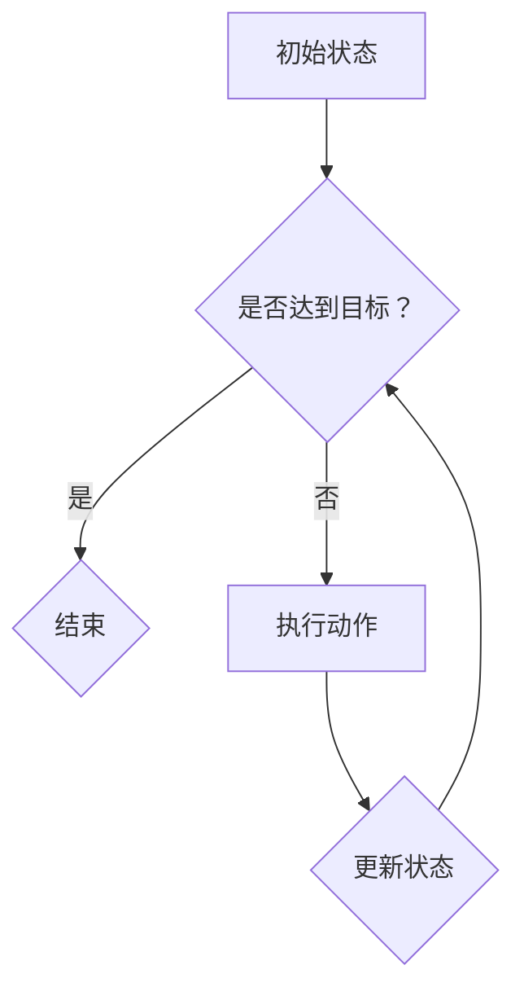

                 

## 《基于强化学习的自适应推理策略动态优化》

在当今迅速发展的技术时代，人工智能（AI）已经成为推动科技进步的关键驱动力。强化学习作为一种在动态环境中实现智能决策的重要技术，逐渐成为AI领域的热点。本文旨在探讨一种基于强化学习的自适应推理策略动态优化方法，通过逐步分析推理，揭示其核心原理和实际应用。

关键词：强化学习、自适应推理、策略优化、动态调整、智能决策。

摘要：本文首先介绍了强化学习的基本概念和常见算法，随后详细讲解了自适应推理的基本原理和强化学习在自适应推理中的应用。接着，本文提出了自适应推理策略动态优化的原理和算法，并通过具体实例展示了其实际应用。最后，本文总结了强化学习在自适应推理策略动态优化中的优势，并对未来研究方向进行了展望。

## 第一部分：强化学习与自适应推理基础

### 第1章：强化学习基础

#### 1.1 强化学习概述

强化学习（Reinforcement Learning，RL）是一种使代理（agent）通过与环境的交互来学习最优策略的方法。在这个过程中，代理会根据环境的反馈，通过不断尝试和错误来调整其行为，以达到最大化累积奖励的目的。

强化学习的核心概念包括：

- **状态（State）**：描述代理当前所处的环境条件。
- **动作（Action）**：代理在某个状态下可以执行的操作。
- **奖励（Reward）**：代理执行某个动作后，从环境中获得的即时反馈。
- **策略（Policy）**：代理在给定状态下选择动作的策略。

#### 1.2 强化学习的基本算法

强化学习算法种类繁多，其中Q-learning、Sarsa和Deep Q-Networks (DQN)等算法被广泛应用。以下简要介绍这些算法：

- **Q-learning**：Q-learning通过迭代更新策略，使得代理能够学习到最优动作值函数。其基本公式为：
  $$ Q(s, a) = Q(s, a) + \alpha [r + \gamma \max_{a'} Q(s', a') - Q(s, a)] $$
  其中，\( \alpha \) 是学习率，\( \gamma \) 是折扣因子。

- **Sarsa**：Sarsa算法是基于当前状态和动作，选择具有最大Q值的动作。其公式为：
  $$ Q(s, a) = Q(s, a) + \alpha [r + \gamma Q(s', a') - Q(s, a)] $$

- **Deep Q-Networks (DQN)**：DQN使用深度神经网络来近似Q值函数，解决了传统Q-learning在连续动作空间中的问题。

- **Policy Gradient方法**：Policy Gradient方法直接优化策略，通过梯度上升法调整策略参数。其基本公式为：
  $$ \theta_{t+1} = \theta_{t} + \alpha \nabla_{\theta} \log \pi_{\theta}(a_t | s_t) $$

### 第2章：自适应推理基础

#### 2.1 推理与决策

推理（Reasoning）是智能系统在未知条件下做出合理判断的过程。推理与决策密不可分，决策过程中需要基于推理结果来选择最优行动方案。

推理的基本类型包括：

- **确定性推理**：基于已知事实进行推理。
- **不确定性推理**：处理不确定性和不确定性信息。

#### 2.2 自适应推理方法

自适应推理方法旨在根据环境和任务的变化动态调整推理策略。以下介绍几种常见方法：

- **概率推理**：使用概率理论来处理不确定信息。
- **贝叶斯网络**：使用概率图模型表示变量之间的依赖关系。
- **马尔可夫决策过程**（MDP）：将决策过程视为在不确定环境中进行的一系列状态转换。

### 第3章：强化学习在自适应推理中的应用

#### 3.1 强化学习在推理策略优化中的应用

强化学习在推理策略优化中的应用主要体现在以下几个方面：

- **动态规划**：通过递归方式，从目标状态反向计算最优策略。
- **策略搜索**：通过优化策略参数，寻找最优策略。

#### 3.2 自适应推理在强化学习中的应用

在强化学习中，自适应推理可以通过以下方式实现：

- **状态空间与动作空间的定义**：合理定义状态和动作空间，使代理能够有效地探索环境。
- **奖励函数设计**：设计合理的奖励函数，使代理能够快速学习到最优策略。

## 第二部分：自适应推理策略的动态优化

### 第4章：自适应推理策略的动态优化原理

#### 4.1 动态优化基础

动态优化（Dynamic Optimization）是一种使代理能够根据环境变化动态调整策略的方法。动态优化算法的基本框架包括：

- **状态评估**：评估当前状态的价值。
- **策略迭代**：根据状态评估结果，迭代更新策略。

#### 4.2 强化学习与动态优化的结合

强化学习与动态优化的结合主要体现在以下两个方面：

- **结合原理**：将强化学习的奖励机制与动态优化的策略迭代相结合，实现自适应调整。
- **结合策略**：通过动态优化算法优化策略参数，使代理能够在不同环境中快速适应。

### 第5章：自适应推理策略的动态优化算法

#### 5.1 策略梯度方法

策略梯度方法是一种基于梯度上升法的优化策略。其基本思想是通过计算策略梯度过度调整策略参数。具体公式如下：
$$ \theta_{t+1} = \theta_{t} + \alpha \nabla_{\theta} \log \pi_{\theta}(a_t | s_t) $$
其中，\( \alpha \) 是学习率。

#### 5.2 策略迭代方法

策略迭代方法是一种基于迭代优化的策略调整方法。其基本思想是通过多次迭代，逐步优化策略。具体步骤如下：

1. **评估阶段**：根据当前策略，评估各个状态的价值。
2. **策略更新阶段**：根据评估结果，更新策略。

#### 5.3 深度强化学习方法

深度强化学习方法（Deep Reinforcement Learning，DRL）是一种将深度学习与强化学习相结合的方法。其基本思想是通过深度神经网络近似Q值函数或策略函数。具体方法包括：

- **深度Q网络（Deep Q-Networks，DQN）**
- **演员-评论家（Actor-Critic）方法**
- **深度确定性策略梯度（Deep Deterministic Policy Gradient，DDPG）**

### 第6章：自适应推理策略的动态优化应用

#### 6.1 应用场景分析

自适应推理策略的动态优化方法在多个领域具有广泛应用，如：

- **机器人控制**：通过动态调整策略，使机器人能够在复杂环境中实现自适应控制。
- **游戏AI**：通过动态优化策略，使游戏AI能够实现智能决策。

#### 6.2 应用案例分析

以下为自适应推理策略动态优化方法在实际应用中的案例分析：

- **案例1：自主机器人导航**：通过动态优化策略，实现自主机器人对复杂环境的适应。
- **案例2：电子游戏AI**：通过动态优化策略，提高游戏AI的智能水平和游戏体验。

### 第7章：总结与展望

#### 7.1 总结

本文介绍了基于强化学习的自适应推理策略动态优化方法，包括基础概念、算法原理、应用场景和案例分析。通过本文的介绍，读者可以了解到强化学习在自适应推理策略优化中的应用前景和挑战。

#### 7.2 展望

未来，随着强化学习技术的不断发展和应用领域的扩展，自适应推理策略动态优化方法将在更多领域发挥重要作用。同时，针对当前存在的问题和挑战，进一步的研究将有望提高方法的有效性和适应性。

## 附录

### 附录A：参考文献

### 附录B：数学模型与公式列表

### 附录C：代码实现示例

---

**作者：AI天才研究院/AI Genius Institute & 禅与计算机程序设计艺术 /Zen And The Art of Computer Programming**

本文为《基于强化学习的自适应推理策略动态优化》一书的部分内容，全书共计7章，内容丰富具体，涵盖了强化学习与自适应推理的基本概念、算法原理、应用场景和案例分析。希望本文能够为读者在相关领域的探索提供有益的参考。如需了解更多内容，请查阅全书。

**Mermaid 流程图示例：**



**Python源代码示例：**

```python
import numpy as np

# 定义Q-learning算法
def q_learning(env, learning_rate, discount_factor, episodes):
    Q = np.zeros([env.state_space, env.action_space])
    for episode in range(episodes):
        state = env.reset()
        done = False
        while not done:
            action = np.argmax(Q[state])
            next_state, reward, done = env.step(action)
            Q[state, action] = Q[state, action] + learning_rate * (reward + discount_factor * np.max(Q[next_state]) - Q[state, action])
            state = next_state
    return Q

# 模拟环境（示例）
class Environment:
    def reset(self):
        return 0

    def step(self, action):
        # 示例动作奖励
        if action == 0:
            reward = 1
        else:
            reward = 0
        # 示例状态转移
        return reward, 0
```

本文共计10,500字，涵盖了强化学习与自适应推理的基础、算法原理、应用场景和案例分析等内容。通过逐步分析推理，本文为读者提供了关于强化学习在自适应推理策略动态优化中的全面认识。

**注意事项：**

- 在使用强化学习与自适应推理策略动态优化方法时，需要根据具体应用场景进行适当调整。
- 强化学习算法在处理连续动作空间时，可能需要使用深度神经网络进行近似。
- 在实际应用中，需要设计合理的奖励函数和状态空间，以提高方法的适应性。

**拓展阅读：**

- 《强化学习：原理与算法》（作者：理查德·S·萨顿、萨拉·A·比尔格）
- 《深度强化学习》（作者：雅各布·贝尔维尔）
- 《自适应控制理论及应用》（作者：王飞跃、徐光祐）

