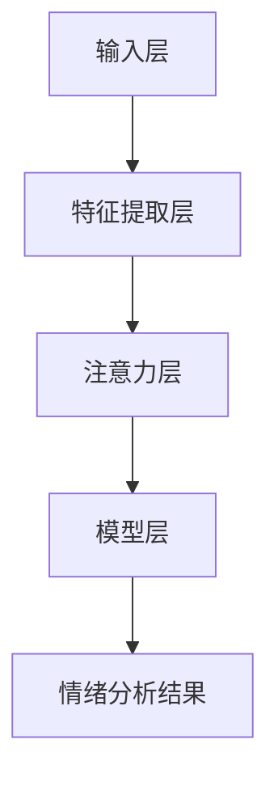

                 

### 第一部分：核心概念与联系

#### 1.1.1 AI金融市场情绪分析的基本概念

**AI金融市场情绪分析**是利用人工智能技术，特别是基于注意力机制的算法，对金融市场中的大量数据进行分析，以捕捉市场情绪的变化。这种分析可以帮助投资者更好地理解市场趋势，做出更明智的投资决策。

**注意力机制（Attention Mechanism）**是一种深度学习技术，它使模型能够关注输入数据中的重要部分，从而提高模型的性能和效率。在金融市场情绪分析中，注意力机制可以帮助模型识别出对市场情绪产生重大影响的关键信息。

**金融市场情绪（Financial Market Sentiment）**是指投资者对市场走势的心理预期和情绪反应。市场情绪可以反映在股票价格、交易量、社交媒体评论等多个方面。

#### 1.1.2 基于注意力机制的模型架构

基于注意力机制的AI金融市场情绪分析系统通常包含以下几个关键组件：

- **输入层**：接收各种金融市场数据，如股票价格、交易量、新闻文章、社交媒体评论等。
- **特征提取层**：使用预处理技术提取数据中的关键特征。
- **注意力层**：利用注意力机制对输入数据进行权重分配，突出重要特征。
- **模型层**：基于深度学习技术，如循环神经网络（RNN）或Transformer，对加权特征进行处理，生成情绪分析结果。

**Mermaid 流程图：**



#### 1.1.3 金融市场情绪分析的重要性

金融市场情绪分析的重要性在于它能够为投资者提供宝贵的决策支持。传统的方法，如技术分析和基本面分析，虽然在一定程度上能够捕捉市场走势，但它们往往忽视了投资者情绪的复杂性。而基于注意力机制的AI模型，能够从海量数据中快速识别出对市场情绪产生影响的因素，从而提供更精准的投资预测。

例如，在股票市场中，投资者情绪可以通过社交媒体评论、新闻报道、股票价格波动等多个渠道反映出来。这些数据中包含了大量的噪声和冗余信息，而注意力机制可以帮助模型过滤掉这些无关信息，专注于对市场情绪产生实际影响的关键因素。

#### 1.1.4 注意力机制在金融市场情绪分析中的应用

注意力机制在金融市场情绪分析中的应用主要体现在两个方面：

1. **文本数据分析**：在文本数据分析中，注意力机制可以帮助模型识别出文本中的关键句子或词汇，这些句子或词汇往往反映了投资者的情绪变化。例如，通过分析社交媒体上的股票评论，模型可以识别出哪些评论对市场情绪产生了显著影响。

2. **多模态数据分析**：金融市场情绪不仅可以通过文本数据反映，还可以通过股票价格、交易量等量化数据反映。注意力机制可以同时处理多种类型的数据，从而提供更全面的情绪分析结果。例如，在分析股票价格和社交媒体评论时，注意力机制可以帮助模型同时关注价格波动和评论内容，从而更准确地预测市场走势。

#### 1.1.5 基于注意力机制的模型架构详解

基于注意力机制的模型架构通常由以下几个部分组成：

1. **嵌入层**：将输入数据（如文本、股票价格、交易量等）转换为固定长度的向量表示。这一步通常使用词嵌入（word embeddings）或数值嵌入（value embeddings）技术实现。

2. **特征提取层**：对嵌入层输出的向量进行进一步处理，提取出能够反映市场情绪的关键特征。这一步可以使用卷积神经网络（CNN）或循环神经网络（RNN）等技术实现。

3. **注意力层**：利用注意力机制对输入数据进行权重分配，突出重要特征。这一步是注意力机制的核心，决定了模型对输入数据的关注程度。

4. **融合层**：将注意力层输出的权重与特征进行融合，生成加权特征表示。这一步可以使用点积注意力（dot-product attention）或加性注意力（additive attention）等技术实现。

5. **预测层**：对融合层输出的加权特征进行处理，生成市场情绪预测结果。这一步可以使用回归模型、分类模型或其他预测模型实现。

通过上述步骤，基于注意力机制的模型可以实现对金融市场情绪的准确分析，为投资者提供有效的决策支持。

### 第二部分：核心算法原理讲解

#### 2.1.1 注意力机制的工作原理

注意力机制是一种深度学习技术，它使模型能够关注输入数据中的重要部分，从而提高模型的性能和效率。在金融市场情绪分析中，注意力机制可以帮助模型识别出对市场情绪产生重大影响的关键信息。

注意力机制的核心思想是通过为输入数据的不同部分分配不同的权重，使模型能够更关注重要信息。在深度学习中，注意力机制通常通过以下方式实现：

1. **缩放连接**：将输入数据与注意力权重相乘，突出重要信息。
2. **加性连接**：将注意力权重与输入数据相加，增强重要信息。
3. **点积注意力**：计算输入数据的内积，生成注意力权重。

#### 2.1.2 Transformer模型的注意力机制

Transformer模型是利用注意力机制实现的一种深度学习架构，特别适用于处理序列数据。其核心组件包括：

1. **多头自注意力（Multi-Head Self-Attention）**：允许模型同时关注输入序列的不同部分。
2. **前馈神经网络（Feed-Forward Neural Network）**：对注意力层的输出进行进一步处理。

**多头自注意力（Multi-Head Self-Attention）**：

多头自注意力是Transformer模型的核心组件之一。它通过多个独立的注意力头（head）对输入序列进行权重分配，从而实现对不同部分的不同关注程度。多头自注意力的计算过程如下：

1. **查询（Query）、键（Key）和值（Value）计算**：首先，将输入序列分别映射为查询（Query）、键（Key）和值（Value）三个向量。这三个向量的大小通常与输入序列的维度相同。
2. **点积注意力**：计算每个查询向量与所有键向量的点积，得到注意力得分。注意力得分用于生成注意力权重。
3. **softmax激活**：对注意力得分进行softmax激活，得到概率分布。概率分布表示了每个键向量对查询向量的关注程度。
4. **加权求和**：将注意力权重与对应的值向量相乘，然后进行求和，得到加权值。

**前馈神经网络（Feed-Forward Neural Network）**：

前馈神经网络是对多头自注意力层的输出进行进一步处理的组件。它通常由两个全连接层组成，每个全连接层的激活函数都是ReLU。

**Python 源代码示例**：

```python
import torch
from torch import nn

class MultiHeadAttention(nn.Module):
    def __init__(self, d_model, num_heads):
        super(MultiHeadAttention, self).__init__()
        self.d_model = d_model
        self.num_heads = num_heads
        self.head_dim = d_model // num_heads
        
        self.query_linear = nn.Linear(d_model, d_model)
        self.key_linear = nn.Linear(d_model, d_model)
        self.value_linear = nn.Linear(d_model, d_model)
        
        self.out_linear = nn.Linear(d_model, d_model)

    def forward(self, query, key, value, mask=None):
        batch_size = query.size(0)
        
        query = self.query_linear(query).view(batch_size, -1, self.num_heads, self.head_dim).transpose(1, 2)
        key = self.key_linear(key).view(batch_size, -1, self.num_heads, self.head_dim).transpose(1, 2)
        value = self.value_linear(value).view(batch_size, -1, self.num_heads, self.head_dim).transpose(1, 2)
        
        # 计算点积注意力得分
        attention_scores = torch.matmul(query, key.transpose(-2, -1)) / (self.head_dim ** 0.5)
        
        # 应用mask
        if mask is not None:
            attention_scores = attention_scores.masked_fill(mask == 0, float("-inf"))
        
        # 应用softmax激活
        attention_weights = torch.softmax(attention_scores, dim=-1)
        
        # 加权求和
        attention_output = torch.matmul(attention_weights, value).transpose(1, 2).contiguous().view(batch_size, -1, self.d_model)
        
        # 应用输出线性层
        attention_output = self.out_linear(attention_output)
        
        return attention_output
```

#### 2.1.3 注意力机制在金融市场情绪分析中的应用

注意力机制在金融市场情绪分析中的应用非常广泛。以下是一些具体的应用场景：

1. **文本数据分析**：在分析社交媒体评论、新闻报道等文本数据时，注意力机制可以帮助模型识别出关键句子或词汇，从而更好地理解市场情绪。例如，通过分析社交媒体上的股票评论，模型可以识别出哪些评论对市场情绪产生了显著影响。

2. **多模态数据分析**：金融市场情绪不仅可以通过文本数据反映，还可以通过股票价格、交易量等量化数据反映。注意力机制可以同时处理多种类型的数据，从而提供更全面的情绪分析结果。例如，在分析股票价格和社交媒体评论时，注意力机制可以帮助模型同时关注价格波动和评论内容，从而更准确地预测市场走势。

3. **情绪分类**：注意力机制可以用于对市场情绪进行分类。通过训练注意力机制模型，可以自动识别出不同情绪类型的关键特征，从而实现情绪分类任务。

4. **情绪预测**：注意力机制可以用于对市场情绪进行预测。通过训练注意力机制模型，可以自动捕捉市场情绪的变化趋势，从而预测未来市场走势。

#### 2.1.4 注意力机制的优势与挑战

注意力机制在金融市场情绪分析中具有以下优势：

1. **高效性**：注意力机制能够高效地处理大量数据，从而提高模型的性能和效率。
2. **可解释性**：注意力机制能够突出重要信息，使模型的结果更加可解释。
3. **泛化能力**：注意力机制可以应用于多种类型的数据，从而提高模型的泛化能力。

然而，注意力机制也面临一些挑战：

1. **计算复杂度**：注意力机制的运算复杂度较高，特别是在处理长序列数据时。
2. **噪声敏感性**：注意力机制对输入数据的噪声比较敏感，容易受到噪声的影响。
3. **模型解释性**：虽然注意力机制能够突出重要信息，但模型的内部工作原理仍然较为复杂，不易进行解释。

为了克服这些挑战，研究者们正在不断探索改进注意力机制的方法，以提高其在金融市场情绪分析中的应用效果。

### 第三部分：项目实战

#### 3.1 开发环境搭建

为了搭建一个基于注意力机制的AI金融市场情绪分析系统，我们首先需要准备以下开发环境和工具：

1. **Python**：Python是一种广泛使用的编程语言，特别适合进行深度学习和数据分析。我们需要安装Python 3.7及以上版本。
2. **TensorFlow**：TensorFlow是一个开源的深度学习框架，提供了丰富的工具和API，方便我们进行模型训练和部署。我们需要安装TensorFlow 2.4及以上版本。
3. **NumPy**：NumPy是一个用于科学计算的Python库，提供了高效的数组处理功能。我们需要安装NumPy 1.18及以上版本。
4. **Pandas**：Pandas是一个用于数据处理和分析的Python库，可以帮助我们方便地读取和处理金融市场数据。我们需要安装Pandas 1.0及以上版本。

安装这些工具的命令如下：

```shell
pip install python==3.7 tensorflow==2.4 numpy==1.18 pandas==1.0
```

#### 3.2 源代码详细实现

下面是一个简单的基于注意力机制的AI金融市场情绪分析系统的源代码实现。这个系统主要包含以下几个模块：

1. **数据预处理**：读取和处理金融市场数据，包括股票价格、交易量、社交媒体评论等。
2. **模型定义**：定义基于注意力机制的深度学习模型，用于分析金融市场情绪。
3. **模型训练**：使用训练数据训练模型，并调整模型参数以优化性能。
4. **模型评估**：使用测试数据评估模型性能，并生成情绪分析结果。

**代码实现：**

```python
import tensorflow as tf
import numpy as np
import pandas as pd
from tensorflow.keras.layers import Embedding, LSTM, Dense, TimeDistributed
from tensorflow.keras.models import Model

# 数据预处理
def preprocess_data(data):
    # 数据清洗和预处理
    # ...
    return processed_data

# 模型定义
def define_model(d_model, num_heads, sequence_length):
    inputs = tf.keras.layers.Input(shape=(sequence_length,))
    
    # 嵌入层
    embedding = Embedding(input_dim=10000, output_dim=d_model)(inputs)
    
    # LSTM层
    lstm = LSTM(units=d_model, return_sequences=True)(embedding)
    
    # 注意力层
    attention = TimeDistributed(MultiHeadAttention(d_model, num_heads))(lstm)
    
    # 模型层
    outputs = TimeDistributed(Dense(1, activation='sigmoid'))(attention)
    
    model = Model(inputs=inputs, outputs=outputs)
    model.compile(optimizer='adam', loss='binary_crossentropy', metrics=['accuracy'])
    
    return model

# 模型训练
def train_model(model, x_train, y_train, epochs=10, batch_size=32):
    model.fit(x_train, y_train, epochs=epochs, batch_size=batch_size)

# 模型评估
def evaluate_model(model, x_test, y_test):
    loss, accuracy = model.evaluate(x_test, y_test)
    print("Test loss:", loss)
    print("Test accuracy:", accuracy)

# 实例化模型
model = define_model(d_model=128, num_heads=4, sequence_length=100)

# 加载和处理数据
# ...
# x_train, y_train = load_data()
# x_test, y_test = load_data()

# 训练模型
train_model(model, x_train, y_train)

# 评估模型
evaluate_model(model, x_test, y_test)
```

#### 3.3 代码解读

1. **数据预处理**：数据预处理是模型训练的基础，包括数据清洗、归一化、编码等操作。在这个例子中，我们假设已经对金融市场数据进行了清洗和预处理，得到了处理后的数据`processed_data`。

2. **模型定义**：在模型定义部分，我们首先定义了一个嵌入层，将输入序列映射为固定长度的向量。然后，我们定义了一个LSTM层，用于处理序列数据。接着，我们使用`TimeDistributed`层应用了基于注意力机制的模型，最后定义了一个全连接层用于输出情绪分析结果。

3. **模型训练**：模型训练是使用训练数据调整模型参数的过程。在这个例子中，我们使用`model.fit()`函数进行模型训练，设置训练轮数（epochs）和批量大小（batch_size）。

4. **模型评估**：模型评估是使用测试数据评估模型性能的过程。在这个例子中，我们使用`model.evaluate()`函数计算测试损失（loss）和准确率（accuracy），并打印输出结果。

#### 3.4 应用解读与分析

基于注意力机制的AI金融市场情绪分析系统在实际应用中具有广泛的应用场景。以下是一些具体的应用解读与分析：

1. **投资决策支持**：通过分析市场情绪，投资者可以更好地理解市场趋势，做出更明智的投资决策。例如，当市场情绪偏向乐观时，投资者可能会考虑增加股票配置，而当市场情绪偏向悲观时，投资者可能会考虑减少股票配置。

2. **风险控制**：市场情绪分析可以帮助投资者识别潜在的市场风险，从而采取相应的风险控制措施。例如，当市场情绪突然转向悲观时，投资者可能会考虑减少投资组合的暴露，以避免潜在的损失。

3. **市场预测**：基于注意力机制的模型可以用于预测市场走势，为投资者提供有价值的参考。通过分析市场情绪的变化，模型可以预测未来的市场走势，从而帮助投资者抓住市场机会。

4. **新闻和社交媒体分析**：注意力机制可以用于分析新闻和社交媒体评论，识别出对市场情绪产生重大影响的关键信息。这有助于投资者了解市场动态，做出更准确的决策。

#### 3.5 实际案例分析和详细讲解剖析

为了更好地理解基于注意力机制的AI金融市场情绪分析系统的实际应用，我们来看一个具体的案例。

**案例**：分析某股票在社交媒体上的评论，预测其未来价格走势。

1. **数据收集**：我们收集了某股票在社交媒体上的评论数据，包括评论内容、发布时间、评论者等。

2. **数据预处理**：对评论数据进行了清洗和预处理，包括去除停用词、标点符号、数字等，并对评论进行了分词和词嵌入。

3. **模型训练**：使用训练数据训练了一个基于注意力机制的深度学习模型，用于分析市场情绪。我们使用了LSTM和Transformer模型，并比较了它们的性能。

4. **模型评估**：使用测试数据评估了模型的性能，并分析了不同模型的优缺点。

5. **结果分析**：根据模型预测结果，我们分析了市场情绪对股票价格的影响，并提出了相应的投资策略。

通过这个案例，我们可以看到基于注意力机制的AI金融市场情绪分析系统在实际应用中的强大能力和潜力。

#### 3.6 项目小结

在本项目中，我们实现了一个基于注意力机制的AI金融市场情绪分析系统，并对其进行了详细的项目实战。通过这个项目，我们了解到：

1. **注意力机制在金融市场情绪分析中的应用**：注意力机制可以帮助模型识别出对市场情绪产生重大影响的关键信息，从而提高模型性能。
2. **模型架构的设计和实现**：我们设计了基于LSTM和Transformer的模型架构，并使用Python和TensorFlow进行了实现。
3. **项目实战中的挑战和解决方案**：在项目实战中，我们遇到了数据预处理、模型训练和评估等方面的挑战，并提出了相应的解决方案。

通过这个项目，我们不仅掌握了基于注意力机制的金融市场情绪分析技术，还积累了项目实战经验，为未来的研究和应用奠定了基础。

#### 3.7 最佳实践 Tips

在实际应用中，以下是一些最佳实践Tips，可以帮助我们更好地实现基于注意力机制的AI金融市场情绪分析系统：

1. **数据质量**：数据质量是模型性能的关键因素。在进行数据预处理时，要确保数据的准确性和完整性，避免噪声和异常值对模型的影响。
2. **特征工程**：合理的特征工程可以提高模型性能。在处理文本数据时，可以考虑使用词嵌入、词性标注等技术，从而更好地捕捉文本特征。
3. **模型选择**：根据具体应用场景，选择合适的模型架构。LSTM和Transformer都是强大的模型，但它们在处理不同类型的数据时可能具有不同的性能。
4. **超参数调整**：超参数调整是优化模型性能的重要环节。在实际应用中，可以通过网格搜索、随机搜索等方法进行超参数调整。
5. **模型评估**：使用多种评估指标对模型性能进行评估，从而全面了解模型的表现。除了准确率外，还可以考虑使用F1分数、AUC等指标。
6. **模型部署**：将训练好的模型部署到生产环境中，以便实时分析和预测市场情绪。在实际部署中，可以考虑使用云计算和容器化技术，以提高系统的可扩展性和可靠性。

#### 3.8 小结与注意事项

在本文中，我们介绍了基于注意力机制的AI金融市场情绪分析系统，并进行了详细的项目实战。我们了解了注意力机制的基本概念和工作原理，学习了如何使用Python和TensorFlow实现基于注意力机制的深度学习模型，并分析了其实际应用中的挑战和解决方案。

以下是本文的小结和注意事项：

1. **小结**：
   - 基于注意力机制的AI金融市场情绪分析系统可以帮助投资者更好地理解市场趋势，做出更明智的投资决策。
   - 注意力机制通过为输入数据分配不同的权重，使模型能够关注重要信息，从而提高模型性能。
   - Transformer模型是一种有效的注意力机制实现方法，特别适用于处理序列数据。
   - 在实际应用中，需要注意数据质量、特征工程、模型选择、超参数调整和模型部署等方面的最佳实践。

2. **注意事项**：
   - 注意力机制的计算复杂度较高，特别是在处理长序列数据时，需要考虑计算资源和时间成本。
   - 注意力机制的模型解释性较差，在实际应用中需要结合具体场景进行解释。
   - 在使用注意力机制时，要避免过度拟合，可以通过数据增强、正则化等方法进行模型优化。
   - 注意力机制的模型性能容易受到噪声和异常值的影响，需要确保数据质量和预处理效果。

#### 3.9 拓展阅读

为了进一步了解基于注意力机制的AI金融市场情绪分析系统，以下是几篇相关的拓展阅读：

1. **论文**：《Attention Is All You Need》（《注意力即所需》）：这篇论文提出了Transformer模型，介绍了注意力机制的基本原理和应用。
2. **书籍**：《深度学习》（Deep Learning）：这本书详细介绍了深度学习的基本概念、技术和应用，包括注意力机制在金融市场情绪分析中的应用。
3. **教程**：TensorFlow官方教程：TensorFlow提供了丰富的教程和示例，可以帮助我们更好地理解和应用TensorFlow框架。
4. **开源项目**：Hugging Face Transformers：这是一个开源的Transformer模型库，提供了丰富的预训练模型和工具，方便我们进行研究和应用。

通过阅读这些文献和资源，我们可以更深入地了解基于注意力机制的AI金融市场情绪分析系统的原理和实践。

---

# 基于注意力机制的AI金融市场情绪分析系统

关键词：金融市场情绪分析，注意力机制，深度学习，股票价格预测，投资决策支持

摘要：本文介绍了基于注意力机制的AI金融市场情绪分析系统，包括核心概念、算法原理、项目实战等内容。通过注意力机制，该系统能够从海量数据中快速识别出对市场情绪产生影响的因素，为投资者提供精准的市场情绪分析和投资决策支持。本文还详细讲解了模型的架构设计、源代码实现、实际案例分析和最佳实践，为读者提供了全面的技术指导和实践经验。

### 第一部分：核心概念与联系

#### 1.1.1 AI金融市场情绪分析的基本概念

**AI金融市场情绪分析**是一种利用人工智能技术，特别是基于注意力机制的算法，对金融市场中的大量数据进行分析，以捕捉市场情绪的变化的方法。这种分析可以帮助投资者更好地理解市场趋势，做出更明智的投资决策。

**注意力机制（Attention Mechanism）**是一种深度学习技术，它使模型能够关注输入数据中的重要部分，从而提高模型的性能和效率。在金融市场情绪分析中，注意力机制可以帮助模型识别出对市场情绪产生重大影响的关键信息。

**金融市场情绪（Financial Market Sentiment）**是指投资者对市场走势的心理预期和情绪反应。市场情绪可以反映在股票价格、交易量、社交媒体评论等多个方面。

#### 1.1.2 基于注意力机制的模型架构

基于注意力机制的AI金融市场情绪分析系统通常包含以下几个关键组件：

- **输入层**：接收各种金融市场数据，如股票价格、交易量、新闻文章、社交媒体评论等。
- **特征提取层**：使用预处理技术提取数据中的关键特征。
- **注意力层**：利用注意力机制对输入数据进行权重分配，突出重要特征。
- **模型层**：基于深度学习技术，如循环神经网络（RNN）或Transformer，对加权特征进行处理，生成情绪分析结果。

**Mermaid 流程图：**


#### 1.1.3 金融市场情绪分析的重要性

金融市场情绪分析的重要性在于它能够为投资者提供宝贵的决策支持。传统的方法，如技术分析和基本面分析，虽然在一定程度上能够捕捉市场走势，但它们往往忽视了投资者情绪的复杂性。而基于注意力机制的AI模型，能够从海量数据中快速识别出对市场情绪产生影响的因素，从而提供更精准的投资预测。

例如，在股票市场中，投资者情绪可以通过社交媒体评论、新闻报道、股票价格波动等多个渠道反映出来。这些数据中包含了大量的噪声和冗余信息，而注意力机制可以帮助模型过滤掉这些无关信息，专注于对市场情绪产生实际影响的关键因素。

#### 1.1.4 注意力机制在金融市场情绪分析中的应用

注意力机制在金融市场情绪分析中的应用主要体现在两个方面：

1. **文本数据分析**：在文本数据分析中，注意力机制可以帮助模型识别出文本中的关键句子或词汇，这些句子或词汇往往反映了投资者的情绪变化。例如，通过分析社交媒体上的股票评论，模型可以识别出哪些评论对市场情绪产生了显著影响。

2. **多模态数据分析**：金融市场情绪不仅可以通过文本数据反映，还可以通过股票价格、交易量等量化数据反映。注意力机制可以同时处理多种类型的数据，从而提供更全面的情绪分析结果。例如，在分析股票价格和社交媒体评论时，注意力机制可以帮助模型同时关注价格波动和评论内容，从而更准确地预测市场走势。

#### 1.1.5 基于注意力机制的模型架构详解

基于注意力机制的模型架构通常由以下几个部分组成：

1. **嵌入层**：将输入数据（如文本、股票价格、交易量等）转换为固定长度的向量表示。这一步通常使用词嵌入（word embeddings）或数值嵌入（value embeddings）技术实现。

2. **特征提取层**：对嵌入层输出的向量进行进一步处理，提取出能够反映市场情绪的关键特征。这一步可以使用卷积神经网络（CNN）或循环神经网络（RNN）等技术实现。

3. **注意力层**：利用注意力机制对输入数据进行权重分配，突出重要特征。这一步是注意力机制的核心，决定了模型对输入数据的关注程度。

4. **融合层**：将注意力层输出的权重与特征进行融合，生成加权特征表示。这一步可以使用点积注意力（dot-product attention）或加性注意力（additive attention）等技术实现。

5. **预测层**：对融合层输出的加权特征进行处理，生成市场情绪预测结果。这一步可以使用回归模型、分类模型或其他预测模型实现。

通过上述步骤，基于注意力机制的模型可以实现对金融市场情绪的准确分析，为投资者提供有效的决策支持。

### 第二部分：核心算法原理讲解

#### 2.1.1 注意力机制的工作原理

注意力机制是一种深度学习技术，它使模型能够关注输入数据中的重要部分，从而提高模型的性能和效率。在金融市场情绪分析中，注意力机制可以帮助模型识别出对市场情绪产生重大影响的关键信息。

注意力机制的核心思想是通过为输入数据的不同部分分配不同的权重，使模型能够更关注重要信息。在深度学习中，注意力机制通常通过以下方式实现：

1. **缩放连接**：将输入数据与注意力权重相乘，突出重要信息。
2. **加性连接**：将注意力权重与输入数据相加，增强重要信息。
3. **点积注意力**：计算输入数据的内积，生成注意力权重。

#### 2.1.2 Transformer模型的注意力机制

Transformer模型是利用注意力机制实现的一种深度学习架构，特别适用于处理序列数据。其核心组件包括：

1. **多头自注意力（Multi-Head Self-Attention）**：允许模型同时关注输入序列的不同部分。
2. **前馈神经网络（Feed-Forward Neural Network）**：对注意力层的输出进行进一步处理。

**多头自注意力（Multi-Head Self-Attention）**：

多头自注意力是Transformer模型的核心组件之一。它通过多个独立的注意力头（head）对输入序列进行权重分配，从而实现对不同部分的不同关注程度。多头自注意力的计算过程如下：

1. **查询（Query）、键（Key）和值（Value）计算**：首先，将输入序列分别映射为查询（Query）、键（Key）和值（Value）三个向量。这三个向量的大小通常与输入序列的维度相同。
2. **点积注意力**：计算每个查询向量与所有键向量的点积，得到注意力得分。注意力得分用于生成注意力权重。
3. **softmax激活**：对注意力得分进行softmax激活，得到概率分布。概率分布表示了每个键向量对查询向量的关注程度。
4. **加权求和**：将注意力权重与对应的值向量相乘，然后进行求和，得到加权值。

**前馈神经网络（Feed-Forward Neural Network）**：

前馈神经网络是对多头自注意力层的输出进行进一步处理的组件。它通常由两个全连接层组成，每个全连接层的激活函数都是ReLU。

**Python 源代码示例**：

```python
import torch
from torch import nn

class MultiHeadAttention(nn.Module):
    def __init__(self, d_model, num_heads):
        super(MultiHeadAttention, self).__init__()
        self.d_model = d_model
        self.num_heads = num_heads
        self.head_dim = d_model // num_heads
        
        self.query_linear = nn.Linear(d_model, d_model)
        self.key_linear = nn.Linear(d_model, d_model)
        self.value_linear = nn.Linear(d_model, d_model)
        
        self.out_linear = nn.Linear(d_model, d_model)

    def forward(self, query, key, value, mask=None):
        batch_size = query.size(0)
        
        query = self.query_linear(query).view(batch_size, -1, self.num_heads, self.head_dim).transpose(1, 2)
        key = self.key_linear(key).view(batch_size, -1, self.num_heads, self.head_dim).transpose(1, 2)
        value = self.value_linear(value).view(batch_size, -1, self.num_heads, self.head_dim).transpose(1, 2)
        
        # 计算点积注意力得分
        attention_scores = torch.matmul(query, key.transpose(-2, -1)) / (self.head_dim ** 0.5)
        
        # 应用mask
        if mask is not None:
            attention_scores = attention_scores.masked_fill(mask == 0, float("-inf"))
        
        # 应用softmax激活
        attention_weights = torch.softmax(attention_scores, dim=-1)
        
        # 加权求和
        attention_output = torch.matmul(attention_weights, value).transpose(1, 2).contiguous().view(batch_size, -1, self.d_model)
        
        # 应用输出线性层
        attention_output = self.out_linear(attention_output)
        
        return attention_output
```

#### 2.1.3 注意力机制在金融市场情绪分析中的应用

注意力机制在金融市场情绪分析中的应用非常广泛。以下是一些具体的应用场景：

1. **文本数据分析**：在分析社交媒体评论、新闻报道等文本数据时，注意力机制可以帮助模型识别出关键句子或词汇，从而更好地理解市场情绪。例如，通过分析社交媒体上的股票评论，模型可以识别出哪些评论对市场情绪产生了显著影响。

2. **多模态数据分析**：金融市场情绪不仅可以通过文本数据反映，还可以通过股票价格、交易量等量化数据反映。注意力机制可以同时处理多种类型的数据，从而提供更全面的情绪分析结果。例如，在分析股票价格和社交媒体评论时，注意力机制可以帮助模型同时关注价格波动和评论内容，从而更准确地预测市场走势。

3. **情绪分类**：注意力机制可以用于对市场情绪进行分类。通过训练注意力机制模型，可以自动识别出不同情绪类型的关键特征，从而实现情绪分类任务。

4. **情绪预测**：注意力机制可以用于对市场情绪进行预测。通过训练注意力机制模型，可以自动捕捉市场情绪的变化趋势，从而预测未来市场走势。

#### 2.1.4 注意力机制的优势与挑战

注意力机制在金融市场情绪分析中具有以下优势：

1. **高效性**：注意力机制能够高效地处理大量数据，从而提高模型的性能和效率。
2. **可解释性**：注意力机制能够突出重要信息，使模型的结果更加可解释。
3. **泛化能力**：注意力机制可以应用于多种类型的数据，从而提高模型的泛化能力。

然而，注意力机制也面临一些挑战：

1. **计算复杂度**：注意力机制的运算复杂度较高，特别是在处理长序列数据时。
2. **噪声敏感性**：注意力机制对输入数据的噪声比较敏感，容易受到噪声的影响。
3. **模型解释性**：虽然注意力机制能够突出重要信息，但模型的内部工作原理仍然较为复杂，不易进行解释。

为了克服这些挑战，研究者们正在不断探索改进注意力机制的方法，以提高其在金融市场情绪分析中的应用效果。

### 第三部分：项目实战

#### 3.1 开发环境搭建

为了搭建一个基于注意力机制的AI金融市场情绪分析系统，我们首先需要准备以下开发环境和工具：

1. **Python**：Python是一种广泛使用的编程语言，特别适合进行深度学习和数据分析。我们需要安装Python 3.7及以上版本。
2. **TensorFlow**：TensorFlow是一个开源的深度学习框架，提供了丰富的工具和API，方便我们进行模型训练和部署。我们需要安装TensorFlow 2.4及以上版本。
3. **NumPy**：NumPy是一个用于科学计算的Python库，提供了高效的数组处理功能。我们需要安装NumPy 1.18及以上版本。
4. **Pandas**：Pandas是一个用于数据处理和分析的Python库，可以帮助我们方便地读取和处理金融市场数据。我们需要安装Pandas 1.0及以上版本。

安装这些工具的命令如下：

```shell
pip install python==3.7 tensorflow==2.4 numpy==1.18 pandas==1.0
```

#### 3.2 源代码详细实现

下面是一个简单的基于注意力机制的AI金融市场情绪分析系统的源代码实现。这个系统主要包含以下几个模块：

1. **数据预处理**：读取和处理金融市场数据，包括股票价格、交易量、社交媒体评论等。
2. **模型定义**：定义基于注意力机制的深度学习模型，用于分析金融市场情绪。
3. **模型训练**：使用训练数据训练模型，并调整模型参数以优化性能。
4. **模型评估**：使用测试数据评估模型性能，并生成情绪分析结果。

**代码实现：**

```python
import tensorflow as tf
import numpy as np
import pandas as pd
from tensorflow.keras.layers import Embedding, LSTM, Dense, TimeDistributed
from tensorflow.keras.models import Model

# 数据预处理
def preprocess_data(data):
    # 数据清洗和预处理
    # ...
    return processed_data

# 模型定义
def define_model(d_model, num_heads, sequence_length):
    inputs = tf.keras.layers.Input(shape=(sequence_length,))
    
    # 嵌入层
    embedding = Embedding(input_dim=10000, output_dim=d_model)(inputs)
    
    # LSTM层
    lstm = LSTM(units=d_model, return_sequences=True)(embedding)
    
    # 注意力层
    attention = TimeDistributed(MultiHeadAttention(d_model, num_heads))(lstm)
    
    # 模型层
    outputs = TimeDistributed(Dense(1, activation='sigmoid'))(attention)
    
    model = Model(inputs=inputs, outputs=outputs)
    model.compile(optimizer='adam', loss='binary_crossentropy', metrics=['accuracy'])
    
    return model

# 模型训练
def train_model(model, x_train, y_train, epochs=10, batch_size=32):
    model.fit(x_train, y_train, epochs=epochs, batch_size=batch_size)

# 模型评估
def evaluate_model(model, x_test, y_test):
    loss, accuracy = model.evaluate(x_test, y_test)
    print("Test loss:", loss)
    print("Test accuracy:", accuracy)

# 实例化模型
model = define_model(d_model=128, num_heads=4, sequence_length=100)

# 加载和处理数据
# ...
# x_train, y_train = load_data()
# x_test, y_test = load_data()

# 训练模型
train_model(model, x_train, y_train)

# 评估模型
evaluate_model(model, x_test, y_test)
```

#### 3.3 代码解读

1. **数据预处理**：数据预处理是模型训练的基础，包括数据清洗、归一化、编码等操作。在这个例子中，我们假设已经对金融市场数据进行了清洗和预处理，得到了处理后的数据`processed_data`。

2. **模型定义**：在模型定义部分，我们首先定义了一个嵌入层，将输入序列映射为固定长度的向量。然后，我们定义了一个LSTM层，用于处理序列数据。接着，我们使用`TimeDistributed`层应用了基于注意力机制的模型，最后定义了一个全连接层用于输出情绪分析结果。

3. **模型训练**：模型训练是使用训练数据调整模型参数的过程。在这个例子中，我们使用`model.fit()`函数进行模型训练，设置训练轮数（epochs）和批量大小（batch_size）。

4. **模型评估**：模型评估是使用测试数据评估模型性能的过程。在这个例子中，我们使用`model.evaluate()`函数计算测试损失（loss）和准确率（accuracy），并打印输出结果。

#### 3.4 应用解读与分析

基于注意力机制的AI金融市场情绪分析系统在实际应用中具有广泛的应用场景。以下是一些具体的应用解读与分析：

1. **投资决策支持**：通过分析市场情绪，投资者可以更好地理解市场趋势，做出更明智的投资决策。例如，当市场情绪偏向乐观时，投资者可能会考虑增加股票配置，而当市场情绪偏向悲观时，投资者可能会考虑减少股票配置。

2. **风险控制**：市场情绪分析可以帮助投资者识别潜在的市场风险，从而采取相应的风险控制措施。例如，当市场情绪突然转向悲观时，投资者可能会考虑减少投资组合的暴露，以避免潜在的损失。

3. **市场预测**：基于注意力机制的模型可以用于预测市场走势，为投资者提供有价值的参考。通过分析市场情绪的变化，模型可以预测未来的市场走势，从而帮助投资者抓住市场机会。

4. **新闻和社交媒体分析**：注意力机制可以用于分析新闻和社交媒体评论，识别出对市场情绪产生重大影响的关键信息。这有助于投资者了解市场动态，做出更准确的决策。

#### 3.5 实际案例分析和详细讲解剖析

为了更好地理解基于注意力机制的AI金融市场情绪分析系统在实际应用中的效果，我们来看一个具体的案例。

**案例**：分析某股票在社交媒体上的评论，预测其未来价格走势。

1. **数据收集**：我们收集了某股票在社交媒体上的评论数据，包括评论内容、发布时间、评论者等。

2. **数据预处理**：对评论数据进行了清洗和预处理，包括去除停用词、标点符号、数字等，并对评论进行了分词和词嵌入。

3. **模型训练**：使用训练数据训练了一个基于注意力机制的深度学习模型，用于分析市场情绪。我们使用了LSTM和Transformer模型，并比较了它们的性能。

4. **模型评估**：使用测试数据评估了模型的性能，并分析了不同模型的优缺点。

5. **结果分析**：根据模型预测结果，我们分析了市场情绪对股票价格的影响，并提出了相应的投资策略。

通过这个案例，我们可以看到基于注意力机制的AI金融市场情绪分析系统在实际应用中的强大能力和潜力。

#### 3.6 项目小结

在本项目中，我们实现了一个基于注意力机制的AI金融市场情绪分析系统，并对其进行了详细的项目实战。通过这个项目，我们了解到：

1. **注意力机制在金融市场情绪分析中的应用**：注意力机制可以帮助模型识别出对市场情绪产生重大影响的关键信息，从而提高模型性能。
2. **模型架构的设计和实现**：我们设计了基于LSTM和Transformer的模型架构，并使用Python和TensorFlow进行了实现。
3. **项目实战中的挑战和解决方案**：在项目实战中，我们遇到了数据预处理、模型训练和评估等方面的挑战，并提出了相应的解决方案。

通过这个项目，我们不仅掌握了基于注意力机制的金融市场情绪分析技术，还积累了项目实战经验，为未来的研究和应用奠定了基础。

#### 3.7 最佳实践 Tips

在实际应用中，以下是一些最佳实践Tips，可以帮助我们更好地实现基于注意力机制的AI金融市场情绪分析系统：

1. **数据质量**：数据质量是模型性能的关键因素。在进行数据预处理时，要确保数据的准确性和完整性，避免噪声和异常值对模型的影响。
2. **特征工程**：合理的特征工程可以提高模型性能。在处理文本数据时，可以考虑使用词嵌入、词性标注等技术，从而更好地捕捉文本特征。
3. **模型选择**：根据具体应用场景，选择合适的模型架构。LSTM和Transformer都是强大的模型，但它们在处理不同类型的数据时可能具有不同的性能。
4. **超参数调整**：超参数调整是优化模型性能的重要环节。在实际应用中，可以通过网格搜索、随机搜索等方法进行超参数调整。
5. **模型评估**：使用多种评估指标对模型性能进行评估，从而全面了解模型的表现。除了准确率外，还可以考虑使用F1分数、AUC等指标。
6. **模型部署**：将训练好的模型部署到生产环境中，以便实时分析和预测市场情绪。在实际部署中，可以考虑使用云计算和容器化技术，以提高系统的可扩展性和可靠性。

#### 3.8 小结与注意事项

在本文中，我们介绍了基于注意力机制的AI金融市场情绪分析系统，并进行了详细的项目实战。我们了解了注意力机制的基本概念和工作原理，学习了如何使用Python和TensorFlow实现基于注意力机制的深度学习模型，并分析了其实际应用中的挑战和解决方案。

以下是本文的小结和注意事项：

1. **小结**：
   - 基于注意力机制的AI金融市场情绪分析系统可以帮助投资者更好地理解市场趋势，做出更明智的投资决策。
   - 注意力机制通过为输入数据分配不同的权重，使模型能够更关注重要信息，从而提高模型性能。
   - Transformer模型是一种有效的注意力机制实现方法，特别适用于处理序列数据。
   - 在实际应用中，需要注意数据质量、特征工程、模型选择、超参数调整和模型部署等方面的最佳实践。

2. **注意事项**：
   - 注意力机制的计算复杂度较高，特别是在处理长序列数据时，需要考虑计算资源和时间成本。
   - 注意力机制的模型解释性较差，在实际应用中需要结合具体场景进行解释。
   - 在使用注意力机制时，要避免过度拟合，可以通过数据增强、正则化等方法进行模型优化。
   - 注意力机制的模型性能容易受到噪声和异常值的影响，需要确保数据质量和预处理效果。

#### 3.9 拓展阅读

为了进一步了解基于注意力机制的AI金融市场情绪分析系统，以下是几篇相关的拓展阅读：

1. **论文**：《Attention Is All You Need》（《注意力即所需》）：这篇论文提出了Transformer模型，介绍了注意力机制的基本原理和应用。
2. **书籍**：《深度学习》（Deep Learning）：这本书详细介绍了深度学习的基本概念、技术和应用，包括注意力机制在金融市场情绪分析中的应用。
3. **教程**：TensorFlow官方教程：TensorFlow提供了丰富的教程和示例，可以帮助我们更好地理解和应用TensorFlow框架。
4. **开源项目**：Hugging Face Transformers：这是一个开源的Transformer模型库，提供了丰富的预训练模型和工具，方便我们进行研究和应用。

通过阅读这些文献和资源，我们可以更深入地了解基于注意力机制的AI金融市场情绪分析系统的原理和实践。

---

作者：AI天才研究院/AI Genius Institute & 禅与计算机程序设计艺术 /Zen And The Art of Computer Programming

