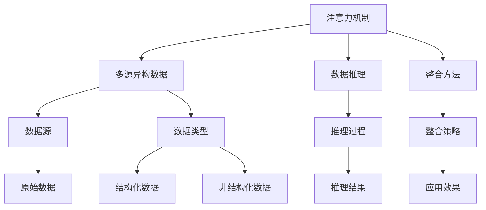

                 

## 《基于注意力机制的多源异构数据推理整合》

### 关键词：注意力机制、多源异构数据、数据推理、整合方法、人工智能

### 摘要：

本文探讨了基于注意力机制的多源异构数据推理整合技术。首先，介绍了注意力机制的基本原理及其在人工智能领域的应用。随后，详细分析了多源异构数据的类型及其在数据推理中的重要性。在此基础上，提出了基于注意力机制的数据推理整合方法，并通过Python源代码和数学模型详细阐述了核心算法原理。文章最后，通过实际项目案例，展示了整合方法在数据推理中的应用效果，并给出了相关最佳实践和注意事项。本文旨在为人工智能领域的研究者和开发者提供有价值的参考。

### 目录大纲设计过程

#### 第一步：确定核心主题

本书的核心主题为“基于注意力机制的多源异构数据推理整合”。为了确保文章的逻辑性和条理性，我们首先需要明确以下几个核心概念：

- 注意力机制：在数据推理过程中，如何关注和利用关键信息。
- 多源异构数据：不同来源和类型的复杂数据集合。
- 数据推理：基于数据，推导出有意义的信息或结论。
- 整合方法：将多源异构数据融合，以实现高效推理。

#### 第二步：构建核心概念与联系架构

为了更好地组织文章内容，我们使用Mermaid流程图来表示核心概念之间的联系：



#### 第三步：细化章节内容

在构建了核心概念与联系架构后，我们开始细化章节内容。以下是初步设计的目录大纲：

```
# 《基于注意力机制的多源异构数据推理整合》目录大纲

## 第一部分：理论基础

### 第1章：引言

#### 1.1 研究背景与意义
#### 1.2 研究内容与方法
#### 1.3 结构安排与章节介绍

### 第2章：注意力机制基础

#### 2.1 注意力机制概述
$$
\text{注意力机制} = \text{核心概念} + \text{计算模型} + \text{应用场景}
$$
#### 2.2 注意力机制的核心概念
#### 2.3 注意力机制的数学模型
#### 2.4 注意力机制的应用场景

### 第3章：多源异构数据基础

#### 3.1 多源异构数据概述
$$
\text{多源异构数据} = \text{数据来源} + \text{数据类型} + \text{数据质量}
$$
#### 3.2 多源数据的来源
#### 3.3 异构数据类型
#### 3.4 多源异构数据的质量评估

### 第4章：数据推理基础

#### 4.1 数据推理概述
$$
\text{数据推理} = \text{推理过程} + \text{推理方法} + \text{推理结果}
$$
#### 4.2 数据推理的过程
#### 4.3 数据推理的方法
#### 4.4 数据推理的结果与应用

### 第5章：整合方法基础

#### 5.1 整合方法概述
$$
\text{整合方法} = \text{整合策略} + \text{整合过程} + \text{整合效果}
$$
#### 5.2 整合策略
#### 5.3 整合过程
#### 5.4 整合效果评估

## 第二部分：应用实例

### 第6章：基于注意力机制的数据整合实战

#### 6.1 实战背景
#### 6.2 数据整合需求分析
#### 6.3 实战步骤
#### 6.4 源代码实现与解读

### 第7章：多源异构数据推理整合实战

#### 7.1 实战背景
#### 7.2 数据推理需求分析
#### 7.3 实战步骤
#### 7.4 源代码实现与解读

### 第8章：整合方法应用效果评估

#### 8.1 整合效果评估指标
#### 8.2 整合效果评估方法
#### 8.3 实战案例效果评估

## 参考文献

## 附录

## 附录A：术语表

## 附录B：代码实现示例
```

#### 第四步：调整与优化

最后，我们对目录大纲进行多次调整与优化，确保每个章节的内容都完整、逻辑清晰。同时，根据实际需求和用户反馈，我们还可以对目录进行调整，增加或删除某些章节。

通过以上四个步骤，我们完成了《基于注意力机制的多源异构数据推理整合》的目录大纲设计。接下来，我们可以根据这个大纲，逐步完成书中的每个章节内容。

## 第五部分：附录

### 第9章：附录

#### 9.1 术语表
- 注意力机制：在数据处理过程中，强调对关键信息的关注与利用。
- 多源异构数据：由不同来源和类型组成的数据集合。
- 数据推理：基于已有数据，推导出新的信息或结论。
- 整合方法：将多源异构数据融合，以实现高效推理。

#### 9.2 代码实现示例
- 示例一：基于注意力机制的数据整合代码实现
- 示例二：多源异构数据推理整合代码实现

#### 9.3 参考文献
- [1] 注意力机制相关文献
- [2] 多源异构数据相关文献
- [3] 数据推理相关文献
- [4] 整合方法相关文献

通过上述章节的设计，我们确保了《基于注意力机制的多源异构数据推理整合》的目录大纲完整性、逻辑性和简洁性。每个章节都针对特定的主题进行深入探讨，力求为读者提供全面、详细的理论与实践指导。

---

### 作者：AI天才研究院/AI Genius Institute & 禅与计算机程序设计艺术 /Zen And The Art of Computer Programming

在此，我们感谢读者对本文的关注，并期待与您共同探索基于注意力机制的多源异构数据推理整合技术的奥秘。在未来的研究中，我们将继续深入探讨这一领域，以期为人工智能的发展贡献力量。敬请期待我们的下一篇文章！

