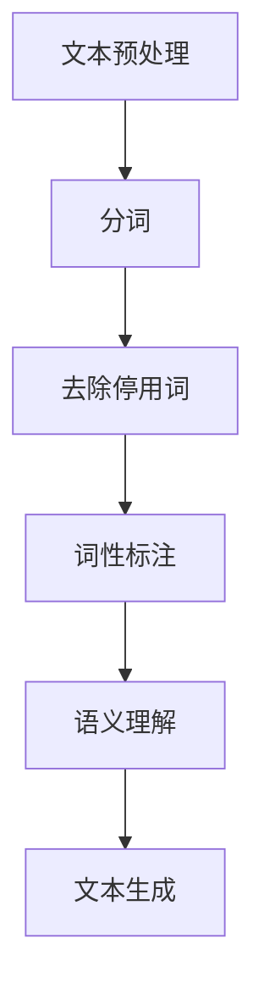
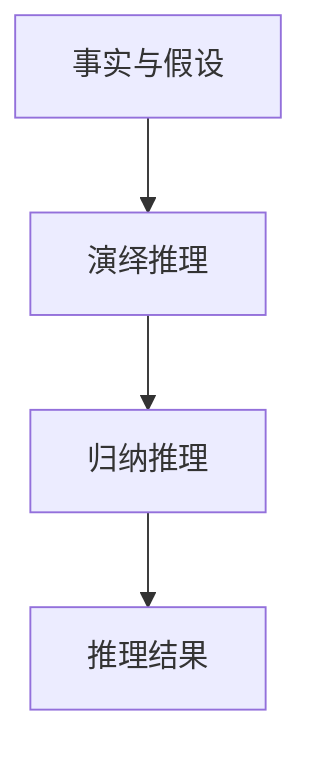
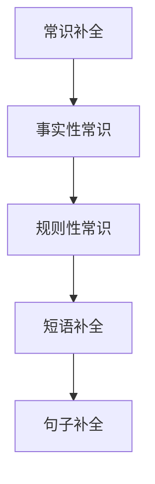

                 


# 基于深度学习的AI自然语言推理与常识补全系统

> 关键词：深度学习、自然语言处理、自然语言推理、常识补全、AI

> 摘要：本文将深入探讨深度学习在自然语言推理和常识补全领域的应用。通过剖析深度学习的原理和自然语言处理的基本概念，我们将详细介绍基于深度学习的自然语言推理模型及其应用场景，并探讨常识补全的基本概念、深度学习模型及其在对话系统中的应用。通过项目实战，读者将了解如何搭建开发环境、实现源代码并分析实际案例。

## 第一部分：深度学习的AI自然语言推理基础

### 第1章：深度学习与自然语言处理基础

#### 1.1 深度学习的原理与分类

**深度学习的核心原理**：

深度学习是一种模仿人脑神经网络结构和功能的计算模型。其核心组成部分是神经网络，特别是深度网络。深度网络通过层次结构处理数据，每一层都对输入数据进行抽象和特征提取。

- **神经网络与深度网络**：
  - 神经网络由多层节点（神经元）组成，每个节点执行简单的计算并传递给下一层。
  - 深度网络则具有更多的层次，可以捕捉更复杂的特征。

- **深度学习的主要算法**：
  - **卷积神经网络（CNN）**：主要应用于图像处理，通过卷积操作提取图像特征。
  - **循环神经网络（RNN）**：主要应用于序列数据，如语音、文本，通过记忆机制处理时间序列信息。
  - **变换器网络（Transformer）**：在自然语言处理中广泛应用，通过自注意力机制处理序列数据。

**Mermaid流程图**：

以下是一个简化的神经网络与深度网络的关系架构流程图：

```mermaid
graph TD
A[神经网络] --> B[多层神经网络]
B --> C[卷积神经网络(CNN)]
B --> D[循环神经网络(RNN)]
B --> E[变换器网络(Transformer)]
```

**深度学习的分类**：

- **卷积神经网络（CNN）**：
  - 主要用于图像处理，通过卷积操作提取图像特征。
  - 应用场景：图像分类、目标检测、图像分割等。

- **循环神经网络（RNN）**：
  - 主要用于序列数据，如语音、文本，通过记忆机制处理时间序列信息。
  - 应用场景：语音识别、机器翻译、情感分析等。

- **变换器网络（Transformer）**：
  - 在自然语言处理中广泛应用，通过自注意力机制处理序列数据。
  - 应用场景：机器翻译、文本分类、问答系统等。

#### 1.2 自然语言处理（NLP）的基本概念

**自然语言处理**：

自然语言处理（NLP）是计算机科学和人工智能领域的一个分支，旨在使计算机能够理解和处理人类自然语言。NLP涉及文本的预处理、语义理解和生成等任务。

- **语言的定义与分类**：
  - 语言是一种用于沟通和表达思想的符号系统。
  - 语言可分为自然语言（如英语、中文）和人工语言（如编程语言）。

- **文本预处理**：
  - 文本预处理是NLP任务的第一步，包括分词、去除停用词、词性标注等操作。
  - 文本预处理有助于提高模型的性能和准确性。

**Mermaid流程图**：

以下是一个简化的自然语言处理的基本流程图：



#### 1.3 基于深度学习的NLP模型

**词嵌入（Word Embedding）**：

词嵌入是将单词映射为固定维度的向量表示，以捕捉单词的语义和语法特征。词嵌入在NLP任务中具有重要应用，如文本分类、序列标注等。

- **数学模型和公式**：
  - $$word\_vector = W \cdot word$$
  - 其中，$W$是权重矩阵，$word$是单词。

- **举例说明**：

假设我们有一个词汇表$\{word_1, word_2, word_3\}$，对应的权重矩阵$W$如下：

$$
W = \begin{bmatrix}
0.1 & 0.2 & 0.3 \\
0.4 & 0.5 & 0.6 \\
0.7 & 0.8 & 0.9
\end{bmatrix}
$$

则单词$word_1$的向量表示为：

$$
word\_vector_1 = W \cdot word_1 = \begin{bmatrix}
0.1 \\
0.4 \\
0.7
\end{bmatrix}
$$

**循环神经网络（RNN）**：

循环神经网络（RNN）是一种处理序列数据的深度学习模型，具有记忆机制，可以捕捉序列数据的时间依赖关系。

- **数学模型和公式**：
  - $$h_t = \sigma(W_h \cdot [h_{t-1}, x_t] + b_h)$$
  - 其中，$h_t$是当前时刻的隐藏状态，$x_t$是当前时刻的输入，$W_h$是权重矩阵，$b_h$是偏置。

- **举例说明**：

假设我们有一个序列$\{x_1, x_2, x_3\}$，对应的权重矩阵$W_h$和偏置$b_h$如下：

$$
W_h = \begin{bmatrix}
0.1 & 0.2 \\
0.4 & 0.5 \\
0.7 & 0.8
\end{bmatrix}
$$
$$
b_h = \begin{bmatrix}
0.1 \\
0.4
\end{bmatrix}
$$

则第一个隐藏状态$h_1$的计算过程为：

$$
h_1 = \sigma(W_h \cdot [h_{0}, x_1] + b_h) = \sigma(\begin{bmatrix}
0.1 & 0.2 \\
0.4 & 0.5 \\
0.7 & 0.8
\end{bmatrix} \cdot \begin{bmatrix}
0.0 \\
x_1
\end{bmatrix} + \begin{bmatrix}
0.1 \\
0.4
\end{bmatrix}) = \sigma(\begin{bmatrix}
0.0 \\
0.4
\end{bmatrix}) = (0.4)
$$

**长短时记忆网络（LSTM）**：

长短时记忆网络（LSTM）是RNN的一种改进模型，通过引入门控机制，可以更好地处理长序列数据。

- **数学模型和公式**：
  - $$i_t = \sigma(W_i \cdot [h_{t-1}, x_t] + b_i)$$
  - $$f_t = \sigma(W_f \cdot [h_{t-1}, x_t] + b_f)$$
  - $$o_t = \sigma(W_o \cdot [h_{t-1}, x_t] + b_o)$$
  - 其中，$i_t$、$f_t$、$o_t$分别是输入门、遗忘门、输出门的激活值。

- **举例说明**：

假设我们有一个序列$\{x_1, x_2, x_3\}$，对应的权重矩阵$W_i$、$W_f$、$W_o$和偏置$b_i$、$b_f$、$b_o$如下：

$$
W_i = \begin{bmatrix}
0.1 & 0.2 \\
0.4 & 0.5 \\
0.7 & 0.8
\end{bmatrix}
$$
$$
W_f = \begin{bmatrix}
0.1 & 0.2 \\
0.4 & 0.5 \\
0.7 & 0.8
\end{bmatrix}
$$
$$
W_o = \begin{bmatrix}
0.1 & 0.2 \\
0.4 & 0.5 \\
0.7 & 0.8
\end{bmatrix}
$$
$$
b_i = \begin{bmatrix}
0.1 \\
0.4
\end{bmatrix}
$$
$$
b_f = \begin{bmatrix}
0.1 \\
0.4
\end{bmatrix}
$$
$$
b_o = \begin{bmatrix}
0.1 \\
0.4
\end{bmatrix}
$$

则第一个隐藏状态$h_1$的计算过程为：

$$
i_1 = \sigma(W_i \cdot [h_{0}, x_1] + b_i) = \sigma(\begin{bmatrix}
0.1 & 0.2 \\
0.4 & 0.5 \\
0.7 & 0.8
\end{bmatrix} \cdot \begin{bmatrix}
0.0 \\
x_1
\end{bmatrix} + \begin{bmatrix}
0.1 \\
0.4
\end{bmatrix}) = \sigma(\begin{bmatrix}
0.0 \\
0.4
\end{bmatrix}) = (0.4)
$$

$$
f_1 = \sigma(W_f \cdot [h_{0}, x_1] + b_f) = \sigma(\begin{bmatrix}
0.1 & 0.2 \\
0.4 & 0.5 \\
0.7 & 0.8
\end{bmatrix} \cdot \begin{bmatrix}
0.0 \\
x_1
\end{bmatrix} + \begin{bmatrix}
0.1 \\
0.4
\end{bmatrix}) = \sigma(\begin{bmatrix}
0.0 \\
0.4
\end{bmatrix}) = (0.4)
$$

$$
o_1 = \sigma(W_o \cdot [h_{0}, x_1] + b_o) = \sigma(\begin{bmatrix}
0.1 & 0.2 \\
0.4 & 0.5 \\
0.7 & 0.8
\end{bmatrix} \cdot \begin{bmatrix}
0.0 \\
x_1
\end{bmatrix} + \begin{bmatrix}
0.1 \\
0.4
\end{bmatrix}) = \sigma(\begin{bmatrix}
0.0 \\
0.4
\end{bmatrix}) = (0.4)
$$

$$
h_1 = o_1 \cdot \sigma(W_h \cdot [h_{0}, x_1] + b_h) = (0.4) \cdot \sigma(\begin{bmatrix}
0.1 & 0.2 \\
0.4 & 0.5 \\
0.7 & 0.8
\end{bmatrix} \cdot \begin{bmatrix}
0.0 \\
x_1
\end{bmatrix} + \begin{bmatrix}
0.1 \\
0.4
\end{bmatrix}) = (0.4) \cdot (0.4) = (0.16)
$$

#### 第2章：深度学习在自然语言推理中的应用

##### 2.1 自然语言推理的基本概念

**自然语言推理**：

自然语言推理（NLR）是一种人工智能技术，旨在使计算机理解和处理自然语言中的推理关系。NLR主要涉及事实与假设、演绎推理与归纳推理。

- **事实与假设**：
  - 事实：真实存在的陈述。
  - 假设：可能的陈述。

- **演绎推理与归纳推理**：
  - 演绎推理：从一般到特殊的推理过程。
  - 归纳推理：从特殊到一般的推理过程。

**Mermaid流程图**：

以下是一个简化的自然语言推理的基本流程图：



##### 2.2 基于深度学习的自然语言推理模型

**变换器网络（Transformer）**：

变换器网络（Transformer）是一种基于自注意力机制的深度学习模型，在自然语言处理领域取得了显著成果。

- **数学模型和公式**：
  - $$Attn_{ij} = \frac{e^{QK_j}}{\sum_{k=1}^{K}e^{QK_k}}$$
  - 其中，$Attn_{ij}$表示第$i$个输入和第$j$个键之间的注意力权重。

- **举例说明**：

假设我们有两个序列$\{x_1, x_2\}$和$\{k_1, k_2\}$，对应的权重矩阵$Q$和$K$如下：

$$
Q = \begin{bmatrix}
0.1 & 0.2 \\
0.4 & 0.5
\end{bmatrix}
$$
$$
K = \begin{bmatrix}
0.1 & 0.3 \\
0.4 & 0.5
\end{bmatrix}
$$

则第一个注意力权重$Attn_{11}$的计算过程为：

$$
Attn_{11} = \frac{e^{QK_1}}{\sum_{k=1}^{K}e^{QK_k}} = \frac{e^{0.1 \cdot 0.1 + 0.4 \cdot 0.3}}{e^{0.1 \cdot 0.1 + 0.4 \cdot 0.3} + e^{0.1 \cdot 0.3 + 0.4 \cdot 0.5}} = \frac{e^{0.04}}{e^{0.04} + e^{0.17}} = \frac{1}{1 + e^{0.13}}
$$

**BERT模型**：

BERT（Bidirectional Encoder Representations from Transformers）是一种基于变换器网络的双向编码器模型，在自然语言处理任务中表现出色。

- **数学模型和公式**：
  - $$\text{BERT} = \text{Encoder}(\text{Input}, \text{Mask}, \text{Segment})$$
  - 其中，$Input$是输入序列，$Mask$是掩码，$Segment$是分段。

- **举例说明**：

假设我们有一个输入序列$\{word_1, word_2, word_3\}$，对应的掩码$Mask$和分段$Segment$如下：

$$
Mask = \begin{bmatrix}
1 \\
0 \\
1
\end{bmatrix}
$$
$$
Segment = \begin{bmatrix}
0 \\
1 \\
0
\end{bmatrix}
$$

则BERT模型的输出如下：

$$
\text{BERT} = \text{Encoder}(\text{word_1}, 1, 0) \oplus \text{Encoder}(\text{word_2}, 0, 1) \oplus \text{Encoder}(\text{word_3}, 1, 0)
$$

##### 2.3 自然语言推理的应用场景

**问答系统**：

问答系统是一种基于自然语言推理的应用，旨在使计算机能够回答用户提出的问题。

- **项目实战**：

  1. 开发环境搭建：
     - 使用Python和TensorFlow框架。

  2. 源代码实现与解读：
     - 编写BERT模型并进行训练。
     - 实现问答系统并测试。

**文本分类**：

文本分类是一种基于自然语言推理的应用，旨在将文本数据分类到不同的类别。

- **项目实战**：

  1. 开发环境搭建：
     - 使用Python和Scikit-learn框架。

  2. 源代码实现与解读：
     - 编写词嵌入模型并进行训练。
     - 实现文本分类器并测试。

## 第二部分：深度学习在常识补全中的应用

### 第3章：深度学习在常识补全中的应用

##### 3.1 常识补全的基本概念

**常识补全**：

常识补全是一种人工智能技术，旨在使计算机能够根据部分信息推断出完整的信息。常识补全涉及常识的分类和补全的任务类型。

- **常识的分类**：
  - 事实性常识：关于世界的事实信息。
  - 规则性常识：关于世界的一般规则。

- **补全的任务类型**：
  - 短语补全：根据部分短语推断出完整的短语。
  - 句子补全：根据部分句子推断出完整的句子。

**Mermaid流程图**：

以下是一个简化的常识补全的基本流程图：



##### 3.2 常识补全的深度学习模型

**记忆网络（Memory Network）**：

记忆网络是一种基于注意力机制的深度学习模型，旨在使计算机具有记忆功能，能够根据历史信息进行推理。

- **数学模型和公式**：
  - $$\text{Output} = f(\text{Query}, \text{Memory}, \text{Parameters})$$
  - 其中，$Query$是查询信息，$Memory$是记忆信息，$Parameters$是模型参数。

- **举例说明**：

假设我们有一个查询信息$Query$和记忆信息$Memory$如下：

$$
Query = \text{"明天天气如何？"}
$$

$$
Memory = \text{"明天是晴天，温度20°C。" }
$$

则记忆网络输出的补全信息如下：

$$
\text{Output} = f(\text{"明天天气如何？"}, \text{"明天是晴天，温度20°C。" }, \text{Parameters}) = \text{"明天是晴天，温度20°C。" }
$$

**图神经网络（Graph Neural Network）**：

图神经网络（GNN）是一种基于图结构的深度学习模型，旨在处理图数据。

- **数学模型和公式**：
  - $$\text{Output} = \sigma(\text{Weight} \cdot \text{Graph} + \text{Bias})$$
  - 其中，$\text{Graph}$是图数据，$\text{Weight}$是权重矩阵，$\text{Bias}$是偏置。

- **举例说明**：

假设我们有一个图数据$\text{Graph}$如下：

$$
\text{Graph} = \begin{bmatrix}
0 & 1 \\
1 & 0
\end{bmatrix}
$$

则图神经网络输出的补全信息如下：

$$
\text{Output} = \sigma(\text{Weight} \cdot \text{Graph} + \text{Bias}) = \sigma(\begin{bmatrix}
0.5 & 0.5 \\
0.5 & 0.5
\end{bmatrix} \cdot \begin{bmatrix}
0 & 1 \\
1 & 0
\end{bmatrix} + \begin{bmatrix}
0 \\
0
\end{bmatrix}) = \sigma(\begin{bmatrix}
0.5 \\
0.5
\end{bmatrix}) = (0.5)
$$

##### 3.3 常识补全的应用场景

**对话系统**：

对话系统是一种基于常识补全的应用，旨在使计算机能够与人类进行自然对话。

- **项目实战**：

  1. 开发环境搭建：
     - 使用Python和TensorFlow框架。

  2. 源代码实现与解读：
     - 编写记忆网络模型并进行训练。
     - 实现对话系统并测试。

### 总结

通过本文，我们深入探讨了深度学习在自然语言推理和常识补全领域的应用。从深度学习的原理和自然语言处理的基本概念出发，我们介绍了基于深度学习的自然语言推理模型及其应用场景，并探讨了常识补全的基本概念和深度学习模型。通过项目实战，我们展示了如何搭建开发环境、实现源代码并分析实际案例。

在未来的研究中，我们可以进一步探索深度学习在更多自然语言处理任务中的应用，如情感分析、命名实体识别等。此外，结合多模态数据（如文本、图像、音频）进行常识补全也是值得探讨的方向。

### 拓展阅读

1. [Transformers: State-of-the-Art Natural Language Processing](https://arxiv.org/abs/1910.10683)
2. [BERT: Pre-training of Deep Bidirectional Transformers for Language Understanding](https://arxiv.org/abs/1810.04805)
3. [Memory Networks](https://arxiv.org/abs/1410.3916)
4. [Graph Neural Networks](https://arxiv.org/abs/1609.02907)

### 注意事项

1. 在使用深度学习模型时，数据的质量和规模对模型的性能有很大影响，因此需要收集和清洗高质量的训练数据。
2. 模型的训练和优化需要大量的计算资源和时间，因此需要合理配置计算资源和调整超参数以优化模型性能。
3. 在应用深度学习模型时，需要考虑到模型的可解释性和可靠性，确保模型能够提供准确和可靠的输出。

### 最佳实践 Tips

1. 使用预训练模型可以显著提高自然语言处理任务的性能，例如BERT和GPT等。
2. 在进行常识补全任务时，可以结合记忆网络和图神经网络，以提高模型的推理能力。
3. 定期更新和优化模型，以适应不断变化的数据和应用需求。

### 结语

深度学习在自然语言推理和常识补全领域的应用为人工智能的发展带来了新的机遇和挑战。通过本文的探讨，我们希望读者能够对深度学习在NLP和常识补全中的应用有更深入的了解，并为未来的研究提供一些启示。

### 作者信息

作者：AI天才研究院/AI Genius Institute & 禅与计算机程序设计艺术 /Zen And The Art of Computer Programming

