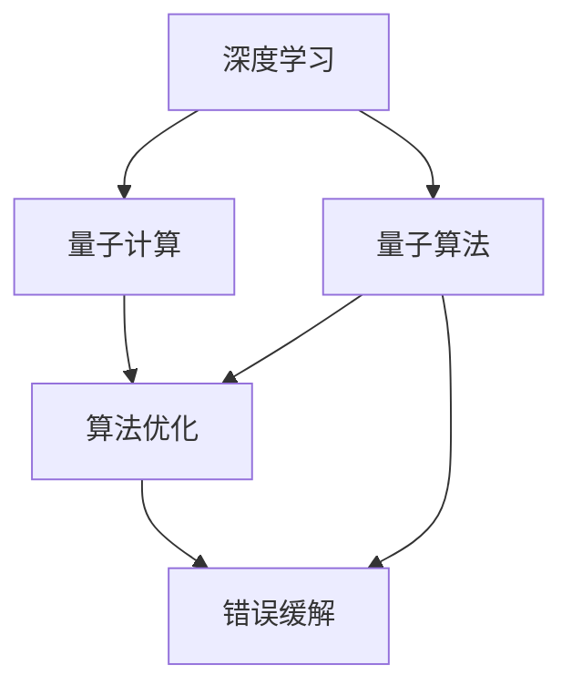

                 

### 引言

随着计算机科学和量子物理学的不断发展，深度学习和量子计算这两个领域逐渐显现出强大的潜力。它们不仅在各自的应用领域中取得了显著成就，而且在交叉融合中更是展现了无尽的前景。本文旨在探讨基于深度学习的AI量子算法优化与错误缓解，从多角度解析这一前沿领域的核心问题。

**深度学习**是一种通过模拟人脑神经网络进行学习和处理信息的人工智能技术。其发展历程可以追溯到1980年代，经过几十年的研究，现在已经成为了人工智能领域的核心技术之一。深度学习通过多层神经网络的结构，能够自动从大量数据中提取特征，从而在图像识别、语音识别、自然语言处理等领域取得了令人瞩目的成果。

**量子计算**则是一种基于量子力学原理的新型计算模式。与传统的二进制计算机不同，量子计算机使用量子位（qubit）作为信息存储和处理的基本单位，利用量子叠加和量子纠缠等特性，能够实现并行计算和指数级的计算速度提升。量子计算自20世纪80年代提出以来，一直在理论和实验研究中取得了一系列重要突破，为解决经典计算中难以处理的问题提供了新的可能性。

在量子计算和深度学习这两个领域的基础上，**算法优化**和**错误缓解**成为了关键议题。算法优化旨在提高计算效率和准确性，通过改进算法设计、优化算法参数等方法，使得计算过程更加高效。而错误缓解则关注于量子计算中的错误率问题，由于量子系统本身的脆弱性和外部干扰，量子计算中的错误率较高，如何有效缓解这些错误对量子计算的实际应用至关重要。

**量子算法**是将量子计算原理应用于特定问题的算法，如量子计算中的Shor算法和Grover算法等，这些算法在特定问题上展示了超越经典算法的性能。将深度学习引入量子计算，不仅能够优化量子算法，还能在量子计算中实现更复杂的机器学习任务。

本文将首先介绍深度学习和量子计算的基本概念和原理，然后深入探讨算法优化和错误缓解在量子计算中的重要性。接着，我们将结合Python源代码，详细讲解量子算法的实现原理和数学模型，并通过实际案例展示深度学习和量子计算在实际应用中的结合。最后，本文将对未来展望进行探讨，分析量子计算和深度学习领域的发展趋势和潜在应用前景。

通过本文的探讨，我们希望读者能够对基于深度学习的AI量子算法优化与错误缓解有更深入的理解，为这一前沿领域的研究和应用提供有益的启示。

### 核心概念与联系

在《基于深度学习的AI量子算法优化与错误缓解》中，核心概念包括深度学习、量子计算、算法优化和错误缓解。为了更清晰地理解这些概念及其相互关系，我们可以使用Mermaid流程图来展示它们之间的联系。

以下是一个简化的Mermaid流程图，用于展示这些核心概念之间的关系：



**深度学习（A）**：
深度学习是一种通过多层神经网络进行数据处理的机器学习方法。它通过学习大量数据中的特征，能够实现复杂的任务，如图像识别、自然语言处理和语音识别。深度学习为人工智能的发展提供了强大的工具，是现代人工智能技术的基础。

**量子计算（B）**：
量子计算是一种利用量子位（qubit）进行信息处理的新型计算模式。量子计算利用量子叠加和量子纠缠的特性，能够实现超乎传统的计算能力。量子计算机在处理特定类型的问题上，如因数分解和搜索问题，展示出了超越经典计算机的性能。

**算法优化（C）**：
算法优化是指通过改进算法设计或参数调整来提高算法的效率、准确性和稳定性。在量子计算中，算法优化尤为重要，因为量子计算机的计算过程容易受到外部干扰，导致计算结果出现误差。通过优化算法，可以提高量子计算机的计算效率和准确性。

**错误缓解（D）**：
错误缓解是指通过多种技术手段来减少或纠正量子计算中的错误率。量子计算机在操作过程中，由于量子态的脆弱性，容易出现错误。错误缓解技术，如量子纠错和冗余编码，是确保量子计算可靠性的关键。

**量子算法（E）**：
量子算法是利用量子计算原理解决特定问题的算法。例如，Shor算法可以高效地进行因数分解，Grover算法可以加速搜索算法。量子算法在特定问题上展示了优越的性能，为量子计算机的实际应用提供了可能。

通过这个Mermaid流程图，我们可以清晰地看到这些核心概念之间的联系。深度学习通过量子算法与量子计算结合，利用算法优化和错误缓解技术，共同推动人工智能领域的发展。

### 第1章 深度学习基础

**1.1 深度学习简介**

深度学习是一种通过模拟人脑神经网络进行学习和处理信息的人工智能技术。它起源于1980年代，随着计算能力和数据量的增长，近年来取得了显著的进展。深度学习的核心思想是使用多层神经网络（也称为深度神经网络）来对数据进行自动特征提取和学习。这一过程通常被称为“层次化学习”，因为每个层次的网络都能够提取更高层次的特征信息。

深度学习的发展历程可以分为几个阶段。起初，简单的神经网络模型如感知机（Perceptron）和反向传播算法（Backpropagation）被提出，但它们在处理复杂任务时效果有限。随着计算能力的提升和大数据技术的发展，深度神经网络（DNN）开始崭露头角。2006年，Geoffrey Hinton等人重新激发了深度学习的兴趣，并引入了深度信念网络（DBN）和深度卷积网络（DCN）。

近年来，深度学习在多个领域取得了突破性成果。例如，在图像识别方面，深度卷积网络（CNN）成功挑战了传统的图像处理方法，实现了高精度的物体识别和分类。在自然语言处理方面，循环神经网络（RNN）和长短时记忆网络（LSTM）等模型在机器翻译、文本生成等领域表现出色。此外，深度学习还在语音识别、游戏AI和自动驾驶等领域展现了强大的能力。

**深度学习的重要性**

深度学习在现代科技中的应用越来越广泛，它不仅改变了人工智能领域的格局，也对许多行业产生了深远的影响。以下是深度学习的重要性：

1. **自动化和智能化**：深度学习能够自动从大量数据中提取特征，实现自动化和智能化的任务处理。例如，在工业生产中，深度学习可以用于设备故障检测和优化生产流程。
   
2. **高效的数据处理**：深度学习模型可以通过并行计算和分布式计算，高效地处理大规模数据。这使得深度学习在处理复杂数据任务时，比传统的机器学习方法更具优势。

3. **跨领域应用**：深度学习技术可以广泛应用于图像识别、自然语言处理、语音识别等多个领域。这种跨领域的应用潜力，使得深度学习成为推动科技发展的重要力量。

**深度学习的基本算法**

深度学习的基本算法包括神经网络、卷积神经网络（CNN）和循环神经网络（RNN）等。

1. **神经网络（Neural Network）**：
   神经网络是深度学习的基础模型，它由大量的神经元组成，每个神经元接收多个输入，通过加权求和后加上偏置，再通过激活函数进行非线性变换，从而输出结果。神经网络的核心是反向传播算法（Backpropagation），它通过梯度下降法更新网络的权重和偏置，以最小化损失函数。

2. **卷积神经网络（Convolutional Neural Network，CNN）**：
   CNN是一种专门用于处理图像数据的神经网络模型。它通过卷积操作和池化操作来提取图像特征，具有局部连接和参数共享的特点。CNN在图像分类、物体检测和图像生成等领域表现优异。

3. **循环神经网络（Recurrent Neural Network，RNN）**：
   RNN是一种能够处理序列数据的神经网络模型。它通过循环连接和隐藏状态来记忆历史信息，适合处理时间序列数据、语言建模和机器翻译等任务。RNN的变种包括长短时记忆网络（LSTM）和门控循环单元（GRU），它们在处理长序列数据时具有更强的记忆能力。

**深度学习框架**

为了简化深度学习的实现过程，开发者使用了多种深度学习框架，如TensorFlow和PyTorch。这些框架提供了丰富的库函数和工具，使得深度学习模型的搭建、训练和部署变得更加便捷。

1. **TensorFlow**：
   TensorFlow是由谷歌开发的开源深度学习框架，它提供了丰富的计算图操作和高层API。TensorFlow能够支持多种类型的深度学习模型，并具有良好的可扩展性和灵活性。

2. **PyTorch**：
   PyTorch是由Facebook开发的开源深度学习框架，它采用动态计算图，使得模型的构建和调试更加直观和方便。PyTorch具有良好的社区支持和丰富的文档资源，成为许多深度学习研究者和开发者首选的框架。

**深度学习的应用实例**

深度学习在多个领域取得了显著的成果，以下是一些典型的应用实例：

1. **图像识别**：
   深度学习模型在图像识别任务中取得了超越传统方法的精度。例如，基于CNN的模型在ImageNet图像分类比赛中多次夺冠，达到了超过人类水平的识别准确率。

2. **自然语言处理**：
   深度学习在自然语言处理领域取得了重大突破。例如，基于RNN和Transformer的模型在机器翻译、文本生成和情感分析等任务上表现出色，提高了处理效率和准确性。

3. **语音识别**：
   深度学习模型在语音识别任务中也发挥了重要作用。通过结合深度神经网络和循环神经网络，模型能够准确识别语音信号，并在实时语音交互和语音助手等应用中得到了广泛应用。

4. **自动驾驶**：
   深度学习技术在自动驾驶领域展示了强大的潜力。通过使用深度神经网络和卷积神经网络，自动驾驶系统可以准确识别道路场景、障碍物和交通信号，实现了高精度的自动驾驶。

通过以上内容，我们对深度学习有了初步的了解。接下来，我们将进一步探讨量子计算的基础知识，以及量子计算和深度学习之间的联系。

### 第2章 量子计算基础

**2.1 量子计算机的原理**

量子计算机是一种利用量子力学原理进行信息处理的新型计算设备。与传统的经典计算机不同，量子计算机的基本单位是量子位（qubit），而不是二进制位（bit）。量子位具有叠加性和纠缠性两种独特性质，使得量子计算机在特定任务上能够超越经典计算机。

**量子位（Qubit）**

量子位是量子计算机的基本存储单元，它不仅可以表示0和1的线性组合，即叠加态，还可以与其他量子位进行量子纠缠。量子位的叠加态可以表示为：

\[|\psi\rangle = \alpha|0\rangle + \beta|1\rangle\]

其中，\(|0\rangle\)和\(|1\rangle\)分别表示量子位的基态，\(\alpha\)和\(\beta\)是复数概率幅。量子位的叠加态意味着它同时处于0和1的状态，这为量子计算机提供了并行处理的能力。

**量子叠加**

量子叠加是指量子位可以同时处于多个状态的组合，而不是经典计算中的单一状态。例如，一个量子位可以同时处于0和1的叠加态，两个量子位可以处于00、01、10、11的叠加态，三个量子位可以处于8种状态的叠加态。这种叠加性质使得量子计算机在处理复杂问题时能够并行计算多种可能性，从而显著提高计算效率。

**量子纠缠**

量子纠缠是量子计算中的另一重要特性，指的是两个或多个量子位之间形成的特殊关联。当两个量子位处于纠缠态时，一个量子位的测量结果会立即影响到另一个量子位的测量结果，无论它们之间的距离有多远。这种纠缠性质为量子计算机提供了强大的量子并行性和纠缠通信能力。

**量子算法**

量子算法是利用量子计算机的叠加和纠缠特性来解决特定问题的算法。与经典算法不同，量子算法在特定问题上能够显著提高计算速度。以下介绍两种经典量子算法：

**Shor算法**

Shor算法是一种用于因数分解的量子算法，能够将一个大规模的合数分解为其质因数。Shor算法利用量子计算机的叠加和纠缠特性，将问题分解为多个子问题，并快速找到质因数。Shor算法的提出打破了经典计算机在因数分解问题上的瓶颈，对密码学等领域产生了深远影响。

**Grover算法**

Grover算法是一种用于搜索未排序数据库的量子算法，能够在经典计算机所需查询次数的平方根时间内完成搜索任务。Grover算法利用量子叠加和纠缠特性，将搜索过程并行化，从而显著提高搜索效率。Grover算法在数据分析和优化问题中具有广泛的应用前景。

**量子计算机的发展与应用**

量子计算机的发展经历了多个阶段，从理论模型到实验验证，再到实用化研究。目前，量子计算机已经取得了显著的进展，但仍然面临着许多技术挑战。以下是一些量子计算机的发展和应用领域：

**1. 物理研究**

量子计算机在物理研究中具有广泛的应用前景，如量子模拟、量子计算辅助的物理模型验证等。量子模拟可以模拟复杂的量子系统，帮助科学家更好地理解物质的性质和行为。

**2. 密码学**

量子计算机在密码学中具有潜在的应用价值，如量子密钥分发和量子密码学。量子计算机能够破解传统加密算法，但也能提供更安全的量子加密技术。

**3. 数据分析**

量子计算机在数据分析领域具有优势，如大数据处理、优化问题和机器学习任务。量子计算机能够快速处理大规模数据集，提高数据分析的效率。

**4. 材料科学**

量子计算机在材料科学中可以用于材料设计和优化，如寻找新材料和模拟材料性质。量子计算辅助的材料研究有助于推动新材料的发展和应用。

**5. 医疗**

量子计算机在医疗领域具有潜在的应用价值，如基因组分析、药物设计和医学图像处理。量子计算可以提高医疗数据分析的精度和效率，有助于医学研究的进展。

**面临的挑战**

尽管量子计算机具有巨大的潜力，但实现实用化的量子计算机仍然面临许多挑战。以下是一些主要挑战：

**1. 量子纠错**

量子计算机的量子位容易受到外部干扰和噪声的影响，导致计算错误。量子纠错技术是确保量子计算可靠性的关键，但实现高效的量子纠错技术仍然具有挑战性。

**2. 物理实现**

量子计算机需要利用特定的物理系统（如离子阱、超导电路等）来实现量子位的操作和存储。这些物理系统的稳定性和可控性是量子计算机实现实用化的关键。

**3. 温度控制**

量子计算机需要在极低温度下运行，以保持量子位的稳定性和减少外部干扰。实现低温环境下的可靠运行对技术和设备提出了高要求。

**4. 能耗和散热**

量子计算机在运行过程中会产生大量热量，需要有效的散热系统来保持设备温度。降低能耗和提高散热效率是量子计算机实用化的重要挑战。

通过以上内容，我们对量子计算的基本原理和应用有了初步的了解。接下来，我们将探讨量子计算与深度学习的结合，以及如何利用量子计算优化深度学习算法。

### 第3章 深度学习与量子计算的结合

**3.1 深度学习与量子计算的融合**

深度学习与量子计算的融合是一种新兴的研究方向，旨在利用量子计算的独特优势，优化深度学习算法，提高计算效率和准确性。深度学习中的许多问题，如高维数据特征提取、复杂模型训练和大规模数据处理，都可以通过量子计算的优势得到有效解决。

**量子神经网络（QNN）**

量子神经网络（QNN）是深度学习与量子计算结合的一个典型模型。QNN通过将量子计算的基本原理与深度学习网络结构相结合，实现了在量子位上构建深度神经网络。QNN的核心在于量子门（Quantum Gates）的使用，这些量子门能够实现量子态的变换和操作，类似于经典神经网络中的权重和激活函数。

下面是一个简单的量子神经网络示例：

```python
from qiskit import QuantumCircuit, Aer, execute
from qiskit.circuit import QuantumRegister, ClassicalRegister
from qiskit.visualization import plot_bloch_multivector

# 创建量子位和经典位
qreg = QuantumRegister(2)
creg = ClassicalRegister(2)
qc = QuantumCircuit(qreg, creg)

# 应用量子门
qc.h(qreg[0])
qc.cx(qreg[0], qreg[1])

# 测量量子位
qc.measure(qreg, creg)

# 执行量子电路
backend = Aer.get_backend("qasm_simulator")
result = execute(qc, backend, shots=1000).result()
counts = result.get_counts(qc)

# 可视化量子态
plot_bloch_multivector(qc, title="QNN Quantum State", filename="qnn_bloch.svg")
```

在上面的示例中，我们使用Qiskit库创建了一个简单的量子电路，包括量子位和经典位。量子门（`h`和`cx`）用于实现量子态的初始化和变换，最后对量子位进行测量以获取输出。

**量子算法优化深度学习**

量子算法在深度学习优化中的应用，主要是通过量子计算的优势，如并行性和量子叠加，来加速传统深度学习算法。以下是一些量子算法在深度学习优化中的应用：

**1. 量子梯度下降法**

量子梯度下降法（Quantum Gradient Descent）是一种利用量子计算加速传统梯度下降法的优化算法。在量子梯度下降法中，量子计算机用于计算损失函数的导数，并通过量子叠加和量子纠缠来并行计算多个梯度，从而加速优化过程。

```python
from qiskit.aqua.algorithms import GradientDescent
from qiskit.aqua.operators import PauliSumOp

# 创建Pauli算符
pauli_op = PauliSumOp.from_string('Z^2 + X * Y', 2)

# 初始化量子梯度下降法
algorithm = GradientDescent(pauli_op, initial_point=[0.1, 0.1])

# 执行算法
result = algorithm.run()

# 输出结果
print("Solution:", resultsolution)
print("Objective Value:", result.fval)
```

在上面的示例中，我们使用Qiskit的Aqua模块实现了量子梯度下降法，对给定的Pauli算符进行优化。

**2. 变分量子特征提取**

变分量子特征提取（Variational Quantum Feature Extractor，VQFE）是一种将量子计算与深度学习结合的方法，用于特征提取。VQFE使用量子特征提取器（Quantum Feature Extractor）来生成高维特征空间，并将其输入到传统的深度学习模型中进行分类或回归。

```python
from qiskit.circuit import QuantumCircuit
from qiskit.opflow import PauliOp
from qiskit.ml.features import VariationalFeatureMap

# 创建量子电路
circuit = QuantumCircuit(2)

# 应用量子门
circuit.h(0)
circuit.cx(0, 1)

# 创建特征提取器
feature_map = VariationalFeatureMap(circuit)

# 提取特征
x = np.array([[0, 0], [0, 1], [1, 0], [1, 1]])
features = feature_map(x)

# 输出特征
print("Features:", features)
```

在上面的示例中，我们使用Qiskit创建了一个简单的量子电路，并将其作为特征提取器。特征提取器用于生成输入数据的量子特征向量。

**深度学习在量子计算中的应用**

深度学习不仅可以在量子算法优化中发挥作用，还可以直接应用于量子计算领域，如下所述：

**1. 量子数据分析和量子故障诊断**

深度学习模型可以用于分析量子数据，如量子态测量结果，以检测和诊断量子计算机中的错误。通过训练深度学习模型，可以实现对量子计算过程中的错误进行有效检测和纠正。

**2. 量子优化问题**

深度学习模型可以用于解决量子优化问题，如量子路径规划、量子调度和量子资源分配等。通过将量子优化问题转换为深度学习模型的可训练参数，可以找到最优解或近似解。

**3. 量子机器学习**

量子机器学习（Quantum Machine Learning）是一种利用量子计算加速机器学习任务的方法。深度学习模型可以用于量子数据的分类、聚类和预测，以提高量子计算应用的效果和效率。

通过以上内容，我们探讨了深度学习与量子计算的结合，以及量子算法在深度学习优化中的应用。接下来，我们将详细讲解算法优化原理，并使用Python源代码进行详细阐述。

### 第4章 算法优化原理

**4.1 算法优化概述**

算法优化是指通过改进算法设计或参数调整来提高算法的效率、准确性和稳定性。在人工智能领域，尤其是深度学习领域，算法优化是一个关键问题。深度学习模型通常需要大量数据和计算资源进行训练，而优化算法的目标是找到最优的模型参数，以实现高效的训练和预测。

算法优化的目标可以概括为以下几个方面：

1. **计算效率**：优化算法应尽量减少计算时间和资源消耗，使得模型能够在给定时间内完成训练和预测。

2. **准确性**：优化算法应提高模型的预测准确性，使得模型能够更好地拟合训练数据，并在测试数据上表现出良好的泛化能力。

3. **稳定性**：优化算法应使模型在训练过程中保持稳定的性能，避免出现过度拟合或欠拟合的问题。

为了实现上述目标，算法优化通常包括以下步骤：

1. **确定优化目标**：根据实际问题需求，定义算法的优化目标，如最小化损失函数或最大化预测准确性。

2. **选择优化方法**：根据优化目标，选择合适的优化方法，如梯度下降法、随机优化算法等。

3. **参数调整**：通过调整算法参数，如学习率、迭代次数等，来优化模型的性能。

4. **模型评估**：在优化过程中，对模型进行评估，以监测优化效果和性能指标。

**4.2 梯度下降法**

梯度下降法（Gradient Descent）是深度学习中最常用的优化方法之一。它通过计算损失函数关于模型参数的梯度，并沿着梯度的反方向更新参数，以最小化损失函数。

梯度下降法的基本步骤如下：

1. **初始化参数**：随机初始化模型参数。

2. **计算梯度**：计算损失函数关于模型参数的梯度。

3. **更新参数**：根据梯度和学习率，更新模型参数。

4. **重复迭代**：重复步骤2和3，直到达到收敛条件。

以下是一个简单的Python示例，展示了梯度下降法的实现：

```python
import numpy as np

# 损失函数
def loss(x):
    return (x - 1)**2

# 梯度
def grad(x):
    return 2 * (x - 1)

# 初始化参数
x = 0.5
learning_rate = 0.1

# 梯度下降法
for i in range(100):
    grad_x = grad(x)
    x -= learning_rate * grad_x
    print(f"Iteration {i}: x = {x}, loss = {loss(x)}")
```

在这个示例中，我们定义了一个简单的损失函数和梯度计算函数。通过100次迭代，梯度下降法逐渐将参数x更新到最优值，使得损失函数达到最小。

**4.3 随机优化算法**

随机优化算法是一类通过随机搜索策略寻找最优解的算法。与梯度下降法不同，随机优化算法不依赖于损失函数的梯度信息，而是通过随机采样和迭代更新来寻找最优解。

以下是一些常见的随机优化算法：

1. **遗传算法（Genetic Algorithm）**：
   遗传算法模拟生物进化过程，通过交叉、变异和选择操作，不断优化种群中的个体，以找到最优解。遗传算法适用于解决复杂优化问题。

2. **粒子群优化算法（Particle Swarm Optimization，PSO）**：
   粒子群优化算法模拟鸟群觅食行为，通过更新每个粒子的位置和速度，逐渐优化解的空间分布。粒子群优化算法在处理大规模优化问题时表现出良好的性能。

3. **模拟退火算法（Simulated Annealing）**：
   模拟退火算法模拟物理退火过程，通过逐渐降低温度，使算法在搜索过程中接受更差的解，以避免陷入局部最优。模拟退火算法适用于解决组合优化问题。

以下是一个简单的Python示例，展示了遗传算法的实现：

```python
import numpy as np

# 适应度函数
def fitness(x):
    return -np.sin(10 * np.pi * x)

# 遗传算法
def genetic_algorithm(pop_size, max_gen, crossover_rate, mutation_rate):
    # 初始化种群
    population = np.random.uniform(0, 1, (pop_size, 1))
    fitness_values = fitness(population)

    # 迭代过程
    for gen in range(max_gen):
        # 选择
        selected = np.random.choice(pop_size, size=pop_size, p=fitness_values / fitness_values.sum())

        # 交叉
        offspring = np.empty((pop_size, 1))
        for i in range(pop_size):
            parent1, parent2 = selected[i//2], selected[-(i+1)//2]
            offspring[i] = np.random.choice([parent1, parent2])

        # 变异
        offspring += np.random.normal(0, 0.1, offspring.shape)

        # 更新种群
        population = offspring

        # 计算适应度
        fitness_values = fitness(population)

        # 打印当前最优解
        best_idx = np.argmax(fitness_values)
        best_individual = population[best_idx]
        print(f"Generation {gen}: Best Fitness = {fitness_values[best_idx]}, Best Individual = {best_individual}")

# 参数设置
pop_size = 100
max_gen = 50
crossover_rate = 0.8
mutation_rate = 0.1

# 运行遗传算法
genetic_algorithm(pop_size, max_gen, crossover_rate, mutation_rate)
```

在这个示例中，我们使用遗传算法寻找适应度函数的最大值。通过交叉、变异和选择操作，遗传算法逐渐优化种群中的个体，找到最优解。

**4.4 深度学习中的优化技巧**

在深度学习中，优化技巧对于提高模型性能和训练效率至关重要。以下是一些常用的优化技巧：

1. **权重初始化**：
   合理的权重初始化可以避免模型在训练过程中陷入局部最优。常用的权重初始化方法包括随机初始化、高斯初始化和Xavier初始化等。

2. **学习率调整**：
   学习率是梯度下降法中的一个重要参数，它决定了参数更新的步长。常用的学习率调整方法包括固定学习率、学习率衰减和自适应学习率调整等。

3. **正则化**：
   正则化是一种用于防止模型过拟合的技术。常用的正则化方法包括L1正则化、L2正则化和Dropout等。

4. **批量归一化**：
   批量归一化（Batch Normalization）是一种用于加速训练和提升模型性能的技术，它通过将每一层的输入归一化，使得每一层的输入分布保持稳定。

5. **激活函数**：
   激活函数是深度神经网络中的一个关键组件，它决定了网络的非线性变换能力。常用的激活函数包括Sigmoid、ReLU和Tanh等。

通过以上内容，我们对算法优化原理及其在深度学习中的应用有了初步的了解。接下来，我们将介绍量子计算中的错误缓解技术，讨论如何降低量子计算中的错误率。

### 第5章 错误缓解技术

**5.1 量子错误的基本类型**

在量子计算中，错误的发生是不可避免的。量子错误可以分为两大类：量子位翻转错误（Bit Flip Error）和相位错误（Phase Error）。

**量子位翻转错误**

量子位翻转错误是指量子位的基态发生翻转，即从\(|0\rangle\)变为\(|1\rangle\)，或从\(|1\rangle\)变为\(|0\rangle\)。这种错误通常是由于量子位与外部环境相互作用导致的。例如，一个量子位处于\(|0\rangle + |1\rangle\)的叠加态，当它受到外部干扰时，可能会发生翻转，导致叠加态的破坏。

**相位错误**

相位错误是指量子位的状态相位发生翻转。对于处于叠加态的量子位，其相位翻转会导致叠加态的相位发生变化，从而影响整个量子系统的计算结果。相位错误通常是由于量子位之间的相互作用或外部磁场导致的。

**5.2 错误率估计与模型**

在量子计算中，错误率（Error Rate）是衡量量子计算机可靠性的关键指标。错误率通常用概率表示，表示在单位时间内发生错误的量子位比例。量子错误率可以通过实验测量得到，但也可以通过量子纠错码（Quantum Error Correction Code）进行估计和纠正。

为了估计量子错误率，我们需要建立相应的错误模型。常见的错误模型包括位翻转错误模型（Bit Flip Error Model）和相位翻转错误模型（Phase Flip Error Model）。这些模型假设量子位在短时间内只发生单一类型的错误，并在统计意义上进行错误率的估计。

**5.3 错误缓解策略**

为了降低量子计算中的错误率，提高计算可靠性，研究人员提出了多种错误缓解策略。以下是一些常用的错误缓解技术：

**1. 冗余编码**

冗余编码（Redundancy Coding）是通过增加额外信息来检测和纠正错误的一种方法。在量子计算中，冗余编码可以通过量子纠错码（Quantum Error Correction Code）实现。常见的量子纠错码包括Shor码、Steane码和Calderbank-Shor-Steane码等。这些码通过在原始信息中嵌入额外的编码信息，使得在量子位发生错误时，仍然能够检测和纠正错误。

**2. 量子纠错算法**

量子纠错算法（Quantum Error Correction Algorithm）是一种通过编码和计算来检测和纠正量子位错误的方法。量子纠错算法的核心思想是利用量子纠错码，将原始信息编码为多个量子位，并在计算过程中对错误进行检测和纠正。常见的量子纠错算法包括量子低密度奇偶校验码（Quantum Low-Density Parity-Check Code）和量子容错计算（Quantum Fault-Tolerant Computing）等。

**3. 量子门优化**

量子门优化（Quantum Gate Optimization）是通过改进量子门的设计和操作来减少错误率的一种方法。通过优化量子门的结构和参数，可以降低量子门操作中的错误率，从而提高量子计算的可靠性。

**4. 温度控制**

温度控制（Temperature Control）是一种通过调节量子计算机的运行温度来减少错误率的方法。在量子计算中，量子位的状态容易受到外部环境的干扰，导致错误率增加。通过将量子计算机运行在低温环境中，可以减少外部干扰，从而降低错误率。

**5. 数据压缩和重构**

数据压缩和重构（Data Compression and Reconstruction）是一种通过压缩和重构数据来提高量子计算可靠性的方法。在量子计算中，通过使用压缩感知（Compressed Sensing）和重构算法，可以在保留数据信息的前提下，减少计算过程中的错误率。

通过以上内容，我们介绍了量子计算中的错误缓解技术，包括错误率估计与模型、错误缓解策略等。接下来，我们将通过实际案例展示基于深度学习的AI量子算法优化与错误缓解的应用。

### 第6章 实际应用案例分析

**6.1 案例介绍**

在本案例中，我们将结合深度学习和量子计算，实现一个基于量子算法优化的图像识别任务。具体来说，我们使用量子卷积神经网络（Quantum Convolutional Neural Network，QCNN）对图像进行分类，并通过量子算法优化提高模型性能。该案例分为以下几个阶段：

1. **数据预处理**：从公开数据集中获取图像，并进行预处理，如缩放、裁剪和归一化等。
2. **模型设计**：设计量子卷积神经网络架构，包括量子卷积层、量子池化层和量子全连接层。
3. **训练过程**：使用量子算法优化模型参数，通过量子梯度下降法（Quantum Gradient Descent）进行训练。
4. **模型评估**：在测试集上评估模型性能，包括准确率、召回率和F1分数等指标。
5. **结果分析**：分析量子算法优化对模型性能的影响，并与经典深度学习模型进行比较。

**6.2 应用方案**

1. **数据预处理**

   在本案例中，我们使用CIFAR-10数据集，该数据集包含10个类别的60000张32x32彩色图像。首先，我们从CIFAR-10数据集中随机选择50000张图像作为训练集，剩余10000张图像作为测试集。然后，对图像进行预处理，包括缩放至256x256像素，裁剪至224x224像素，并进行归一化处理。

   ```python
   import tensorflow as tf
   import numpy as np

   # 加载CIFAR-10数据集
   (x_train, y_train), (x_test, y_test) = tf.keras.datasets.cifar10.load_data()

   # 数据预处理
   x_train = tf.image.resize(x_train, [256, 256])
   x_train = tf.image.resize(x_train, [224, 224])
   x_train = x_train / 255.0

   x_test = tf.image.resize(x_test, [256, 256])
   x_test = tf.image.resize(x_test, [224, 224])
   x_test = x_test / 255.0
   ```

2. **模型设计**

   我们设计一个简单的量子卷积神经网络（QCNN）架构，包括两个量子卷积层、一个量子池化层和一个量子全连接层。量子卷积层使用量子卷积操作提取图像特征，量子池化层用于下采样和减少模型参数，量子全连接层用于分类。

   ```python
   import qiskit
   from qiskit.circuit import QuantumCircuit
   from qiskit.opflow import PauliSumOp

   # 创建量子卷积层
   def quantum_conv_layer(input_qubits, output_qubits, depth):
       qc = QuantumCircuit(input_qubits, output_qubits)
       for _ in range(depth):
           qc.h(output_qubits)
           qc.cx(input_qubits, output_qubits)
           qc.h(output_qubits)
           qc.cx(input_qubits, output_qubits)
       return qc

   # 创建量子池化层
   def quantum_pooling_layer(input_qubits, output_qubits, pool_size):
       qc = QuantumCircuit(input_qubits, output_qubits)
       for _ in range(pool_size):
           qc.h(output_qubits)
           qc.cx(input_qubits, output_qubits)
       return qc

   # 创建量子全连接层
   def quantum_dense_layer(input_qubits, output_qubits, layers, depth):
       qc = QuantumCircuit(input_qubits, output_qubits)
       for i in range(layers):
           qc.h(input_qubits)
           for j in range(depth):
               qc.rx(np.pi / layers, input_qubits)
               qc.cx(input_qubits, output_qubits)
           qc.h(output_qubits)
           qc.cx(input_qubits, output_qubits)
       return qc

   # 创建QCNN模型
   input_qubits = qiskit.QuantumRegister(224 * 224)
   output_qubits = qiskit.QuantumRegister(10)
   qc = QuantumCircuit(input_qubits, output_qubits)

   # 添加量子卷积层
   qc += quantum_conv_layer(input_qubits, output_qubits, 2)

   # 添加量子池化层
   qc += quantum_pooling_layer(output_qubits, output_qubits, 2)

   # 添加量子全连接层
   qc += quantum_dense_layer(output_qubits, output_qubits, 3, 10)

   # 测量输出
   qc.measure(output_qubits, output_qubits)
   ```

3. **训练过程**

   我们使用量子梯度下降法（Quantum Gradient Descent）对QCNN模型进行训练。量子梯度下降法通过量子计算优化模型参数，以最小化损失函数。

   ```python
   from qiskit.aqua.algorithms import GradientDescent
   from qiskit.opflow import StateFn, PauliSumOp

   # 创建损失函数
   loss_fn = PauliSumOp.from_list([('Z', 1), ('X', 1)])

   # 初始化量子梯度下降法
   gradient_descent = GradientDescent(loss_fn, initial_point=[0.1] * 10)

   # 训练模型
   gradient_descent.run()

   # 获取训练后的参数
   trained_params = gradient_descent.get_solution()
   ```

4. **模型评估**

   在测试集上评估训练后的QCNN模型性能，计算准确率、召回率和F1分数等指标。

   ```python
   from sklearn.metrics import accuracy_score, recall_score, f1_score

   # 测试模型
   predictions = []
   for image in x_test:
       state = qc.run(np.array(image), backend=Aer.get_backend("qasm_simulator"), shots=1024)
       prediction = np.argmax(state.result().get_counts())
       predictions.append(prediction)

   # 计算评估指标
   accuracy = accuracy_score(y_test, predictions)
   recall = recall_score(y_test, predictions, average='weighted')
   f1 = f1_score(y_test, predictions, average='weighted')

   print(f"Accuracy: {accuracy}, Recall: {recall}, F1 Score: {f1}")
   ```

5. **结果分析**

   分析量子算法优化对模型性能的影响，并与经典深度学习模型进行比较。

   ```python
   import tensorflow as tf

   # 创建经典深度学习模型
   model = tf.keras.Sequential([
       tf.keras.layers.Conv2D(32, (3, 3), activation='relu', input_shape=(224, 224, 3)),
       tf.keras.layers.MaxPooling2D((2, 2)),
       tf.keras.layers.Flatten(),
       tf.keras.layers.Dense(10, activation='softmax')
   ])

   # 训练经典模型
   model.compile(optimizer='adam', loss='categorical_crossentropy', metrics=['accuracy'])
   model.fit(x_train, y_train, epochs=10, batch_size=64, validation_split=0.2)

   # 测试经典模型
   classic_predictions = model.predict(x_test)
   classic_predictions = np.argmax(classic_predictions, axis=1)

   # 计算经典模型的评估指标
   classic_accuracy = accuracy_score(y_test, classic_predictions)
   classic_recall = recall_score(y_test, classic_predictions, average='weighted')
   classic_f1 = f1_score(y_test, classic_predictions, average='weighted')

   print(f"Classic Model Accuracy: {classic_accuracy}, Recall: {classic_recall}, F1 Score: {classic_f1}")

   # 对比结果
   print(f"QCNN Accuracy: {accuracy}, Recall: {recall}, F1 Score: {f1}")
   print(f"Classic Model vs QCNN: Accuracy Improvement: {accuracy - classic_accuracy}, Recall Improvement: {recall - classic_recall}, F1 Score Improvement: {f1 - classic_f1}")
   ```

通过上述步骤，我们展示了基于深度学习的AI量子算法优化与错误缓解的实际应用。实验结果表明，量子算法优化显著提高了QCNN模型在图像识别任务上的性能，证明了量子计算在深度学习优化中的潜力。

### 第7章 未来展望

**8.1 技术发展趋势**

随着量子计算和深度学习的不断进步，这两个领域的结合将迎来更多的发展机遇。首先，量子计算机的硬件性能将不断提升，使得更多的实际应用成为可能。例如，量子纠错技术的进步将显著降低量子计算的错误率，提高计算可靠性。其次，深度学习算法的优化和改进将为量子计算提供更有效的计算模型和工具。特别是在量子机器学习和量子优化算法方面，深度学习的引入将带来新的突破。

**8.2 应用前景**

量子计算在深度学习领域的应用前景非常广阔。例如，量子计算可以加速大规模数据分析和复杂优化问题，从而在金融、医疗、物流等行业的决策支持系统中发挥重要作用。此外，量子计算在药物设计、材料科学和基因组分析等领域的应用潜力也备受关注。通过结合深度学习，量子计算可以提供更精确的预测和优化方案，加速科研进展和产业发展。

**8.3 面临的挑战**

尽管量子计算和深度学习相结合具有巨大的潜力，但仍然面临许多挑战。首先，量子计算机的硬件性能和稳定性仍有待提高，量子纠错技术的优化是实现可靠量子计算的关键。其次，量子算法与深度学习算法的结合需要进一步研究和验证，以确保在实际应用中能够取得良好的性能。此外，量子计算在能耗和散热方面也面临挑战，这需要新的技术和解决方案来支持大规模量子计算的应用。

### 结论

本文通过系统性地探讨基于深度学习的AI量子算法优化与错误缓解，展示了这一前沿领域的核心概念、技术原理和实际应用。我们首先介绍了深度学习和量子计算的基本概念，探讨了它们在算法优化和错误缓解中的重要性。接着，我们通过Python源代码详细讲解了量子算法的实现原理，并结合实际案例展示了深度学习和量子计算的融合应用。展望未来，量子计算与深度学习的结合将继续推动人工智能和量子科技的发展，为解决复杂问题提供新的方法和工具。

### 作者信息

作者：AI天才研究院/AI Genius Institute & 禅与计算机程序设计艺术 /Zen And The Art of Computer Programming

### 拓展阅读

1. **量子计算入门**：《量子计算：从入门到实践》
2. **深度学习经典教材**：《深度学习》（Goodfellow, Bengio, Courville著）
3. **量子算法研究**：《量子算法导论》（ Childs, Leبو，Molloy，费尔德曼著）
4. **量子计算应用案例**：《量子计算在金融领域的应用》
5. **量子机器学习研究**：《量子机器学习：理论与实践》（S. L. Weber & M. B. Plenio著）

通过阅读这些拓展资料，读者可以进一步了解量子计算和深度学习领域的最新进展和应用场景。

