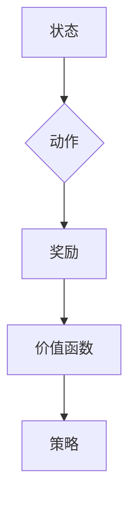

                 

### 深度强化学习的理论基础

#### 第1章：深度强化学习概述

##### 1.1 深度强化学习的起源与发展

深度强化学习（Deep Reinforcement Learning，DRL）是强化学习（Reinforcement Learning，RL）和深度学习（Deep Learning，DL）的结合。它起源于20世纪90年代，当时研究人员开始探索如何让智能体在不确定的环境中通过试错学习达到最优策略。

**1.1.1 深度强化学习的历史背景**

深度强化学习的发展可以追溯到以下几个关键时间点：

- **1992年**：David Silver等人提出了逆向推理（Intrinsic Motivation through Agent-Initiated Sensory Simulation，AIMSS）算法，这是一种早期的尝试，旨在通过内部奖励机制来提高智能体的学习效率。
  
- **2013年**：DeepMind的DQN（Deep Q-Network）算法在Atari游戏上取得了显著的成果，证明了深度学习在强化学习领域的重要作用。

- **2015年**：Google的AlphaGo在围棋领域战胜了人类冠军，这一事件标志着深度强化学习取得了重大突破。

**1.1.2 深度强化学习与其他强化学习方法的比较**

深度强化学习与传统强化学习方法相比，主要有以下区别：

- **传统强化学习**：通常依赖于价值函数或策略，通过试错学习来寻找最优行为策略。代表算法有Q-learning、SARSA等。
  
- **深度强化学习**：结合了深度学习的强大表征能力，能够处理高维、非线性的状态和动作空间，从而在复杂任务中表现出色。

  **核心概念与联系架构 Mermaid 流程图：**

  ```mermaid
  graph TD
  A[强化学习] --> B[深度强化学习]
  B --> C{基于值函数}
  B --> D{基于策略}
  C --> E[Q-learning]
  D --> F[SARSA]
  ```

##### 1.2 深度强化学习的基本概念

深度强化学习包含几个关键概念，包括状态（State）、动作（Action）、奖励（Reward）和价值函数（Value Function）。

**1.2.1 状态、动作、奖励、价值函数**

- **状态**：智能体所处的环境描述，通常用向量表示。

- **动作**：智能体可以执行的操作，同样用向量表示。

- **奖励**：描述智能体执行动作后环境对它的反馈，可以是即时奖励或长期奖励。

- **价值函数**：评估状态或状态-动作对的预期回报。

**核心概念与联系架构 Mermaid 流程图：**



##### 1.3 深度强化学习的实现方法

深度强化学习的实现方法可以大致分为策略梯度方法、模型自由方法、模型结合方法。

**1.3.1 策略梯度方法**

策略梯度方法直接优化策略函数，通过梯度上升或下降来寻找最优策略。主要算法有REINFORCE和同步策略梯度算法（A3C）。

- **REINFORCE**：使用样本的梯度来更新策略参数。
- **A3C**：异步策略梯度算法，通过多智能体协同学习来提高学习效率。

**1.3.2 模型自由方法**

模型自由方法不依赖环境模型，直接从实际经验中学习策略。主要算法有Deep Deterministic Policy Gradient（DDPG）和Trust Region Policy Optimization（TRPO）。

- **DDPG**：通过经验回放和目标网络来稳定策略学习。
- **TRPO**：在信任区域框架下优化策略参数，提高学习稳定性。

**1.3.3 模型结合方法**

模型结合方法将模型自由和模型依赖方法结合起来，以充分利用两者的优点。主要算法有Deep Replay-Determined Policy Gradient（DRPG）。

- **DRPG**：结合DDPG和DQN的特点，通过经验回放和目标网络来稳定策略学习。

**核心算法原理讲解与Python源代码示例：**

**深度Q网络（DQN）算法原理讲解与Python代码实现：**

```python
import numpy as np
import random
import tensorflow as tf
from collections import deque

# 创建一个简单的DQN模型
model = tf.keras.Sequential([
    tf.keras.layers.Dense(64, activation='relu', input_shape=(state_size,)),
    tf.keras.layers.Dense(64, activation='relu'),
    tf.keras.layers.Dense(action_size, activation='linear')
])

# 编译模型
model.compile(optimizer='adam', loss='mse')

# 训练模型
model.fit(x_train, y_train, epochs=1000, batch_size=32, verbose=2)

# DQN算法的循环
while not done:
    # 选择动作
    action = choose_action(state)
    # 执行动作
    next_state, reward, done = env.step(action)
    # 存储经验
    memory.append((state, action, reward, next_state, done))
    # 更新状态
    state = next_state
    
    if done:
        # 重置环境
        state = env.reset()
```

在以上代码中，我们首先创建了一个简单的DQN模型，然后通过训练模型来学习如何选择动作。在DQN算法的循环中，我们通过选择动作、执行动作、存储经验和更新状态来实现策略的优化。

### 总结

本文首先介绍了深度强化学习的历史背景和与其他强化学习方法的区别，然后详细讲解了状态、动作、奖励、价值函数等基本概念，最后阐述了策略梯度方法、模型自由方法和模型结合方法的实现原理。这些理论基础为后续章节的深度强化学习在控制领域的应用打下了坚实的基础。

---

**作者：AI天才研究院/AI Genius Institute & 禅与计算机程序设计艺术 /Zen And The Art of Computer Programming**

**摘要：**

本文深入探讨了深度强化学习的理论基础，包括其起源、基本概念和实现方法。通过介绍策略梯度方法、模型自由方法、模型结合方法，以及核心算法DQN、REINFORCE、DDPG等，为读者提供了深度强化学习的全面了解。同时，通过Python代码示例，展示了如何实现这些算法，为读者提供了实用的编程指导。

---

**关键词：**

- 深度强化学习
- 策略梯度方法
- 模型自由方法
- 模型结合方法
- DQN算法
- DDPG算法
- 强化学习
- 智能控制

---

在下一部分中，我们将进一步探讨深度强化学习的核心算法，如深度Q网络（DQN）、策略梯度方法、模型自由方法以及模型结合方法，并分析这些算法的原理、实现和优缺点。敬请期待！

