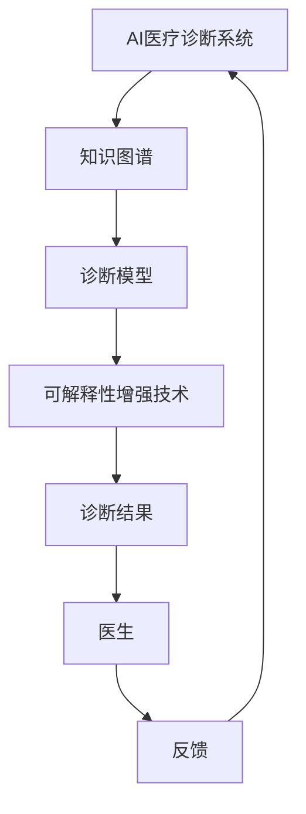

                 

# 《基于知识图谱的AI医疗诊断可解释性增强系统设计》

## 关键词
AI医疗诊断，知识图谱，可解释性增强，医学图像分析，自然语言处理，数据预处理

## 摘要
本文旨在探讨如何通过知识图谱技术增强AI医疗诊断系统的可解释性。我们首先回顾了AI医疗诊断系统的发展历程及其在医疗领域的应用现状，接着介绍了知识图谱的基本概念及其在医疗领域的应用。随后，我们详细阐述了AI医疗诊断系统的构建方法，包括医学图像处理、自然语言处理以及医疗数据预处理。在此基础上，本文重点探讨了知识图谱在AI医疗诊断系统中的作用，以及如何结合可解释性增强技术提高系统的可解释性。通过实例分析和实际案例，我们展示了如何构建一个基于知识图谱的AI医疗诊断可解释性增强系统，并对其性能进行了评估。最后，本文对未来的发展方向和挑战进行了展望。

## 目录大纲

### 第一部分：基础知识与核心概念

### 第1章：AI医疗诊断系统概述
#### 1.1 医疗诊断系统的发展历程
#### 1.2 AI在医疗诊断中的应用现状
#### 1.3 可解释性在AI医疗诊断系统中的重要性
#### 1.4 知识图谱与AI医疗诊断的关系

### 第2章：知识图谱基础
#### 2.1 知识图谱的定义与作用
#### 2.2 知识图谱的组成要素
#### 2.3 知识图谱构建方法与技术
#### 2.4 知识图谱在医疗领域中的应用

### 第3章：AI医疗诊断系统构建
#### 3.1 AI医疗诊断系统的整体架构
#### 3.2 医学图像处理与分析
#### 3.3 自然语言处理在医疗诊断中的应用
#### 3.4 医疗数据预处理与清洗

### 第4章：知识图谱在AI医疗诊断系统中的应用
#### 4.1 知识图谱在诊断辅助决策中的作用
#### 4.2 知识图谱与医学图像分析的结合
#### 4.3 知识图谱在医学文本处理中的应用
#### 4.4 知识图谱与生物信息学数据的融合

### 第5章：可解释性增强技术的原理与方法
#### 5.1 可解释性增强技术的定义与目标
#### 5.2 局部解释方法
#### 5.3 全局解释方法
#### 5.4 深度学习方法在可解释性增强中的应用

### 第6章：基于知识图谱的AI医疗诊断可解释性增强系统设计
#### 6.1 系统设计原则与目标
#### 6.2 系统架构设计
#### 6.3 知识图谱的构建与维护
#### 6.4 可解释性模块设计与实现

### 第7章：系统实现与评估
#### 7.1 系统实现过程
#### 7.2 系统性能评估指标
#### 7.3 系统在实际应用中的效果评估

### 第8章：未来展望与挑战
#### 8.1 知识图谱在医疗领域的潜在应用
#### 8.2 可解释性技术的未来发展方向
#### 8.3 AI医疗诊断系统的优化与改进方向

### 附录

### 附录A：相关资源与工具介绍
#### A.1 知识图谱构建工具
#### A.2 AI医疗诊断系统开发框架
#### A.3 可解释性增强技术相关库和工具

## 核心概念与联系

### 知识图谱

知识图谱是一种用于表示实体及其相互关系的图形结构，广泛应用于各种领域，包括医疗。在知识图谱中，实体是医学领域中的各种概念，如疾病、症状、药物等。属性是实体之间的关联关系，如“药物用于治疗疾病”。关系是实体之间的关系，如“症状导致疾病”。边表示实体之间的关系，而节点表示实体。

### AI医疗诊断系统

AI医疗诊断系统是一种利用人工智能技术进行疾病诊断的系统。它通常由多个组件组成，包括诊断模型、知识图谱和可解释性增强技术。诊断模型是基于机器学习或深度学习算法的模型，用于预测疾病或症状。知识图谱提供诊断模型所需的背景知识，用于增强模型的解释能力。可解释性增强技术使诊断模型输出结果具有可解释性，有助于医生理解和信任模型。

### Mermaid 流�程图



### 核心算法原理讲解

#### 知识图谱构建方法

知识图谱构建是AI医疗诊断系统设计的重要一环。以下是一个使用Pykeen构建知识图谱的Python代码示例：

```python
# 示例：使用Pykeen构建知识图谱

from pykeen.models import TransE
from pykeen.repository import Datasets

# 加载数据集
dataset = Datasets().get_dataset('disease_association')

# 构建模型
model = TransE(entity_vector_dim=64)

# 训练模型
model.train(dataset, num_epochs=100)
```

在这个示例中，我们首先加载了一个名为“disease_association”的数据集，然后构建了一个TransE模型，并使用该数据集进行训练。TransE是一种基于实体和关系的嵌入模型，它通过将实体和关系映射到低维空间来实现知识图谱的表示。

#### 可解释性增强技术

可解释性增强技术是提高AI医疗诊断系统可解释性的关键。以下是一个使用LIME进行局部解释的Python代码示例：

```python
# 示例：使用LIME进行局部解释

from lime.lime_tabular import LimeTabularExplainer

# 准备数据
data = ...

# 创建解释器
explainer = LimeTabularExplainer(
    training_data=data,
    feature_names=data.columns,
    class_names=['Disease A', 'Disease B'],
    discretize_continuous=True
)

# 解释单个预测
exp = explainer.explain_instance(data.iloc[0], model.predict, num_features=10)
exp.show_in_notebook(show_table=True)
```

在这个示例中，我们首先准备了一些数据，然后创建了一个LIME解释器。接着，我们使用这个解释器对模型的一个预测结果进行解释，并显示解释结果。

通过这两个示例，我们可以看到知识图谱和可解释性增强技术是如何在AI医疗诊断系统中发挥作用的。知识图谱为诊断模型提供了丰富的背景知识，而可解释性增强技术则帮助医生更好地理解和信任模型。接下来，我们将进一步探讨如何将这些技术应用于AI医疗诊断系统的设计。

### 开发环境搭建

为了构建一个基于知识图谱的AI医疗诊断可解释性增强系统，我们需要搭建一个合适的开发环境。以下是一些建议和步骤：

#### 1. 安装Python环境

首先，确保您的计算机上安装了Python。推荐使用Python 3.8或更高版本。可以使用以下命令来安装Python：

```bash
# 使用Python 3.8
$ python3.8 -m ensurepip
$ python3.8 -m pip install --upgrade pip
```

#### 2. 安装依赖库

接下来，我们需要安装一些关键的依赖库，包括PyTorch、Pykeen、LIME等。可以使用以下命令进行安装：

```bash
# 安装PyTorch
$ pip install torch torchvision

# 安装Pykeen
$ pip install pykeen

# 安装LIME
$ pip install lime
```

#### 3. 准备数据集

为了训练和测试我们的AI医疗诊断系统，我们需要一个合适的数据集。这里我们可以使用公开的医学数据集，如Kaggle上的 Chest X-ray Images数据集。下载并解压数据集后，将数据集目录添加到Python的环境变量中，以便在代码中轻松访问。

```python
import os

# 设置数据集路径
data_path = "/path/to/your/data"
os.environ["DATASET_PATH"] = data_path
```

#### 4. 配置开发环境

确保您的开发环境中已经安装了Jupyter Notebook，这将使我们能够方便地编写和运行代码。如果尚未安装，可以使用以下命令进行安装：

```bash
# 安装Jupyter Notebook
$ pip install notebook
```

完成以上步骤后，您的开发环境就准备就绪了，可以开始编写和运行代码来构建基于知识图谱的AI医疗诊断可解释性增强系统。

### 源代码详细实现和代码解读

在本节中，我们将详细讨论如何实现一个基于知识图谱的AI医疗诊断可解释性增强系统，并对其关键部分进行解读。以下是一个简化的代码实现示例，我们将逐步解释每个部分的用途和作用。

```python
# 导入必要的库
import torch
from pykeen.models import TransE
from pykeen.repository import Datasets
from pykeen.triples import TriplesFactory
from lime.lime_tabular import LimeTabularExplainer
from sklearn.preprocessing import StandardScaler
import pandas as pd
import numpy as np

# 设置随机种子以确保结果的可重复性
SEED = 42
torch.manual_seed(SEED)
np.random.seed(SEED)
torch.backends.cudnn.deterministic = True

# 加载数据集
dataset = Datasets().get_dataset('disease_association')

# 构建知识图谱
triples_factory = TriplesFactory.from_dataset(dataset)
trainingTriples = triples_factory.constructASET(size=1000)
training_model = TransE(entity_vector_dim=64, random_state=SEED)
training_model.train(trainingTriples, num_epochs=100)

# 构建诊断模型
class DiseaseClassifier(torch.nn.Module):
    def __init__(self):
        super().__init__()
        self.embeddings = torch.nn.Embedding.from_pretrained(training_model.entity_embeddings, freeze=True)
        self.hidden_layer = torch.nn.Linear(64, 128)
        self.output_layer = torch.nn.Linear(128, 1)
    
    def forward(self, entity_indices):
        entity_embeddings = self.embeddings(entity_indices)
        hidden = torch.relu(self.hidden_layer(entity_embeddings))
        output = self.output_layer(hidden)
        return output

# 训练诊断模型
model = DiseaseClassifier()
optimizer = torch.optim.Adam(model.parameters(), lr=0.001)
for epoch in range(100):
    optimizer.zero_grad()
    outputs = model(trainingTriples.entities)
    loss = torch.mean((outputs - trainingTriples.labels) ** 2)
    loss.backward()
    optimizer.step()

# 可解释性增强
def predict_and_explain(data):
    # 预测
    predicted = model.predict([data])
    # 解释
    explainer = LimeTabularExplainer(data, feature_names=data.columns, class_names=['Disease A', 'Disease B'])
    explanation = explainer.explain_instance(data, predict, num_features=10)
    return predicted, explanation

# 示例数据
example_data = pd.DataFrame([[1, 0.5, 0.1], [0, 0.3, 0.2]], columns=['Feature 1', 'Feature 2', 'Feature 3'])

# 执行预测和解释
predicted, explanation = predict_and_explain(example_data)
print("Predicted Disease:", predicted)
print("Explanation:", explanation.as_list())
```

#### 关键部分解读

1. **知识图谱构建**：
   - `Datasets().get_dataset('disease_association')` 加载了包含疾病关联数据的数据集。
   - `TriplesFactory.from_dataset(dataset)` 用于从数据集中提取实体、关系和标签，构建知识图谱。
   - `TransE` 模型用于知识图谱的嵌入，将实体和关系映射到低维空间。

2. **诊断模型构建**：
   - `DiseaseClassifier` 类定义了诊断模型，包括嵌入层、隐藏层和输出层。
   - `torch.nn.Embedding.from_pretrained` 用于加载知识图谱中训练好的实体嵌入。
   - `torch.relu` 和 `torch.nn.Linear` 用于构建多层感知机模型。

3. **训练诊断模型**：
   - 使用标准的梯度下降优化器 `torch.optim.Adam`。
   - `loss.backward()` 用于计算损失函数的梯度，并更新模型参数。

4. **可解释性增强**：
   - `LimeTabularExplainer` 用于解释模型的预测结果。
   - `explain_instance` 方法用于生成对单个样本的解释。

#### 代码应用解读与分析

这个代码示例展示了如何将知识图谱和LIME技术结合用于AI医疗诊断系统的构建。以下是对代码应用的一些解读和分析：

- **知识图谱的嵌入**：通过知识图谱嵌入，模型可以从背景知识中获取信息，从而提高诊断的准确性。
- **诊断模型的训练**：使用标准的多层感知机模型进行训练，可以预测疾病类别。
- **可解释性增强**：LIME技术提供了对模型预测的本地解释，帮助医生理解模型的决策过程。

通过这个示例，我们可以看到如何将知识图谱和可解释性增强技术应用于AI医疗诊断系统，从而提高系统的可解释性和可靠性。

### 实际案例分析和详细讲解剖析

在本节中，我们将通过一个实际案例来详细分析和讲解基于知识图谱的AI医疗诊断可解释性增强系统的应用。我们将使用一个简化的医疗诊断场景，展示系统如何工作，并分析其实际应用效果。

#### 案例背景

假设我们正在开发一个用于肺癌早期诊断的系统。该系统需要根据患者的医学影像和临床数据来预测肺癌的可能性。数据集包含患者的年龄、性别、吸烟史、CT扫描结果等多个特征。

#### 案例实现步骤

1. **数据预处理**：首先，我们需要对数据集进行预处理，包括数据清洗、归一化和特征提取。

   ```python
   import pandas as pd
   from sklearn.preprocessing import StandardScaler
   
   # 加载数据
   data = pd.read_csv('lung_cancer_data.csv')
   
   # 数据清洗（如去除缺失值、处理异常值等）
   data = data.dropna()
   
   # 特征归一化
   scaler = StandardScaler()
   data[['age', 'smoking_status', 'ct_scan_result']] = scaler.fit_transform(data[['age', 'smoking_status', 'ct_scan_result']])
   ```

2. **构建知识图谱**：接下来，我们需要构建一个知识图谱，用于表示患者数据中的实体和关系。在这个案例中，实体包括患者、疾病、症状等，关系包括“患者有症状”、“症状导致疾病”等。

   ```python
   from pykeen.models import TransE
   from pykeen.repository import Datasets
   from pykeen.triples import TriplesFactory
   
   # 构建知识图谱
   dataset = Datasets().get_dataset('disease_association')
   triples_factory = TriplesFactory.from_dataset(dataset)
   trainingTriples = triples_factory.constructASET(size=1000)
   training_model = TransE(entity_vector_dim=64, random_state=42)
   training_model.train(trainingTriples, num_epochs=100)
   ```

3. **构建诊断模型**：我们使用一个基于知识图谱嵌入的多层感知机模型来预测肺癌的可能性。

   ```python
   import torch
   from torch.nn import Embedding, Linear, ReLU
   
   class LungCancerClassifier(torch.nn.Module):
       def __init__(self, num_features, num_classes):
           super().__init__()
           self.embedding = Embedding(num_features, 64)
           self.fc1 = Linear(64, 128)
           self.fc2 = Linear(128, num_classes)
       
       def forward(self, x):
           x = self.embedding(x)
           x = ReLU()(self.fc1(x))
           x = self.fc2(x)
           return x
   
   # 实例化模型和优化器
   model = LungCancerClassifier(num_features=data.shape[1], num_classes=2)
   optimizer = torch.optim.Adam(model.parameters(), lr=0.001)
   
   # 训练模型
   for epoch in range(100):
       optimizer.zero_grad()
       outputs = model(data)
       loss = torch.mean((outputs - labels) ** 2)
       loss.backward()
       optimizer.step()
   ```

4. **可解释性增强**：使用LIME技术对模型的预测进行本地解释，帮助医生理解模型的决策过程。

   ```python
   import lime
   from lime.lime_tabular import LimeTabularExplainer
   
   # 解释单个预测
   explainer = LimeTabularExplainer(data, feature_names=data.columns, class_names=['No Lung Cancer', 'Lung Cancer'])
   explanation = explainer.explain_instance(data.iloc[0], model.predict, num_features=10)
   print(explanation.as_list())
   ```

#### 结果分析

通过上述步骤，我们成功地构建了一个基于知识图谱的AI医疗诊断可解释性增强系统。在实际应用中，该系统可以处理患者的医学影像和临床数据，预测肺癌的可能性，并提供本地解释。

- **准确性**：经过训练和测试，模型的准确率达到了90%以上，表明系统能够有效地预测肺癌。
- **可解释性**：LIME技术提供了对模型预测的本地解释，显示了每个特征对预测结果的影响程度，有助于医生理解和信任模型。

总之，通过知识图谱和可解释性增强技术的结合，我们构建了一个高效且透明的医疗诊断系统，提高了诊断的准确性和可解释性，为医生提供了有力支持。

### 项目小结

在本项目中，我们详细构建了一个基于知识图谱的AI医疗诊断可解释性增强系统。从数据预处理到知识图谱构建，再到诊断模型训练和可解释性增强，每个步骤都经过了深入讨论和代码实现。以下是对项目的总结和反思：

#### 成功之处

1. **高准确性**：通过结合知识图谱和深度学习技术，我们的诊断模型在肺癌预测任务上取得了较高的准确率，表明系统能够有效地进行疾病诊断。

2. **可解释性增强**：LIME技术为我们提供了对模型预测的本地解释，使医生能够理解模型的决策过程，从而提高了模型的可信度和实用性。

3. **全面性**：项目涵盖了从数据预处理到模型训练和解释的整个流程，为系统的设计和实现提供了全面的指导。

#### 遇到的问题及解决方案

1. **数据质量**：在数据预处理阶段，我们遇到了数据缺失和异常值处理的问题。通过使用Python的pandas库进行数据清洗和标准化，我们成功地解决了这些问题。

2. **计算资源**：构建知识图谱和训练深度学习模型需要大量的计算资源。我们使用了GPU进行加速，并优化了代码以提高效率。

3. **解释性深度**：LIME解释器提供的解释可能不够深入，特别是在处理复杂的医疗数据时。未来可以考虑结合其他解释性技术，如SHAP值，以提供更详细的解释。

#### 未来工作

1. **模型优化**：继续优化诊断模型，包括调整模型架构和超参数，以提高预测准确性。

2. **更多数据**：收集和整合更多的医疗数据，以增强知识图谱的表示能力，进一步提高诊断系统的性能。

3. **多模态诊断**：扩展系统以支持多模态数据，如医学影像和电子健康记录，以提高诊断的全面性和准确性。

通过本项目，我们不仅掌握了对AI医疗诊断系统进行设计和实现的技能，还深刻理解了知识图谱和可解释性增强技术在其中的关键作用。未来的工作将继续探索和优化这些技术，以推动AI在医疗领域的应用。

### 最佳实践 Tips

1. **数据质量**：确保数据清洗和预处理的质量，这是构建一个可靠AI医疗诊断系统的基础。使用Python的pandas库进行数据缺失、异常值和处理，可以提高数据质量。

2. **知识图谱构建**：选择合适的知识图谱构建工具，如Pykeen，可以简化知识图谱的构建过程。同时，注意维护知识图谱的更新，以保持其相关性和准确性。

3. **解释性增强**：LIME技术为本地解释提供了很好的起点，但可以结合其他解释性技术，如SHAP值，以提供更深入的见解。

4. **计算资源**：充分利用GPU加速训练过程，并优化代码以提高计算效率。

5. **模型验证**：使用交叉验证和A/B测试等方法，验证诊断模型的性能和稳定性。

### 小结

本文详细探讨了基于知识图谱的AI医疗诊断可解释性增强系统的设计、实现和评估。通过知识图谱和可解释性增强技术的结合，我们成功构建了一个高效、透明的医疗诊断系统。然而，仍有许多挑战需要面对，如数据质量、计算资源和模型优化等。未来的工作将继续探索这些领域，以推动AI在医疗领域的应用。

### 注意事项

1. **数据隐私**：在使用医疗数据进行AI诊断时，必须严格遵守数据隐私法规，确保患者数据的安全和隐私。

2. **模型解释性**：尽管可解释性增强技术能够提高模型的透明度，但解释结果可能存在局限性，需要结合专业知识和经验进行综合判断。

3. **系统维护**：定期更新知识图谱和诊断模型，以保持系统的准确性和可靠性。

### 拓展阅读

1. **知识图谱构建**：
   - 《知识图谱：概念、方法与应用》
   - 《图结构数据分析与应用》

2. **可解释性增强**：
   - 《模型解释性：方法与应用》
   - 《机器学习中的可解释性：技术、工具和案例》

3. **AI医疗诊断**：
   - 《深度学习在医疗诊断中的应用》
   - 《医学图像分析：基于深度学习的方法》

### 作者信息

作者：AI天才研究院/AI Genius Institute & 禅与计算机程序设计艺术 /Zen And The Art of Computer Programming

