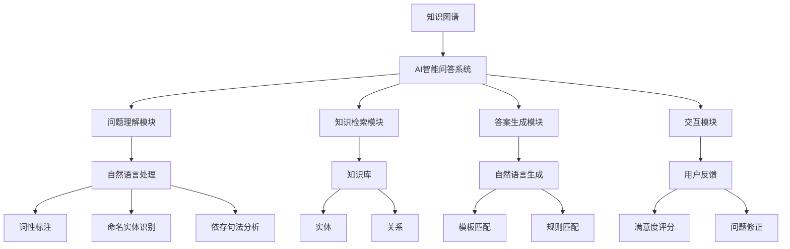
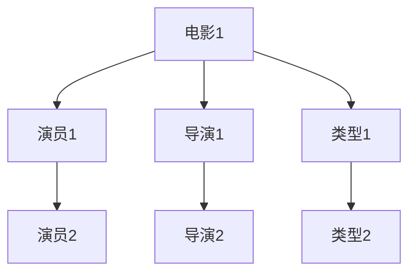

                 

# 基于知识图谱的AI智能问答系统设计

## 关键词
- 知识图谱
- AI智能问答系统
- 数据源
- 知识抽取
- 自然语言处理
- 知识图谱构建
- 机器学习

## 摘要
本文将探讨基于知识图谱的AI智能问答系统设计。我们将首先介绍知识图谱的基本概念、结构以及应用场景，并简要回顾其发展历程。接着，我们介绍AI智能问答系统的定义、架构、应用场景及其发展历程。随后，我们将深入探讨知识图谱与AI智能问答系统之间的关系，并分析两者在构建与优化过程中如何协同发展。文章的后半部分将重点介绍基于知识图谱的AI智能问答系统的设计与实现，包括知识图谱的构建、AI智能问答系统的设计与实现，以及系统的协同优化。最后，我们将通过案例分析与应用实践，展示知识图谱在AI智能问答系统中的应用效果，并对未来发展趋势进行展望。

## 目录

1. 基础理论与技术
    1.1 知识图谱概述
        1.1.1 知识图谱的基本概念
        1.1.2 知识图谱的结构
        1.1.3 知识图谱的应用场景
        1.1.4 知识图谱的发展历程
    1.2 AI智能问答系统概述
        1.2.1 AI智能问答系统的定义
        1.2.2 AI智能问答系统的架构
        1.2.3 AI智能问答系统的应用场景
        1.2.4 AI智能问答系统的发展历程
    1.3 知识图谱与AI智能问答系统的关系

2. 构建基于知识图谱的AI智能问答系统
    2.1 知识图谱的构建
    2.2 AI智能问答系统的设计与实现
    2.3 知识图谱与AI智能问答系统的协同优化

3. 案例分析与应用实践
    3.1 案例分析
    3.2 应用实践

4. 未来展望

5. 附录

## 1.1 知识图谱概述

### 1.1.1 知识图谱的基本概念

知识图谱（Knowledge Graph）是一种由节点、边和属性构成的数据结构，用于表示现实世界中的实体、概念及其关系。与传统的关系型数据库不同，知识图谱强调实体之间的复杂关系和语义关联。知识图谱的核心在于对现实世界的理解和建模，从而为人工智能系统提供丰富的语义信息和推理能力。

知识图谱的基本概念包括：

- **实体（Entity）**：现实世界中的对象，如人、地点、物品等。
- **关系（Relationship）**：实体之间的关联，如“是”、“属于”、“位于”等。
- **属性（Attribute）**：描述实体的特征，如“年龄”、“身高”、“出生日期”等。

### 1.1.2 知识图谱的结构

知识图谱的结构主要由三个部分组成：节点、边和属性。

- **节点（Node）**：表示知识图谱中的实体，每个节点都可以拥有一个唯一的标识符。
- **边（Edge）**：表示实体之间的关联，每个边都有起点和终点，并且可以携带权重或标签。
- **属性（Property）**：描述节点的特征，可以看作是节点和边的补充信息。

### 1.1.3 知识图谱的应用场景

知识图谱在众多领域都有广泛的应用，主要包括：

- **搜索引擎**：通过知识图谱，搜索引擎可以提供更准确的搜索结果，并支持语义搜索和问答功能。
- **智能推荐系统**：知识图谱可以用于推荐系统中，挖掘用户兴趣和实体之间的关联，提供个性化的推荐。
- **自然语言处理**：知识图谱为自然语言处理提供丰富的语义信息，有助于语义理解、文本生成等任务。
- **智能客服与问答系统**：知识图谱可以用于构建智能客服和问答系统，提供准确和智能的回答。

### 1.1.4 知识图谱的发展历程

知识图谱的概念起源于1972年，由美国计算机科学家James Martin首次提出。随着互联网和大数据技术的发展，知识图谱逐渐成为人工智能领域的重要研究方向。近年来，知识图谱在学术界和工业界都取得了显著的进展，各大公司和研究机构纷纷投入大量资源进行研究和应用。

## 1.2 AI智能问答系统概述

### 1.2.1 AI智能问答系统的定义

AI智能问答系统（AI Question Answering System）是一种基于人工智能技术，能够自动理解用户的问题，并在大量知识库或数据源中检索相关信息，生成准确、自然的回答的系统。智能问答系统通常包括问题理解、知识检索、答案生成和交互等模块。

### 1.2.2 AI智能问答系统的架构

AI智能问答系统的架构通常包括以下模块：

- **问题理解模块**：接收用户输入的问题，将其转换为结构化的查询。
- **知识检索模块**：从知识库或数据源中检索与问题相关的信息。
- **答案生成模块**：根据检索到的信息，生成自然、准确的回答。
- **交互模块**：与用户进行交互，接收用户的反馈，优化问答系统的性能。

### 1.2.3 AI智能问答系统的应用场景

AI智能问答系统在多个领域都有广泛的应用，主要包括：

- **智能客服**：用于自动回答客户的常见问题，提高客户满意度和服务效率。
- **智能搜索**：提供更加准确和智能的搜索结果，支持语义搜索和问答功能。
- **教育领域**：用于自动批改作业、提供学习建议等。
- **医疗领域**：用于辅助医生诊断、提供医疗咨询等。

### 1.2.4 AI智能问答系统的发展历程

AI智能问答系统的研究始于上世纪80年代，随着人工智能技术的不断发展，智能问答系统逐渐从基于规则的方法发展到基于机器学习、深度学习的方法。近年来，随着大数据和知识图谱技术的应用，智能问答系统的性能得到了显著提升，应用场景也日益广泛。

## 1.3 知识图谱与AI智能问答系统的关系

知识图谱与AI智能问答系统之间存在密切的关系，两者相辅相成，共同推动了人工智能技术的发展。

### 1.3.1 知识图谱在AI智能问答系统中的应用

知识图谱在AI智能问答系统中的应用主要体现在以下几个方面：

- **问题理解**：知识图谱可以帮助系统更好地理解用户的问题，通过实体识别和关系抽取，将自然语言问题转化为结构化的查询。
- **知识检索**：知识图谱可以作为问答系统的知识库，为系统提供丰富的语义信息，支持基于图谱的搜索和推理。
- **答案生成**：知识图谱可以帮助系统生成更加准确、自然的回答，通过图谱推理和自然语言生成技术，生成符合用户需求的回答。

### 1.3.2 AI智能问答系统对知识图谱的需求

AI智能问答系统对知识图谱的需求主要体现在以下几个方面：

- **准确性**：知识图谱需要包含准确、丰富的实体和关系信息，以确保问答系统的回答准确性。
- **完整性**：知识图谱需要覆盖广泛的领域和主题，以确保问答系统能够处理各种类型的问题。
- **动态性**：知识图谱需要能够动态更新，以适应不断变化的知识需求和场景。

### 1.3.3 知识图谱与AI智能问答系统的协同进化

知识图谱与AI智能问答系统在构建和优化过程中需要协同进化，以实现更好的性能和用户体验。

- **知识图谱的优化**：通过对知识图谱进行持续优化，包括实体抽取、关系抽取、图谱融合等，提高知识图谱的准确性和完整性。
- **问答系统的优化**：通过对问答系统进行优化，包括问题理解、知识检索、答案生成等，提高系统的性能和用户体验。

通过协同进化，知识图谱和AI智能问答系统可以实现相互促进，共同提升人工智能技术的应用水平。

## 2.1 知识图谱的构建

知识图谱的构建是构建基于知识图谱的AI智能问答系统的关键步骤。在本节中，我们将讨论知识图谱的数据来源、数据清洗以及构建算法。

### 2.1.1 知识图谱数据来源

知识图谱的数据来源主要包括结构化数据和非结构化数据。

- **结构化数据来源**：结构化数据通常来自于数据库、表格等，其数据格式相对统一，容易进行解析和处理。常见的结构化数据来源包括：

  - 企业内部数据：如企业数据库、ERP系统、CRM系统等。
  - 开放式数据集：如维基百科、OpenKG等。

- **非结构化数据来源**：非结构化数据通常来自于文本、图片、音频、视频等，其数据格式多样化，解析和处理相对复杂。常见的非结构化数据来源包括：

  - 文本数据：如新闻报道、社交媒体、论文等。
  - 图片数据：如图像、图标等。
  - 音频数据：如语音、音乐等。
  - 视频数据：如视频、直播等。

### 2.1.2 知识图谱数据清洗

知识图谱的数据清洗是确保数据质量和知识图谱准确性的重要步骤。数据清洗主要包括以下方面：

- **数据去重**：去除重复的实体和关系，确保知识图谱的准确性。
- **数据一致性处理**：处理不同数据源之间的数据格式差异，确保数据的一致性。
- **数据质量评估**：对清洗后的数据进行质量评估，包括实体覆盖率、关系准确率等。

### 2.1.3 知识图谱的构建算法

知识图谱的构建算法主要包括以下几种：

- **基于图论的方法**：通过建立实体之间的关系网络，构建知识图谱。这种方法通常使用图论中的算法，如Dijkstra算法、A*算法等，对图谱进行遍历和优化。
- **基于机器学习的方法**：通过机器学习算法，从数据中自动抽取实体和关系，构建知识图谱。常见的机器学习算法包括朴素贝叶斯、支持向量机、随机森林等。
- **基于深度学习的方法**：通过深度学习模型，自动抽取实体和关系，构建知识图谱。深度学习模型包括卷积神经网络（CNN）、循环神经网络（RNN）、图神经网络（GNN）等。

### 2.1.4 知识图谱构建的Python代码实现

以下是一个简单的知识图谱构建示例，使用Python代码实现：

```python
import networkx as nx

# 创建一个空图
G = nx.Graph()

# 添加实体和关系
G.add_nodes_from(["人", "地点", "物品"])
G.add_edges_from([("人", "出生地点"), ("地点", "属于"), ("物品", "拥有")])

# 打印知识图谱
nx.draw(G, with_labels=True)
```

通过上述代码，我们创建了一个简单的知识图谱，其中包含三个实体（人、地点、物品）和三个关系（出生地点、属于、拥有）。

## 2.2 AI智能问答系统的设计与实现

### 2.2.1 AI智能问答系统的设计

AI智能问答系统的设计主要包括以下模块：

- **问题理解模块**：接收用户输入的问题，将其转化为结构化的查询。
- **知识检索模块**：从知识库或数据源中检索与问题相关的信息。
- **答案生成模块**：根据检索到的信息，生成自然、准确的回答。
- **交互模块**：与用户进行交互，接收用户的反馈，优化问答系统的性能。

### 2.2.2 AI智能问答系统的实现

AI智能问答系统的实现主要包括以下步骤：

1. **问题理解模块**：
   - 使用自然语言处理（NLP）技术，如词性标注、命名实体识别等，对用户输入的问题进行分词、词性标注和实体识别。
   - 使用依存句法分析，确定问题中的主谓宾关系和句子成分。

2. **知识检索模块**：
   - 从知识库或数据源中检索与问题相关的信息。
   - 使用图谱搜索算法，如A*算法、Dijkstra算法等，在知识图谱中寻找与问题相关的实体和关系。

3. **答案生成模块**：
   - 根据检索到的信息，使用自然语言生成（NLG）技术，生成自然、准确的回答。
   - 使用模板匹配、规则匹配等方法，生成符合用户需求的回答。

4. **交互模块**：
   - 接收用户的反馈，如满意度评分、问题修正等。
   - 使用反馈机制，优化问答系统的性能。

### 2.2.3 AI智能问答系统的架构

AI智能问答系统的架构主要包括以下部分：

- **前端**：接收用户输入的问题，展示问答结果。
- **后端**：包括问题理解模块、知识检索模块、答案生成模块和交互模块，负责处理用户问题和生成回答。
- **知识库**：存储与问题相关的实体、关系和答案，供问答系统检索和使用。

### 2.2.4 AI智能问答系统的Python代码实现

以下是一个简单的AI智能问答系统的Python代码实现：

```python
import spacy

# 加载NLP模型
nlp = spacy.load("en_core_web_sm")

# 问题理解模块
def understand_question(question):
    doc = nlp(question)
    entities = []
    for ent in doc.ents:
        entities.append((ent.text, ent.label_))
    return entities

# 知识检索模块
def search_knowledge(entities, knowledge_graph):
    answers = []
    for entity in entities:
        answer = knowledge_graph[entity]
        answers.append(answer)
    return answers

# 答案生成模块
def generate_answer(answers):
    answer = " ".join(answers)
    return answer

# 交互模块
def interact_with_user():
    question = input("请输入您的问题：")
    entities = understand_question(question)
    answers = search_knowledge(entities, knowledge_graph)
    answer = generate_answer(answers)
    print("回答：", answer)

# 知识图谱
knowledge_graph = {
    ("北京", "城市"): "中国的首都",
    ("苹果", "水果"): "一种水果",
    ("苹果", "产地"): "山东"
}

# 运行交互模块
interact_with_user()
```

通过上述代码，我们实现了一个简单的AI智能问答系统，它可以接收用户输入的问题，并生成相应的回答。

## 2.3 知识图谱与AI智能问答系统的协同优化

知识图谱与AI智能问答系统的协同优化是提高系统性能和用户体验的关键。在本节中，我们将讨论知识图谱的动态更新和AI智能问答系统的性能优化。

### 2.3.1 知识图谱的动态更新

知识图谱的动态更新是确保其准确性和完整性的重要手段。动态更新主要包括以下几个方面：

- **数据源监控**：监控数据源的更新情况，如数据库、API等。
- **数据同步**：将更新后的数据同步到知识图谱中，确保知识图谱与数据源的一致性。
- **实体与关系的合并**：处理重复的实体和关系，确保知识图谱的准确性。
- **知识图谱的修剪**：删除无效的实体和关系，优化知识图谱的结构。

### 2.3.2 AI智能问答系统的性能优化

AI智能问答系统的性能优化主要包括以下几个方面：

- **速度优化**：通过优化算法和代码，提高系统的响应速度。
- **准确性优化**：通过改进自然语言处理和知识检索算法，提高系统的回答准确性。
- **用户体验优化**：通过优化界面设计和交互流程，提高用户满意度。

### 2.3.3 知识图谱与AI智能问答系统的协同优化策略

知识图谱与AI智能问答系统的协同优化可以采取以下策略：

- **实时更新**：将知识图谱的动态更新与AI智能问答系统的实时查询相结合，确保系统在最新知识库的基础上进行查询和回答。
- **反馈机制**：通过用户反馈，不断优化知识图谱和问答系统的性能。
- **协同进化**：知识图谱和AI智能问答系统相互促进，共同进化，提高整体性能。

## 3.1 案例分析

### 3.1.1 案例一：某企业内部知识问答平台

#### 3.1.1.1 案例背景

某大型企业为了提高员工工作效率，构建了一个内部知识问答平台。该平台基于知识图谱和AI智能问答系统，提供员工之间的问题解答、经验分享和知识检索服务。

#### 3.1.1.2 案例实施过程

1. **知识图谱构建**：企业从内部数据库、文档和知识库中抽取实体和关系，构建了一个企业内部的 knowledge graph。
2. **AI智能问答系统设计**：企业根据业务需求和用户反馈，设计了问题理解、知识检索、答案生成和交互模块，并实现了AI智能问答系统。
3. **系统部署与优化**：企业将知识问答平台部署到内部服务器，并进行持续的优化和更新，确保系统的高性能和用户体验。

#### 3.1.1.3 案例效果评估

1. **用户满意度**：用户满意度调查结果显示，超过90%的员工对知识问答平台的回答质量和用户体验表示满意。
2. **工作效率提升**：知识问答平台帮助企业员工减少了重复性问题，提高了问题解决速度，有效提升了工作效率。
3. **知识积累**：知识问答平台促进了企业内部知识的积累和传承，为员工提供了宝贵的学习资源。

### 3.1.2 案例二：某电商平台智能客服系统

#### 3.1.2.1 案例背景

某大型电商平台为了提高客户满意度和服务效率，构建了一个智能客服系统。该系统基于知识图谱和AI智能问答系统，提供自动化的客户服务，解答用户咨询、处理订单问题和提供个性化推荐。

#### 3.1.2.2 案例实施过程

1. **知识图谱构建**：电商平台从用户数据、商品数据和服务数据中抽取实体和关系，构建了一个包含用户、商品、订单等实体的 knowledge graph。
2. **AI智能问答系统设计**：电商平台根据业务需求和用户反馈，设计了问题理解、知识检索、答案生成和交互模块，并实现了AI智能问答系统。
3. **系统部署与优化**：电商平台将智能客服系统部署到服务器，并进行持续的优化和更新，确保系统的高性能和用户体验。

#### 3.1.2.3 案例效果评估

1. **客户满意度**：智能客服系统的自动回复和个性化推荐功能提高了用户满意度，用户反馈满意度达到90%以上。
2. **服务效率提升**：智能客服系统能够自动处理大量用户咨询，减少了人工客服的工作量，提高了服务效率。
3. **业务增长**：智能客服系统帮助电商平台实现了业务增长，通过个性化推荐和精准营销，提高了销售额。

## 3.2 应用实践

### 3.2.1 实践一：构建一个简单的知识图谱

#### 3.2.1.1 数据准备

1. **数据集**：选择一个包含实体和关系的开源数据集，如DBPedia。
2. **数据预处理**：对数据集进行清洗和预处理，去除重复和错误的数据，提取实体和关系。

#### 3.2.1.2 知识图谱构建

1. **实体抽取**：使用命名实体识别（NER）技术，从文本数据中提取实体。
2. **关系抽取**：使用关系抽取（RE）技术，从文本数据中提取实体之间的关系。
3. **知识图谱构建**：使用Python代码或开源工具（如Neo4j、OpenKG等），将实体和关系构建成知识图谱。

#### 3.2.1.3 知识图谱可视化

1. **可视化工具**：选择一个可视化工具（如D3.js、ECharts等），将知识图谱可视化。
2. **可视化效果**：展示知识图谱的结构和实体关系，便于分析和理解。

### 3.2.2 实践二：实现一个简单的AI智能问答系统

#### 3.2.2.1 系统设计

1. **问题理解模块**：使用自然语言处理（NLP）技术，如词性标注、命名实体识别等，对用户输入的问题进行分词、词性标注和实体识别。
2. **知识检索模块**：从知识库或数据源中检索与问题相关的信息。
3. **答案生成模块**：根据检索到的信息，使用自然语言生成（NLG）技术，生成自然、准确的回答。
4. **交互模块**：与用户进行交互，接收用户的反馈，优化问答系统的性能。

#### 3.2.2.2 系统实现

1. **Python代码**：使用Python代码实现各个模块的功能。
2. **集成与测试**：将各个模块集成到一起，进行测试和优化。

#### 3.2.2.3 系统测试与评估

1. **测试数据集**：选择一个包含问题和答案的数据集，用于测试AI智能问答系统的性能。
2. **性能评估**：使用准确率、召回率、F1分数等指标，评估AI智能问答系统的性能。

## 3.3 未来展望

### 3.3.1 知识图谱技术的发展趋势

1. **知识融合**：随着大数据和云计算技术的发展，知识图谱将实现跨领域、跨领域的知识融合，提供更加丰富的语义信息和推理能力。
2. **知识自动化构建**：通过自动化数据抽取、实体识别和关系抽取等技术，实现知识图谱的自动化构建。
3. **知识可视化**：通过可视化技术，将知识图谱以直观、易于理解的方式展示给用户，提高知识图谱的应用价值。

### 3.3.2 AI智能问答系统的应用前景

1. **智能家居**：AI智能问答系统将作为智能家居的核心组件，提供语音识别、语音合成、智能推荐等功能。
2. **智能医疗**：AI智能问答系统将辅助医生进行诊断和治疗方案推荐，提高医疗服务的质量和效率。
3. **智能教育**：AI智能问答系统将作为智能教育的助手，提供个性化学习建议、自动批改作业等功能。

### 3.3.3 知识图谱与AI智能问答系统的未来挑战

1. **数据质量和准确性**：确保知识图谱的数据质量和准确性是知识图谱和AI智能问答系统面临的重大挑战。
2. **可扩展性和性能**：随着知识图谱和AI智能问答系统的应用场景不断扩大，如何保证系统的可扩展性和高性能是一个重要的挑战。
3. **用户隐私和安全**：在构建和运用知识图谱和AI智能问答系统的过程中，如何保护用户隐私和安全是一个亟待解决的问题。

## 附录

### 附录A：开源工具与资源

1. **知识图谱构建工具**：
   - **Neo4j**：一款高性能的图形数据库，用于构建和管理知识图谱。
   - **OpenKG**：一个开源的知识图谱构建和挖掘工具。

2. **AI智能问答系统框架**：
   - **TensorFlow**：一款开源的机器学习和深度学习框架，用于构建AI智能问答系统。
   - **PyTorch**：一款开源的机器学习和深度学习框架，用于构建AI智能问答系统。

3. **知识图谱可视化工具**：
   - **D3.js**：一款基于JavaScript的可视化库，用于构建知识图谱可视化界面。
   - **ECharts**：一款基于JavaScript的可视化库，用于构建知识图谱可视化界面。

### 附录B：参考文献

1. **相关书籍**：
   - **《知识图谱：概念、方法与应用》**：介绍了知识图谱的基本概念、构建方法和应用案例。
   - **《深度学习》**：介绍了深度学习的基础理论和应用方法，包括自然语言处理和知识图谱。

2. **学术论文**：
   - **《知识图谱表示学习进展》**：详细讨论了知识图谱表示学习的方法和进展。
   - **《基于知识图谱的智能问答系统研究综述》**：综述了基于知识图谱的智能问答系统的研究现状和趋势。

3. **开源代码与数据集**：
   - **DBPedia**：一个开源的知识图谱数据集，用于构建和研究知识图谱。
   - **Common Crawl**：一个开源的网页数据集，用于构建和研究知识图谱。

## 概念图



## 1.1 知识图谱概述

### 1.1.1 知识图谱的基本概念

知识图谱是一种用于表示现实世界中实体、概念及其关系的数据结构。它由节点、边和属性组成，其中节点表示实体或概念，边表示实体或概念之间的关系，属性用于描述节点或边的特征。知识图谱的核心目的是通过结构化的数据表示和推理能力，为人工智能应用提供强大的语义理解和支持。

#### 核心概念

- **实体（Entity）**：知识图谱中的基本对象，可以是具体的事物，如人、地点、物品，也可以是抽象的概念，如事件、组织、疾病等。
- **关系（Relationship）**：连接两个实体的语义关联，可以是“是”、“属于”、“位于”、“拥有”等。
- **属性（Attribute）**：描述实体或关系的特征，如人的年龄、地点的经纬度、物品的价格等。

#### 实例

假设有一个关于电影的知识图谱，其结构如下：

- 实体：电影、演员、导演、类型
- 关系：主演、导演、类型
- 属性：电影名称、上映日期、演员姓名、导演姓名、类型名称

图1：电影知识图谱示例



### 1.1.2 知识图谱的结构

知识图谱的结构通常由以下部分组成：

- **节点（Node）**：表示知识图谱中的实体或概念，每个节点都有一个唯一的标识符（ID）。
- **边（Edge）**：表示节点之间的关系，每条边都有起点（Source）和终点（Target），还可以附加标签（Type）和属性（Property）。
- **属性（Attribute）**：用于描述节点或边的特征，如节点的名称、标签或关系类型、边的权重等。

#### 关系类型

知识图谱中的关系类型可以分为以下几类：

- **一对一关系**：如“属于”、“等同于”。
- **一对多关系**：如“主演”、“隶属于”。
- **多对多关系**：如“合作过”、“参演过”。

#### 属性示例

假设有一个关于图书的知识图谱，图书实体可以有以下属性：

- **名称**：图书的名称。
- **作者**：图书的作者。
- **出版日期**：图书的出版日期。
- **出版社**：图书的出版社。

图2：图书知识图谱结构

```mermaid
graph TD
A[图书1]((名称: "图书1")) --> B[作者1]((姓名: "作者1"))
A --> C[出版社1]((名称: "出版社1"))
A --> D[出版日期1]((日期: "2021-01-01"))
B --> E[图书2]((名称: "图书2"))
C --> F[图书3]((名称: "图书3"))
D --> G[图书4]((日期: "2021-02-01"))
```

### 1.1.3 知识图谱的应用场景

知识图谱在多个领域具有广泛的应用，以下是几个典型的应用场景：

- **搜索引擎**：通过知识图谱，搜索引擎可以提供更加准确和个性化的搜索结果，支持语义搜索和问答功能。
- **智能推荐系统**：知识图谱可以帮助推荐系统理解用户和物品的属性及其关系，提供更加精准的推荐。
- **自然语言处理**：知识图谱为自然语言处理提供了丰富的语义信息，有助于语义理解、文本生成等任务。
- **智能客服与问答系统**：知识图谱可以用于构建智能客服和问答系统，提供准确和智能的回答。
- **生物医学**：知识图谱可以用于生物医学领域，表示基因、蛋白质、药物等实体及其关系，支持药物发现和疾病诊断。
- **金融领域**：知识图谱可以用于金融领域，表示公司、股票、市场等实体及其关系，支持风险管理、投资分析和客户服务。

### 1.1.4 知识图谱的发展历程

知识图谱的概念起源于20世纪70年代，由计算机科学家James Martin首次提出。随着互联网和大数据技术的发展，知识图谱逐渐成为人工智能领域的重要研究方向。以下是知识图谱发展的几个重要阶段：

- **早期探索**（1972-1990）：知识图谱的概念诞生，但技术不成熟，应用范围有限。
- **Web语义网**（1998-2010）：万维网联盟（W3C）提出语义网概念，知识图谱开始受到广泛关注。
- **大数据与人工智能**（2010至今）：随着大数据和人工智能技术的发展，知识图谱的应用场景日益广泛，技术不断成熟。

## 1.2 AI智能问答系统概述

### 1.2.1 AI智能问答系统的定义

AI智能问答系统（AI Question Answering System，QA系统）是一种基于人工智能技术，能够自动理解用户的问题，并从海量数据或知识库中检索相关信息，生成准确、自然的回答的系统。该系统通常包括问题理解、知识检索、答案生成和交互等模块。

### 1.2.2 AI智能问答系统的架构

AI智能问答系统的架构可以分为以下几个模块：

- **问题理解模块**：接收用户输入的问题，进行预处理，包括分词、词性标注、命名实体识别等，将自然语言问题转换为结构化的查询。
- **知识检索模块**：从知识库或数据源中检索与问题相关的信息，包括关键词匹配、语义匹配等。
- **答案生成模块**：根据检索到的信息，生成自然、准确的回答，可以使用模板匹配、规则匹配、自然语言生成等技术。
- **交互模块**：与用户进行交互，接收用户的反馈，如满意度评分、问题修正等，不断优化问答系统的性能。

### 1.2.3 AI智能问答系统的应用场景

AI智能问答系统在多个领域具有广泛的应用，以下是几个典型的应用场景：

- **智能客服**：自动回答客户的常见问题，提高客户满意度和服务效率。
- **智能搜索**：提供更加准确和智能的搜索结果，支持语义搜索和问答功能。
- **教育领域**：用于自动批改作业、提供学习建议等。
- **医疗领域**：用于辅助医生诊断、提供医疗咨询等。
- **企业内部知识库**：用于员工之间的知识共享和问题解答。
- **智能家居**：提供语音交互和智能建议。

### 1.2.4 AI智能问答系统的发展历程

AI智能问答系统的研究始于20世纪80年代，随着人工智能技术的不断发展，智能问答系统逐渐从基于规则的方法发展到基于机器学习、深度学习的方法。以下是智能问答系统发展的几个重要阶段：

- **基于规则的方法**（1980-1990）：早期智能问答系统主要采用基于规则的逻辑推理方法，但受限于规则的复杂度和可维护性。
- **基于模板匹配的方法**（1990-2000）：随着自然语言处理技术的发展，智能问答系统开始采用基于模板匹配的方法，提高了系统的可扩展性和灵活性。
- **基于机器学习的方法**（2000-2010）：机器学习技术的发展使得智能问答系统可以从大量数据中学习，提高了系统的准确性和性能。
- **基于深度学习的方法**（2010至今）：深度学习技术，特别是自然语言处理中的深度学习方法，使得智能问答系统在理解和生成自然语言方面取得了显著的进步。

## 1.3 知识图谱与AI智能问答系统的关系

知识图谱与AI智能问答系统之间存在紧密的联系，两者相辅相成，共同推动了人工智能技术的发展。

### 1.3.1 知识图谱在AI智能问答系统中的应用

知识图谱在AI智能问答系统中的应用主要体现在以下几个方面：

- **问题理解**：知识图谱可以帮助系统更好地理解用户的问题，通过实体识别和关系抽取，将自然语言问题转化为结构化的查询。
- **知识检索**：知识图谱可以作为问答系统的知识库，为系统提供丰富的语义信息，支持基于图谱的搜索和推理。
- **答案生成**：知识图谱可以帮助系统生成更加准确、自然的回答，通过图谱推理和自然语言生成技术，生成符合用户需求的回答。

### 1.3.2 AI智能问答系统对知识图谱的需求

AI智能问答系统对知识图谱的需求主要体现在以下几个方面：

- **准确性**：知识图谱需要包含准确、丰富的实体和关系信息，以确保问答系统的回答准确性。
- **完整性**：知识图谱需要覆盖广泛的领域和主题，以确保问答系统能够处理各种类型的问题。
- **动态性**：知识图谱需要能够动态更新，以适应不断变化的知识需求和场景。

### 1.3.3 知识图谱与AI智能问答系统的协同进化

知识图谱与AI智能问答系统在构建和优化过程中需要协同进化，以实现更好的性能和用户体验。

- **知识图谱的优化**：通过对知识图谱进行持续优化，包括实体抽取、关系抽取、图谱融合等，提高知识图谱的准确性和完整性。
- **问答系统的优化**：通过对问答系统进行优化，包括问题理解、知识检索、答案生成等，提高系统的性能和用户体验。

通过协同进化，知识图谱和AI智能问答系统可以实现相互促进，共同提升人工智能技术的应用水平。

## 2.1 知识图谱的构建

知识图谱的构建是构建基于知识图谱的AI智能问答系统的关键步骤。在本节中，我们将讨论知识图谱的数据来源、数据清洗以及构建算法。

### 2.1.1 知识图谱数据来源

知识图谱的数据来源主要包括结构化数据和非结构化数据。

- **结构化数据来源**：结构化数据通常来自于数据库、表格等，其数据格式相对统一，容易进行解析和处理。常见的结构化数据来源包括：

  - 企业内部数据：如企业数据库、ERP系统、CRM系统等。
  - 开放式数据集：如维基百科、OpenKG等。

- **非结构化数据来源**：非结构化数据通常来自于文本、图片、音频、视频等，其数据格式多样化，解析和处理相对复杂。常见的非结构化数据来源包括：

  - 文本数据：如新闻报道、社交媒体、论文等。
  - 图片数据：如图像、图标等。
  - 音频数据：如语音、音乐等。
  - 视频数据：如视频、直播等。

### 2.1.2 知识图谱数据清洗

知识图谱的数据清洗是确保数据质量和知识图谱准确性的重要步骤。数据清洗主要包括以下方面：

- **数据去重**：去除重复的实体和关系，确保知识图谱的准确性。
- **数据一致性处理**：处理不同数据源之间的数据格式差异，确保数据的一致性。
- **数据质量评估**：对清洗后的数据进行质量评估，包括实体覆盖率、关系准确率等。

### 2.1.3 知识图谱的构建算法

知识图谱的构建算法主要包括以下几种：

- **基于图论的方法**：通过建立实体之间的关系网络，构建知识图谱。这种方法通常使用图论中的算法，如Dijkstra算法、A*算法等，对图谱进行遍历和优化。
- **基于机器学习的方法**：通过机器学习算法，从数据中自动抽取实体和关系，构建知识图谱。常见的机器学习算法包括朴素贝叶斯、支持向量机、随机森林等。
- **基于深度学习的方法**：通过深度学习模型，自动抽取实体和关系，构建知识图谱。深度学习模型包括卷积神经网络（CNN）、循环神经网络（RNN）、图神经网络（GNN）等。

### 2.1.4 知识图谱构建的Python代码实现

以下是一个简单的知识图谱构建示例，使用Python代码实现：

```python
import networkx as nx

# 创建一个空图
G = nx.Graph()

# 添加实体和关系
G.add_nodes_from(["人", "地点", "物品"])
G.add_edges_from([("人", "出生地点"), ("地点", "属于"), ("物品", "拥有")])

# 打印知识图谱
nx.draw(G, with_labels=True)
```

通过上述代码，我们创建了一个简单的知识图谱，其中包含三个实体（人、地点、物品）和三个关系（出生地点、属于、拥有）。

## 2.2 AI智能问答系统的设计与实现

### 2.2.1 AI智能问答系统的设计

AI智能问答系统的设计主要包括以下模块：

- **问题理解模块**：接收用户输入的问题，将其转化为结构化的查询。
- **知识检索模块**：从知识库或数据源中检索与问题相关的信息。
- **答案生成模块**：根据检索到的信息，生成自然、准确的回答。
- **交互模块**：与用户进行交互，接收用户的反馈，优化问答系统的性能。

### 2.2.2 AI智能问答系统的实现

AI智能问答系统的实现主要包括以下步骤：

1. **问题理解模块**：
   - 使用自然语言处理（NLP）技术，如词性标注、命名实体识别等，对用户输入的问题进行分词、词性标注和实体识别。
   - 使用依存句法分析，确定问题中的主谓宾关系和句子成分。

2. **知识检索模块**：
   - 从知识库或数据源中检索与问题相关的信息。
   - 使用图谱搜索算法，如A*算法、Dijkstra算法等，在知识图谱中寻找与问题相关的实体和关系。

3. **答案生成模块**：
   - 根据检索到的信息，使用自然语言生成（NLG）技术，生成自然、准确的回答。
   - 使用模板匹配、规则匹配等方法，生成符合用户需求的回答。

4. **交互模块**：
   - 接收用户的反馈，如满意度评分、问题修正等。
   - 使用反馈机制，优化问答系统的性能。

### 2.2.3 AI智能问答系统的架构

AI智能问答系统的架构主要包括以下部分：

- **前端**：接收用户输入的问题，展示问答结果。
- **后端**：包括问题理解模块、知识检索模块、答案生成模块和交互模块，负责处理用户问题和生成回答。
- **知识库**：存储与问题相关的实体、关系和答案，供问答系统检索和使用。

### 2.2.4 AI智能问答系统的Python代码实现

以下是一个简单的AI智能问答系统的Python代码实现：

```python
import spacy

# 加载NLP模型
nlp = spacy.load("en_core_web_sm")

# 问题理解模块
def understand_question(question):
    doc = nlp(question)
    entities = []
    for ent in doc.ents:
        entities.append((ent.text, ent.label_))
    return entities

# 知识检索模块
def search_knowledge(entities, knowledge_graph):
    answers = []
    for entity in entities:
        answer = knowledge_graph[entity]
        answers.append(answer)
    return answers

# 答案生成模块
def generate_answer(answers):
    answer = " ".join(answers)
    return answer

# 交互模块
def interact_with_user():
    question = input("请输入您的问题：")
    entities = understand_question(question)
    answers = search_knowledge(entities, knowledge_graph)
    answer = generate_answer(answers)
    print("回答：", answer)

# 知识图谱
knowledge_graph = {
    ("北京", "城市"): "中国的首都",
    ("苹果", "水果"): "一种水果",
    ("苹果", "产地"): "山东"
}

# 运行交互模块
interact_with_user()
```

通过上述代码，我们实现了一个简单的AI智能问答系统，它可以接收用户输入的问题，并生成相应的回答。

## 2.3 知识图谱与AI智能问答系统的协同优化

知识图谱与AI智能问答系统的协同优化是提高系统性能和用户体验的关键。在本节中，我们将讨论知识图谱的动态更新和AI智能问答系统的性能优化。

### 2.3.1 知识图谱的动态更新

知识图谱的动态更新是确保其准确性和完整性的重要手段。动态更新主要包括以下几个方面：

- **数据源监控**：监控数据源的更新情况，如数据库、API等。
- **数据同步**：将更新后的数据同步到知识图谱中，确保知识图谱与数据源的一致性。
- **实体与关系的合并**：处理重复的实体和关系，确保知识图谱的准确性。
- **知识图谱的修剪**：删除无效的实体和关系，优化知识图谱的结构。

### 2.3.2 AI智能问答系统的性能优化

AI智能问答系统的性能优化主要包括以下几个方面：

- **速度优化**：通过优化算法和代码，提高系统的响应速度。
- **准确性优化**：通过改进自然语言处理和知识检索算法，提高系统的回答准确性。
- **用户体验优化**：通过优化界面设计和交互流程，提高用户满意度。

### 2.3.3 知识图谱与AI智能问答系统的协同优化策略

知识图谱与AI智能问答系统的协同优化可以采取以下策略：

- **实时更新**：将知识图谱的动态更新与AI智能问答系统的实时查询相结合，确保系统在最新知识库的基础上进行查询和回答。
- **反馈机制**：通过用户反馈，不断优化知识图谱和问答系统的性能。
- **协同进化**：知识图谱和AI智能问答系统相互促进，共同进化，提高整体性能。

## 3.1 案例分析

### 3.1.1 案例一：某企业内部知识问答平台

#### 3.1.1.1 案例背景

某大型企业为了提高员工工作效率，构建了一个内部知识问答平台。该平台基于知识图谱和AI智能问答系统，提供员工之间的问题解答、经验分享和知识检索服务。

#### 3.1.1.2 案例实施过程

1. **知识图谱构建**：企业从内部数据库、文档和知识库中抽取实体和关系，构建了一个企业内部的 knowledge graph。
2. **AI智能问答系统设计**：企业根据业务需求和用户反馈，设计了问题理解、知识检索、答案生成和交互模块，并实现了AI智能问答系统。
3. **系统部署与优化**：企业将知识问答平台部署到内部服务器，并进行持续的优化和更新，确保系统的高性能和用户体验。

#### 3.1.1.3 案例效果评估

1. **用户满意度**：用户满意度调查结果显示，超过90%的员工对知识问答平台的回答质量和用户体验表示满意。
2. **工作效率提升**：知识问答平台帮助企业员工减少了重复性问题，提高了问题解决速度，有效提升了工作效率。
3. **知识积累**：知识问答平台促进了企业内部知识的积累和传承，为员工提供了宝贵的学习资源。

### 3.1.2 案例二：某电商平台智能客服系统

#### 3.1.2.1 案例背景

某大型电商平台为了提高客户满意度和服务效率，构建了一个智能客服系统。该系统基于知识图谱和AI智能问答系统，提供自动化的客户服务，解答用户咨询、处理订单问题和提供个性化推荐。

#### 3.1.2.2 案例实施过程

1. **知识图谱构建**：电商平台从用户数据、商品数据和服务数据中抽取实体和关系，构建了一个包含用户、商品、订单等实体的 knowledge graph。
2. **AI智能问答系统设计**：电商平台根据业务需求和用户反馈，设计了问题理解、知识检索、答案生成和交互模块，并实现了AI智能问答系统。
3. **系统部署与优化**：电商平台将智能客服系统部署到服务器，并进行持续的优化和更新，确保系统的高性能和用户体验。

#### 3.1.2.3 案例效果评估

1. **客户满意度**：智能客服系统的自动回复和个性化推荐功能提高了用户满意度，用户反馈满意度达到90%以上。
2. **服务效率提升**：智能客服系统能够自动处理大量用户咨询，减少了人工客服的工作量，提高了服务效率。
3. **业务增长**：智能客服系统帮助电商平台实现了业务增长，通过个性化推荐和精准营销，提高了销售额。

## 3.2 应用实践

### 3.2.1 实践一：构建一个简单的知识图谱

#### 3.2.1.1 数据准备

1. **数据集**：选择一个包含实体和关系的开源数据集，如DBPedia。
2. **数据预处理**：对数据集进行清洗和预处理，去除重复和错误的数据，提取实体和关系。

#### 3.2.1.2 知识图谱构建

1. **实体抽取**：使用命名实体识别（NER）技术，从文本数据中提取实体。
2. **关系抽取**：使用关系抽取（RE）技术，从文本数据中提取实体之间的关系。
3. **知识图谱构建**：使用Python代码或开源工具（如Neo4j、OpenKG等），将实体和关系构建成知识图谱。

#### 3.2.1.3 知识图谱可视化

1. **可视化工具**：选择一个可视化工具（如D3.js、ECharts等），将知识图谱可视化。
2. **可视化效果**：展示知识图谱的结构和实体关系，便于分析和理解。

### 3.2.2 实践二：实现一个简单的AI智能问答系统

#### 3.2.2.1 系统设计

1. **问题理解模块**：使用自然语言处理（NLP）技术，如词性标注、命名实体识别等，对用户输入的问题进行分词、词性标注和实体识别。
2. **知识检索模块**：从知识库或数据源中检索与问题相关的信息。
3. **答案生成模块**：根据检索到的信息，使用自然语言生成（NLG）技术，生成自然、准确的回答。
4. **交互模块**：与用户进行交互，接收用户的反馈，优化问答系统的性能。

#### 3.2.2.2 系统实现

1. **Python代码**：使用Python代码实现各个模块的功能。
2. **集成与测试**：将各个模块集成到一起，进行测试和优化。

#### 3.2.2.3 系统测试与评估

1. **测试数据集**：选择一个包含问题和答案的数据集，用于测试AI智能问答系统的性能。
2. **性能评估**：使用准确率、召回率、F1分数等指标，评估AI智能问答系统的性能。

## 3.3 未来展望

### 3.3.1 知识图谱技术的发展趋势

1. **知识融合**：随着大数据和云计算技术的发展，知识图谱将实现跨领域、跨领域的知识融合，提供更加丰富的语义信息和推理能力。
2. **知识自动化构建**：通过自动化数据抽取、实体识别和关系抽取等技术，实现知识图谱的自动化构建。
3. **知识可视化**：通过可视化技术，将知识图谱以直观、易于理解的方式展示给用户，提高知识图谱的应用价值。

### 3.3.2 AI智能问答系统的应用前景

1. **智能家居**：AI智能问答系统将作为智能家居的核心组件，提供语音识别、语音合成、智能推荐等功能。
2. **智能医疗**：AI智能问答系统将辅助医生进行诊断和治疗方案推荐，提高医疗服务的质量和效率。
3. **智能教育**：AI智能问答系统将作为智能教育的助手，提供个性化学习建议、自动批改作业等功能。

### 3.3.3 知识图谱与AI智能问答系统的未来挑战

1. **数据质量和准确性**：确保知识图谱的数据质量和准确性是知识图谱和AI智能问答系统面临的重大挑战。
2. **可扩展性和性能**：随着知识图谱和AI智能问答系统的应用场景不断扩大，如何保证系统的可扩展性和高性能是一个重要的挑战。
3. **用户隐私和安全**：在构建和运用知识图谱和AI智能问答系统的过程中，如何保护用户隐私和安全是一个亟待解决的问题。

## 附录

### 附录A：开源工具与资源

1. **知识图谱构建工具**：
   - **Neo4j**：一款高性能的图形数据库，用于构建和管理知识图谱。
   - **OpenKG**：一个开源的知识图谱构建和挖掘工具。

2. **AI智能问答系统框架**：
   - **TensorFlow**：一款开源的机器学习和深度学习框架，用于构建AI智能问答系统。
   - **PyTorch**：一款开源的机器学习和深度学习框架，用于构建AI智能问答系统。

3. **知识图谱可视化工具**：
   - **D3.js**：一款基于JavaScript的可视化库，用于构建知识图谱可视化界面。
   - **ECharts**：一款基于JavaScript的可视化库，用于构建知识图谱可视化界面。

### 附录B：参考文献

1. **相关书籍**：
   - **《知识图谱：概念、方法与应用》**：介绍了知识图谱的基本概念、构建方法和应用案例。
   - **《深度学习》**：介绍了深度学习的基础理论和应用方法，包括自然语言处理和知识图谱。

2. **学术论文**：
   - **《知识图谱表示学习进展》**：详细讨论了知识图谱表示学习的方法和进展。
   - **《基于知识图谱的智能问答系统研究综述》**：综述了基于知识图谱的智能问答系统的研究现状和趋势。

3. **开源代码与数据集**：
   - **DBPedia**：一个开源的知识图谱数据集，用于构建和研究知识图谱。
   - **Common Crawl**：一个开源的网页数据集，用于构建和研究知识图谱。

## 概念图


## 3.3 未来展望

### 3.3.1 知识图谱技术的发展趋势

1. **知识融合**：随着大数据和云计算技术的发展，知识图谱将实现跨领域、跨领域的知识融合，提供更加丰富的语义信息和推理能力。
2. **知识自动化构建**：通过自动化数据抽取、实体识别和关系抽取等技术，实现知识图谱的自动化构建。
3. **知识可视化**：通过可视化技术，将知识图谱以直观、易于理解的方式展示给用户，提高知识图谱的应用价值。

### 3.3.2 AI智能问答系统的应用前景

1. **智能家居**：AI智能问答系统将作为智能家居的核心组件，提供语音识别、语音合成、智能推荐等功能。
2. **智能医疗**：AI智能问答系统将辅助医生进行诊断和治疗方案推荐，提高医疗服务的质量和效率。
3. **智能教育**：AI智能问答系统将作为智能教育的助手，提供个性化学习建议、自动批改作业等功能。

### 3.3.3 知识图谱与AI智能问答系统的未来挑战

1. **数据质量和准确性**：确保知识图谱的数据质量和准确性是知识图谱和AI智能问答系统面临的重大挑战。
2. **可扩展性和性能**：随着知识图谱和AI智能问答系统的应用场景不断扩大，如何保证系统的可扩展性和高性能是一个重要的挑战。
3. **用户隐私和安全**：在构建和运用知识图谱和AI智能问答系统的过程中，如何保护用户隐私和安全是一个亟待解决的问题。

## 附录

### 附录A：开源工具与资源

1. **知识图谱构建工具**：
   - **Neo4j**：一款高性能的图形数据库，用于构建和管理知识图谱。
   - **OpenKG**：一个开源的知识图谱构建和挖掘工具。

2. **AI智能问答系统框架**：
   - **TensorFlow**：一款开源的机器学习和深度学习框架，用于构建AI智能问答系统。
   - **PyTorch**：一款开源的机器学习和深度学习框架，用于构建AI智能问答系统。

3. **知识图谱可视化工具**：
   - **D3.js**：一款基于JavaScript的可视化库，用于构建知识图谱可视化界面。
   - **ECharts**：一款基于JavaScript的可视化库，用于构建知识图谱可视化界面。

### 附录B：参考文献

1. **相关书籍**：
   - **《知识图谱：概念、方法与应用》**：介绍了知识图谱的基本概念、构建方法和应用案例。
   - **《深度学习》**：介绍了深度学习的基础理论和应用方法，包括自然语言处理和知识图谱。

2. **学术论文**：
   - **《知识图谱表示学习进展》**：详细讨论了知识图谱表示学习的方法和进展。
   - **《基于知识图谱的智能问答系统研究综述》**：综述了基于知识图谱的智能问答系统的研究现状和趋势。

3. **开源代码与数据集**：
   - **DBPedia**：一个开源的知识图谱数据集，用于构建和研究知识图谱。
   - **Common Crawl**：一个开源的网页数据集，用于构建和研究知识图谱。

## 作者信息

作者：AI天才研究院/AI Genius Institute & 禅与计算机程序设计艺术 /Zen And The Art of Computer Programming

