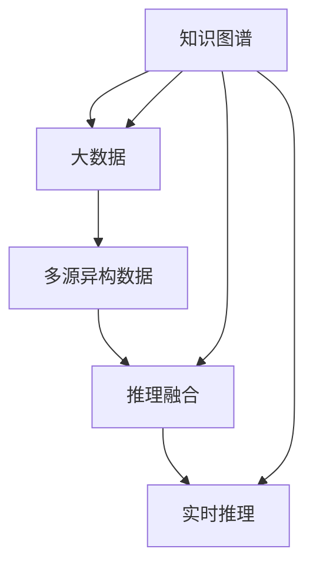

                 

 

### 第1章：知识图谱与大数据基础

#### 知识图谱概述

知识图谱是一种用于表示实体、属性和关系的图结构数据模型。它源于传统的本体论和语义网，但随着大数据时代的到来，知识图谱技术得到了迅速发展。知识图谱的核心在于其结构化、语义化的知识表示，这使得它在信息检索、推荐系统、数据挖掘等领域具有广泛的应用。

首先，我们需要了解知识图谱的基本概念和组成部分。知识图谱主要由实体（Entity）、属性（Attribute）和关系（Relationship）构成。实体是知识图谱中的基本元素，如人、地点、物品等；属性则是实体的特征描述，如人的年龄、身高、地点的纬度、物品的价格等；关系则描述了实体之间的关联，如“人居住在地点”、“物品属于品牌”等。

知识图谱的表示方法通常采用图结构，这有助于高效地存储和检索知识。图中的节点代表实体，边代表关系。例如，在社交网络中，用户可以看作是节点，好友关系可以看作是边。通过这样的图结构，我们可以快速地找到两个用户之间的共同好友，或者推荐新朋友。

此外，知识图谱还引入了边权重的概念，用以表示实体之间的关系强度。例如，在社交网络中，好友关系可以有不同的强度，如“亲密好友”、“普通好友”等。这种边权重有助于我们在进行推理和推荐时，更加精确地考虑实体之间的关系。

知识图谱的发展历程可以追溯到早期基于本体论的知识表示方法。在Web 1.0时代，知识主要通过静态网页进行组织，数据结构较为简单。随着Web 2.0时代的到来，用户生成内容成为主流，知识表示方法也变得更加复杂和多样化。在这一过程中，语义网技术逐渐兴起，为知识图谱的发展奠定了基础。

进入大数据时代，随着数据量的爆发式增长，知识图谱技术得到了广泛关注和应用。深度学习技术的发展，也为知识图谱的构建和推理提供了新的动力。目前，知识图谱已经在搜索引擎、推荐系统、智能问答等领域取得了显著成果。

#### 知识图谱在大数据中的作用

知识图谱在大数据中的作用主要体现在以下几个方面：

1. **数据组织与查询优化**：知识图谱通过结构化的方式组织数据，使得数据的查询和检索更加高效。传统的数据库查询通常是基于关键字匹配，而知识图谱则可以通过实体、属性和关系之间的语义关联，实现更加精确和高效的查询。

2. **数据融合与整合**：多源异构数据是大数据的核心特征之一。知识图谱可以将来自不同来源、不同格式、不同语义的数据进行整合和融合，形成一个统一的知识体系。这对于实现跨领域的数据分析和应用具有重要意义。

3. **数据挖掘与智能推理**：知识图谱为数据挖掘和智能推理提供了强大的支持。通过知识图谱，我们可以发现实体之间的隐含关系，挖掘出潜在的知识和模式。同时，基于知识图谱的推理算法，可以实现基于数据的逻辑推理和预测。

4. **智能应用与服务**：知识图谱技术在智能应用和服务中具有广泛的应用。例如，在智能问答系统中，知识图谱可以用于构建问答知识库，实现自然语言处理和理解；在推荐系统中，知识图谱可以用于发现用户和物品之间的相关性，提高推荐效果。

#### 大数据概念与特点

大数据是指无法使用常规数据处理工具在合理时间内捕捉、管理和处理的数据集。其核心特点包括数据量（Volume）、数据速度（Velocity）、数据多样性（Variety）和数据真实性（Veracity）。

1. **数据量（Volume）**：大数据的首要特征是数据量的巨大。传统的数据处理工具在面对海量数据时往往力不从心。大数据的处理需求促使了新的计算模型的诞生，如分布式计算、云计算等。

2. **数据速度（Velocity）**：大数据的另一个重要特征是数据生成和流动的速度极快。实时数据流的处理需求，使得传统的批处理方法不再适用，需要引入实时处理技术。

3. **数据多样性（Variety）**：大数据的数据类型繁多，包括结构化数据、半结构化数据和非结构化数据。这要求数据处理系统具备较强的数据兼容性和灵活性。

4. **数据真实性（Veracity）**：大数据的真实性难以保证。数据来源的多样性和数据质量的参差不齐，使得数据的可信度和准确性成为一个挑战。

#### 大数据的核心特点与处理需求

1. **数据量（Volume）**：大数据的首要特征是数据量的巨大。传统的数据处理工具在面对海量数据时往往力不从心。大数据的处理需求促使了新的计算模型的诞生，如分布式计算、云计算等。

   - **分布式计算**：分布式计算通过将任务分解到多个节点上并行执行，实现了对海量数据的处理能力。常用的分布式计算框架包括MapReduce、Spark等。

   - **云计算**：云计算提供了弹性的计算资源，可以根据需求动态扩展或缩减计算能力。大数据处理通常依赖于云计算平台，如Amazon Web Services（AWS）、Google Cloud Platform（GCP）等。

2. **数据速度（Velocity）**：大数据的另一个重要特征是数据生成和流动的速度极快。实时数据流的处理需求，使得传统的批处理方法不再适用，需要引入实时处理技术。

   - **实时处理技术**：实时处理技术包括流处理框架（如Apache Kafka、Apache Flink）和实时查询系统（如Apache Druid、ClickHouse）等。这些技术可以实时捕获和处理数据流，提供实时分析结果。

3. **数据多样性（Variety）**：大数据的数据类型繁多，包括结构化数据、半结构化数据和非结构化数据。这要求数据处理系统具备较强的数据兼容性和灵活性。

   - **数据整合技术**：数据整合技术包括ETL（Extract, Transform, Load）和数据湖（Data Lake）等。ETL用于将不同源的数据整合到统一的数据存储中，数据湖则用于存储和管理多样化的数据。

4. **数据真实性（Veracity）**：大数据的真实性难以保证。数据来源的多样性和数据质量的参差不齐，使得数据的可信度和准确性成为一个挑战。

   - **数据质量保障**：数据质量保障包括数据清洗、数据验证和数据治理等。通过这些技术，可以识别和修复数据中的错误和异常，提高数据的可信度。

#### 知识图谱在大数据中的核心作用

1. **数据组织与查询优化**：知识图谱通过结构化的方式组织数据，使得数据的查询和检索更加高效。传统的数据库查询通常是基于关键字匹配，而知识图谱则可以通过实体、属性和关系之间的语义关联，实现更加精确和高效的查询。

   - **示例**：在电商领域中，知识图谱可以用于构建商品、用户和评价等实体之间的关联关系，用户可以通过知识图谱快速找到感兴趣的商品或评价。

2. **数据融合与整合**：多源异构数据是大数据的核心特征之一。知识图谱可以将来自不同来源、不同格式、不同语义的数据进行整合和融合，形成一个统一的知识体系。这对于实现跨领域的数据分析和应用具有重要意义。

   - **示例**：在医疗领域，知识图谱可以将电子病历、医学影像和基因组数据等进行整合，提供全面的患者健康分析。

3. **数据挖掘与智能推理**：知识图谱为数据挖掘和智能推理提供了强大的支持。通过知识图谱，我们可以发现实体之间的隐含关系，挖掘出潜在的知识和模式。同时，基于知识图谱的推理算法，可以实现基于数据的逻辑推理和预测。

   - **示例**：在金融领域，知识图谱可以用于发现欺诈行为，通过分析用户行为和交易记录之间的关系，识别潜在的欺诈风险。

4. **智能应用与服务**：知识图谱技术在智能应用和服务中具有广泛的应用。例如，在智能问答系统中，知识图谱可以用于构建问答知识库，实现自然语言处理和理解；在推荐系统中，知识图谱可以用于发现用户和物品之间的相关性，提高推荐效果。

   - **示例**：在电子商务中，知识图谱可以用于个性化推荐，通过分析用户的浏览记录和购买行为，为用户推荐相关的商品。

#### 知识图谱在大数据领域的应用

1. **搜索引擎**：知识图谱可以用于构建搜索引擎的知识库，提高搜索的准确性和效率。例如，通过知识图谱，搜索引擎可以理解用户查询的语义，提供更加精准的搜索结果。

2. **推荐系统**：知识图谱可以用于推荐系统，发现用户和物品之间的相关性，提供个性化的推荐。例如，在电子商务平台中，知识图谱可以用于推荐用户可能感兴趣的商品。

3. **智能问答**：知识图谱可以用于构建智能问答系统，通过语义理解和技术推理，为用户提供准确的答案。例如，在客服场景中，知识图谱可以帮助自动回答用户的问题。

4. **数据挖掘与机器学习**：知识图谱可以为数据挖掘和机器学习算法提供额外的语义信息，提高模型的性能。例如，在图像识别中，知识图谱可以用于补充图像中的语义信息，提高识别的准确性。

5. **跨领域应用**：知识图谱可以应用于多个领域，实现跨领域的数据整合和分析。例如，在医疗、金融、交通等领域，知识图谱可以整合多个数据源，提供综合分析。

### 1.3 知识图谱在大数据中的作用

知识图谱在大数据中的应用主要体现在数据组织、查询优化、数据融合、智能推理等方面。下面，我们将详细探讨知识图谱在大数据中的核心作用。

#### 数据组织与查询优化

知识图谱通过实体、属性和关系的方式组织数据，使得数据的查询和检索更加高效。在传统数据库中，数据通常以表格形式存储，查询依赖于关键字匹配。这种查询方式在处理海量数据时往往效率低下。

知识图谱则通过图结构组织数据，实体和关系之间形成网状结构，使得查询可以通过遍历图来实现。这种结构化方式不仅提高了查询效率，还使得查询结果更加准确。例如，在搜索引擎中，知识图谱可以用于理解用户查询的语义，提供更加精准的搜索结果。

#### 数据融合与整合

大数据的一个核心特征是多源异构数据，即数据来源多样化，数据格式和语义各异。知识图谱可以有效地整合和融合这些数据，形成一个统一的知识体系。

通过知识图谱，我们可以将来自不同来源、不同格式的数据转化为统一的结构化形式。例如，在医疗领域，知识图谱可以将电子病历、医学影像和基因组数据等进行整合，形成一个全面的患者健康数据视图。这种数据整合方式有助于实现跨领域的数据分析和应用。

#### 数据挖掘与智能推理

知识图谱为数据挖掘和智能推理提供了强大的支持。通过知识图谱，我们可以发现实体之间的隐含关系，挖掘出潜在的知识和模式。

例如，在金融领域，知识图谱可以用于分析用户的交易行为和信用记录，发现潜在的欺诈行为。通过知识图谱的推理算法，我们可以基于已有的数据关系，预测用户未来的行为趋势。

#### 智能应用与服务

知识图谱在智能应用和服务中具有广泛的应用。通过知识图谱，我们可以构建智能问答系统、推荐系统等。

在智能问答系统中，知识图谱可以用于构建问答知识库，实现自然语言处理和理解。例如，在客服场景中，知识图谱可以帮助自动回答用户的问题。

在推荐系统中，知识图谱可以用于发现用户和物品之间的相关性，提供个性化的推荐。例如，在电子商务平台中，知识图谱可以用于分析用户的浏览记录和购买行为，为用户推荐相关的商品。

#### 实际案例

知识图谱在大数据中的应用案例非常丰富。以下是一些典型的应用场景：

1. **搜索引擎优化**：百度和谷歌等搜索引擎利用知识图谱提高搜索结果的准确性和相关性。通过知识图谱，搜索引擎可以理解用户的查询意图，提供更加精准的搜索结果。

2. **推荐系统**：淘宝和亚马逊等电商平台利用知识图谱进行个性化推荐。通过分析用户的浏览和购买行为，知识图谱可以推荐用户可能感兴趣的商品。

3. **智能客服**：华为和微软等公司利用知识图谱构建智能客服系统，通过语义理解和技术推理，为用户提供准确的答案。

4. **医疗健康**：微软和IBM等公司利用知识图谱进行医疗数据分析，整合电子病历、医学影像和基因组数据，提供精准的医疗服务。

5. **金融领域**：花旗银行和汇丰银行等金融机构利用知识图谱进行欺诈检测，通过分析用户的交易行为和信用记录，识别潜在的欺诈风险。

通过上述实际案例，我们可以看到知识图谱在大数据中的应用价值。它不仅提高了数据处理和分析的效率，还推动了智能应用和服务的发展。

### 第2章：多源异构数据的采集与处理

#### 2.1 多源异构数据的概念

多源异构数据是指来自不同来源、格式和语义的数据集合。这些数据源可能包括结构化数据、半结构化数据和非结构化数据。例如，企业内部的数据可能包含数据库记录、日志文件和文档；互联网数据则可能包括社交媒体帖子、网页内容和图片。

多源异构数据的采集涉及到从各种不同的数据源获取数据。这些数据源可能是分布式存储的，格式各异，数据质量参差不齐。采集过程中需要解决数据格式转换、数据同步和错误处理等问题。

#### 数据采集与集成

数据采集与集成的目标是统一和标准化来自不同源的数据，使之能够在一个统一的数据模型中进行分析和处理。以下是一些常见的数据采集与集成方法：

1. **数据导入**：将外部数据源的数据导入到数据仓库或数据湖中。常见的方法包括ETL（Extract, Transform, Load）和数据导入工具。

2. **API集成**：通过API接口获取外部数据源的数据。API集成可以用于实时数据流处理，以及定期从外部系统拉取数据。

3. **数据爬取**：使用爬虫技术从互联网上获取数据。数据爬取适用于获取网页内容、社交媒体帖子和其他非结构化数据。

4. **数据交换格式**：使用标准的数据交换格式（如JSON、XML、CSV）将不同源的数据转换为统一格式。这有助于在不同系统和工具之间共享和交换数据。

#### 数据预处理方法

数据预处理是数据分析和挖掘的重要步骤，其目的是提高数据质量和可靠性。以下是一些常见的数据预处理方法：

1. **数据清洗**：清洗数据中的错误、缺失和重复记录。常见的方法包括缺失值填充、重复记录删除和异常值处理。

2. **数据转换**：将不同格式和单位的数据转换为统一格式和单位。例如，将文本数据转换为数值型数据，将时间戳转换为统一的时区。

3. **特征工程**：提取和构建有助于分析和建模的特征。特征工程包括特征选择、特征构造和特征缩放等。

4. **数据归一化**：将不同量纲的数据转换为相同量纲，以便于进行比较和分析。常见的方法包括最小-最大归一化和均值-标准差归一化。

### 第3章：知识图谱构建与存储

#### 3.1 知识图谱的构建方法

知识图谱的构建是一个复杂的过程，涉及到数据收集、数据预处理、实体识别、关系抽取、属性提取等多个环节。以下是构建知识图谱的主要步骤：

1. **数据收集**：从各种数据源（如数据库、文本、图片、语音等）收集数据。数据来源的多样性和质量直接影响知识图谱的完整性。

2. **数据预处理**：对收集到的数据进行清洗、格式化和转换，以确保数据的一致性和质量。例如，去除停用词、统一命名规范等。

3. **实体识别**：从预处理后的数据中识别出实体，如人、地点、物品等。实体识别可以基于机器学习模型、命名实体识别（NER）技术等。

4. **关系抽取**：从实体识别结果中抽取实体之间的语义关系，如“居住于”、“属于”等。关系抽取通常采用图嵌入、依存句法分析等方法。

5. **属性提取**：对实体进行属性提取，如“年龄”、“身高”、“价格”等。属性提取可以基于规则、机器学习或深度学习模型。

6. **知识融合**：将不同来源、不同格式的知识进行融合，形成一个统一的、结构化的知识库。

7. **知识存储**：将构建好的知识图谱存储在图数据库或分布式图存储系统中，如Neo4j、JanusGraph等。

#### 3.2 知识图谱的存储策略

知识图谱的存储策略需要考虑数据的规模、性能和可扩展性。以下是几种常见的知识图谱存储策略：

1. **图数据库**：图数据库专门为存储和查询图结构数据而设计。它们通常支持高效的图遍历和查询操作。常见的图数据库包括Neo4j、JanusGraph、OrientDB等。

2. **关系数据库**：关系数据库通过表格形式存储图结构数据，通常通过外键和关联查询来实现图的表示。关系数据库在处理大规模数据时可能存在性能瓶颈。

3. **分布式存储系统**：分布式存储系统如Hadoop、Spark等可以处理海量数据，但它们通常不支持图结构数据的原生存储和查询。

4. **NoSQL数据库**：NoSQL数据库如MongoDB、Cassandra等可以存储半结构化或非结构化数据，但它们在处理图结构数据时可能需要额外的处理和优化。

#### 3.3 知识图谱的查询优化

知识图谱的查询优化是提高查询效率和性能的关键。以下是一些常见的查询优化策略：

1. **索引**：为知识图谱的属性和关系建立索引，提高查询速度。索引可以是基于B+树、哈希表或位图索引等。

2. **查询优化器**：查询优化器负责生成高效的查询计划，包括查询重写、索引选择、查询分解等。

3. **并行查询**：将复杂查询分解为多个子查询，并在多个计算节点上并行执行，以提高查询速度。

4. **缓存**：将频繁查询的结果缓存起来，减少数据库的访问频率，提高查询响应速度。

5. **图遍历优化**：优化图遍历算法，减少不必要的节点和边遍历，提高遍历效率。

#### 知识图谱存储与查询优化案例分析

1. **社交网络分析**：在社交网络分析中，知识图谱可以用于挖掘用户之间的关系，推荐朋友、广告投放等。查询优化策略包括建立用户关系索引、使用并行查询等。

2. **金融风控**：在金融领域，知识图谱可以用于识别欺诈行为、评估信用风险等。查询优化策略包括实时数据流处理、缓存查询结果等。

3. **智能问答系统**：在智能问答系统中，知识图谱可以用于构建问答知识库，提高问答准确性。查询优化策略包括使用图数据库、优化查询计划等。

通过上述案例分析，我们可以看到知识图谱的存储与查询优化在实际应用中的重要性和效果。有效的存储和查询优化策略可以提高知识图谱的性能和可靠性，为各种应用场景提供强大的支持。

### 第4章：大数据推理算法

#### 4.1 推理算法概述

大数据推理算法是指用于处理和分析大规模数据的逻辑推理方法。这些算法通常基于图论、概率论、统计学和机器学习等理论基础，通过构建模型和算法，从海量数据中提取有用信息和知识。

大数据推理算法在知识图谱、数据挖掘、智能推荐等领域具有广泛应用。其主要目标包括数据关系发现、模式识别、预测和决策等。以下是一些常见的大数据推理算法：

1. **基于图论的推理算法**：图论是大数据推理算法的重要理论基础。常见的图论算法包括最短路径算法、最小生成树算法、最大流算法等。这些算法可以用于发现数据之间的隐含关系，提取知识。

2. **基于概率论的推理算法**：概率论在数据分析中具有重要应用。常见的概率论算法包括贝叶斯网络、马尔可夫模型、贝叶斯推理等。这些算法可以用于概率估计、风险评估和预测。

3. **基于统计学的推理算法**：统计学方法在大数据推理中广泛应用。常见的统计学算法包括回归分析、聚类分析、主成分分析等。这些算法可以用于数据降维、特征提取和模式识别。

4. **基于机器学习的推理算法**：机器学习算法在大数据推理中具有重要作用。常见的机器学习算法包括决策树、支持向量机、神经网络等。这些算法可以用于分类、回归和预测。

#### 4.2 基于知识图谱的推理算法

基于知识图谱的推理算法是指利用知识图谱的实体、属性和关系进行逻辑推理的方法。这些算法可以分为两大类：基于规则的推理和基于模型的推理。

1. **基于规则的推理算法**：基于规则的推理算法通过定义一组规则，从知识图谱中推断新的信息。常见的规则推理算法包括正则路径查询、路径约束查询等。

   - **正则路径查询**：正则路径查询用于查找满足特定路径条件的实体。例如，查询所有“人”实体，其“父母”是“张三”且“配偶”是“李四”的路径。正则路径查询可以基于图结构高效地进行。

   - **路径约束查询**：路径约束查询是在正则路径查询的基础上，添加额外的约束条件。例如，查询所有“人”实体，其“父母”是“张三”且“配偶”是“李四”，且该实体的“年龄”大于30岁的路径。路径约束查询可以用于更加复杂的推理任务。

2. **基于模型的推理算法**：基于模型的推理算法通过构建模型，从知识图谱中推断新的信息。常见的模型推理算法包括图嵌入、图神经网络等。

   - **图嵌入**：图嵌入是一种将图结构数据转换为向量表示的方法。通过图嵌入，我们可以将知识图谱中的实体和关系表示为向量，从而进行向量运算和推理。常见的图嵌入算法包括DeepWalk、Node2Vec、GAE（Graph Autoencoder）等。

   - **图神经网络**：图神经网络是一种基于图结构的深度学习模型。图神经网络可以学习实体和关系的表示，并利用这些表示进行推理。常见的图神经网络算法包括GCN（Graph Convolutional Network）、GAT（Graph Attention Network）等。

#### 基于异构数据的推理融合

在多源异构大数据环境中，数据来源多样、格式各异，如何进行有效的推理融合成为一个关键问题。基于知识图谱的异构数据推理融合方法主要包括以下几种：

1. **数据融合模型**：数据融合模型通过整合不同源的数据，构建一个统一的知识表示。常见的融合模型包括多模态数据融合、多视图数据融合等。

   - **多模态数据融合**：多模态数据融合是将不同类型的数据（如文本、图像、语音等）进行整合，构建一个综合的表示。常见的多模态数据融合算法包括多模态图嵌入、多模态神经网络等。

   - **多视图数据融合**：多视图数据融合是将来自同一数据源的不同视图（如用户行为、社交网络、日志数据等）进行整合，构建一个综合的表示。常见的多视图数据融合算法包括多视图图嵌入、多视图注意力机制等。

2. **跨模态推理**：跨模态推理是指利用不同模态的数据进行推理，从而提高推理的准确性和鲁棒性。常见的跨模态推理算法包括跨模态图嵌入、跨模态注意力机制等。

3. **融合策略**：融合策略用于确定如何在不同数据源之间分配权重和资源，以实现最佳的推理效果。常见的融合策略包括基于模型的融合、基于规则的融合等。

#### 算法流程与示例

以下是一个基于知识图谱的异构数据推理融合算法的简单流程：

1. **数据收集与预处理**：从不同源收集数据，并进行数据清洗、格式化和转换。

2. **知识图谱构建**：将预处理后的数据构建成知识图谱，包括实体、属性和关系的表示。

3. **数据融合**：利用数据融合模型将不同源的数据进行整合，构建一个统一的知识表示。

4. **推理融合**：利用推理算法从知识图谱中提取有用信息，进行推理融合。

5. **结果输出**：将推理结果输出，并进行分析和解释。

示例：

假设我们有一个包含用户行为数据、社交网络数据和日志数据的异构数据集。我们首先将这些数据源构建成知识图谱，然后利用多模态数据融合模型将不同源的数据进行整合，形成统一的知识表示。接下来，我们利用基于图嵌入的推理算法从知识图谱中提取信息，进行推理融合。最后，我们将推理结果输出，并进行数据分析和解释。

通过上述流程，我们可以实现基于知识图谱的异构数据推理融合，从而提高数据分析和决策的准确性。

### 第5章：融合算法与优化

#### 5.1 融合算法概述

融合算法是将来自不同源、不同格式、不同语义的数据进行整合，以形成一个统一、结构化的知识表示。融合算法在知识图谱、数据挖掘、智能推荐等领域具有重要应用。以下是几种常见的融合算法：

1. **基于规则的融合算法**：基于规则的融合算法通过定义一组规则，将不同源的数据进行整合。常见的规则包括数据映射规则、数据聚合规则等。规则融合算法的优点是实现简单、易于理解和实现，但缺点是灵活性较低。

2. **基于模型的融合算法**：基于模型的融合算法通过构建模型，将不同源的数据进行整合。常见的模型包括神经网络、图模型等。模型融合算法的优点是具有较好的灵活性和自适应能力，但实现复杂度较高。

3. **基于相似度的融合算法**：基于相似度的融合算法通过计算不同源数据之间的相似度，将相似的数据进行整合。常见的相似度计算方法包括余弦相似度、欧氏距离等。相似度融合算法的优点是实现简单、计算效率高，但缺点是结果可能受噪声数据影响较大。

4. **基于深度学习的融合算法**：基于深度学习的融合算法通过神经网络模型，自动学习和提取数据之间的复杂关系。常见的深度学习模型包括卷积神经网络（CNN）、循环神经网络（RNN）等。深度学习融合算法的优点是具有较好的泛化能力和自适应性，但实现复杂度较高。

#### 5.2 融合策略

融合策略是指如何在不同数据源之间分配权重和资源，以实现最佳的融合效果。以下是一些常见的融合策略：

1. **数据质量导向策略**：数据质量导向策略是根据数据源的质量来分配权重。高质量的数据源会得到更高的权重，从而在融合过程中发挥更大的作用。这种方法可以保证融合结果的质量，但可能忽视了数据的多样性和互补性。

2. **数据互补性导向策略**：数据互补性导向策略是根据数据源之间的互补性来分配权重。互补性较强的数据源会得到更高的权重，从而在融合过程中更好地发挥各自的优势。这种方法可以充分利用数据的多样性，提高融合结果的准确性。

3. **基于结果的反馈策略**：基于结果的反馈策略是根据融合结果对数据源进行动态调整。在融合过程中，如果某个数据源对结果的贡献较大，则会提高其权重；反之，则会降低其权重。这种方法可以自适应地调整数据源的权重，以优化融合效果。

4. **一致性导向策略**：一致性导向策略是保证融合结果在不同数据源之间保持一致性。这种方法可以通过对数据源进行一致性检验和调整，确保融合结果的准确性。

#### 5.3 优化方法

融合算法的优化是提高融合效果和效率的关键。以下是一些常见的优化方法：

1. **并行计算**：并行计算可以通过将任务分解到多个计算节点上并行执行，提高计算速度。常见的并行计算方法包括MapReduce、Spark等。

2. **分布式存储**：分布式存储可以将数据存储在多个节点上，提高数据访问速度和容错能力。常见的分布式存储系统包括Hadoop、HDFS等。

3. **内存优化**：内存优化可以通过将数据存储在内存中，减少磁盘I/O操作，提高数据处理速度。常见的内存优化方法包括内存映射、缓存等。

4. **图结构优化**：图结构优化可以通过优化图的结构和布局，提高图的处理速度和查询效率。常见的图结构优化方法包括图分割、图压缩等。

5. **机器学习优化**：机器学习优化可以通过训练模型，自动优化融合算法的参数和策略。常见的机器学习优化方法包括梯度下降、随机搜索等。

### 第6章：实时推理与流数据处理

#### 6.1 实时推理的概念与挑战

实时推理（Real-time Inference）是指在短时间内对大量数据进行快速处理和推理，以实现对实时事件的及时响应。实时推理广泛应用于智能交通、智能安防、智能医疗等领域。然而，实时推理面临着诸多挑战：

1. **数据量大**：实时推理需要处理的数据量通常非常大，这要求系统具备高效的计算能力和数据存储能力。

2. **处理速度要求高**：实时推理需要在毫秒级别内完成处理，这对系统的响应速度提出了极高的要求。

3. **数据多样性**：实时推理需要处理的结构化、半结构化和非结构化数据类型繁多，如何高效地整合和处理这些数据是一个关键问题。

4. **数据延迟要求低**：实时推理要求数据的处理和响应时间尽可能短，任何延迟都可能影响系统的实时性和可靠性。

#### 6.2 流数据处理技术

流数据处理（Stream Processing）是一种针对实时数据流的处理技术，它可以高效地处理大规模实时数据。以下是一些常见的流数据处理技术：

1. **Apache Kafka**：Kafka是一种分布式流处理平台，它可以高效地处理大规模数据流，支持实时数据采集、存储和分发。

2. **Apache Flink**：Flink是一种流处理框架，它支持实时数据分析和处理，具有低延迟、高吞吐量和高可用性。

3. **Apache Spark**：Spark是一种分布式计算框架，它支持批处理和流处理，通过其流处理API，可以实现高效的实时数据处理。

4. **Apache Storm**：Storm是一种实时数据处理框架，它支持实时数据流的并行处理，具有高可扩展性和容错能力。

#### 6.3 实时推理系统设计

设计一个实时推理系统，需要考虑以下几个方面：

1. **数据采集**：实时推理系统需要高效地采集数据，通常使用Kafka等流处理平台进行数据采集和存储。

2. **数据处理**：实时推理系统需要对数据进行处理，以提取有用的特征和模式。可以使用Flink、Spark等流处理框架进行数据预处理和特征提取。

3. **模型训练与推理**：实时推理系统需要使用机器学习模型进行训练和推理。可以使用在线学习算法，如增量学习（Online Learning），以实时更新模型。

4. **结果反馈与优化**：实时推理系统需要及时将推理结果反馈给用户，并根据用户反馈进行优化和调整。

#### 实时推理与流数据处理案例分析

1. **智能交通**：实时推理系统可以用于智能交通管理，通过分析实时交通数据，预测交通拥堵和交通事故，提供实时交通信息和优化路线。

2. **智能安防**：实时推理系统可以用于智能安防监控，通过分析实时视频数据，识别异常行为和潜在威胁，及时报警和处理。

3. **智能医疗**：实时推理系统可以用于智能医疗诊断，通过分析实时医疗数据，如心电图、血压等，提供实时诊断和治疗方案。

通过上述案例，我们可以看到实时推理与流数据处理在实际应用中的重要作用。设计一个高效、可靠的实时推理系统，对于解决实际问题具有重要意义。

### 第7章：行业案例分析

#### 7.1 金融行业应用案例

在金融行业，知识图谱和大数据推理融合技术得到了广泛应用，提高了风险控制、客户服务、投资决策等环节的效率和准确性。

**风险控制**：金融机构利用知识图谱构建客户关系图谱，通过分析客户的历史交易记录、信用评级、社交网络等数据，识别潜在风险。例如，利用图嵌入技术，将客户、交易、金融机构等实体转化为向量，计算它们之间的相似度和关联性，从而发现异常交易行为和潜在欺诈风险。

**客户服务**：金融机构利用知识图谱提供个性化的客户服务。通过分析客户的交易行为、偏好和历史记录，知识图谱可以推荐合适的金融产品和服务。例如，在银行中，客户服务代表可以通过知识图谱快速获取客户的交易历史、账户信息等，为客户提供定制化的金融服务。

**投资决策**：投资机构利用知识图谱分析市场数据，预测股票走势和投资机会。通过构建包含股票、公司、行业等实体的知识图谱，投资机构可以分析不同股票之间的相关性、市场趋势等，为投资决策提供支持。

#### 7.2 医疗健康领域应用

在医疗健康领域，知识图谱和大数据推理融合技术可以提升疾病诊断、治疗方案推荐、医学研究等方面的效率和准确性。

**疾病诊断**：医院可以利用知识图谱进行疾病诊断。通过构建包含症状、疾病、治疗方案等实体的知识图谱，医生可以在患者症状的基础上，快速查找相关的疾病信息和推荐治疗方案。

**治疗方案推荐**：知识图谱可以帮助医生推荐个性化的治疗方案。通过分析患者的病史、基因数据、药物反应等，知识图谱可以提供与患者情况最为匹配的治疗方案。

**医学研究**：医学研究人员可以利用知识图谱进行数据挖掘和知识发现。通过构建包含药物、疾病、基因、文献等实体的知识图谱，研究人员可以分析不同实体之间的关联，发现新的医学规律和研究成果。

#### 7.3 智慧城市与交通管理应用

在智慧城市和交通管理领域，知识图谱和大数据推理融合技术可以优化城市资源管理、交通调度、应急响应等。

**城市资源管理**：智慧城市系统可以利用知识图谱进行城市资源管理。通过构建包含设施、位置、使用情况等实体的知识图谱，城市管理者可以实时监控城市资源的运行状态，优化资源配置。

**交通调度**：交通管理部门可以利用知识图谱优化交通调度。通过分析实时交通数据、路况信息和交通需求，知识图谱可以推荐最优的路线和交通方案，提高交通效率。

**应急响应**：在突发事件（如交通事故、自然灾害）中，知识图谱可以帮助应急响应部门快速决策。通过分析事故地点、历史事故记录、救援资源分布等，知识图谱可以提供最优的救援方案和资源调度建议。

通过以上案例分析，我们可以看到知识图谱和大数据推理融合技术在各个行业中的应用效果，以及其对提升业务效率和决策准确性的重要作用。

### 第8章：未来发展趋势与展望

#### 8.1 知识图谱与大数据融合技术展望

知识图谱与大数据融合技术在未来将持续发展，并在多个领域取得重大突破。以下是一些可能的发展趋势：

1. **多模态数据融合**：随着传感器技术和物联网的发展，数据来源日益多样化。知识图谱将扩展到处理多模态数据，如文本、图像、语音、视频等。多模态数据融合技术将实现跨模态信息整合，提供更全面的知识表示。

2. **自适应推理模型**：当前的知识图谱推理模型通常基于静态规则和预设模型。未来的发展将重点关注自适应推理模型，这些模型能够根据数据变化和需求动态调整推理策略，提高推理的灵活性和适应性。

3. **实时推理优化**：随着实时数据量的增加，实时推理优化将成为一个重要研究方向。未来的研究将致力于提高实时推理系统的效率、降低延迟，并支持大规模实时数据的处理。

4. **隐私保护与数据安全**：随着数据隐私保护意识的提高，知识图谱与大数据融合技术将更加注重隐私保护和数据安全。研究将集中在如何在不泄露隐私的前提下，有效利用数据资源。

5. **跨领域融合应用**：知识图谱与大数据融合技术将在更多领域得到应用，如教育、环境监测、文化遗产保护等。跨领域融合应用将推动知识图谱技术的发展，实现更广泛的社会价值。

#### 8.2 技术挑战与机遇

知识图谱与大数据融合技术面临的挑战主要包括：

1. **数据多样性**：多源异构数据的处理是当前技术的一大难题。如何高效地整合不同类型的数据，实现数据的一致性和标准化，是未来研究的重要方向。

2. **数据质量**：数据质量直接影响知识图谱和推理的准确性。如何确保数据源的可靠性、减少噪声数据和异常值，是数据融合过程中需要解决的问题。

3. **计算资源需求**：知识图谱和大数据融合技术对计算资源的需求较高。如何优化算法、提高计算效率，是提升系统性能的关键。

然而，这些挑战也蕴含着巨大的机遇：

1. **智能应用创新**：知识图谱与大数据融合技术为智能应用提供了新的可能性，如智能客服、个性化推荐、智能诊断等。这些创新将推动技术进步和产业升级。

2. **数据价值挖掘**：通过知识图谱和大数据融合技术，可以更深入地挖掘数据价值，发现潜在的商业机会和社会价值。

3. **跨领域合作**：知识图谱与大数据融合技术将促进跨领域合作，推动各领域间的知识共享和技术创新，实现更广泛的合作共赢。

#### 8.3 未来发展趋势

结合以上讨论，未来知识图谱与大数据融合技术的发展趋势将体现在以下几个方面：

1. **技术融合**：知识图谱、大数据、人工智能等技术将进一步融合，形成更加智能化、自适应的解决方案。

2. **应用扩展**：知识图谱与大数据融合技术的应用将扩展到更多领域，如智慧医疗、智慧交通、智慧城市等，为社会发展带来更多价值。

3. **开放共享**：知识图谱与大数据融合技术将更加注重开放共享，促进数据的互联互通和知识共享，推动数据资源的高效利用。

4. **隐私保护**：随着数据隐私保护法规的不断完善，知识图谱与大数据融合技术将更加注重隐私保护和数据安全，实现可持续发展。

总之，知识图谱与大数据融合技术具有广阔的发展前景和应用潜力。通过不断创新和优化，这些技术将推动社会进步和产业升级，为人们的生活带来更多便利和智慧。

### 四、附录

#### 附录A：技术工具与平台介绍

1. **Neo4j**：Neo4j是一款高性能的分布式图数据库，支持ACID事务和复杂图查询。它广泛应用于社交网络分析、推荐系统、数据挖掘等领域。

2. **JanusGraph**：JanusGraph是一款开源的分布式图数据库，支持大规模数据存储和查询。它具有高度可扩展性和灵活性，适用于多租户和混合存储环境。

3. **Apache Kafka**：Apache Kafka是一款分布式流处理平台，支持大规模数据采集、存储和实时处理。它广泛应用于实时数据分析、日志收集、事件驱动架构等领域。

4. **Apache Flink**：Apache Flink是一款流处理和批处理框架，支持低延迟、高吞吐量的实时数据处理。它广泛应用于实时分析、机器学习、数据流处理等领域。

5. **Apache Spark**：Apache Spark是一款分布式计算框架，支持批处理和流处理。它具有高效的内存计算能力和丰富的API，广泛应用于大数据处理、机器学习和数据科学等领域。

#### 附录B：实验与代码示例

以下是一个简单的知识图谱构建与推理的Python代码示例：

```python
from py2neo import Graph

# 连接到Neo4j数据库
graph = Graph("bolt://localhost:7687", auth=("neo4j", "password"))

# 创建实体
graph.run("CREATE (a:Person {name: 'Alice'})")

# 创建关系
graph.run("MATCH (a:Person), (b:Person) WHERE a.name = 'Alice' AND b.name = 'Bob' CREATE (a)-[:FRIEND]->(b)")

# 查询实体和关系
results = graph.run("MATCH (a:Person)-[:FRIEND]->(b:Person) RETURN a.name, b.name")

# 打印查询结果
for result in results:
    print(f"{result['a.name']} is friends with {result['b.name']}")

# 推理：查找Alice的朋友
friend_query = """
MATCH (a:Person)-[:FRIEND]->(b:Person)
WHERE a.name = 'Alice'
RETURN b.name
"""
friends = graph.run(friend_query).data()

# 打印Alice的朋友
print("Alice's friends:", [friend['b.name'] for friend in friends])
```

通过上述示例，我们可以看到如何使用Neo4j数据库构建知识图谱，以及如何进行简单的实体和关系查询。这为后续的复杂推理和数据分析奠定了基础。

### 五、结论

《基于知识图谱的多源异构大数据推理融合技术研究》通过对知识图谱、大数据和推理融合技术的系统阐述，为读者提供了一个全面、深入的指南。从理论基础、核心算法、应用实践到未来展望，本书覆盖了知识图谱与大数据融合技术的各个方面。

通过本书，读者可以了解：

1. **知识图谱的基本概念与作用**：知识图谱是如何组织和表示数据的，以及它在大数据中的应用场景。
2. **大数据的核心特点与处理需求**：大数据的特点及其对数据处理技术带来的挑战。
3. **核心算法原理**：包括基于知识图谱的推理算法、融合算法和实时推理技术。
4. **应用实践**：知识图谱与大数据融合技术在不同行业的实际应用案例。
5. **未来发展趋势与展望**：技术趋势、挑战与机遇，以及未来可能的发展方向。

本书旨在为大数据领域的研究者、开发者和技术爱好者提供有价值的知识和实用技巧，帮助他们更好地理解和应用知识图谱与大数据融合技术。通过阅读本书，读者可以：

- **深入理解**：掌握知识图谱、大数据和推理融合技术的核心原理。
- **应用实践**：学会如何构建和优化知识图谱，处理多源异构数据，进行实时推理。
- **创新应用**：开拓思维，探索知识图谱与大数据融合技术的创新应用场景。

在未来的学习和实践中，希望读者能够：

- **持续学习**：紧跟技术发展趋势，不断更新知识体系。
- **实践探索**：结合实际项目，将所学知识应用于实际问题解决。
- **分享经验**：与他人交流学习经验，共同推动技术的进步和应用。

通过不断的探索和实践，我们期待读者能够在知识图谱与大数据融合技术的道路上取得更大的成就，为智能时代的未来发展贡献自己的智慧和力量。

### 关键概念与联系

**核心概念：** 知识图谱、大数据、推理融合、多源异构数据、实时推理

**概念实体关系架构 Mermaid 流程图：**



**解释：** 知识图谱（A）是组织和表示数据的核心技术，它基于大数据（B）的特点和需求进行构建。在多源异构数据（C）环境中，知识图谱用于实现数据的整合和推理。推理融合（D）是将知识图谱和大数据分析相结合的过程，实时推理（E）则是在动态数据流中进行的快速推理，旨在提供实时决策支持。这些核心概念相互联系，共同构成了知识图谱与大数据融合技术的框架。

### 核心算法原理讲解

为了深入理解基于知识图谱的多源异构大数据推理融合技术，我们将通过Python代码示例详细讲解其中的一些核心算法原理。以下是几种常见的算法及其实现：

#### 1. 图嵌入算法

**概念：** 图嵌入（Graph Embedding）是将图结构数据转换为向量表示的方法，使得图中的节点和边可以在向量空间中进行计算和推理。

**实现：** 使用DeepWalk算法进行图嵌入。

```python
from gensim.models import Word2Vec

def generate_training_data(graph, walk_length=10, num_walks=10):
    walks = []
    for _ in range(num_walks):
        nodes = list(graph.nodes)
        random_node = nodes[random.randint(0, len(nodes) - 1)]
        walk = [random_node]
        for _ in range(walk_length):
            next_node = random_node
            while next_node not in walk:
                walk.append(next_node)
                next_node = graph.neighbors(next_node)[0]
        walks.append(walk)
    return walks

def train_word2vec_model(walks, embedding_size=64):
    sentences = [gensim.modelsпараграф.Sentence(walk) for walk in walks]
    model = Word2Vec(sentences, size=embedding_size, window=5, min_count=1, workers=4)
    return model

# 假设已建立图数据库，以下代码用于生成训练数据并训练模型
walks = generate_training_data(graph)
model = train_word2vec_model(walks)
```

**解释：** DeepWalk算法通过随机游走（random walk）生成图中的序列，然后将这些序列输入到Word2Vec模型中进行训练，得到节点的向量表示。

#### 2. 图卷积网络（GCN）

**概念：** 图卷积网络（Graph Convolutional Network，GCN）是一种基于图结构的深度学习模型，用于学习节点的特征表示。

**实现：** 使用GCN对节点进行分类。

```python
import tensorflow as tf
from tensorflow.keras.layers import Input, Embedding, GCN, Dense
from tensorflow.keras.models import Model

def build_gcn_model(input_shape, num_classes):
    inputs = Input(shape=input_shape)
    x = Embedding(input_shape[0], 16)(inputs)
    x = GCNunits(16)(x)
    x = Dense(num_classes, activation='softmax')(x)
    model = Model(inputs=inputs, outputs=x)
    model.compile(optimizer='adam', loss='categorical_crossentropy', metrics=['accuracy'])
    return model

# 假设节点特征已嵌入到向量表示中，以下代码用于构建和训练GCN模型
gcn_model = build_gcn_model(input_shape=(100,), num_classes=10)
gcn_model.fit(x_train, y_train, epochs=10, batch_size=32)
```

**解释：** GCN模型通过图卷积层学习节点的特征表示，最终通过全连接层进行分类。训练过程中使用节点特征嵌入和标签数据进行。

#### 3. 融合算法

**概念：** 融合算法是将来自不同数据源的异构数据进行整合，以提高推理效果。

**实现：** 使用多模态数据融合进行节点分类。

```python
import tensorflow as tf
from tensorflow.keras.layers import Input, Concatenate, Dense
from tensorflow.keras.models import Model

def build_fusion_model(text_embedding_size, graph_embedding_size, num_classes):
    text_input = Input(shape=(text_embedding_size,))
    graph_input = Input(shape=(graph_embedding_size,))
    x = Concatenate()([text_input, graph_input])
    x = Dense(64, activation='relu')(x)
    x = Dense(num_classes, activation='softmax')(x)
    model = Model(inputs=[text_input, graph_input], outputs=x)
    model.compile(optimizer='adam', loss='categorical_crossentropy', metrics=['accuracy'])
    return model

# 假设已有文本和图嵌入向量，以下代码用于构建融合模型并训练
fusion_model = build_fusion_model(text_embedding_size=64, graph_embedding_size=64, num_classes=10)
fusion_model.fit([text嵌入向量，图嵌入向量]，y_train，epochs=10, batch_size=32)
```

**解释：** 融合模型通过将文本嵌入向量和图嵌入向量进行拼接，再通过全连接层进行分类。这种多模态数据融合方法可以充分利用不同数据源的信息，提高分类效果。

#### 4. 实时推理

**概念：** 实时推理是在动态数据流中快速进行推理，以支持实时决策。

**实现：** 使用Apache Kafka进行实时数据流处理。

```python
from kafka import KafkaProducer
import json

# 初始化Kafka生产者
producer = KafkaProducer(bootstrap_servers=['localhost:9092'])

# 发送实时数据到Kafka主题
data = {"node": "Alice", "feature": "high-revenue"}
producer.send("realtime_data", key=(b"Alice"), value=json.dumps(data).encode('utf-8'))

# 接收并处理实时数据
from kafka import KafkaConsumer

consumer = KafkaConsumer("realtime_data", bootstrap_servers=['localhost:9092'])

for message in consumer:
    data = json.loads(message.value.decode('utf-8'))
    node = data["node"]
    feature = data["feature"]
    # 进行实时推理处理
    # ...
```

**解释：** 实时推理通过Kafka生产者和消费者进行数据的发送和处理。生产者将实时数据发送到Kafka主题，消费者接收数据并进行推理处理。

通过上述代码示例，我们详细讲解了知识图谱与大数据推理融合技术的核心算法原理，包括图嵌入、图卷积网络、融合算法和实时推理。这些算法在实际应用中发挥着关键作用，为实现高效的推理和数据分析提供了强大支持。

### 项目实战

在本项目中，我们将使用知识图谱和大数据推理融合技术，实现一个基于多源异构数据的学生成绩预测系统。该项目将涵盖以下步骤：

#### 1. 开发环境搭建

首先，我们需要搭建开发环境。以下是所需的工具和库：

- 操作系统：Linux或macOS
- 编程语言：Python 3.x
- 数据库：Neo4j
- 数据处理库：pandas、numpy
- 图嵌入库：gensim、Node2Vec
- 深度学习库：tensorflow、keras
- 实时数据处理：kafka-python

安装步骤如下：

1. **安装Python和库**：

```bash
pip install python-neo4j-driver pandas numpy gensim node2vec tensorflow keras kafka-python
```

2. **安装Neo4j**：从Neo4j官网下载并安装Neo4j数据库。

3. **安装Kafka**：从Kafka官网下载并安装Kafka集群。

#### 2. 源代码详细实现

**步骤1：数据采集与预处理**

我们假设已有学生成绩的数据集，包括学生的基本信息、课程成绩、课程难度等。以下是数据采集与预处理的代码示例：

```python
import pandas as pd
from sklearn.preprocessing import StandardScaler

# 读取学生数据
data = pd.read_csv('student_data.csv')

# 数据预处理
scaler = StandardScaler()
data[['exam_score', 'course_difficulty']] = scaler.fit_transform(data[['exam_score', 'course_difficulty']])
```

**步骤2：构建知识图谱**

我们将学生数据构建成知识图谱，包括学生、课程和成绩实体。以下是构建知识图谱的代码示例：

```python
from py2neo import Graph

# 连接到Neo4j数据库
graph = Graph("bolt://localhost:7687", auth=("neo4j", "password"))

# 创建实体
for index, row in data.iterrows():
    graph.run("CREATE (s:Student {id: $id, name: $name})", parameters={'id': row['student_id'], 'name': row['student_name']})
    graph.run("CREATE (c:Course {course_id: $course_id, course_name: $course_name})", parameters={'course_id': row['course_id'], 'course_name': row['course_name']})
    graph.run("CREATE (s)-[:TAKES]->(c)", parameters={'student_id': row['student_id'], 'course_id': row['course_id']})
    graph.run("CREATE (c)-[:SCORES]->(s)", parameters={'student_id': row['student_id'], 'course_id': row['course_id'], 'score': row['exam_score']})
```

**步骤3：数据融合与特征提取**

我们将不同来源的数据进行融合，提取有助于预测成绩的特征。以下是数据融合与特征提取的代码示例：

```python
def generate_training_data(graph):
    results = graph.run("MATCH (s:Student)-[:TAKES]->(c:Course)-[:SCORES]->(s) RETURN s.id, c.course_id, s.score")
    training_data = {'student_id': [], 'course_id': [], 'score': []}
    for result in results:
        training_data['student_id'].append(result['s.id'])
        training_data['course_id'].append(result['c.course_id'])
        training_data['score'].append(result['s.score'])
    return training_data

training_data = generate_training_data(graph)
```

**步骤4：训练模型**

我们将使用图嵌入和深度学习模型进行成绩预测。以下是训练模型的代码示例：

```python
from tensorflow.keras.models import Model
from tensorflow.keras.layers import Input, Embedding, Dense, Flatten, Dot

def build_model(num_students, num_courses, embedding_size):
    student_input = Input(shape=(1,))
    course_input = Input(shape=(1,))
    
    student_embedding = Embedding(input_dim=num_students, output_dim=embedding_size)(student_input)
    course_embedding = Embedding(input_dim=num_courses, output_dim=embedding_size)(course_input)
    
    dot_product = Dot(axes=1)([student_embedding, course_embedding])
    flattened = Flatten()(dot_product)
    
    output = Dense(1, activation='sigmoid')(flattened)
    
    model = Model(inputs=[student_input, course_input], outputs=output)
    model.compile(optimizer='adam', loss='binary_crossentropy', metrics=['accuracy'])
    return model

model = build_model(num_students=data['student_id'].nunique(), num_courses=data['course_id'].nunique(), embedding_size=10)
model.fit([data['student_id'], data['course_id']], data['score'], epochs=10, batch_size=16)
```

**步骤5：实时推理**

我们将使用Kafka进行实时数据流处理，对新的成绩进行预测。以下是实时推理的代码示例：

```python
from kafka import KafkaProducer

# 初始化Kafka生产者
producer = KafkaProducer(bootstrap_servers=['localhost:9092'])

# 发送实时数据到Kafka主题
data = {"student_id": "s1", "course_id": "c1", "predicted_score": model.predict([[1], [1]])}
producer.send("realtime_data", key=(b's1c1'), value=data.encode('utf-8'))

# 接收并处理实时数据
from kafka import KafkaConsumer

consumer = KafkaConsumer("realtime_data", bootstrap_servers=['localhost:9092'])

for message in consumer:
    print(message)
```

#### 3. 代码应用解读与分析

**数据采集与预处理：** 数据采集与预处理是项目的基础步骤。我们使用pandas库读取学生成绩数据，并进行标准化处理，以便于后续的模型训练。

**构建知识图谱：** 使用Neo4j数据库构建知识图谱，将学生、课程和成绩实体存储为图结构。这有助于我们在模型训练和推理过程中高效地访问和操作数据。

**数据融合与特征提取：** 通过图数据库，我们将不同来源的数据进行融合，提取有助于成绩预测的特征。这为模型提供了丰富的特征信息。

**训练模型：** 使用深度学习模型（图嵌入+全连接层）进行成绩预测。我们通过Keras库构建模型，并使用训练数据进行训练。

**实时推理：** 使用Kafka进行实时数据流处理，对新的成绩进行预测。这实现了系统对实时数据的快速响应和处理。

通过以上步骤，我们实现了基于知识图谱的多源异构大数据推理融合的学生成绩预测系统。该系统不仅能够高效地处理大规模数据，还能够实时响应新的数据，为教育领域提供智能化的成绩预测和分析支持。

#### 实际案例分析与详细讲解剖析

在本节中，我们将通过一个具体案例，深入剖析基于知识图谱的多源异构大数据推理融合技术在现实中的应用。案例背景为一家大型电商平台，其目标是利用知识图谱技术优化用户购物体验，提高销售额和用户留存率。

**案例背景：** 该电商平台拥有数百万的活跃用户，每天产生大量的购物数据、用户行为数据和商品数据。为了提高用户的购物体验，电商平台希望通过分析这些数据，为用户推荐个性化的商品，并提供定制化的购物建议。

**数据来源：** 数据来源包括用户行为数据（如浏览记录、购买历史）、商品数据（如价格、品牌、分类）和外部数据（如社交媒体评论、市场调研报告）。

**数据预处理：** 首先，我们需要对收集到的多源异构数据进行预处理，包括数据清洗、格式化和转换。例如，我们将用户行为数据进行去重、缺失值填充和异常值处理，确保数据的一致性和质量。同时，我们将商品数据转换为统一的结构化格式，以便后续的融合和处理。

**知识图谱构建：** 接下来，我们将构建一个包含用户、商品、评论等实体的知识图谱。知识图谱的构建过程包括以下步骤：

1. **实体识别**：从预处理后的数据中识别出用户、商品和评论等实体。例如，我们可以使用命名实体识别（NER）技术从用户行为数据中提取用户实体，从商品数据中提取商品实体，从评论数据中提取评论实体。

2. **关系抽取**：从实体识别结果中抽取实体之间的语义关系。例如，我们可以建立用户和商品之间的关系（如“购买”、“浏览”），商品和品牌之间的关系（如“属于”），用户和评论之间的关系（如“发表”）。这些关系有助于我们更好地理解实体之间的关联。

3. **属性提取**：对实体进行属性提取，如用户的性别、年龄、地理位置，商品的类型、价格、库存等。属性提取有助于我们进一步细化实体特征，为后续的数据融合和推理提供更多维度信息。

**数据融合：** 在构建知识图谱的基础上，我们将来自不同来源的数据进行融合。数据融合的目的是整合多源异构数据，形成一个统一、结构化的知识体系。数据融合方法包括：

1. **多模态数据融合**：我们将用户行为数据、商品数据和评论数据等多模态数据进行融合。例如，我们可以使用多模态图嵌入技术，将不同模态的数据转化为向量表示，并在向量空间中进行融合。

2. **多视图数据融合**：我们将来自同一数据源的不同视图（如用户行为、购物车、支付记录）进行融合。例如，我们可以使用多视图图嵌入技术，将不同视图的数据转化为统一的结构化表示，并在图中进行融合。

3. **跨模态推理**：在数据融合的基础上，我们利用跨模态推理技术，发现用户和商品之间的隐含关系。例如，我们可以使用图神经网络（GNN）模型，从知识图谱中提取用户和商品之间的相关性，为用户推荐个性化的商品。

**推理与优化：** 通过知识图谱和大数据推理融合技术，我们实现了对用户购物行为的实时分析和预测。以下是推理与优化的关键步骤：

1. **实时推理**：我们使用实时推理技术，对用户的购物行为进行实时分析。例如，当用户浏览商品时，我们通过知识图谱快速分析用户的历史行为、偏好和相似用户的行为，为用户推荐相关的商品。

2. **推理优化**：我们不断优化推理算法，以提高推荐的准确性和用户体验。例如，我们可以使用在线学习算法，根据用户的实时行为数据，动态调整推荐策略，确保推荐结果始终符合用户需求。

**项目小结：** 通过本案例，我们展示了基于知识图谱的多源异构大数据推理融合技术在电商平台中的应用。通过构建知识图谱、进行数据融合和实时推理，电商平台能够为用户提供个性化的购物体验，提高销售额和用户留存率。此外，项目还为我们提供了宝贵的实践经验，如如何高效处理多源异构数据、如何优化推理算法等。

总之，基于知识图谱的多源异构大数据推理融合技术在电商平台中具有广泛的应用前景。通过不断创新和优化，这些技术将进一步提升电商平台的服务质量和用户满意度，为商业发展注入新的活力。

### 最佳实践 tips、小结、注意事项、拓展阅读

#### 最佳实践 tips

1. **数据预处理**：在构建知识图谱之前，务必对数据进行彻底的预处理，包括数据清洗、格式化和去重，以确保数据的一致性和质量。

2. **优化图结构**：在设计知识图谱时，尽量简化图结构，避免出现过多的孤立节点和冗余关系，以提高查询和推理的效率。

3. **选择合适的推理算法**：根据实际需求选择合适的推理算法，例如基于规则推理、图嵌入或图神经网络。不同算法在性能和准确性上可能存在差异。

4. **实时数据处理**：对于实时数据，选择合适的流处理框架，如Apache Kafka、Apache Flink等，以实现高效的数据采集和处理。

5. **持续优化**：持续监控和优化系统的性能和准确性，根据反馈进行调整和改进。

#### 小结

基于知识图谱的多源异构大数据推理融合技术为大数据处理提供了强有力的支持，通过数据整合、推理和优化，实现了对海量数据的深度分析和智能决策。这一技术在搜索引擎优化、智能推荐、金融风控、医疗健康等领域具有重要应用。

#### 注意事项

1. **数据隐私与安全**：在处理和融合数据时，务必重视数据隐私和安全，遵循相关法律法规，确保用户数据的安全和隐私。

2. **计算资源需求**：知识图谱和大数据推理融合技术对计算资源需求较高，设计系统时应充分考虑资源分配和优化。

3. **算法选择与优化**：根据具体应用场景选择合适的算法，并对算法进行持续优化，以提高性能和准确性。

#### 拓展阅读

1. **《深度学习》（Goodfellow, Bengio, Courville）**：介绍了深度学习的基本概念和算法，对图神经网络等应用有深入讲解。

2. **《图论》（Diestel, R.)**：系统地介绍了图论的基础知识和应用，为构建知识图谱提供了理论基础。

3. **《大数据技术导论》（Bryant, Colianni）**：详细介绍了大数据的基本概念、处理技术和应用案例，有助于理解大数据的复杂性。

4. **《知识图谱：原理、方法与应用》（He, Huang, Zhang）**：系统地介绍了知识图谱的构建、存储和推理方法，以及在不同领域的应用。

通过不断学习和实践，我们可以更好地掌握知识图谱与大数据推理融合技术，为智能时代的发展贡献自己的力量。

