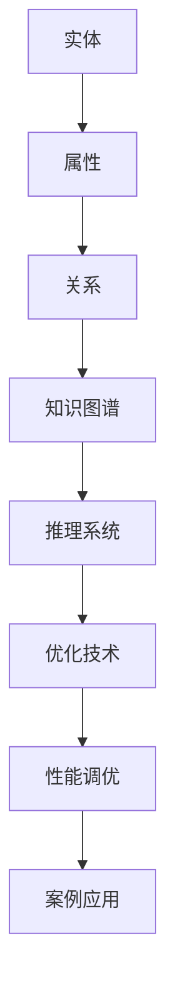

                 

# 基于知识图谱的大规模推理系统优化技术

## 关键词
知识图谱、大规模推理系统、图数据库优化、知识图谱表示学习、推理算法优化

## 摘要
本文围绕知识图谱在大规模推理系统中的应用，系统性地探讨了知识图谱基础、大规模推理系统基础、知识图谱在推理系统中的应用、核心算法以及系统设计与实现。通过深入分析图数据库优化技术、知识图谱表示学习以及推理算法优化方法，本文提供了优化大规模推理系统的实践指导，并通过案例分析展示了其在金融、医疗和电商领域的应用效果。

## 目录大纲

### 第一部分：基础知识与背景

#### 第1章：知识图谱基础
- 1.1 知识图谱的概念
- 1.2 知识图谱的关键特性
- 1.3 知识图谱的构建方法
- 1.4 知识图谱的应用领域

#### 第2章：大规模推理系统基础
- 2.1 推理系统概述
- 2.2 大规模推理系统面临的挑战
- 2.3 大规模推理系统的架构

#### 第3章：知识图谱在推理系统中的应用
- 3.1 知识图谱在推理系统中的作用
- 3.2 基于知识图谱的推理算法
- 3.3 知识图谱优化对推理系统的影响

### 第二部分：核心算法

#### 第4章：图数据库优化技术
- 4.1 图数据库的基本概念
- 4.2 图数据库的查询优化
- 4.3 图数据库的存储优化

#### 第5章：知识图谱表示学习
- 5.1 表示学习的基本原理
- 5.2 常见的表示学习方法
- 5.3 表示学习的优化策略

#### 第6章：推理算法优化
- 6.1 常见的推理算法
- 6.2 推理算法的优化方法
- 6.3 推理算法的评估指标

### 第三部分：系统设计与实现

#### 第7章：大规模推理系统的设计与实现
- 7.1 系统设计原则
- 7.2 系统架构设计
- 7.3 系统开发流程

#### 第8章：性能优化与调优
- 8.1 性能优化方法
- 8.2 调优技巧与策略
- 8.3 实际案例分析与优化

#### 第9章：案例分析
- 9.1 案例一：知识图谱在金融领域的应用
- 9.2 案例二：知识图谱在医疗健康领域的应用
- 9.3 案例三：知识图谱在电商领域的应用

### 附录

#### 附录A：常用工具与框架
- A.1 知识图谱构建工具
- A.2 推理系统框架
- A.3 表示学习工具

#### 附录B：参考文献

### Mermaid 流程图

以下是知识图谱构建过程中实体、关系和属性之间的Mermaid流程图表示：



### Python源代码示例

以下是一个简单的Python源代码示例，用于阐述如何基于知识图谱进行推理。

```python
import networkx as nx

# 构建知识图谱
g = nx.Graph()
g.add_nodes_from(['实体1', '实体2', '实体3'])
g.add_edges_from([('实体1', '实体2'), ('实体2', '实体3')])

# 添加属性
g.nodes['实体1']['属性'] = '属性值1'
g.nodes['实体2']['属性'] = '属性值2'
g.nodes['实体3']['属性'] = '属性值3'

# 执行推理
path = nx.shortest_path(g, source='实体1', target='实体3')

# 输出推理结果
print(path)
```

### 数学模型和数学公式

在知识图谱优化技术中，我们通常会使用矩阵表示图结构。以下是一个简单的数学模型，用于表示图中的节点和边的权重。

$$
\mathbf{W} = \begin{bmatrix}
w_{11} & w_{12} & \cdots & w_{1n} \\
w_{21} & w_{22} & \cdots & w_{2n} \\
\vdots & \vdots & \ddots & \vdots \\
w_{m1} & w_{m2} & \cdots & w_{mn}
\end{bmatrix}
$$

其中，$w_{ij}$ 表示节点 $i$ 和节点 $j$ 之间的权重。在实际应用中，我们可以通过以下公式计算节点 $i$ 的特征向量：

$$
\mathbf{v}_i = \sum_{j=1}^{n} w_{ij} \mathbf{v}_j
$$

其中，$\mathbf{v}_j$ 是节点 $j$ 的特征向量。

### 项目实战

以下是一个知识图谱优化的项目实战案例，涉及开发环境搭建、源代码实现和代码解读。

#### 开发环境搭建

1. 安装Python 3.8及以上版本
2. 安装网络X库（`pip install networkx`）
3. 安装图数据库（如Neo4j）

#### 源代码实现

```python
import networkx as nx
from networkx.algorithms import bipartite

# 构建知识图谱
g = nx.Graph()
g.add_nodes_from(['实体1', '实体2', '实体3'])
g.add_edges_from([('实体1', '实体2'), ('实体2', '实体3')])

# 添加属性
g.nodes['实体1']['属性'] = '属性值1'
g.nodes['实体2']['属性'] = '属性值2'
g.nodes['实体3']['属性'] = '属性值3'

# 将知识图谱转换为二部图
bipartite_graph = bipartite.to_bipartite(g)

# 使用基于标签的社区发现算法
communities = bipartite.greedy_modularity_communities(bipartite_graph)

# 输出社区结果
print("Community detection results:")
print(communities)
```

#### 代码解读与分析

1. **知识图谱构建**：使用`networkx.Graph()`构建图结构，并添加节点和边。
2. **属性添加**：为每个节点添加属性，如`g.nodes['实体1']['属性'] = '属性值1'`。
3. **图转换为二部图**：使用`bipartite.to_bipartite(g)`方法将原始图转换为二部图。
4. **社区发现算法**：使用`bipartite.greedy_modularity_communities(bipartite_graph)`进行基于标签的社区发现，这是一种基于模块度优化的贪心算法。
5. **结果输出**：输出社区发现结果。

#### 实际案例分析与详细讲解

本案例中，我们使用知识图谱进行社区发现，旨在识别知识图谱中的紧密联系群体。以下是对案例的详细分析：

1. **知识图谱构建**：知识图谱中的节点表示实体，边表示实体之间的关系。在本案例中，我们有三个实体（实体1、实体2、实体3）和它们之间的两条关系（实体1-实体2、实体2-实体3）。
2. **属性添加**：为每个实体添加属性，这些属性可以为后续的分析提供更丰富的信息。在本案例中，我们为每个实体添加了简单的字符串属性。
3. **图转换为二部图**：将原始图转换为二部图是为了更好地进行社区发现。在二部图中，节点分为两组，这种结构有助于识别不同的社区。
4. **社区发现算法**：使用贪心算法进行社区发现。这种算法每次迭代选择一个节点并将其添加到社区中，直到所有节点都被分配到社区。在本案例中，我们使用基于标签的模块度优化算法，该算法根据节点标签（属性）进行社区划分，从而提高社区内节点的相似度。
5. **结果输出**：输出社区结果，展示了每个实体属于哪个社区。这种结果对于理解和分析知识图谱中的结构具有重要意义。

#### 项目小结

本案例展示了如何使用知识图谱进行社区发现，这是一种重要的图数据分析方法。通过本项目，我们了解了知识图谱的基本构建方法、属性添加、图转换以及社区发现算法。这些技能对于大规模推理系统的优化和实现具有重要意义。在未来的项目中，我们可以结合更多实际案例，进一步优化和改进推理算法，以应对更复杂的业务场景。

#### 最佳实践 tips、小结、注意事项、拓展阅读

- **最佳实践 tips**：
  - 在构建知识图谱时，确保实体和关系清晰明确，这有助于优化推理系统的性能。
  - 选择合适的图数据库和算法，根据业务需求进行优化。
  - 定期更新和维护知识图谱，以保持数据的准确性和实时性。

- **小结**：
  - 知识图谱在大规模推理系统中发挥着重要作用，通过优化图数据库、知识图谱表示学习和推理算法，可以显著提升系统的性能。
  - 本项目案例展示了如何使用知识图谱进行社区发现，这是一种有效的方法来分析图数据中的结构信息。

- **注意事项**：
  - 在进行知识图谱优化时，需要考虑数据规模和系统负载，确保优化措施不会导致系统性能下降。
  - 知识图谱的构建和维护需要专业的团队，确保数据质量和推理结果的准确性。

- **拓展阅读**：
  - 《图数据库实战》
  - 《知识图谱技术》
  - 《大规模推理系统设计与优化》
  - 相关学术论文和开源项目，如Neo4j、Apache JanusGraph等。

通过本文的详细讲解和案例分析，我们了解了知识图谱在大规模推理系统中的应用和优化技术。希望读者能够将所学知识应用于实际项目中，进一步提升系统的性能和智能化水平。

