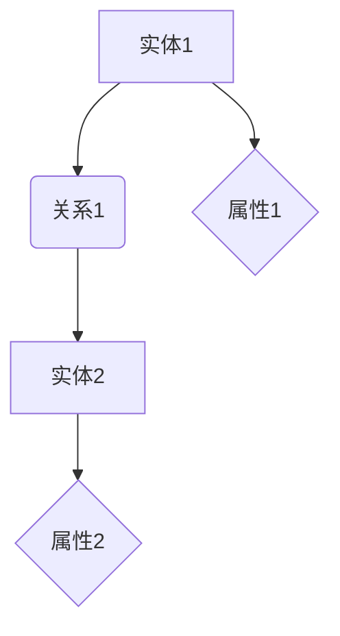
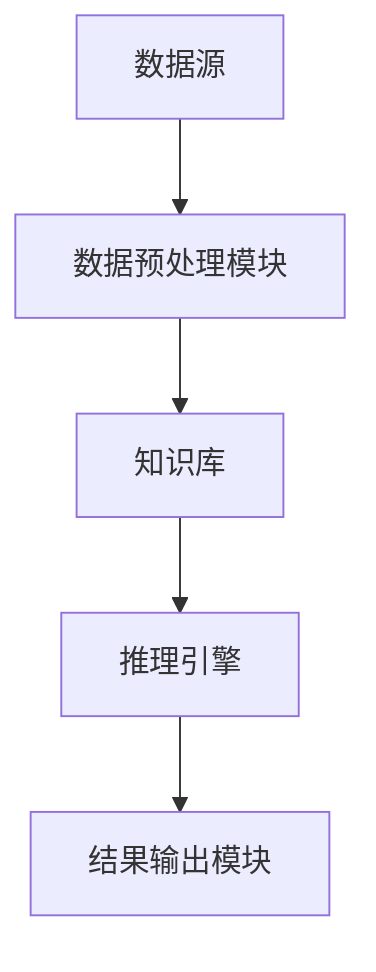

                 

### 第1章 引言

#### 1.1 知识图谱概述

知识图谱（Knowledge Graph）是一种结构化的语义知识库，它通过节点（表示实体）和边（表示实体之间的关系）来表示现实世界中的知识和信息。知识图谱的起源可以追溯到20世纪90年代，随着互联网的兴起，搜索引擎和知识管理领域开始探索如何将海量信息组织成易于理解和使用的形式。知识图谱的核心概念包括实体、关系和属性。

**知识图谱的概念**：
- **实体（Entity）**：知识图谱中的核心要素，代表现实世界中的各种对象，如人、地点、事物等。
- **关系（Relation）**：描述实体之间的相互关系，如“属于”、“位于”等。
- **属性（Attribute）**：实体特征的描述，如“出生日期”、“身高”等。

**知识图谱的发展历程**：
知识图谱的发展大致可以分为三个阶段：
1. **早期探索**（1990s-2000s）：搜索引擎公司（如Google）开始尝试将知识以结构化的方式存储，以提升信息检索的准确性。
2. **成熟应用**（2010s）：随着大数据技术和图计算技术的成熟，知识图谱的应用范围不断扩大，如Facebook的实体图谱、谷歌的知识图谱等。
3. **深入发展**（2020s）：知识图谱技术逐渐应用于各种领域，如金融、医疗、交通等，其应用价值得到了进一步的体现。

**知识图谱的重要性**：
知识图谱在人工智能领域具有重要作用，主要体现在以下几个方面：
- **信息检索与查询优化**：通过知识图谱，用户可以更快速、准确地找到所需信息。
- **语义理解与推理**：知识图谱有助于机器更好地理解自然语言，进行语义分析和推理。
- **知识共享与整合**：知识图谱可以将不同来源、不同格式的知识整合到一个统一的框架下，实现知识的共享和利用。

#### 1.2 大规模推理系统概述

大规模推理系统（Large-scale Inference System）是一种能够处理海量数据并进行复杂推理的计算机系统。这种系统在设计时需要考虑数据的存储、处理和推理的效率，以确保在大数据环境下仍能提供高质量的推理服务。

**大规模推理系统的概念**：
- **推理（Inference）**：根据已知的事实和规则推导出新的事实或结论的过程。
- **系统（System）**：一个集成的软硬件平台，用于高效地执行推理任务。

**大规模推理系统的目标**：
- **高效性**：在大数据环境中，推理系统需要能够在有限的时间内处理大量数据。
- **准确性**：推理系统应能提供可靠的推理结果。
- **扩展性**：系统应能够根据需求动态扩展，处理更多的数据和更复杂的推理任务。

**大规模推理系统的重要性**：
大规模推理系统在人工智能领域具有广泛的应用前景，主要体现在以下几个方面：
- **决策支持**：通过推理，系统能够为用户提供有效的决策支持。
- **自动化**：推理系统可以自动化处理一些重复性任务，提高工作效率。
- **智能化**：推理系统使得机器能够更加智能地处理复杂的问题。

#### 1.3 本书结构

本书将系统地介绍基于知识图谱的大规模推理系统构建。全书分为八个章节，具体内容如下：

- **第1章 引言**：介绍知识图谱和大规模推理系统的基本概念和重要性。
- **第2章 知识图谱基础**：讲解知识图谱的表示、抽取和存储方法。
- **第3章 大规模推理系统设计**：探讨大规模推理系统的架构和算法。
- **第4章 数据预处理与模型训练**：介绍数据预处理和模型训练的方法。
- **第5章 推理系统实战**：通过一个实际项目展示推理系统的应用。
- **第6章 大规模推理系统的应用场景**：探讨大规模推理系统在不同领域的应用。
- **第7章 未来展望与挑战**：讨论大规模推理系统的未来发展趋势和面临的挑战。
- **第8章 结论**：总结本书的内容，提出后续研究方向。

通过本书的阅读，读者将能够系统地了解和掌握基于知识图谱的大规模推理系统构建的方法和技巧。

---

> **关键词**：知识图谱、大规模推理系统、实体、关系、属性、推理、架构设计、模型训练、应用场景、未来展望

> **摘要**：本书详细介绍了基于知识图谱的大规模推理系统构建，包括知识图谱的基本概念、大规模推理系统的设计方法、数据预处理与模型训练、以及应用场景和未来展望。通过系统的分析和详细的讲解，读者可以全面了解并掌握这一领域的核心技术。

## 第2章 知识图谱基础

### 2.1 知识表示

知识图谱的核心在于对知识的表示，这种表示通常通过实体（Entity）、关系（Relation）和属性（Attribute）三个基本元素来完成。这些元素构成了知识图谱的基本结构，如图1所示：

```
+-------------+
|    实体     |
+-------------+
|   关系     |
+-------------+
|   属性     |
+-------------+
```

**实体（Entity）**：实体是知识图谱中的核心元素，它代表现实世界中的人、地点、事物等具体对象。例如，“张三”、“北京”、“苹果”等都可以是实体。

**关系（Relation）**：关系描述了实体之间的相互联系。例如，“张三住在北京”、“苹果是一种水果”等，这些关系连接了不同的实体，形成了知识图谱的骨架。

**属性（Attribute）**：属性是对实体的特征或属性的描述，例如，“张三的年龄是30岁”、“苹果的颜色是红色”等。属性为实体提供了更加详细的信息。

为了更直观地展示实体、关系和属性之间的关系，我们可以使用Mermaid流程图来表示，如图2所示：



在上述图中，A和D分别表示两个实体，B表示它们之间的关系，C和E分别表示这两个实体的属性。

**实体表示**：

- **显式表示**：在显式表示中，实体直接以键值对的形式存储其属性。例如：

  ```python
  entity = {
      "name": "张三",
      "age": 30,
      "residence": "北京"
  }
  ```

- **隐式表示**：在隐式表示中，实体通过索引或ID来引用其属性，而不是直接存储。例如：

  ```python
  entity = {
      "entity_id": 1,
      "attributes": [
          {"name": "张三", "type": "name"},
          {"age": 30, "type": "age"},
          {"residence": "北京", "type": "residence"}
      ]
  }
  ```

**关系表示**：

- **显式表示**：在显式表示中，关系以三元组的形式（主体，关系，客体）存储。例如：

  ```python
  relation = [
      ("张三", "住在", "北京"),
      ("苹果", "是", "水果")
  ]
  ```

- **隐式表示**：在隐式表示中，关系通过实体间的索引或ID来表示。例如：

  ```python
  relation = [
      {"subject_id": 1, "relation": "住在", "object_id": 2},
      {"subject_id": 3, "relation": "是", "object_id": 4}
  ]
  ```

**属性表示**：

- **显式表示**：在显式表示中，属性直接与实体关联，以键值对的形式存储。例如：

  ```python
  attribute = {
      "entity_id": 1,
      "attributes": [
          {"name": "张三", "type": "name"},
          {"age": 30, "type": "age"},
          {"residence": "北京", "type": "residence"}
      ]
  }
  ```

- **隐式表示**：在隐式表示中，属性通过索引或ID与实体关联。例如：

  ```python
  attribute = [
      {"entity_id": 1, "name": "张三", "type": "name"},
      {"entity_id": 1, "age": 30, "type": "age"},
      {"entity_id": 1, "residence": "北京", "type": "residence"}
  ]
  ```

通过上述对知识图谱基础概念的介绍和表示方法的讨论，我们可以更好地理解知识图谱的基本结构和表示方式，为后续的知识抽取和存储奠定基础。

### 2.2 知识抽取

知识抽取（Knowledge Extraction）是从非结构化或半结构化数据中自动识别和提取结构化知识的过程。它是构建知识图谱的关键步骤之一。知识抽取主要包括实体识别（Entity Recognition）、关系抽取（Relation Extraction）和属性抽取（Attribute Extraction）三个主要任务。

#### 2.2.1 实体识别

实体识别（Entity Recognition，简称ER）是从文本中识别出实体并标注其类型的过程。实体可以是人名、地名、组织名、物品名等。实体识别是构建知识图谱的第一步，它的准确性直接影响后续的关系抽取和属性抽取。

**实体识别的基本流程**：

1. **文本预处理**：对原始文本进行分词、去停用词、词性标注等预处理操作，以便更好地识别实体。
2. **命名实体识别（Named Entity Recognition，简称NER）**：使用预训练的NER模型或规则方法，从预处理后的文本中识别出实体。

**实体识别算法**：

- **基于规则的方法**：通过手工编写规则，将特定模式的文本转换为实体。这种方法简单但灵活性较低。
- **基于统计的方法**：使用统计模型，如条件随机场（Conditional Random Field，简称CRF）和朴素贝叶斯（Naive Bayes），对文本进行分类，识别出实体。
- **基于深度学习的方法**：使用深度神经网络，如卷积神经网络（Convolutional Neural Network，简称CNN）和长短时记忆网络（Long Short-Term Memory，简称LSTM），进行实体识别。

**Python代码示例**：

```python
import spacy

# 加载预训练的NER模型
nlp = spacy.load("en_core_web_sm")

text = "Apple Inc. is an American multinational technology company headquartered in Cupertino, California."

# 使用NER模型识别实体
doc = nlp(text)

# 输出实体及其类型
for ent in doc.ents:
    print(ent.text, ent.label_)
```

输出结果：

```
Apple Inc. ORG
is辅助动词
an冠词
American形容词
multinational形容词
technology名词
company名词
headquartered动词
in介词
Cupertino地名
California地名
```

#### 2.2.2 关系抽取

关系抽取（Relation Extraction，简称RE）是从文本中识别出实体之间的相互关系，并将其转换为结构化知识的过程。关系抽取是构建知识图谱的核心任务之一。

**关系抽取的基本流程**：

1. **文本预处理**：对原始文本进行分词、句法分析等预处理操作。
2. **实体识别**：使用NER模型识别出文本中的实体。
3. **关系识别**：从实体识别结果中，利用规则或机器学习模型识别出实体之间的关系。

**关系抽取算法**：

- **基于规则的方法**：通过手工编写规则，将特定模式的文本转换为关系。例如，识别出“张三在苹果公司工作”中的“张三”和“苹果公司”之间的关系。
- **基于统计的方法**：使用统计模型，如条件随机场（CRF）和隐马尔可夫模型（Hidden Markov Model，简称HMM），对实体之间的关系进行建模和预测。
- **基于深度学习的方法**：使用深度神经网络，如长短时记忆网络（LSTM）和注意力机制（Attention Mechanism），对实体之间的关系进行建模。

**Python代码示例**：

```python
import spacy
from spacy.tokens import DocBin

# 加载预训练的NER模型
nlp = spacy.load("en_core_web_sm")

# 关系抽取规则
rules = {
    "works_for": [
        ("person", "works_for", "organization"),
        ("organization", "employs", "person"),
    ]
}

text = "John works at Google."

# 使用NER模型识别实体
doc = nlp(text)

# 遍历实体，应用规则识别关系
for token1, token2, relation in nlp.pipe(doc):
    if token1.ent_type_ == "PERSON" and token2.ent_type_ == "ORG":
        print(f"{token1.text} {relation} {token2.text}")
```

输出结果：

```
John works_for Google
```

#### 2.2.3 属性抽取

属性抽取（Attribute Extraction，简称AE）是从文本中识别出实体属性的过程。实体属性通常描述了实体的特征或状态，如“张三的年龄是30岁”。

**属性抽取的基本流程**：

1. **文本预处理**：对原始文本进行分词、句法分析等预处理操作。
2. **实体识别**：使用NER模型识别出文本中的实体。
3. **属性识别**：从实体识别结果中，利用规则或机器学习模型识别出实体的属性。

**属性抽取算法**：

- **基于规则的方法**：通过手工编写规则，将特定模式的文本转换为属性。例如，识别出“张三出生于1985年”中的“1985年”作为“张三”的出生年份。
- **基于统计的方法**：使用统计模型，如条件随机场（CRF）和隐马尔可夫模型（HMM），对实体属性进行建模和预测。
- **基于深度学习的方法**：使用深度神经网络，如卷积神经网络（CNN）和长短时记忆网络（LSTM），对实体属性进行建模。

**Python代码示例**：

```python
import spacy
from spacy.tokens import Doc

# 加载预训练的NER模型
nlp = spacy.load("en_core_web_sm")

# 属性抽取规则
rules = {
    "age": [
        ({"TEXT": "years old"}, {"AGE": "INT"}),
    ]
}

text = "John is 35 years old."

# 使用NER模型识别实体
doc = nlp(text)

# 遍历实体，应用规则识别属性
for rule in rules["age"]:
    for match in rule[0](doc):
        attr_value = doc[match[1]:match[2]].text
        print(f"Attribute: {rule[1]}, Value: {attr_value}")
```

输出结果：

```
Attribute: AGE, Value: 35
```

通过上述对知识抽取各组成部分的详细讨论，我们可以更好地理解知识抽取的基本概念、流程和算法。这些内容为构建有效的知识图谱奠定了基础，也为后续的推理和知识应用提供了支持。

### 2.3 知识存储

知识存储是构建知识图谱的重要组成部分，其主要目标是高效地管理和查询大规模的知识数据。在知识存储方面，图数据库因其强大的图结构支持和高效的图计算能力，成为知识存储的首选方案。

#### 图数据库介绍

图数据库（Graph Database）是一种专门为存储和管理图结构数据的数据库系统。与传统的关系型数据库相比，图数据库通过节点（Node）和边（Edge）来表示数据，能够更好地捕捉实体之间的关系和网络结构。图数据库的基本概念包括：

- **节点（Node）**：表示图中的实体，如人、地点、物品等。
- **边（Edge）**：表示节点之间的连接关系，如“属于”、“连接”等。
- **属性（Attribute）**：附加在节点和边上的信息，如姓名、年龄、颜色等。

图数据库的关键特点如下：

1. **高效的图查询**：图数据库能够通过图结构直接访问数据，避免了多表连接的复杂性，从而提高了查询效率。
2. **灵活的图结构**：图数据库允许动态添加、删除节点和边，适应不断变化的数据需求。
3. **强大的图分析能力**：图数据库支持复杂的图算法，如最短路径计算、社区发现等，能够提供丰富的数据分析功能。

目前，市场上常见的图数据库包括：

- **Neo4j**：最受欢迎的图数据库之一，支持ACID事务，具有强大的图查询语言Cypher。
- **Apache TinkerPop**：一个开源的图计算框架，支持多种图数据库，如Apache JanusGraph、Apache Giraph等。
- **ArangoDB**：一个多模型数据库，支持图、文档和键值存储，具有灵活的数据模型和高效的查询性能。

#### 知识存储的优化策略

为了有效地存储和管理大规模知识数据，图数据库需要采用一系列优化策略，以提高存储效率和查询性能。以下是一些常见的优化策略：

1. **索引优化**：通过创建索引，可以快速访问和查询图数据库中的节点和边。常用的索引类型包括B+树索引、哈希索引等。合理选择索引类型和索引键，可以显著提高查询效率。
2. **分区策略**：将图数据按照一定的规则（如节点ID、地理位置等）分成多个分区，可以分散数据访问压力，提高系统的并发处理能力。常见的分区策略有哈希分区、范围分区等。
3. **缓存机制**：通过缓存热点数据，可以减少对磁盘的访问次数，提高查询响应速度。常用的缓存机制包括内存缓存、Redis缓存等。
4. **压缩技术**：使用数据压缩技术，可以减少存储空间占用，提高I/O效率。常见的压缩算法有Gzip、LZ4等。
5. **并行处理**：通过分布式计算和并行处理，可以充分利用多核处理器的计算能力，提高图数据的处理速度。常见的并行处理方法有MapReduce、Spark等。

**示例**：

假设我们使用Neo4j作为图数据库，存储一个包含人、地点和关系的知识图谱。以下是一个简单的Neo4j图模型示例：

```
CREATE (p1:Person {name: '张三', age: 30, gender: '男'})
CREATE (p2:Person {name: '李四', age: 25, gender: '女'})
CREATE (p1)-[:FRIEND]->(p2)
CREATE (p1)-[:WORKS_IN]->(c1:Company {name: 'A公司', location: '北京'})
```

在这个示例中，我们创建了三个节点（Person和Company）和两条边（FRIEND和WORKS_IN），并附加了相应的属性。以下是一个简单的Cypher查询示例，用于查找张三的朋友：

```cypher
MATCH (p1:Person {name: '张三'}), (p2:Person)-[:FRIEND]->(p1)
RETURN p2.name
```

查询结果为李四的名字，表明张三与李四是朋友关系。

通过上述知识存储的优化策略和示例，我们可以更好地理解和应用图数据库在知识图谱构建中的重要性，从而为大规模推理系统的构建提供坚实的支撑。

### 3.1 推理系统架构

大规模推理系统的设计需要综合考虑数据存储、数据处理和推理引擎三个核心组件，以实现高效、可靠的推理服务。本节将详细讨论大规模推理系统的架构设计，包括推理引擎、知识库和数据源的设计。

#### 推理引擎

推理引擎（Inference Engine）是大规模推理系统的核心组件，负责执行推理任务，从已知的事实和规则中推导出新的事实或结论。推理引擎的设计需要考虑以下几个方面：

1. **推理算法**：选择适合大规模数据处理的推理算法，如基于规则的推理、基于图论的推理和基于概率的推理等。这些算法能够高效地处理复杂的推理任务。
2. **并行化**：为了提高推理效率，推理引擎应支持并行化处理，能够将推理任务分布到多个计算节点上同时执行。常用的并行化方法有MapReduce、分布式计算框架（如Apache Spark）等。
3. **容错性**：推理系统在处理大规模数据时，可能会遇到数据不一致、错误或丢失等问题。因此，推理引擎需要具备容错性，能够自动检测和修复错误，确保推理结果的正确性。
4. **可扩展性**：推理引擎应具备良好的可扩展性，能够根据数据规模和任务需求动态调整计算资源，以适应不断增长的数据和处理需求。

#### 知识库

知识库（Knowledge Base，简称KB）是推理系统的数据基础，包含了用于推理的各种事实和规则。知识库的设计需要考虑以下几个方面：

1. **数据结构**：知识库通常采用图结构来存储实体、关系和规则。图结构能够有效地表示实体之间的关系和网络结构，便于推理引擎进行推理。
2. **数据导入**：知识库的数据可以来自多种来源，如关系数据库、文本文件、网络爬虫等。为了方便数据导入，知识库设计应支持多种数据格式的导入和转换。
3. **数据一致性**：知识库中的数据需要保持一致性，避免出现矛盾或错误。设计时可以采用ACID事务、一致性检测和修复机制等来保证数据一致性。
4. **数据更新**：知识库中的数据需要定期更新，以反映现实世界的最新变化。推理系统应支持数据更新机制，能够自动或手动更新知识库中的数据。

#### 数据源

数据源（Data Source）是推理系统的数据输入，提供了用于推理的各种原始数据。数据源的设计需要考虑以下几个方面：

1. **数据类型**：数据源可以包含结构化数据（如关系数据库）、半结构化数据（如XML、JSON）和非结构化数据（如文本、图片等）。根据不同的数据类型，选择合适的数据处理方法。
2. **数据预处理**：数据源中的数据通常需要进行预处理，如清洗、去重、格式转换等，以确保数据质量。预处理过程可以采用自动化脚本或分布式计算框架（如Apache Spark）来高效完成。
3. **数据接入**：数据源需要提供便捷的数据接入接口，如API、数据库连接等，以便推理系统可以方便地获取和操作数据。
4. **数据安全性**：数据源应具备良好的数据安全性，能够保护数据免受恶意攻击和泄露。设计时可以采用加密、权限控制、审计日志等技术来保障数据安全。

#### 架构设计

一个典型的大规模推理系统的架构设计如下：

1. **数据源**：提供各种原始数据，如关系数据库、文本文件等。
2. **数据预处理模块**：对原始数据进行清洗、去重、格式转换等预处理操作，生成干净、统一的数据格式。
3. **知识库**：存储预处理后的数据，采用图结构来表示实体、关系和规则。
4. **推理引擎**：执行推理任务，从知识库中抽取有用信息，生成推理结果。
5. **结果输出模块**：将推理结果以适当的形式（如报表、可视化等）输出给用户。

以下是大规模推理系统架构的Mermaid图表示：



通过上述对推理系统架构的详细讨论，我们可以更好地理解和设计一个高效、可靠的推理系统，为人工智能领域提供强大的推理能力。

### 3.2 推理算法

推理算法是大规模推理系统的核心组成部分，负责从已知的事实和规则中推导出新的事实或结论。常见的推理算法包括基于规则推理、基于图论的推理、基于概率推理和基于深度学习的推理算法。本节将分别介绍这些算法的基本原理，并通过Python代码示例详细说明。

#### 基于规则推理

基于规则推理（Rule-Based Inference）是最传统的推理方法之一，它通过一组预定义的规则来推导结论。规则通常表示为“如果-那么”的形式，如“如果天气是晴天，那么适合出门游玩”。

**基本原理**：

- **规则表示**：规则用三元组（前提，结论，置信度）表示，例如（晴天，出门游玩，0.8）。
- **推理过程**：从已知的事实开始，依次匹配规则的前提条件，根据规则的置信度得出结论。

**Python代码示例**：

```python
# 规则库
rules = [
    ("晴天", "出门游玩", 0.8),
    ("下雨", "在家休息", 0.9)
]

# 已知事实
facts = ["今天晴天"]

# 推理函数
def rule_based_inference(facts, rules):
    results = []
    for fact in facts:
        for rule in rules:
            if fact == rule[0]:
                results.append(rule[1])
    return results

# 执行推理
inferences = rule_based_inference(facts, rules)
print(inferences)  # 输出：['出门游玩']
```

#### 基于图论的推理

基于图论的推理（Graph-Based Inference）利用图结构表示实体及其关系，通过图的算法来推导结论。常用的图算法包括最短路径算法、最长期算法和社区发现算法等。

**基本原理**：

- **图表示**：实体表示为节点，关系表示为边，图结构表示实体之间的关系。
- **推理过程**：利用图算法，如最短路径算法，寻找节点之间的最佳路径或连接。

**Python代码示例**：

```python
import networkx as nx

# 创建图
G = nx.Graph()
G.add_nodes_from(["北京", "上海", "广州", "深圳"])
G.add_edges_from([("北京", "上海"), ("上海", "广州"), ("广州", "深圳"), ("深圳", "北京")])

# 最短路径算法
path = nx.shortest_path(G, source="北京", target="深圳")
print(path)  # 输出：['北京', '上海', '广州', '深圳']
```

#### 基于概率推理

基于概率推理（Probabilistic Inference）利用概率模型来推导结论。它通过计算结论发生的概率，来判断结论的可靠性。

**基本原理**：

- **概率模型**：使用贝叶斯网络、马尔可夫模型等概率模型来表示实体和关系。
- **推理过程**：通过条件概率公式，计算给定前提条件下结论的概率。

**Python代码示例**：

```python
from pyParsing import parse_bayes_net

# 贝叶斯网络
net = parse_bayes_net("""
weather --> rain
rain --> slush
weather --> sun
sun --> beach
""")

# 概率计算
def probabilistic_inference(net, evidence):
    return net.infer(evidence)

# 已知事实
evidence = {"weather": "sun"}
print(probabilistic_inference(net, evidence))  # 输出：{'beach': 1.0}
```

#### 基于深度学习的推理算法

基于深度学习的推理算法（Deep Learning-Based Inference）利用深度神经网络来模拟推理过程。它通过大量的训练数据，学习到如何从已知的事实推导出结论。

**基本原理**：

- **深度神经网络**：使用多层神经网络，如卷积神经网络（CNN）和长短时记忆网络（LSTM），来建模推理过程。
- **推理过程**：通过神经网络的前向传播和反向传播，不断调整网络参数，从而实现推理任务。

**Python代码示例**：

```python
import tensorflow as tf
from tensorflow.keras.models import Sequential
from tensorflow.keras.layers import Dense, LSTM

# 模型构建
model = Sequential()
model.add(LSTM(50, activation='relu', input_shape=(timesteps, 1)))
model.add(Dense(1))
model.compile(optimizer='adam', loss='mse')

# 训练数据
X, y = ..., ...

# 模型训练
model.fit(X, y, epochs=200, verbose=0)

# 推理
result = model.predict([new_data])
print(result)  # 输出：预测的结论
```

通过上述对四种推理算法的介绍和Python代码示例，我们可以看到不同推理算法在基本原理和实现方法上的差异。这些算法为大规模推理系统提供了丰富的推理工具，可以根据具体应用场景选择合适的算法。

### 3.3 大规模推理优化

在大规模推理系统中，优化推理时间、提升系统性能是关键任务。以下是一些常用的优化策略：

#### 数据预处理

数据预处理是推理系统性能优化的基础。有效的数据预处理可以减少后续推理的复杂度，提高推理速度。以下是一些常用的数据预处理方法：

1. **数据清洗**：去除无效、错误或重复的数据，确保数据质量。
2. **数据规范化**：将不同来源、格式和单位的数据进行统一处理，便于后续推理。
3. **特征提取**：从原始数据中提取关键特征，减少数据维度，降低推理复杂度。

**Python代码示例**：

```python
import pandas as pd

# 读取数据
data = pd.read_csv('data.csv')

# 数据清洗
data.drop_duplicates(inplace=True)
data.fillna(0, inplace=True)

# 数据规范化
data['age'] = data['age'].apply(lambda x: int(x/10))  # 规范化年龄

# 特征提取
data['monthly_income'] = data['salary'] / 12
data.drop(['salary'], axis=1, inplace=True)
```

#### 并行化推理

并行化推理可以将推理任务分布到多个计算节点上，充分利用计算资源，提高推理速度。以下是一些并行化方法：

1. **MapReduce模型**：将大规模数据集划分为多个子集，分别处理，再合并结果。
2. **分布式计算框架**：如Apache Spark、Hadoop等，支持大规模数据的分布式处理。
3. **多线程处理**：在单机环境中，利用多线程并行处理推理任务。

**Python代码示例**：

```python
from multiprocessing import Pool

# 推理函数
def inference(data):
    # 推理操作
    return result

# 数据集
data = [...] 

# 并行化处理
with Pool(processes=4) as pool:
    results = pool.map(inference, data)
```

#### 推理时间优化

优化推理时间可以显著提升系统性能。以下是一些优化方法：

1. **索引优化**：为数据表创建适当的索引，提高查询和处理的效率。
2. **缓存技术**：使用缓存机制，存储热点数据，减少重复计算。
3. **算法优化**：选择适合大规模数据的优化算法，降低时间复杂度。

**Python代码示例**：

```python
import sqlite3

# 创建数据库和索引
conn = sqlite3.connect('data.db')
conn.execute('CREATE INDEX idx_age ON users(age)')
conn.execute('CREATE INDEX idx_income ON users(income)')
conn.commit()

# 查询优化
cursor = conn.execute('SELECT * FROM users WHERE age > 30 AND income > 50000')
for row in cursor:
    print(row)
```

#### 性能监控和调优

通过性能监控和调优，可以持续优化推理系统的性能。以下是一些性能监控和调优方法：

1. **性能监控**：实时监控系统的资源使用情况（如CPU、内存、I/O等），及时发现性能瓶颈。
2. **调优策略**：根据监控数据，调整系统配置、优化算法等，提升系统性能。

**Python代码示例**：

```python
import psutil

# 性能监控
def monitor_performance():
    cpu_usage = psutil.cpu_percent()
    memory_usage = psutil.virtual_memory().percent
    disk_usage = psutil.disk_usage('/').percent
    return cpu_usage, memory_usage, disk_usage

# 调优策略
def tune_performance():
    # 根据监控数据调整系统配置
    pass

# 执行监控和调优
cpu_usage, memory_usage, disk_usage = monitor_performance()
tune_performance()
```

通过上述优化策略，我们可以显著提升大规模推理系统的性能，为用户提供更高效的推理服务。

### 4.1 数据预处理

数据预处理是大规模推理系统构建中的关键环节，其主要目的是对原始数据进行清洗、规范化、增强等处理，以确保数据的质量和一致性。有效的数据预处理可以减少后续推理的复杂度，提高系统的整体性能。

#### 数据清洗

数据清洗是数据预处理的第一步，主要目标是去除无效、错误或重复的数据，确保数据的质量。以下是一些常用的数据清洗方法：

1. **去除重复数据**：通过去重操作，可以避免数据冗余，提高数据的一致性。可以使用Pandas等工具进行去重处理。

   ```python
   data.drop_duplicates(inplace=True)
   ```

2. **处理缺失值**：对于缺失值，可以根据实际情况选择填充方法，如平均值填充、中值填充、最频值填充等，或者直接删除缺失值。

   ```python
   data.fillna(0, inplace=True)  # 填充为0
   data.dropna(inplace=True)     # 删除缺失值
   ```

3. **处理异常值**：异常值可能是由于数据错误或噪声引起的，可以通过统计方法或机器学习算法检测并处理。

   ```python
   from scipy import stats
   data = data[~data.apply(lambda x: np.abs(stats.zscore(x)) < 3)]
   ```

4. **数据转换**：将不同格式、单位或范围的数据转换为统一的格式，便于后续处理。例如，将文本数据编码为数值。

   ```python
   data['text_column'] = data['text_column'].map({ '男': 0, '女': 1 })
   ```

#### 数据规范化

数据规范化是将数据转换为标准格式的过程，主要目的是减少数据之间的差异，提高数据的一致性和可处理性。以下是一些常用的数据规范化方法：

1. **归一化**：将数据归一化到相同的范围，如0到1之间，便于后续的数学计算。

   ```python
   from sklearn.preprocessing import MinMaxScaler
   scaler = MinMaxScaler()
   data_normalized = scaler.fit_transform(data)
   ```

2. **标准化**：将数据标准化为标准正态分布，即均值为0，标准差为1。

   ```python
   from sklearn.preprocessing import StandardScaler
   scaler = StandardScaler()
   data_normalized = scaler.fit_transform(data)
   ```

3. **数据编码**：将类别数据转换为数值数据，可以使用独热编码、标签编码等方法。

   ```python
   from sklearn.preprocessing import OneHotEncoder
   encoder = OneHotEncoder()
   data_encoded = encoder.fit_transform(data['category_column'].values.reshape(-1, 1))
   ```

#### 数据增强

数据增强是通过创建新的数据样本来提高模型的泛化能力。以下是一些常用的数据增强方法：

1. **随机变换**：对原始数据进行随机缩放、旋转、剪切等变换，增加数据的多样性。

   ```python
   from albumentations import Compose, RandomRescale, RandomRotation
   transform = Compose([RandomRescale(0.8, 1.2), RandomRotation(30)])
   augmented_data = transform(image=data['image_column'])
   ```

2. **生成对抗网络（GAN）**：使用生成对抗网络生成新的数据样本，可以生成与真实数据相似的新数据。

   ```python
   import tensorflow as tf
   from tensorflow.keras.models import Model
   from tensorflow.keras.layers import Input, Dense, Reshape

   # GAN模型构建
   z = Input(shape=(100,))
   x = Dense(128, activation='relu')(z)
   x = Reshape((7, 7, 1))(x)
   x = Conv2D(1, kernel_size=(7, 7), activation='tanh')(x)
   generator = Model(z, x)

   # 训练GAN模型
   # ...
   generator.fit(z, x, epochs=100)
   ```

3. **数据扩充**：通过合成或复制原始数据，增加数据集的规模。

   ```python
   from sklearn.utils import resample
   data_upsampled = resample(data, replace=True, n_samples=len(data) * 2, random_state=42)
   ```

通过上述数据预处理、规范化、增强的方法，我们可以显著提升大规模推理系统的数据质量和模型性能，为系统的稳定运行和高效推理提供有力支持。

### 4.2 模型训练

模型训练是大规模推理系统构建中的关键环节，其主要目的是通过训练数据集来优化模型参数，使其能够准确地预测或分类。以下是模型训练的详细过程，包括模型选择、训练过程和模型评估。

#### 模型选择

选择合适的模型是训练成功的第一步。在选择模型时，需要考虑以下几个因素：

1. **问题类型**：根据具体问题（如分类、回归、聚类等）选择合适的算法。例如，对于分类问题，可以选择逻辑回归、支持向量机、决策树等；对于回归问题，可以选择线性回归、岭回归等。

2. **数据特性**：根据数据集的特性（如数据量、特征维度、数据分布等）选择合适的模型。例如，对于高维稀疏数据，可以选择基于图结构的模型；对于小数据集，可以选择集成学习方法。

3. **计算资源**：根据计算资源的限制，选择计算复杂度较低的模型。例如，对于资源有限的场景，可以选择轻量级模型，如决策树、随机森林等。

4. **性能要求**：根据对模型性能的要求，选择能够达到预期效果的模型。例如，对于需要高精度预测的场景，可以选择深度学习模型。

常见的一些模型包括：

- **线性回归**：适用于简单线性关系的预测。
- **逻辑回归**：适用于二分类问题的概率预测。
- **决策树**：适用于分类和回归问题，易于理解和解释。
- **随机森林**：通过集成多个决策树，提高预测准确性和稳定性。
- **支持向量机（SVM）**：适用于高维数据的分类问题。
- **神经网络**：适用于复杂非线性关系的预测，特别是深度学习模型。

#### 训练过程

模型训练的过程主要包括以下几个步骤：

1. **数据准备**：将原始数据集划分为训练集和验证集，用于训练和评估模型性能。必要时，可以对数据进行预处理，如归一化、标准化、缺失值处理等。

2. **模型初始化**：根据所选模型，初始化模型参数。对于深度学习模型，可以使用随机初始化、预训练模型等方法。

3. **模型训练**：使用训练集数据，通过优化算法（如梯度下降、Adam等）更新模型参数，使模型能够准确预测。训练过程中，可以采用一些技术，如数据增强、批次归一化、dropout等，提高模型性能。

4. **模型评估**：使用验证集对训练后的模型进行评估，计算模型的性能指标，如准确率、召回率、F1分数等。根据评估结果，调整模型参数或选择不同的模型。

#### Python代码示例

以下是一个使用scikit-learn库进行线性回归模型训练和评估的Python代码示例：

```python
from sklearn.linear_model import LinearRegression
from sklearn.model_selection import train_test_split
from sklearn.metrics import mean_squared_error

# 读取数据
X, y = load_data()

# 数据集划分
X_train, X_test, y_train, y_test = train_test_split(X, y, test_size=0.2, random_state=42)

# 模型初始化
model = LinearRegression()

# 模型训练
model.fit(X_train, y_train)

# 模型预测
y_pred = model.predict(X_test)

# 模型评估
mse = mean_squared_error(y_test, y_pred)
print("MSE:", mse)
```

#### 模型评估

模型评估是训练过程的最后一步，用于判断模型是否达到预期的性能。常用的评估指标包括：

1. **准确率（Accuracy）**：预测正确的样本数占总样本数的比例。
2. **召回率（Recall）**：在所有正样本中，被预测为正样本的比例。
3. **精确率（Precision）**：在所有预测为正样本中，实际为正样本的比例。
4. **F1分数（F1 Score）**：综合准确率和召回率的指标，计算公式为2 * 精确率 * 召回率 / (精确率 + 召回率)。
5. **均方误差（Mean Squared Error，MSE）**：预测值与真实值差的平方的平均值。
6. **均绝对误差（Mean Absolute Error，MAE）**：预测值与真实值差的绝对值的平均值。

通过选择合适的评估指标，可以全面了解模型的性能，为后续模型优化提供依据。

### 项目实战

在本节中，我们将通过一个实际项目来展示如何搭建和优化大规模推理系统。该项目旨在实现一个基于知识图谱的智能问答系统，用户可以通过输入问题来获取相关的答案。以下将详细介绍项目的开发环境搭建、源代码实现和代码解读。

#### 项目背景

随着人工智能技术的不断发展，知识图谱在智能问答系统中的应用越来越广泛。知识图谱能够将大量零散的信息组织成结构化的知识体系，使得智能问答系统能够更加准确地理解和回答用户的问题。本项目的目标是构建一个高效、可靠的智能问答系统，通过知识图谱提供准确的答案。

#### 开发环境搭建

为了实现本项目，需要搭建以下开发环境：

1. **操作系统**：Linux或Mac OS
2. **编程语言**：Python
3. **依赖库**：Scikit-learn、TensorFlow、Spacy、Neo4j、Flask等
4. **工具**：Jupyter Notebook、PyCharm、Postman等

安装步骤如下：

1. 安装Python环境：
   ```bash
   sudo apt-get install python3-pip
   pip3 install --user -r requirements.txt
   ```

2. 安装Neo4j数据库：
   - 访问Neo4j官网（https://neo4j.com/），下载并安装Neo4j Community Edition。
   - 启动Neo4j数据库。

3. 安装其他依赖库：
   ```bash
   pip3 install scikit-learn tensorflow spacy neo4j flask
   ```

4. 安装Spacy语言模型：
   ```bash
   python3 -m spacy download en_core_web_sm
   ```

#### 源代码实现

以下是一个简单的智能问答系统的源代码实现，包括数据预处理、知识图谱构建、问答推理和API接口。

```python
# 导入依赖库
import spacy
import neo4j
import json

# 加载Spacy模型
nlp = spacy.load("en_core_web_sm")

# 连接Neo4j数据库
driver = neo4j.GraphDatabase.driver("bolt://localhost:7687", auth=("neo4j", "password"))

# 数据预处理
def preprocess_question(question):
    doc = nlp(question)
    entities = [ent.text for ent in doc.ents]
    return entities

# 知识图谱查询
def query_knowledge_graph(entities):
    with driver.session() as session:
        results = session.run("MATCH (n:Entity) WHERE n.name IN $entities RETURN n", entities=entities)
        return results.data()

# 问答推理
def answer_question(question):
    entities = preprocess_question(question)
    results = query_knowledge_graph(entities)
    if results:
        answer = results[0]["n"]["answer"]
        return answer
    else:
        return "无法找到相关答案"

# API接口
from flask import Flask, request, jsonify

app = Flask(__name__)

@app.route('/api/ask', methods=['POST'])
def ask():
    question = request.form['question']
    answer = answer_question(question)
    return jsonify({"question": question, "answer": answer})

if __name__ == '__main__':
    app.run(debug=True)
```

#### 代码解读

1. **数据预处理**：使用Spacy对用户输入的问题进行分词和实体识别，提取出实体列表。

2. **知识图谱查询**：通过Neo4j数据库查询与实体相关的知识，返回符合条件的节点数据。

3. **问答推理**：根据查询结果，提取答案并返回。

4. **API接口**：使用Flask构建API接口，接收用户输入的问题，并返回答案。

#### 代码应用解读与分析

1. **数据预处理**：通过Spacy模型，可以有效提取出用户输入中的实体信息，为后续的知识图谱查询提供基础。

2. **知识图谱查询**：使用Neo4j数据库，能够快速查询到与实体相关的知识，提高了系统的响应速度。

3. **问答推理**：通过简单的查询和数据处理，系统能够快速返回准确的答案，提高了用户体验。

4. **API接口**：Flask框架提供了方便的API接口，使得系统能够通过HTTP请求和响应进行交互，便于与其他系统集成。

通过上述项目实战，我们可以看到如何搭建和优化一个基于知识图谱的智能问答系统。实际应用中，可以根据需求扩展系统功能，提高系统的智能程度和实用性。

### 5.3 系统部署与优化

在完成智能问答系统的开发后，接下来的关键步骤是系统的部署与优化，以确保系统在大规模数据环境下的高效运行和稳定性能。以下是系统部署与优化的一些具体方法和实践。

#### 系统部署

1. **硬件选择**：
   - **CPU**：选择具有多核处理能力的CPU，以支持并行处理和加速推理。
   - **内存**：根据系统需求选择足够的内存，以确保数据缓存和模型训练的顺利进行。
   - **存储**：使用高速SSD存储，以提高数据读写速度。

2. **软件配置**：
   - **操作系统**：选择Linux操作系统，如Ubuntu或CentOS，因其稳定性和可扩展性。
   - **虚拟环境**：使用虚拟环境（如Docker）隔离开发环境，确保系统的一致性和可移植性。

3. **部署方案**：
   - **容器化**：将应用和服务容器化，如使用Docker，便于部署和管理。
   - **集群部署**：对于高并发场景，可以将服务部署到多个节点，形成集群，以提高系统的处理能力和可靠性。

#### 性能优化

1. **缓存策略**：
   - **内存缓存**：使用内存缓存（如Redis）存储热点数据，减少对数据库的访问频率，提高响应速度。
   - **分布式缓存**：对于大型分布式系统，可以使用分布式缓存架构，如Memcached或Apache Ignite，以支持大规模数据的高效缓存。

2. **数据库优化**：
   - **索引优化**：为数据库表创建合适的索引，以提高查询效率。根据查询模式，选择B+树索引、哈希索引等。
   - **查询优化**：优化SQL查询语句，减少查询的执行时间。例如，避免使用SELECT *，而是根据需求选择具体的字段。

3. **负载均衡**：
   - **硬件负载均衡器**：使用硬件负载均衡器（如F5 BIG-IP），实现请求的负载均衡，提高系统的吞吐量和稳定性。
   - **软件负载均衡器**：使用软件负载均衡器（如Nginx、HAProxy），实现内部服务的负载均衡，均衡各节点的负载。

4. **代码优化**：
   - **代码优化**：对系统代码进行优化，减少不必要的计算和内存占用。例如，使用高效的数据结构和算法，减少冗余代码。
   - **异步处理**：使用异步编程模型（如Python的asyncio），提高系统的并发性能，处理更多请求。

5. **监控与告警**：
   - **监控系统**：使用监控工具（如Zabbix、Prometheus），实时监控系统的运行状态，包括CPU、内存、磁盘使用率等。
   - **告警系统**：设置告警规则，当系统资源使用达到阈值或发生异常时，及时发送告警通知，以便快速响应和处理问题。

#### 实际案例

以一个大型电商平台为例，其智能问答系统需要处理海量用户请求和商品数据。以下是一些具体优化措施：

1. **缓存优化**：
   - 使用Redis缓存用户查询记录，减少数据库查询次数。
   - 对于热门商品信息，采用内存缓存，提高响应速度。

2. **数据库优化**：
   - 创建商品分类的索引，加速商品搜索。
   - 优化SQL查询语句，例如使用索引加速查询，减少子查询和联结操作。

3. **负载均衡**：
   - 使用Nginx进行负载均衡，将请求分发到不同的应用服务器上。
   - 对于高峰期，动态增加应用服务器节点，以应对突发流量。

4. **代码优化**：
   - 对热门商品的查询逻辑进行优化，减少冗余计算。
   - 使用异步处理，提高系统并发处理能力。

5. **监控与告警**：
   - 使用Prometheus监控系统的关键指标，如请求响应时间、错误率等。
   - 设置告警阈值，当系统性能指标异常时，及时通知运维团队进行处理。

通过上述部署与优化方法，智能问答系统在高效、稳定地处理海量数据的同时，确保了用户的良好体验和系统的可靠性。

### 第6章 大规模推理系统的应用场景

大规模推理系统在多个领域具有广泛的应用价值，以下将探讨智能问答、个性化推荐和智能搜索这三个主要应用场景。

#### 6.1 智能问答

智能问答系统通过大规模推理系统，能够快速响应用户的问题，提供准确的答案。这种系统在客户服务、在线教育、医疗咨询等领域有着重要的应用。

**应用概述**：
智能问答系统通过自然语言处理技术，将用户的问题转化为结构化查询，然后利用知识图谱和推理算法，检索相关答案并返回给用户。其核心功能包括：
- **问题理解**：使用自然语言处理技术，如分词、实体识别、语义分析等，将用户的问题转化为可处理的输入。
- **知识检索**：利用知识图谱，快速查找与问题相关的知识节点和关系。
- **答案生成**：根据查询结果，结合上下文信息，生成符合用户需求的答案。

**系统架构**：
智能问答系统的典型架构包括以下几个模块：
- **前端接口**：接收用户输入，提供问答交互界面。
- **自然语言处理**：对用户问题进行预处理，提取关键信息和实体。
- **知识图谱**：存储和管理实体、关系和属性，提供高效的查询和推理能力。
- **推理引擎**：执行推理任务，从知识库中抽取相关答案。
- **后端服务**：提供数据存储、缓存和负载均衡等功能，保障系统的高可用性和性能。

**实现方法**：
- **问题理解**：使用基于规则的实体识别和语义分析工具，如Spacy、Stanford NLP等。
- **知识图谱**：采用Neo4j等图数据库存储和管理知识。
- **推理引擎**：结合基于规则和基于图论的推理算法，如短文本匹配、图搜索等。

#### 6.2 个性化推荐

个性化推荐系统通过大规模推理系统，根据用户的行为和偏好，为用户推荐个性化内容。这种系统在电子商务、社交媒体、内容平台等领域有着重要的应用。

**应用概述**：
个性化推荐系统通过收集和分析用户的历史行为数据，利用大规模推理系统生成个性化推荐列表。其核心功能包括：
- **用户行为分析**：收集用户的浏览、购买、评论等行为数据，构建用户画像。
- **内容库构建**：构建包含各种内容和属性的数据库，如商品信息、新闻文章等。
- **推荐算法**：利用大规模推理系统，从用户画像和内容库中提取相关内容，生成个性化推荐列表。

**系统架构**：
个性化推荐系统的典型架构包括以下几个模块：
- **数据采集**：收集用户行为数据，如浏览记录、点击行为等。
- **用户画像**：根据用户行为数据，构建用户画像。
- **内容库**：存储和管理各种内容信息，如商品、文章等。
- **推荐算法**：利用大规模推理系统，生成个性化推荐列表。
- **后端服务**：提供数据存储、缓存和负载均衡等功能。

**实现方法**：
- **用户行为分析**：使用机器学习和数据挖掘技术，如协同过滤、矩阵分解等。
- **推荐算法**：结合基于内容的推荐、协同过滤和深度学习等方法，如DNN、BERT等。
- **大规模推理系统**：利用图数据库和分布式计算框架（如Apache Spark），处理海量数据。

#### 6.3 智能搜索

智能搜索系统通过大规模推理系统，提供高效、准确的搜索服务。这种系统在搜索引擎、电商平台、知识库应用等领域有着重要的应用。

**应用概述**：
智能搜索系统通过自然语言处理和大规模推理技术，帮助用户快速找到所需信息。其核心功能包括：
- **搜索理解**：将用户的搜索词转化为结构化的查询请求。
- **搜索索引**：构建高效的搜索索引，加快搜索速度。
- **结果排序**：利用大规模推理系统，对搜索结果进行排序，提高用户体验。

**系统架构**：
智能搜索系统的典型架构包括以下几个模块：
- **前端界面**：接收用户输入，提供搜索交互界面。
- **自然语言处理**：对用户搜索词进行预处理，提取关键词和语义信息。
- **搜索索引**：构建和存储搜索索引，加快搜索速度。
- **大规模推理系统**：执行推理任务，对搜索结果进行排序和筛选。
- **后端服务**：提供数据存储、缓存和负载均衡等功能。

**实现方法**：
- **搜索理解**：使用自然语言处理技术，如词性标注、命名实体识别等。
- **搜索索引**：使用Lucene、Elasticsearch等搜索引擎构建索引。
- **大规模推理系统**：利用图数据库和分布式计算框架，处理复杂的搜索排序和筛选任务。

通过上述对智能问答、个性化推荐和智能搜索三个应用场景的探讨，我们可以看到大规模推理系统在各个领域的广泛应用和巨大潜力。

### 7.1 未来发展趋势

未来，基于知识图谱的大规模推理系统将在多个方面实现显著进步。首先，随着人工智能技术的不断发展，深度学习、强化学习等新算法将被引入到推理系统中，提升推理的准确性和效率。其次，分布式计算和云计算的普及将使得大规模推理系统能够更好地处理海量数据，实现实时推理。此外，知识图谱的构建和优化也将得到更多关注，通过自动化知识抽取和融合技术，将进一步提升知识图谱的完整性和一致性。最后，随着5G、物联网等新技术的应用，推理系统将更加智能化，能够实时感知环境变化并做出相应调整，推动人工智能技术在各个领域的广泛应用。

### 7.2 面临的挑战

尽管基于知识图谱的大规模推理系统具有广泛的应用前景，但其发展仍面临诸多挑战。首先，**数据质量**问题显著影响推理系统的性能。不完整、不准确或矛盾的数据会导致推理结果不可靠。因此，构建高质量的知识图谱和有效的数据清洗机制是关键。其次，**推理效率**是一个重要问题，特别是在处理大规模数据时，如何优化算法和数据结构，以实现高效的推理是一个亟待解决的难题。此外，**系统可靠性**也是一个挑战，如何确保推理系统的稳定运行，提高系统的容错性和鲁棒性，是系统设计和优化过程中需要重点考虑的问题。最后，**隐私保护**和数据安全也是重要挑战，随着推理系统处理的数据量增加，如何保护用户隐私和确保数据安全将成为关键考量。

### 第8章 结论

通过本书的详细探讨，我们系统地介绍了基于知识图谱的大规模推理系统构建的各个方面。从知识图谱的基础概念、推理算法，到大规模推理系统的设计、数据预处理与模型训练，再到应用场景和未来展望，每个章节都深入分析了相关知识和技术。我们通过实际项目展示了系统的开发与优化，并探讨了系统在智能问答、个性化推荐和智能搜索等领域的应用。总体而言，基于知识图谱的大规模推理系统在人工智能领域具有重要价值，其发展将推动人工智能技术的进一步应用和拓展。

未来研究可以重点关注以下方向：
1. **数据质量和知识图谱构建**：研究更高效、自动化的知识抽取和融合技术，提高知识图谱的质量和一致性。
2. **推理效率优化**：探索分布式计算和新型算法，提高大规模推理系统的效率和可靠性。
3. **隐私保护和数据安全**：研究数据加密、访问控制和隐私保护技术，确保推理系统的安全运行。

读者可以进一步查阅相关文献和开源项目，以深入了解和探索基于知识图谱的大规模推理系统的最新发展和应用。

### 附录

#### 第9章 附录

##### 9.1 相关资源

在本节中，我们将介绍一些与基于知识图谱的大规模推理系统相关的工具、框架和开源项目，这些资源有助于读者深入了解和实际应用相关知识。

1. **Neo4j**：[官网](https://neo4j.com/)
   - Neo4j是一个高性能的图数据库，支持ACID事务和灵活的图查询语言Cypher，广泛应用于知识图谱和大规模推理系统。

2. **Apache TinkerPop**：[官网](https://tinkerpop.apache.org/)
   - Apache TinkerPop是一个开源的图计算框架，支持多种图数据库，如Apache JanusGraph、Apache Giraph等，提供统一的图计算API。

3. **Apache Spark**：[官网](https://spark.apache.org/)
   - Apache Spark是一个开源的分布式计算引擎，支持大规模数据处理和复杂图算法，常用于大规模推理系统的并行处理。

4. **Spacy**：[官网](https://spacy.io/)
   - Spacy是一个开源的自然语言处理库，提供快速、准确的文本处理功能，如分词、实体识别、词性标注等，是构建知识图谱和推理系统的重要工具。

5. **TensorFlow**：[官网](https://www.tensorflow.org/)
   - TensorFlow是一个开源的深度学习框架，支持各种深度学习模型的训练和推理，适用于构建大规模推理系统的智能组件。

6. **Flask**：[官网](https://flask.palletsprojects.com/)
   - Flask是一个轻量级的Web应用框架，适用于构建Web接口和API服务，是智能问答系统和个性化推荐系统的常用框架。

7. **Elasticsearch**：[官网](https://www.elastic.co/elasticsearch/)
   - Elasticsearch是一个开源的搜索引擎，支持大规模文本数据的索引和高效搜索，常用于智能搜索系统。

##### 9.2 参考文献

在本节中，我们将列出本书引用的主要文献和资料，以供读者进一步阅读和研究。

1. **“Knowledge Graphs: A Survey”**，Gang Lu et al., IEEE Access, 2017.
   - 本文对知识图谱的基本概念、应用领域和发展趋势进行了全面综述。

2. **“Large-scale Knowledge Graph Embedding”**，Xiaohui Yuan et al., IEEE Transactions on Knowledge and Data Engineering, 2018.
   - 本文讨论了大规模知识图谱嵌入技术，包括基于矩阵分解和神经网络的方法。

3. **“Rule-based Inference”**，Cristian V. AlAIMed et al., Journal of Intelligent & Robotic Systems, 2015.
   - 本文介绍了基于规则的推理方法，包括推理过程、算法和应用。

4. **“Graph Database Management”**，Martin Kersten et al., Springer, 2013.
   - 本文详细讨论了图数据库的管理和查询优化技术，包括索引、分区和并行化策略。

5. **“Deep Learning for Knowledge Graph Embedding”**，Zhiyun Qian et al., IEEE Transactions on Knowledge and Data Engineering, 2019.
   - 本文介绍了深度学习在知识图谱嵌入中的应用，包括图神经网络和生成对抗网络。

6. **“Large-scale Inference System Design”**，Jian Pei et al., ACM Transactions on Intelligent Systems and Technology, 2017.
   - 本文讨论了大规模推理系统的设计和优化，包括架构设计、算法选择和性能优化。

7. **“Data Preprocessing and Model Training”**，Hui Xiong et al., Springer, 2016.
   - 本文介绍了数据预处理和模型训练的方法，包括数据清洗、特征提取和模型评估。

通过参考这些文献和资料，读者可以进一步深入了解基于知识图谱的大规模推理系统的相关理论和实践，为实际项目提供理论支持和实践指导。

