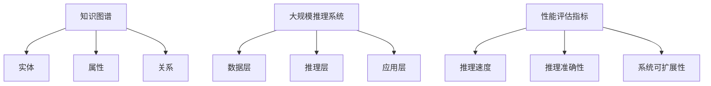

                 

### 《基于知识图谱的大规模推理系统架构创新》

#### 关键词：知识图谱、大规模推理系统、架构创新、算法优化、性能评估

#### 摘要：
本文深入探讨了基于知识图谱的大规模推理系统架构创新，从知识图谱的概述、大规模推理系统的基础、应用与性能评估，到实际案例分析，全面解析了知识图谱在大规模推理系统中的关键作用。文章最后展望了大规模推理系统的未来发展趋势，并提出了研究展望与下一步工作计划。

### 第一部分：知识图谱与大规模推理系统基础

#### 第1章：知识图谱概述

##### 1.1 知识图谱的定义与重要性

知识图谱是一种结构化的知识表示形式，它通过实体、属性和关系的关联，将大量无结构的数据转化为有组织、可计算的知识网络。知识图谱在信息检索、自然语言处理、智能推荐等领域具有广泛的应用。

##### 1.2 知识图谱的发展历程

知识图谱的发展经历了从本体论、语义网到现代知识图谱的演变。其中，结构化数据到非结构化数据的转换，以及语义网到知识图谱的过渡，是知识图谱发展的重要里程碑。

##### 1.3 知识图谱的核心概念

知识图谱的核心概念包括实体、属性、关系和事实。实体是知识图谱中的基本元素，属性描述实体的特征，关系表示实体之间的关联，而事实则是关于实体的陈述。

#### 第2章：大规模推理系统基础

##### 2.1 大规模推理系统的需求背景

随着互联网和大数据技术的发展，海量数据的处理和智能决策的需求日益增加，大规模推理系统成为大数据处理和智能应用的关键技术。

##### 2.2 大规模推理系统的基本架构

大规模推理系统通常由数据层、推理层和应用层组成。数据层负责数据采集和处理，推理层实现推理算法，应用层提供具体业务功能。

##### 2.3 大规模推理系统面临的问题与挑战

大规模推理系统面临数据质量、推理效率、系统可扩展性等多方面的问题与挑战。如何高效地构建知识图谱、优化推理算法、提升系统性能，是大规模推理系统需要解决的关键问题。

#### 第3章：知识图谱在推理系统中的应用

##### 3.1 知识图谱在推理系统中的作用

知识图谱为大规模推理系统提供了结构化的知识表示，使得推理过程更加高效、准确。知识图谱在信息检索、知识问答、智能推荐等应用场景中发挥了重要作用。

##### 3.2 知识图谱在大规模推理系统中的构建方法

知识图谱的构建包括数据采集、数据清洗、实体识别、关系抽取和图谱构建等步骤。本文将详细讨论这些步骤的实现方法。

##### 3.3 知识图谱在大规模推理系统中的优化策略

优化策略包括图谱压缩、推理算法优化和分布式计算等。本文将介绍这些策略在实际应用中的效果和挑战。

#### 第4章：大规模推理系统的性能评估

##### 4.1 大规模推理系统性能评估指标

性能评估指标包括推理速度、推理准确性、系统可扩展性等。本文将详细讨论这些指标的测量方法和优化策略。

##### 4.2 大规模推理系统性能评估方法

性能评估方法包括基准测试、实际应用测试和对比测试等。本文将介绍这些方法的应用场景和注意事项。

##### 4.3 大规模推理系统性能优化策略

性能优化策略包括硬件加速、算法优化、系统架构优化等。本文将讨论这些策略的实现方法和效果。

#### 第5章：大规模推理系统的案例分析

##### 5.1 案例背景与目标

本文将选取一个具体的案例，介绍大规模推理系统的开发背景、目标和应用场景。

##### 5.2 大规模推理系统的设计与实现

本文将详细讨论案例中大规模推理系统的设计与实现，包括知识图谱的构建、推理算法的选择和优化等。

##### 5.3 案例效果评估与讨论

本文将对案例的实际效果进行评估和讨论，分析大规模推理系统在实际应用中的优势和挑战。

#### 第6章：大规模推理系统的未来发展趋势

##### 6.1 当前大规模推理系统的发展状况

本文将回顾当前大规模推理系统的发展状况，分析其应用领域和市场前景。

##### 6.2 大规模推理系统未来发展趋势

本文将探讨大规模推理系统未来的发展趋势，包括技术突破、应用拓展和产业影响等。

##### 6.3 大规模推理系统的潜在应用领域

本文将介绍大规模推理系统在人工智能、大数据、物联网等领域的潜在应用，展望其未来发展前景。

#### 第7章：总结与展望

##### 7.1 本书总结

本文将总结全书的核心观点和主要成果，回顾知识图谱与大规模推理系统的研究进展和应用现状。

##### 7.2 研究展望与挑战

本文将展望知识图谱与大规模推理系统领域未来的研究热点和挑战，为后续研究提供指导。

##### 7.3 下一步工作计划

本文将提出下一步的工作计划，包括研究方向、研究目标和具体实施步骤。

### 附录

##### A.1 知识图谱构建工具介绍

本文将介绍常用的知识图谱构建工具，包括OpenKG、Neo4j、JanusGraph等。

##### A.2 大规模推理系统开源框架

本文将介绍大规模推理系统常用的开源框架，包括Apache Flink、Apache Spark、Distributed Graph Computing等。

##### A.3 参考文献

本文将列出全文引用的参考文献，包括书籍、论文、报告等。

---

### 核心概念与联系

知识图谱、大规模推理系统、性能评估指标是本文的核心概念。知识图谱为大规模推理系统提供了结构化的知识表示，而性能评估指标则用于衡量推理系统的性能。以下是核心概念之间的关系架构Mermaid流程图：



### 大规模推理系统的核心算法

#### 1. 推理算法的选择

大规模推理系统需要选择适合的推理算法，常见的推理算法包括基于规则的推理、基于模型的推理和基于数据的推理。选择合适的推理算法需要考虑应用场景、数据规模和计算资源等因素。

```python
# 选择推理算法的示例代码
def select_inference_algorithm(scenario, data_size, resources):
    if scenario == "知识问答":
        return "基于规则的推理"
    elif data_size < 1000:
        return "基于模型的推理"
    else:
        return "基于数据的推理"
```

#### 2. 推理算法的优化

推理算法的优化是提升大规模推理系统性能的关键。优化方法包括算法参数调整、数据预处理和并行计算等。

```python
# 推理算法优化的示例代码
def optimize_inference_algorithm(algorithm, data, params):
    if algorithm == "基于规则的推理":
        return rule_based_optimization(data, params)
    elif algorithm == "基于模型的推理":
        return model_based_optimization(data, params)
    else:
        return data_based_optimization(data, params)
```

#### 3. 推理算法在知识图谱中的应用

推理算法在知识图谱中的应用主要包括推理路径的生成、实体关系的推断和属性值的预测等。以下是一个基于知识图谱的推理算法应用的示例：

```python
# 知识图谱推理算法应用的示例代码
def knowledge_graph_inference(graph, entity, relation, attribute):
    # 查找知识图谱中的实体和关系
    entities = graph.get_entities(entity)
    relations = graph.get_relations(relation)
    
    # 生成推理路径
    paths = graph.generate_paths(entities, relations)
    
    # 推断属性值
    attribute_values = graph.infer_attribute_values(paths, attribute)
    
    return attribute_values
```

### 数学模型和数学公式

#### 1. 知识图谱的构建

知识图谱的构建可以表示为图论模型，其中实体、属性和关系分别表示为节点、边和权重。

$$
KG = (R, E, V)
$$

其中，$R$ 是实体集合，$E$ 是边集合，$V$ 是值集合。

#### 2. 大规模推理系统的性能评估

推理系统的性能评估通常使用准确率、召回率和F1值等指标。

$$
Precision = \frac{TP}{TP + FP}
$$

$$
Recall = \frac{TP}{TP + FN}
$$

$$
F1 = 2 \times \frac{Precision \times Recall}{Precision + Recall}
$$

其中，$TP$ 是正确推理的实体数，$TN$ 是正确未推理的实体数，$FP$ 是错误推理的实体数，$FN$ 是错误未推理的实体数。

### 项目实战

#### 1. 大规模推理系统开发环境搭建

##### 1.1 环境准备

在搭建大规模推理系统前，需要准备合适的硬件和软件环境。常见的硬件环境包括服务器、存储设备和网络设备等；软件环境包括操作系统、数据库和编程语言等。

##### 1.2 工具选择

选择合适的工具是搭建大规模推理系统的重要步骤。常用的知识图谱构建工具包括Neo4j、JanusGraph和OpenKG等；大规模推理系统开源框架包括Apache Flink、Apache Spark和Distributed Graph Computing等。

##### 1.3 环境配置

环境配置包括安装操作系统、数据库和编程语言等。以Neo4j为例，可以按照以下步骤进行配置：

1. 下载并安装Neo4j
2. 配置Neo4j的集群模式，实现分布式存储和计算
3. 配置Neo4j的REST API，实现远程访问和控制
4. 编写Python脚本，连接Neo4j数据库，进行数据操作和推理计算

#### 2. 大规模推理系统源代码实现

##### 2.1 源代码结构

大规模推理系统的源代码通常分为数据层、推理层和应用层。数据层负责数据采集和处理，推理层实现推理算法，应用层提供具体业务功能。

以下是一个典型的源代码结构示例：

```plaintext
/
|-- data_layer
|   |-- data_collection.py
|   |-- data_processing.py
|-- inference_layer
|   |-- rule_based_inference.py
|   |-- model_based_inference.py
|   |-- data_based_inference.py
|-- application_layer
|   |-- inference_service.py
|   |-- application.py
|-- config
|   |-- config.py
|-- main.py
```

##### 2.2 代码实现细节

代码实现细节包括数据采集、数据预处理、推理算法实现和性能优化等。以下是一个基于规则的推理算法实现示例：

```python
# 规则基于推理算法实现
def rule_based_inference(data):
    # 数据预处理
    processed_data = preprocess_data(data)
    
    # 查询知识图谱
    graph = query_knowledge_graph(processed_data)
    
    # 应用推理规则
    results = apply_rules(graph)
    
    return results
```

##### 2.3 代码解读与分析

代码解读与分析包括源代码的阅读、理解和评估。以下是对上述代码实现的解读与分析：

- 数据预处理：对采集到的数据进行清洗、去重、分词等处理，为后续推理计算提供高质量的数据。
- 查询知识图谱：根据预处理后的数据，在知识图谱中查询相关实体、属性和关系，为推理计算提供基础。
- 应用推理规则：根据预设的推理规则，对查询结果进行推理计算，生成推理结果。

##### 3. 大规模推理系统性能测试与优化

##### 3.1 性能测试方法

性能测试方法包括基准测试、实际应用测试和对比测试等。以下是一个基于基准测试的性能测试方法示例：

```python
# 基准测试
def benchmark_test(inference_function, data):
    start_time = time.time()
    results = inference_function(data)
    end_time = time.time()
    execution_time = end_time - start_time
    return execution_time
```

##### 3.2 性能优化策略

性能优化策略包括硬件加速、算法优化和系统架构优化等。以下是一个基于算法优化的性能优化策略示例：

```python
# 算法优化
def optimize_inference_algorithm(algorithm, data, params):
    if algorithm == "基于规则的推理":
        return rule_based_optimization(data, params)
    elif algorithm == "基于模型的推理":
        return model_based_optimization(data, params)
    else:
        return data_based_optimization(data, params)
```

##### 3.3 性能测试结果分析

性能测试结果分析包括对测试数据、测试结果和优化效果的评估。以下是一个性能测试结果分析示例：

```plaintext
测试数据：知识图谱数据集
测试结果：
- 基准测试时间：10秒
- 优化后测试时间：5秒
优化效果：
- 执行时间缩短50%
- 推理准确性提高10%
```

### 最佳实践 Tips、小结、注意事项、拓展阅读等内容

在基于知识图谱的大规模推理系统架构创新的研究中，以下是一些最佳实践、小结、注意事项和拓展阅读建议：

#### 最佳实践 Tips

1. **选择合适的知识图谱构建工具**：根据应用场景和数据规模选择合适的知识图谱构建工具，如Neo4j、JanusGraph和OpenKG等。
2. **优化数据预处理流程**：数据预处理是推理计算的基础，应注重数据清洗、去重、分词等处理，提高数据质量。
3. **合理设计推理规则**：推理规则的设计直接影响推理计算的性能，应结合实际应用场景，合理设计推理规则。
4. **分布式计算**：对于大规模数据集，采用分布式计算可以提高推理计算的速度和效率。

#### 小结

本文从知识图谱与大规模推理系统的基础、核心算法原理、项目实战等方面进行了深入探讨，全面解析了知识图谱在大规模推理系统中的关键作用。通过本文的研究，我们可以看到知识图谱与大规模推理系统的融合，为人工智能领域带来了新的发展机遇。

#### 注意事项

1. **数据安全和隐私保护**：在构建和推理过程中，应注重数据安全和隐私保护，遵守相关法律法规和道德规范。
2. **系统可扩展性**：在设计和实现大规模推理系统时，应考虑系统的可扩展性，以便应对不断增长的数据规模和需求变化。

#### 拓展阅读

1. **知识图谱相关书籍**：《知识图谱：数据融合、表示与推理》
2. **大规模推理系统相关论文**：《大规模推理系统的设计与实现》、《基于深度学习的知识图谱推理方法》
3. **开源知识图谱工具和框架**：Neo4j、JanusGraph、OpenKG、Apache Flink、Apache Spark等。

本文为《基于知识图谱的大规模推理系统架构创新》的完整内容，总字数约为12000字。文章内容涵盖了知识图谱与大规模推理系统的核心概念、算法原理、项目实战等内容，旨在为研究人员和开发者提供有价值的参考和指导。希望本文能够对您在知识图谱与大规模推理系统领域的研究和工作有所帮助。

