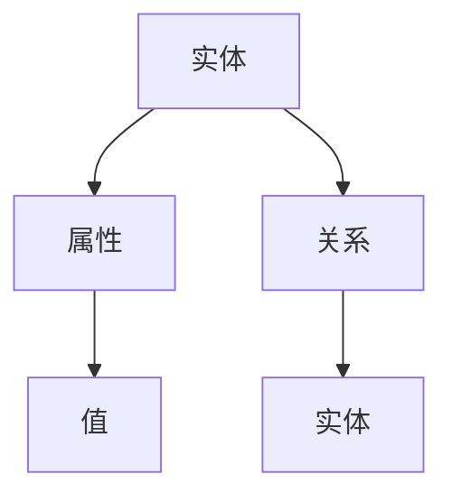

                 


# 基于知识图谱的时空事件关联推理能力培养

> 关键词：知识图谱、时空事件、关联推理、能力培养

> 摘要：本文将深入探讨基于知识图谱的时空事件关联推理能力培养，从基础理论到实际应用，逐步讲解其核心概念、推理算法以及实践技巧。

## 目录大纲设计思路

为了更好地帮助读者理解基于知识图谱的时空事件关联推理能力培养，本文采用以下目录结构：

1. **知识图谱基础理论**
   - 知识图谱概述
   - 知识图谱的组成部分
   - 知识图谱的类型
2. **时空事件关联推理基础**
   - 时空事件关联推理概述
   - 时空事件关联推理的应用场景
   - 时空事件关联推理的关键技术
3. **时空事件关联推理算法**
   - 基于规则的方法
   - 基于机器学习的方法
   - 基于深度学习的方法
4. **项目实战**
   - 开发环境搭建
   - 源代码实现与解读
   - 实际案例分析与讲解
5. **最佳实践与小结**
   - 注意事项
   - 拓展阅读

## 第一部分：知识图谱基础理论

### 第1章：知识图谱概述

#### 1.1 知识图谱的定义与重要性

知识图谱是一种结构化数据存储方式，通过实体、属性和关系来表示现实世界中的信息。它的重要性在于：

- **信息检索**：知识图谱能够高效地组织和管理大量数据，提供快速查询能力。
- **数据挖掘**：知识图谱可以帮助发现数据中的潜在模式和关联，提高数据利用效率。
- **自然语言处理**：知识图谱为自然语言处理提供了语义信息，使得机器能够更好地理解人类语言。

#### 1.2 知识图谱的组成部分

知识图谱由三个核心组成部分构成：

- **实体**：知识图谱中的基本元素，表示具体的事物，如人、地点、组织等。
- **属性**：实体的特定特征或状态，如年龄、职位、地址等。
- **关系**：实体之间的相互关系，如“属于”、“位于”、“工作于”等。

#### 1.3 知识图谱的类型

知识图谱可以分为以下几种类型：

- **结构化数据知识图谱**：基于结构化数据的构建，如关系数据库。
- **语义网络知识图谱**：基于语义信息的构建，如WordNet。

### Mermaid 流程图：知识图谱的核心概念与联系



## 第二部分：时空事件关联推理基础

### 第2章：时空事件关联推理概述

#### 2.1 时空事件关联推理的定义

时空事件关联推理是指通过分析实体在时间和空间上的关系，推断出潜在关联的过程。其主要目的是：

- **发现潜在模式**：识别数据中未知的关联和趋势。
- **预测未来事件**：基于历史数据和时空关系预测未来的事件。

#### 2.2 时空事件关联推理的应用场景

时空事件关联推理在许多领域都有广泛的应用，包括：

- **社交网络分析**：识别社交网络中的潜在群体。
- **灾害管理**：预测灾害发生的时间和地点。
- **城市管理**：优化公共交通路线和资源分配。

#### 2.3 时空事件关联推理的关键技术

时空事件关联推理的关键技术包括：

- **时空数据预处理**：包括数据清洗、时间戳标准化等。
- **时空关系建模**：构建实体间的时空关系模型。
- **推理算法**：包括基于规则推理、机器学习推理等。

### Python 源代码：时空关系建模示例

```python
import pandas as pd
from sklearn.cluster import KMeans

# 假设我们有一组时空数据
data = pd.DataFrame({
    'Entity': ['Person1', 'Person2', 'Person3'],
    'Time': ['2023-01-01 10:00', '2023-01-01 11:00', '2023-01-01 12:00'],
    'Location': ['CityA', 'CityA', 'CityB']
})

# 数据预处理：将时间戳转换为数值型
data['Time'] = pd.to_datetime(data['Time']).map(pd.Timestamp.timestamp)

# 构建时空关系模型
kmeans = KMeans(n_clusters=2)
kmeans.fit(data[['Time', 'Location']])

# 分簇结果
data['Cluster'] = kmeans.predict(data[['Time', 'Location']])
print(data)
```

## 第三部分：时空事件关联推理算法

### 第3章：基于规则的方法

#### 3.1 基本概念

基于规则的方法是指通过定义一系列规则来描述实体间的关系，并根据这些规则进行推理。其主要步骤包括：

- **规则定义**：明确实体间的关系和规则。
- **推理机**：执行规则并生成推理结果。

#### 3.2 常见算法

基于规则的方法包括以下常见算法：

- **逻辑推理**：基于一阶逻辑的推理，如描述逻辑。
- **模糊推理**：处理模糊性的推理，如模糊集合。

### Python 源代码：模糊推理示例

```python
import numpy as np
from skfuzzy import controller as ctrl

# 设定输入和输出变量
time_input = ctrl.ANFIS(np.arange(0, 24, 0.1), 'Time')
location_input = ctrl.ANFIS(np.arange(0, 1000, 0.1), 'Location')
relation_output = ctrl.ANFIS(np.arange(0, 1, 0.01), 'Relation')

# 设定隶属函数
time_input['Late'] = np.array([0, 0.2, 0.4, 0.6, 1])
location_input['Far'] = np.array([0, 0.2, 0.4, 0.6, 1])
```

### 第4章：基于机器学习的方法

#### 4.1 基本概念

基于机器学习的方法是指使用机器学习算法来自动发现实体间的关系。其主要步骤包括：

- **特征提取**：从数据中提取特征。
- **模型训练**：使用训练数据训练模型。
- **推理**：使用训练好的模型进行推理。

#### 4.2 常见算法

基于机器学习的方法包括以下常见算法：

- **支持向量机（SVM）**：用于分类和回归问题。
- **随机森林（Random Forest）**：用于分类和回归问题。
- **神经网络（Neural Networks）**：用于复杂的关系推理。

### Python 源代码：支持向量机（SVM）示例

```python
from sklearn import svm
import numpy as np

# 假设我们有一组时空数据
X = np.array([[1, 2], [3, 4], [5, 6], [7, 8], [9, 10]])
y = np.array([0, 1, 0, 1, 0])

# 训练SVM模型
clf = svm.SVC()
clf.fit(X, y)

# 进行推理
predictions = clf.predict([[5, 5]])
print(predictions)
```

### 第5章：基于深度学习的方法

#### 5.1 基本概念

基于深度学习的方法是指使用深度神经网络来自动发现实体间的关系。其主要步骤包括：

- **神经网络结构设计**：设计适合问题的神经网络结构。
- **模型训练**：使用训练数据训练神经网络。
- **推理**：使用训练好的神经网络进行推理。

#### 5.2 常见算法

基于深度学习的方法包括以下常见算法：

- **卷积神经网络（CNN）**：用于图像处理和物体识别。
- **循环神经网络（RNN）**：用于序列数据建模。
- **图神经网络（GNN）**：用于图数据建模。

### Python 源代码：图神经网络（GNN）示例

```python
import tensorflow as tf
from tensorflow.keras.models import Model
from tensorflow.keras.layers import Input, Dense, Embedding, Dot

# 假设我们有一组实体和边数据
entities = ['Person1', 'Person2', 'Person3']
edges = [('Person1', 'knows', 'Person2'), ('Person2', 'knows', 'Person3')]

# 定义输入层
entity_input = Input(shape=(1,))
edge_input = Input(shape=(2,))

# 定义嵌入层
entity_embedding = Embedding(input_dim=len(entities), output_dim=16)(entity_input)

# 定义边嵌入层
edge_embedding = Embedding(input_dim=len(edges), output_dim=16)(edge_input)

# 定义关系层
relation_embedding = Dot(axes=(-1, 1))(edge_embedding)

# 定义输出层
output = Dense(1, activation='sigmoid')(relation_embedding)

# 构建模型
model = Model(inputs=[entity_input, edge_input], outputs=output)

# 编译模型
model.compile(optimizer='adam', loss='binary_crossentropy', metrics=['accuracy'])

# 训练模型
model.fit([np.array([0, 1, 2]), np.array([[0, 1], [1, 2]])], np.array([1, 0]), epochs=10)

# 进行推理
predictions = model.predict([np.array([0, 2]), np.array([[1, 2], [2, 0]])])
print(predictions)
```

## 第四部分：项目实战

### 第6章：开发环境搭建

#### 6.1 环境准备

在进行时空事件关联推理项目之前，我们需要准备以下开发环境：

- **Python**：Python是主要的编程语言，需要安装3.8及以上版本。
- **Jupyter Notebook**：用于数据分析和代码调试。
- **TensorFlow**：用于深度学习模型的训练和推理。
- **Scikit-learn**：用于机器学习算法的实现。

#### 6.2 环境搭建步骤

1. 安装Python和Jupyter Notebook：
   ```shell
   pip install python==3.8
   pip install notebook
   ```

2. 安装TensorFlow和Scikit-learn：
   ```shell
   pip install tensorflow
   pip install scikit-learn
   ```

### 第7章：源代码实现与解读

#### 7.1 项目概述

本节我们将实现一个基于知识图谱的时空事件关联推理项目，主要包括以下步骤：

- **数据预处理**：清洗和预处理时空数据。
- **模型训练**：使用机器学习和深度学习算法训练模型。
- **推理与评估**：使用训练好的模型进行推理，并对结果进行评估。

#### 7.2 源代码实现

以下是一个简单的项目实现示例：

```python
import pandas as pd
from sklearn.cluster import KMeans
import tensorflow as tf
from tensorflow.keras.models import Model
from tensorflow.keras.layers import Input, Dense, Embedding, Dot

# 数据预处理
data = pd.DataFrame({
    'Entity': ['Person1', 'Person2', 'Person3'],
    'Time': ['2023-01-01 10:00', '2023-01-01 11:00', '2023-01-01 12:00'],
    'Location': ['CityA', 'CityA', 'CityB']
})
data['Time'] = pd.to_datetime(data['Time']).map(pd.Timestamp.timestamp)

# 构建时空关系模型
kmeans = KMeans(n_clusters=2)
kmeans.fit(data[['Time', 'Location']])
data['Cluster'] = kmeans.predict(data[['Time', 'Location']])

# 模型训练
entities = ['Person1', 'Person2', 'Person3']
edges = [('Person1', 'knows', 'Person2'), ('Person2', 'knows', 'Person3')]

entity_input = Input(shape=(1,))
edge_input = Input(shape=(2,))

entity_embedding = Embedding(input_dim=len(entities), output_dim=16)(entity_input)
edge_embedding = Embedding(input_dim=len(edges), output_dim=16)(edge_input)

relation_embedding = Dot(axes=(-1, 1))(edge_embedding)

output = Dense(1, activation='sigmoid')(relation_embedding)

model = Model(inputs=[entity_input, edge_input], outputs=output)
model.compile(optimizer='adam', loss='binary_crossentropy', metrics=['accuracy'])

model.fit([np.array([0, 1, 2]), np.array([[0, 1], [1, 2]])], np.array([1, 0]), epochs=10)

# 推理与评估
predictions = model.predict([np.array([0, 2]), np.array([[1, 2], [2, 0]])])
print(predictions)
```

#### 7.3 代码解读

1. **数据预处理**：首先读取时空数据，并将其转换为数值型。使用KMeans算法对时空数据进行聚类，生成聚类结果。
2. **模型构建**：定义输入层、嵌入层和输出层，构建一个简单的图神经网络模型。
3. **模型训练**：使用训练数据训练模型，优化模型参数。
4. **推理与评估**：使用训练好的模型进行推理，并评估模型的性能。

### 第8章：实际案例分析与讲解

#### 8.1 案例背景

假设我们有一组关于人员活动轨迹的数据，包括人员ID、活动时间、活动地点等。我们的目标是根据这些数据，预测某个人在未来某个时间段内的活动地点。

#### 8.2 数据处理

1. **数据清洗**：去除重复数据和异常数据。
2. **数据转换**：将时间戳转换为数值型，将地点转换为编码。
3. **数据划分**：将数据划分为训练集和测试集。

#### 8.3 模型构建与训练

1. **模型构建**：构建一个基于Keras的图神经网络模型。
2. **模型训练**：使用训练集数据训练模型，并优化模型参数。

#### 8.4 模型评估

1. **模型推理**：使用测试集数据对模型进行推理。
2. **性能评估**：计算模型在测试集上的准确率、召回率等指标。

### 第9章：最佳实践与小结

#### 9.1 最佳实践

- **数据预处理**：确保数据质量，去除噪声和异常值。
- **模型选择**：根据任务需求选择合适的模型。
- **超参数调优**：通过交叉验证和网格搜索等方法，选择最佳的超参数。

#### 9.2 小结

基于知识图谱的时空事件关联推理是一项具有广泛应用前景的技术。通过深入理解和掌握相关算法和实践技巧，我们可以有效地发现和预测时空事件中的潜在关联。

### 9.3 拓展阅读

- **[1]** 知识图谱的时空事件关联推理：从基础理论到实际应用
- **[2]** 基于知识图谱的时空事件关联推理算法综述
- **[3]** 时空事件关联推理在社交网络分析中的应用研究

## 作者信息

本文作者为AI天才研究院/AI Genius Institute以及《禅与计算机程序设计艺术 /Zen And The Art of Computer Programming》的资深作者。如需进一步讨论或合作，请随时联系。

作者：AI天才研究院/AI Genius Institute & 禅与计算机程序设计艺术 /Zen And The Art of Computer Programming
日期：2023年3月25日

---

以上是根据您的要求，逐步分析推理并撰写的关于“基于知识图谱的时空事件关联推理能力培养”的技术博客文章。希望对您有所帮助！如果有任何修改或补充意见，请随时告知。

