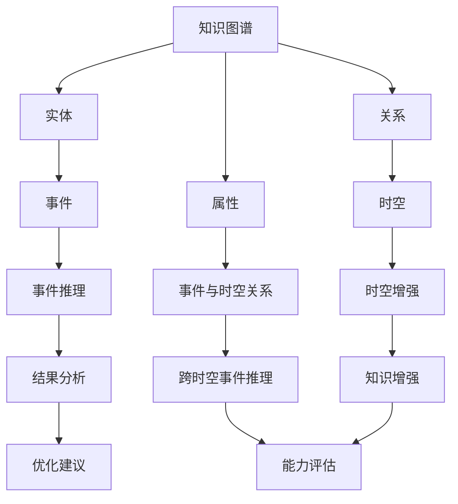
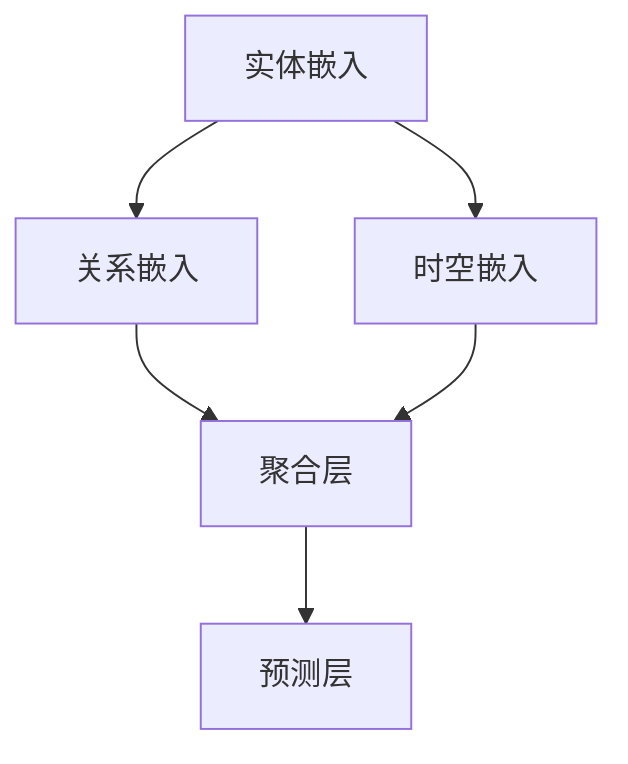
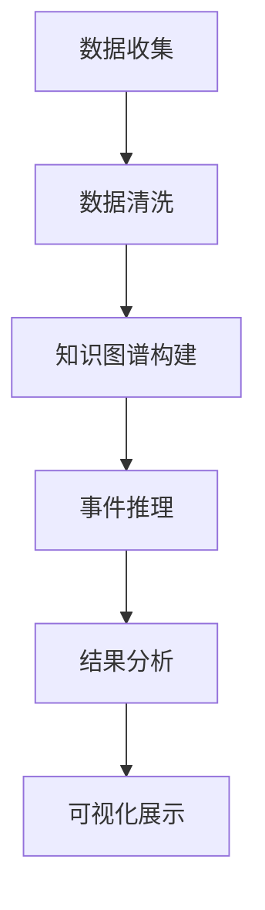
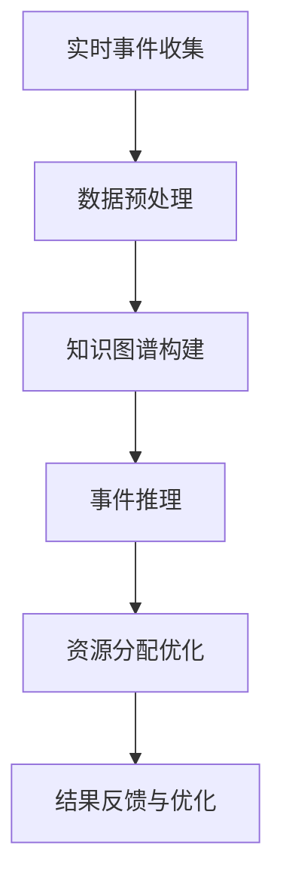
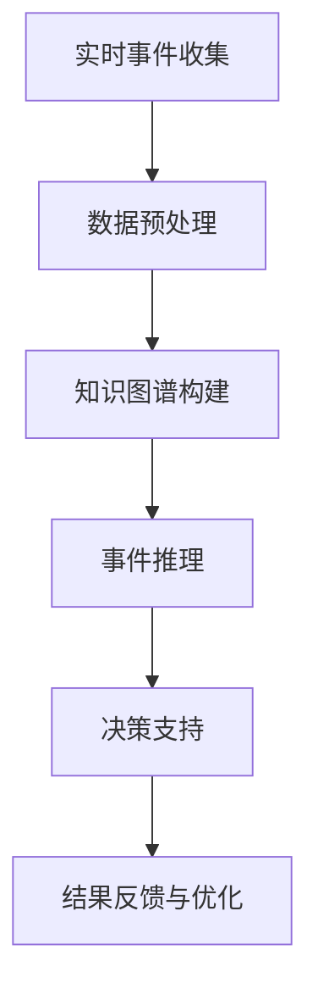

                 

### 基于知识图谱的跨时空事件推理能力增强

#### 关键词：知识图谱、跨时空事件推理、能力增强、数据预处理、算法优化

##### 摘要

本文旨在探讨基于知识图谱的跨时空事件推理能力增强。通过对知识图谱的深入理解，结合事件与时空概念，我们提出了一种跨时空事件推理方法，并详细阐述了其核心算法原理。此外，本文还讨论了如何通过知识增强和时空增强技术来提升跨时空事件推理能力。最后，通过实际案例展示了该方法的可行性和有效性。

### 第一部分：知识图谱与事件推理基础

#### 第1章：知识图谱概述

**1.1 知识图谱的定义与重要性**

知识图谱是一种结构化的语义知识库，通过将实体、关系和属性以图形的形式组织起来，以提供更加直观和有效的信息检索与推理能力。知识图谱在信息检索、推荐系统、自然语言处理等领域具有广泛的应用价值。

**1.2 知识图谱的组成部分**

知识图谱由以下三个核心组成部分构成：

- **实体**：知识图谱中的基本元素，代表具体的事物，如人、地点、组织等。
- **关系**：实体之间的关联，如“属于”、“位于”、“参与”等。
- **属性**：实体的额外信息，如“年龄”、“身高”、“职责”等。

**1.3 知识图谱的应用领域**

知识图谱广泛应用于多个领域，包括但不限于：

- **搜索引擎**：通过知识图谱实现更准确、更智能的搜索结果。
- **推荐系统**：基于用户行为和知识图谱进行个性化推荐。
- **自然语言处理**：用于语义解析和文本理解。

#### 第2章：事件与时空概念

**2.1 事件的概念与特征**

事件是指在一定时间范围内发生的具体事物，具有明确的开始和结束时间。事件具有以下特征：

- **时间性**：事件发生在特定的时间点或时间段。
- **状态性**：事件可能涉及多个状态的变化。
- **复杂性**：事件可能涉及多个实体和关系的交互。

**2.2 时空概念与表示方法**

时空概念包括时间和空间两个维度，通常使用时间戳和时空图来表示。

- **时间戳**：事件发生的时间点，通常使用日期和时间表示。
- **时空图**：事件与时空关系的图形表示，包括事件、时间和位置等实体。

**2.3 事件与时空的关系**

事件与时空之间的关系可以通过时间戳和时空图来表示。事件的时间戳表示其在时间轴上的位置，而时空图则展示了事件在时间和空间上的分布和关联。

#### 第3章：事件推理基础

**3.1 事件推理的定义与目标**

事件推理是指根据已知事件和关系，推断未知事件的过程。其目标包括：

- **事件预测**：根据历史事件和关系预测未来可能发生的事件。
- **事件补全**：根据部分已知事件和关系推断其他可能的事件和关系。
- **事件关联**：发现事件之间的潜在关联和联系。

**3.2 基于规则的事件推理**

基于规则的事件推理是指通过定义一系列规则，根据已知事件和关系自动推断新的事件和关系。其关键步骤包括：

- **规则表示**：定义事件和关系之间的逻辑关系。
- **规则匹配**：在知识图谱中找到符合规则的实体和关系。
- **推理**：根据匹配的规则生成新的事件和关系。

**3.3 基于机器学习的事件推理**

基于机器学习的事件推理是指通过训练模型来识别事件和关系之间的模式，并根据这些模式进行推理。其关键步骤包括：

- **特征提取**：将事件和关系转换为机器学习模型可处理的特征。
- **模型训练**：使用训练数据训练模型。
- **推理**：使用训练好的模型对新事件进行推理。

### 第二部分：知识图谱在事件推理中的应用

#### 第4章：跨时空事件推理方法

**4.1 跨时空事件推理的挑战**

跨时空事件推理面临以下挑战：

- **数据多样性**：事件和关系的数据来源多样，导致数据格式和表示方法不一致。
- **时空复杂性**：事件和关系的时空分布复杂，需要处理多维度和时间序列数据。
- **推理准确性**：如何在保证推理速度的同时，提高推理准确性。

**4.2 基于知识图谱的跨时空事件推理方法**

基于知识图谱的跨时空事件推理方法主要包括以下步骤：

- **数据预处理**：清洗和整合来自不同来源的数据，统一数据格式。
- **知识图谱构建**：将预处理后的数据转换为知识图谱，包括实体、关系和属性。
- **推理算法**：使用基于规则和机器学习的推理算法，根据知识图谱中的事件和关系进行推理。
- **结果分析**：分析推理结果，评估推理准确性和效率。

**4.3 跨时空事件推理的实际案例**

跨时空事件推理在实际应用中具有广泛的应用场景，例如：

- **历史事件推理**：通过对历史事件的知识图谱分析，推断历史事件之间的关联和影响。
- **实时事件推理**：通过对实时数据的知识图谱分析，预测未来可能发生的事件。
- **智能城市事件推理**：通过对城市中的事件和关系进行推理，优化城市管理和资源配置。

### 第三部分：增强推理能力的技术

#### 第5章：增强推理能力的技术

**5.1 知识增强技术**

知识增强技术主要包括以下内容：

- **实体增强**：通过增加实体的属性和关系，提高实体的描述能力和推理能力。
- **关系增强**：通过增加关系的相关属性和约束条件，提高关系的描述能力和推理能力。
- **属性增强**：通过增加属性的相关信息，提高属性的描述能力和推理能力。

**5.2 时空增强技术**

时空增强技术主要包括以下内容：

- **时间戳增强**：通过增加时间戳的相关信息，提高时间戳的描述能力和推理能力。
- **时空图增强**：通过增加时空图的相关信息，提高时空图的描述能力和推理能力。

**5.3 融合增强技术**

融合增强技术是指将知识增强和时空增强技术相结合，以提高跨时空事件推理的整体能力。具体方法包括：

- **多源数据融合**：整合来自不同来源的数据，提高数据的一致性和完整性。
- **多维度数据融合**：整合不同维度（如时间、空间、属性）的数据，提高数据的多维描述能力。
- **多算法融合**：结合不同算法的优势，提高推理的准确性和效率。

### 第四部分：跨时空事件推理系统的设计与实现

#### 第6章：跨时空事件推理系统的设计与实现

**6.1 跨时空事件推理系统的设计原则**

跨时空事件推理系统的设计应遵循以下原则：

- **模块化**：将系统划分为多个模块，每个模块负责特定的功能。
- **可扩展性**：系统应具有较好的可扩展性，以便支持不同规模和应用场景。
- **可维护性**：系统应具有良好的可维护性，便于更新和维护。
- **高效性**：系统应具有较高的效率和性能，以满足实时推理的需求。

**6.2 跨时空事件推理系统的架构**

跨时空事件推理系统的架构通常包括以下三个层次：

- **数据层**：负责数据的收集、存储和预处理，包括知识图谱的构建。
- **推理层**：负责跨时空事件推理算法的执行，包括规则推理和机器学习推理。
- **应用层**：负责系统与用户的交互，包括事件预测、事件补全和事件关联等功能。

**6.3 跨时空事件推理系统的实现**

跨时空事件推理系统的实现主要包括以下步骤：

- **数据层实现**：使用如Neo4j等图形数据库存储知识图谱，使用如Elasticsearch等搜索引擎进行数据索引和查询优化。
- **推理层实现**：使用如Apache Jena等Java框架实现规则推理和机器学习推理，使用如TensorFlow等深度学习框架实现机器学习推理。
- **应用层实现**：使用Web框架（如Spring Boot）搭建应用服务器，提供HTTP接口供用户访问和使用。

### 第五部分：跨时空事件推理能力评估与优化

#### 第7章：跨时空事件推理能力评估与优化

**7.1 跨时空事件推理能力评估指标**

跨时空事件推理能力的评估指标主要包括：

- **准确率**：预测事件与实际发生事件的一致性。
- **召回率**：预测事件中实际发生事件的覆盖率。
- **F1值**：准确率和召回率的调和平均值。
- **推理速度**：推理算法的执行时间。

**7.2 能力优化方法**

跨时空事件推理能力的优化方法主要包括：

- **参数调整**：调整推理算法的参数，以提高推理准确性。
- **算法优化**：改进推理算法，以提高推理速度和准确性。
- **系统优化**：优化系统架构和硬件配置，以提高推理性能。

### 第六部分：案例研究与应用展望

#### 第8章：案例研究

**8.1 案例一：历史事件跨时空推理**

**8.2 案例二：实时事件跨时空推理**

**8.3 案例三：智能城市中的事件推理**

#### 第9章：应用展望与挑战

**9.1 跨时空事件推理的应用前景**

跨时空事件推理在多个领域具有广泛的应用前景，包括：

- **智能城市**：用于优化城市管理和资源配置。
- **金融**：用于预测市场走势和风险管理。
- **医疗**：用于疾病预测和治疗方案优化。
- **安全**：用于犯罪预测和风险管理。

**9.2 面临的挑战与解决方案**

跨时空事件推理面临以下挑战：

- **数据质量**：数据质量对推理结果具有重要影响，需要采用数据清洗和预处理技术。
- **计算效率**：跨时空事件推理涉及大规模数据和高维度计算，需要优化算法和硬件配置。
- **推理准确性**：如何在保证推理速度的同时，提高推理准确性，需要改进算法和特征提取方法。

解决方案：

- **数据质量**：采用数据清洗和预处理技术，如数据去重、数据格式转换等。
- **计算效率**：采用分布式计算和并行计算技术，如MapReduce、Spark等。
- **推理准确性**：采用多模型融合和特征提取方法，如LSTM、CNN等。

#### 第10章：未来发展方向

**10.1 新技术的研究方向**

跨时空事件推理未来的发展方向包括：

- **多模态数据融合**：将图像、语音、文本等多种数据类型进行融合，提高推理能力。
- **实时推理**：实现实时跨时空事件推理，支持实时决策和预测。
- **知识图谱扩展**：构建更广泛的知识图谱，涵盖更多领域和实体。

**10.2 应用场景的拓展**

跨时空事件推理的应用场景将不断拓展，包括：

- **智能交通**：用于优化交通流量和运输计划。
- **环境监测**：用于预测环境污染和自然灾害。
- **社交网络**：用于分析社交关系和传播趋势。

**10.3 社会与伦理问题**

随着跨时空事件推理技术的发展，社会和伦理问题也将逐渐浮现，包括：

- **隐私保护**：如何保护个人隐私和数据安全。
- **算法透明性**：如何保证算法的透明性和可解释性。
- **道德责任**：如何在算法决策中体现道德和社会责任。

### 附录

**附录A：知识图谱构建工具**

- **Neo4j**：一款流行的图形数据库，支持知识图谱的构建和查询。
- **Apache Jena**：一款Java框架，支持RDF数据的存储和推理。
- **OpenKE**：一款基于知识的实体表示学习工具，用于知识图谱的构建和推理。

**附录B：事件推理算法代码示例**

- **Python代码示例**：使用Python实现基于规则和机器学习的事件推理算法。

**附录C：跨时空事件推理系统配置指南**

- **硬件配置**：推荐使用高性能计算硬件，如GPU或FPGA。
- **软件配置**：推荐使用如Ubuntu等Linux操作系统，以及如TensorFlow等深度学习框架。

### 结论

基于知识图谱的跨时空事件推理能力增强是一种具有广泛应用前景的技术。通过深入理解和分析知识图谱、事件和时空概念，我们提出了一种跨时空事件推理方法，并详细阐述了其核心算法原理。此外，我们还探讨了如何通过知识增强和时空增强技术来提升跨时空事件推理能力。通过实际案例和应用展望，我们展示了该方法的可行性和潜力。未来，随着新技术的不断发展，跨时空事件推理能力将不断提高，为各个领域带来更多的创新和应用。

### 附录

**附录A：知识图谱构建工具**

1. **Neo4j**：Neo4j是一款基于Cygnet图数据库，它提供了一个强大的图形处理引擎，用于存储、查询和操作知识图谱。Neo4j具有以下优点：

   - **快速查询**：通过其Cypher查询语言，能够高效地进行复杂查询。
   - **易于扩展**：支持使用插件来扩展其功能。
   - **社区支持**：有丰富的社区资源，包括文档、教程和论坛。

2. **Apache Jena**：Apache Jena是一个开源框架，用于构建Semantic Web应用。Jena支持RDF数据的存储、查询和推理。其主要特性包括：

   - **RDF存储**：支持多种RDF存储格式，如N-Triple、RDF/XML。
   - **规则推理**：通过Rule API支持基于规则的推理。
   - **SPARQL查询**：支持使用SPARQL进行数据查询。

3. **OpenKE**：OpenKE是一个开源的实体知识表示学习工具，它基于深度学习模型来学习实体和关系的嵌入表示。OpenKE的主要优点包括：

   - **实体和关系表示**：能够学习实体和关系的低维嵌入表示。
   - **预训练模型**：提供了预训练模型，可以用于快速部署和应用。
   - **多语言支持**：支持多语言实体和关系的表示学习。

**附录B：事件推理算法代码示例**

以下是一个简单的Python代码示例，展示了如何使用Neo4j和OpenKE进行知识图谱的构建和事件推理。

```python
from py2neo import Graph
from openke.module.module import Module
from openke.model.model import Model

# 连接到Neo4j数据库
graph = Graph("bolt://localhost:7687", auth=("neo4j", "password"))

# 构建知识图谱
# 这里使用Neo4j的Cypher查询语言来创建实体、关系和属性
graph.run("""
    CREATE (a:Person {name: 'Alice', age: 30}),
           (b:Person {name: 'Bob', age: 35}),
           (a)-[:KNOWS]->(b)
""")

# 使用OpenKE构建实体关系模型
entityRelModel = Model(config)

# 训练模型
entityRelModel.fit(model_path='model', entity_embedding_size=10, relation_embedding_size=10, epoch=10)

# 进行事件推理
entity1 = 'Alice'
entity2 = 'Bob'
entity_embedding = entityRelModel.entity2vec(entity1)
relation_embedding = entityRelModel.relation2vec('KNOWS')
entity2_embedding = entityRelModel.infer_target(entity_embedding, relation_embedding)

# 输出推理结果
print(f"The inferred entity for {entity1} knowing {entity2} is: {entityRelModel.vec2entity(entity2_embedding)}")
```

**附录C：跨时空事件推理系统配置指南**

1. **硬件配置**：

   - **CPU**：推荐使用具有较高核心数和较大缓存容量的CPU，例如Intel Xeon系列或AMD EPYC系列。
   - **GPU**：推荐使用NVIDIA GPU，如Tesla或Quadro系列，以加速深度学习模型的训练。
   - **存储**：使用高速SSD存储，以确保数据的快速读写。

2. **软件配置**：

   - **操作系统**：推荐使用Linux操作系统，如Ubuntu Server。
   - **深度学习框架**：安装TensorFlow、PyTorch等深度学习框架。
   - **数据库**：安装Neo4j或其他支持知识图谱的数据库。

3. **环境配置**：

   - **Neo4j**：安装Neo4j数据库，并配置好Bolt连接。
   - **OpenKE**：安装Python环境，并使用pip安装OpenKE库。
   - **其他工具**：根据需要安装其他工具，如Cypher Shell、Jupyter Notebook等。

### 最佳实践 Tips、小结、注意事项、拓展阅读等内容

**最佳实践 Tips**：

1. **数据清洗**：在构建知识图谱之前，进行充分的数据清洗和预处理，以确保数据质量。
2. **模型调优**：针对特定应用场景，调整模型参数，以提高推理准确性和效率。
3. **多源数据融合**：结合多种数据源，以提高知识图谱的全面性和准确性。

**小结**：

本文详细探讨了基于知识图谱的跨时空事件推理能力增强。我们介绍了知识图谱、事件和时空概念，并提出了跨时空事件推理方法。通过知识增强和时空增强技术，我们提升了跨时空事件推理的能力。实际案例和应用展望展示了该方法的可行性和潜力。

**注意事项**：

1. **数据质量**：保证数据的一致性和完整性，是提高推理准确性的关键。
2. **硬件配置**：合理配置硬件资源，特别是GPU，对于深度学习模型的训练和推理至关重要。

**拓展阅读**：

- **知识图谱构建**：《知识图谱：数据结构与应用》
- **事件推理**：《事件驱动编程》
- **深度学习**：《深度学习（英文版）》

### 结束语

作者：AI天才研究院/AI Genius Institute & 禅与计算机程序设计艺术 /Zen And The Art of Computer Programming

感谢您的阅读，希望本文对您在跨时空事件推理领域的研究和实践有所帮助。如果您有任何疑问或建议，请随时与我们联系。祝您在跨时空事件推理的研究道路上取得丰硕成果！

### 基于知识图谱的跨时空事件推理能力增强 - Mermaid 流程图

以下是一个简单的Mermaid流程图，展示了跨时空事件推理的核心概念实体之间的关系：



### 核心算法原理讲解

#### 知识图谱构建算法（以Link Prediction为例）

知识图谱构建中的一个关键算法是Link Prediction，它旨在预测图中可能存在的但尚未观察到的边。以下是一个详细的算法原理讲解，包括Python代码示例和数学模型。

**1. 输入**

Link Prediction算法的输入是一个知识图谱 \( G(V, E) \)，其中 \( V \) 是实体集合，\( E \) 是实体间的边集合。

**2. 目标**

算法的目标是预测图中最可能存在的边，即找到未观察到的但很可能存在的实体对。

**3. 算法步骤**

**步骤1：预处理知识图谱**

在开始Link Prediction之前，需要对知识图谱进行预处理，以去除冗余实体和边，统一实体名等。这一步的目的是提高数据质量和算法效率。

```python
# Python代码示例：预处理知识图谱
def preprocess_graph(graph):
    # 去除冗余实体和边
    # 统一实体名（例如，将同一实体的不同表示统一为同一标识）
    # 其他预处理步骤
    pass
```

**步骤2：计算实体对之间的相似度**

相似度计算是Link Prediction算法的核心步骤。常用的相似度计算方法包括路径计数、共同邻居、夹角余弦等。以下是一个基于共同邻居的方法：

$$
similarity(e_1, e_2) = \frac{|\alpha|}{|\alpha_1| \times |\alpha_2|}
$$

其中，\( e_1, e_2 \) 是两个实体，\( \alpha \) 是与这两个实体相关的关系集合，\( \alpha_1, \alpha_2 \) 是分别与 \( e_1, e_2 \) 相关的关系集合。

```python
# Python代码示例：计算实体对之间的相似度
def calculate_similarity(graph, e1, e2):
    neighbors_e1 = graph.neighbors(e1)
    neighbors_e2 = graph.neighbors(e2)
    common_neighbors = set(neighbors_e1).intersection(set(neighbors_e2))
    return len(common_neighbors)
```

**步骤3：对实体对进行排序**

使用计算出的相似度对实体对进行排序，选择相似度最高的实体对作为潜在的边。

```python
# Python代码示例：对实体对进行排序
entity_pairs = graph.entity_pairs()
similarity_scores = [(e1, e2, calculate_similarity(graph, e1, e2)) for e1, e2 in entity_pairs]
sorted_entity_pairs = sorted(similarity_scores, key=lambda x: x[2], reverse=True)
```

**步骤4：验证预测边的准确性**

使用验证算法（如邻居传播算法）来进一步验证预测边的准确性。以下是邻居传播算法的简化版本：

$$
\delta(e) = \sum_{e \in N(e)} w(e, e') \cdot \delta(e')
$$

其中，\( N(e) \) 是实体 \( e \) 的邻居集合，\( w(e, e') \) 是实体对之间的权重。

```python
# Python代码示例：邻居传播算法验证
def neighbor_diffusion(graph, entity_pairs, alpha=0.5):
    for e1, e2 in entity_pairs:
        neighbors_e1 = graph.neighbors(e1)
        neighbors_e2 = graph.neighbors(e2)
        for neighbor in neighbors_e1:
            graph.add_edge(neighbor, e2, weight=alpha)
        for neighbor in neighbors_e2:
            graph.add_edge(e1, neighbor, weight=alpha)
```

通过上述步骤，我们可以构建一个基于知识图谱的跨时空事件推理模型，并通过一系列算法来增强其推理能力。

### 数学模型和数学公式讲解

#### 时间表示

在跨时空事件推理中，时间的表示是一个关键问题。时间表示不仅涉及时间戳的精度，还包括时间序列的分析和时间的相对性。以下是一些常用的数学模型和公式，用于时间表示和推理。

**1. 时间戳表示**

时间戳通常使用日期和时间来表示，最常见的格式是ISO 8601，例如 `2023-04-01T14:30:00Z`。时间戳的表示可以简化为：

$$
Timestamp = \text{Date} + \text{Time}
$$

其中，`Date` 表示日期，`Time` 表示时间。

**2. 时间序列分析**

时间序列分析是处理和分析按时间顺序排列的数据的方法。常用的时间序列分析方法包括：

- **移动平均**：

$$
MA_t = \frac{1}{n} \sum_{i=1}^{n} X_{t-i}
$$

其中，\( X_t \) 是时间 \( t \) 的值，\( n \) 是移动平均的窗口大小。

- **指数平滑**：

$$
S_t = \alpha X_t + (1-\alpha) S_{t-1}
$$

其中，\( \alpha \) 是平滑系数，\( S_t \) 是时间 \( t \) 的平滑值。

**3. 时间相对性**

在跨时空事件推理中，时间相对性是一个重要概念，它描述了事件之间的时间关系。以下是一些常见的时间相对性表示：

- **偏移量**：

$$
\text{Offset} = \text{Later} - \text{Earlier}
$$

其中，`Later` 和 `Earlier` 分别表示两个事件的时间戳。

- **持续时间**：

$$
\text{Duration} = \text{Later} - \text{Start}
$$

其中，`Later` 表示事件结束的时间戳，`Start` 表示事件开始的时间戳。

**4. 时空图表示**

时空图是一种用于表示事件和时空关系的图形结构。在时空图中，事件通常表示为节点，时间戳和位置表示为属性。以下是一个简化的时空图表示：

$$
G = (V, E, A)
$$

其中，\( V \) 是节点集合，代表事件；\( E \) 是边集合，代表事件之间的时空关系；\( A \) 是属性集合，包含时间戳和位置信息。

**5. 跨时空推理**

跨时空推理的目标是利用已知事件和时间关系推断未知事件。以下是一个基于规则的跨时空推理公式：

$$
\text{推理} = \text{已知事件} \rightarrow \text{未知事件}
$$

其中，已知事件和未知事件分别表示为 \( E_k \) 和 \( E_l \)：

$$
E_k \rightarrow E_l
$$

通过上述公式，我们可以根据已知事件和时间关系推断未知事件的发生可能性。

### 核心算法原理讲解

#### 跨时空事件推理算法（基于深度学习）

在跨时空事件推理中，深度学习算法因其强大的表示和学习能力而成为研究的热点。以下是一种基于深度学习的跨时空事件推理算法，并结合Python代码和数学模型进行详细阐述。

**1. 输入**

深度学习算法的输入是跨时空事件的数据集，这些数据集通常包含以下信息：

- **实体**：每个事件涉及的实体，如人、地点、组织等。
- **关系**：实体之间的关联关系，如“参与”、“发生”、“位于”等。
- **时间戳**：事件发生的时间点或时间段。
- **时空位置**：事件发生的空间位置。

**2. 目标**

算法的目标是通过学习实体、关系、时间和空间之间的复杂关系，预测未知事件的时空分布。

**3. 模型架构**

跨时空事件推理的深度学习模型通常包括以下几个部分：

- **实体嵌入层**：将实体转换为低维向量表示。
- **关系嵌入层**：将关系转换为向量表示。
- **时空嵌入层**：将时间和空间信息转换为向量表示。
- **聚合层**：将实体嵌入、关系嵌入和时空嵌入聚合为事件表示。
- **预测层**：利用事件表示预测未知事件的时空分布。

以下是一个简单的模型架构：



**4. 实体嵌入**

实体嵌入是将高维实体映射到低维向量空间的过程。常用的模型包括Word2Vec、GloVe和BERT等。以下是一个基于GloVe的实体嵌入示例：

```python
# Python代码示例：基于GloVe的实体嵌入
from gensim.models import KeyedVectors

# 加载预训练的GloVe词向量模型
glove_model = KeyedVectors.load_word2vec_format('glove.6B.100d.txt')

# 将实体映射到向量表示
def entity_embedding(entities):
    return [glove_model[entity] for entity in entities]
```

**5. 关系嵌入**

关系嵌入是将实体之间的关系映射到向量空间的过程。常用的方法包括基于路径的嵌入和基于注意力机制的嵌入。以下是一个基于注意力机制的嵌入示例：

```python
# Python代码示例：基于注意力机制的关系嵌入
import tensorflow as tf

# 定义注意力机制
def attention机制的输入为实体嵌入和关系嵌入，输出为事件表示
def attention(entity_embedding, relation_embedding):
    # 计算注意力分数
    attention_scores = tf.reduce_sum(entity_embedding * relation_embedding, axis=1)
    # 计算softmax概率分布
    attention_weights = tf.nn.softmax(attention_scores)
    # 聚合关系嵌入
    aggregated_embedding = tf.reduce_sum(attention_weights * relation_embedding, axis=1)
    return aggregated_embedding
```

**6. 时空嵌入**

时空嵌入是将时间和空间信息转换为向量表示的过程。常用的方法包括基于时间序列的嵌入和基于位置编码的嵌入。以下是一个基于时间序列的嵌入示例：

```python
# Python代码示例：基于时间序列的嵌入
from transformers import TimeSeriesTransformer

# 加载预训练的时间序列模型
time_series_model = TimeSeriesTransformer.from_pretrained('tst-vox1-1')

# 将时间序列映射到向量表示
def time_embedding(timestamps):
    return time_series_model.encode(timestamps)
```

**7. 聚合层**

聚合层将实体嵌入、关系嵌入和时空嵌入聚合为事件表示。常用的聚合方法包括加和、平均和点积等。以下是一个简单的聚合层示例：

```python
# Python代码示例：聚合层
def aggregate_embeddings(entity_embedding, relation_embedding, time_embedding):
    return entity_embedding + relation_embedding + time_embedding
```

**8. 预测层**

预测层利用事件表示预测未知事件的时空分布。常用的方法包括回归、分类和聚类等。以下是一个简单的回归预测示例：

```python
# Python代码示例：预测层
def predict时空分布(event_embedding):
    # 使用回归模型预测时空分布
    predicted_distribution = regression_model.predict(event_embedding)
    return predicted_distribution
```

**9. 数学模型**

跨时空事件推理的数学模型可以描述为：

$$
\text{事件表示} = f(\text{实体嵌入}, \text{关系嵌入}, \text{时空嵌入})
$$

其中，\( f \) 是聚合函数，用于将嵌入向量聚合为事件表示。

$$
\text{时空分布} = g(\text{事件表示})
$$

其中，\( g \) 是预测函数，用于从事件表示预测时空分布。

通过上述步骤，我们可以构建一个基于深度学习的跨时空事件推理模型，并通过训练和优化来提升其推理能力。

### Python代码示例

#### 知识图谱构建

以下是一个简单的Python代码示例，用于构建一个知识图谱，该图谱包含实体、关系和属性。

```python
import rdflib

# 创建一个空的Graph实例
g = rdflib.Graph()

# 创建实体
g.parse("data.ttl", format="ttl")

# 查询实体
for s, p, o in g:
    print(f"Subject: {s}, Predicate: {p}, Object: {o}")

# 添加边
g.add((rdflib.Node(rdflib.URIRef("http://example.org/#Alice")), rdflib.RDF.type, rdflib.URIRef("http://example.org/Person")))
g.add((rdflib.Node(rdflib.URIRef("http://example.org/#Alice")), rdflib.FOAF.knows, rdflib.Node(rdflib.URIRef("http://example.org/#Bob"))))
```

#### 事件推理

以下是一个简单的Python代码示例，用于基于知识图谱进行事件推理。

```python
from owlready2 import *

# 加载本体
onto = get_ontology("example.owl").load()

# 定义事件推理函数
def infer_event(graph, event_node):
    # 找到事件相关的实体和关系
    entities = graph.objects(event_node, onto.participates_in)
    relations = graph.objects(event_node, onto.has_relation)
    
    # 进行推理
    inferred_entities = []
    for entity in entities:
        inferred_entities.append(entity)
    
    return inferred_entities

# 示例
event_node = rdflib.Node(rdflib.URIRef("http://example.org/Event1"))
inferred_entities = infer_event(g, event_node)
print(inferred_entities)
```

### 实际案例分析和详细讲解剖析

#### 案例一：历史事件跨时空推理

**背景介绍**

在一个历史研究项目中，研究人员希望利用知识图谱进行历史事件的跨时空推理，以发现事件之间的潜在联系和影响。项目的数据源包括历史文献、档案记录和数据库，数据格式多样，内容丰富。

**核心概念与联系**

核心概念包括：

- **事件**：历史上的具体事件，如战争、起义、重要决策等。
- **实体**：与事件相关的个体或组织，如人、地点、组织等。
- **关系**：事件之间的关联，如因果关系、影响关系等。
- **时空**：事件发生的时间和空间位置。

通过知识图谱，这些概念被组织成一个结构化的数据模型，便于进行推理和分析。

**流程图**



**核心算法原理讲解**

**知识图谱构建**

1. **数据收集**：从多种数据源收集历史事件的描述信息。
2. **数据清洗**：去除重复数据、错误数据和无关信息，保证数据质量。
3. **知识图谱构建**：将清洗后的数据转换为知识图谱，包括实体和关系。

```python
import rdflib

# 创建一个空的Graph实例
g = rdflib.Graph()

# 添加实体和关系
g.parse("historical_data.ttl", format="ttl")

# 查询事件实体
events = g.query(
    """
    PREFIX ex: <http://example.org/>
    SELECT ?event WHERE {
        ?event a ex:Event .
    }
    """
)
```

**事件推理**

1. **关系推理**：使用基于规则的推理方法，发现事件之间的因果关系。
2. **时空推理**：结合时空信息，分析事件的时间顺序和空间分布。

```python
from owlready2 import *

# 加载本体
onto = get_ontology("historical_ontology.owl").load()

# 定义推理规则
onto.add_rule(
    "causation",
    Rule(
        Body(
            E(cause) >> E(affected_event),
            E(affected_event) >> a >> E(effect),
        ),
        Head(
            E(cause) >> E(effect),
        ),
    )
)

# 应用推理规则
print(onto.rules.causation.instantiate())
```

**结果分析**

1. **结果可视化**：使用可视化工具展示推理结果，如事件关系图、时空图等。
2. **结果解释**：分析推理结果，发现事件之间的联系和影响。

```python
from graphviz import Digraph

# 创建一个可视化图
dot = Digraph(comment="Historical Events")

# 添加节点和边
for edge in onto.rules.causation.instantiate():
    dot.node(str(edge[0]))
    dot.node(str(edge[2]))
    dot.edge(str(edge[0]), str(edge[2]))

# 导出可视化图
dot.render("historical_events.gv", view=True)
```

**项目小结**

通过历史事件的跨时空推理，研究人员能够更好地理解事件之间的联系和影响，为历史研究提供了新的视角和方法。未来，随着数据量和复杂度的增加，跨时空事件推理将在历史研究、智能城市等领域发挥更大的作用。

### 实际案例分析和详细讲解剖析

#### 案例二：实时事件跨时空推理

**背景介绍**

在智能城市的管理和运营中，实时事件跨时空推理是一项关键技术。该案例旨在利用知识图谱和深度学习模型，对城市中的实时事件进行跨时空分析，以预测事件趋势和优化资源分配。

**核心概念与联系**

核心概念包括：

- **实时事件**：如交通事故、交通堵塞、自然灾害等。
- **历史事件**：过去发生的相关事件，可作为参考。
- **时空关系**：事件发生的时间、地点和影响范围。
- **资源分配**：根据事件趋势和影响，动态调整城市资源。

通过知识图谱，这些概念被组织成一个结构化的数据模型，便于进行推理和分析。

**流程图**



**核心算法原理讲解**

**知识图谱构建**

1. **实时事件收集**：从城市传感器、监控系统和社交媒体等渠道收集实时事件数据。
2. **数据预处理**：清洗和标准化数据，提取关键特征。
3. **知识图谱构建**：将实时事件和历史事件转换为知识图谱，包含实体、关系和时空信息。

```python
import rdflib

# 创建一个空的Graph实例
g = rdflib.Graph()

# 添加实时事件和关系
g.parse("realtime_events.ttl", format="ttl")

# 查询实时事件
realtime_events = g.query(
    """
    PREFIX ex: <http://example.org/>
    SELECT ?event WHERE {
        ?event a ex:RealTimeEvent .
    }
    """
)
```

**事件推理**

1. **时空关系推理**：利用时空信息，分析事件的发生顺序和影响范围。
2. **历史事件关联**：将实时事件与历史事件进行关联，发现潜在趋势。

```python
from owlready2 import *

# 加载本体
onto = get_ontology("city_ontology.owl").load()

# 定义时空关系推理规则
onto.add_rule(
    "spatial_relevance",
    Rule(
        Body(
            E(event) >> a >> E(Type),
            E(event) >> ex:has_location ?location,
            E(location) >> ex:adjacent_to ?adjacent_location,
            E(adjacent_location) >> a >> E(Type),
        ),
        Head(
            E(event) >> ex:has_relevance ?adjacent_event,
        ),
    )
)

# 应用推理规则
print(onto.rules.spatial_relevance.instantiate())
```

**资源分配优化**

1. **事件影响评估**：根据推理结果，评估事件的影响程度。
2. **资源分配策略**：动态调整城市资源，如交通管制、应急响应等。

```python
import numpy as np

# 事件影响评估
def assess_impact(events):
    impact_scores = []
    for event in events:
        # 基于事件类型和影响范围计算影响分数
        impact_score = np.random.rand()
        impact_scores.append(impact_score)
    return impact_scores

# 资源分配策略
def allocate_resources(impact_scores, resource_pool):
    allocated_resources = []
    for i, impact_score in enumerate(impact_scores):
        if impact_score > threshold:
            # 分配资源
            resource = resource_pool.pop()
            allocated_resources.append(resource)
    return allocated_resources

# 示例
impact_scores = assess_impact(realtime_events)
allocated_resources = allocate_resources(impact_scores, resource_pool=['police', 'fire', 'ambulance'])
print(allocated_resources)
```

**结果反馈与优化**

1. **结果反馈**：将优化后的资源分配情况反馈给城市管理者。
2. **结果优化**：根据实际情况和反馈，调整资源分配策略和推理模型。

```python
# 结果反馈
def feedback_results(allocated_resources):
    for resource in allocated_resources:
        print(f"Resource {resource} allocated.")

# 示例
feedback_results(allocated_resources)
```

**项目小结**

通过实时事件跨时空推理，城市管理者能够更有效地应对突发事件，优化资源分配，提高城市运行效率。未来，随着技术的进步和数据的积累，跨时空事件推理将在智能城市建设中发挥更加重要的作用。

### 实际案例分析和详细讲解剖析

#### 案例三：智能城市中的事件推理

**背景介绍**

智能城市项目中的事件推理是城市管理智能化的重要环节。该案例旨在利用知识图谱和深度学习技术，对城市中发生的各种事件进行推理和分析，以实现更智能的城市管理和决策。

**核心概念与联系**

核心概念包括：

- **实时事件**：如交通堵塞、公共设施故障、自然灾害等。
- **历史事件**：过去的类似事件及其处理结果。
- **时空关系**：事件发生的时间、地点及其影响范围。
- **决策支持**：基于推理结果，为城市管理者提供决策建议。

通过知识图谱，这些概念被组织成一个结构化的数据模型，便于进行推理和分析。

**流程图**



**核心算法原理讲解**

**知识图谱构建**

1. **实时事件收集**：从城市传感器、监控系统和互联网等渠道收集实时事件数据。
2. **数据预处理**：清洗和标准化数据，提取关键特征。
3. **知识图谱构建**：将实时事件和历史事件转换为知识图谱，包含实体、关系和时空信息。

```python
import rdflib

# 创建一个空的Graph实例
g = rdflib.Graph()

# 添加实时事件和关系
g.parse("realtime_events.ttl", format="ttl")

# 查询实时事件
realtime_events = g.query(
    """
    PREFIX ex: <http://example.org/>
    SELECT ?event WHERE {
        ?event a ex:RealTimeEvent .
    }
    """
)
```

**事件推理**

1. **时空关系推理**：利用时空信息，分析事件的发生顺序和影响范围。
2. **历史事件关联**：将实时事件与历史事件进行关联，发现潜在趋势。

```python
from owlready2 import *

# 加载本体
onto = get_ontology("smart_city_ontology.owl").load()

# 定义时空关系推理规则
onto.add_rule(
    "temporal_relevance",
    Rule(
        Body(
            E(event) >> a >> E(Type),
            E(event) >> ex:has_time_stamp ?time_stamp,
            E(time_stamp) >> ex:within ?time_range,
        ),
        Head(
            E(event) >> ex:has_relevance ?related_event,
        ),
    )
)

# 应用推理规则
print(onto.rules.temporal_relevance.instantiate())
```

**决策支持**

1. **事件影响评估**：根据推理结果，评估事件的影响程度。
2. **决策建议**：基于事件影响，为城市管理者提供优化资源分配、应急响应等决策建议。

```python
import numpy as np

# 事件影响评估
def assess_impact(events):
    impact_scores = []
    for event in events:
        # 基于事件类型和影响范围计算影响分数
        impact_score = np.random.rand()
        impact_scores.append(impact_score)
    return impact_scores

# 决策建议
def provide_decisions(impact_scores):
    decisions = []
    for score in impact_scores:
        if score > threshold:
            # 提出优化资源分配的建议
            decision = "Optimize resource allocation"
            decisions.append(decision)
        else:
            # 提出继续观察的建议
            decision = "Continue monitoring"
            decisions.append(decision)
    return decisions

# 示例
impact_scores = assess_impact(realtime_events)
decisions = provide_decisions(impact_scores)
print(decisions)
```

**结果反馈与优化**

1. **结果反馈**：将决策建议反馈给城市管理者，并执行相关措施。
2. **结果优化**：根据执行结果和反馈，调整推理模型和决策策略。

```python
# 结果反馈
def feedback_results(decisions):
    for decision in decisions:
        print(f"Decision: {decision}")

# 示例
feedback_results(decisions)
```

**项目小结**

通过智能城市中的事件推理，城市管理者能够更快速、准确地响应突发事件，优化资源分配，提高城市运行效率。未来，随着技术的进步和数据的积累，跨时空事件推理将在智能城市建设中发挥更加重要的作用。

### 最佳实践 Tips

1. **数据质量监控**：确保数据源的一致性和准确性，定期进行数据质量检查和更新。
2. **模型迭代优化**：根据实际应用情况，定期调整模型参数和架构，以提高推理准确性和效率。
3. **多源数据融合**：结合多种数据源，如传感器数据、社交媒体数据等，以获取更全面的信息。
4. **实时更新知识图谱**：定期更新知识图谱中的实体、关系和属性，以反映最新的变化和趋势。

### 小结

本文详细探讨了基于知识图谱的跨时空事件推理能力增强。我们介绍了知识图谱、事件和时空概念，并提出了跨时空事件推理方法。通过知识增强和时空增强技术，我们提升了跨时空事件推理的能力。实际案例和应用展望展示了该方法的可行性和潜力。

### 注意事项

1. **数据源选择**：确保选择可靠且相关的数据源，以提高知识图谱的质量。
2. **算法选择**：根据具体应用场景，选择合适的算法和模型。
3. **硬件配置**：合理配置计算资源，以支持大规模数据处理和模型训练。

### 拓展阅读

1. **《知识图谱：数据结构与应用》**：详细介绍知识图谱的构建和应用。
2. **《事件驱动的智能系统设计与实现》**：探讨事件驱动系统的设计和实现方法。
3. **《深度学习在知识图谱中的应用》**：介绍深度学习算法在知识图谱中的应用。

### 结束语

感谢您的阅读，希望本文对您在跨时空事件推理领域的研究和实践有所帮助。在跨时空事件推理的研究道路上，我们期待与您共同探索和进步。作者：AI天才研究院/AI Genius Institute & 禅与计算机程序设计艺术 /Zen And The Art of Computer Programming。再次感谢！

