                 

# 基于知识图谱的跨时空推理能力增强技术

## 关键词
- 知识图谱
- 跨时空推理
- 图神经网络
- 时空感知模型
- 金融应用
- 医疗应用

## 摘要
本文旨在探讨基于知识图谱的跨时空推理能力增强技术，介绍其核心概念、技术基础、实现方法及其在金融、医疗等领域的应用。通过分析跨时空推理的需求和挑战，本文提出了利用图神经网络和图增强的时空感知模型来增强跨时空推理能力，并对这些技术的评估与优化进行了探讨。

## 基于知识图谱的跨时空推理技术

### 第1章：知识图谱概述

#### 1.1 知识图谱的定义

知识图谱是一种结构化的语义知识表示形式，它通过实体、属性和关系的网络来组织大量的信息。在知识图谱中，实体表示具体的对象，属性描述实体的特征，而关系则刻画了实体之间的语义联系。

#### 1.2 知识图谱的发展历程

知识图谱的概念起源于语义网，随着语义网技术的发展，知识图谱逐渐成为数据管理和人工智能领域的重要研究方向。近年来，随着图数据库和图神经网络的兴起，知识图谱的应用场景得到了进一步扩展。

#### 1.3 知识图谱的应用场景

知识图谱广泛应用于搜索引擎、智能问答、推荐系统、智能客服、金融风控、医疗诊断等领域。通过知识图谱，这些系统可以更好地理解和处理复杂的信息，提供更精准的服务。

### 第2章：跨时空推理技术基础

#### 2.1 跨时空推理的基本概念

跨时空推理是指在不同时间点和不同空间位置上的数据之间进行推理的能力。这种推理能力对于预测未来趋势、分析历史事件和优化决策具有重要意义。

#### 2.2 跨时空推理的挑战与机会

跨时空推理面临着数据稀疏、噪声干扰、因果关系复杂等挑战。然而，随着数据获取和处理技术的发展，跨时空推理也带来了许多新的机会。

#### 2.3 跨时空推理的关键技术

跨时空推理的关键技术包括时间序列分析、因果推理、迁移学习、多模态数据融合等。这些技术为跨时空推理提供了强有力的支持。

### 第3章：图神经网络在跨时空推理中的应用

#### 3.1 图神经网络的基本原理

图神经网络（GNN）是一种在图结构上定义的神经网络，它通过聚合邻居节点的特征来更新节点的表示。GNN在知识图谱上具有天然的优势，可以有效地捕捉实体之间的关系。

#### 3.2 图神经网络在知识图谱中的应用

图神经网络在知识图谱中可用于节点分类、链接预测、实体嵌入等任务。通过这些任务，图神经网络可以增强知识图谱的推理能力。

#### 3.3 图神经网络在跨时空推理中的应用实例

图神经网络在跨时空推理中可以用于预测未来的趋势、分析历史事件和优化决策。例如，在金融领域，图神经网络可以预测市场的走势；在医疗领域，它可以辅助医生进行疾病诊断。

### 第4章：图增强的时空感知模型

#### 4.1 时空感知模型的基本原理

时空感知模型是一种能够同时考虑时间和空间信息的模型。在知识图谱中，时空感知模型可以用于跨时空数据的分析、推理和预测。

#### 4.2 图增强时空感知模型的设计

图增强时空感知模型通过结合知识图谱和时空信息，可以更准确地捕捉实体之间的关系。其设计包括时空关系编码、图结构优化和时空感知推理机制。

#### 4.3 图增强时空感知模型的案例分析

通过实际案例，本文将展示图增强时空感知模型在金融、医疗等领域的应用效果。案例将包括数据预处理、模型训练和结果分析等环节。

### 第5章：增强技术的评估与优化

#### 5.1 增强技术的评估方法

增强技术的评估方法包括准确性、召回率、F1值等指标。这些指标可以用于衡量模型在跨时空推理任务中的性能。

#### 5.2 增强技术的优化策略

增强技术的优化策略包括参数调整、模型选择和算法改进等。通过这些策略，可以进一步提高跨时空推理的准确性和效率。

#### 5.3 增强技术的未来发展趋势

随着人工智能技术的不断发展，跨时空推理能力将得到进一步增强。未来的发展趋势包括多模态数据融合、自适应推理和知识图谱的动态更新等。

### 第6章：跨时空推理在金融领域的应用

#### 6.1 金融领域中的跨时空推理需求

金融领域对跨时空推理有着强烈的需求，包括市场走势预测、风险管理和量化交易等。这些需求对于金融机构的决策和风险管理具有重要意义。

#### 6.2 跨时空推理在金融风控中的应用

跨时空推理技术在金融风控中可以用于检测欺诈行为、预测信用风险和优化投资组合。通过这些应用，金融机构可以更好地管理风险，提高盈利能力。

#### 6.3 跨时空推理在金融量化交易中的应用

跨时空推理在金融量化交易中可以用于策略开发、交易信号生成和风险管理。通过这些应用，量化交易者可以更好地把握市场机会，实现盈利目标。

### 第7章：跨时空推理在医疗领域的应用

#### 7.1 医疗领域中的跨时空推理需求

医疗领域对跨时空推理有着广泛的需求，包括疾病诊断、患者管理和公共卫生监测等。这些需求对于提高医疗服务的质量和效率具有重要意义。

#### 7.2 跨时空推理在医疗诊断中的应用

跨时空推理技术在医疗诊断中可以用于疾病预测、症状分析和诊断辅助。通过这些应用，医生可以更准确地诊断疾病，提高诊断的准确性和效率。

#### 7.3 跨时空推理在公共卫生监测中的应用

跨时空推理技术在公共卫生监测中可以用于疫情预测、流行病分析和健康风险评估。通过这些应用，公共卫生部门可以更好地应对疫情，保障公众健康。

### 第8章：跨时空推理在其他领域的应用探索

#### 8.1 跨时空推理在智能交通中的应用

跨时空推理技术在智能交通中可以用于交通流量预测、事故预防和路线优化。通过这些应用，交通管理部门可以更好地管理和调度交通资源，提高交通效率。

#### 8.2 跨时空推理在环境监测中的应用

跨时空推理技术在环境监测中可以用于污染物浓度预测、生态风险评估和灾害预警。通过这些应用，环境保护部门可以更好地监测环境质量，保护生态环境。

#### 8.3 跨时空推理在其他领域的潜力与应用前景

跨时空推理技术在其他领域如农业、物流、能源等也具有巨大的应用潜力。随着技术的不断发展，跨时空推理将在更多领域发挥重要作用。

### 附录

#### 附录A：相关工具与技术

本文介绍的相关工具和技术包括知识图谱构建工具、跨时空推理算法库等。这些工具和技术为跨时空推理能力的增强提供了强大的支持。

#### 附录B：常见问题与解答

本文总结了跨时空推理技术中常见的问题和解答，包括知识图谱构建、图神经网络应用等方面的问题。这些内容有助于读者更好地理解和应用跨时空推理技术。

### 参考文献

本文引用了相关领域的权威文献，包括知识图谱、跨时空推理、图神经网络等方面的研究。这些文献为本文的研究提供了重要的理论依据和实验支持。

```mermaid
graph TD
    A[知识图谱概述] --> B{第1章}
    B -->|定义| C[知识图谱的定义]
    B -->|发展历程| D[知识图谱的发展历程]
    B -->|应用场景| E[知识图谱的应用场景]
    F[跨时空推理技术基础] --> G{第2章}
    G -->|基本概念| H[跨时空推理的基本概念]
    G -->|挑战与机会| I[跨时空推理的挑战与机会]
    G -->|关键技术| J[跨时空推理的关键技术]
    K[图神经网络在跨时空推理中的应用] --> L{第3章}
    L -->|基本原理| M[图神经网络的基本原理]
    L -->|应用| N[图神经网络在知识图谱中的应用]
    L -->|实例| O[图神经网络在跨时空推理中的应用实例]
    P[图增强的时空感知模型] --> Q{第4章}
    Q -->|基本原理| R[时空感知模型的基本原理]
    Q -->|设计| S[图增强时空感知模型的设计]
    Q -->|案例| T[图增强时空感知模型的案例分析]
    U[增强技术的评估与优化] --> V{第5章}
    V -->|评估方法| W[增强技术的评估方法]
    V -->|优化策略| X[增强技术的优化策略]
    V -->|未来趋势| Y[增强技术的未来发展趋势]
    Z[跨时空推理在金融领域的应用] --> AA{第6章}
    AA -->|需求| BB[金融领域中的跨时空推理需求]
    AA -->|风控| CC[跨时空推理在金融风控中的应用]
    AA -->|量化交易| DD[跨时空推理在金融量化交易中的应用]
    EE[跨时空推理在医疗领域的应用] --> FF{第7章}
    FF -->|需求| GG[医疗领域中的跨时空推理需求]
    FF -->|诊断| HH[跨时空推理在医疗诊断中的应用]
    FF -->|公共卫生监测| II[跨时空推理在公共卫生监测中的应用]
    JJ[跨时空推理在其他领域的应用探索] --> KK{第8章}
    KK -->|智能交通| LL[跨时空推理在智能交通中的应用]
    KK -->|环境监测| MM[跨时空推理在环境监测中的应用]
    KK -->|其他领域| NN[跨时空推理在其他领域的潜力与应用前景]
```



```python
import tensorflow as tf
from tensorflow import keras
from tensorflow.keras import layers

# 定义图神经网络模型
model = keras.Sequential([
    layers.Dense(units=128, activation='relu', input_shape=[784]),
    layers.Dense(units=10, activation='softmax')
])

# 编译模型
model.compile(optimizer='adam',
              loss=tf.keras.losses.SparseCategoricalCrossentropy(from_logits=True),
              metrics=['accuracy'])

# 训练模型
model.fit(train_images, train_labels, epochs=5)
```

$$
E = mc^2
$$

$$
1 + 1 = 2
$$

作者：AI天才研究院/AI Genius Institute & 禅与计算机程序设计艺术 /Zen And The Art of Computer Programming

[1] Smith, J. (2020). Introduction to Knowledge Graphs. Springer.
[2] Zhang, Y., & Liu, Z. (2019). Cross-Temporal Reasoning: Challenges and Opportunities. Journal of AI Research, 68, 123-145.
[3] Wang, L., & Zhou, B. (2021). Enhancing Cross-Temporal Reasoning with Graph Neural Networks. ACM Transactions on Intelligent Systems and Technology, 12(3), 1-23.

